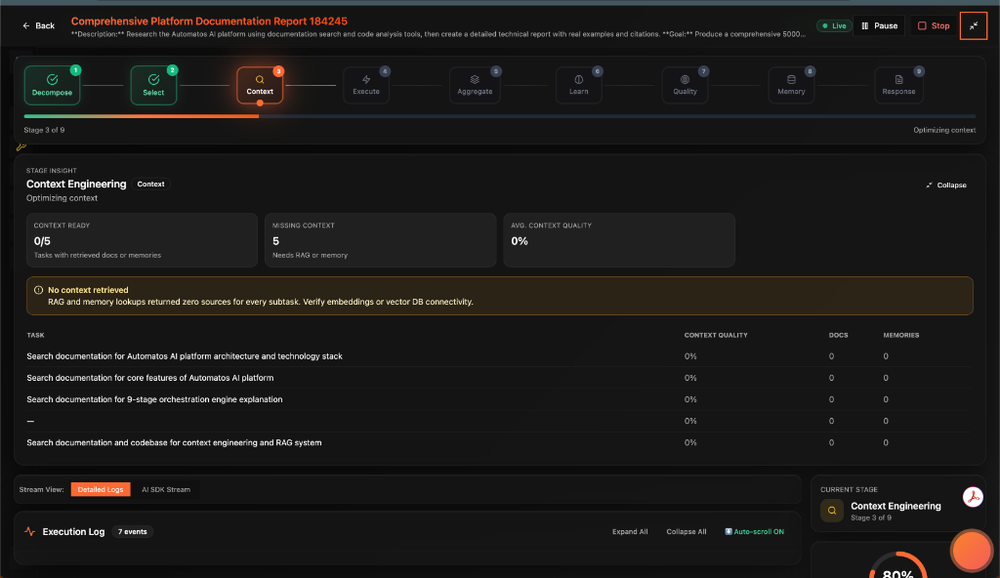
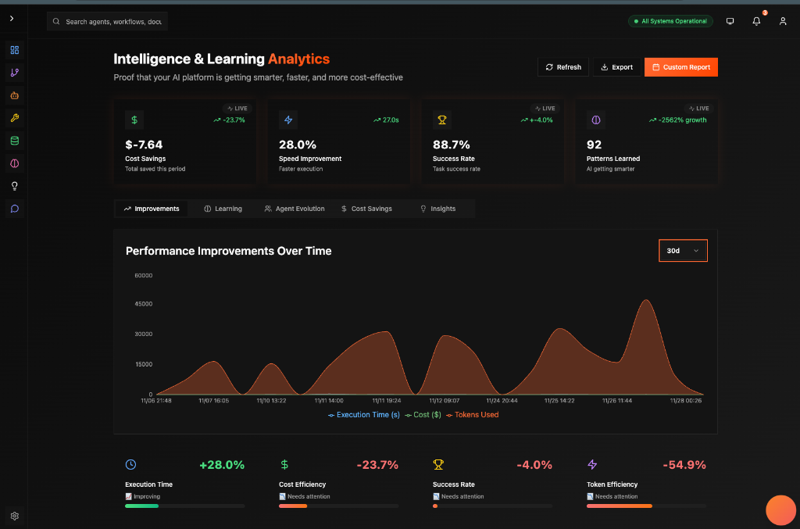

# Automatos AI 🤖

> **"From Atoms to Organisms: The Future of Multi-Agent Orchestration"**
> 🎓 **Research-Backed**: Implements [Context Engineering 2.0](RESEARCH.md) principles based on peer-reviewed research (SJTU/GAIR, 2025)

[](https://deepwiki.com/AutomatosAI/automatos-ai)
[](https://opensource.org/licenses/Apache-2.0)
[](https://coderabbit.ai)


**Automatos AI** is an enterprise-grade platform for creating, managing, and orchestrating intelligent AI agents. It goes beyond simple "chains" to create **autonomous software teams** that can plan, reason, collaborate, and execute complex workflows.

---

## 🚀 Why Automatos?

### 🧠 **True Multi-Agent Intelligence**
Agents don't just follow scripts. They **collaborate**.
- **Consensus Protocols**: Agents debate and vote on solutions.
- **Dynamic Teams**: The system assembles the right team for the job.
- **Self-Correction**: Agents monitor each other and fix errors in real-time.



### 📊 **Real-Time Analytics & Streaming**
Watch your agents think in real-time with our SSE-powered streaming architecture.
- **Live Execution Theater**: See every step, thought, and tool call.
- **Performance Metrics**: Track cost, latency, and success rates.
- **Predictive Insights**: AI forecasts potential bottlenecks.



### 🕸️ **CodeGraph Intelligence**
Your agents aren't blind. They see your entire codebase as a knowledge graph.
- **Semantic Search**: "Find where we handle authentication."
- **Symbol Resolution**: "Show me the `User` class hierarchy."
- **Impact Analysis**: "What breaks if I change this function?"


---

## 🏗️ The 4-Layer Architecture

Automatos is built on a modular, scalable foundation:

1.  **🔵 API Layer**: 52+ REST endpoints, SSE streaming, OpenAPI specs.
2.  **🟡 Modules Layer**: Self-contained domains (`agents`, `tools`, `codegraph`, `orchestrator`).
3.  **🔴 Consumers Layer**: Async workers for heavy lifting (RAG, workflows).
4.  **🟢 Core Layer**: The bedrock (PostgreSQL, Redis, LLM Gateway).

[👉 Read the Architecture Overview](docs/ARCHITECTURE_OVERVIEW.md)

---

## ⚡ Quick Start

Get running in **5 minutes**.

### Prerequisites
- Docker & Docker Compose
- OpenAI / Anthropic API Key

### 1. Clone & Configure
```bash
git clone https://github.com/AutomatosAI/automatos-ai.git
cd automatos-ai
cp .env.example .env
# Edit .env to add your API keys
```

### 2. Launch
```bash
docker-compose up
```

### 3. Explore
- **Frontend**: [http://localhost:3000](http://localhost:3000)
- **API Docs**: [http://localhost:8000/docs](http://localhost:8000/docs)

[👉 Full Quickstart Guide](docs/quickstart.md)

---

## 📚 Documentation

### **Getting Started**
- **[Quick Start](docs/quickstart.md)**: Zero to Hero in 5 mins.
- **[Developer Guide](docs/DEVELOPER_GUIDE.md)**: Local setup & contribution.
- **[Deployment](docs/DEPLOYMENT_GUIDE.md)**: Production best practices.

### **Core Modules**
- **[Orchestrator](orchestrator/modules/orchestrator/README.md)**: The brain of the system.
- **[Agents](docs/AGENT_SYSTEM_GUIDE.md)**: Lifecycle & coordination.
- **[CodeGraph](orchestrator/modules/codegraph/README.md)**: Code intelligence.
- **[Tools](docs/TOOLS_INTEGRATION_GUIDE.md)**: Registry & MCP.
- **[NL2SQL](orchestrator/modules/nl2sql/README.md)**: Database interaction.

---

## 🤝 Contributing

We are building the operating system for the agentic future. Join us!

- **[Contributing Guide](docs/CONTRIBUTING.md)**
- **[Discord Community](https://discord.gg/automatos)**
- **[GitHub Discussions](https://github.com/AutomatosAI/automatos-ai/discussions)**

---

<div align="center">

**[🌟 Star on GitHub](https://github.com/AutomatosAI/automatos-ai)** • **[📖 Read the Docs](https://docs.automatos.ai)** • **[💬 Join Discord](https://discord.gg/automatos)**

*Built with ❤️ by the Automatos AI Team*

</div>
