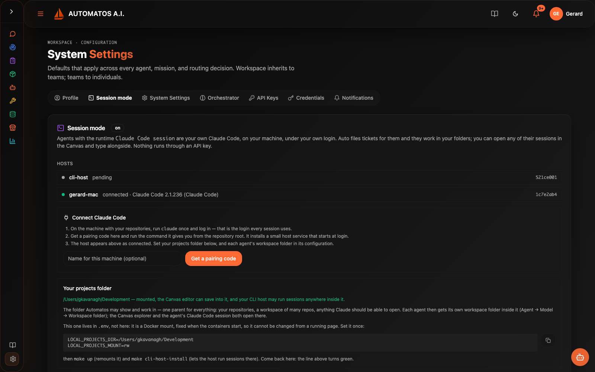
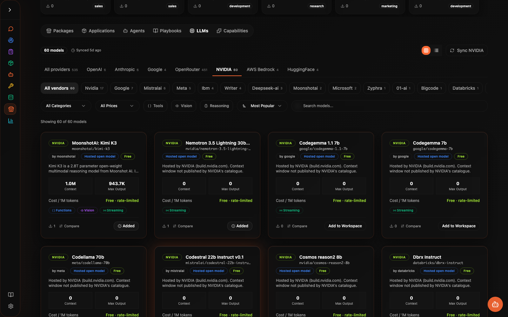
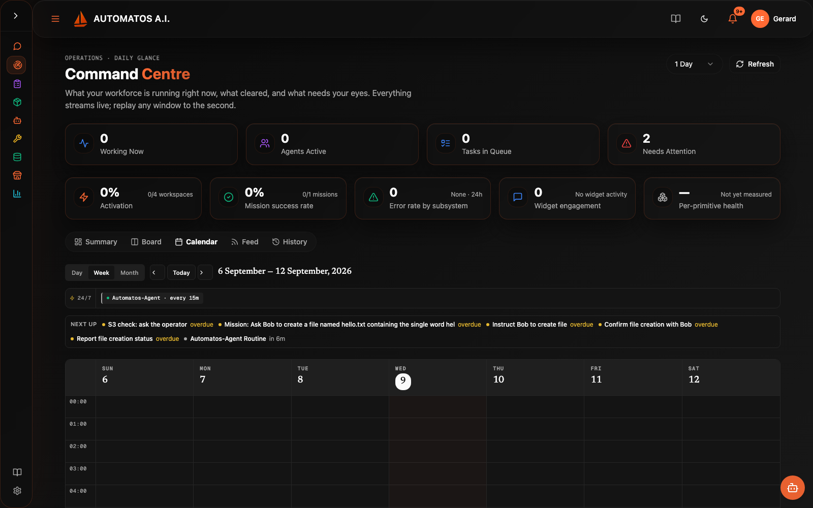

<div align="center">


# Automatos AI

**Build, deploy, and orchestrate autonomous AI agent teams.**

[](https://deepwiki.com/AutomatosAI/automatos-ai)
[](https://opensource.org/licenses/Apache-2.0)
[](https://coderabbit.ai)

</div>

---

Automatos AI is an open-source (Apache-2.0) platform for running teams of AI agents. You create agents, give them skills, tools and knowledge, run them through Playbooks and Missions, and read what they produced as Deliverables — with Auto, the assistant, as the front door and a Command Center for oversight. Agents run on the model routes you choose: paid APIs, free hosted open models, or — in the local edition — your own Claude Code subscription, managed by the platform.

## One codebase, three editions

| Edition | What it is | Status |
|---|---|---|
| **Local edition** | Clone the repo, set three secrets, `docker compose up`. No login, one workspace, one operator; Postgres + pgvector, Redis and MinIO in the stack; agents can act on files on your own machine through the workspace-worker, and your own Claude Code sessions can be agents. Bring your own keys — paid (OpenRouter, OpenAI, Anthropic, DeepSeek, …), free (NVIDIA's hosted open models) — and, optionally, your own Composio key. | Available — [QUICKSTART.md](QUICKSTART.md) · [self-hosting guide](docs/getting-started/self-hosting.md) |
| **Hosted edition** | The same code run as a service at [automatos.app](https://automatos.app): accounts, workspaces, teams and plans on top of it. | Available |
| **Enterprise** | Parked. No separate directory, no license keys, nothing built. | Not started |

The edition is a runtime flag (`AUTH_EDITION=local|saas`). Product capability is not gated: every agent, tool, Playbook, Mission and Deliverable feature in the code runs in the local edition. Session mode (your own Claude Code as an agent runtime) is local-only by design.

<p align="center">
  <strong>Marketplace agents &middot; Composio tool integrations (bring your own key) &middot; 400+ LLMs through OpenRouter, direct keys, or NVIDIA for free &middot; Your own Claude Code as an agent &middot; Reusable skills</strong>
</p>

<br>

## Talk to your agents

One chat, routed to the right agent. The conversation stays where you left it across pages and reloads, opens several conversations as tabs, and a reply finishes even if the browser leaves mid-answer. Auto works in the open: its thinking streams into a collapsible block that gives way to the answer, every tool call stays visible as a line in the activity trail, and when it files a ticket for another agent it can wait, re-check, and report back in the same thread. Quick actions jump straight into coding, creating agents, managing knowledge, or building Playbooks.

<p align="center">
  
</p>

<br>

## Manage your AI workforce

100+ agents in the community marketplace — install what you need, when you need it. Code Reviewer, QA Engineer, Sentinel, Scribe, researcher and marketer roles, Shopify specialists, and more. Each agent has its own model route, capabilities, persona, and performance metrics. An agent is either an **API agent** (a model route you installed) or a **session agent** (your own Claude Code on your machine, below); you mix them freely on the same board.

<p align="center">
  
</p>

<br>

## Your own Claude Code, managed

Session mode turns your Claude Code subscription into an agent runtime — without an API key and inside Anthropic's terms. Pair a small host process on the machine that holds your repositories, give an agent the runtime *Claude Code session*, and Automatos becomes the manager above it:

- **Auto files the tickets; the board tracks them.** A ticket for a session agent is claimed by your host, runs as a real interactive Claude Code session under your own login, and lands like any other agent's work: files become Deliverables, the session log becomes the task report, and a permission question the session asks surfaces as an approval card.
- **The agent's persona and skills ride into the session.** What you configured on the agent is what the session is told; playbook steps and mission tasks reach session agents through the same ticket lane.
- **The Runtime Canvas.** Pick a session agent in the chat and the Canvas opens full-screen: a file explorer on the agent's workspace folder on the left, and on the right a terminal in which the host has already launched that agent's own Claude Code session — resumed if it exists. You type alongside it.
- **Your folders, your rules.** The host only runs sessions inside directories you registered; a git repository gets a worktree per ticket; sessions never push. The Claude Code binary is never modified, no token is ever touched or stored, and `-p` and `--bare` are never used.

<p align="center">
  
</p>

<br>

## 1,000+ tool integrations

Connect your agents to GitHub, Slack, Jira, Stripe, Shopify, Datadog, Notion, HubSpot, and a thousand more through the Composio catalogue. Browse, install, and assign integrations to specific agents from a single dashboard — no glue code, no per-tool SDKs. In the local edition this needs your own `COMPOSIO_API_KEY`; without one the Tools page says so and the native platform tools keep working.

<p align="center">
  
</p>

<br>

## Tools chosen by meaning, not by menu

An agent with a hundred and eighty platform actions cannot be handed all of them on every turn. Before the prompt is assembled, the platform embeds your message and ranks the action catalogue by semantic similarity, so the model is offered the handful of tools that fit what you asked — one ranking per turn, shared by every surface that needs it, cached, and never replaced by the full list when the embedding is slow. Selections and outcomes feed the Intent Graph, the learned layer that ranks by what worked for phrasings like yours; it is seeded from example utterances so it is useful on day one, and a measured uplift gate decides whether it is allowed to route.

## Workspace templates — entire teams in one click

Packaged bundles install a full operations team in a single step — agents, skills, playbooks, and dashboard widgets pre-wired together. Example: the **Shopify package** ships with 12 specialised agents, 32 Shopify skills, and a widget set for store ops, inventory, merchandising, SEO, campaigns, and customer support. Install it once, and your workspace goes from empty to a running e-commerce back office.

## 150+ reusable skills

Skills are portable, versioned capability packs — a system prompt, a set of tools, and an output contract. Drop *Sentinel* onto a security agent, *Scout* onto a research agent, or write your own. One skill, any agent, instantly productive. For a session agent the same skills are rendered into its Claude Code session.

## Paid, free, or on your subscription — one router

Every model provider is a route in one registry, and a model is installed *per route*. **Marketplace → LLMs** has a tab per provider and shows one card per route with that route's own price: *Kimi K3 · NVIDIA* is free, *Kimi K3 · OpenRouter* is $3 / $15 per million tokens, and installing one tags your workspace with that provider. The runtime routes to the tag — a free route is never silently rerouted to a paid one when it is busy.

- **OpenRouter** — one key, 400+ models, priced per call.
- **Direct keys** — OpenAI, Anthropic, Google, DeepSeek, Azure OpenAI, AWS Bedrock, Grok / xAI.
- **NVIDIA** — the hosted open models on build.nvidia.com (Kimi, DeepSeek, Nemotron, Llama, Mistral, …) at no charge, under NVIDIA's trial terms and rate limit; the key is your own agreement with NVIDIA.
- **Your Claude Code subscription** — as a session agent, not as an API.

Mix cheap models for heartbeat work with frontier models for reasoning, and see what each route did and cost per request.

<p align="center">
  
</p>

<br>

## Command centre

See your entire AI workforce at a glance: live agent status, the board as a queue (Inbox → Assigned → In Progress → Review → Done), scheduled routines, and agent reports. Dragging a ticket to In Progress or pressing Run Now is the approval. The calendar shows heartbeats and schedules, board deadlines on the grid, and lets you or Auto schedule a board task for later — it is filed on the board when it fires.

<p align="center">
  
</p>

<p align="center">
  
</p>

<br>

## Full cost visibility

Every call is recorded with the provider that served it and how it bills — a paid API route, a free NVIDIA route, a Claude Code subscription session, an embedding, a rerank. Analytics shows cost by provider, spend by lane (chat, board tickets, missions, heartbeats, retrieval), cost by agent for the selected period, cost by route over time, cache reads, failed calls, and a monthly projection. A session agent shows the tokens it used and "plan" instead of a dollar figure it never spent.

<p align="center">
  
</p>

<br>

## Knowledge bases with a graph

Upload documents, sync folders from Dropbox and cloud storage (the cloud connectors run through Composio), and let the platform chunk, embed, and index everything automatically. Your agents get RAG-powered access to your knowledge base — on pgvector in the local edition, on S3 Vectors in the hosted one — plus the Knowledge Graph built from it (entities, relationships, clusters), a CodeGraph of your repositories, and the memory layer, each with its own tab.

<p align="center">
  
</p>

---

## Core capabilities

| Capability | What it does |
|---|---|
| **Universal Router** | Multi-tier routing (cache, rules, semantic, LLM) sends messages to the right agent every time |
| **Semantic tool selection** | Ranks the action catalogue against each message before the prompt is built; the Intent Graph learns from outcomes |
| **Session mode** | Your own Claude Code sessions as agents — tickets, persona, skills, Deliverables, approvals, and a Canvas terminal (local edition) |
| **Provider registry** | One registry of model providers; models installed per route with per-route prices; paid, free and subscription side by side |
| **Playbooks & Missions** | Multi-step automation with scheduling, triggers, and inter-agent coordination |
| **Calendar & board** | The board is the work queue; the calendar shows routines, deadlines and scheduled tickets |
| **Prompt Optimisation** | A/B test and score prompts against live traffic, automatically improve agent performance |
| **Workspace Execution** | Sandboxed environments where agents run code, manage files, and interact with Git repos |
| **Cost analytics** | Every call tagged with provider and billing; cost by provider, lane, agent and route |
| **Multi-Tenancy** | Full workspace isolation in the hosted edition — each team gets their own agents, data, and configuration |
| **Plugin System** | Extend agents with skills, plugins, and custom tools from the marketplace or your own repos |

---

## Quick start (local edition)

```bash
git clone https://github.com/AutomatosAI/automatos-ai.git
cd automatos-ai
cp .env.example .env    # set the 3 required secrets: POSTGRES_PASSWORD, REDIS_PASSWORD, API_KEY
make up                 # first run builds the images and the database schema
```

Then open http://localhost:3000 (API reference at http://localhost:8000/docs).
No login. Add one model key and run the seeded *Two-minute brief* Playbook:

- `OPENROUTER_API_KEY` (400+ models), or `OPENAI_API_KEY` / `ANTHROPIC_API_KEY` / `DEEPSEEK_API_KEY`;
- `NVIDIA_API_KEY` from build.nvidia.com runs the hosted open models for free — in Marketplace → LLMs open the NVIDIA tab, sync once, add a model;
- keys can also be added later under Settings → API Keys.

To run your own Claude Code as an agent: set `CLI_RUNTIME_ENABLED=true` and `LOCAL_PROJECTS_DIR=/path/to/your/projects` in `.env`, `make up`, then Settings → Session mode → *Get a pairing code* and run the command it shows. [QUICKSTART.md](QUICKSTART.md) is the short walkthrough; [docs/getting-started/self-hosting.md](docs/getting-started/self-hosting.md) covers every service, dial, session mode in depth, and what the local edition does not include.

---

## Tech stack

| Layer | Technology |
|---|---|
| Frontend | Next.js 15, React, TypeScript, Tailwind CSS, shadcn/ui |
| Backend | Python 3.11, FastAPI, SQLAlchemy, Alembic |
| Data | PostgreSQL 16 with pgvector, Redis 7 |
| AI | One provider registry: OpenRouter, OpenAI, Anthropic, Google, DeepSeek, NVIDIA (free, trial), Azure OpenAI, AWS Bedrock, Grok; bring your own keys |
| Session runtime | A CLI host on your machine runs your own unmodified Claude Code sessions (local edition) |
| Object storage | S3 API — MinIO in the local stack, AWS S3 (+ S3 Vectors for RAG) in the hosted edition |
| Auth | None in the local edition (`AUTH_EDITION=local`); Clerk in the hosted edition |
| Runtime | Docker Compose (local); Railway (hosted) |

---

## Documentation

Platform documentation lives in [`/docs`](docs/README.md) — architecture, APIs, agents, Playbooks, deployment. Most pages are generated from [DeepWiki](https://deepwiki.com/AutomatosAI/automatos-ai); the self-hosting guide, the analytics cost-tracking note and the contributing guide are maintained by hand.

---

## Contributing

See [CONTRIBUTING.md](CONTRIBUTING.md). Two things to know before the first PR:

- **Sign off every commit** (`git commit -s`). The `Signed-off-by:` trailer is your [Developer Certificate of Origin](https://developercertificate.org) attestation and the `dco` check verifies it on each pull request. There is no CLA; contributions are Apache-2.0 and ship in every edition.
- **Capability first, core second.** Skills, tools, MCP integrations, Playbooks and agent packages reach both editions unchanged and never conflict with core. Open an issue first for anything touching auth, storage, the tool router or a migration.

---

<div align="center">

**[Star on GitHub](https://github.com/AutomatosAI/automatos-ai)** &middot; **[Read the Docs](docs/README.md)** &middot; **[DeepWiki](https://deepwiki.com/AutomatosAI/automatos-ai)**

*Apache 2.0 &middot; Built by the Automatos AI team*

</div>
