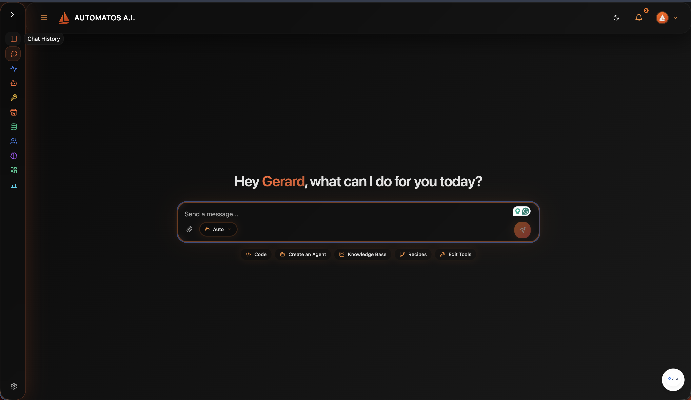
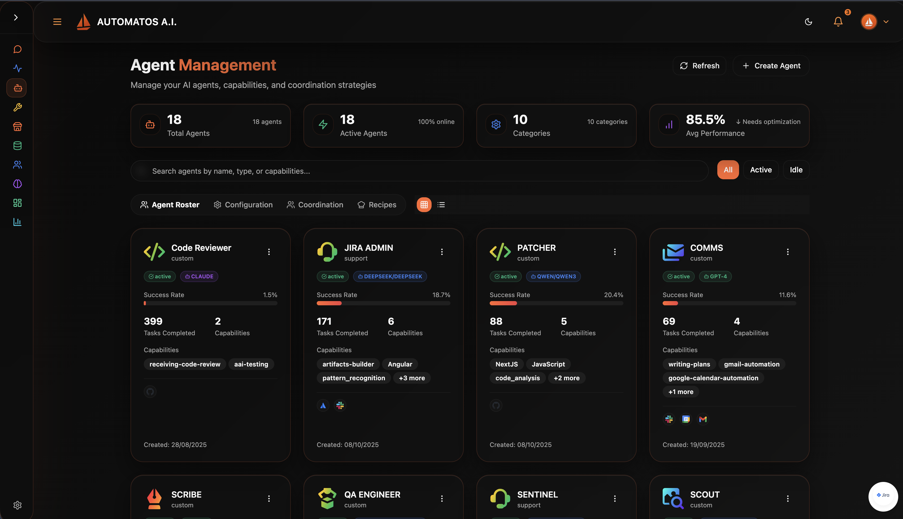
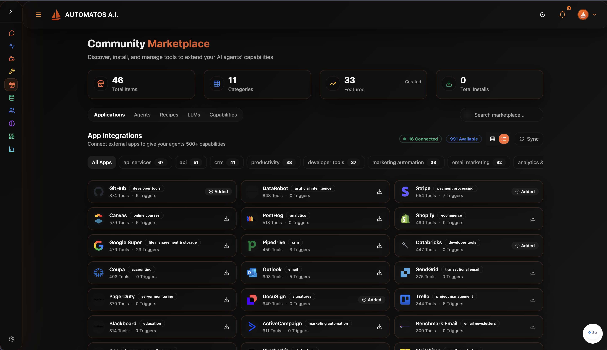
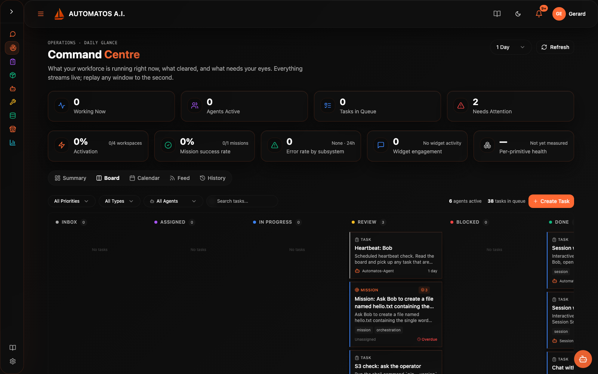
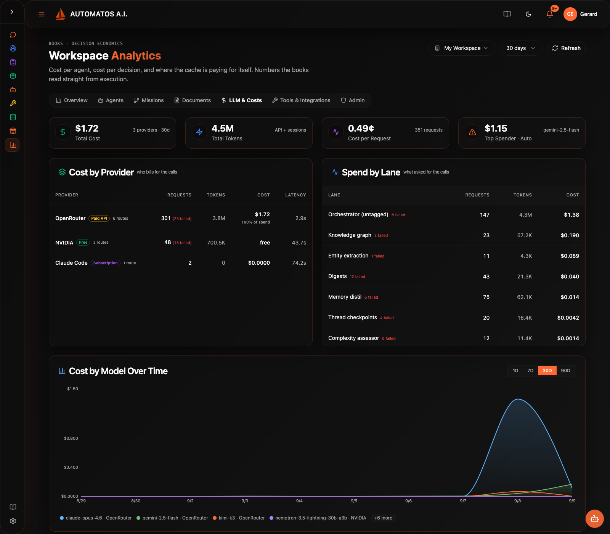
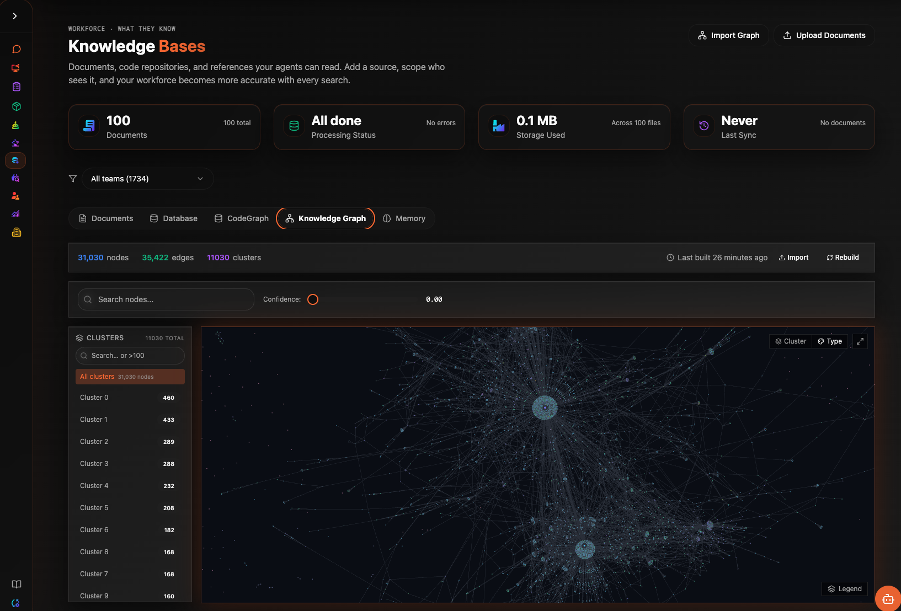

<div align="center">


# Automatos AI

**Build, deploy, and orchestrate autonomous AI agent teams.**

[](https://deepwiki.com/AutomatosAI/automatos-ai)
[](https://opensource.org/licenses/Apache-2.0)
[](https://coderabbit.ai)

</div>

---

Automatos AI is an open-source platform for building AI workforces. Create specialised agents, equip them with tools and knowledge, schedule their work, and let them operate autonomously — reporting back through a unified command centre.

It is not a chatbot wrapper. It is an operating system for AI agents.

<p align="center">
  <strong>100+ marketplace agents &middot; 1,000+ tool integrations &middot; 300+ LLMs &middot; 150+ skills &middot; Bring-your-own-keys</strong>
</p>

<br>

## Talk to your agents

A unified chat interface that routes your messages to the right agent automatically. Quick actions let you jump straight into coding, creating agents, managing knowledge, or building recipes.

<p align="center">
  
</p>

<br>

## Manage your AI workforce

100+ agents in the community marketplace — install what you need, when you need it. Code Reviewer, QA Engineer, Sentinel, Scribe, researcher and marketer roles, Shopify specialists, and more. Each agent has its own model configuration, capabilities, persona, and performance metrics. Install from the marketplace or build a custom agent in seconds.

<p align="center">
  
</p>

<br>

## 1,000+ tool integrations

Connect your agents to GitHub, Slack, Jira, Stripe, Shopify, Datadog, Notion, HubSpot, and a thousand more through the community marketplace. Browse, install, and assign integrations to specific agents from a single dashboard — no glue code, no per-tool SDKs.

<p align="center">
  
</p>

<br>

## Workspace templates — entire teams in one click

Packaged bundles install a full operations team in a single step — agents, skills, playbooks, and dashboard widgets pre-wired together. Example: the **Shopify package** ships with 12 specialised agents, 32 Shopify skills, and a widget set for store ops, inventory, merchandising, SEO, campaigns, and customer support. Install it once, and your workspace goes from empty to a running e-commerce back office.

## 150+ reusable skills

Skills are portable, versioned capability packs — a system prompt, a set of tools, and an output contract. Drop *Sentinel* onto a security agent, *Scout* onto a research agent, or write your own. One skill, any agent, instantly productive.

## 300+ LLMs, one router

Route any agent to any model. OpenAI, Anthropic, Google, DeepSeek, GLM, Mistral, Qwen, Llama — through OpenRouter or direct provider keys. Mix cheap models for heartbeat work with frontier models for reasoning, and see the cost impact per request.

## Command centre

See your entire AI workforce at a glance. Live agent status, scheduled routines, task completion metrics, and agent reports — all in one place. Agents report their findings so you don't have to check on them.

<p align="center">
  
</p>

<br>

## Full cost visibility

Track every API call across every model. See cost per agent, cost per request, usage trends over time, and cost projections. Know exactly what your AI workforce costs before the bill arrives.

<p align="center">
  
</p>

<br>

## Knowledge bases with cloud sync

Upload documents, sync folders from Dropbox and cloud storage, and let the platform chunk, embed, and index everything automatically. Your agents get RAG-powered access to your entire knowledge base.

<p align="center">
  
</p>

---

## Core capabilities

| Capability | What it does |
|---|---|
| **Universal Router** | Multi-tier routing (cache, rules, semantic, LLM) sends messages to the right agent every time |
| **Recipes & Workflows** | Multi-step automation with scheduling, triggers, and inter-agent coordination |
| **Prompt Optimisation** | A/B test and score prompts against live traffic, automatically improve agent performance |
| **Workspace Execution** | Sandboxed environments where agents run code, manage files, and interact with Git repos |
| **Multi-Tenancy** | Full workspace isolation — each team gets their own agents, data, and configuration |
| **Plugin System** | Extend agents with skills, plugins, and custom tools from the marketplace or your own repos |

---

## Quick start

```bash
git clone https://github.com/AutomatosAI/automatos-ai.git
cd automatos-ai
cp .env.example .env    # set the 3 required secrets: POSTGRES_PASSWORD, REDIS_PASSWORD, API_KEY
docker compose up
```

The local edition runs with **no login** and a single default workspace. Compose
needs only those three secrets set; add an LLM key (`OPENAI_API_KEY` /
`ANTHROPIC_API_KEY` / OpenRouter) when you want AI features. See
[QUICKSTART.md](QUICKSTART.md) for the full walkthrough and what does / doesn't
work out of the box.

- **Frontend**: http://localhost:3000
- **API Docs**: http://localhost:8000/docs

---

## Tech stack

| Layer | Technology |
|---|---|
| Frontend | Next.js 14, TypeScript, Tailwind CSS, shadcn/ui |
| Backend | Python, FastAPI, SQLAlchemy, Alembic |
| Database | PostgreSQL, Redis |
| AI | OpenRouter, OpenAI, Anthropic, DeepSeek (multi-provider) |
| Storage | AWS S3, S3 Vectors |
| Auth | Clerk |
| Infra | Docker, Railway |

---

## Documentation

Full platform documentation is available in [`/docs`](docs/README.md), auto-synced from [DeepWiki](https://deepwiki.com/AutomatosAI/automatos-ai) — 100+ pages covering architecture, APIs, agents, workflows, and deployment.

---

## Contributing

We're building the operating system for the agentic future. Contributions welcome.

1. Fork the repo
2. Create a feature branch
3. Submit a PR

---

<div align="center">

**[Star on GitHub](https://github.com/AutomatosAI/automatos-ai)** &middot; **[Read the Docs](docs/README.md)** &middot; **[DeepWiki](https://deepwiki.com/AutomatosAI/automatos-ai)**

*Apache 2.0 &middot; Built by the Automatos AI team*

</div>
