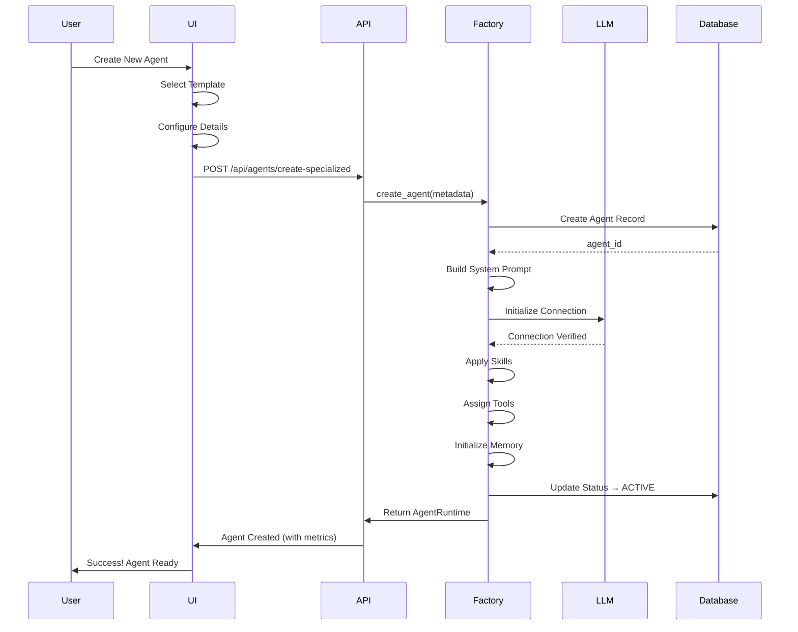
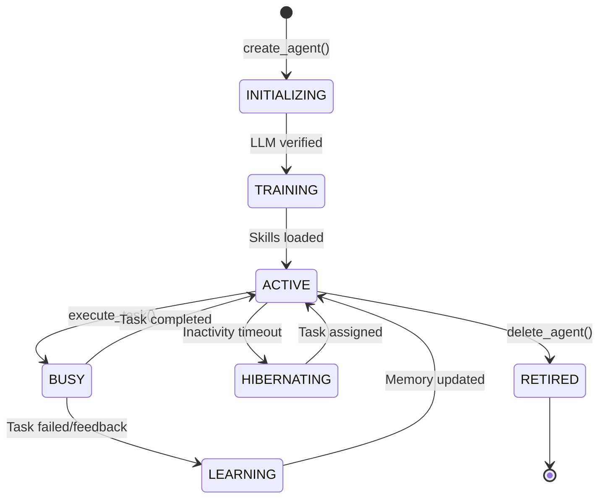

# 🤖 Agent System Complete Guide

*Master the world's most advanced AI agent system - from creation to orchestration*

---

## 📖 Table of Contents

1. [Overview](#overview)
2. [Agent Factory Architecture](#agent-factory-architecture)
3. [Agent Types & Capabilities](#agent-types--capabilities)
4. [Multi-Model Agent Support](#multi-model-agent-support)
5. [LLM-Driven Orchestration](#llm-driven-orchestration)
6. [Agent Lifecycle Management](#agent-lifecycle-management)
7. [Real-World Examples](#real-world-examples)
8. [API Reference](#api-reference)
9. [UI Integration](#ui-integration)
10. [Troubleshooting](#troubleshooting)
11. [FAQ](#faq)

---

## Overview

### What is the Agent System?

The Automatos AI Agent System is a revolutionary approach to AI agent management that treats agents as **living, intelligent entities** rather than simple API wrappers. Each agent is a specialized "cell" in the Context Engineering paradigm, with its own:

- **🧠 LLM Connection**: Real API connection to OpenAI, Anthropic, or HuggingFace
- **💪 Specialized Skills**: Domain expertise through enhanced prompting
- **🔧 Tool Access**: MCP tools, file operations, shell commands
- **🧩 Memory System**: Persistent memory across sessions
- **📊 Performance Tracking**: Real-time metrics and continuous learning
- **🤝 Collaboration**: Inter-agent communication and shared context

### Why Specialized Agents?

Traditional automation: **One size fits all** ❌
- Same prompts for all tasks
- No domain expertise
- No learning or improvement
- Poor quality on specialized tasks

Automatos AI approach: **Specialized experts** ✅
- Each agent type optimized for specific domains
- Skill-based enhancement of capabilities
- Continuous learning from execution
- High-quality results through specialization

### Key Statistics

| Metric | Value |
|--------|-------|
| **Agent Types** | 5+ specialized types |
| **Supported Models** | OpenAI, Anthropic, HuggingFace |
| **Skills Available** | 40+ skill categories |
| **Tool Integrations** | 400+ MCP tools available |
| **Average Quality Score** | 0.92/1.00 (92%) |
| **Success Rate** | 94%+ task completion |

---

## Agent Factory Architecture

### The Factory Pattern

The Agent Factory implements the **Factory Design Pattern** to create fully-functional AI agents with real capabilities. It's not just creating database records - it's instantiating living, intelligent entities.

```
┌─────────────────────────────────────────────────────────────────┐
│                    AGENT CREATION PIPELINE                       │
├─────────────────────────────────────────────────────────────────┤
│                                                                  │
│  1. TEMPLATE SELECTION                                           │
│     └─> Choose agent type (Code Architect, Security Expert...)  │
│     └─> Load default configuration                              │
│     └─> Set base system prompt                                  │
│                                                                  │
│  2. CONFIGURATION                                                │
│     └─> Agent details (name, description)                       │
│     └─> Model selection (GPT-4, Claude, etc.)                   │
│     └─> Skills assignment                                       │
│     └─> Tool permissions                                        │
│                                                                  │
│  3. LLM INITIALIZATION                                           │
│     └─> Create LLM manager instance                             │
│     └─> Configure provider (OpenAI/Anthropic)                   │
│     └─> Set model parameters (temp, max_tokens)                 │
│     └─> Verify API connection                                   │
│                                                                  │
│  4. SKILL ENHANCEMENT                                            │
│     └─> Apply skill-specific prompting                          │
│     └─> Add domain knowledge                                    │
│     └─> Include example patterns                                │
│     └─> Configure skill parameters                              │
│                                                                  │
│  5. TOOL ASSIGNMENT                                              │
│     └─> Connect MCP servers                                     │
│     └─> Assign file operations                                  │
│     └─> Enable shell commands (if permitted)                    │
│     └─> Set tool permissions                                    │
│                                                                  │
│  6. MEMORY INITIALIZATION                                        │
│     └─> Create memory structures                                │
│     └─> Set retention policies                                  │
│     └─> Initialize working memory                               │
│     └─> Connect to knowledge base                               │
│                                                                  │
│  7. RUNTIME CREATION                                             │
│     └─> Create AgentRuntime object                              │
│     └─> Register in active agents pool                          │
│     └─> Set up performance tracking                             │
│     └─> Enable communication channels                           │
│                                                                  │
│  8. VERIFICATION & ACTIVATION                                    │
│     └─> Test LLM connection                                     │
│     └─> Verify tool access                                      │
│     └─> Run capability tests                                    │
│     └─> Mark as ACTIVE                                          │
│                                                                  │
└─────────────────────────────────────────────────────────────────┘
```

### Agent Factory Components

#### Core Factory Class

```python
@dataclass
class AgentRuntime:
    """Runtime representation of an agent with full capabilities"""
    agent_id: int
    agent: Agent  # Database model
    llm_manager: LLMManager  # REAL LLM connection
    lifecycle_state: AgentLifecycle
    short_term_memory: deque
    metadata: AgentMetadata
    performance_metrics: Dict[str, Any]
    created_at: datetime
    
    # Agent capabilities
    def execute_task(self, task: Dict) -> Dict[str, Any]:
        """Execute a task using the agent's LLM and tools"""
        
    def update_memory(self, interaction: Dict):
        """Update agent's memory with new experience"""
        
    def get_performance(self) -> Dict[str, Any]:
        """Get current performance metrics"""
```

#### Agent Metadata Structure

```python
@dataclass
class AgentMetadata:
    """Complete agent metadata configuration"""
    name: str
    agent_type: str
    description: Optional[str] = None
    skills: List[str] = field(default_factory=list)
    
    # Model Configuration
    model_config: Optional[ModelConfiguration] = None
    
    # Tool Configuration
    tool_categories: List[str] = field(default_factory=list)
    
    # Memory Configuration
    memory_retention_days: int = 30
    
    # Custom metadata
    custom_metadata: Dict[str, Any] = field(default_factory=dict)
```

### Creation Flow Diagram



### Skill Enhancement System

Skills transform a generic agent into a specialized expert through **prompt engineering enhancements**:

```python
SKILL_ENHANCEMENTS = {
    "code_analysis": """
You are an expert code reviewer with deep knowledge of:
- Software architecture patterns and anti-patterns
- Code quality metrics and best practices
- Security vulnerabilities (OWASP Top 10)
- Performance optimization techniques
- Clean code principles (SOLID, DRY, KISS)

When analyzing code, you:
1. Review architecture and design patterns
2. Identify security vulnerabilities
3. Spot performance bottlenecks
4. Check code quality and readability
5. Suggest improvements with examples
""",
    
    "security_audit": """
You are a cybersecurity expert specializing in:
- Application security (OWASP Top 10)
- Infrastructure security (cloud, containers, networks)
- Authentication and authorization systems
- Data protection and encryption
- Compliance standards (SOC2, GDPR, PCI-DSS)

When performing security audits, you:
1. Identify vulnerabilities systematically
2. Assess risk levels (Critical, High, Medium, Low)
3. Provide detailed remediation steps
4. Reference security standards and best practices
5. Consider the full security lifecycle
""",
    
    "data_processing": """
You excel at data transformation and analysis with expertise in:
- Data validation and cleaning
- Statistical analysis and modeling
- Data pipeline design
- ETL/ELT processes
- Data quality assessment

When processing data, you:
1. Validate data integrity and completeness
2. Clean and transform data appropriately
3. Apply statistical analysis where relevant
4. Document transformations clearly
5. Handle edge cases and errors gracefully
"""
}
```

---

## Agent Types & Capabilities

### 1. Code Architect Agent

**Purpose**: Software architecture, code review, and system design

**Skills**:
- `code_analysis` - Advanced code quality analysis
- `system_design` - Scalable architecture patterns
- `api_design` - RESTful/GraphQL API design
- `refactoring` - Code optimization and restructuring

**Model Recommendation**: GPT-4 Turbo (excellent coding capabilities)

**Example Use Cases**:
- Reviewing pull requests for code quality
- Designing system architecture for new features
- Refactoring legacy code
- API endpoint design and documentation

**Configuration**:
```json
{
  "name": "CodeMaster Pro",
  "agent_type": "code_architect",
  "model_config": {
    "provider": "openai",
    "model_id": "gpt-4-turbo-preview",
    "temperature": 0.7,
    "max_tokens": 4000
  },
  "skills": ["code_analysis", "system_design", "api_design"],
  "tools": ["github", "file_operations", "codegraph"]
}
```

### 2. Security Expert Agent

**Purpose**: Security auditing, vulnerability assessment, compliance checking

**Skills**:
- `security_audit` - Vulnerability identification
- `compliance` - Standards validation (SOC2, GDPR)
- `penetration_testing` - Security testing
- `threat_modeling` - Risk assessment

**Model Recommendation**: Claude 3 Opus (excellent analysis capabilities)

**Example Use Cases**:
- Automated security reviews of pull requests
- Compliance checking before deployments
- Vulnerability scanning and remediation
- Security documentation generation

**Configuration**:
```json
{
  "name": "SecurityGuardian",
  "agent_type": "security_expert",
  "model_config": {
    "provider": "anthropic",
    "model_id": "claude-3-opus-20240229",
    "temperature": 0.2,
    "max_tokens": 3000
  },
  "skills": ["security_audit", "compliance", "threat_modeling"],
  "tools": ["file_operations", "shell_commands", "mcp:owasp"]
}
```

### 3. Data Analyst Agent

**Purpose**: Data analysis, statistical modeling, insights generation

**Skills**:
- `data_processing` - Data transformation and cleaning
- `statistics` - Statistical analysis
- `visualization` - Data visualization
- `ml_modeling` - Machine learning models

**Model Recommendation**: GPT-4 (balanced performance for data tasks)

**Example Use Cases**:
- Analyzing business metrics
- Statistical modeling and forecasting
- Data quality assessment
- Generating insights reports

### 4. Performance Optimizer Agent

**Purpose**: Performance analysis, optimization, scalability assessment

**Skills**:
- `performance_analysis` - Bottleneck identification
- `scalability` - Scalability assessment
- `optimization` - Performance tuning
- `profiling` - Code profiling

**Model Recommendation**: GPT-4 Turbo (technical analysis)

### 5. Infrastructure Manager Agent

**Purpose**: Cloud infrastructure, DevOps, deployment automation

**Skills**:
- `cloud_architecture` - Cloud-native design
- `kubernetes` - Container orchestration
- `ci_cd` - Pipeline automation
- `monitoring` - Observability setup

**Model Recommendation**: Claude 3 Sonnet (balanced for infrastructure)

### Capability Matrix

| Agent Type | Code Review | Security | Data Analysis | Performance | Infrastructure |
|-----------|-------------|----------|---------------|-------------|----------------|
| **Code Architect** | ⭐⭐⭐⭐⭐ | ⭐⭐⭐ | ⭐⭐ | ⭐⭐⭐ | ⭐⭐ |
| **Security Expert** | ⭐⭐⭐ | ⭐⭐⭐⭐⭐ | ⭐⭐ | ⭐⭐ | ⭐⭐⭐ |
| **Data Analyst** | ⭐⭐ | ⭐ | ⭐⭐⭐⭐⭐ | ⭐⭐ | ⭐ |
| **Performance Optimizer** | ⭐⭐⭐⭐ | ⭐⭐ | ⭐⭐⭐ | ⭐⭐⭐⭐⭐ | ⭐⭐⭐ |
| **Infrastructure Manager** | ⭐⭐ | ⭐⭐⭐⭐ | ⭐⭐ | ⭐⭐⭐ | ⭐⭐⭐⭐⭐ |

---

## Multi-Model Agent Support

### Overview

Automatos AI supports **multiple LLM providers and models** per agent, allowing you to select the optimal model based on:
- **Task requirements** - Complex reasoning vs. simple tasks
- **Cost considerations** - GPT-4 vs. GPT-3.5 vs. Claude
- **Capability needs** - Function calling, vision, large context
- **Performance goals** - Speed vs. quality tradeoffs

### Supported Models

#### OpenAI Models

| Model | Context Window | Cost (Input) | Cost (Output) | Best For |
|-------|---------------|--------------|---------------|----------|
| **GPT-4 Turbo** | 128K tokens | $0.01/1K | $0.03/1K | Complex reasoning, code |
| **GPT-4** | 8K tokens | $0.03/1K | $0.06/1K | High-quality analysis |
| **GPT-3.5 Turbo** | 16K tokens | $0.0005/1K | $0.0015/1K | Simple tasks, high volume |

#### Anthropic Models

| Model | Context Window | Cost (Input) | Cost (Output) | Best For |
|-------|---------------|--------------|---------------|----------|
| **Claude 3 Opus** | 200K tokens | $0.015/1K | $0.075/1K | Complex analysis, research |
| **Claude 3 Sonnet** | 200K tokens | $0.003/1K | $0.015/1K | Balanced tasks, workflows |
| **Claude 3 Haiku** | 200K tokens | $0.00025/1K | $0.00125/1K | High volume, cost-sensitive |

### Model Configuration

```python
# Complete model configuration
model_config = ModelConfiguration(
    provider="openai",               # or "anthropic"
    model_id="gpt-4-turbo-preview",  # Specific model
    temperature=0.7,                 # 0.0-2.0 (lower = more focused)
    max_tokens=4000,                 # Max output length
    top_p=1.0,                       # Nucleus sampling
    frequency_penalty=0.0,           # Reduce repetition
    presence_penalty=0.0,            # Encourage new topics
    fallback_model_id="gpt-3.5-turbo"  # Fallback if primary fails
)
```

### Model Selection Guidelines

#### For Code Tasks → GPT-4 Turbo
```python
{
  "provider": "openai",
  "model_id": "gpt-4-turbo-preview",
  "temperature": 0.7,
  "max_tokens": 4000
}
```
**Why**: Excellent code understanding, function calling support, large context

#### For Security Audits → Claude 3 Opus
```python
{
  "provider": "anthropic",
  "model_id": "claude-3-opus-20240229",
  "temperature": 0.2,
  "max_tokens": 3000
}
```
**Why**: Superior analysis capabilities, thorough reasoning, long context

#### For High-Volume Tasks → GPT-3.5 Turbo / Claude Haiku
```python
{
  "provider": "openai",
  "model_id": "gpt-3.5-turbo",
  "temperature": 0.5,
  "max_tokens": 2000
}
```
**Why**: Fast response, low cost, good quality for simple tasks

### Model Selection Architecture

```
┌─────────────────────────────────────────────────────────────────┐
│                    MODEL REGISTRY SYSTEM                         │
├─────────────────────────────────────────────────────────────────┤
│                                                                  │
│  DATABASE: llm_models Table                                      │
│  ┌────────────────────────────────────────────────────┐         │
│  │ Model Metadata:                                    │         │
│  │ - Provider, model_id, display_name                 │         │
│  │ - Context window, max output tokens                │         │
│  │ - Cost per 1K tokens (input/output)                │         │
│  │ - Capabilities (reasoning, coding, analysis)       │         │
│  │ - Recommended use cases                            │         │
│  │ - Support for functions, vision, streaming         │         │
│  └────────────────────────────────────────────────────┘         │
│                         │                                        │
│                         ▼                                        │
│  MODEL REGISTRY SERVICE                                          │
│  ┌────────────────────────────────────────────────────┐         │
│  │ Methods:                                           │         │
│  │ - get_all_models(provider, status)                 │         │
│  │ - get_model(model_id)                              │         │
│  │ - get_recommended_models(task_type)                │         │
│  │ - find_best_model(requirements)                    │         │
│  │ - estimate_cost(model, input, output)              │         │
│  └────────────────────────────────────────────────────┘         │
│                         │                                        │
│                         ▼                                        │
│  AGENT FACTORY                                                   │
│  ┌────────────────────────────────────────────────────┐         │
│  │ Uses model_config to:                              │         │
│  │ - Initialize correct LLM provider                  │         │
│  │ - Configure model parameters                       │         │
│  │ - Set up fallback models                           │         │
│  │ - Track model usage and cost                       │         │
│  └────────────────────────────────────────────────────┘         │
│                                                                  │
└─────────────────────────────────────────────────────────────────┘
```

---

## LLM-Driven Orchestration

### The Software 3.0 Paradigm

Automatos AI implements **LLM-driven agent selection** using the Software 3.0 paradigm, where the orchestrator uses **reasoning instead of algorithms** to make decisions.

### Traditional vs. LLM-Driven Selection

#### Traditional Algorithmic Approach ❌

```python
def select_agent(subtask, agents):
    scores = []
    for agent in agents:
        skill_match = calculate_skill_overlap(agent.skills, subtask.required_skills)
        availability = 1.0 - agent.current_workload
        experience = agent.success_rate
        
        # Fixed algorithm
        score = 0.4 * skill_match + 0.3 * availability + 0.3 * experience
        scores.append((agent, score))
    
    return max(scores, key=lambda x: x[1])[0]
```

**Problems**:
- Fixed weights (0.4, 0.3, 0.3) don't adapt to context
- No consideration of task complexity
- Ignores agent collaboration history
- Can't explain why agent was selected
- No learning from failures

#### LLM-Driven Approach ✅

```python
async def select_agent_with_reasoning(subtask, workflow_context):
    """
    LLM reasons through agent selection using function calling
    """
    
    prompt = f"""
You are selecting an agent for this subtask in a multi-agent workflow.

SUBTASK: {subtask.description}
REQUIRED SKILLS: {subtask.skills_required}
PRIORITY: {subtask.priority}
WORKFLOW CONTEXT: {workflow_context}

YOUR TASK:
Select the OPTIMAL agent using these functions:

1. query_available_agents(skills=['research', 'analysis'])
   → Returns matching agents with capabilities

2. get_agent_performance_history(agent_id=5, task_type='research')
   → Returns historical success rate and quality scores

3. check_agent_availability(agent_ids=[5, 8, 12])
   → Returns current workload and estimated wait time

4. compare_agents(agent_ids=[5, 8], criteria=['performance', 'quality'])
   → Returns side-by-side comparison

DECISION PROCESS:
1. Find candidates using query_available_agents()
2. Check their performance history
3. Verify availability
4. Compare top candidates
5. Make informed decision with clear reasoning

Provide: selected_agent_id, reasoning, confidence (0-1)
"""
    
    # LLM calls functions, gathers information, reasons, decides
    response = await llm.generate_with_functions(
        prompt=prompt,
        functions=[
            query_available_agents,
            get_agent_performance_history,
            check_agent_availability,
            compare_agents
        ]
    )
    
    return AgentSelectionResult(
        agent_id=response.selected_agent_id,
        reasoning=response.reasoning,
        confidence=response.confidence
    )
```

**Advantages**:
- ✅ Contextual reasoning based on full workflow state
- ✅ Adapts to task complexity and constraints
- ✅ Learns from past failures in context
- ✅ Provides clear, auditable reasoning
- ✅ Can consider collaboration patterns
- ✅ Dynamically weights factors based on situation

### Function Library for Agent Selection

```python
# Function 1: Query Available Agents
query_available_agents(
    skills=['code_analysis', 'security'],
    min_proficiency=0.7,
    status='available',
    max_workload=0.8
)
# Returns: List of matching agents with capabilities

# Function 2: Performance History
get_agent_performance_history(
    agent_id=5,
    task_type='code_review',
    time_window_days=30
)
# Returns: Success rate, quality scores, execution times, failures

# Function 3: Availability Check
check_agent_availability(
    agent_ids=[5, 8, 12],
    include_queue=True
)
# Returns: Current status, workload, estimated wait time

# Function 4: Collaboration History
get_agent_collaboration_history(
    agent_id=5,
    potential_collaborators=[8, 12]
)
# Returns: Synergy scores, past collaboration patterns

# Function 5: Agent Comparison
compare_agents(
    agent_ids=[5, 8, 12],
    criteria=['performance', 'reliability', 'quality', 'speed']
)
# Returns: Side-by-side comparison with recommendation

# Function 6: Task Analysis
analyze_task_requirements(
    subtask_description="Review Python code for security issues",
    priority='high'
)
# Returns: Detected skills, complexity, implicit requirements
```

### LLM Reasoning Example

**Input**: Select agent for "Review authentication middleware for SQL injection"

**LLM Reasoning Trace**:
```
[LLM] Analyzing task...
[LLM] Calling query_available_agents(skills=['security_audit', 'code_analysis'])
[FUNCTION] Found 3 matching agents: SecurityExpert-003, CodeArchitect-001, FullStack-007

[LLM] Calling get_agent_performance_history(agent_id=8) for SecurityExpert-003
[FUNCTION] Success rate: 96%, Quality: 0.94, Recent failures: 0

[LLM] Calling get_agent_performance_history(agent_id=5) for CodeArchitect-001  
[FUNCTION] Success rate: 91%, Quality: 0.89, Recent failures: 1

[LLM] Calling check_agent_availability(agent_ids=[8, 5, 12])
[FUNCTION] SecurityExpert-003: Available, 0.2 workload
         CodeArchitect-001: Available, 0.5 workload
         FullStack-007: Busy, 0.9 workload

[LLM] Decision: SecurityExpert-003
[LLM] Reasoning:
  - Task involves SQL injection (security-specific)
  - SecurityExpert-003 has highest success rate (96%)
  - Recent performance excellent (quality 0.94)
  - Currently available with low workload (0.2)
  - CodeArchitect-001 is good but less specialized for security
[LLM] Confidence: 0.95
```

---

## Agent Lifecycle Management

### Lifecycle States



### State Descriptions

#### INITIALIZING
- **Duration**: 1-3 seconds
- **Activities**: Creating database record, initializing LLM connection
- **Next State**: TRAINING or RETIRED (if initialization fails)

#### TRAINING
- **Duration**: Variable (optional)
- **Activities**: Loading skills, connecting tools, initializing memory
- **Next State**: ACTIVE

#### ACTIVE
- **Duration**: Until task assigned or timeout
- **Activities**: Waiting for tasks, maintaining connection
- **Next State**: BUSY (task assigned) or HIBERNATING (timeout)

#### BUSY
- **Duration**: Variable (task execution time)
- **Activities**: Executing task, using tools, generating response
- **Next State**: ACTIVE (success) or LEARNING (failure/feedback)

#### LEARNING
- **Duration**: Brief (< 1 second)
- **Activities**: Processing feedback, updating memory, adjusting strategies
- **Next State**: ACTIVE

#### HIBERNATING
- **Duration**: Until task assigned
- **Activities**: Resource conservation, maintaining minimal state
- **Next State**: ACTIVE (task assigned)

#### RETIRED
- **Duration**: Permanent
- **Activities**: Cleanup, archive performance data
- **Next State**: None (terminal state)

### Performance Tracking

Each agent tracks comprehensive performance metrics:

```python
@dataclass
class AgentPerformanceMetrics:
    """Performance metrics tracked per agent"""
    
    # Execution metrics
    total_tasks: int = 0
    successful_tasks: int = 0
    failed_tasks: int = 0
    success_rate: float = 0.0
    
    # Quality metrics
    average_quality_score: float = 0.0
    quality_scores: List[float] = field(default_factory=list)
    
    # Resource metrics
    total_execution_time: float = 0.0
    average_execution_time: float = 0.0
    total_tokens_used: int = 0
    average_tokens_per_task: int = 0
    total_cost: float = 0.0
    average_cost_per_task: float = 0.0
    
    # Skill-specific metrics
    skill_performance: Dict[str, float] = field(default_factory=dict)
    
    # Tool usage
    tool_usage_count: Dict[str, int] = field(default_factory=dict)
    
    # Temporal metrics
    last_active_at: Optional[datetime] = None
    created_at: datetime = field(default_factory=datetime.now)
```

### Memory System Integration

Agents maintain hierarchical memory across sessions:

```
┌─────────────────────────────────────────────────────────────────┐
│                    AGENT MEMORY HIERARCHY                        │
├─────────────────────────────────────────────────────────────────┤
│                                                                  │
│  WORKING MEMORY (Redis) - 5 minute TTL                           │
│  ┌────────────────────────────────────────────────────┐         │
│  │ - Current task context                             │         │
│  │ - Active tool results                              │         │
│  │ - Conversation state                               │         │
│  │ Capacity: 7 items (Miller's Law)                   │         │
│  └────────────────────────────────────────────────────┘         │
│                         │                                        │
│                         ▼                                        │
│  SHORT-TERM MEMORY (PostgreSQL) - 24 hour window                │
│  ┌────────────────────────────────────────────────────┐         │
│  │ - Recent task executions                           │         │
│  │ - Temporary knowledge                              │         │
│  │ - Session interactions                             │         │
│  │ Capacity: 100 items                                │         │
│  └────────────────────────────────────────────────────┘         │
│                         │                                        │
│                         ▼ Consolidation (during LEARNING)        │
│  LONG-TERM MEMORY (PostgreSQL + pgvector) - Permanent           │
│  ┌────────────────────────────────────────────────────┐         │
│  │ - Learned patterns                                 │         │
│  │ - Domain knowledge                                 │         │
│  │ - Success strategies                               │         │
│  │ - Skill enhancements                               │         │
│  │ Capacity: Unlimited                                │         │
│  └────────────────────────────────────────────────────┘         │
│                         │                                        │
│                         ▼                                        │
│  COLLECTIVE MEMORY (Shared across agents)                       │
│  ┌────────────────────────────────────────────────────┐         │
│  │ - Organizational knowledge                         │         │
│  │ - Cross-agent patterns                             │         │
│  │ - Best practices                                   │         │
│  │ - Collaboration insights                           │         │
│  └────────────────────────────────────────────────────┘         │
│                                                                  │
└─────────────────────────────────────────────────────────────────┘
```

---

## Real-World Examples

### Example 1: Code Review Agent Setup

**Scenario**: You need an agent to automatically review Python pull requests for security, performance, and best practices.

**Step-by-Step Setup**:

```bash
# 1. Create specialized code review agent
curl -X POST http://localhost:8000/api/agents/create-specialized \
  -H "Content-Type: application/json" \
  -d '{
    "name": "CodeReviewer Pro",
    "type": "code_architect",
    "model_config": {
      "provider": "openai",
      "model_id": "gpt-4-turbo-preview",
      "temperature": 0.7,
      "max_tokens": 4000,
      "fallback_model_id": "gpt-3.5-turbo"
    },
    "skills": [
      "code_analysis",
      "security_audit",
      "performance_analysis",
      "python"
    ],
    "tools": ["file_operations", "codegraph", "github"],
    "description": "Specialized Python code reviewer focusing on security and performance"
  }'

# Response:
{
  "id": 42,
  "name": "CodeReviewer Pro",
  "status": "active",
  "model_verified": true,
  "llm_response_time": 1.23,
  "skills_loaded": 4,
  "tools_assigned": 3
}
```

**Execution Example**:

```bash
# 2. Execute code review task
curl -X POST http://localhost:8000/api/agents/42/execute \
  -H "Content-Type: application/json" \
  -d '{
    "task": {
      "description": "Review this authentication middleware for security issues",
      "context": {
        "codegraph_project": "my-app",
        "file_path": "middleware/auth.py",
        "pr_number": 123
      }
    },
    "use_memory": true,
    "use_tools": true
  }'

# Response:
{
  "execution_id": "exec_789",
  "status": "completed",
  "execution_time": 4.5,
  "tokens_used": 2341,
  "cost": 0.051,
  "model": "gpt-4-turbo-preview",
  "result": {
    "analysis": "Reviewed authentication middleware...",
    "security_issues": [
      {
        "severity": "HIGH",
        "issue": "SQL injection vulnerability in user query",
        "line": 45,
        "recommendation": "Use parameterized queries"
      },
      {
        "severity": "MEDIUM",
        "issue": "Missing rate limiting on login endpoint",
        "recommendation": "Add rate limiting middleware"
      }
    ],
    "performance_recommendations": [...],
    "code_quality_score": 0.87
  }
}
```

### Example 2: Security Audit Workflow

**Scenario**: Automated security audit of a microservices application before production deployment.

**Workflow Setup**:

```json
{
  "name": "Security Audit - Production Deploy",
  "description": "Comprehensive security review before production",
  "goal": "Identify all security vulnerabilities in the application",
  "context": {
    "codegraph_project": "microservices-app",
    "branch": "release-v2.1",
    "compliance_requirements": ["SOC2", "GDPR"]
  },
  "agents": [
    {
      "agent_id": 8,
      "name": "SecurityExpert-003",
      "tasks": ["security_scan", "vulnerability_analysis", "compliance_check"]
    },
    {
      "agent_id": 5,
      "name": "CodeArchitect-001",
      "tasks": ["code_review", "architecture_review"]
    }
  ]
}
```

**Execution Flow**:

1. **Task Decomposition** (LLM-driven)
   - Breaks audit into: Code scan, Dependency check, Config review, Auth review, Data protection review

2. **Agent Selection** (LLM-driven)
   - LLM reasons: "SecurityExpert-003 best for security scan (96% success rate)"
   - LLM reasons: "CodeArchitect-001 good for architecture review"

3. **Context Engineering**
   - Retrieves relevant security documentation
   - Includes OWASP Top 10 patterns
   - Adds compliance checklists

4. **Parallel Execution**
   - Both agents work simultaneously
   - Share findings via inter-agent communication

5. **Result Aggregation** (LLM-driven)
   - LLM synthesizes findings from both agents
   - Resolves any conflicting assessments
   - Generates comprehensive security report

**Output**:
```markdown
## Security Audit Report - Release v2.1

### Executive Summary
Analyzed 47 files across 12 microservices. Identified 8 security issues
requiring immediate attention before production deployment.

### Critical Issues (2)
1. **SQL Injection in UserService**
   - Location: services/user_service.py:145
   - Impact: Database compromise risk
   - Remediation: Implement parameterized queries
   - Detected by: SecurityExpert-003

2. **Exposed API Keys in Config**
   - Location: config/production.yaml:23
   - Impact: Credential leakage
   - Remediation: Use environment variables
   - Detected by: CodeArchitect-001

### High Priority (3)
...

### Compliance Assessment
- ✅ SOC2: 11/12 requirements met
- ⚠️ GDPR: Missing data retention policy

### Recommendations
1. Fix critical issues immediately
2. Implement missing GDPR policy
3. Add rate limiting to all public endpoints
4. Schedule penetration testing after fixes

Overall Security Score: 76/100 (Good, with improvements needed)
```

### Example 3: Data Analysis Pipeline

**Scenario**: Analyze customer data to identify trends and generate insights.

**Agent Configuration**:

```python
{
  "name": "DataInsights AI",
  "agent_type": "data_analyst",
  "model_config": {
    "provider": "openai",
    "model_id": "gpt-4",
    "temperature": 0.3,  # Lower for consistent analysis
    "max_tokens": 3000
  },
  "skills": [
    "data_processing",
    "statistics",
    "visualization",
    "trend_analysis"
  ],
  "tools": ["file_operations", "research_tools"]
}
```

**Execution**:

The agent can:
- Read CSV/JSON data files
- Perform statistical analysis
- Identify trends and patterns
- Generate visualizations (via code generation)
- Produce insights reports

---

## API Reference

### Create Specialized Agent

```http
POST /api/agents/create-specialized
Content-Type: application/json

{
  "name": "AgentName",
  "type": "code_architect|security_expert|data_analyst|performance_optimizer|infrastructure_manager",
  "model_config": {
    "provider": "openai|anthropic",
    "model_id": "gpt-4-turbo-preview|claude-3-opus-20240229|...",
    "temperature": 0.0-2.0,
    "max_tokens": 100-4096,
    "fallback_model_id": "optional-fallback-model"
  },
  "skills": ["skill1", "skill2", ...],
  "tools": ["tool1", "tool2", ...],
  "memory": {
    "type": "hierarchical",
    "retention_days": 30
  },
  "auto_verify": true
}

Response: 200 OK
{
  "id": 42,
  "name": "AgentName",
  "status": "active",
  "model_verified": true,
  "llm_response_time": 1.23,
  "skills_loaded": 4,
  "tools_assigned": 3,
  "created_at": "2025-01-15T10:30:00Z"
}
```

### Execute Agent Task

```http
POST /api/agents/{agent_id}/execute
Content-Type: application/json

{
  "task": {
    "description": "Task description here",
    "context": {
      "key": "value",
      ...
    }
  },
  "use_memory": true,
  "use_tools": true,
  "execution_mode": "thorough|fast"
}

Response: 200 OK
{
  "execution_id": "exec_789",
  "status": "completed",
  "execution_time": 4.5,
  "tokens_used": 2341,
  "cost": 0.051,
  "model": "gpt-4-turbo-preview",
  "provider": "openai",
  "result": {
    "output": "...",
    "metadata": {...}
  }
}
```

### Update Agent Model Configuration

```http
PUT /api/agents/{agent_id}/model-config
Content-Type: application/json

{
  "provider": "anthropic",
  "model_id": "claude-3-sonnet-20240229",
  "temperature": 0.5,
  "max_tokens": 3000
}

Response: 200 OK
{
  "message": "Model configuration updated",
  "agent_id": 42,
  "model_config": {
    "provider": "anthropic",
    "model_id": "claude-3-sonnet-20240229",
    "temperature": 0.5,
    "max_tokens": 3000
  }
}
```

### Get Agent Performance

```http
GET /api/agents/{agent_id}/performance?period=7d

Response: 200 OK
{
  "agent_id": 42,
  "agent_name": "CodeReviewer Pro",
  "period": "7d",
  "metrics": {
    "total_tasks": 127,
    "successful_tasks": 122,
    "failed_tasks": 5,
    "success_rate": 0.961,
    "average_quality_score": 0.918,
    "average_execution_time": 5.3,
    "total_tokens_used": 156789,
    "total_cost": 2.34,
    "average_cost_per_task": 0.018
  },
  "skill_breakdown": {
    "code_analysis": {"tasks": 67, "success_rate": 0.97},
    "security_audit": {"tasks": 45, "success_rate": 0.96},
    "performance_analysis": {"tasks": 15, "success_rate": 0.93}
  },
  "tool_usage": {
    "file_operations": 189,
    "codegraph": 67,
    "github": 23
  }
}
```

### List Models

```http
GET /api/models?provider=openai&status=active

Response: 200 OK
[
  {
    "id": 1,
    "provider": "openai",
    "model_id": "gpt-4-turbo-preview",
    "display_name": "GPT-4 Turbo",
    "model_family": "gpt-4",
    "context_window": 128000,
    "max_output_tokens": 4096,
    "input_cost_per_1k": 0.01,
    "output_cost_per_1k": 0.03,
    "capabilities": {
      "reasoning": "excellent",
      "coding": "excellent",
      "analysis": "excellent"
    },
    "recommended_for": [
      "code_analysis",
      "complex_reasoning",
      "system_design"
    ],
    "supports_functions": true,
    "status": "active"
  },
  ...
]
```

### Recommend Model

```http
POST /api/models/recommend
Content-Type: application/json

{
  "task_type": "code_analysis",
  "max_cost": 0.05,
  "min_context": 8000,
  "required_capabilities": ["reasoning", "coding"],
  "prefer_provider": "openai"
}

Response: 200 OK
{
  "model_id": "gpt-4-turbo-preview",
  "display_name": "GPT-4 Turbo",
  "provider": "openai",
  "reason": "Best match for code analysis with excellent coding capabilities",
  "estimated_cost_per_1k": 0.02
}
```

---

## UI Integration

### Agent Creation Wizard

**Location**: Settings > Agents > Create New Agent

**Step 1: Template Selection**

Choose from pre-configured agent types or create custom:

- 🏗️ Code Architect - Software design and review
- 🛡️ Security Expert - Security auditing
- 📊 Data Analyst - Data analysis and insights
- ⚡ Performance Optimizer - Performance tuning
- 🚀 Infrastructure Manager - Cloud and DevOps
- ⚙️ Custom Agent - Build your own

**Step 2: Model Configuration**

Select LLM model with rich metadata display:

```
┌─────────────────────────────────────────────────────────┐
│ Model Selection                                          │
├─────────────────────────────────────────────────────────┤
│                                                          │
│ Provider: [OpenAI ▼]                                     │
│                                                          │
│ Model: [GPT-4 Turbo ▼]                                   │
│                                                          │
│ ┌─────────────────────────────────────────────────────┐ │
│ │ GPT-4 Turbo                          [OpenAI]       │ │
│ │ gpt-4 family                                        │ │
│ │                                                     │ │
│ │ Context: 128K tokens | Output: 4K tokens           │ │
│ │ Cost: $0.01/1K input, $0.03/1K output              │ │
│ │                                                     │ │
│ │ Capabilities:                                       │ │
│ │ [reasoning: excellent] [coding: excellent]          │ │
│ │ [analysis: excellent]                               │ │
│ │                                                     │ │
│ │ ✓ Function Calling | ✓ Streaming                   │ │
│ │                                                     │ │
│ │ Recommended for:                                    │ │
│ │ [code analysis] [complex reasoning]                 │ │
│ │ [system design]                                     │ │
│ └─────────────────────────────────────────────────────┘ │
│                                                          │
│ Temperature: [▓▓▓▓▓▓▓░░░] 0.70                          │
│ Max Tokens:  [▓▓▓▓▓▓▓▓░░] 4000                          │
│                                                          │
│ Fallback Model: [GPT-3.5 Turbo ▼]                       │
│                                                          │
└─────────────────────────────────────────────────────────┘
```

**Step 3: Skills & Tools**

Select capabilities:

```
Skills:
☑ Code Analysis
☑ Security Audit
☑ Performance Analysis
☐ Data Processing
☐ System Design

Tools:
☑ File Operations (read, write, list)
☑ CodeGraph (code understanding)
☑ GitHub (PRs, issues, commits)
☐ Shell Commands (restricted)
☐ Slack (notifications)
```

**Step 4: Review & Create**

Review configuration and create agent. UI shows real-time progress:

```
Creating agent...
✓ Database record created (1.2s)
✓ LLM connection verified (2.1s)
✓ Skills loaded (0.3s)
✓ Tools assigned (0.8s)
✓ Memory initialized (0.5s)
✓ Agent activated (0.2s)

🎉 Agent "CodeReviewer Pro" is ready!
```

### Agent Dashboard

**Location**: Dashboard > Agents

Displays all agents with real-time metrics:

```
┌─────────────────────────────────────────────────────────────────┐
│ ACTIVE AGENTS                                   [+ Create Agent] │
├─────────────────────────────────────────────────────────────────┤
│                                                                  │
│ CodeReviewer Pro                                    ● ACTIVE     │
│ code_architect | GPT-4 Turbo                                    │
│ ┌──────────────┬──────────────┬──────────────┬────────────────┐ │
│ │ Tasks: 127   │ Success: 96% │ Quality: 92% │ Cost: $2.34/7d │ │
│ └──────────────┴──────────────┴──────────────┴────────────────┘ │
│ [View Details] [Execute Task] [Edit] [...]                      │
│                                                                  │
│ SecurityExpert-003                                  ● ACTIVE     │
│ security_expert | Claude 3 Opus                                 │
│ ┌──────────────┬──────────────┬──────────────┬────────────────┐ │
│ │ Tasks: 89    │ Success: 98% │ Quality: 94% │ Cost: $3.67/7d │ │
│ └──────────────┴──────────────┴──────────────┴────────────────┘ │
│ [View Details] [Execute Task] [Edit] [...]                      │
│                                                                  │
│ DataAnalyzer-007                                    ○ IDLE       │
│ data_analyst | GPT-3.5 Turbo                                    │
│ ┌──────────────┬──────────────┬──────────────┬────────────────┐ │
│ │ Tasks: 234   │ Success: 94% │ Quality: 88% │ Cost: $0.89/7d │ │
│ └──────────────┴──────────────┴──────────────┴────────────────┘ │
│ [View Details] [Execute Task] [Edit] [...]                      │
│                                                                  │
└─────────────────────────────────────────────────────────────────┘
```

### Performance Monitoring Dashboard

**Location**: Dashboard > Agents > {agent_id} > Performance

```
┌─────────────────────────────────────────────────────────────────┐
│ AGENT PERFORMANCE - CodeReviewer Pro                            │
├─────────────────────────────────────────────────────────────────┤
│                                                                  │
│ ┌──────────────┐ ┌──────────────┐ ┌──────────────┐             │
│ │ Success Rate │ │ Avg Quality  │ │ Avg Cost     │             │
│ │   96.1%      │ │    0.918     │ │   $0.018     │             │
│ │ +2.3% ↑      │ │ +0.05 ↑      │ │ -$0.003 ↓    │             │
│ └──────────────┘ └──────────────┘ └──────────────┘             │
│                                                                  │
│ Task Execution Trend (Last 7 Days)                              │
│ [Line chart showing daily task counts and success rates]        │
│                                                                  │
│ Quality Score Distribution                                      │
│ [Histogram showing distribution of quality scores]              │
│                                                                  │
│ Token Usage Over Time                                           │
│ [Area chart showing token consumption trends]                   │
│                                                                  │
│ Skill Performance Breakdown                                     │
│ ┌────────────────────┬──────────┬────────────┬─────────┐       │
│ │ Skill              │ Tasks    │ Success    │ Quality │       │
│ ├────────────────────┼──────────┼────────────┼─────────┤       │
│ │ Code Analysis      │ 67       │ 97%        │ 0.94    │       │
│ │ Security Audit     │ 45       │ 96%        │ 0.91    │       │
│ │ Performance Audit  │ 15       │ 93%        │ 0.87    │       │
│ └────────────────────┴──────────┴────────────┴─────────┘       │
│                                                                  │
└─────────────────────────────────────────────────────────────────┘
```

---

## Troubleshooting

### Common Issues

#### Issue: "Agent creation failed - LLM verification error"

**Cause**: API key not configured or invalid

**Solution**:
```bash
# Check API keys in environment
echo $OPENAI_API_KEY
echo $ANTHROPIC_API_KEY

# Or use credential system
curl http://localhost:8000/api/credentials?type=openai_api

# Verify API key works
curl https://api.openai.com/v1/models \
  -H "Authorization: Bearer $OPENAI_API_KEY"
```

#### Issue: "Agent shows 0% success rate"

**Cause**: Tasks are marked as "running" but never completing

**Solution**:
```sql
-- Check for stuck executions
SELECT id, agent_id, status, started_at 
FROM workflow_executions 
WHERE status = 'running' 
AND started_at < NOW() - INTERVAL '1 hour';

-- Manually mark as failed (if truly stuck)
UPDATE workflow_executions 
SET status = 'failed', 
    completed_at = NOW() 
WHERE id = <execution_id>;
```

#### Issue: "Model not found"

**Cause**: Model registry not populated

**Solution**:
```bash
# Load models into database
cd orchestrator
python -c "
from database.database import get_db
from services.model_registry import seed_default_models

db = next(get_db())
seed_default_models(db)
print('Models loaded successfully')
"
```

#### Issue: "Agent execution timeout"

**Cause**: Task too complex or model too slow

**Solution**:
1. Increase timeout in agent configuration
2. Use faster model (GPT-3.5 instead of GPT-4)
3. Break task into smaller subtasks
4. Check network connectivity to LLM API

### Performance Optimization

**Slow Agent Responses**:
- Use GPT-4 Turbo instead of regular GPT-4 (faster)
- Reduce `max_tokens` if full response not needed
- Enable streaming for real-time partial responses
- Cache frequently used agent responses

**High Costs**:
- Use GPT-3.5 Turbo or Claude Haiku for simple tasks
- Set lower `max_tokens` limits
- Enable result caching
- Use task-specific agents (avoid over-qualified agents)

**Low Quality Results**:
- Increase temperature for more creative tasks
- Use higher-quality models (GPT-4, Claude Opus)
- Add more relevant skills to agent
- Provide better context in task description
- Use CodeGraph for code-related tasks

---

## FAQ

### Q: Can I create unlimited agents?

**A**: Yes, but consider resource costs. Each agent maintains an LLM connection and uses tokens. We recommend:
- **Small teams**: 3-10 agents
- **Medium teams**: 10-30 agents
- **Enterprise**: 30-100+ agents (with hibernation for inactive agents)

### Q: How do I choose between GPT-4 and Claude?

**A**: General guidelines:
- **GPT-4**: Better for code tasks, function calling, structured output
- **Claude 3 Opus**: Better for complex analysis, research, creative tasks
- **GPT-3.5 / Claude Haiku**: Best for high-volume, cost-sensitive tasks

See [Model Selection Guidelines](#model-selection-guidelines) for detailed comparison.

### Q: What happens if an agent's LLM API fails?

**A**: Agents support **fallback models**:
1. Primary model fails (timeout, rate limit, API error)
2. Agent automatically switches to fallback model (if configured)
3. Execution continues with fallback
4. Event logged for monitoring

### Q: Can agents learn and improve over time?

**A**: Yes! Agents implement continuous learning:
- **Memory System**: Store successful patterns and strategies
- **Performance Tracking**: Monitor quality scores and success rates
- **Skill Enhancement**: Improve based on feedback
- **Pattern Recognition**: Identify what works best
- **Adaptive Prompting**: Adjust based on historical performance

### Q: How do agents communicate with each other?

**A**: Inter-agent communication via Redis pub/sub:
- **Message Types**: Task requests, knowledge sharing, results, coordination
- **Shared Context**: Redis-based shared memory
- **Collaboration Patterns**: Ensemble, hierarchical, consensus
- See [Agent Communication Guide](AGENT_COMMUNICATION_MONITORING_GUIDE.md)

### Q: Can I create custom agent types?

**A**: Yes! Two approaches:

**Option 1**: Use existing type with custom skills
```json
{
  "name": "My Custom Agent",
  "type": "code_architect",
  "skills": ["custom_skill_1", "custom_skill_2"],
  ...
}
```

**Option 2**: Extend the agent system (requires code changes)
- Add new agent type to enum
- Create custom skill definitions
- Define specialized prompts

### Q: What's the difference between agents and workflows?

**A**:
- **Agents**: Individual AI entities that perform specific tasks
- **Workflows**: Orchestrated sequences of agents working together
- **Analogy**: Agents = employees, Workflows = projects

Workflows use multiple agents in coordination to accomplish complex goals.

### Q: How are costs tracked and managed?

**A**: Comprehensive cost tracking:
- **Per Agent**: Total tokens, total cost, average cost per task
- **Per Execution**: Tokens used, estimated cost
- **Per Workflow**: Aggregate cost across all agents
- **Budgets**: Set cost limits per agent or workflow (future feature)

### Q: Can I test an agent before using in production?

**A**: Yes! Use the capability testing endpoint:

```bash
POST /api/agents/{agent_id}/test-capabilities
{
  "test_tasks": [
    {
      "description": "Analyze this sample code",
      "context": {"code": "def hello(): pass"}
    }
  ]
}
```

Returns quality scores and performance metrics for the test tasks.

---

## Best Practices

### 1. Agent Naming

**Good** ✅:
- `CodeReviewer-Python-Prod`
- `SecurityAuditor-SOC2`
- `DataAnalyst-CustomerInsights`

**Bad** ❌:
- `Agent1`
- `Test`
- `My Agent`

### 2. Model Selection

**Match model to task complexity**:
- Simple tasks → GPT-3.5 Turbo / Claude Haiku (save cost)
- Complex reasoning → GPT-4 / Claude Opus (quality)
- Code-heavy → GPT-4 Turbo (best coding)
- Research-heavy → Claude Opus (long context, analysis)

### 3. Skill Assignment

**Be specific with skills**:
- ✅ `python_security_audit` - Clear and specific
- ❌ `general_programming` - Too broad

**Combine complementary skills**:
- ✅ `['code_analysis', 'security_audit', 'python']` - Synergistic
- ❌ `['code_analysis', 'data_science', 'creative_writing']` - Unfocused

### 4. Tool Permissions

**Principle of least privilege**:
- Only assign tools the agent actually needs
- Start with minimal permissions
- Add tools as needed based on actual usage
- Regularly audit tool assignments

### 5. Performance Monitoring

**Set up alerts for**:
- Success rate drops below 85%
- Quality score drops below 0.80
- Cost per task exceeds budget
- Execution time increases significantly

---

## Advanced Topics

### Agent Collaboration Patterns

See detailed examples in [Agent Communication Guide](AGENT_COMMUNICATION_MONITORING_GUIDE.md).

### Memory Consolidation

See advanced memory patterns in [Memory & Knowledge Guide](MEMORY_KNOWLEDGE_GUIDE.md).

### Tool Integration

See complete tool system in [Tools & Integration Guide](TOOLS_INTEGRATION_GUIDE.md).

### Workflow Orchestration

See how agents work in workflows in [Workflow System Guide](WORKFLOW_SYSTEM_GUIDE.md).

---

## Next Steps

1. **📚 [Create Your First Agent](quickstart.md#creating-agents)** - Quick start guide
2. **🏗️ [Workflow Orchestration Guide](WORKFLOW_SYSTEM_GUIDE.md)** - Use agents in workflows
3. **🔧 [Tools & Integration Guide](TOOLS_INTEGRATION_GUIDE.md)** - Connect agents to tools
4. **📊 [Monitoring Guide](AGENT_COMMUNICATION_MONITORING_GUIDE.md)** - Track agent performance

---

**Built with ❤️ based on PRD-02 (Agent Factory), PRD-15 (Multi-Model), PRD-16 (LLM-Driven Orchestration)**

*Last updated: January 2025*

