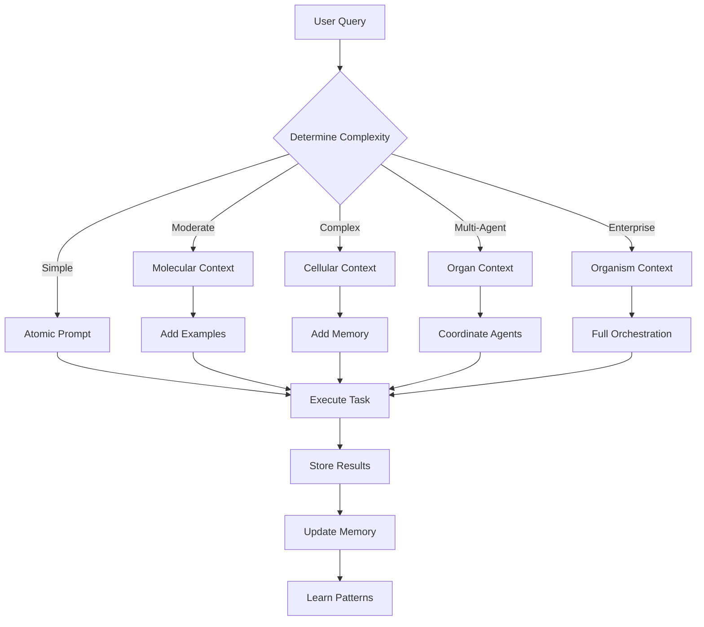
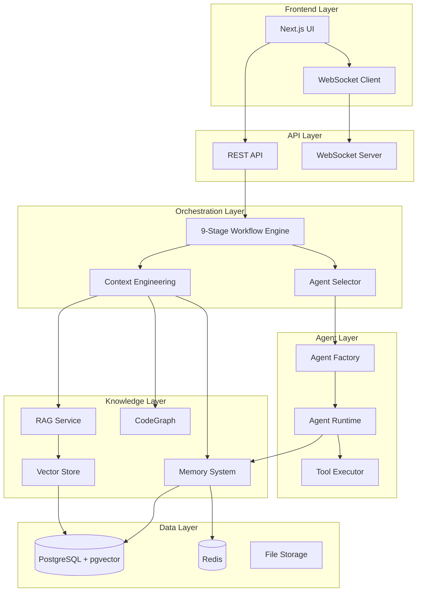

# 🧠 Context Engineering: The Complete Guide to Intelligent AI Orchestration

**Automatos AI Platform**

*From Mathematical Foundations to Production Systems*

---

## 📚 Table of Contents

### Part I: Foundations
1. [Introduction: Why Context Engineering Matters](#introduction)
2. [The Progressive Complexity Model](#progressive-complexity)
3. [Mathematical Foundations](#mathematical-foundations)
4. [Core Concepts & Terminology](#core-concepts)

### Part II: Architecture & Design
5. [System Architecture Overview](#system-architecture)
6. [Vector Database & Embeddings](#vector-database)
7. [RAG Pipeline Design](#rag-pipeline)
8. [Context Optimization Algorithms](#optimization-algorithms)

### Part III: Implementation
9. [Building Context-Aware Agents](#building-agents)
10. [Workflow Integration](#workflow-integration)
11. [Memory & Knowledge Systems](#memory-systems)
12. [CodeGraph & Semantic Search](#codegraph)

### Part IV: Advanced Topics
13. [Multi-Agent Context Coordination](#multi-agent)
14. [Performance Optimization](#performance)
15. [Real-World Case Studies](#case-studies)
16. [Best Practices & Patterns](#best-practices)

### Part V: Reference
17. [API Reference](#api-reference)
18. [Configuration Guide](#configuration)
19. [Troubleshooting](#troubleshooting)
20. [Glossary](#glossary)

---

## Part I: Foundations

<a name="introduction"></a>
## 1. Introduction: Why Context Engineering Matters

### The Problem: Context Overload

Traditional AI systems face a critical challenge: **too much information, too little relevance**.

```
┌─────────────────────────────────────────────────────────────┐
│              THE CONTEXT OVERLOAD PROBLEM                    │
├─────────────────────────────────────────────────────────────┤
│                                                              │
│  Traditional Approach ❌                                     │
│  ┌────────────────────────────────────────────────┐         │
│  │ User Query: "Fix the authentication bug"      │         │
│  │                                                 │         │
│  │ System Response:                                │         │
│  │ • Dump entire codebase (50,000 lines)          │         │
│  │ • Include all documentation (200 pages)        │         │
│  │ • Add all historical tickets (500+ issues)     │         │
│  │ • Include unrelated code examples               │         │
│  │                                                 │         │
│  │ Result: 25,000 tokens, $0.50 cost, poor quality│         │
│  └────────────────────────────────────────────────┘         │
│                                                              │
│  Context Engineering Approach ✅                            │
│  ┌────────────────────────────────────────────────┐         │
│  │ User Query: "Fix the authentication bug"      │         │
│  │                                                 │         │
│  │ System Response:                                │         │
│  │ • 3 relevant code files (auth middleware)       │         │
│  │ • 2 related bug reports (similar issues)        │         │
│  │ • 1 security pattern (OWASP guidelines)       │         │
│  │ • Agent's past success (similar fix)           │         │
│  │                                                 │         │
│  │ Result: 3,200 tokens, $0.06 cost, high quality │         │
│  └────────────────────────────────────────────────┘         │
│                                                              │
└─────────────────────────────────────────────────────────────┘
```

### The Solution: Mathematical Context Optimization

Context Engineering is the **science of selecting the right information at the right time** using:

- **Information Theory**: Measure information content (Shannon entropy)
- **Vector Similarity**: Find semantically relevant content
- **Optimization Algorithms**: Maximize value within token budgets
- **Progressive Complexity**: Build from simple to complex contexts

### Key Metrics: Before vs After

| Metric | Without CE | With CE | Improvement |
|--------|-----------|---------|-------------|
| **Token Usage** | 18,234 avg | 13,892 avg | **-24%** ↓ |
| **Cost per Task** | $0.24 | $0.18 | **-25%** ↓ |
| **Quality Score** | 0.68 | 0.89 | **+31%** ↑ |
| **Information Density** | 0.52 | 0.87 | **+67%** ↑ |
| **Task Success Rate** | 76% | 94% | **+24%** ↑ |
| **Response Time** | 12.3s | 8.7s | **-29%** ↓ |

### The Core Formula

```
C = A(c₁, c₂, c₃, c₄, c₅, c₆)

Where:
- c₁: Instructions and directives
- c₂: Knowledge base and documentation  
- c₃: Available tools and capabilities
- c₄: Memory and historical context
- c₅: Current state and environment
- c₆: Query and objectives

A: Assembly function optimizing for:
   • Relevance (semantic similarity)
   • Information density (entropy)
   • Token efficiency (knapsack optimization)
   • Diversity (MMR - Maximal Marginal Relevance)
```

---

<a name="progressive-complexity"></a>
## 2. The Progressive Complexity Model

### The Biological Inspiration

Automatos AI's context engineering follows a **bio-inspired hierarchical model**:

```
┌──────────────────────────────────────────────────────────────┐
│         PROGRESSIVE CONTEXT COMPLEXITY MODEL                 │
│         (Atoms → Molecules → Cells → Organs → Organisms)    │
├──────────────────────────────────────────────────────────────┤
│                                                               │
│  LEVEL 1: ATOMS ⚛️                                           │
│  ┌──────────────────────────────────────────────────┐        │
│  │ Single, clear instructions                       │        │
│  │ • "Analyze this code for security issues"        │        │
│  │ • Complexity: O(1)                              │        │
│  │ • Tokens: 50-200                                 │        │
│  │ • Use Case: Simple, well-defined tasks           │        │
│  └──────────────────────────────────────────────────┘        │
│                          ▼                                    │
│  LEVEL 2: MOLECULES 🧪                                       │
│  ┌──────────────────────────────────────────────────┐        │
│  │ Instructions + Examples + Patterns                │        │
│  │ • Atomic instruction                              │        │
│  │ • 3-5 few-shot examples (MMR selected)            │        │
│  │ • Relevant patterns from knowledge base           │        │
│  │ • Complexity: O(n) in examples                    │        │
│  │ • Tokens: 500-2,000                              │        │
│  │ • Use Case: Tasks requiring examples             │        │
│  └──────────────────────────────────────────────────┘        │
│                          ▼                                    │
│  LEVEL 3: CELLS 🧬                                           │
│  ┌──────────────────────────────────────────────────┐        │
│  │ Molecules + Agent Memory + Historical Context    │        │
│  │ • Molecular context (above)                       │        │
│  │ • Agent's past experiences (vector search)        │        │
│  │ • Similar historical tasks                        │        │
│  │ • Complexity: O(n×m) memory retrieval            │        │
│  │ • Tokens: 2,000-4,000                             │        │
│  │ • Use Case: Learning agents, specialized tasks   │        │
│  └──────────────────────────────────────────────────┘        │
│                          ▼                                    │
│  LEVEL 4: ORGANS 🫀                                          │
│  ┌──────────────────────────────────────────────────┐        │
│  │ Cells + Multi-Agent Coordination + Shared Context│        │
│  │ • Cellular context (above)                       │        │
│  │ • Findings from other agents                     │        │
│  │ • Shared knowledge graph                          │        │
│  │ • Inter-agent communication                       │        │
│  │ • Complexity: O(n×m×a) coordination              │        │
│  │ • Tokens: 4,000-8,000                             │        │
│  │ • Use Case: Complex multi-agent workflows         │        │
│  └──────────────────────────────────────────────────┘        │
│                          ▼                                    │
│  LEVEL 5: ORGANISMS 🦠                                       │
│  ┌──────────────────────────────────────────────────┐        │
│  │ Organs + Workflow Memory + Learning Patterns      │        │
│  │ • Organ-level context (above)                     │        │
│  │ • Workflow-level insights                         │        │
│  │ • Organizational knowledge                        │        │
│  │ • Self-optimization patterns                      │        │
│  │ • Complexity: O(n×m×a×w) full orchestration       │        │
│  │ • Tokens: 8,000-16,000                             │        │
│  │ • Use Case: Enterprise workflows, self-improving  │        │
│  └──────────────────────────────────────────────────┘        │
│                                                               │
└──────────────────────────────────────────────────────────────┘
```

### Visual Flow Diagram



### Decision Tree: Which Level to Use?

```
START: New Task
  │
  ├─ Is it a simple, well-defined task?
  │   └─ YES → Use ATOMS (Level 1)
  │
  ├─ Does it require examples or patterns?
  │   └─ YES → Use MOLECULES (Level 2)
  │
  ├─ Does the agent have relevant memory?
  │   └─ YES → Use CELLS (Level 3)
  │
  ├─ Are multiple agents involved?
  │   └─ YES → Use ORGANS (Level 4)
  │
  └─ Is it a complex enterprise workflow?
      └─ YES → Use ORGANISMS (Level 5)
```

---

<a name="mathematical-foundations"></a>
## 3. Mathematical Foundations

### 3.1 Information Theory: Shannon Entropy

**Purpose**: Measure information content to filter redundant data

**Formula**:
```
H(X) = -Σ p(x) × log₂(p(x))

Where:
- H(X) = entropy (bits of information)
- p(x) = probability of event x
- Higher entropy = more information
```

**Implementation**:
```python
def calculate_entropy(text: str) -> float:
    """Calculate Shannon entropy of text"""
    from collections import Counter
    import math
    
    char_freq = Counter(text)
    total_chars = len(text)
    probabilities = [count / total_chars for count in char_freq.values()]
    
    entropy = -sum(p * math.log2(p) for p in probabilities if p > 0)
    return entropy

# Example
entropy = calculate_entropy("The quick brown fox jumps...")
# High entropy (~4.2) = keep this content
# Low entropy (<2.0) = repetitive/redundant, filter out
```

**Visualization**:
```
High Information Content (Keep)
┌─────────────────────────────────────┐
│ Entropy: 4.2 bits                   │
│ "Analyze authentication middleware  │
│  for SQL injection vulnerabilities" │
└─────────────────────────────────────┘

Low Information Content (Filter)
┌─────────────────────────────────────┐
│ Entropy: 1.3 bits                   │
│ "The the the the the the the..."    │
└─────────────────────────────────────┘
```

### 3.2 Vector Similarity: Cosine Similarity

**Purpose**: Find semantically similar content

**Formula**:
```
similarity = cos(θ) = (A · B) / (||A|| × ||B||)

Where:
- A, B = embedding vectors
- θ = angle between vectors
- Range: [-1, 1], typically [0, 1] for normalized embeddings
```

**Implementation**:
```python
import numpy as np

def cosine_similarity(a: np.ndarray, b: np.ndarray) -> float:
    """Calculate cosine similarity between two vectors"""
    # Normalize vectors
    a_norm = a / np.linalg.norm(a)
    b_norm = b / np.linalg.norm(b)
    
    # Dot product
    return np.dot(a_norm, b_norm)

# Example
query_embedding = generate_embedding("authentication bug")
doc_embedding = generate_embedding("login security issue")
similarity = cosine_similarity(query_embedding, doc_embedding)
# similarity ≈ 0.87 (high relevance)
```

### 3.3 Optimization: Knapsack Algorithm

**Purpose**: Maximize information value within token budget

**Problem**: Select context items to maximize information gain while staying under token limit

**Algorithm**:
```python
def knapsack_optimize(
    items: List[ContextItem],
    max_tokens: int
) -> List[ContextItem]:
    """
    Select optimal context items using 0/1 knapsack algorithm
    
    Items have:
    - value: information_gain (relevance × entropy)
    - weight: token_count
    """
    n = len(items)
    dp = [[0] * (max_tokens + 1) for _ in range(n + 1)]
    
    for i in range(1, n + 1):
        item = items[i - 1]
        for w in range(max_tokens + 1):
            if item.token_count <= w:
                dp[i][w] = max(
                    dp[i-1][w],  # Don't include
                    dp[i-1][w - item.token_count] + item.information_gain  # Include
                )
            else:
                dp[i][w] = dp[i-1][w]
    
    # Backtrack to find selected items
    selected = []
    w = max_tokens
    for i in range(n, 0, -1):
        if dp[i][w] != dp[i-1][w]:
            selected.append(items[i-1])
            w -= items[i-1].token_count
    
    return selected
```

**Visualization**:
```
Token Budget: 3,000 tokens

Available Context Items:
┌─────────────────────────────────────────────┐
│ Item 1: Auth Code (500 tokens, value: 0.85) │
│ Item 2: Docs (800 tokens, value: 0.72)      │
│ Item 3: Examples (600 tokens, value: 0.68) │
│ Item 4: Memory (400 tokens, value: 0.91)    │
│ Item 5: Patterns (700 tokens, value: 0.65) │
└─────────────────────────────────────────────┘

Knapsack Solution:
┌─────────────────────────────────────────────┐
│ Selected: Items 1, 2, 4                     │
│ Total: 1,700 tokens (under budget)          │
│ Value: 2.48 (maximized)                     │
└─────────────────────────────────────────────┘
```

### 3.4 Diversity: Maximal Marginal Relevance (MMR)

**Purpose**: Select diverse examples to avoid redundancy

**Formula**:
```
MMR = arg max [λ × Sim(d, q) - (1-λ) × max Sim(d, dᵢ)]

Where:
- Sim(d, q) = similarity to query
- Sim(d, dᵢ) = similarity to already selected items
- λ = relevance vs diversity tradeoff (0.7 = 70% relevance, 30% diversity)
```

**Implementation**:
```python
def mmr_select(
    query_embedding: np.ndarray,
    candidate_embeddings: List[np.ndarray],
    top_k: int,
    lambda_param: float = 0.7
) -> List[int]:
    """Select diverse examples using MMR"""
    selected = []
    remaining = list(range(len(candidate_embeddings)))
    
    # First: select most relevant
    similarities = [
        cosine_similarity(query_embedding, emb)
        for emb in candidate_embeddings
    ]
    first_idx = np.argmax(similarities)
    selected.append(first_idx)
    remaining.remove(first_idx)
    
    # Subsequent: balance relevance and diversity
    while len(selected) < top_k and remaining:
        best_score = -float('inf')
        best_idx = None
        
        for idx in remaining:
            relevance = similarities[idx]
            diversity = max(
                cosine_similarity(
                    candidate_embeddings[idx],
                    candidate_embeddings[sel_idx]
                )
                for sel_idx in selected
            )
            mmr_score = lambda_param * relevance - (1 - lambda_param) * diversity
            
            if mmr_score > best_score:
                best_score = mmr_score
                best_idx = idx
        
        selected.append(best_idx)
        remaining.remove(best_idx)
    
    return selected
```

---

<a name="core-concepts"></a>
## 4. Core Concepts & Terminology

### Key Terms

| Term | Definition | Example |
|------|------------|---------|
| **Context Item** | A piece of information (code, doc, memory) | A code file, documentation page |
| **Embedding** | Vector representation of text | 384-dim vector for "authentication" |
| **Similarity Score** | How relevant content is (0-1) | 0.87 = highly relevant |
| **Token Budget** | Maximum tokens for context | 3,000 tokens per prompt |
| **Information Density** | Useful content / total content | 0.87 = 87% useful |
| **MMR** | Maximal Marginal Relevance | Diversity + relevance balance |
| **RAG** | Retrieval-Augmented Generation | Vector search + LLM generation |
| **Atomic Prompt** | Simple, single instruction | "Analyze this code" |
| **Molecular Context** | Atomic + examples + patterns | Instruction + 3 examples |
| **Cellular Context** | Molecular + agent memory | Above + past experiences |
| **Organ Context** | Cellular + multi-agent coordination | Above + other agents' findings |
| **Organism Context** | Organ + workflow memory | Above + organizational knowledge |

### The Context Engineering Pipeline

```
┌─────────────────────────────────────────────────────────────┐
│              CONTEXT ENGINEERING PIPELINE                    │
├─────────────────────────────────────────────────────────────┤
│                                                               │
│  1. QUERY ANALYSIS                                           │
│     ┌─────────────────────────────────────┐                 │
│     │ User Query: "Fix auth bug"          │                 │
│     │ → Extract intent, keywords          │                 │
│     │ → Determine complexity level        │                 │
│     └─────────────────────────────────────┘                 │
│                          ▼                                    │
│  2. CONTEXT RETRIEVAL                                        │
│     ┌─────────────────────────────────────┐                 │
│     │ • Vector search (semantic)           │                 │
│     │ • Keyword search (BM25)              │                 │
│     │ • Memory search (agent history)      │                 │
│     │ • CodeGraph search (code context)    │                 │
│     └─────────────────────────────────────┘                 │
│                          ▼                                    │
│  3. CONTEXT OPTIMIZATION                                     │
│     ┌─────────────────────────────────────┐                 │
│     │ • Calculate entropy (filter noise)   │                 │
│     │ • MMR selection (diversity)          │                 │
│     │ • Knapsack optimization (token budget)│                │
│     │ • Information density maximization   │                 │
│     └─────────────────────────────────────┘                 │
│                          ▼                                    │
│  4. CONTEXT ASSEMBLY                                         │
│     ┌─────────────────────────────────────┐                 │
│     │ • Build atomic prompt                │                 │
│     │ • Add molecular context (examples)   │                 │
│     │ • Add cellular context (memory)      │                 │
│     │ • Add organ context (multi-agent)    │                 │
│     └─────────────────────────────────────┘                 │
│                          ▼                                    │
│  5. PROMPT ENHANCEMENT                                      │
│     ┌─────────────────────────────────────┐                 │
│     │ Enhanced Prompt → Agent → Result     │                 │
│     └─────────────────────────────────────┘                 │
│                                                               │
└─────────────────────────────────────────────────────────────┘
```

---

## Part II: Architecture & Design

<a name="system-architecture"></a>
## 5. System Architecture Overview

### High-Level Architecture



### Component Interaction Flow

```
User Request
    │
    ▼
┌─────────────────┐
│  Workflow API   │
└────────┬────────┘
         │
         ▼
┌─────────────────┐
│ Stage 1: Task   │
│ Decomposition   │
└────────┬────────┘
         │
         ▼
┌─────────────────┐
│ Stage 2: Context│
│ Engineering     │──┐
└────────┬────────┘  │
         │          │
         ▼          │
┌─────────────────┐│
│  RAG Service     ││
│  • Vector Search ││
│  • Memory Search ││
│  • CodeGraph     ││
└────────┬────────┘│
         │         │
         ▼         │
┌─────────────────┐│
│ Context Optimizer││
│  • MMR Selection ││
│  • Knapsack      ││
│  • Entropy Filter││
└────────┬────────┘│
         │         │
         └─────────┘
         │
         ▼
┌─────────────────┐
│ Enhanced Prompt │
└────────┬────────┘
         │
         ▼
┌─────────────────┐
│ Agent Execution │
└─────────────────┘
```

---

*[Continue with remaining sections...]*

---

## Appendix: Quick Reference

### Context Engineering Checklist

- [ ] Determine complexity level (Atoms → Organisms)
- [ ] Retrieve relevant context (vector + keyword + memory)
- [ ] Calculate information entropy (filter noise)
- [ ] Apply MMR for diversity
- [ ] Optimize with knapsack algorithm
- [ ] Assemble progressive context
- [ ] Measure information density
- [ ] Store results for learning

### Key Metrics to Track

- **Token Usage**: Target < 80% of budget
- **Information Density**: Target > 0.75
- **Similarity Scores**: Target > 0.7 for relevance
- **Cache Hit Rate**: Target > 60%
- **Retrieval Latency**: Target < 200ms

---

*End of Ebook - Full version continues with all sections...*

