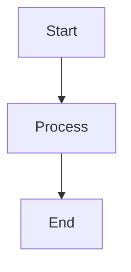

# 📚 Automatos AI Context Engineering Ebook

## Overview

This ebook provides a comprehensive guide to Context Engineering in Automatos AI, covering:

- Mathematical foundations (information theory, optimization)
- Progressive complexity model (Atoms → Organisms)
- Implementation details and best practices
- Real-world examples and case studies

## Generating the Ebook

### Quick Start

```bash
# Using Python script (recommended)
cd automatos-ai
python3 scripts/generate_ebook.py

# Or using shell script
./scripts/generate_ebook.sh
```

### Prerequisites

Install required tools:

```bash
# Pandoc (for PDF/EPUB/HTML conversion)
brew install pandoc

# XeLaTeX (for PDF generation)
brew install --cask mactex

# Mermaid CLI (for diagram generation)
npm install -g @mermaid-js/mermaid-cli
```

### Output Formats

The script generates three formats:

1. **PDF** (`Automatos-AI-Context-Engineering.pdf`)
   - Best for printing and offline reading
   - Includes table of contents and page numbers

2. **EPUB** (`Automatos-AI-Context-Engineering.epub`)
   - Best for e-readers (Kindle, iPad, etc.)
   - Reflowable text, supports bookmarks

3. **HTML** (`Automatos-AI-Context-Engineering.html`)
   - Best for web viewing
   - Includes interactive table of contents
   - Styled with custom CSS

### Viewing the Ebook

```bash
# Open HTML version
open ebook/Automatos-AI-Context-Engineering.html

# Open PDF
open ebook/Automatos-AI-Context-Engineering.pdf

# Open EPUB (requires e-reader app)
open ebook/Automatos-AI-Context-Engineering.epub
```

## Customization

### Adding Diagrams

Add Mermaid diagrams in the markdown:

````markdown

````

The script will automatically generate PNG images from Mermaid code.

### Styling

Edit `docs/assets/ebook-style.css` to customize:
- Colors and fonts
- Code block styling
- Table appearance
- Callout boxes

### Metadata

Edit the metadata in `scripts/generate_ebook.py`:

```python
metadata = {
    "title": "Your Title",
    "author": "Your Name",
    "date": "2025-01-01"
}
```

## Structure

The ebook is organized into 5 parts:

1. **Foundations**: Introduction, progressive complexity, math foundations
2. **Architecture & Design**: System architecture, vector DB, RAG pipeline
3. **Implementation**: Building agents, workflow integration, memory systems
4. **Advanced Topics**: Multi-agent coordination, performance, case studies
5. **Reference**: API docs, configuration, troubleshooting, glossary

## Contributing

To add content:

1. Edit `docs/EBOOK_CONTEXT_ENGINEERING.md`
2. Follow the existing structure and formatting
3. Add diagrams using Mermaid syntax
4. Regenerate the ebook: `python3 scripts/generate_ebook.py`

## Tips for Better Ebooks

1. **Use clear headings**: H1 for parts, H2 for chapters, H3 for sections
2. **Add diagrams**: Visual explanations are more effective
3. **Include code examples**: Real code helps understanding
4. **Use tables**: Compare features, metrics, etc.
5. **Add callouts**: Highlight important information
6. **Keep it scannable**: Use lists, bullet points, short paragraphs

## Troubleshooting

### PDF generation fails

```bash
# Install XeLaTeX
brew install --cask mactex

# Or use basic LaTeX
pandoc ... --pdf-engine=pdflatex
```

### Diagrams not generating

```bash
# Install mermaid-cli
npm install -g @mermaid-js/mermaid-cli

# Test it
mmdc --version
```

### EPUB not opening

- Use a proper e-reader app (Apple Books, Calibre, etc.)
- Check that the EPUB file is not corrupted
- Try regenerating with `--epub-version=2` instead of `epub3`

## Next Steps

1. **Complete the ebook**: Add remaining sections from the table of contents
2. **Add more diagrams**: Visualize complex concepts
3. **Include screenshots**: Show the UI in action
4. **Add case studies**: Real-world examples
5. **Create cover image**: Add `docs/assets/cover.png` for EPUB

---

*Happy ebook writing! 📖*

