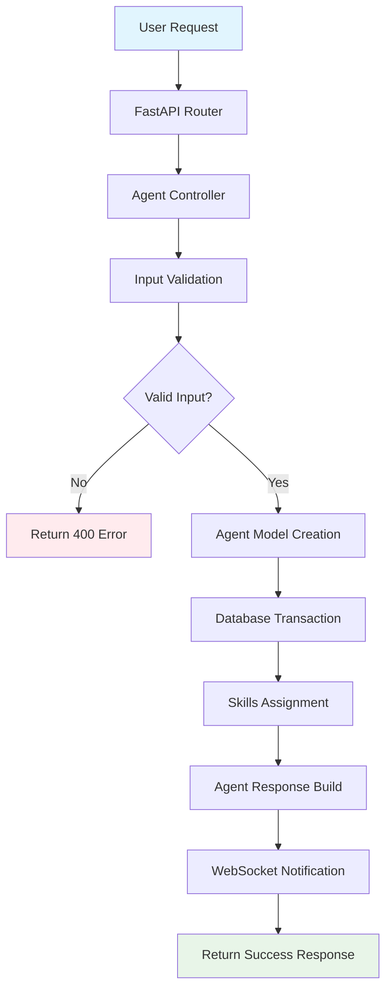
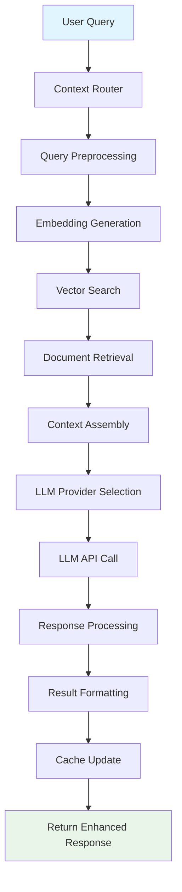
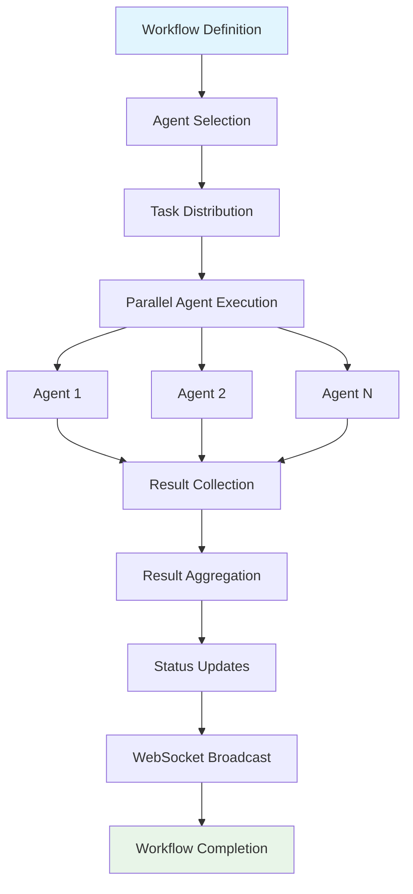
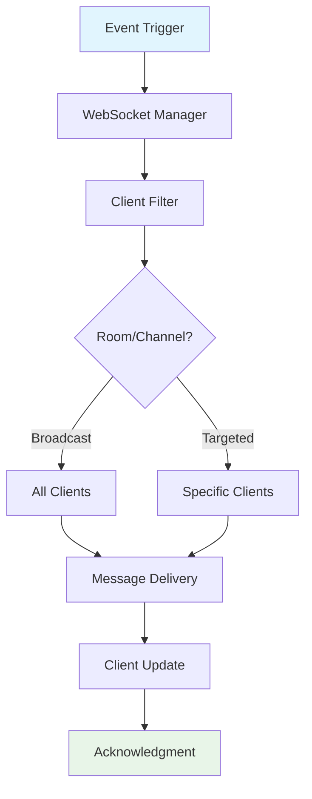
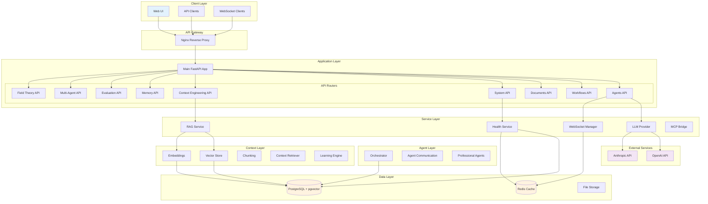
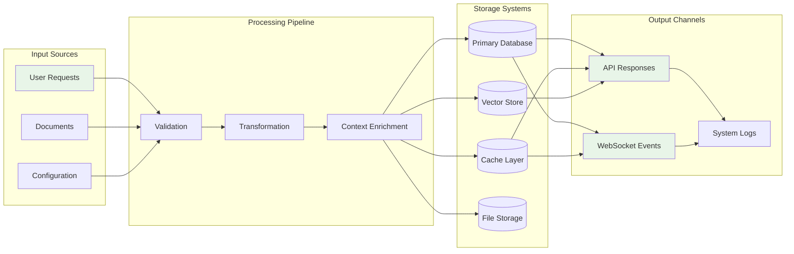
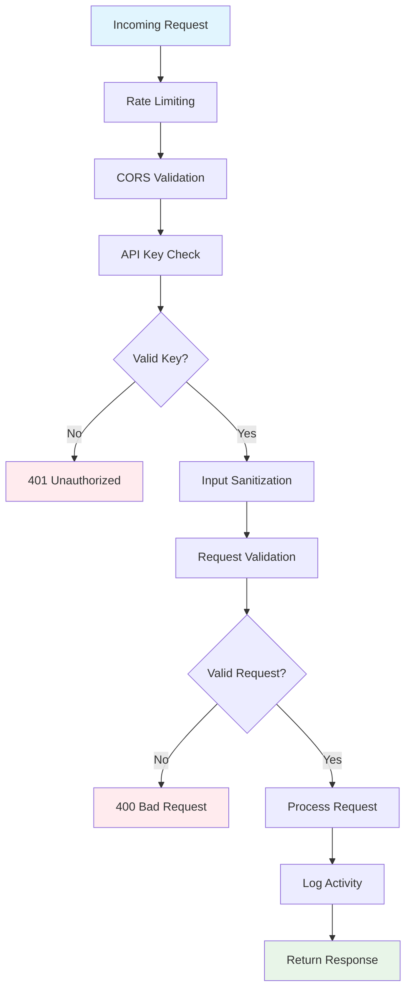
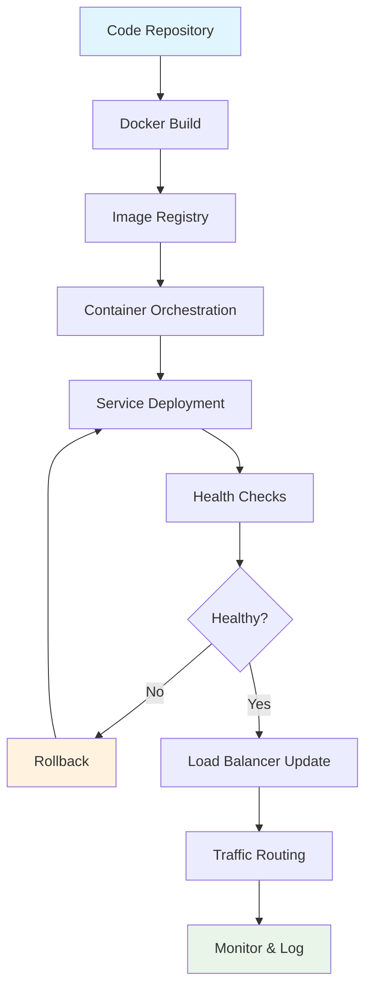
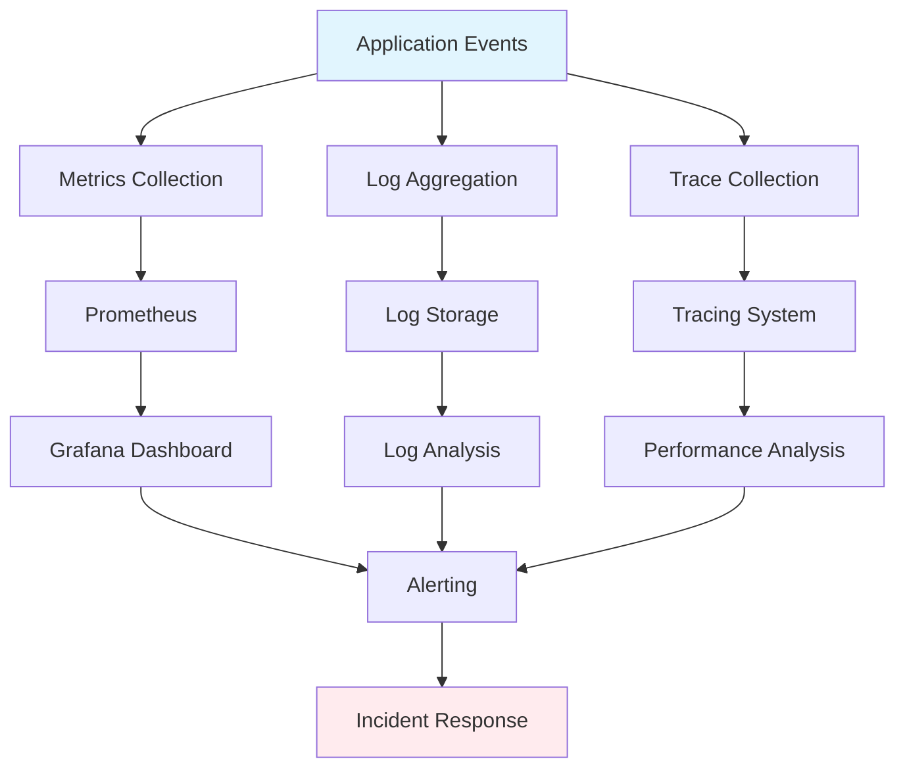

# Automatos AI - System Flow Diagrams

## 🔄 Request Flow Diagrams

### 1. Agent Creation & Management Flow

### 2. Context-Aware Query Processing

### 3. Multi-Agent Workflow Execution

### 4. Real-Time Communication Flow

## 🏗️ System Architecture Diagram

## 📊 Data Flow Architecture

## 🔐 Security & Authentication Flow

## 🚀 Deployment Flow

## 📈 Monitoring & Observability Flow

## 🔄 Component Interaction Matrix

| Component | Depends On | Provides To | Communication |
|-----------|------------|-------------|---------------|
| **main.py** | All routers, database | Application entry | FastAPI |
| **agents.py** | Database, WebSocket | Agent CRUD | REST API |
| **workflows.py** | Database, Agents | Workflow management | REST API |
| **context.py** | RAG, Vector Store | Context queries | REST API |
| **database.py** | PostgreSQL | Data persistence | SQLAlchemy |
| **websocket_manager.py** | Redis | Real-time updates | WebSocket |
| **llm_provider.py** | OpenAI, Anthropic | LLM services | HTTP API |
| **rag_service.py** | Vector Store, Embeddings | Context retrieval | Function calls |
| **vector_store.py** | PostgreSQL pgvector | Vector operations | SQL/pgvector |

## 📝 Development Workflow

```mermaid
graph LR
    A[Local Development] --> B[Code Changes]
    B --> C[Unit Tests]
    C --> D[Integration Tests]
    D --> E[Docker Build]
    E --> F[Local Testing]
    F --> G[Git Commit]
    G --> H[CI/CD Pipeline]
    H --> I[Automated Testing]
    I --> J[Staging Deployment]
    J --> K[Production Deployment]
    
    style A fill:#e8f5e8
    style K fill:#e8f5e8
```

This comprehensive flow documentation provides developers with clear understanding of how data moves through the system, how components interact, and what the request lifecycle looks like for different operations.
