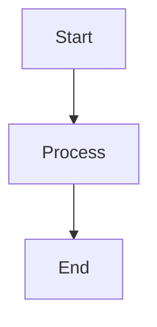

# 📚 Automatos AI Documentation

*Comprehensive documentation for the world's most advanced multi-agent orchestration platform*

[](https://docs.automatos.ai)
[](https://automatos.gitbook.io)
[](../LICENSE)

## 🚀 Quick Access

| 📖 **Documentation** | 🔗 **Link** | ⏱️ **Time** |
|---------------------|-------------|-------------|
| **Quick Start** | [quickstart.md](quickstart.md) | 10 min |
| **Complete Guide** | [COMPREHENSIVE_GUIDE.md](COMPREHENSIVE_GUIDE.md) | 2 hours |
| **API Reference** | [api.md](api.md) | 30 min |
| **Architecture** | [architecture.md](architecture.md) | 45 min |

## 🎯 Documentation Structure

### 📁 **Core Documentation**
- **[README.md](README.md)** - Documentation hub and overview
- **[PRODUCTS_DASHBOARD.md](PRODUCTS_DASHBOARD.md)** - Products showcase and features
- **[SUMMARY.md](SUMMARY.md)** - GitBook navigation structure

### 🚀 **Getting Started**
- **[quickstart.md](quickstart.md)** - 10-minute deployment guide
- **[LOCAL_SETUP_GUIDE.md](LOCAL_SETUP_GUIDE.md)** - Development environment setup
- **[COMPREHENSIVE_GUIDE.md](COMPREHENSIVE_GUIDE.md)** - Complete platform guide

### 🏗️ **Technical Documentation**
- **[architecture.md](architecture.md)** - System architecture and design
- **[api.md](api.md)** - REST API documentation
- **[deployment.md](deployment.md)** - Production deployment guide
- **[security.md](security.md)** - Security configuration and best practices

### 🧠 **Advanced Features**
- **[CONTEXT_ENGINEERING_IMPLEMENTATION.md](CONTEXT_ENGINEERING_IMPLEMENTATION.md)** - Context engineering system
- **[context-engineering-architecture.md](context-engineering-architecture.md)** - RAG system architecture
- **[mcp-integration.md](mcp-integration.md)** - IDE and tool integrations
- **[FLOW_DIAGRAMS.md](FLOW_DIAGRAMS.md)** - System workflow visualizations

### 👨‍💻 **Development**
- **[DEVELOPER_GUIDE.md](DEVELOPER_GUIDE.md)** - Developer onboarding and setup
- **[CONTRIBUTING.md](CONTRIBUTING.md)** - Contribution guidelines
- **[templates.md](templates.md)** - Workflow template creation

### 📊 **Reference**
- **[CHANGELOG.md](CHANGELOG.md)** - Version history and changes
- **[competitive-positioning.md](competitive-positioning.md)** - Market positioning
- **[SWAGGER_DOCUMENTATION_REPORT.md](SWAGGER_DOCUMENTATION_REPORT.md)** - API documentation report

## 🌐 Viewing Options

### **GitBook (Recommended)**
Beautiful, searchable documentation with navigation:
```
https://automatos.gitbook.io
```

### **GitHub Pages**
Direct GitHub rendering:
```
https://automatosai.github.io/automatos-ai/docs/
```

### **Local GitBook**
Run GitBook locally:
```bash
# Install GitBook CLI
npm install -g gitbook-cli

# Navigate to docs directory
cd docs/

# Install dependencies
gitbook install

# Serve locally
gitbook serve
```

## 🛠️ Documentation Development

### **Prerequisites**
- Node.js 14+
- GitBook CLI
- Markdown editor with YAML frontmatter support

### **Local Development**
```bash
# Clone repository
git clone https://github.com/AutomatosAI/automatos-ai.git
cd automatos-ai/docs/

# Install GitBook and dependencies
npm install -g gitbook-cli
gitbook install

# Start development server
gitbook serve --port 4000

# Build static site
gitbook build
```

### **File Structure**
```
docs/
├── README.md                 # Documentation hub
├── PRODUCTS_DASHBOARD.md     # Products showcase
├── SUMMARY.md               # Navigation structure
├── book.json                # GitBook configuration
├── .gitbook.yaml           # GitBook settings
├── .gitbook/
│   ├── styles.css          # Custom styling
│   └── assets/             # Images and media
├── quickstart.md           # Quick start guide
├── api.md                  # API documentation
├── architecture.md         # System architecture
└── ...                     # Additional documentation
```

## 📝 Writing Guidelines

### **Frontmatter Format**
All documentation files should include YAML frontmatter:

```yaml
---
title: Page Title
description: Brief description of the page content
---
```

### **Markdown Standards**
- Use ATX headers (`#`, `##`, `###`)
- Include table of contents for long documents
- Use code blocks with language specification
- Include examples and practical use cases
- Add emojis for visual appeal and categorization

### **Mermaid Diagrams**
Use proper Mermaid syntax:
```markdown

```

### **Cross-References**
Link to other documentation:
```markdown
See [API Documentation](api.md) for details.
```

## 🎨 Styling and Branding

### **CSS Classes**
Custom CSS classes available:
- `.hero-stats` - Statistics display grid
- `.docs-grid` - Documentation card grid
- `.feature-grid` - Feature showcase grid
- `.product-highlight` - Product highlight sections
- `.cta-section` - Call-to-action sections

### **Color Scheme**
- **Primary**: #007bff (Blue)
- **Secondary**: #6c757d (Gray)
- **Success**: #28a745 (Green)
- **Warning**: #ffc107 (Yellow)
- **Danger**: #dc3545 (Red)

## 🔄 Updates and Maintenance

### **Regular Updates**
- Update version numbers in frontmatter
- Refresh screenshots and examples
- Validate all links and references
- Update API documentation with schema changes

### **Quality Checks**
```bash
# Check for broken links
markdown-link-check docs/**/*.md

# Validate frontmatter
yamllint docs/**/*.md

# Build test
gitbook build
```

## 🤝 Contributing to Documentation

### **How to Contribute**
1. Fork the repository
2. Create a feature branch
3. Make your changes
4. Test with GitBook locally
5. Submit a pull request

### **Documentation Issues**
Report documentation issues:
- **Missing information**: Create GitHub issue
- **Outdated content**: Submit pull request
- **Broken links**: Report in issues
- **Suggestions**: Use GitHub discussions

## 📞 Support

### **Documentation Support**
- **📧 Email**: docs@automatos.ai
- **💬 Discord**: #documentation channel
- **🐛 Issues**: GitHub Issues
- **💡 Suggestions**: GitHub Discussions

---

**Built with ❤️ by the Automatos AI community**

*Last updated: January 2025*
