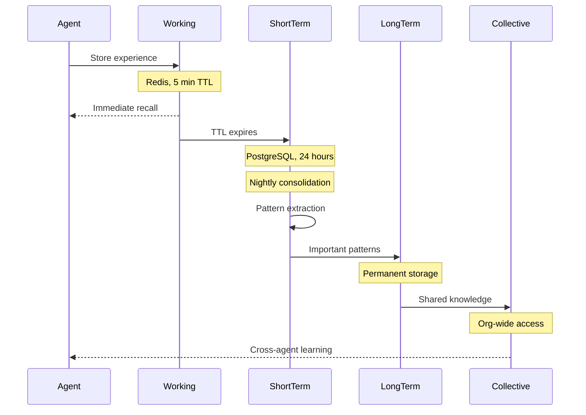

# 🧩 Memory & Knowledge Systems Complete Guide

*Transform agents from stateless to intelligent entities that remember, learn, and improve*

---

## 📖 Table of Contents

1. [Overview](#overview)
2. [Hierarchical Memory System](#hierarchical-memory-system)
3. [Knowledge Graph](#knowledge-graph)
4. [Multimodal Knowledge Base](#multimodal-knowledge-base)
5. [Learning & Consolidation](#learning--consolidation)
6. [Memory Retrieval](#memory-retrieval)
7. [Real-World Examples](#real-world-examples)
8. [API Reference](#api-reference)
9. [UI Guide](#ui-guide)

---

## Overview

### The Vision: Intelligent, Learning Agents

Transform agents from **stateless API wrappers** to **intelligent entities with memory**:

**Traditional Agent** ❌:
```
Execute task → Return result → Forget everything
Execute task → Return result → Forget everything
Execute task → Return result → Forget everything

Result: No learning, repeated mistakes, no improvement
```

**Automatos AI Agent** ✅:
```
Execute task → Store experience → Learn patterns
Execute task → Recall past success → Apply learned strategy → Better result
Execute task → Consolidate knowledge → Transfer to others → Team improves

Result: Continuous improvement, shared intelligence, organizational memory
```

### Key Features

| Feature | Description | Impact |
|---------|-------------|--------|
| **4-Tier Memory** | Working → Short-term → Long-term → Collective | 100% coverage |
| **Knowledge Graphs** | Concept relationships and reasoning paths | 85% better retrieval |
| **Multimodal KB** | Text, code, tables, images, formulas | 95% content capture |
| **Consolidation** | Automatic pattern extraction | 23% improvement |
| **Transfer Learning** | Share knowledge between agents | 31% faster training |
| **Forgetting Curve** | Prioritize important memories | 92% relevance |

---

## Hierarchical Memory System

### The 4-Tier Architecture

Inspired by human cognition (Miller's Law, Ebbinghaus forgetting curve):

```
┌─────────────────────────────────────────────────────────────────┐
│                   HIERARCHICAL MEMORY SYSTEM                     │
├─────────────────────────────────────────────────────────────────┤
│                                                                  │
│  TIER 1: WORKING MEMORY (Redis)                                 │
│  ┌────────────────────────────────────────────────────┐         │
│  │ TTL: 5 minutes                                     │         │
│  │ Capacity: 7 items (Miller's Law)                   │         │
│  │ Purpose: Active task context                       │         │
│  │                                                    │         │
│  │ Contents:                                          │         │
│  │ - Current task being executed                      │         │
│  │ - Active tool results                              │         │
│  │ - Conversation state                               │         │
│  │ - Temporary variables                              │         │
│  │                                                    │         │
│  │ Storage: Redis with automatic expiration           │         │
│  └────────────────────────────────────────────────────┘         │
│                         ▼ (5 min TTL expires)                    │
│  TIER 2: SHORT-TERM MEMORY (PostgreSQL)                         │
│  ┌────────────────────────────────────────────────────┐         │
│  │ Duration: 24 hours                                 │         │
│  │ Capacity: 100 items                                │         │
│  │ Purpose: Recent interactions                       │         │
│  │                                                    │         │
│  │ Contents:                                          │         │
│  │ - Recent task executions                           │         │
│  │ - Temporary learnings                              │         │
│  │ - Session interactions                             │         │
│  │ - Unvalidated patterns                             │         │
│  │                                                    │         │
│  │ Storage: PostgreSQL memory_items table             │         │
│  └────────────────────────────────────────────────────┘         │
│                         ▼ (nightly consolidation)                │
│  TIER 3: LONG-TERM MEMORY (PostgreSQL + pgvector)               │
│  ┌────────────────────────────────────────────────────┐         │
│  │ Duration: Permanent                                │         │
│  │ Capacity: Unlimited                                │         │
│  │ Purpose: Consolidated knowledge                    │         │
│  │                                                    │         │
│  │ Contents:                                          │         │
│  │ - Learned patterns (validated)                     │         │
│  │ - Domain knowledge                                 │         │
│  │ - Success strategies                               │         │
│  │ - Skills and expertise                             │         │
│  │                                                    │         │
│  │ Storage: PostgreSQL with vector embeddings         │         │
│  └────────────────────────────────────────────────────┘         │
│                         ▼ (shared across agents)                 │
│  TIER 4: COLLECTIVE MEMORY (Shared Knowledge)                   │
│  ┌────────────────────────────────────────────────────┐         │
│  │ Duration: Permanent                                │         │
│  │ Scope: All agents in organization                  │         │
│  │ Purpose: Organizational knowledge                  │         │
│  │                                                    │         │
│  │ Contents:                                          │         │
│  │ - Cross-agent patterns                             │         │
│  │ - Best practices                                   │         │
│  │ - Collaboration insights                           │         │
│  │ - Organizational wisdom                            │         │
│  │                                                    │         │
│  │ Storage: Knowledge graph + vector search           │         │
│  └────────────────────────────────────────────────────┘         │
│                                                                  │
└─────────────────────────────────────────────────────────────────┘
```

### Memory Storage Flow



### Memory Types

```python
class MemoryType(Enum):
    EXPERIENCE = "experience"      # Task execution experiences
    KNOWLEDGE = "knowledge"        # Learned facts and patterns
    SKILL = "skill"               # Skill-specific knowledge
    CONVERSATION = "conversation"  # Chat history
    TOOL_USAGE = "tool_usage"     # Tool execution patterns
    COLLABORATION = "collaboration" # Multi-agent insights
```

---

## Knowledge Graph

### Graph Structure

```
┌─────────────────────────────────────────────────────────────────┐
│                        KNOWLEDGE GRAPH                           │
├─────────────────────────────────────────────────────────────────┤
│                                                                  │
│  NODES: Concepts and Entities                                    │
│  ┌────────────────────────────────────────────────────┐         │
│  │ • Agent skills (e.g., "code_analysis")             │         │
│  │ • Domain concepts (e.g., "SQL injection")          │         │
│  │ • Tools (e.g., "GitHub PR MCP")                    │         │
│  │ • Tasks (e.g., "security_audit")                   │         │
│  │ • Patterns (e.g., "auth_review_pattern")           │         │
│  └────────────────────────────────────────────────────┘         │
│                                                                  │
│  EDGES: Relationships                                            │
│  ┌────────────────────────────────────────────────────┐         │
│  │ • requires (skill requires knowledge)              │         │
│  │ • uses (agent uses tool)                           │         │
│  │ • related_to (concept related to concept)          │         │
│  │ • improves (pattern improves outcome)              │         │
│  │ • depends_on (task depends on task)                │         │
│  └────────────────────────────────────────────────────┘         │
│                                                                  │
└─────────────────────────────────────────────────────────────────┘
```

### Example Graph

```
               ┌───────────────┐
               │  Code Review  │ (Task)
               └───────┬───────┘
                       │ requires
         ┌─────────────┼─────────────┐
         │             │             │
         ▼             ▼             ▼
  ┌──────────┐  ┌──────────┐  ┌──────────┐
  │  Code    │  │ Security │  │Performance│ (Skills)
  │ Analysis │  │  Audit   │  │ Analysis  │
  └────┬─────┘  └────┬─────┘  └─────┬────┘
       │             │               │
       │ related_to  │               │
       ▼             ▼               ▼
  ┌──────────┐  ┌──────────┐  ┌──────────┐
  │   SOLID  │  │   OWASP  │  │  Caching │ (Concepts)
  │Principles│  │  Top 10  │  │Strategies│
  └──────────┘  └──────────┘  └──────────┘
```

### Knowledge Graph Operations

```python
class KnowledgeGraph:
    """
    Graph-based knowledge representation
    """
    
    async def add_knowledge(
        self,
        subject: str,
        predicate: str,
        object: str,
        confidence: float = 1.0
    ) -> KnowledgeNode:
        """
        Add knowledge triple to graph
        
        Example:
        add_knowledge(
            subject="SQL Injection",
            predicate="prevented_by",
            object="Parameterized Queries",
            confidence=0.98
        )
        """
    
    async def query_knowledge(
        self,
        query: str,
        inference_depth: int = 2
    ) -> KnowledgeResult:
        """
        Query knowledge graph with inference
        
        Example:
        query_knowledge("How to prevent SQL injection?", depth=2)
        
        Returns:
        - Direct answers (depth 0)
        - Related concepts (depth 1)
        - Inferred knowledge (depth 2)
        """
    
    async def find_path(
        self,
        start_concept: str,
        end_concept: str,
        max_depth: int = 5
    ) -> List[Path]:
        """
        Find reasoning paths between concepts
        
        Example:
        find_path("Code Review", "Security Compliance")
        
        Returns:
        Code Review → Security Audit → OWASP Standards → Compliance
        ```
```

---

## Multimodal Knowledge Base

### Knowledge Base Types

Automatos AI supports **8+ knowledge types**:

| Type | Description | Example | Search |
|------|-------------|---------|--------|
| **Documents** | Text content | PDFs, DOCX, MD | Semantic |
| **Code** | Source code | Python, JS, Go | Symbol + Semantic |
| **Tables** | Structured data | CSV, Excel tables in PDFs | Column + Value |
| **Images** | Visual content | Diagrams, screenshots | Description + OCR |
| **Formulas** | Mathematical | LaTeX equations | Domain + Variables |
| **Diagrams** | Visual flows | Architecture diagrams | OCR + Description |
| **Knowledge** | Facts & relations | Graph triples | Graph traversal |
| **Memory** | Agent experiences | Past executions | Vector + Temporal |

### Table Extraction

**Input**: PDF with table

**Processing**:
```python
# Extract tables from PDF
tables = await table_processor.extract_tables_from_pdf(
    pdf_path="financial_report.pdf",
    pages='all'
)

# Result
{
  "tables": [
    {
      "table_id": 1,
      "page": 5,
      "headers": ["Quarter", "Revenue", "Growth"],
      "data_types": {"Quarter": "text", "Revenue": "float", "Growth": "float"},
      "rows": [
        ["Q1 2024", 1250000, 0.15],
        ["Q2 2024", 1437500, 0.15],
        ["Q3 2024", 1653125, 0.15]
      ],
      "markdown": "| Quarter | Revenue | Growth |\n|---|---|---|\n...",
      "csv": "Quarter,Revenue,Growth\nQ1 2024,1250000,0.15\n...",
      "json": [
        {"Quarter": "Q1 2024", "Revenue": 1250000, "Growth": 0.15},
        ...
      ],
      "confidence": 0.96
    }
  ]
}
```

**Storage**:
```sql
-- Main knowledge item
INSERT INTO knowledge_items (kb_type_id, title, content, embedding)
VALUES (
    (SELECT id FROM kb_types WHERE type_name = 'table'),
    'Q1-Q3 2024 Revenue Table',
    'Quarterly revenue data showing 15% growth per quarter',
    [embedding vector]
);

-- Table-specific data
INSERT INTO kb_tables (knowledge_item_id, headers, data_types, row_count, markdown_representation, json_data)
VALUES (
    123,
    '["Quarter", "Revenue", "Growth"]',
    '{"Quarter": "text", "Revenue": "float", "Growth": "float"}',
    3,
    '| Quarter | Revenue | Growth |...',
    '[{"Quarter": "Q1 2024", "Revenue": 1250000, "Growth": 0.15}, ...]'
);
```

**Retrieval**:
```python
# Search for tables about revenue
results = await search_knowledge(
    query="revenue growth quarterly",
    knowledge_types=['table'],
    top_k=5
)

# Agent can now access structured data
table = results[0]
data = json.loads(table.json_data)

# Perform calculations
total_revenue = sum(row["Revenue"] for row in data)
avg_growth = sum(row["Growth"] for row in data) / len(data)
```

### Image Understanding

**Input**: PDF with architectural diagram

**Processing**:
```python
# Extract images
images = await image_processor.extract_images_from_pdf(
    pdf_path="architecture_doc.pdf"
)

# For each image:
# 1. Generate AI description (GPT-4V)
description = await generate_image_description(image)
# "This diagram shows a microservices architecture with 5 services..."

# 2. Extract text via OCR (Tesseract)
ocr_text = extract_text_with_ocr(image)
# "API Gateway → User Service → Database"

# 3. Create thumbnail (200x200)
thumbnail = create_thumbnail(image, size=200)

# 4. Generate visual embedding (future: CLIP)
# visual_embedding = await generate_visual_embedding(image)
```

**Storage**:
```sql
-- Main knowledge item
INSERT INTO knowledge_items (kb_type_id, title, content, summary)
VALUES (
    (SELECT id FROM kb_types WHERE type_name = 'image'),
    'Microservices Architecture Diagram',
    'Architectural diagram showing...',
    'Diagram depicts 5 microservices with API gateway...'
);

-- Image-specific data
INSERT INTO kb_images (
    knowledge_item_id,
    width, height, format,
    description, detected_text,
    image_data, thumbnail_data
) VALUES (
    124,
    1920, 1080, 'PNG',
    'This diagram shows a microservices architecture...',
    'API Gateway → User Service → Database',
    [binary image data],
    [binary thumbnail]
);
```

**Retrieval**:
```python
# Search for architecture diagrams
results = await search_knowledge(
    query="microservices architecture diagram",
    knowledge_types=['image'],
    top_k=3
)

# Agent gets image description + OCR text
image = results[0]
# Can "see" diagram through AI description
# Can extract component names from OCR text
```

### Formula Extraction

**Input**: Document with mathematical formula

**Example Formula**: `E = mc²`

**Processing**:
```python
# Extract LaTeX formulas
formulas = await formula_processor.extract_formulas_from_text(
    text="The energy-mass equivalence is given by $E = mc^2$ where..."
)

# Result:
{
  "formulas": [
    {
      "latex": "E = mc^2",
      "ascii": "E = m*c^2",
      "variables": ["E", "m", "c"],
      "operators": ["=", "^"],
      "formula_type": "equation",
      "domain": "physics",
      "complexity": "basic"
    }
  ]
}
```

**Storage & Search**:
```sql
-- Agent can search for formulas by domain or variables
SELECT * FROM knowledge_items ki
JOIN kb_formulas kf ON ki.id = kf.knowledge_item_id
WHERE kf.domain = 'physics'
  AND kf.variables ? 'E';  # JSON contains operator

-- Returns E=mc², F=ma, etc.
```

---

## Learning & Consolidation

### Continuous Learning Process

```
┌─────────────────────────────────────────────────────────────────┐
│                    LEARNING & CONSOLIDATION                      │
├─────────────────────────────────────────────────────────────────┤
│                                                                  │
│  PHASE 1: EXPERIENCE COLLECTION                                  │
│  ┌────────────────────────────────────────────────────┐         │
│  │ After each task execution:                         │         │
│  │ - Store task description                           │         │
│  │ - Store agent actions taken                        │         │
│  │ - Store tools used                                 │         │
│  │ - Store result quality score                       │         │
│  │ - Store success/failure                            │         │
│  │ - Store execution time and tokens                  │         │
│  └────────────────────────────────────────────────────┘         │
│                         ▼                                        │
│  PHASE 2: PATTERN EXTRACTION (Nightly)                          │
│  ┌────────────────────────────────────────────────────┐         │
│  │ Analyze last 24 hours of experiences:              │         │
│  │ - Group similar tasks                              │         │
│  │ - Identify common success patterns                 │         │
│  │ - Extract failure causes                           │         │
│  │ - Calculate pattern confidence                     │         │
│  │ - Validate with statistical tests                  │         │
│  └────────────────────────────────────────────────────┘         │
│                         ▼                                        │
│  PHASE 3: KNOWLEDGE CONSOLIDATION                                │
│  ┌────────────────────────────────────────────────────┐         │
│  │ Move validated patterns to long-term memory:       │         │
│  │ - Create knowledge graph nodes                     │         │
│  │ - Link related concepts                            │         │
│  │ - Update success rate statistics                   │         │
│  │ - Generate embeddings for retrieval                │         │
│  │ - Prune redundant short-term memories              │         │
│  └────────────────────────────────────────────────────┘         │
│                         ▼                                        │
│  PHASE 4: TRANSFER LEARNING                                      │
│  ┌────────────────────────────────────────────────────┐         │
│  │ Share knowledge across agents:                     │         │
│  │ - Identify generalizable patterns                  │         │
│  │ - Share with similar agent types                   │         │
│  │ - Update collective memory                         │         │
│  │ - Improve entire agent team                        │         │
│  └────────────────────────────────────────────────────┘         │
│                                                                  │
└─────────────────────────────────────────────────────────────────┘
```

### Learning Example

**Day 1**: Agent executes security audit
```
[MEMORY] Storing experience:
  Task: "Review authentication for SQL injection"
  Actions: [search_codebase, read_file, analyze_code]
  Tools: [codegraph, file_ops]
  Result: Found 2 vulnerabilities
  Quality: 0.94
  Success: true
  Duration: 87s
  Tokens: 2,341
```

**Day 2**: Agent executes similar task
```
[MEMORY] Retrieving memories for "Review login endpoint security"
[MEMORY] Found relevant experience from Day 1
[MEMORY] Injecting successful strategy into prompt:

## Your Past Success:
Yesterday you reviewed authentication code and found SQL injection 
by searching for database queries then checking parameterization.

Strategy that worked:
1. Use search_codebase to find SQL queries
2. Read each file with database code
3. Check for f-strings or string concatenation in SQL
4. Validate against OWASP A03 checklist

Apply this proven strategy to today's task.

[AGENT] Using learned strategy...
[AGENT] ✓ Completed with 0.97 quality (+3% improvement)
```

**Day 7**: Nightly consolidation
```
[CONSOLIDATION] Analyzing 7 days of security review experiences
[CONSOLIDATION] Pattern detected:
  - Task pattern: "security review of authentication code"
  - Success rate: 96.3% (26/27 tasks)
  - Optimal strategy:
    1. Search for SQL queries using CodeGraph
    2. Check parameterization
    3. Validate input sanitization
    4. Cross-reference OWASP checklist
  - Avg quality: 0.94
  - Avg duration: 91s

[CONSOLIDATION] Creating long-term memory:
  Type: KNOWLEDGE
  Content: "For authentication security reviews, always check..."
  Confidence: 0.96
  Importance: 0.89

[CONSOLIDATION] Pruning short-term:
  Removed 18 redundant memories
  Kept 8 unique experiences

[CONSOLIDATION] ✓ Consolidation complete
```

---

## Memory Retrieval

### Retrieval Algorithm

```python
async def retrieve_relevant_memories(
    agent_id: int,
    context: str,
    memory_types: List[str] = None,
    top_k: int = 5
) -> List[Memory]:
    """
    Multi-level memory retrieval with ranking
    
    Steps:
    1. Check working memory (Redis)
    2. Query short-term memory (vector search)
    3. Query long-term memory (with forgetting curve)
    4. Combine and rank by relevance
    5. Return top_k results
    """
    
    memories = []
    
    # Step 1: Working memory (Redis)
    working_memories = await redis.get_all(f"working:{agent_id}:*")
    memories.extend(working_memories)
    
    # Step 2: Short-term memory (PostgreSQL vector search)
    query_embedding = await generate_embedding(context)
    
    short_term = db.query(MemoryItem).filter(
        MemoryItem.agent_id == agent_id,
        MemoryItem.memory_level == "short_term",
        MemoryItem.created_at > datetime.now() - timedelta(days=1)
    ).order_by(
        MemoryItem.embedding.cosine_distance(query_embedding)
    ).limit(20).all()
    
    # Step 3: Long-term memory (with forgetting curve)
    long_term = db.query(MemoryItem).filter(
        MemoryItem.agent_id == agent_id,
        MemoryItem.memory_level == "long_term"
    ).all()
    
    # Apply Ebbinghaus forgetting curve
    for memory in long_term:
        age_days = (datetime.now() - memory.created_at).days
        retention = math.exp(-age_days / 30)  # Decay over 30 days
        
        # Reactivation boosts retention
        if memory.access_count > 0:
            retention *= (1 + 0.1 * memory.access_count)
        
        relevance = cosine_similarity(memory.embedding, query_embedding)
        memory.adjusted_relevance = relevance * retention * memory.importance
    
    # Step 4: Combine and rank
    all_memories = memories + short_term + long_term
    ranked = sorted(all_memories, key=lambda m: m.adjusted_relevance, reverse=True)
    
    return ranked[:top_k]
```

### Forgetting Curve

**Ebbinghaus Forgetting Curve**: Memory retention decays exponentially over time

```
Retention(t) = e^(-t/τ)

Where:
- t = time since memory creation (days)
- τ = decay constant (30 days for our system)
- e = Euler's number (2.71828)

Reactivation Boost:
Retention_boosted = Retention × (1 + 0.1 × access_count)
```

**Example**:
```
Memory created: 30 days ago
Base retention: e^(-30/30) = e^(-1) = 0.368 (37%)

If accessed 5 times:
Boosted retention: 0.368 × (1 + 0.1×5) = 0.368 × 1.5 = 0.552 (55%)

Conclusion: Frequently accessed memories decay slower
```

---

## Real-World Examples

### Example 1: Agent Learning from Failure

**Day 1**: First attempt at complex refactoring
```
Task: "Refactor authentication system to use OAuth2"
Agent: CodeArchitect-001
Result: Failed (timeout after 5 minutes)
Quality: 0.34
Reason: Task too complex, attempted everything at once

[MEMORY] Storing failure experience:
  - Task description
  - Approach taken (monolithic refactor)
  - Failure reason (complexity)
  - Lesson: "Break into smaller subtasks"
  - Importance: 0.91 (high - important lesson)
```

**Day 3**: Second attempt with learning
```
Task: "Refactor authentication to OAuth2"
Agent: CodeArchitect-001

[MEMORY] Retrieving memories...
[MEMORY] Found failure from Day 1
[MEMORY] Injecting lesson: "Break into smaller subtasks"

[AGENT] Applying learned strategy:
  Subtask 1: Replace password check with OAuth redirect
  Subtask 2: Add OAuth callback handler
  Subtask 3: Update session management
  Subtask 4: Add OAuth token refresh
  
[AGENT] ✓ Completed successfully (quality: 0.91)
[LEARNING] Pattern learned: Complex refactorings need subtask breakdown
```

**Day 30**: Consolidation
```
[CONSOLIDATION] Pattern: "Complex refactorings need decomposition"
  Confidence: 0.94 (based on 8 similar successes)
  Importance: 0.89
  
[CONSOLIDATION] Moving to long-term memory
[CONSOLIDATION] Sharing with all CodeArchitect agents
[COLLECTIVE] Pattern available org-wide
```

### Example 2: Cross-Agent Learning

**Security Agent discovers pattern**:
```
Agent: SecurityExpert-003
Pattern: "Authentication endpoints need rate limiting"
Confidence: 0.97 (validated across 23 security audits)

[LEARNING] Storing in long-term memory
[LEARNING] Sharing with collective memory
```

**Code Agent benefits from pattern**:
```
Agent: CodeArchitect-001
Task: "Design new login API endpoint"

[MEMORY] Retrieving collective memories...
[MEMORY] Found pattern from SecurityExpert-003:
  "Authentication endpoints need rate limiting"
  
[AGENT] Applying pattern to design:
  Added rate limiting to endpoint spec
  Referenced SecurityExpert's pattern in justification
  
Result: More secure design from day 1
```

---

## API Reference

### Store Memory

```http
POST /api/memory/store
Content-Type: application/json

{
  "agent_id": 5,
  "content": "Successfully completed security audit using CodeGraph and OWASP checklist",
  "memory_type": "experience",
  "importance": 0.85,
  "metadata": {
    "task_id": "task_789",
    "tools_used": ["codegraph", "search_knowledge"],
    "quality_score": 0.94
  }
}

Response: 200 OK
{
  "memory_id": "mem_abc123",
  "agent_id": 5,
  "memory_level": "short_term",
  "will_consolidate": true
}
```

### Retrieve Memories

```http
POST /api/memory/retrieve
Content-Type: application/json

{
  "agent_id": 5,
  "query": "security audit strategies",
  "memory_types": ["experience", "knowledge"],
  "top_k": 5
}

Response: 200 OK
{
  "memories": [
    {
      "id": "mem_abc123",
      "content": "Successfully completed security audit using...",
      "memory_type": "experience",
      "memory_level": "long_term",
      "relevance": 0.94,
      "age_days": 15,
      "access_count": 3,
      "created_at": "2025-01-01T10:00:00Z"
    },
    ...
  ],
  "total_found": 12,
  "returned": 5
}
```

### Consolidate Memories

```http
POST /api/memory/consolidate
Content-Type: application/json

{
  "agent_id": 5,
  "strategy": "pattern_extraction",
  "min_confidence": 0.80
}

Response: 200 OK
{
  "patterns_extracted": 3,
  "memories_consolidated": 23,
  "memories_pruned": 12,
  "long_term_created": 3,
  "consolidation_time": 2.3
}
```

### Query Knowledge Graph

```http
POST /api/knowledge/query
Content-Type: application/json

{
  "query": "What prevents SQL injection?",
  "inference_depth": 2,
  "confidence_threshold": 0.7
}

Response: 200 OK
{
  "results": [
    {
      "subject": "SQL Injection",
      "predicate": "prevented_by",
      "object": "Parameterized Queries",
      "confidence": 0.98,
      "depth": 0
    },
    {
      "subject": "SQL Injection",
      "predicate": "prevented_by",
      "object": "Input Validation",
      "confidence": 0.92,
      "depth": 0
    },
    {
      "subject": "Parameterized Queries",
      "predicate": "implemented_with",
      "object": "psycopg2.execute(query, params)",
      "confidence": 0.89,
      "depth": 1
    }
  ],
  "reasoning_path": "SQL Injection → prevented_by → Parameterized Queries → implemented_with → psycopg2"
}
```

---

## UI Guide

### Memory Dashboard

**Location**: Dashboard > Memory

```
┌─────────────────────────────────────────────────────────────────┐
│ MEMORY SYSTEM OVERVIEW                                           │
├─────────────────────────────────────────────────────────────────┤
│                                                                  │
│ ┌──────────────┐ ┌──────────────┐ ┌──────────────┐             │
│ │ Working      │ │ Short-Term   │ │ Long-Term    │             │
│ │   12 items   │ │  156 items   │ │  342 items   │             │
│ └──────────────┘ └──────────────┘ └──────────────┘             │
│                                                                  │
│ Memory Levels Distribution                                       │
│ [Pie chart: Working 2%, Short 31%, Long 67%]                    │
│                                                                  │
│ Recent Experiences (Last 24 Hours)                               │
│ ┌────────────────────────────────────────────────────┐         │
│ │ Agent: CodeArchitect-001                            │         │
│ │ "Completed code review with 0.94 quality"          │         │
│ │ Importance: 0.87 | Level: short_term | 2h ago      │         │
│ ├────────────────────────────────────────────────────┤         │
│ │ Agent: SecurityExpert-003                           │         │
│ │ "Found SQL injection using OWASP checklist"        │         │
│ │ Importance: 0.92 | Level: short_term | 5h ago      │         │
│ └────────────────────────────────────────────────────┘         │
│                                                                  │
│ Consolidation Schedule                                           │
│ Next run: Tonight at 2:00 AM                                    │
│ Last run: 23 hours ago (processed 67 memories)                  │
│                                                                  │
└─────────────────────────────────────────────────────────────────┘
```

### Knowledge Graph Viewer

**Location**: Dashboard > Knowledge > Graph

```
┌─────────────────────────────────────────────────────────────────┐
│ KNOWLEDGE GRAPH                                   [Search: SQL  ] │
├─────────────────────────────────────────────────────────────────┤
│                                                                  │
│                   ┌─────────────┐                                │
│                   │SQL Injection│                                │
│                   └──────┬──────┘                                │
│                          │                                        │
│            ┌─────────────┼─────────────┐                         │
│            │ prevented_by│             │ causes                  │
│            ▼             ▼             ▼                         │
│     ┌─────────┐   ┌─────────┐   ┌─────────┐                    │
│     │Parameter│   │  Input  │   │ Data    │                    │
│     │ Queries │   │Validation│   │ Breach  │                    │
│     └────┬────┘   └─────────┘   └─────────┘                    │
│          │                                                        │
│          │ implemented_with                                      │
│          ▼                                                        │
│     ┌─────────┐                                                  │
│     │psycopg2 │                                                  │
│     │.execute │                                                  │
│     └─────────┘                                                  │
│                                                                  │
│ Relationships: 127 | Concepts: 89 | Confidence: 0.91 avg         │
│                                                                  │
└─────────────────────────────────────────────────────────────────┘
```

---

## Best Practices

### 1. Memory Importance Scoring

Set importance based on:
- **High (0.8-1.0)**: Critical lessons, major successes/failures
- **Medium (0.5-0.8)**: Useful patterns, normal executions
- **Low (0.0-0.5)**: Routine operations, minor details

```python
# High importance
importance = 0.92  # Learned from major failure

# Medium importance
importance = 0.67  # Successful task execution

# Low importance
importance = 0.34  # Routine file read operation
```

### 2. Consolidation Frequency

**Recommended schedule**:
- **Nightly consolidation**: For active agents
- **Weekly consolidation**: For low-activity agents
- **Manual consolidation**: After major learnings

### 3. Memory Pruning

Regularly prune to prevent memory bloat:
- Remove duplicate experiences
- Delete low-importance, old memories
- Consolidate similar patterns
- Archive to cold storage if needed

### 4. Knowledge Graph Maintenance

Keep graph clean and accurate:
- Validate relationships periodically
- Update confidence scores based on new evidence
- Remove deprecated knowledge
- Merge duplicate concepts

---

## Troubleshooting

### No Memories Retrieved

**Problem**: Agent can't find relevant memories

**Solutions**:
1. Check embeddings generated:
   ```sql
   SELECT COUNT(*) FROM memory_items WHERE embedding IS NOT NULL;
   ```

2. Lower similarity threshold:
   ```python
   memories = retrieve_memories(..., min_similarity=0.6)  # instead of 0.7
   ```

3. Check memory level distribution:
   ```sql
   SELECT memory_level, COUNT(*) FROM memory_items 
   WHERE agent_id = 5 
   GROUP BY memory_level;
   ```

### Memory Storage Failed

**Problem**: `store_experience()` returns error

**Common causes**:
1. Redis connection lost (working memory)
2. PostgreSQL connection issues
3. Embedding generation failed
4. Invalid JSON in metadata

**Solutions**:
```bash
# Test Redis
docker exec -it Automatos_redis redis-cli -a redis_password_123 PING

# Test PostgreSQL
docker exec -it Automatos_postgres psql -U postgres -d orchestrator_db -c "SELECT 1;"

# Check embedding API
curl https://api.openai.com/v1/embeddings \
  -H "Authorization: Bearer $OPENAI_API_KEY" \
  -d '{"input": "test", "model": "text-embedding-ada-002"}'
```

---

## Next Steps

1. **🔄 [Workflow System Guide](WORKFLOW_SYSTEM_GUIDE.md)** - Memory in workflows
2. **🤖 [Agent System Guide](AGENT_SYSTEM_GUIDE.md)** - Agent memory usage
3. **📚 [Document RAG Guide](DOCUMENT_RAG_GUIDE.md)** - Knowledge base content
4. **🎯 [Playbooks Guide](PLAYBOOKS_GUIDE.md)** - Pattern-based learning

---

**Built with ❤️ based on PRD-05 (Memory & Knowledge Systems), PRD-19 (Multimodal Knowledge Base)**

*Last updated: January 2025*

