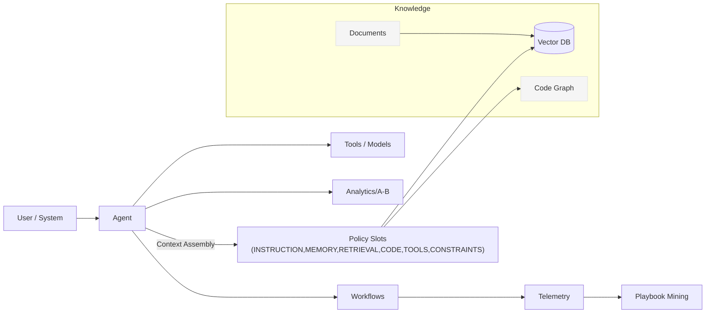

# 🚀 Automatos AI Products Dashboard

Automatos AI is an orchestration platform that blends **symbolic mechanisms**, **neural fields**, and **quantum semantics** into a practical system for building reliable copilots and automations.

---

## 🎯 Quick Navigation



**Launch your first workflow in minutes**

- [⚡ Quick Start Guide](quickstart.md) - Deploy in 10 minutes
- [🏠 Local Setup](LOCAL_SETUP_GUIDE.md) - Development environment
- [📚 Complete Guide](COMPREHENSIVE_GUIDE.md) - Full platform overview



**Essential platform documentation**

- [🏗️ System Architecture](architecture.md) - Technical design
- [📡 API Documentation](api.md) - REST API reference
- [🚀 Deployment Guide](deployment.md) - Production deployment
- [🔐 Security Config](security.md) - Enterprise security



**Deep-dive into advanced features**

- [🧠 Context Engineering](CONTEXT_ENGINEERING_IMPLEMENTATION.md) - RAG system
- [🔬 RAG Architecture](context-engineering-architecture.md) - Implementation
- [🎨 MCP Integration](mcp-integration.md) - IDE integrations
- [📊 Flow Diagrams](FLOW_DIAGRAMS.md) - Visual workflows



**Resources for developers**

- [👨‍💻 Developer Guide](DEVELOPER_GUIDE.md) - Development setup
- [🤝 Contributing Guide](CONTRIBUTING.md) - How to contribute
- [📝 Template Guide](templates.md) - Workflow templates
- [📋 Changelog](CHANGELOG.md) - Version history



---

## 🏢 Core Products

### 🤖 Multi-Agent Orchestration
- **Agent coordination** — Strategy, Security, Execution, Monitor, and Analysis agents work together
- **Intelligent workflows** — AI Module and Task Prompt dual workflow support
- **Real-time monitoring** — Live agent activity and performance tracking

### 🧠 Context Engineering System
- **Mathematical assembly** — `C = A(c₁..c₆)` allocates prompt space across slots (INSTRUCTION, MEMORY, RETRIEVAL, CODE, TOOLS, CONSTRAINTS)
- **RAG integration** — pgvector-powered semantic search and knowledge retrieval
- **Continuous learning** — System improves from usage patterns and feedback

### 🔄 Workflow Management
- **AI Module workflows** — Self-contained repositories with `ai-module.yaml` configuration
- **Task Prompt workflows** — Natural language deployment instructions
- **Advanced execution** — Conditional, parallel, and sequential patterns

### 📊 Analytics & Intelligence
- **Performance monitoring** — Real-time system and agent metrics
- **Business intelligence** — ROI tracking and optimization insights
- **Predictive analytics** — AI-powered performance forecasting

## Platform Flow

1. **Create agents** with a default **context policy** and tools
2. **Index knowledge** (docs + repos) for retrieval and the **code graph**
3. **Build workflows** chaining agents and tools
4. **Run & monitor**, mine **playbooks**, tune **policies** with **Assembly Preview**
5. **Measure** in Analytics + compare via **A/B**
6. Govern via **Settings** (tenants, providers, flags, CORS, audit)

## Architecture Overview



## 📚 Documentation Dashboard


**Navigate to any section using the tabs above or the direct links below**


### 🚀 Getting Started

[quickstart.md](quickstart.md)



[LOCAL_SETUP_GUIDE.md](LOCAL_SETUP_GUIDE.md)



[COMPREHENSIVE_GUIDE.md](COMPREHENSIVE_GUIDE.md)


### 🏗️ Core Platform

[architecture.md](architecture.md)



[api.md](api.md)



[deployment.md](deployment.md)



[security.md](security.md)


### 🧠 Advanced Features

[CONTEXT_ENGINEERING_IMPLEMENTATION.md](CONTEXT_ENGINEERING_IMPLEMENTATION.md)



[context-engineering-architecture.md](context-engineering-architecture.md)



[mcp-integration.md](mcp-integration.md)



[FLOW_DIAGRAMS.md](FLOW_DIAGRAMS.md)


### 👨‍💻 Development

[DEVELOPER_GUIDE.md](DEVELOPER_GUIDE.md)



[CONTRIBUTING.md](CONTRIBUTING.md)



[templates.md](templates.md)



[CHANGELOG.md](CHANGELOG.md)


## 🔥 Platform Highlights


**Mathematical Foundation**: Context assembly formula `C = A(c₁..c₆)` with weighted optimization across six dimensional slots



**Research-Validated**: Based on IBM Zurich, Princeton ICML, Indiana University, and Singapore-MIT research


## Use Cases

### Web Application Deployment
```yaml
# ai-module.yaml
name: "my-web-app"
module_type: "web_app"
framework: "react"
deployment_target: "docker"
auto_scaling: true
monitoring: true
```

### Microservices Architecture
```bash
# Natural language deployment
automotas workflow create \
  --repo https://github.com/yourorg/microservices.git \
  --prompt "Deploy with API gateway, monitoring, auto-scaling"
```

### AI/ML Model Deployment
```yaml
# ai-module.yaml
name: "ml-service"
module_type: "ml_model"
framework: "pytorch"
gpu_required: true
auto_scaling:
  min_replicas: 2
  max_replicas: 10
```

## 📖 Quick Reference

| Category | Key Documents | Purpose |
|----------|--------------|---------|
| **🚀 Start Here** | [Quick Start](quickstart.md), [Setup](LOCAL_SETUP_GUIDE.md) | New user onboarding |
| **🏗️ Technical** | [Architecture](architecture.md), [API](api.md) | System understanding |
| **🔐 Security** | [Security Guide](security.md), [Deployment](deployment.md) | Production setup |
| **🧠 Advanced** | [Context Engineering](CONTEXT_ENGINEERING_IMPLEMENTATION.md) | Deep features |
| **👨‍💻 Development** | [Developer Guide](DEVELOPER_GUIDE.md), [Contributing](CONTRIBUTING.md) | Code contribution |

## 🤝 Community & Support


**Open Source**: MIT licensed and community-driven development


- **📖 Documentation** — This comprehensive guide collection
- **🐛 Issues** — GitHub Issues for bug reports and feature requests  
- **💬 Discussions** — GitHub Discussions for technical questions
- **🤝 Contributing** — See [Contributing Guide](CONTRIBUTING.md) for details