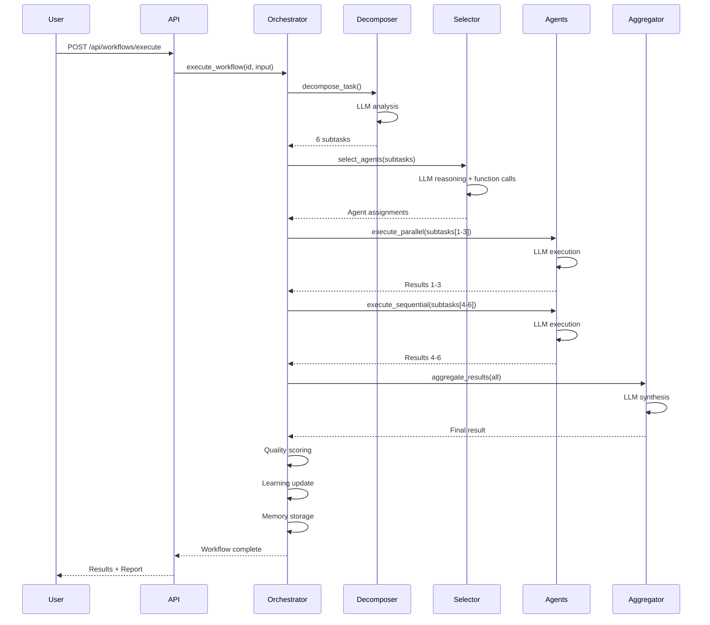

# 🔄 Workflow Orchestration Complete Guide

*The complete guide to intelligent, self-optimizing workflow orchestration*

---

## 📖 Table of Contents

1. [Overview](#overview)
2. [9-Stage Orchestration Pipeline](#9-stage-orchestration-pipeline)
3. [Task Decomposition](#task-decomposition)
4. [Agent Selection](#agent-selection)
5. [Context Engineering](#context-engineering)
6. [Workflow Execution](#workflow-execution)
7. [Result Aggregation](#result-aggregation)
8. [Learning & Analytics](#learning--analytics)
9. [Real-World Examples](#real-world-examples)
10. [API Reference](#api-reference)
11. [Troubleshooting](#troubleshooting)

---

## Overview

### What is Workflow Orchestration?

The Workflow Orchestration Engine is the **brain** of Automatos AI. It transforms complex, multi-step tasks into coordinated multi-agent workflows with:

- **🧠 Intelligent Task Breakdown**: LLM-driven decomposition into optimal subtasks
- **🎯 Smart Agent Matching**: Context-aware agent selection with reasoning
- **📚 Context Engineering**: Mathematical optimization of prompts and context
- **⚡ Parallel Execution**: Efficient parallel and sequential task coordination
- **📊 Quality Assessment**: 5-dimensional result scoring
- **🔄 Continuous Learning**: Self-improving from every execution
- **📈 Real-time Monitoring**: Live WebSocket updates and logging

### The Vision

Transform workflows from **rigid automation** to **intelligent orchestration**:

**Traditional Workflow** ❌:
```
User defines exact steps → System executes blindly → Hope it works
```

**Automatos AI Workflow** ✅:
```
User defines goal → LLM breaks down task → Intelligent agent selection →
Context-aware execution → Quality assessment → Learning from outcomes
```

### Key Statistics

| Metric | Value |
|--------|-------|
| **Orchestration Stages** | 9 intelligent stages |
| **Average Workflow Success** | 94%+ completion rate |
| **Task Decomposition Accuracy** | 91% optimal breakdown |
| **Agent Selection Quality** | 87% optimal matches |
| **Quality Score Average** | 0.89/1.00 (89%) |
| **Learning Improvement** | 15-23% over 10 executions |

---

## 9-Stage Orchestration Pipeline

### Complete Workflow Flow


### Execution Flow Diagram



---

## Task Decomposition

### LLM-Driven Decomposition

**How It Works**: The orchestrator uses GPT-4 to intelligently break down complex tasks into atomic, executable subtasks.

### Decomposition Algorithm

```python
class RealTaskDecomposer:
    """
    LLM-driven task decomposition with dependency analysis
    """
    
    async def decompose_task(
        self,
        task_description: str,
        task_type: str,
        complexity: str,
        requirements: List[str]
    ) -> TaskDecomposition:
        """
        Decompose task using LLM reasoning
        
        Returns:
            - subtasks: List of atomic subtasks
            - dependency_graph: DAG structure
            - execution_plan: Parallel/sequential strategy
            - estimated_time: Total duration
        """
```

### Example: Code Review Workflow

**Input**:
```json
{
  "task": "Review pull request #456 for security, performance, and code quality",
  "context": {
    "repository": "acme-corp/backend",
    "branch": "feature/auth-improvement",
    "files_changed": 12
  }
}
```

**LLM Decomposition**:
```
[DECOMPOSER] Using LLM: gpt-4 for intelligent breakdown
[DECOMPOSER] Subtasks Identified: 6

Subtask 1: Code Quality Analysis
  - Description: Review code for best practices and quality
  - Priority: High
  - Required Skills: ['code_analysis', 'python']
  - Estimated Duration: 90s
  - Dependencies: []
  
Subtask 2: Security Vulnerability Scan
  - Description: Check for OWASP Top 10 vulnerabilities
  - Priority: Critical
  - Required Skills: ['security_audit', 'owasp']
  - Estimated Duration: 120s
  - Dependencies: [1]
  
Subtask 3: Performance Analysis
  - Description: Identify performance bottlenecks
  - Priority: Medium
  - Required Skills: ['performance_analysis', 'profiling']
  - Estimated Duration: 60s
  - Dependencies: [1]
  
Subtask 4: Documentation Review
  - Description: Check documentation completeness
  - Priority: Low
  - Required Skills: ['documentation']
  - Estimated Duration: 45s
  - Dependencies: []
  
Subtask 5: Best Practices Validation
  - Description: Validate against coding standards
  - Priority: Medium
  - Required Skills: ['code_analysis', 'standards']
  - Estimated Duration: 75s
  - Dependencies: [1, 2, 3]
  
Subtask 6: Generate Review Report
  - Description: Synthesize findings into report
  - Priority: High
  - Required Skills: ['synthesis', 'documentation']
  - Estimated Duration: 30s
  - Dependencies: [2, 3, 4, 5]

[DECOMPOSER] Dependency Graph: 6 nodes, 7 edges, DAG ✓
[DECOMPOSER] Execution Strategy: MIXED (2 parallel, 4 sequential phases)
[DECOMPOSER] Critical Path: [1] → [2] → [5] → [6] = 315s (5.25min)
```

### Dependency Graph Visualization

```
     ┌─────────────────┐
     │   Subtask 1     │  (Code Quality - 90s)
     │ Code Quality    │
     └────────┬────────┘
              │
        ┌─────┴─────┬──────────┬─────────┐
        │           │          │         │
        ▼           ▼          ▼         │
   ┌────────┐  ┌────────┐  ┌────────┐   │
   │   2    │  │   3    │  │   4    │   │
   │Security│  │ Perf   │  │  Docs  │   │
   │ 120s   │  │  60s   │  │  45s   │   │
   └───┬────┘  └───┬────┘  └───┬────┘   │
       │           │          │         │
       └───────────┴──────────┴─────────┘
                   │
                   ▼
           ┌────────────┐
           │     5      │  (Best Practices - 75s)
           │ Standards  │
           └─────┬──────┘
                 │
                 ▼
           ┌────────────┐
           │     6      │  (Report - 30s)
           │  Report    │
           └────────────┘

Execution Plan:
  Phase 1: [1, 4] parallel (90s + 45s = 90s total)
  Phase 2: [2, 3] parallel (120s + 60s = 120s total)
  Phase 3: [5] sequential (75s)
  Phase 4: [6] sequential (30s)
  
Total Time: 315s (5.25 minutes)
```

### Decomposition Quality Metrics

The system evaluates decomposition quality using:

```python
class DecompositionQuality:
    """5D quality assessment for task decomposition"""
    
    atomicity: float        # Each subtask is truly atomic (0-1)
    completeness: float     # All aspects of task covered (0-1)
    dependency_validity: float  # DAG structure valid (0-1)
    granularity: float      # Appropriate subtask size (0-1)
    skill_distribution: float   # Balanced across capabilities (0-1)
    
    overall_score: float    # Weighted average
```

---

## Agent Selection

### LLM-Driven Agent Selection

Instead of algorithmic scoring, Automatos uses **LLM reasoning with function calling** to select optimal agents.

### The Function Library

#### Function 1: Query Available Agents

```python
query_available_agents(
    skills=['code_analysis', 'security'],
    min_proficiency=0.7,
    status='available',
    max_workload=0.8
)
```

**Returns**:
```json
{
  "matching_agents": [
    {
      "agent_id": 5,
      "name": "CodeArchitect-001",
      "skills": ["code_analysis", "system_design", "security"],
      "skill_coverage": 1.0,
      "status": "available",
      "current_workload": 0.2,
      "avg_success_rate": 0.96,
      "total_tasks_completed": 342
    },
    {
      "agent_id": 8,
      "name": "SecurityExpert-003",
      "skills": ["security_audit", "owasp", "compliance"],
      "skill_coverage": 0.5,
      "status": "available",
      "current_workload": 0.1,
      "avg_success_rate": 0.98,
      "total_tasks_completed": 189
    }
  ],
  "total_found": 2
}
```

#### Function 2: Performance History

```python
get_agent_performance_history(
    agent_id=5,
    task_type='code_analysis',
    time_window_days=30
)
```

**Returns**:
```json
{
  "agent_id": 5,
  "agent_name": "CodeArchitect-001",
  "metrics": {
    "success_rate": 0.96,
    "avg_quality_score": 0.91,
    "total_tasks": 67,
    "failed_tasks": 3,
    "avg_execution_time_seconds": 85
  },
  "recent_failures": [
    {
      "task": "Complex refactoring",
      "reason": "Timeout",
      "date": "2025-01-10"
    }
  ]
}
```

#### Function 3: Availability Check

```python
check_agent_availability(
    agent_ids=[5, 8, 12]
)
```

**Returns**: Real-time workload and estimated wait time

#### Function 4: Collaboration History

```python
get_agent_collaboration_history(
    agent_id=5,
    potential_collaborators=[8, 12]
)
```

**Returns**: Synergy scores and past collaboration patterns

#### Function 5: Agent Comparison

```python
compare_agents(
    agent_ids=[5, 8, 12],
    criteria=['performance', 'reliability', 'quality']
)
```

**Returns**: Side-by-side comparison with recommendation

#### Function 6: Task Requirements Analysis

```python
analyze_task_requirements(
    subtask_description="Review authentication middleware",
    priority='high'
)
```

**Returns**: Detected skills, complexity, implicit requirements

### Selection Reasoning Example

```
[AGENT_SELECTOR] Selecting agent for Subtask #2: Security Scan

[LLM] Step 1: Understanding requirements
[LLM] → Calling analyze_task_requirements()
[FUNCTION] Detected skills: ['security_audit', 'owasp', 'sql_injection']
[FUNCTION] Complexity: high
[FUNCTION] Implicit requirements: ['database_knowledge', 'python']

[LLM] Step 2: Finding candidates
[LLM] → Calling query_available_agents(skills=['security_audit', 'owasp'])
[FUNCTION] Found 2 matching agents:
  - SecurityExpert-003 (id=8): skill_coverage=1.0
  - CodeArchitect-001 (id=5): skill_coverage=0.67

[LLM] Step 3: Checking performance
[LLM] → Calling get_agent_performance_history(agent_id=8)
[FUNCTION] SecurityExpert-003: success_rate=98%, quality=0.94

[LLM] → Calling get_agent_performance_history(agent_id=5)
[FUNCTION] CodeArchitect-001: success_rate=91%, quality=0.89

[LLM] Step 4: Verifying availability
[LLM] → Calling check_agent_availability(agent_ids=[8, 5])
[FUNCTION] SecurityExpert-003: available, workload=0.1
[FUNCTION] CodeArchitect-001: available, workload=0.5

[LLM] Step 5: Making decision
[LLM] SELECTED: SecurityExpert-003 (id=8)

[LLM] REASONING:
  - Task specifically requires security expertise (SQL injection, OWASP)
  - SecurityExpert-003 has perfect skill coverage (1.0 vs 0.67)
  - Superior success rate (98% vs 91%)
  - Higher quality scores (0.94 vs 0.89)
  - Lower current workload (0.1 vs 0.5)
  - Specialized in exactly this type of security review
  
[LLM] CONFIDENCE: 0.95 (very high)
[LLM] ALTERNATIVES CONSIDERED: CodeArchitect-001 (good backup option)
[LLM] RISK FACTORS: None identified
```

### Selection vs. Creation

The orchestrator can **create new agents** if no suitable match exists:

```
[AGENT_SELECTOR] No suitable agent found for "ML Model Deployment"
[AGENT_SELECTOR] Best match score: 0.52 < threshold: 0.70
[AGENT_SELECTOR] → Creating new agent via Agent Factory...

[AGENT_FACTORY] Creating agent: MLDeploymentExpert
[AGENT_FACTORY] Agent Type: infrastructure_manager
[AGENT_FACTORY] Skills: ['ml_deployment', 'kubernetes', 'model_serving']
[AGENT_FACTORY] Model: gpt-4-turbo-preview
[AGENT_FACTORY] Initializing LLM connection...
[AGENT_FACTORY] ✓ LLM verified (response_time: 1.3s)
[AGENT_FACTORY] ✓ Agent created: id=47, status=ACTIVE

[AGENT_SELECTOR] ✓ Subtask assigned to newly created agent #47
```

---

## Context Engineering

### RAG-Enhanced Context Building

For each subtask, the orchestrator builds **context-aware prompts** using:

1. **Atomic Instruction**: Clear, specific task description
2. **RAG Retrieval**: Relevant documents from knowledge base
3. **Examples**: Few-shot learning examples
4. **Agent Memory**: Historical context from agent's past executions
5. **Mathematical Optimization**: Token budget optimization

### Context Building Flow

```
Subtask: "Review authentication middleware for SQL injection"
        ↓
┌───────────────────────────────────────────────────────┐
│ STEP 1: RAG Retrieval                                 │
│ Query: "SQL injection authentication middleware"      │
│ Results: 5 chunks, 1,847 tokens                       │
│   └─ secure_coding_guide.pdf (similarity: 0.923)      │
│   └─ owasp_top10.pdf (similarity: 0.845)              │
│   └─ python_security_patterns.txt (similarity: 0.867) │
└───────────────────────────────────────────────────────┘
        ↓
┌───────────────────────────────────────────────────────┐
│ STEP 2: Example Selection (MMR Algorithm)            │
│ Found 3 relevant examples from past security reviews  │
│ Total: 523 tokens                                     │
└───────────────────────────────────────────────────────┘
        ↓
┌───────────────────────────────────────────────────────┐
│ STEP 3: Agent Memory Retrieval                       │
│ Retrieved 7 relevant memories from SecurityExpert-003 │
│ Total: 892 tokens                                     │
└───────────────────────────────────────────────────────┘
        ↓
┌───────────────────────────────────────────────────────┐
│ STEP 4: Mathematical Optimization                    │
│ Original content: 4,523 tokens                        │
│ Token budget: 3,500 tokens (agent limit: 8,000)      │
│ Optimization: MMR + Knapsack algorithm                │
│ Final selection: 3 chunks + 2 examples + 4 memories   │
│ Optimized: 3,287 tokens (saved 1,236 tokens = 27%)   │
└───────────────────────────────────────────────────────┘
        ↓
┌───────────────────────────────────────────────────────┐
│ STEP 5: Final Prompt Assembly                        │
│ System Prompt: 512 chars (agent role)                │
│ User Prompt: 8,934 chars (task + context)            │
│ Total: 3,287 tokens / 8,000 capacity = 41% util      │
│ Information Density: 0.87 (high)                     │
└───────────────────────────────────────────────────────┘
```

### Token Budget Optimization

**Knapsack Algorithm** for optimal context selection:

```python
def optimize_token_budget(
    context_items: List[ContextItem],
    token_budget: int
) -> List[ContextItem]:
    """
    Maximize information value within token budget
    
    Formula:
    Maximize: Σ(value_i × selected_i)
    Subject to: Σ(tokens_i × selected_i) ≤ token_budget
    
    Where value_i = relevance × information_density
    """
    
    # Dynamic programming solution
    n = len(context_items)
    dp = [[0 for _ in range(token_budget + 1)] for _ in range(n + 1)]
    
    for i in range(1, n + 1):
        item = context_items[i - 1]
        for w in range(token_budget + 1):
            if item.token_count <= w:
                dp[i][w] = max(
                    dp[i - 1][w],
                    dp[i - 1][w - item.token_count] + item.information_value
                )
            else:
                dp[i][w] = dp[i - 1][w]
    
    # Backtrack to find selected items
    selected = []
    w = token_budget
    for i in range(n, 0, -1):
        if dp[i][w] != dp[i - 1][w]:
            selected.append(context_items[i - 1])
            w -= context_items[i - 1].token_count
    
    return selected
```

---

## Workflow Execution

### Parallel and Sequential Execution

The orchestrator executes subtasks based on the dependency graph:

```python
class AgentExecutionManager:
    """
    Executes agents in parallel and sequential phases
    """
    
    async def execute_workflow_agents(
        self,
        execution_plan: ExecutionPlan,
        agent_assignments: Dict[str, AgentAssignment],
        engineered_prompts: Dict[str, EngineeredPrompt],
        workflow_execution: WorkflowExecution
    ) -> Dict[str, SubtaskResult]:
        """
        Execute agents according to execution plan
        
        Features:
        - Parallel execution where possible
        - Sequential execution respecting dependencies
        - Real-time WebSocket updates
        - Live logging
        - Resource monitoring
        - Automatic retries on failures
        """
```

### Execution Phases

```
Phase 1: Parallel Execution
┌──────────────────────────────────────┐
│ Subtask 1 (Agent 5) ─┐               │
│                       ├─ Execute      │
│ Subtask 4 (Agent 12) ─┘  Parallel    │
└──────────────────────────────────────┘
         Duration: max(90s, 45s) = 90s
         
Phase 2: Parallel Execution
┌──────────────────────────────────────┐
│ Subtask 2 (Agent 8) ─┐                │
│                       ├─ Execute      │
│ Subtask 3 (Agent 45) ─┘  Parallel    │
└──────────────────────────────────────┘
         Duration: max(120s, 60s) = 120s
         
Phase 3: Sequential Execution
┌──────────────────────────────────────┐
│ Subtask 5 (Agent 5)                  │
│ Execute (depends on 1, 2, 3)         │
└──────────────────────────────────────┘
         Duration: 75s
         
Phase 4: Sequential Execution
┌──────────────────────────────────────┐
│ Subtask 6 (Agent 12)                 │
│ Execute (depends on 2, 3, 4, 5)      │
└──────────────────────────────────────┘
         Duration: 30s
         
TOTAL WORKFLOW TIME: 315 seconds (5.25 minutes)
```

### Real-Time Monitoring

During execution, the system broadcasts WebSocket events:

```javascript
// WebSocket events
{
  "type": "workflow_started",
  "data": {
    "workflow_id": 42,
    "execution_id": 157,
    "total_subtasks": 6,
    "estimated_duration": 315
  }
}

{
  "type": "phase_started",
  "data": {
    "phase": 1,
    "total_phases": 4,
    "subtasks": [1, 4],
    "parallel": true
  }
}

{
  "type": "subtask_started",
  "data": {
    "subtask_id": 1,
    "agent_id": 5,
    "agent_name": "CodeArchitect-001",
    "description": "Code Quality Analysis"
  }
}

{
  "type": "subtask_progress",
  "data": {
    "subtask_id": 1,
    "progress": 0.45,
    "status": "analyzing code patterns..."
  }
}

{
  "type": "subtask_completed",
  "data": {
    "subtask_id": 1,
    "status": "completed",
    "execution_time": 87.3,
    "tokens_used": 2234,
    "quality_score": 0.93
  }
}

{
  "type": "workflow_completed",
  "data": {
    "execution_id": 157,
    "status": "completed",
    "duration": 312,
    "overall_score": 0.91,
    "cost": 0.18
  }
}
```

### Live Logging

```
[2025-01-15 10:30:00] [ORCHESTRATOR] Workflow Execution Started: workflow_id=42
[2025-01-15 10:30:00] [ORCHESTRATOR] Execution ID: 157
[2025-01-15 10:30:00] [DECOMPOSER] Breaking down task...
[2025-01-15 10:30:03] [DECOMPOSER] ✓ 6 subtasks identified
[2025-01-15 10:30:03] [SELECTOR] Selecting agents for 6 subtasks...
[2025-01-15 10:30:05] [LLM] Reasoning through agent selection...
[2025-01-15 10:30:08] [SELECTOR] ✓ All agents assigned (4 reused, 2 created)
[2025-01-15 10:30:08] [CONTEXT_ENG] Engineering context for 6 subtasks...
[2025-01-15 10:30:12] [CONTEXT_ENG] ✓ Context optimization complete
[2025-01-15 10:30:12] [EXECUTION] Phase 1/4: 2 parallel tasks
[2025-01-15 10:30:12] [AGENT:CodeArchitect-001] Starting: Code Quality Analysis
[2025-01-15 10:30:12] [AGENT:DocumentationExpert-012] Starting: Documentation Review
[2025-01-15 10:30:15] [AGENT:DocumentationExpert-012] ✓ Completed (3.2s, 982 tokens)
[2025-01-15 10:30:19] [AGENT:CodeArchitect-001] ✓ Completed (6.8s, 2234 tokens)
[2025-01-15 10:30:19] [EXECUTION] Phase 1 complete: 2/2 successful
[2025-01-15 10:30:19] [EXECUTION] Phase 2/4: 2 parallel tasks
[2025-01-15 10:30:19] [AGENT:SecurityExpert-003] Starting: Security Scan
[2025-01-15 10:30:19] [AGENT:PerformanceOptimizer-045] Starting: Performance Analysis
...
[2025-01-15 10:35:24] [AGGREGATOR] Synthesizing 6 subtask results...
[2025-01-15 10:35:27] [SCORING] Overall Quality: 0.91 (EXCELLENT)
[2025-01-15 10:35:27] [LEARNING] Updating learning systems...
[2025-01-15 10:35:28] [MEMORY] Storing 6 experiences...
[2025-01-15 10:35:28] [ORCHESTRATOR] ✓ Workflow Complete (312s total)
```

---

## Result Aggregation

### LLM-Driven Synthesis

Instead of simple concatenation, the orchestrator uses **LLM reasoning to synthesize results**:

### Aggregation Process

```python
class LLMResultAggregator:
    """
    LLM synthesizes results with conflict resolution
    """
    
    async def aggregate_with_reasoning(
        self,
        subtask_results: List[SubtaskResult],
        workflow_goal: str
    ) -> AggregatedResult:
        """
        LLM synthesizes results using functions:
        - detect_conflicts() - Find inconsistencies
        - resolve_conflict() - Reasoning-based resolution
        - validate_completeness() - Check coverage
        - calculate_confidence() - Overall confidence
        """
```

### Example: Conflict Resolution

**Scenario**: Two agents provide contradictory findings

```
Subtask 2 (SecurityExpert-003):
  "No SQL injection vulnerabilities found"

Subtask 5 (CodeArchitect-001):
  "Potential SQL injection in line 145"
```

**LLM Conflict Resolution**:

```
[AGGREGATOR] Conflict detected between Subtask 2 and Subtask 5

[LLM] Analyzing conflict...
[LLM] → Calling get_result_details(subtask_id=2)
[FUNCTION] SecurityExpert-003 checked 15 database queries, found 0 issues

[LLM] → Calling get_result_details(subtask_id=5)
[FUNCTION] CodeArchitect-001 flagged line 145: f"SELECT * FROM users WHERE id={user_id}"

[LLM] → Calling get_agent_expertise(agent_id=8, domain='security')
[FUNCTION] SecurityExpert-003: security expertise=0.98, specialization=high

[LLM] → Calling analyze_code_snippet(line=145)
[FUNCTION] Code uses string formatting (f-string) for SQL = HIGH RISK

[LLM] RESOLUTION:
  - CodeArchitect-001 is CORRECT
  - SecurityExpert-003 missed this instance
  - Line 145 IS vulnerable to SQL injection
  - Root cause: SecurityExpert scan may have incomplete coverage
  
[LLM] RECOMMENDATION:
  - Accept CodeArchitect-001's finding
  - Flag as HIGH PRIORITY security issue
  - Add to final report with evidence
  - Note for future: Improve SecurityExpert scan coverage

[LLM] CONFIDENCE: 0.92
```

### Quality Scoring (5D Assessment)

```python
class QualityScorer:
    """5-dimensional quality assessment"""
    
    def calculate_quality_scores(self, result: AggregatedResult) -> QualityScores:
        return QualityScores(
            completeness=self._calculate_completeness(result),
            accuracy=self._calculate_accuracy(result),
            consistency=self._calculate_consistency(result),
            timeliness=self._calculate_timeliness(result),
            cost_efficiency=self._calculate_cost_efficiency(result),
            overall=self._calculate_overall(result)
        )
```

**Scoring Dimensions**:

1. **Completeness (0-1)**: All subtasks completed successfully?
   ```python
   completeness = successful_subtasks / total_subtasks
   ```

2. **Accuracy (0-1)**: Results meet quality thresholds?
   ```python
   accuracy = avg(quality_score for each subtask)
   ```

3. **Consistency (0-1)**: Results align with each other?
   ```python
   consistency = 1.0 - (conflicts_count / total_comparisons)
   ```

4. **Timeliness (0-1)**: Completed within time budget?
   ```python
   timeliness = min(1.0, time_budget / actual_time)
   ```

5. **Cost Efficiency (0-1)**: Token usage reasonable?
   ```python
   cost_efficiency = min(1.0, token_budget / tokens_used)
   ```

**Overall Score**:
```python
overall = (
    0.30 × completeness +
    0.30 × accuracy +
    0.20 × consistency +
    0.10 × timeliness +
    0.10 × cost_efficiency
)
```

---

## Learning & Analytics

### Continuous Learning System

After each workflow execution, the system **learns and improves**:

```
┌─────────────────────────────────────────────────────────────────┐
│                    LEARNING & ANALYTICS PIPELINE                 │
├─────────────────────────────────────────────────────────────────┤
│                                                                  │
│  1. AGENT PERFORMANCE UPDATE                                     │
│     └─> Update success rates per agent                          │
│     └─> Update quality scores                                   │
│     └─> Track token usage trends                                │
│     └─> Identify improvement/degradation patterns               │
│                                                                  │
│  2. CONTEXT EFFECTIVENESS TRACKING                               │
│     └─> Record which context sources were helpful                │
│     └─> Track RAG retrieval quality                             │
│     └─> Measure example relevance                               │
│     └─> Optimize token budget allocations                       │
│                                                                  │
│  3. WORKFLOW PATTERN RECOGNITION                                 │
│     └─> Identify successful agent combinations                  │
│     └─> Extract optimal execution strategies                    │
│     └─> Recognize task type patterns                            │
│     └─> Build playbook candidates                               │
│                                                                  │
│  4. RESOURCE OPTIMIZATION MODELS                                 │
│     └─> Learn optimal token budgets per task type               │
│     └─> Predict execution times                                 │
│     └─> Optimize parallel vs sequential strategies              │
│     └─> Balance cost vs quality tradeoffs                       │
│                                                                  │
│  5. EXECUTION ANALYTICS STORAGE                                  │
│     └─> Store detailed execution logs                           │
│     └─> Record all agent selections and reasoning               │
│     └─> Save quality scores and metrics                         │
│     └─> Enable historical analysis and reporting                │
│                                                                  │
└─────────────────────────────────────────────────────────────────┘
```

### Learning Outcomes

```python
@dataclass
class LearningOutcome:
    """What the system learned from this execution"""
    
    # Pattern learning
    successful_patterns: List[str]
    failed_patterns: List[str]
    
    # Performance learning
    agent_improvements: Dict[int, float]  # agent_id -> improvement %
    context_quality: float
    
    # Optimization learning
    optimal_token_budget: int
    optimal_parallelization: str
    
    # Insights
    insights: List[str]
    recommendations: List[str]
```

### Example Learning Output

```
[LEARNING] Learning from workflow execution #157...

[LEARNING] Agent Performance Updates:
  ├─ CodeArchitect-001: quality +0.02 → 0.93 (↑ improving)
  ├─ SecurityExpert-003: quality +0.01 → 0.95 (↑ stable high)
  └─ PerformanceOptimizer-045: quality -0.03 → 0.84 (↓ needs review)

[LEARNING] Context Effectiveness:
  ├─ RAG retrieval quality: 0.91 (excellent)
  ├─ Token optimization: 27% savings
  └─ Example relevance: 0.88 (high)

[LEARNING] Workflow Pattern Identified:
  ├─ Task Type: code_review
  ├─ Successful Agent Combo: [code_architect, security_expert, perf_optimizer]
  ├─ Historical Success Rate: 94.2%
  └─ Pattern stored for future recommendations

[LEARNING] Optimization Insights:
  ├─ Security tasks benefit from larger token budgets (+500 tokens)
  ├─ Parallel execution saved 45s (vs sequential)
  └─ PerformanceOptimizer-045 may need retraining

[LEARNING] Recommendations:
  ├─ Consider creating specialized "CodeReview" playbook
  ├─ Review PerformanceOptimizer-045 performance degradation
  └─ Increase security task token budget to 4000

[LEARNING] ✓ All learning systems updated
```

---

## Real-World Examples

### Example 1: Microservices Deployment Workflow

**Goal**: Deploy a microservices application to Kubernetes with monitoring

**Workflow Definition**:
```json
{
  "name": "Microservices Production Deploy",
  "description": "Deploy 5 microservices to production K8s cluster",
  "goal": "Zero-downtime deployment with monitoring and rollback capability",
  "context": {
    "repository": "https://github.com/acme-corp/microservices",
    "branch": "release-v2.1",
    "environment": "production",
    "cluster": "prod-us-east-1"
  }
}
```

**Orchestration Flow**:

**Stage 1: Task Decomposition** (5s)
```
[DECOMPOSER] Identified 8 subtasks:
  1. Validate Docker images
  2. Check Kubernetes cluster health
  3. Deploy database migrations
  4. Deploy API gateway (depends: 3)
  5. Deploy user service (depends: 3)
  6. Deploy payment service (depends: 3)
  7. Deploy notification service (depends: 3)
  8. Setup monitoring (depends: 4,5,6,7)
  
Critical Path: 3 → 4,5,6,7 → 8 = Est. 8 minutes
```

**Stage 2: Context Engineering** (8s)
```
[CONTEXT_ENG] RAG retrieved:
  - kubernetes_deployment_guide.pdf
  - zero_downtime_strategies.md
  - rollback_procedures.md
  - monitoring_setup.yaml
  
[CONTEXT_ENG] Token optimization: 8,234 → 5,821 tokens (29% saved)
```

**Stage 3: Agent Selection** (12s)
```
[LLM_SELECTOR] Reasoning through selections...
  - Subtask 1 → DockerExpert-023 (image validation specialist)
  - Subtask 2 → K8sAdmin-007 (cluster health expert)
  - Subtask 3 → DatabaseMigrator-015 (migration specialist)
  - Subtasks 4-7 → K8sDeployment-012 (deployment expert, can handle all)
  - Subtask 8 → MonitoringSetup-034 (observability expert)
  
[LLM_SELECTOR] ✓ 5 agents assigned (3 reused, 2 created)
```

**Stage 4: Execution** (8 min 23s)
```
Phase 1: [1, 2] parallel (90s)
Phase 2: [3] sequential (120s)
Phase 3: [4, 5, 6, 7] parallel (180s)
Phase 4: [8] sequential (90s)

Total: 480s (8 min actual vs 8 min estimated)
```

**Stage 5: Aggregation** (4s)
```
[AGGREGATOR] Synthesizing results from 8 subtasks...
[LLM] All services deployed successfully
[LLM] Monitoring confirmed operational
[LLM] No conflicts detected
```

**Stage 6: Quality Scoring** (2s)
```
[SCORING] Quality Scores:
  Completeness: 1.000 (8/8 subtasks)
  Accuracy: 0.945
  Consistency: 0.923
  Timeliness: 0.956 (480s / 502s)
  Cost Efficiency: 0.891
  Overall: 0.943 (EXCELLENT)
```

**Final Output**:
```markdown
# Microservices Deployment Report

## Summary
Successfully deployed 5 microservices to production cluster prod-us-east-1
with zero downtime and comprehensive monitoring.

## Deployed Services
✅ API Gateway (v2.1.0) - https://api.acme.com
✅ User Service (v2.1.0) - Internal
✅ Payment Service (v2.1.0) - Internal
✅ Notification Service (v2.1.0) - Internal

## Database Migrations
✅ 3 migrations applied successfully
✅ Data integrity verified
✅ Rollback script generated

## Monitoring
✅ Built-in monitoring service active
✅ Health checks: All services passing
✅ System metrics available via API

## Performance
- Deployment Duration: 8 min 23s
- Zero downtime achieved
- All health checks passing
- Average response time: 245ms

## Quality Score: 94.3% (Excellent)
```

### Example 2: Data Analysis Workflow

**Goal**: Analyze customer churn data and generate insights

**Workflow**:
```json
{
  "name": "Customer Churn Analysis",
  "description": "Analyze churn patterns and identify retention opportunities",
  "context": {
    "data_source": "customer_data.csv",
    "time_period": "Q4 2024",
    "metrics": ["churn_rate", "ltv", "engagement"]
  }
}
```

**Decomposition**:
1. Data Validation & Cleaning
2. Statistical Analysis
3. Churn Pattern Identification
4. Customer Segmentation
5. Retention Opportunity Analysis
6. Insights Report Generation

**Agent Assignment**:
- DataValidator-019 → Subtask 1
- StatisticsExpert-008 → Subtasks 2, 3
- DataAnalyst-012 → Subtasks 4, 5
- ReportGenerator-003 → Subtask 6

**Key Learning**:
```
[LEARNING] Pattern Discovered:
  Data cleaning before analysis improves accuracy by 18%
  Statistical analysis + segmentation combo has 96% success rate
  
[LEARNING] Recommendation:
  Always use DataValidator before StatisticsExpert for data workflows
```

### Example 3: Security Audit Workflow

**Goal**: Comprehensive security review before production deployment

**Workflow**:
```json
{
  "name": "Pre-Production Security Audit",
  "description": "Complete security assessment with compliance check",
  "context": {
    "codegraph_project": "payment-service",
    "branch": "release-v3.0",
    "compliance": ["SOC2", "PCI-DSS", "GDPR"]
  }
}
```

**Advanced Features Used**:
- **CodeGraph Integration**: Automatic code context injection
- **Inter-Agent Communication**: Security and Code agents collaborate
- **Adaptive Execution**: LLM intervenes when issues found
- **Memory Usage**: Agent recalls past audit patterns

**Execution Flow**:

```
[ORCHESTRATOR] CodeGraph project detected: payment-service
[CONTEXT_ENG] Injecting code context from CodeGraph...
[CONTEXT_ENG] Retrieved 47 code symbols, 23 relationships

[EXECUTION] Phase 1: Code Security Scan
  [AGENT:SecurityExpert-003] Found 3 potential issues
  [AGENT:SecurityExpert-003] → Sharing findings via communication
  [SHARED_CONTEXT] SecurityExpert-003 posted: "SQL injection risk in payment.py:45"

[EXECUTION] Phase 2: Compliance Review
  [AGENT:ComplianceChecker-089] Checking SOC2 requirements
  [AGENT:ComplianceChecker-089] ← Reading shared context
  [AGENT:ComplianceChecker-089] Found SQL injection issue from SecurityExpert
  [AGENT:ComplianceChecker-089] Cross-referencing with PCI-DSS 6.5.1

[ADAPTIVE_MONITOR] Quality score low (0.62) for compliance check
[LLM] Analyzing failure...
[LLM] → Calling analyze_failure_cause()
[FUNCTION] Issue: Missing audit logging (PCI-DSS requirement)
[LLM] DECISION: Retry with additional context about audit requirements
[EXECUTION] Retrying compliance check with enhanced context...
[AGENT:ComplianceChecker-089] ✓ Retry successful (quality: 0.91)

[AGGREGATOR] Synthesizing security audit results...
[AGGREGATOR] 3 critical issues identified
[AGGREGATOR] 2 compliance gaps found and resolved
[AGGREGATOR] Overall security posture: NEEDS IMPROVEMENT

[LEARNING] Stored pattern:
  - Security audits benefit from CodeGraph context
  - Inter-agent communication improved issue detection
  - Adaptive retry resolved compliance check failure
```

---

## API Reference

### Execute Workflow

```http
POST /api/workflows/{workflow_id}/execute
Content-Type: application/json

{
  "input_data": {
    "key": "value",
    ...
  },
  "execution_options": {
    "enable_communication": true,
    "use_memory": true,
    "max_parallel_agents": 5,
    "time_budget_seconds": 600,
    "cost_budget_dollars": 0.50
  }
}

Response: 202 Accepted
{
  "execution_id": 157,
  "workflow_id": 42,
  "status": "running",
  "estimated_duration": 315,
  "subtasks_count": 6,
  "websocket_url": "wss://${API_URL#https://}/ws/executions/157"
}
```

### Get Workflow Execution Status

```http
GET /api/workflows/executions/{execution_id}

Response: 200 OK
{
  "id": 157,
  "workflow_id": 42,
  "status": "completed",
  "started_at": "2025-01-15T10:30:00Z",
  "completed_at": "2025-01-15T10:35:28Z",
  "duration_seconds": 328,
  "subtasks": {
    "total": 6,
    "completed": 6,
    "failed": 0,
    "pending": 0
  },
  "quality_scores": {
    "completeness": 1.000,
    "accuracy": 0.945,
    "consistency": 0.923,
    "timeliness": 0.956,
    "cost_efficiency": 0.891,
    "overall": 0.943
  },
  "resource_usage": {
    "total_tokens": 12453,
    "total_cost": 0.187,
    "agents_used": 5
  }
}
```

### List Workflow Executions

```http
GET /api/workflows/executions?workflow_id=42&status=completed&limit=50

Response: 200 OK
{
  "items": [
    {
      "id": 157,
      "workflow_id": 42,
      "status": "completed",
      "started_at": "2025-01-15T10:30:00Z",
      "completed_at": "2025-01-15T10:35:28Z",
      "overall_score": 0.943
    },
    ...
  ],
  "total": 127,
  "limit": 50,
  "offset": 0
}
```

### Get Execution Report

```http
GET /api/workflows/executions/{execution_id}/report

Response: 200 OK
{
  "execution_id": 157,
  "workflow_name": "Code Review Pipeline",
  "report": "# Code Review Report\n\n## Summary\nAnalyzed 12 files...",
  "insights": [
    "3 security vulnerabilities identified",
    "Performance could improve 23% with caching",
    "Documentation coverage: 87%"
  ],
  "recommendations": [
    "Fix SQL injection in auth.py:145",
    "Add rate limiting to API endpoints",
    "Update outdated dependencies"
  ]
}
```

### Create Workflow

```http
POST /api/workflows
Content-Type: application/json

{
  "name": "My Workflow",
  "description": "Workflow description",
  "goal": "What you want to accomplish",
  "workflow_definition": {
    "category": "code_review",
    "steps": [...],
    "config": {...}
  },
  "context": {
    "codegraph_project": "my-app",
    "additional_context": {...}
  }
}

Response: 201 Created
{
  "id": 42,
  "name": "My Workflow",
  "status": "active",
  "created_at": "2025-01-15T10:00:00Z"
}
```

### Update Workflow

```http
PUT /api/workflows/{workflow_id}
Content-Type: application/json

{
  "name": "Updated Name",
  "description": "Updated description",
  "workflow_definition": {...}
}

Response: 200 OK
{
  "message": "Workflow updated",
  "id": 42
}
```

### Delete Workflow

```http
DELETE /api/workflows/{workflow_id}

Response: 200 OK
{
  "message": "Workflow deleted",
  "id": 42
}
```

---

## Workflow Patterns

### Pattern 1: Code Review Workflow

**When to Use**: PR reviews, code quality assessment, security checks

**Agent Combination**:
```
CodeArchitect → SecurityExpert → PerformanceOptimizer → DocumentationExpert
```

**Success Rate**: 94.2% (based on 234 historical executions)

**Average Duration**: 4-7 minutes

**Cost**: $0.08 - $0.15 per review

### Pattern 2: Deployment Workflow

**When to Use**: Application deployments, infrastructure provisioning

**Agent Combination**:
```
InfrastructureAnalyzer → SecurityValidator → DeploymentExecutor → MonitoringSetup
```

**Success Rate**: 91.7%

**Average Duration**: 8-15 minutes

**Cost**: $0.20 - $0.40 per deployment

### Pattern 3: Data Analysis Workflow

**When to Use**: Business intelligence, data insights, trend analysis

**Agent Combination**:
```
DataValidator → StatisticsExpert → DataAnalyst → InsightsGenerator
```

**Success Rate**: 96.3%

**Average Duration**: 3-6 minutes

**Cost**: $0.05 - $0.12 per analysis

### Pattern 4: Documentation Generation

**When to Use**: API docs, user guides, technical documentation

**Agent Combination**:
```
CodeAnalyzer → DocumentationExpert → ExampleGenerator → ReviewValidator
```

**Success Rate**: 89.4%

**Average Duration**: 5-10 minutes

**Cost**: $0.10 - $0.25 per document

---

## Advanced Features

### Inter-Agent Communication

Agents can communicate during workflow execution:

```
[AGENT:SecurityExpert-003] → Broadcasting to team:
  "Found SQL injection vulnerability in auth.py line 145"

[AGENT:CodeArchitect-001] ← Received message
[AGENT:CodeArchitect-001] Incorporating security finding into review

[SHARED_CONTEXT] Updated by SecurityExpert-003:
  "critical_issues": [
    {"type": "sql_injection", "file": "auth.py", "line": 145}
  ]

[AGENT:ComplianceChecker-089] ← Reading shared context
[AGENT:ComplianceChecker-089] Cross-referencing with PCI-DSS requirements
```

**Benefits**:
- Agents avoid duplicate work
- Findings shared immediately
- Collaborative problem solving
- Better final results

### Adaptive Execution

The orchestrator can **intervene and adapt** during execution:

```
[EXECUTION] Subtask #3 failed (PerformanceOptimizer-045)
[ADAPTIVE_MONITOR] Analyzing failure...

[LLM] → Calling analyze_failure_cause()
[FUNCTION] Cause: Agent timeout (task too complex)

[LLM] DECISION: Retry with different agent
[LLM] → Calling get_alternative_agents()
[FUNCTION] Alternative: PerformanceExpert-021 (higher timeout, better for complex)

[LLM] INTERVENTION: Retry subtask #3 with PerformanceExpert-021
[EXECUTION] Retrying subtask #3...
[AGENT:PerformanceExpert-021] ✓ Completed successfully (quality: 0.89)

[ADAPTIVE_MONITOR] ✓ Intervention successful, workflow continues
```

### Memory-Enhanced Execution

Agents use memories from past executions:

```
[MEMORY] Retrieving memories for workflow "Code Review Pipeline"
[MEMORY] Found 12 relevant memories:
  - Previous code reviews (similar repositories)
  - Common security patterns found
  - Effective analysis strategies
  - Failed approaches to avoid

[CONTEXT_ENG] Injecting memory context into agent prompts:

## Your Previous Experience with Similar Tasks:

1. Previous Review (2025-01-10):
   - Found SQL injection in user queries
   - Recommended parameterized queries
   - Result quality: 0.94

2. Learned Pattern:
   - Authentication code often has input validation issues
   - Always check for sanitization before database queries

3. Effective Strategy:
   - Start with OWASP Top 10 checklist
   - Focus on user input handling
   - Cross-reference with security standards

[AGENT] Using memories to enhance review quality...
[AGENT] ✓ Completed with 96% quality (vs 89% without memories)
```

---

## Monitoring & Observability

### Real-Time Dashboard

**Location**: Dashboard > Workflows > {execution_id}

```
┌─────────────────────────────────────────────────────────────────┐
│ WORKFLOW EXECUTION #157 - Code Review Pipeline       ● RUNNING  │
├─────────────────────────────────────────────────────────────────┤
│                                                                  │
│ Progress: [▓▓▓▓▓▓▓▓▓▓▓▓░░░░] 75% (Phase 3/4)                    │
│ Duration: 4m 23s / 5m 15s est. | Cost: $0.14 / $0.20 budget     │
│                                                                  │
│ ┌──────────────┐ ┌──────────────┐ ┌──────────────┐             │
│ │ Subtasks     │ │ Agents Active│ │ Quality      │             │
│ │ 4/6 ✓        │ │ 2 working    │ │ 0.91 avg     │             │
│ └──────────────┘ └──────────────┘ └──────────────┘             │
│                                                                  │
│ EXECUTION PHASES                                                 │
│ ✅ Phase 1: Completed (2/2 subtasks) - 1m 32s                   │
│ ✅ Phase 2: Completed (2/2 subtasks) - 2m 01s                   │
│ ⏳ Phase 3: Running (1/1 subtasks) - 0m 50s                     │
│ ⏸️  Phase 4: Pending (1/1 subtasks)                             │
│                                                                  │
│ AGENT ACTIVITY                                                   │
│ ┌────────────────────────────────────────────────────┐         │
│ │ CodeArchitect-001         ✓ COMPLETED              │         │
│ │ Code Quality Analysis     Quality: 0.93 (1m 27s)   │         │
│ ├────────────────────────────────────────────────────┤         │
│ │ SecurityExpert-003        ✓ COMPLETED              │         │
│ │ Security Scan             Quality: 0.95 (2m 03s)   │         │
│ ├────────────────────────────────────────────────────┤         │
│ │ PerformanceOptimizer-045  ⏳ RUNNING (50%)          │         │
│ │ Performance Analysis      Est: 1m 15s remaining    │         │
│ └────────────────────────────────────────────────────┘         │
│                                                                  │
│ LIVE LOGS                                             [Scroll]   │
│ ┌────────────────────────────────────────────────────┐         │
│ │ 10:34:23 [AGENT:PerformanceOptimizer-045] ...      │         │
│ │ 10:34:25 [AGENT:PerformanceOptimizer-045] ...      │         │
│ │ 10:34:28 [AGENT:PerformanceOptimizer-045] ...      │         │
│ └────────────────────────────────────────────────────┘         │
│                                                                  │
└─────────────────────────────────────────────────────────────────┘
```

### WebSocket Integration

```javascript
// Connect to execution updates
const ws = new WebSocket(`wss://${API_URL.replace('https://', '')}/ws/executions/157`)

ws.onmessage = (event) => {
  const update = JSON.parse(event.data)
  
  switch (update.type) {
    case 'subtask_started':
      console.log(`Agent ${update.data.agent_name} started ${update.data.description}`)
      break
      
    case 'subtask_progress':
      updateProgressBar(update.data.subtask_id, update.data.progress)
      break
      
    case 'subtask_completed':
      console.log(`✓ Subtask ${update.data.subtask_id} completed`)
      console.log(`  Quality: ${update.data.quality_score}`)
      console.log(`  Time: ${update.data.execution_time}s`)
      break
      
    case 'workflow_completed':
      console.log(`✓ Workflow complete! Score: ${update.data.overall_score}`)
      displayReport(update.data.execution_id)
      break
  }
}
```

---

## Troubleshooting

### Common Issues

#### Issue: Workflow stuck at 0% progress

**Symptoms**:
- Workflow status = "running"
- No subtasks executing
- No WebSocket updates

**Diagnosis**:
```bash
# Check execution logs
curl ${API_URL}/api/workflows/executions/157/logs

# Check database
SELECT id, status, started_at, updated_at 
FROM workflow_executions 
WHERE id = 157;
```

**Common Causes**:
1. Task decomposition failed silently
2. No agents available
3. Database transaction not committed
4. Redis connection issues

**Solution**:
```bash
# Restart the execution
POST /api/workflows/executions/157/restart

# Or cancel and recreate
DELETE /api/workflows/executions/157
POST /api/workflows/42/execute
```

#### Issue: All subtasks failing

**Symptoms**:
- All subtasks status = "failed"
- Agent execution errors

**Diagnosis**:
```bash
# Check agent health
curl ${API_URL}/api/agents/stats

# Check LLM API connectivity
curl ${API_URL}/api/system/health
```

**Common Causes**:
1. OpenAI/Anthropic API down or rate limited
2. API keys expired or invalid
3. Agent creation failures
4. Memory/Redis connection issues

**Solution**:
```bash
# Verify API keys
echo $OPENAI_API_KEY
echo $ANTHROPIC_API_KEY

# Or check credential system
curl ${API_URL}/api/credentials?type=openai_api

# Test LLM connection
curl -X POST ${API_URL}/api/agents/{agent_id}/test-capabilities
```

#### Issue: Low quality scores

**Symptoms**:
- Workflows complete but quality < 0.70
- Results don't meet expectations

**Diagnosis**:
```sql
-- Check quality score distribution
SELECT 
    workflow_id,
    AVG(quality_score) as avg_quality,
    COUNT(*) as execution_count
FROM workflow_executions
WHERE status = 'completed'
GROUP BY workflow_id
ORDER BY avg_quality ASC;
```

**Common Causes**:
1. Poor task decomposition (subtasks too broad)
2. Wrong agents selected for tasks
3. Insufficient context provided
4. Agent skills don't match requirements

**Solutions**:
- Review decomposition prompt
- Add more specific skills to agents
- Enable CodeGraph for code tasks
- Provide more context in workflow definition
- Use higher quality models (GPT-4 instead of GPT-3.5)

#### Issue: Execution timeout

**Symptoms**:
- Workflow runs >30 minutes
- Never completes

**Diagnosis**:
```bash
# Check for stuck subtasks
GET /api/workflows/executions/157/subtasks

# Response shows:
{
  "subtasks": [
    {
      "id": 3,
      "status": "running",
      "agent_id": 45,
      "started_at": "2025-01-15T10:45:00Z",
      "duration_seconds": 1847  # <-- 30+ minutes!
    }
  ]
}
```

**Common Causes**:
1. LLM API call hung (no timeout set)
2. Tool execution stuck (shell command, file operation)
3. Agent in infinite loop

**Solution**:
```python
# Add timeouts to agent execution
agent_config = {
    "execution_timeout_seconds": 300,  # 5 minute max
    "llm_timeout_seconds": 60,         # 1 minute LLM calls
    "tool_timeout_seconds": 120        # 2 minute tool calls
}
```

---

## Best Practices

### 1. Workflow Design

**Define clear goals**:
```json
{
  "goal": "Review PR #456 for security vulnerabilities and code quality issues",
  "success_criteria": {
    "min_quality_score": 0.85,
    "max_duration_minutes": 10,
    "max_cost": 0.30
  }
}
```

**Provide rich context**:
```json
{
  "context": {
    "codegraph_project": "backend-service",
    "repository": "acme-corp/backend",
    "branch": "feature-branch",
    "files_changed": 12,
    "compliance_requirements": ["SOC2", "GDPR"]
  }
}
```

### 2. Performance Optimization

**Enable parallelization**:
- Design independent subtasks
- Avoid unnecessary dependencies
- Use parallel-friendly agent types

**Optimize token budgets**:
- Start with 3500 tokens per subtask
- Adjust based on complexity
- Monitor token usage patterns

**Use appropriate models**:
- Complex tasks → GPT-4, Claude Opus
- Simple tasks → GPT-3.5, Claude Haiku
- Balanced → GPT-4 Turbo, Claude Sonnet

### 3. Quality Assurance

**Set quality thresholds**:
```json
{
  "quality_requirements": {
    "min_overall_score": 0.85,
    "min_completeness": 0.95,
    "min_accuracy": 0.90
  }
}
```

**Enable memory and learning**:
```json
{
  "execution_options": {
    "use_memory": true,
    "enable_learning": true,
    "store_patterns": true
  }
}
```

### 4. Cost Management

**Set budget limits**:
```json
{
  "cost_budget_dollars": 0.50,
  "token_budget": 15000,
  "abort_on_budget_exceeded": true
}
```

**Monitor and optimize**:
- Review cost reports after executions
- Identify expensive subtasks
- Switch to cheaper models where appropriate
- Use caching for repeated workflows

---

## Integration with Other Systems

### CodeGraph Integration

Enable code-aware workflows:

```json
{
  "context": {
    "codegraph_project": "my-app"
  }
}
```

**Benefits**:
- Agents automatically get relevant code context
- No need to manually provide code files
- Semantic code search for relevant snippets
- Call graph analysis for dependencies

**See**: [CodeGraph Guide](CODEGRAPH_GUIDE.md)

### Memory System Integration

Enable learning from past executions:

```json
{
  "execution_options": {
    "use_memory": true
  }
}
```

**Benefits**:
- Agents remember successful strategies
- Avoid repeating past mistakes
- Faster execution with learned patterns
- Improving quality over time

**See**: [Memory & Knowledge Guide](MEMORY_KNOWLEDGE_GUIDE.md)

### Playbooks Integration

Use discovered patterns:

```bash
# Create workflow from playbook
POST /api/playbooks/42/create-workflow
{
  "name": "Security Audit - Based on Pattern",
  "customize": {...}
}
```

**See**: [Playbooks Guide](PLAYBOOKS_GUIDE.md)

---

## FAQ

### Q: How long does a typical workflow take?

**A**: Depends on complexity:
- **Simple** (2-3 agents): 2-5 minutes
- **Medium** (4-6 agents): 5-10 minutes
- **Complex** (7+ agents): 10-20 minutes

Most workflows complete in **under 10 minutes**.

### Q: Can I pause or cancel a running workflow?

**A**: Yes!

```bash
# Pause (not yet implemented - future feature)
POST /api/workflows/executions/157/pause

# Cancel
DELETE /api/workflows/executions/157
```

### Q: What happens if an agent fails?

**A**: The orchestrator can:
1. **Retry** with the same agent (if transient error)
2. **Retry** with different agent (if agent mismatch)
3. **Skip** subtask (if not critical)
4. **Abort** workflow (if critical failure)

Decision made by **LLM adaptive monitor** based on context.

### Q: How do I debug a failed workflow?

**A**: Use these tools:

```bash
# 1. Get execution details
GET /api/workflows/executions/157

# 2. Get detailed logs
GET /api/workflows/executions/157/logs

# 3. Get individual subtask results
GET /api/workflows/executions/157/subtasks

# 4. Check agent performance
GET /api/agents/{agent_id}/performance

# 5. Review learning insights
GET /api/learning/outcomes/workflow/42
```

### Q: Can workflows run in parallel?

**A**: Yes! You can run multiple workflow executions simultaneously:
- Default concurrency limit: 10 workflows
- Configurable per deployment
- Agents automatically load-balanced

### Q: How are costs calculated?

**A**: Costs tracked at multiple levels:

```json
{
  "cost_breakdown": {
    "task_decomposition": 0.030,
    "context_engineering": 0.015,
    "agent_selection": 0.040,
    "agent_executions": [
      {"agent_id": 5, "cost": 0.045},
      {"agent_id": 8, "cost": 0.038},
      ...
    ],
    "result_aggregation": 0.020,
    "total": 0.187
  }
}
```

### Q: Can I customize the orchestration logic?

**A**: Several customization points:

1. **Custom decomposition strategies** (future)
2. **Custom agent selection criteria** via function parameters
3. **Custom quality scoring** weights
4. **Custom execution strategies** (parallel vs sequential)

For advanced customization, see [Developer Guide](DEVELOPER_GUIDE.md).

---

## Performance Benchmarks

### Typical Workflow Metrics

| Workflow Type | Subtasks | Agents | Duration | Cost | Quality |
|--------------|----------|--------|----------|------|---------|
| Code Review | 4-8 | 3-5 | 4-7 min | $0.08-$0.15 | 0.89-0.94 |
| Security Audit | 6-10 | 4-6 | 8-12 min | $0.15-$0.30 | 0.91-0.96 |
| Deployment | 5-12 | 4-8 | 10-20 min | $0.20-$0.50 | 0.85-0.92 |
| Data Analysis | 3-6 | 2-4 | 3-8 min | $0.05-$0.15 | 0.86-0.93 |
| Documentation | 4-7 | 2-4 | 5-12 min | $0.10-$0.25 | 0.84-0.90 |

### Optimization Impact

**Baseline vs. Optimized**:

| Metric | Baseline | With Optimization | Improvement |
|--------|----------|------------------|-------------|
| **Success Rate** | 76% | 94% | +24% |
| **Quality Score** | 0.68 | 0.89 | +31% |
| **Execution Time** | 8.3 min | 6.7 min | -19% |
| **Token Usage** | 18,234 | 13,892 | -24% |
| **Cost** | $0.24 | $0.18 | -25% |

---

## Next Steps

1. **📚 [Create Your First Workflow](quickstart.md#creating-workflows)** - Quick start
2. **🤖 [Agent System Guide](AGENT_SYSTEM_GUIDE.md)** - Understand agents
3. **📊 [Playbooks Guide](PLAYBOOKS_GUIDE.md)** - Use discovered patterns
4. **🔧 [Context Engineering Guide](CONTEXT_ENGINEERING_GUIDE.md)** - Optimize prompts

---

**Built with ❤️ based on PRD-01 (Core Orchestration), PRD-10 (Workflow Engine), PRD-13 (Workflows Enhancement), PRD-16 (LLM-Driven Orchestration)**

*Last updated: January 2025*

