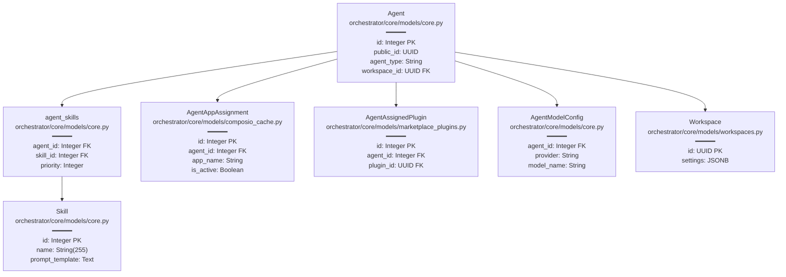
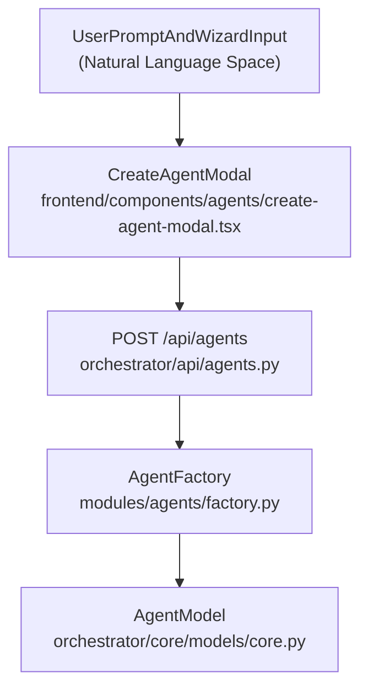
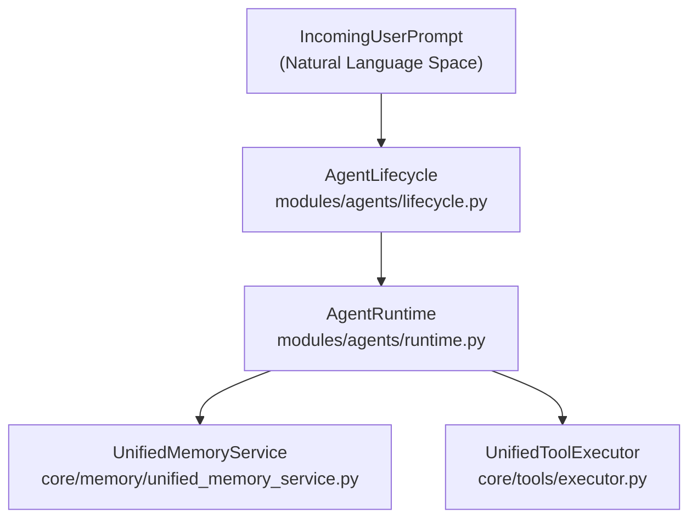

# Agents

Relevant source files

The following files were used as context for generating this wiki page:

- [frontend/components/agents/agent-configuration-modal.tsx](frontend/components/agents/agent-configuration-modal.tsx)
- [frontend/components/agents/agent-configuration.tsx](frontend/components/agents/agent-configuration.tsx)
- [frontend/components/agents/agent-details-modal.tsx](frontend/components/agents/agent-details-modal.tsx)
- [frontend/components/agents/agent-performance.tsx](frontend/components/agents/agent-performance.tsx)
- [frontend/components/agents/agent-roster.tsx](frontend/components/agents/agent-roster.tsx)
- [frontend/components/agents/agent-skills.tsx](frontend/components/agents/agent-skills.tsx)
- [frontend/components/agents/agent-status-control-modal.tsx](frontend/components/agents/agent-status-control-modal.tsx)
- [frontend/components/agents/create-agent-modal.tsx](frontend/components/agents/create-agent-modal.tsx)
- [frontend/components/agents/create-skill-modal.tsx](frontend/components/agents/create-skill-modal.tsx)
- [frontend/components/agents/model-selector.tsx](frontend/components/agents/model-selector.tsx)
- [frontend/components/agents/skill-configuration-modal.tsx](frontend/components/agents/skill-configuration-modal.tsx)
- [frontend/hooks/use-agent-api.ts](frontend/hooks/use-agent-api.ts)
- [frontend/hooks/use-model-api.ts](frontend/hooks/use-model-api.ts)
- [frontend/lib/agent-constants.ts](frontend/lib/agent-constants.ts)
- [orchestrator/alembic/versions/add_job_title_to_agents.py](orchestrator/alembic/versions/add_job_title_to_agents.py)
- [orchestrator/api/agent_endpoints.py](orchestrator/api/agent_endpoints.py)
- [orchestrator/api/agents.py](orchestrator/api/agents.py)
- [orchestrator/core/models/__init__.py](orchestrator/core/models/__init__.py)
- [orchestrator/core/models/core.py](orchestrator/core/models/core.py)

## Purpose and Scope

This document covers the **Agent Management System** in Automatos AI, providing a high-level overview of agent creation, configuration, lifecycle management, personas, capabilities, and LLM provider integration. Agents serve as autonomous AI entities that execute tasks, coordinate multi-agent workflows, invoke external tools, and maintain persistent state across sessions.

Because this is a parent overview page, deep technical implementation details are delegated to specialized child pages. For details on creation flows, see [Creating Agents](#5.1). For configuration settings, see [Agent Configuration](#5.2). For persona management, see [Agent Personas](#5.3). For capabilities, see [Agent Plugins & Skills](#5.4). For runtime loops, see [Agent Factory & Runtime](#5.5). For key resolution, see [LLM Provider Management](#5.6). For backend endpoints, see [Agent API Reference](#5.7).

---

## Agent Entity Model & Architecture

Agents are modeled via the `Agent` SQLAlchemy model, maintaining attributes such as display name, role classifications, statuses (`active`, `idle`, `maintenance`), and isolated workspace foreign keys [orchestrator/core/models/core.py:178-210](). Every workspace includes a default orchestrator system agent known as **Auto** [orchestrator/core/seeds/seed_auto_agent.py:150-162]().

### Agent Data Model Relationships

**Diagram: Agent Database Schema with SQLAlchemy Models**

**Sources:**
- [orchestrator/core/models/core.py:31-41]()
- [orchestrator/core/models/core.py:178-220]()
- [orchestrator/core/models/composio_cache.py:14-25]()
- [orchestrator/core/models/marketplace_plugins.py:16-25]()

---

## Agent Provisioning Space (Natural Language to Code Entity Space)

When a user defines an agent through user-facing interfaces or wizards, natural language descriptions and UI configurations are mapped directly into backend database tables and runtime factories.

### Agent Creation Flow Mapping

**Diagram: Natural Language Agent Creation to Code Entities**

**Sources:**
- [frontend/components/agents/create-agent-modal.tsx:67-78]()
- [orchestrator/api/agents.py:362-438]()
- [orchestrator/api/agent_endpoints.py:42-107]()

---

## Agent Runtime Execution Space (Natural Language to Code Entity Space)

During execution, prompts pass through lifecycle handlers and context builders, bridging high-level intent into concrete tool loops and memory interactions.

### Runtime Execution Mapping

**Diagram: Execution Intent to Agent Runtime Code Entities**

**Sources:**
- [orchestrator/api/agent_endpoints.py:19-21]()
- [orchestrator/api/agent_endpoints.py:82-91]()

---

## Sub-Topics and Child Pages

### Creating Agents
Agent creation is managed interactively through the `CreateAgentModal` component, which guides users across basic information, capability assignments, and intelligence selection [frontend/components/agents/create-agent-modal.tsx:67-78](). 

For full implementation details, see [Creating Agents](#5.1).

### Agent Configuration
Agents support granular configuration including resource constraints, execution priority levels, reporting hierarchies (`reports_to`), and modal tabs covering general preferences, models, and heartbeat rules [frontend/components/agents/agent-configuration-modal.tsx:105-171]().

For full implementation details, see [Agent Configuration](#5.2).

### Agent Personas
Personas define agent identity, behavior constraints, voice profiles, and custom prompt overrides. Seed agents such as **Auto** and **CTO** use predefined system prompts injected during context assembly.

For full implementation details, see [Agent Personas](#5.3).

### Agent Plugins & Skills
Agents extend their functional capabilities by linking workspace-scoped skills and plugins via explicit association tables (`agent_skills`, `agent_assigned_plugins`), ensuring strict tenant isolation and skill portability [orchestrator/core/models/core.py:31-36]().

For full implementation details, see [Agent Plugins & Skills](#5.4).

### Agent Factory & Runtime
The `AgentFactory` and `AgentLifecycle` manage agent provisioning, activation, and prompt execution loops with built-in tool deduplication and error handling [orchestrator/api/agent_endpoints.py:32-88]().

For full implementation details, see [Agent Factory & Runtime](#5.5).

### LLM Provider Management
The `LLMManager` handles client initialization, embedding managers, and a 3-tier API key resolution mechanism supporting BYOK overrides, platform credential stores, and environment variables [orchestrator/core/models/core.py:136-150]().

For full implementation details, see [LLM Provider Management](#5.6).

### Agent API Reference
The backend exposes RESTful endpoints under `/api/agents` for managing agent CRUD lifecycles, configuration updates, tool-to-app name resolutions, and performance statistics [orchestrator/api/agents.py:33]().

For full implementation details, see [Agent API Reference](#5.7).

**Sources:**
- [frontend/components/agents/create-agent-modal.tsx:67-178]()
- [frontend/components/agents/agent-configuration-modal.tsx:105-171]()
- [orchestrator/core/models/core.py:31-41]()
- [orchestrator/api/agent_endpoints.py:32-88]()
- [orchestrator/api/agents.py:33-182]()

---