# Agents

<details>
<summary>Relevant source files</summary>

The following files were used as context for generating this wiki page:

- [frontend/app/tools/page.tsx](frontend/app/tools/page.tsx)
- [frontend/components/agents/agent-management.tsx](frontend/components/agents/agent-management.tsx)
- [frontend/components/documents/document-management.tsx](frontend/components/documents/document-management.tsx)
- [frontend/components/layout/main-layout.tsx](frontend/components/layout/main-layout.tsx)
- [frontend/components/layout/sidebar.tsx](frontend/components/layout/sidebar.tsx)
- [frontend/components/settings/SettingsPanel.tsx](frontend/components/settings/SettingsPanel.tsx)
- [frontend/components/tools/my-tools-dashboard.tsx](frontend/components/tools/my-tools-dashboard.tsx)
- [frontend/components/tools/tools-dashboard.tsx](frontend/components/tools/tools-dashboard.tsx)
- [frontend/components/workflows/workflow-management.tsx](frontend/components/workflows/workflow-management.tsx)
- [frontend/tsconfig.tsbuildinfo](frontend/tsconfig.tsbuildinfo)
- [orchestrator/api/workflows.py](orchestrator/api/workflows.py)
- [orchestrator/consumers/chatbot/service.py](orchestrator/consumers/chatbot/service.py)
- [orchestrator/core/llm/manager.py](orchestrator/core/llm/manager.py)
- [orchestrator/modules/agents/factory/agent_factory.py](orchestrator/modules/agents/factory/agent_factory.py)
- [orchestrator/modules/orchestrator/pipeline.py](orchestrator/modules/orchestrator/pipeline.py)
- [orchestrator/modules/orchestrator/service.py](orchestrator/modules/orchestrator/service.py)

</details>


## Purpose and Scope

This document covers the **Agent Management System** in Automatos AI, including agent creation, configuration, lifecycle management, and capability assignment. Agents are the core AI entities that execute tasks, coordinate workflows, and interact with external tools.

For information about **agent execution and orchestration**, see [Universal Router](#9). For **agent-to-agent coordination patterns**, see [Agent Coordination](#3.6). For **workflow recipe execution** using agents, see [Workflows & Recipes](#4).

---

## Agent Entity Model

Agents are represented by the `Agent` SQLAlchemy model with the following core structure:

| Field | Type | Description |
|-------|------|-------------|
| `id` | Integer | Primary key |
| `name` | String | Unique agent name within workspace |
| `description` | Text | Agent purpose and capabilities |
| `agent_type` | String | Database type (e.g., `code_architect`, `custom`) |
| `marketplace_category` | String | UI category name (e.g., `DevOps`, `Custom`) |
| `status` | String | `active`, `inactive`, `maintenance` |
| `configuration` | JSONB | Priority, concurrency, resource limits |
| `tags` | ARRAY | Searchable keywords |
| `model_config` | JSONB | LLM provider, model, parameters |
| `model_usage_stats` | JSONB | Token counts, costs, request metrics |
| `performance_metrics` | JSONB | Success rate, tasks completed |
| `workspace_id` | UUID | Multi-tenant isolation |
| `created_by` | String | Creator identifier |
| `created_at` | Timestamp | Creation time |
| `updated_at` | Timestamp | Last modification time |

### Agent Data Model with Relationships

**Diagram: Agent Database Schema with SQLAlchemy Models**

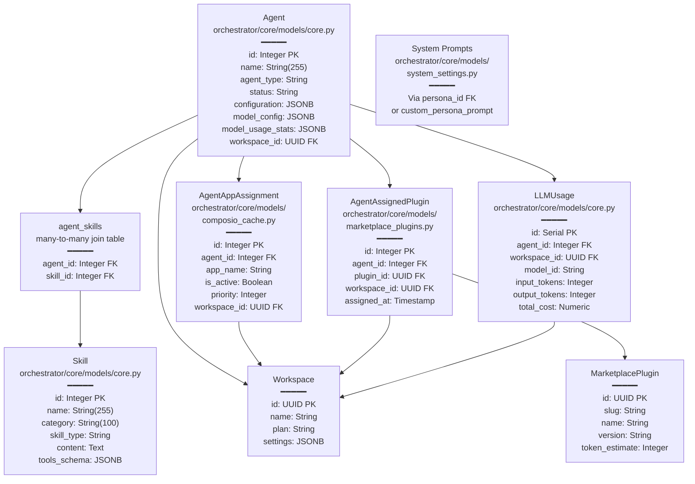

**Sources:**
- [orchestrator/core/models/core.py:Agent]()
- [orchestrator/core/models/core.py:Skill]()
- [orchestrator/core/models/core.py:LLMUsage]()
- [orchestrator/core/models/composio_cache.py:AgentAppAssignment]()
- [orchestrator/core/models/marketplace_plugins.py:AgentAssignedPlugin]()

---

## Agent Types and Categories

Agents use a dual-type system for flexibility:

### Database Types (`agent_type`)

Backend database values stored in the `agent_type` column:

- `code_architect` - Software architecture and design
- `security_expert` - Security analysis and audits
- `performance_optimizer` - Performance tuning
- `data_analyst` - Data processing and insights
- `infrastructure_manager` - Deployment and infrastructure
- `custom` - User-defined agents
- `system` - System-level operations
- `specialized` - Domain-specific expertise

### UI Categories (`marketplace_category`)

User-facing categories displayed in the frontend:

- `Personal Assistant`
- `Customer Support`
- `DevOps`
- `Social Media`
- `Accounting`
- `E-commerce`
- `Content Creation`
- `HR`
- `Data Analysis`
- `Custom`

**Mapping Logic:** The frontend uses `CATEGORY_TO_DB_MAP` and `DB_TO_CATEGORY_MAP` to translate between UI categories and database types. This allows specialized database types (e.g., `security_expert`) to preserve their identity while displaying as a generic UI category (e.g., `Custom`).

**Sources:**
- [frontend/lib/agent-constants.ts:AGENT_CATEGORIES]()
- [frontend/lib/agent-constants.ts:CATEGORY_TO_DB_MAP]()
- [orchestrator/core/models/core.py:AgentType]()
- [orchestrator/api/agents.py:243-267]()

---

## Agent Creation

### Create Agent Modal Workflow

**Diagram: Agent Creation Flow with API Endpoints**

```mermaid
sequenceDiagram
    participant User
    participant Modal["CreateAgentModal<br/>frontend/components/agents/<br/>create-agent-modal.tsx"]
    participant CreateAPI["POST /api/agents<br/>orchestrator/api/agents.py:362-438"]
    participant PersonaAPI["PUT /api/agents/{id}/persona<br/>orchestrator/api/agents.py:711-744"]
    participant ModelAPI["PUT /api/models/agents/{id}/config<br/>orchestrator/api/llm_models.py"]
    participant PluginAPI["PUT /api/agents/{id}/plugins<br/>orchestrator/api/agents.py"]
    participant DB["agents table<br/>PostgreSQL"]
    
    User->>Modal: "Click Create Agent"
    Modal->>Modal: "Step 1: Config<br/>Lines 528-643<br/>name, category, tags"
    Modal->>Modal: "Step 2: Persona<br/>Lines 645-725<br/>none/predefined/custom"
    Modal->>Modal: "Step 3: Model<br/>Lines 727-792<br/>provider, model_id, temp"
    Modal->>Modal: "Step 4: Tools<br/>Lines 794-894<br/>Composio apps"
    Modal->>Modal: "Step 5: Capabilities<br/>Lines 896-993<br/>marketplace plugins"
    
    User->>Modal: "Click Create<br/>handleSubmit() Line 184"
    Modal->>CreateAPI: "agentPayload {<br/>name, agent_type,<br/>tool_ids, tags<br/>}"
    CreateAPI->>DB: "INSERT INTO agents<br/>Line 377-388"
    CreateAPI->>DB: "_normalize_tags()<br/>Line 374"
    CreateAPI->>DB: "agent_app_assignments<br/>Lines 408-421"
    DB-->>CreateAPI: "newAgent {id, ...}"
    CreateAPI-->>Modal: "newAgent"
    
    alt "Persona Selected"
        Modal->>PersonaAPI: "{persona_id OR custom_prompt}<br/>Line 259"
        PersonaAPI->>DB: "UPDATE agents<br/>SET persona_id/custom_persona_prompt"
    end
    
    alt "Model Config Changed"
        Modal->>ModelAPI: "modelConfig {<br/>provider, model_id,<br/>temperature, max_tokens<br/>}<br/>Line 280"
        ModelAPI->>DB: "UPDATE agents.model_config"
    end
    
    alt "Plugins Selected"
        Modal->>PluginAPI: "{plugin_ids: [...]}<br/>Line 304"
        PluginAPI->>DB: "INSERT INTO agent_assigned_plugins"
    end
    
    Modal->>Modal: "queryClient.invalidateQueries<br/>Line 330"
    Modal-->>User: "Success Toast + Redirect<br/>Line 333"
```

**Sources:**
- [frontend/components/agents/create-agent-modal.tsx:184-338]()
- [orchestrator/api/agents.py:362-438]()
- [orchestrator/api/agents.py:711-744]()

### Agent Creation API

**Endpoint:** `POST /api/agents`

**Request Payload:**

```json
{
  "name": "Research Assistant",
  "agent_type": "custom",
  "marketplace_category": "Personal Assistant",
  "description": "Helps with research and documentation",
  "tool_ids": [101, 205],
  "tags": ["research", "writing", "pdf"],
  "configuration": {
    "specializations": ["research", "summarization"]
  }
}
```

**Response:**

```json
{
  "id": 42,
  "name": "Research Assistant",
  "agent_type": "custom",
  "status": "active",
  "tools": [...],
  "plugins": [],
  "created_at": "2025-01-15T10:30:00Z"
}
```

**Backend Flow:**

1. **Name Uniqueness Check** - [orchestrator/api/agents.py:369-372]()
2. **Tag Normalization** - [orchestrator/api/agents.py:374]() uses `_normalize_tags()`
3. **Agent Creation** - [orchestrator/api/agents.py:377-388]()
4. **Skill Assignment** (if provided) - [orchestrator/api/agents.py:392-401]()
5. **Tool Assignment** - [orchestrator/api/agents.py:408-421]() via `AgentAppAssignment`

**Sources:**
- [frontend/components/agents/create-agent-modal.tsx:184-338]()
- [orchestrator/api/agents.py:362-438]()
- [frontend/hooks/use-agent-api.ts:186-203]()

---

## Agent Configuration

The `AgentConfigurationModal` provides a comprehensive configuration interface with seven tabs:

### Configuration Tabs Structure

**Diagram: AgentConfigurationModal Component Hierarchy**

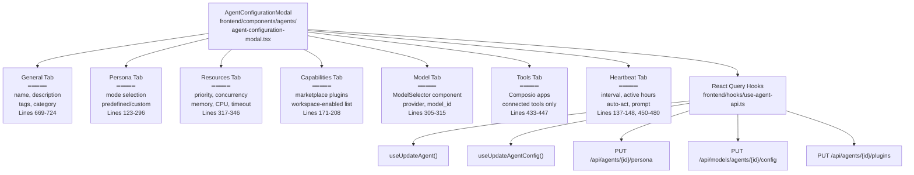

**Sources:**
- [frontend/components/agents/agent-configuration-modal.tsx:1-935]()
- [frontend/hooks/use-agent-api.ts:186-400]()

### General Configuration

Basic agent properties and operational settings:

| Field | Type | Description |
|-------|------|-------------|
| `priority_level` | Enum | `low`, `medium`, `high`, `critical` |
| `max_concurrent_tasks` | Integer | Max parallel task execution (1-10) |
| `auto_start` | Boolean | Start agent automatically on system boot |
| `retry_attempts` | Integer | Failed task retry count (0-5) |
| `timeout_seconds` | Integer | Task timeout in seconds (60-3600) |

**Resource Limits:**

```json
{
  "resource_limits": {
    "memory_mb": 1024,
    "cpu_percent": 50,
    "network_bandwidth": 100
  }
}
```

**Environment & Logging:**

- `environment`: `development`, `staging`, `production`
- `logging_level`: `debug`, `info`, `warning`, `error`
- `performance_monitoring`: Boolean

**Sources:**
- [frontend/components/agents/agent-configuration-modal.tsx:669-724]()
- [orchestrator/api/agents.py:608-698]()

### Model Configuration (PRD-15)

LLM provider and parameter settings stored in `Agent.model_config` JSONB field:

```json
{
  "provider": "openai",
  "model_id": "gpt-4",
  "temperature": 0.7,
  "max_tokens": 2000,
  "top_p": 1.0,
  "frequency_penalty": 0.0,
  "presence_penalty": 0.0,
  "fallback_model_id": "gpt-3.5-turbo"
}
```

**ModelSelector Component:**

The `ModelSelector` component filters available models by provider and displays model metadata (cost, context window, capabilities).

**Update Endpoint:** `PUT /api/models/agents/{agent_id}/config`

**Sources:**
- [frontend/components/agents/agent-configuration-modal.tsx:305-315]()
- [frontend/components/agents/model-selector.tsx:ModelSelector]()
- [frontend/hooks/use-model-api.ts:useUpdateAgentModelConfig]()

### Heartbeat Configuration (PRD-55)

Autonomous agent check-ins for proactive monitoring:

```json
{
  "enabled": true,
  "interval_minutes": 60,
  "inherit_active_hours": true,
  "active_hours_start": "08:00",
  "active_hours_end": "20:00",
  "prompt": "Check for critical system alerts and pending tasks",
  "auto_act": false,
  "report_to": "orchestrator"
}
```

**Endpoints:**
- `GET /api/heartbeat/agents/{agent_id}/config` - Fetch config
- `PUT /api/heartbeat/agents/{agent_id}/config` - Update config
- `POST /api/heartbeat/agents/{agent_id}/run` - Trigger manual heartbeat
- `GET /api/heartbeat/agents/{agent_id}/last` - Last result

**Sources:**
- [frontend/components/agents/agent-configuration-modal.tsx:137-148]()
- [frontend/components/agents/agent-configuration-modal.tsx:450-480]()

---

## Agent Personas (US-021)

Personas define agent identity, voice, and behavior through system prompts.

### Persona Modes

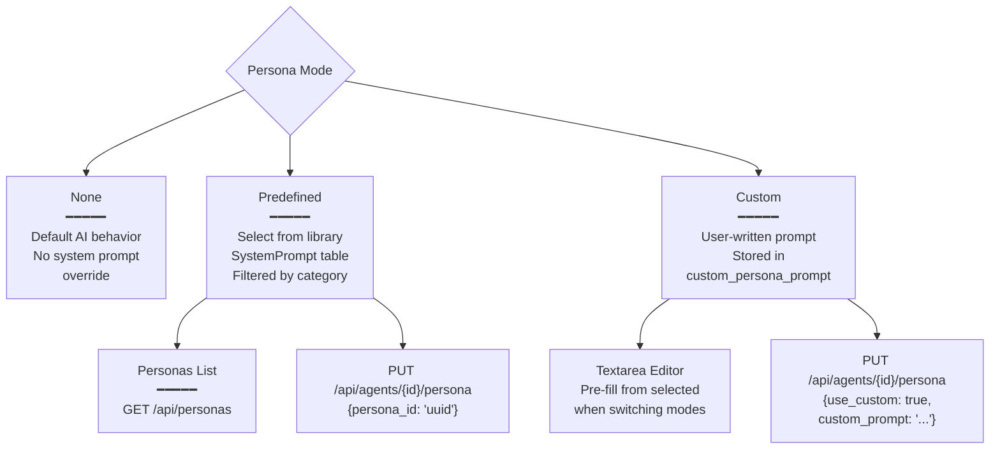

### Persona API

**Fetch Agent Persona:** `GET /api/agents/{agent_id}/persona`

**Response:**

```json
{
  "persona_id": "uuid-123",
  "persona_name": "Professional Analyst",
  "system_prompt": "You are a professional data analyst...",
  "use_custom_persona": false,
  "suggested_temperature": 0.5
}
```

**Update Persona:** `PUT /api/agents/{agent_id}/persona`

**Request (Predefined):**

```json
{
  "persona_id": "uuid-123",
  "use_custom": false
}
```

**Request (Custom):**

```json
{
  "use_custom": true,
  "custom_prompt": "You are a friendly assistant who explains complex topics in simple terms..."
}
```

### Persona Library

Personas are stored in the `system_prompts` table (reusing the prompt management infrastructure) and filtered by `category` to match agent types.

**Category Filtering:** When creating a `DevOps` agent, only personas with `category = 'devops'` are shown. Custom agents see all personas.

**Pre-fill Behavior:** Switching from "Predefined" to "Custom" mode pre-fills the textarea with the selected persona's system prompt for easy editing.

**Sources:**
- [frontend/components/agents/create-agent-modal.tsx:89-160]()
- [frontend/components/agents/agent-configuration-modal.tsx:123-296]()
- [frontend/components/agents/create-agent-modal.tsx:528-696]()

---

## Capability Assignment

Agents gain functionality through three mechanisms: **Skills**, **Plugins**, and **Tools**.

### Assignment Architecture

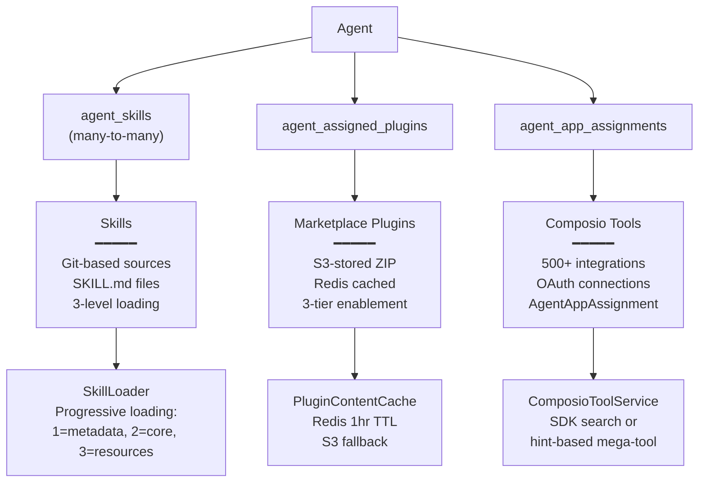

### Skills Assignment

**Add Skill:** `POST /api/agents/{agent_id}/skills`

**Request:**

```json
{
  "skill_ids": [10, 25, 42]
}
```

Skills are stored in a many-to-many relationship via the `agent_skills` join table. At runtime, the `SkillLoader` fetches skill content progressively (metadata → core → resources) to optimize token usage.

**Sources:**
- [orchestrator/api/agents.py:583-606]()
- [orchestrator/api/skills.py:426-455]()
- [frontend/components/agents/agent-skills.tsx:AgentSkills]()

### Plugins Assignment

**Fetch Workspace Plugins:** `GET /api/workspaces/{workspace_id}/plugins`

**Fetch Agent Plugins:** `GET /api/agents/{agent_id}/plugins`

**Update Assignment:** `PUT /api/agents/{agent_id}/plugins`

**Request:**

```json
{
  "plugin_ids": ["plugin-uuid-1", "plugin-uuid-2"]
}
```

**Three-Tier Enablement:**

1. **Global Approval** - Admin approves plugin in marketplace (`marketplace_plugins.status = 'published'`)
2. **Workspace Enable** - Workspace admin enables plugin (`workspace_plugins` entry)
3. **Agent Assignment** - Agent assigned specific plugins (`agent_assigned_plugins` entry)

Only workspace-enabled plugins appear in the agent configuration UI. Plugin content is cached in Redis with 1-hour TTL.

**Token Estimation:** The UI displays total token estimate for assigned plugins:

```typescript
const assignedTokenEstimate = workspacePlugins
  .filter(p => assignedPluginIds.has(p.plugin_id))
  .reduce((sum, p) => sum + (p.token_estimate || 0), 0)
```

**Sources:**
- [frontend/components/agents/agent-configuration-modal.tsx:171-208]()
- [frontend/components/agents/agent-configuration-modal.tsx:377-409]()
- [orchestrator/api/agents.py:agents plugin endpoints]()

### Tools Assignment

Tools are Composio integrations (Slack, GitHub, Gmail, etc.). Only **connected** tools are assignable to agents.

**Tool Resolution Logic:**

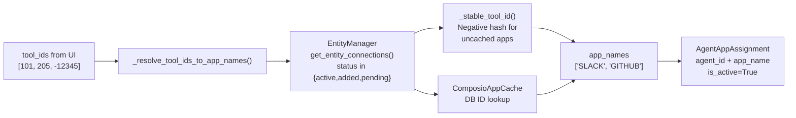

**Stable Tool ID:** Frontend uses `stableId()` hash function to generate negative IDs for apps without database cache entries. Backend matches these hashes via `_stable_tool_id()`.

**Update Tools:** `PUT /api/agents/{agent_id}`

**Request:**

```json
{
  "tool_ids": [101, 205]
}
```

Backend converts IDs to app names, then inserts/updates `AgentAppAssignment` rows:

```sql
INSERT INTO agent_app_assignments (agent_id, app_name, is_active, priority, config)
VALUES (42, 'SLACK', true, 0, '{}')
```

**Sources:**
- [orchestrator/api/agents.py:34-109]()
- [orchestrator/api/agents.py:651-683]()
- [frontend/components/agents/agent-configuration.tsx:66-95]()

---

## Agent Lifecycle & Status

### Status States

| Status | Description | Icon | Color |
|--------|-------------|------|-------|
| `active` | Agent running, accepting tasks | `CheckCircle` | Success green |
| `inactive` | Agent stopped, no task execution | `Clock` | Muted gray |
| `maintenance` | Agent undergoing updates/repairs | `Settings` | Warning yellow |
| `paused` | Agent paused, tasks queued | `Pause` | Primary blue |

### Status Control Flow

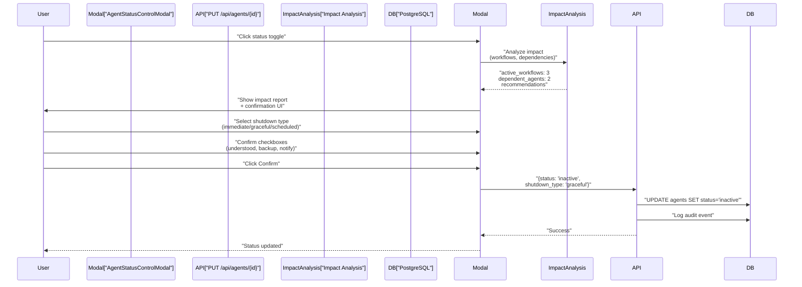

### Impact Analysis

When changing agent status, the system analyzes:

1. **Active Workflows** - Workflows currently using the agent
2. **Queued Tasks** - Tasks waiting for the agent
3. **Dependent Agents** - Other agents that depend on this agent
4. **System Impact** - Performance degradation estimate

**Shutdown Options:**

- **Immediate** - Stop agent immediately (may interrupt tasks)
- **Graceful** - Finish current tasks before stopping
- **Scheduled** - Schedule shutdown after workflow completion

**Required Confirmations:**

- Acknowledge active workflows will be affected
- Confirm backup/recovery plan in place
- Confirm dependent systems have been notified

**Sources:**
- [frontend/components/agents/agent-status-control-modal.tsx:AgentStatusControlModal]()
- [orchestrator/api/agents.py:608-698]()

---

## Agent Runtime Architecture

Agents are instantiated through the `AgentFactory` class, which creates `AgentRuntime` instances with complete execution context.

### Agent Factory Initialization

The `AgentFactory` class (`orchestrator/modules/agents/factory/agent_factory.py`) manages agent lifecycle:

```python
class AgentFactory:
    def __init__(self, db_session: Session = None):
        self.db_session = db_session
        self.active_agents: Dict[int, AgentRuntime] = {}
```

**Key Methods:**

- `activate_agent(agent_id, use_system_llm=False)` - Creates runtime instance
- `_build_tools_prompt(required_tools)` - Generates tool usage instructions
- `_build_skill_tool_schemas(agent_skills)` - Extracts skill tools
- `_ensure_llm_provider()` - Lazy LLM initialization

### AgentRuntime Dataclass

The `AgentRuntime` dataclass represents an active agent instance:

```python
@dataclass
class AgentRuntime:
    agent_id: int
    metadata: AgentMetadata
    llm_manager: LLMManager
    lifecycle_state: AgentLifecycle
    execution_count: int = 0
    total_tokens_used: int = 0
    performance_metrics: Dict[str, Any]
    memory: List[Dict[str, Any]]
    tools: List[Dict[str, Any]]
    tool_executor: Any = None  # UnifiedToolExecutor
    workspace_id: Optional[Any] = None
```

### Runtime Assembly Process

**Diagram: Agent Activation Flow with Code Entities**

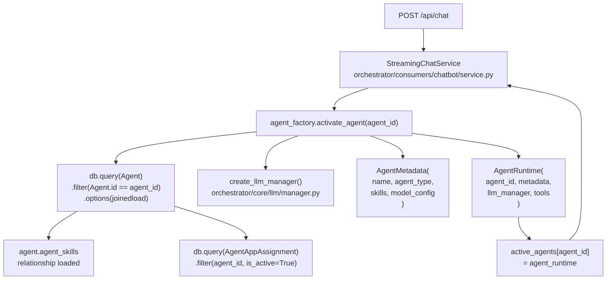

**Sources:**
- [orchestrator/modules/agents/factory/agent_factory.py:503-879]()
- [orchestrator/consumers/chatbot/service.py:456-476]()
- [orchestrator/consumers/chatbot/service.py:493-556]()

### Tool Schema Generation

Agents receive tool schemas through two mechanisms:

**1. Skill-Based Tools** (`_build_skill_tool_schemas`)

Extracts executable tools from assigned skills' `tools_schema` JSONB field:

```python
def _build_skill_tool_schemas(agent_skills: List) -> List[Dict]:
    tools = []
    for skill in agent_skills:
        if not hasattr(skill, 'tools_schema') or not skill.tools_schema:
            continue
        skill_tools = skill.tools_schema.get('tools', [])
        for tool_def in skill_tools:
            tools.append({
                "type": "function",
                "function": {
                    "name": tool_def.get('name'),
                    "description": tool_def.get('description'),
                    "parameters": tool_def.get('parameters')
                }
            })
    return tools
```

**2. Composio Integration Tools**

Via `ComposioToolService.get_tools_for_step()`:

- **Strategy A (Primary)**: SDK semantic search for relevant actions
- **Strategy B (Fallback)**: Hint-based mega-tool with `composio_execute` function

**Sources:**
- [orchestrator/modules/agents/factory/agent_factory.py:234-296]()
- [orchestrator/consumers/chatbot/service.py:744-800]()

### System Prompt Assembly in Chat Service

The `StreamingChatService.stream_response_with_agent()` method assembles the final context:

**Diagram: System Prompt Construction Pipeline**

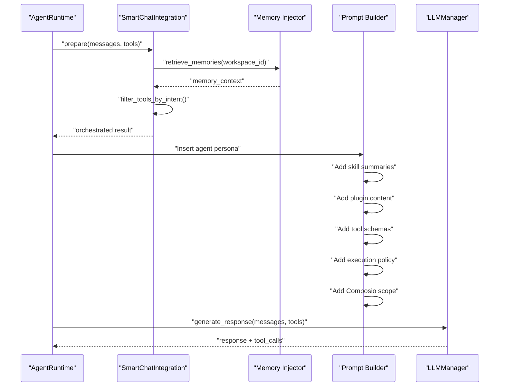

**Prompt Assembly Sequence:**

1. **Base System Prompt** - From `SmartChatIntegration.prepare()`
2. **Agent Identity** - Name, description, agent_type
3. **Persona** - Custom or predefined system prompt
4. **Skill Summaries** - Brief descriptions from `agent.agent_skills`
5. **Plugin Content** - From `PluginContentCache` (if assigned)
6. **Tool Definitions** - OpenAI function calling schemas
7. **Execution Policy** - Multi-step task handling instructions
8. **Composio Scope** - Available app names for direct action calls
9. **Memory Context** - Retrieved from Mem0

**Special Case: CTO Agent Prompt Override (PRD-67)**

For agents with `slug='auto-cto'`:

```python
if _is_cto_agent:
    from consumers.chatbot.cto_prompt_builder import CtoPromptBuilder
    _cto_prompt = CtoPromptBuilder.build(
        soul_document=_soul,
        architecture_context=_arch_ctx,
        memories=_cto_memories,
        tool_names=[...],
        platform_state=_platform_state,
    )
    llm_messages[0]["content"] = _cto_prompt
```

**Sources:**
- [orchestrator/consumers/chatbot/service.py:583-740]()
- [orchestrator/consumers/chatbot/service.py:649-693]()

### Tool Execution Pipeline

**Diagram: Tool Call Execution Flow with Code Classes**

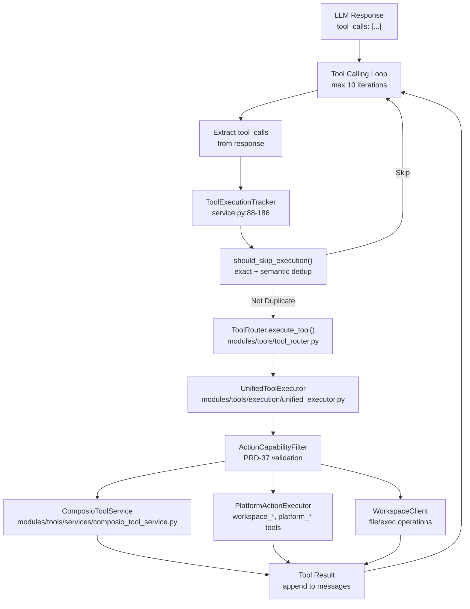

**ToolExecutionTracker Deduplication:**

The `ToolExecutionTracker` class prevents infinite loops through:

1. **Exact Matching** - Hash of `(tool_name, args_hash)`
2. **Semantic Similarity** - For search tools, compares query strings with 75% threshold
3. **Retry Limits** - Per-tool execution limits (e.g., `composio_execute: 2`, `read_file: 3`)

```python
SEARCH_TOOLS = {
    'search_knowledge', 'semantic_search', 'search_codebase',
    'search_tables', 'search_images', 'search_formulas'
}

TOOL_RETRY_LIMITS = {
    'composio_execute': 2,
    'search_knowledge': 2,
    'read_file': 3,
    'default': 3
}
```

**Sources:**
- [orchestrator/consumers/chatbot/service.py:42-186]()
- [orchestrator/consumers/chatbot/service.py:879-1014]()
- [orchestrator/modules/tools/tool_router.py:1-575]()

---

## Agent Analytics & Usage Tracking (PRD-54)

Every agent execution generates usage records for cost tracking and optimization.

### Usage Tracking Flow

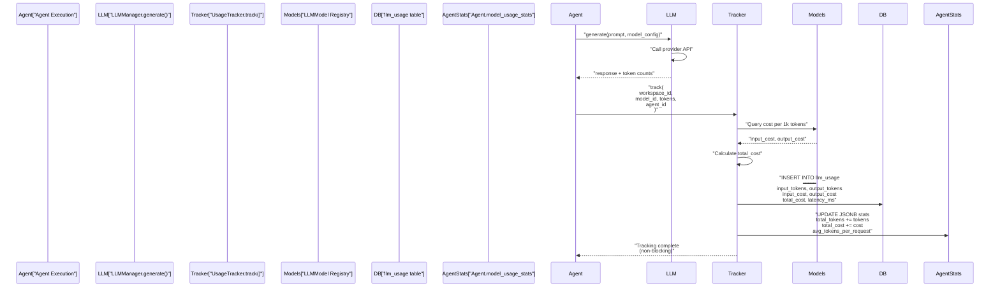

### Usage Record Schema

```sql
CREATE TABLE llm_usage (
  id SERIAL PRIMARY KEY,
  workspace_id UUID NOT NULL,
  agent_id INTEGER REFERENCES agents(id),
  execution_id VARCHAR,
  model_id VARCHAR NOT NULL,
  provider VARCHAR NOT NULL,
  tier VARCHAR, -- 'direct', 'router', 'fallback'
  request_type VARCHAR DEFAULT 'chat',
  input_tokens INTEGER NOT NULL,
  output_tokens INTEGER NOT NULL,
  total_tokens INTEGER NOT NULL,
  input_cost NUMERIC(12,8) NOT NULL,
  output_cost NUMERIC(12,8) NOT NULL,
  total_cost NUMERIC(12,8) NOT NULL,
  latency_ms INTEGER,
  status VARCHAR DEFAULT 'success',
  is_byok BOOLEAN DEFAULT false,
  error_message TEXT,
  created_at TIMESTAMP DEFAULT NOW()
);
```

### Agent Usage Statistics

Aggregated statistics stored in `Agent.model_usage_stats` JSONB:

```json
{
  "total_tokens": 145820,
  "total_cost": 3.42,
  "total_requests": 238,
  "avg_tokens_per_request": 612,
  "last_used_at": "2025-01-15T14:32:00Z",
  "by_model": {
    "gpt-4": {
      "requests": 180,
      "tokens": 110400,
      "cost": 2.76
    },
    "gpt-3.5-turbo": {
      "requests": 58,
      "tokens": 35420,
      "cost": 0.66
    }
  }
}
```

**Zero-Impact Design:** The `UsageTracker` uses a separate database session (`SessionLocal()`) to ensure tracking failures never break agent execution.

**Sources:**
- [orchestrator/core/llm/usage_tracker.py:UsageTracker]()
- [orchestrator/core/models/core.py:LLMUsage]()
- [orchestrator/api/agents.py:238-239]()

---

## Agent API Reference

### Core Endpoints

| Method | Endpoint | Description |
|--------|----------|-------------|
| `GET` | `/api/agents` | List agents (filtered by workspace) |
| `GET` | `/api/agents/{agent_id}` | Get single agent with relationships |
| `POST` | `/api/agents` | Create new agent |
| `PUT` | `/api/agents/{agent_id}` | Update agent configuration |
| `DELETE` | `/api/agents/{agent_id}` | Delete agent and relationships |
| `GET` | `/api/agents/types` | List available agent types |
| `GET` | `/api/agents/stats` | Workspace-wide agent statistics |

### Status & Execution

| Method | Endpoint | Description |
|--------|----------|-------------|
| `GET` | `/api/agents/{agent_id}/status` | Current status and workload |
| `POST` | `/api/agents/{agent_id}/execute` | Trigger agent execution |
| `POST` | `/api/agents/bulk` | Bulk agent creation |

### Relationships

| Method | Endpoint | Description |
|--------|----------|-------------|
| `GET` | `/api/agents/{agent_id}/skills` | List agent skills |
| `POST` | `/api/agents/{agent_id}/skills` | Add skills to agent |
| `GET` | `/api/agents/{agent_id}/plugins` | List assigned plugins |
| `PUT` | `/api/agents/{agent_id}/plugins` | Update plugin assignments |
| `GET` | `/api/agents/{agent_id}/persona` | Get agent persona |
| `PUT` | `/api/agents/{agent_id}/persona` | Update persona |

### Query Parameters

**List Agents (`GET /api/agents`):**

| Parameter | Type | Description |
|-----------|------|-------------|
| `skip` | Integer | Pagination offset (default: 0) |
| `limit` | Integer | Page size (default: 100, max: 1000) |
| `status` | Enum | Filter by status (active, inactive, maintenance) |
| `agent_type` | Enum | Filter by type (code_architect, custom, etc.) |
| `priority_level` | Enum | Filter by priority (low, medium, high, critical) |
| `search` | String | Search in name or description |

**Response Format:**

All endpoints return workspace-filtered results. The `workspace_id` is extracted from the JWT token or `X-Workspace-ID` header.

**Sources:**
- [orchestrator/api/agents.py:32-744]()

---

## Frontend Components

### Component Hierarchy

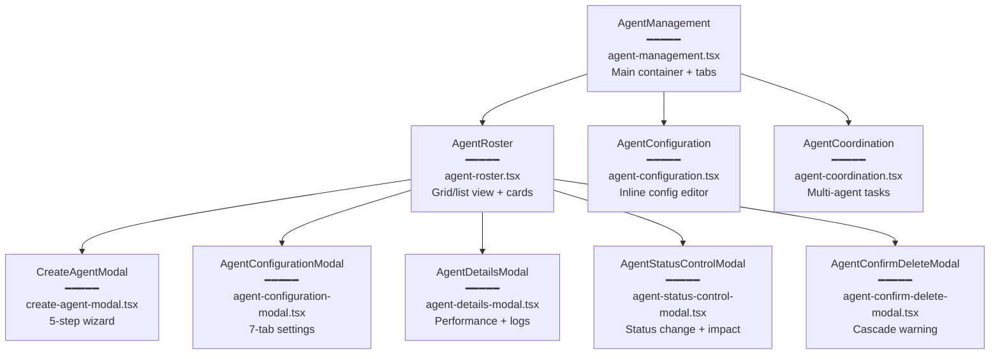

### React Query Hooks

All API interactions use React Query for caching and state management:

```typescript
// Query hooks (auto-caching)
useAgents() // List all agents
useAgent(agentId) // Single agent (polls every 10s)
useAgentStats() // Workspace stats (polls every 30s)
useAgentTypes() // Agent types (cached 5 min)
useAgentConfig(agentId) // Configuration
useAgentSkills(agentId) // Skills (polls every 30s)

// Mutation hooks (auto-invalidation)
useCreateAgent() // Create + invalidate agents list
useUpdateAgent() // Update + invalidate agent
useDeleteAgent() // Delete + remove from cache
useUpdateAgentConfig() // Update config
useAddSkillToAgent() // Add skill
useRemoveSkillFromAgent() // Remove skill
useStartAgent() // Start agent
useStopAgent() // Stop agent
```

**Cache Keys:** All queries use workspace-scoped cache keys to prevent cross-workspace data leakage:

```typescript
agentQueryKeys.agents // ['agents']
agentQueryKeys.agent(id) // ['agents', '42']
agentQueryKeys.agentConfig(id) // ['agents', '42', 'configuration']
```

**Invalidation Strategy:** Mutations automatically invalidate related queries:

```typescript
// Creating an agent invalidates:
queryClient.invalidateQueries({ queryKey: ['agents'] })
queryClient.invalidateQueries({ queryKey: ['agents', 'stats'] })
```

**Sources:**
- [frontend/hooks/use-agent-api.ts:1-400]()
- [frontend/components/agents/agent-management.tsx:1-283]()

---

## Multi-Tenancy & Workspace Isolation

All agent operations are workspace-scoped via the `workspace_id` foreign key.

### Workspace Context Flow

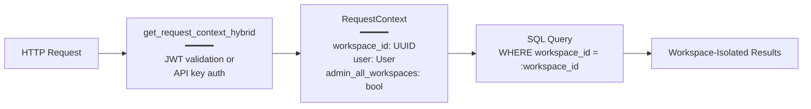

**Workspace Resolution:**

1. **JWT Claims** - `workspace_id` extracted from Clerk JWT
2. **Header Override** - `X-Workspace-ID` header (validated against user permissions)
3. **Admin Override** - Special `__all__` sentinel for platform-wide queries

**Query Filtering:** All agent queries include workspace filter:

```python
query = db.query(Agent).filter(Agent.workspace_id == ctx.workspace_id)
```

**Admin Access:** Admin users with `X-Workspace-ID: __all__` header can query across all workspaces (e.g., for platform analytics).

**Sources:**
- [orchestrator/api/agents.py:440-479]()
- [core/auth/hybrid.py:get_request_context_hybrid]()

---