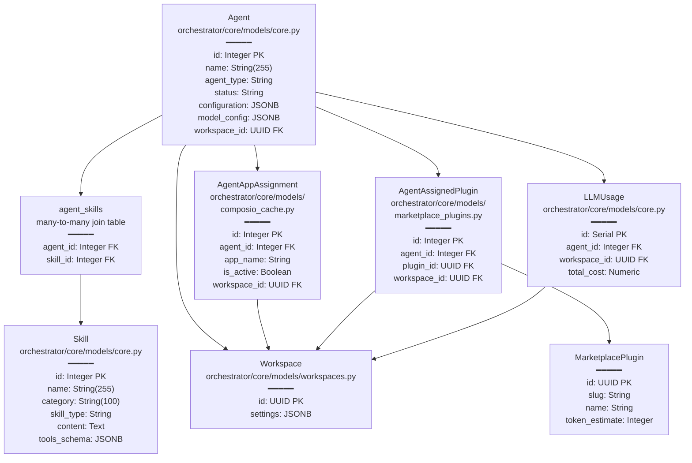

# Agents

<details>
<summary>Relevant source files</summary>

The following files were used as context for generating this wiki page:

- [frontend/components/agents/agent-configuration-modal.tsx](frontend/components/agents/agent-configuration-modal.tsx)
- [frontend/components/agents/agent-configuration.tsx](frontend/components/agents/agent-configuration.tsx)
- [frontend/components/agents/agent-details-modal.tsx](frontend/components/agents/agent-details-modal.tsx)
- [frontend/components/agents/agent-management.tsx](frontend/components/agents/agent-management.tsx)
- [frontend/components/agents/agent-performance.tsx](frontend/components/agents/agent-performance.tsx)
- [frontend/components/agents/agent-roster.tsx](frontend/components/agents/agent-roster.tsx)
- [frontend/components/agents/agent-skills.tsx](frontend/components/agents/agent-skills.tsx)
- [frontend/components/agents/agent-status-control-modal.tsx](frontend/components/agents/agent-status-control-modal.tsx)
- [frontend/components/agents/create-agent-modal.tsx](frontend/components/agents/create-agent-modal.tsx)
- [frontend/components/agents/create-skill-modal.tsx](frontend/components/agents/create-skill-modal.tsx)
- [frontend/components/agents/skill-configuration-modal.tsx](frontend/components/agents/skill-configuration-modal.tsx)
- [frontend/components/documents/analytics-tab.tsx](frontend/components/documents/analytics-tab.tsx)
- [frontend/components/documents/processing-tab.tsx](frontend/components/documents/processing-tab.tsx)
- [frontend/hooks/use-agent-api.ts](frontend/hooks/use-agent-api.ts)
- [frontend/hooks/use-document-api.ts](frontend/hooks/use-document-api.ts)
- [orchestrator/api/agents.py](orchestrator/api/agents.py)
- [orchestrator/api/tools.py](orchestrator/api/tools.py)
- [orchestrator/core/composio/client.py](orchestrator/core/composio/client.py)
- [orchestrator/core/composio/tool_executor.py](orchestrator/core/composio/tool_executor.py)
- [orchestrator/core/models/__init__.py](orchestrator/core/models/__init__.py)
- [orchestrator/core/models/core.py](orchestrator/core/models/core.py)
- [orchestrator/modules/agents/factory/agent_factory.py](orchestrator/modules/agents/factory/agent_factory.py)
- [orchestrator/modules/tools/services/composio_hint_service.py](orchestrator/modules/tools/services/composio_hint_service.py)
- [orchestrator/modules/tools/services/composio_tool_service.py](orchestrator/modules/tools/services/composio_tool_service.py)
- [orchestrator/services/heartbeat_service.py](orchestrator/services/heartbeat_service.py)
- [orchestrator/services/metadata_sync_service.py](orchestrator/services/metadata_sync_service.py)

</details>


## Purpose and Scope

This document covers the **Agent Management System** in Automatos AI, including agent creation, configuration, lifecycle management, and capability assignment. Agents are the core AI entities that execute tasks, coordinate workflows, and interact with external tools.

For information about **agent execution and orchestration**, see [Universal Router](#10). For **agent-to-agent coordination patterns**, see [Missions & Multi-Agent Coordination](#22). For **workflow recipe execution** using agents, see [Workflows & Recipes](#6).

---

## Agent Entity Model

Agents are represented by the `Agent` SQLAlchemy model with the following core structure:

| Field | Type | Description |
|-------|------|-------------|
| `id` | Integer | Primary key [orchestrator/core/models/core.py:50]() |
| `name` | String | Unique agent name within workspace |
| `description` | Text | Agent purpose and capabilities |
| `agent_type` | String | Database type (e.g., `code_architect`, `custom`) |
| `status` | String | `active`, `inactive`, `maintenance` |
| `configuration` | JSONB | Priority, concurrency, resource limits, heartbeat settings [orchestrator/api/agents.py:202-215]() |
| `tags` | ARRAY | Searchable keywords |
| `model_config` | JSONB | LLM provider, model, parameters (PRD-15) [orchestrator/modules/agents/factory/agent_factory.py:61-82]() |
| `performance_metrics` | JSONB | Success rate, tasks completed [orchestrator/modules/agents/factory/agent_factory.py:173-191]() |
| `workspace_id` | UUID | Multi-tenant isolation [orchestrator/core/models/core.py:97]() |

### Agent Data Model with Relationships

**Diagram: Agent Database Schema with SQLAlchemy Models**



**Sources:**
- [orchestrator/core/models/core.py:9-100]()
- [orchestrator/core/models/composio_cache.py:27-40]()
- [orchestrator/core/models/marketplace_plugins.py:1-50]()

---

## Agent Types and Categories

Agents use a dual-type system for flexibility:

### Database Types (`agent_type`)

Backend database values stored in the `agent_type` column [orchestrator/api/agents.py:23-24]():

- `code_architect`, `security_expert`, `performance_optimizer`, `data_analyst`, `infrastructure_manager`, `custom`, `devops`, `support`, `assistant`.

### UI Categories (`marketplace_category`)

User-facing categories displayed in the frontend [frontend/lib/agent-constants.ts:1-50]():

- `Personal Assistant`, `Customer Support`, `DevOps`, `Social Media`, `Accounting`, `E-commerce`, `Content Creation`, `HR`, `Data Analysis`, `Custom`.

**Sources:**
- [orchestrator/api/agents.py:23-24]()
- [frontend/components/agents/agent-roster.tsx:57-92]()

---

## Creating Agents

### Create Agent Modal Workflow

For a detailed walkthrough, see [Creating Agents](#5.1).

**Diagram: Agent Creation Flow with API Endpoints**

```mermaid
sequenceDiagram
    participant User
    participant Modal["CreateAgentModal<br/>frontend/components/agents/<br/>create-agent-modal.tsx"]
    participant CreateAPI["POST /api/agents<br/>orchestrator/api/agents.py:362-438"]
    participant PersonaAPI["PUT /api/agents/{id}/persona<br/>orchestrator/api/agents.py:711-744"]
    participant ModelAPI["PUT /api/models/agents/{id}/config<br/>orchestrator/api/llm_models.py"]
    participant DB["agents table<br/>PostgreSQL"]
    
    User->>Modal: "Click Create Agent"
    Modal->>Modal: "Step 1: Basic Info (Name, Category)"
    Modal->>Modal: "Step 2: Persona (US-021)"
    Modal->>Modal: "Step 3: Model Config (PRD-15)"
    Modal->>Modal: "Step 4: Tools & Capabilities"
    
    User->>Modal: "Click Create"
    Modal->>CreateAPI: "agentPayload {name, agent_type, tool_ids}"
    CreateAPI->>DB: "INSERT INTO agents"
    CreateAPI->>DB: "agent_app_assignments (Tools)"
    CreateAPI-->>Modal: "newAgent {id}"
    
    Modal->>PersonaAPI: "Set persona_id or custom_prompt"
    Modal->>ModelAPI: "Update model_config"
    
    Modal-->>User: "Success Toast"
```

**Sources:**
- [frontend/components/agents/create-agent-modal.tsx:188-250]()
- [orchestrator/api/agents.py:362-438]()

---

## Agent Configuration

The `AgentConfigurationModal` provides a comprehensive configuration interface. For details, see [Agent Configuration](#5.2).

### Configuration Tabs
- **General**: Basic info and tags [frontend/components/agents/agent-configuration-modal.tsx:101]().
- **Persona**: Identity and system prompts (US-021) [frontend/components/agents/agent-configuration-modal.tsx:136-149]().
- **Resources**: Priority, concurrency, and resource limits [frontend/components/agents/agent-configuration-modal.tsx:76-90]().
- **Capabilities**: Marketplace plugins and skill assignment [frontend/components/agents/agent-configuration-modal.tsx:124-135]().
- **Model**: LLM provider and parameters (PRD-15) [frontend/components/agents/agent-configuration-modal.tsx:117-119]().
- **Tools**: Composio application assignments [frontend/components/agents/agent-configuration-modal.tsx:121-123]().
- **Heartbeat**: Periodic autonomous check-in settings (PRD-55) [frontend/components/agents/agent-configuration-modal.tsx:155-171]().

---

## Agent Personas (US-021)

Personas define agent behavior and identity. For details, see [Agent Personas](#5.3).

- **Modes**: `none`, `predefined`, or `custom` [frontend/components/agents/create-agent-modal.tsx:56]().
- **Library**: Fetching from `/api/personas` [frontend/components/agents/create-agent-modal.tsx:144]().
- **Persistence**: Stored via `PUT /api/agents/{id}/persona` [orchestrator/api/agents.py:711-744]().

---

## Agent Factory & Runtime

The `AgentFactory` handles the instantiation of agents into an executable `AgentRuntime`. For details, see [Agent Factory & Runtime](#5.5).

**Key Functions:**
- `activate_agent(agent_id)`: Initializes the `AgentRuntime` with LLM and tools [orchestrator/modules/agents/factory/agent_factory.py:503-560]().
- `execute_with_prompt()`: Core execution loop [orchestrator/modules/agents/factory/agent_factory.py:650-700]().
- `AgentLifecycle`: Tracks state transitions from `INITIALIZING` to `ACTIVE` or `RETIRED` [orchestrator/modules/agents/factory/agent_factory.py:51-57]().

**Sources:**
- [orchestrator/modules/agents/factory/agent_factory.py:197-210]()
- [orchestrator/modules/agents/factory/agent_factory.py:503-700]()

---

## LLM Provider Management

Automatos AI supports multiple LLM providers with a 3-tier credential resolution system. For details, see [LLM Provider Management](#5.6).

- **Providers**: OpenAI, Anthropic, Google, Azure, Grok, Bedrock, and OpenRouter [orchestrator/core/llm/manager.py:18-25]().
- **Resolution**: BYOK (Bring Your Own Key), Platform Credentials, or Env Vars [orchestrator/core/llm/manager.py:124-180]().
- **Service Mapping**: Maps services like `orchestrator`, `codegraph`, and `chatbot` to specific LLM settings [orchestrator/core/llm/manager.py:30-41]().

**Sources:**
- [orchestrator/core/llm/manager.py:18-41]()
- [orchestrator/core/llm/manager.py:124-180]()

---

## Agent API Reference

Comprehensive CRUD and execution endpoints are available at `/api/agents`. For details, see [Agent API Reference](#5.7).

- **CRUD**: `GET`, `POST`, `PUT`, `DELETE` on `/api/agents` [orchestrator/api/agents.py:31]().
- **Skills**: `/api/agents/{id}/skills` [orchestrator/api/agents.py:583-605]().
- **Plugins**: `/api/agents/{id}/plugins` [orchestrator/api/agents.py:530-555]().
- **Status**: `/api/agents/{id}/status` [orchestrator/api/agents.py:608-644]().
- **Heartbeat**: `/api/agents/{id}/heartbeat` for config and manual triggers [orchestrator/services/heartbeat_service.py:190-221]().

**Sources:**
- [orchestrator/api/agents.py:31-800]()
- [orchestrator/services/heartbeat_service.py:190-221]()

---