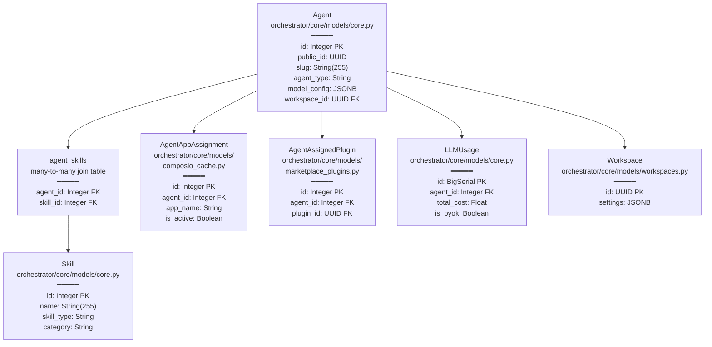
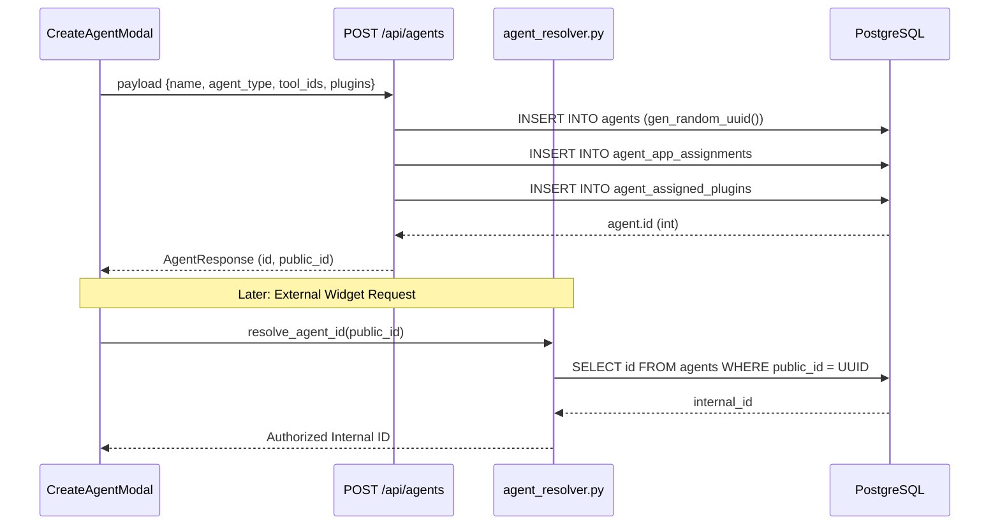

# Agents

Relevant source files

The following files were used as context for generating this wiki page:

- [frontend/components/agents/agent-configuration-modal.tsx](frontend/components/agents/agent-configuration-modal.tsx)
- [frontend/components/agents/agent-configuration.tsx](frontend/components/agents/agent-configuration.tsx)
- [frontend/components/agents/agent-details-modal.tsx](frontend/components/agents/agent-details-modal.tsx)
- [frontend/components/agents/agent-performance.tsx](frontend/components/agents/agent-performance.tsx)
- [frontend/components/agents/agent-roster.tsx](frontend/components/agents/agent-roster.tsx)
- [frontend/components/agents/agent-skills.tsx](frontend/components/agents/agent-skills.tsx)
- [frontend/components/agents/agent-status-control-modal.tsx](frontend/components/agents/agent-status-control-modal.tsx)
- [frontend/components/agents/create-agent-modal.tsx](frontend/components/agents/create-agent-modal.tsx)
- [frontend/components/agents/create-skill-modal.tsx](frontend/components/agents/create-skill-modal.tsx)
- [frontend/components/agents/skill-configuration-modal.tsx](frontend/components/agents/skill-configuration-modal.tsx)
- [frontend/components/documents/analytics-tab.tsx](frontend/components/documents/analytics-tab.tsx)
- [frontend/components/documents/processing-tab.tsx](frontend/components/documents/processing-tab.tsx)
- [frontend/hooks/use-agent-api.ts](frontend/hooks/use-agent-api.ts)
- [frontend/hooks/use-document-api.ts](frontend/hooks/use-document-api.ts)
- [frontend/lib/agent-constants.ts](frontend/lib/agent-constants.ts)
- [orchestrator/alembic/versions/add_job_title_to_agents.py](orchestrator/alembic/versions/add_job_title_to_agents.py)
- [orchestrator/alembic/versions/agent_public_id_and_slug_fix.py](orchestrator/alembic/versions/agent_public_id_and_slug_fix.py)
- [orchestrator/alembic/versions/seed_auto_agents_existing_workspaces.py](orchestrator/alembic/versions/seed_auto_agents_existing_workspaces.py)
- [orchestrator/api/agents.py](orchestrator/api/agents.py)
- [orchestrator/core/models/core.py](orchestrator/core/models/core.py)
- [orchestrator/core/utils/agent_resolver.py](orchestrator/core/utils/agent_resolver.py)

## Purpose and Scope

This document covers the **Agent Management System** in Automatos AI, including agent creation, configuration, lifecycle management, and capability assignment. Agents are the core AI entities that execute tasks, coordinate workflows, and interact with external tools.

For information about **agent execution and orchestration**, see [Universal Router](#10). For **agent-to-agent coordination patterns**, see [Missions & Multi-Agent Coordination](#22). For **workflow recipe execution** using agents, see [Workflows & Recipes](#6).

---

## Agent Entity Model

Agents are represented by the `Agent` SQLAlchemy model. Every workspace is provisioned with a default system agent named **Auto** (slug: `auto-{workspace_id}`), which serves as the workspace's primary orchestrator and settings anchor [orchestrator/alembic/versions/seed_auto_agents_existing_workspaces.py:42-55]().

| Field | Type | Description |
|-------|------|-------------|
| `id` | Integer | Primary key [orchestrator/core/models/core.py:48]() |
| `public_id` | UUID | External/widget-facing identifier [orchestrator/alembic/versions/agent_public_id_and_slug_fix.py:30-36]() |
| `name` | String | Agent display name (e.g., "Auto") |
| `slug` | String | Unique identifier within a workspace [orchestrator/alembic/versions/agent_public_id_and_slug_fix.py:60-66]() |
| `agent_type` | String | Role classification (e.g., `system`, `custom`) [orchestrator/api/agents.py:23-24]() |
| `status` | String | `active`, `idle`, `maintenance` [frontend/components/agents/agent-roster.tsx:164-168]() |
| `configuration` | JSONB | Proactive level, thinking level, and heartbeat settings [orchestrator/alembic/versions/seed_auto_agents_existing_workspaces.py:74]() |
| `model_config` | JSONB | Provider, model_id, temperature, and token limits [orchestrator/alembic/versions/seed_auto_agents_existing_workspaces.py:73]() |
| `workspace_id` | UUID | Multi-tenant isolation [orchestrator/core/models/core.py:97]() |

### Agent Data Model with Relationships

**Diagram: Agent Database Schema with SQLAlchemy Models**

**Sources:**
- [orchestrator/core/models/core.py:28-170]()
- [orchestrator/api/agents.py:11-24]()
- [orchestrator/alembic/versions/agent_public_id_and_slug_fix.py:25-68]()

---

## Creating Agents

Agent creation involves defining basic metadata, assigning a model configuration (PRD-15), and linking capabilities such as tools, skills, or marketplace plugins.

### Creation Flow
For a detailed walkthrough, see [Creating Agents](#5.1).

**Diagram: Agent Provisioning and Resolution Flow**

**Sources:**
- [frontend/components/agents/create-agent-modal.tsx:176-210]()
- [orchestrator/api/agents.py:362-438]()
- [orchestrator/core/utils/agent_resolver.py:17-49]()

---

## Agent Configuration

Agents are configured via a multi-tab interface in the UI, covering everything from LLM parameters to proactive heartbeat behaviors. For details, see [Agent Configuration](#5.2).

### Core Configuration Tabs
- **General**: Name, description, job title, and category [frontend/components/agents/agent-configuration-modal.tsx:350-420]().
- **Model Settings**: Provider selection, model ID, temperature, and token limits [frontend/components/agents/agent-configuration-modal.tsx:550-600]().
- **Persona**: Identity prompts and voice profile selection [frontend/components/agents/agent-configuration-modal.tsx:650-720]().
- **Capabilities**: Toggle switches for Skills, Plugins, and connected Tools [frontend/components/agents/agent-configuration-modal.tsx:750-850]().
- **Heartbeat**: Autonomous check-in intervals and proactive action levels [frontend/components/agents/agent-configuration-modal.tsx:158-170]().

**Sources:**
- [frontend/components/agents/agent-configuration-modal.tsx:104-173]()
- [frontend/components/agents/agent-configuration.tsx:197-205]()

---

## Agent Personas

Personas define the identity and behavioral constraints of an agent. For details, see [Agent Personas](#5.3).

- **System Agent (Auto)**: Seeds with a specific personality focused on action and approachable knowledge [orchestrator/alembic/versions/seed_auto_agents_existing_workspaces.py:65-71]().
- **Predefined Personas**: Templates fetched from `/api/personas` that provide optimized system prompts [frontend/components/agents/create-agent-modal.tsx:129-142]().
- **Custom Personas**: Direct user input for system prompts stored in `custom_persona_prompt` [orchestrator/core/models/core.py:178]().

**Sources:**
- [frontend/components/agents/create-agent-modal.tsx:83-91]()
- [orchestrator/alembic/versions/seed_auto_agents_existing_workspaces.py:65-71]()

---

## Agent Plugins & Skills

Agents can be extended with granular capabilities. For details, see [Agent Plugins & Skills](#5.4).

- **Skills**: Technical or cognitive abilities (e.g., "Data Analysis") linked via `agent_skills` association table [orchestrator/core/models/core.py:29-32]().
- **Plugins**: Marketplace-derived integrations that provide specialized tools and commands [frontend/components/agents/agent-configuration-modal.tsx:127-132]().
- **Tools**: Direct app integrations (e.g., Slack, GitHub) managed via `AgentAppAssignment` [orchestrator/api/agents.py:182-195]().

**Sources:**
- [orchestrator/api/agents.py:11-15]()
- [frontend/components/agents/create-skill-modal.tsx:71-84]()

---

## Agent Factory & Runtime

The backend runtime manages the lifecycle and execution of agents. For details, see [Agent Factory & Runtime](#5.5).

**Key Components:**
- **AgentLifecycle**: Logic for activating agents and managing their state during execution [orchestrator/api/agents.py:23-24]().
- **Tool Loop**: Execution logic that handles tool calls with deduplication and loop prevention [orchestrator/api/agents.py:97-143]().
- **Metric Tracking**: LLM usage and cost attribution per agent execution [orchestrator/core/models/core.py:138-169]().

---

## LLM Provider Management

Automatos AI implements a 3-tier API key resolution strategy. For details, see [LLM Provider Management](#5.6).

- **BYOK (Bring Your Own Key)**: Encrypted user keys stored in `user_api_keys` per workspace [orchestrator/core/models/core.py:122-135]().
- **LLM Registry**: Metadata and cost tracking for models from OpenAI, Anthropic, and OpenRouter [orchestrator/core/models/core.py:43-94]().

---

## Agent API Reference

The Agent API provides endpoints for CRUD operations and capability management. For details, see [Agent API Reference](#5.7).

- **Base Endpoint**: `/api/agents` [orchestrator/api/agents.py:31]().
- **Semantic Re-indexing**: Background task `_reindex_agent_embedding` triggers whenever an agent is updated to ensure the router has fresh semantic data [orchestrator/api/agents.py:38-66]().
- **Skill Management**: Bulk creation and assignment of technical skills to agents [frontend/hooks/use-agent-api.ts:31-39]().

**Sources:**
- [orchestrator/api/agents.py:1-150]()
- [frontend/hooks/use-agent-api.ts:21-59]()

---