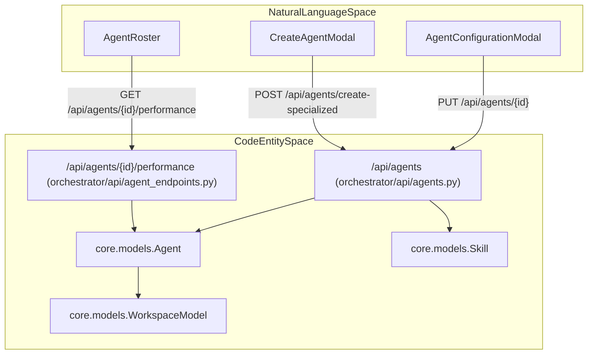
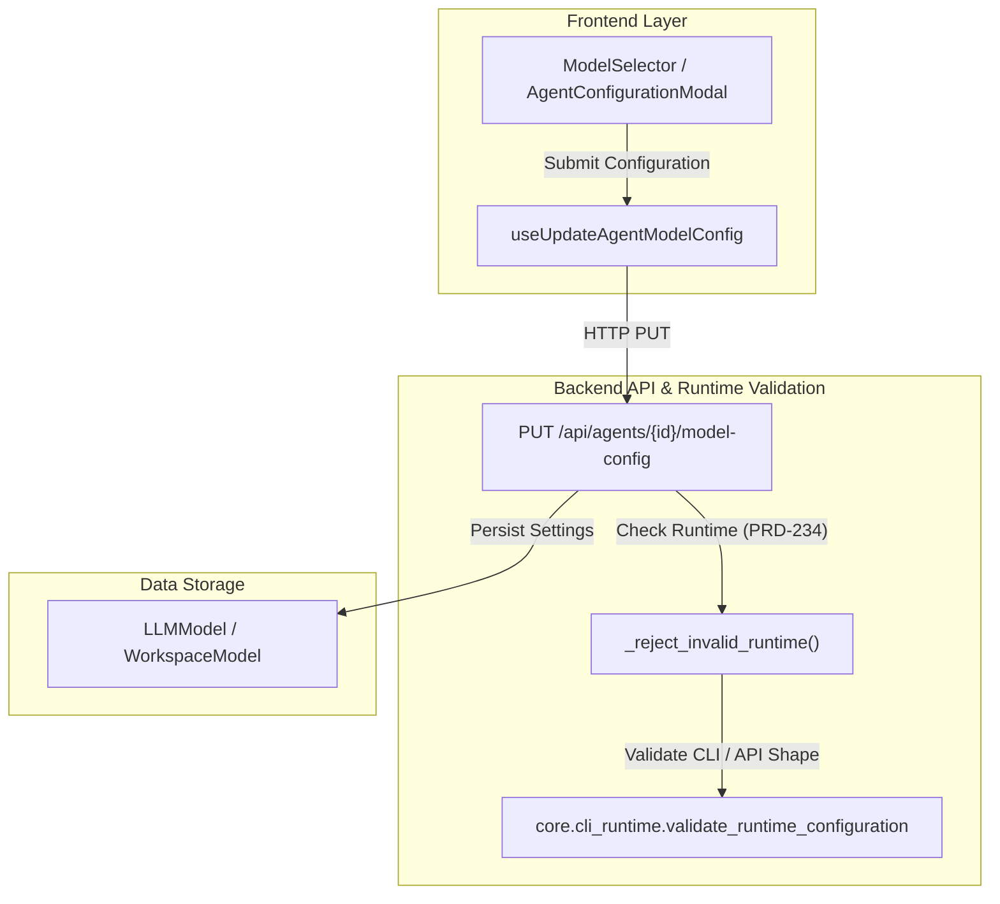

# Agent API Reference

<details>
<summary>Relevant source files</summary>

The following files were used as context for generating this wiki page:

- [frontend/components/agents/agent-configuration-modal.tsx](frontend/components/agents/agent-configuration-modal.tsx)
- [frontend/components/agents/agent-configuration.tsx](frontend/components/agents/agent-configuration.tsx)
- [frontend/components/agents/agent-details-modal.tsx](frontend/components/agents/agent-details-modal.tsx)
- [frontend/components/agents/agent-performance.tsx](frontend/components/agents/agent-performance.tsx)
- [frontend/components/agents/agent-roster.tsx](frontend/components/agents/agent-roster.tsx)
- [frontend/components/agents/agent-skills.tsx](frontend/components/agents/agent-skills.tsx)
- [frontend/components/agents/agent-status-control-modal.tsx](frontend/components/agents/agent-status-control-modal.tsx)
- [frontend/components/agents/create-agent-modal.tsx](frontend/components/agents/create-agent-modal.tsx)
- [frontend/components/agents/create-skill-modal.tsx](frontend/components/agents/create-skill-modal.tsx)
- [frontend/components/agents/model-selector.tsx](frontend/components/agents/model-selector.tsx)
- [frontend/components/agents/skill-configuration-modal.tsx](frontend/components/agents/skill-configuration-modal.tsx)
- [frontend/hooks/use-agent-api.ts](frontend/hooks/use-agent-api.ts)
- [frontend/hooks/use-model-api.ts](frontend/hooks/use-model-api.ts)
- [frontend/lib/agent-constants.ts](frontend/lib/agent-constants.ts)
- [orchestrator/alembic/versions/add_job_title_to_agents.py](orchestrator/alembic/versions/add_job_title_to_agents.py)
- [orchestrator/api/agent_endpoints.py](orchestrator/api/agent_endpoints.py)
- [orchestrator/api/agents.py](orchestrator/api/agents.py)
- [orchestrator/core/models/__init__.py](orchestrator/core/models/__init__.py)
- [orchestrator/core/models/core.py](orchestrator/core/models/core.py)

</details>


This page provides a complete technical reference for agent management endpoints in the Automatos AI platform. It covers core CRUD operations, specialized agent creation, status execution, plugin/skill attachments, model configuration (`/api/agents/{id}/model-config`), performance metrics, and assembled-context tracking.

## Overview and Scope

The Agent API provides RESTful endpoints for configuring, executing, and monitoring AI agents. All endpoints require authentication via Clerk JWT or API Key, and enforce workspace isolation via the `X-Workspace-ID` header or JWT claims. 

| Router / Module | Prefix | Purpose | Key File |
|-----------------|--------|---------|----------|
| `agents_router` | `/api/agents` | Core CRUD, tool/skill mapping, and config | [orchestrator/api/agents.py:33]() |
| `agent_endpoints_router` | `/api/agents` | Specialized creation, lifecycle, and performance metrics | [orchestrator/api/agent_endpoints.py:27]() |
| `model_api` | `/api/agents/{id}/model-config` | Agent model configurations and provider bindings | [frontend/hooks/use-model-api.ts:199-209]() |

Sources: [orchestrator/api/agents.py:33](), [orchestrator/api/agent_endpoints.py:27](), [frontend/hooks/use-model-api.ts:199-209]()

---

## Authentication & Workspace Resolution

The API uses a hybrid authentication strategy supporting both frontend user sessions (Clerk JWT) and programmatic access keys.

```http
Authorization: Bearer <clerk_jwt_token>
X-Workspace-ID: <workspace_uuid>
```

The `get_request_context_hybrid` dependency validates the token and injects a `RequestContext` containing the active `user_id` and `workspace_id` [orchestrator/api/agents.py:27]().

**Agent ID & Visibility Resolution:**
The system resolves incoming tool and skill identifiers securely. Skills are checked for visibility against the current workspace (`_fetch_attachable_skills`), ensuring foreign private skills are never attached [orchestrator/api/agents.py:101-120](). Similarly, tool IDs (including negative frontend stable hashes) are mapped to verified active workspace connections via `EntityManager` [orchestrator/api/agents.py:139-164]().

Sources: [orchestrator/api/agents.py:27](), [orchestrator/api/agents.py:101-120](), [orchestrator/api/agents.py:139-164]()

---

## System Architecture: Agent Management & Code Mapping

Title: Agent Configuration Entity Mapping


Sources: [frontend/components/agents/agent-configuration-modal.tsx:114-116](), [orchestrator/api/agent_endpoints.py:117-131](), [orchestrator/core/models/core.py:31-36](), [orchestrator/core/models/core.py:107-134]()

---

## Core Agent CRUD Endpoints

### List Agents
`GET /api/agents`

Returns a list of agents configured for the active workspace, enriched with skill counts, assigned plugins, and workspace-level permissions.

* **Implementation:** Handled by `agents_router` [orchestrator/api/agents.py:33]().
* **Filtering & System Agents:** Supports parameters to include or exclude hidden system agents like `Auto` [frontend/hooks/use-agent-api.ts:94-126]().

### Create Specialized Agent
`POST /api/agents/create-specialized`

Creates a specialized agent instance with validated runtime configurations and LLM bindings [orchestrator/api/agent_endpoints.py:41-64]().

* **Payload:** Requires `name`, `type`, optional `skills`, and `model` configuration dictionary [orchestrator/api/agent_endpoints.py:50-61]().
* **Graph Sync:** Automatically schedules an incremental update to the workspace knowledge graph via `get_graph_service().schedule_incremental_update` [orchestrator/api/agent_endpoints.py:93-100]().

Sources: [orchestrator/api/agents.py:33](), [orchestrator/api/agent_endpoints.py:41-64](), [orchestrator/api/agent_endpoints.py:93-100](), [frontend/hooks/use-agent-api.ts:94-126]()

---

## Plugins, Skills & Tool Resolution

Agents link to external capabilities through many-to-many relationship tables and assignment services.

* **Skill Assignment:** Managed via `_fetch_attachable_skills` which validates that requested skill IDs exist and are active and visible in the workspace context [orchestrator/api/agents.py:101-120]().
* **Tool Resolution:** `_resolve_tool_ids_to_app_names` maps incoming tool IDs or frontend stable hashes (`_stable_tool_id`) into active Composio application names [orchestrator/api/agents.py:88-99](), [orchestrator/api/agents.py:139-164]().
* **Plugin Marketplace Integration:** Relies on `AgentAssignedPlugin` and `MarketplacePlugin` models to attach certified bundles [orchestrator/core/models/marketplace_plugins.py]().

Sources: [orchestrator/api/agents.py:88-120](), [orchestrator/api/agents.py:139-164](), [orchestrator/core/models/marketplace_plugins.py]()

---

## Model Configuration & Runtime Validation

Title: Runtime and Model Configuration Architecture


### Model Configuration Endpoints
* `GET /api/agents/{agent_id}/model-config` — Retrieves the active LLM provider, temperature, and token thresholds for the specified agent [frontend/hooks/use-model-api.ts:199-209]().
* `PUT /api/agents/{agent_id}/model-config` — Updates the model configuration parameters, triggering cache invalidation via React Query [frontend/hooks/use-model-api.ts:212-231]().

### Runtime Validation
The function `_reject_invalid_runtime` inspects agent configurations to enforce platform governance (e.g., verifying `CLI_RUNTIME_ENABLED` and compatible session model shapes for `runtime: cli` agents before task execution) [orchestrator/api/agents.py:36-52]().

Sources: [orchestrator/api/agents.py:36-52](), [frontend/hooks/use-model-api.ts:199-231]()

---

## Performance & Telemetry Endpoints

### Agent Performance Metrics
`GET /api/agents/{agent_id}/performance`

Aggregates execution metrics, token usage, and latency statistics from the agent's telemetry records [orchestrator/api/agent_endpoints.py:117-131]().

* **Returned Data Points:**
  * `success_rate`: Percentage calculated from successful vs. total executed tasks [orchestrator/api/agent_endpoints.py:164]().
  * `average_response_time`: Average task execution duration converted to seconds [orchestrator/api/agent_endpoints.py:165]().
  * `total_cost`: Cumulative cost calculated from `model_usage_stats` [orchestrator/api/agent_endpoints.py:173]().

Sources: [orchestrator/api/agent_endpoints.py:117-131](), [orchestrator/api/agent_endpoints.py:164-173]()

---

## Data Models Reference

The agent API operates on several core SQLAlchemy models defined in the database layer:

| Model Name | Table Name | Key Attributes | Description |
|------------|------------|----------------|-------------|
| `Agent` | `agents` | `id`, `name`, `agent_type`, `status`, `configuration` | Core representation of an AI agent instance [orchestrator/core/models/core.py]() |
| `LLMModel` | `llm_models` | `provider`, `model_id`, `context_window`, `input_cost_per_1k_tokens` | Global registry of available LLM models and capabilities [orchestrator/core/models/core.py:47-70]() |
| `WorkspaceModel` | `workspace_models` | `workspace_id`, `model_id`, `approval_status` | Tracks which models are installed and approved per workspace [orchestrator/core/models/core.py:107-134]() |
| `agent_skills` | `agent_skills` | `agent_id`, `skill_id`, `priority` | Many-to-many relationship map between agents and skills with per-attachment priority [orchestrator/core/models/core.py:31-36]() |

Sources: [orchestrator/core/models/core.py:31-70](), [orchestrator/core/models/core.py:107-134]()

---