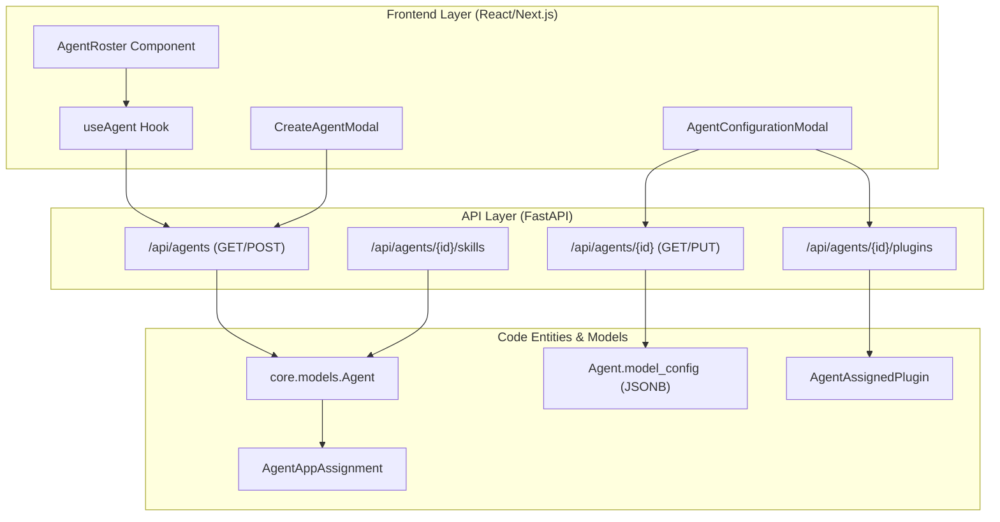
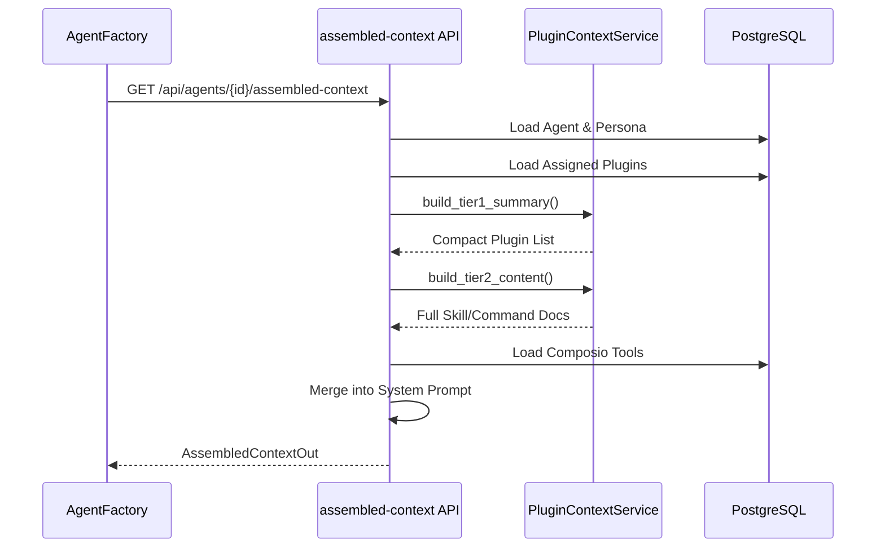

# Agent API Reference

<details>
<summary>Relevant source files</summary>

The following files were used as context for generating this wiki page:

- [frontend/components/agents/agent-configuration-modal.tsx](frontend/components/agents/agent-configuration-modal.tsx)
- [frontend/components/agents/agent-configuration.tsx](frontend/components/agents/agent-configuration.tsx)
- [frontend/components/agents/agent-details-modal.tsx](frontend/components/agents/agent-details-modal.tsx)
- [frontend/components/agents/agent-management.tsx](frontend/components/agents/agent-management.tsx)
- [frontend/components/agents/agent-performance.tsx](frontend/components/agents/agent-performance.tsx)
- [frontend/components/agents/agent-roster.tsx](frontend/components/agents/agent-roster.tsx)
- [frontend/components/agents/agent-skills.tsx](frontend/components/agents/agent-skills.tsx)
- [frontend/components/agents/agent-status-control-modal.tsx](frontend/components/agents/agent-status-control-modal.tsx)
- [frontend/components/agents/create-agent-modal.tsx](frontend/components/agents/create-agent-modal.tsx)
- [frontend/components/agents/create-skill-modal.tsx](frontend/components/agents/create-skill-modal.tsx)
- [frontend/components/agents/skill-configuration-modal.tsx](frontend/components/agents/skill-configuration-modal.tsx)
- [frontend/components/documents/analytics-tab.tsx](frontend/components/documents/analytics-tab.tsx)
- [frontend/components/documents/processing-tab.tsx](frontend/components/documents/processing-tab.tsx)
- [frontend/components/workflows/execution-theater/orchestrator-control.tsx](frontend/components/workflows/execution-theater/orchestrator-control.tsx)
- [frontend/hooks/use-agent-api.ts](frontend/hooks/use-agent-api.ts)
- [frontend/hooks/use-document-api.ts](frontend/hooks/use-document-api.ts)
- [frontend/hooks/use-workflow-websocket.ts](frontend/hooks/use-workflow-websocket.ts)
- [orchestrator/api/agent_endpoints.py](orchestrator/api/agent_endpoints.py)
- [orchestrator/api/agents.py](orchestrator/api/agents.py)
- [orchestrator/core/models/__init__.py](orchestrator/core/models/__init__.py)
- [orchestrator/core/models/core.py](orchestrator/core/models/core.py)
- [orchestrator/services/heartbeat_service.py](orchestrator/services/heartbeat_service.py)

</details>


This page provides a complete technical reference for agent management endpoints in the Automatos AI platform. It covers CRUD operations, plugin/skill assignment, persona configuration, and the runtime context assembly process.

## Overview

The Agent API provides REST endpoints for managing AI agents. All endpoints require authentication via Clerk JWT and workspace isolation via the `X-Workspace-ID` header. The backend implementation is distributed across several key routers in the orchestrator.

| Router | Prefix | Purpose | Key File |
|--------|--------|---------|----------|
| `agents_router` | `/api/agents` | Core CRUD and relationship management | [orchestrator/api/agents.py:31]() |
| `agent_plugins_router` | `/api/agents/{id}/plugins` | Plugin assignment and context assembly | [orchestrator/api/agent_plugins.py:33]() |
| `agent_endpoints_router` | `/api/agents` | Specialized creation and performance metrics | [orchestrator/api/agent_endpoints.py:26]() |

Sources: [orchestrator/api/agents.py:31](), [orchestrator/api/agent_plugins.py:33](), [orchestrator/api/agent_endpoints.py:26]()

---

## Authentication & Headers

The API uses a hybrid authentication strategy to support both frontend users (Clerk) and programmatic access.

```http
Authorization: Bearer <clerk_jwt_token>
X-Workspace-ID: <workspace_uuid>
```

The `get_request_context_hybrid` dependency validates the token and injects a `RequestContext` containing the `user_id` and `workspace_id`.

Sources: [orchestrator/api/agents.py:26](), [orchestrator/api/agent_endpoints.py:22-23]()

---

## System Architecture: Agent Management

The following diagram bridges the frontend UI components to the backend API entities and database models.

Title: "Agent Management Architecture"


Sources: [frontend/components/agents/agent-roster.tsx:47](), [frontend/components/agents/agent-configuration-modal.tsx:110-112](), [orchestrator/api/agents.py:31](), [orchestrator/api/agent_plugins.py:33]()

---

## Core Agent CRUD Endpoints

### List Agents
`GET /api/agents`

Returns a list of agents for the current workspace. The response is enriched with tool assignments and plugin counts.

**Implementation Details:**
- Uses `_build_agent_response` to join `AgentAppAssignment` and `ComposioAppCache` [orchestrator/api/agents.py:174-205]().
- Normalizes tags from CSV strings or JSON arrays [orchestrator/api/agents.py:146-171]().

Sources: [orchestrator/api/agents.py:174-205](), [orchestrator/api/agents.py:213-240]()

### Create Specialized Agent
`POST /api/agents/create-specialized`

A high-level endpoint used by the `AgentFactory` to create agents with verified LLM connections [orchestrator/api/agent_endpoints.py:65-87]().

**Request Body:**
```json
{
  "name": "Security Bot",
  "type": "security_expert",
  "skills": ["vulnerability_scanning"],
  "model": {
    "provider": "openai",
    "name": "gpt-4",
    "temperature": 0.5
  }
}
```

Sources: [orchestrator/api/agent_endpoints.py:40-63]()

### Update Agent Configuration
`PUT /api/agents/{agent_id}`

Updates agent metadata and model settings. If the agent name or description changes, a background task `_reindex_agent_embedding` is triggered to update the semantic router [orchestrator/api/agents.py:38-65]().

Sources: [orchestrator/api/agents.py:38-65](), [orchestrator/api/agents.py:302-315]()

---

## Tool & Plugin Assignment

Agents interact with the world via Tools (Composio) and Plugins (Marketplace).

### Tool Assignment
The system uses "Stable IDs" (negative integers) to map frontend tool selections to backend `app_name` strings [orchestrator/api/agents.py:68-78]().

- **Endpoint:** `PUT /api/agents/{agent_id}` (updates `tool_ids` field).
- **Logic:** `_resolve_tool_ids_to_app_names` validates that the requested tools are actually connected in the current workspace using the `EntityManager` [orchestrator/api/agents.py:97-143]().

Sources: [orchestrator/api/agents.py:68-78](), [orchestrator/api/agents.py:97-143](), [orchestrator/api/agents.py:107-108]()

### Plugin Assignment
Plugins provide structured skills and commands.

- **List Plugins:** `GET /api/agents/{agent_id}/plugins` [orchestrator/api/agent_plugins.py:69-125]().
- **Update Plugins:** `PUT /api/agents/{agent_id}/plugins` [orchestrator/api/agent_plugins.py:127-209]().
- **Validation:** Ensures requested plugins are enabled for the workspace in `workspace_enabled_plugins`.

Sources: [orchestrator/api/agent_plugins.py:69-125](), [orchestrator/api/agent_plugins.py:127-209]()

---

## Assembled Context Assembly

The `assembled-context` endpoint is the "brain" of the agent runtime. It constructs the final system prompt by merging identity, skills, and tool definitions.

Title: "Assembled Context Generation Flow"


**Assembly Logic:**
1. **Identity:** Loads `Persona` or `custom_persona_prompt`.
2. **Tier 1:** A compact list of loaded plugins for high-level awareness.
3. **Tier 2:** Full documentation of plugin skills/commands for execution detail.
4. **Tools:** JSON-schema definitions for Composio actions.

Sources: [orchestrator/api/agent_plugins.py:211-338]()

---

## Performance & Monitoring

### Agent Performance Metrics
`GET /api/agents/{agent_id}/performance`

Returns real-time and historical metrics from the `Agent` model's `performance_metrics` and `model_usage_stats` JSONB fields [orchestrator/api/agent_endpoints.py:205-223]().

**Response Data:**
- `success_rate`: Percentage of tasks completed successfully.
- `avg_response_time`: Latency in seconds.
- `total_tokens`: Cumulative token usage.
- `cost_estimate`: Calculated cost based on model pricing.

Sources: [orchestrator/api/agent_endpoints.py:188-223]()

### Learning Feedback
`POST /api/agents/{agent_id}/learn`

Allows users or system evaluators to provide feedback. This sets the agent's `lifecycle_state` to `AgentLifecycle.LEARNING` and stores corrections in the agent's memory [orchestrator/api/agent_endpoints.py:116-171]().

Sources: [orchestrator/api/agent_endpoints.py:116-171]()

---

## Heartbeat Configuration

Agents can be configured for autonomous "ticks" via the `HeartbeatService`.

- **Scheduling:** Uses `APScheduler` to trigger `_agent_tick` [orchestrator/services/heartbeat_service.py:17, 193-214]().
- **Interval:** Configurable in minutes, converted to cron triggers [orchestrator/services/heartbeat_service.py:129-161]().
- **API Control:** `POST /api/heartbeat/agent/{agent_id}/run` allows manual triggering of a heartbeat cycle.

Sources: [orchestrator/services/heartbeat_service.py:17](), [orchestrator/services/heartbeat_service.py:129-161](), [orchestrator/services/heartbeat_service.py:193-214]()

---

## Data Models (Backend)

### Agent Model
Defined in `core.models.Agent`. Key fields include:
- `configuration`: JSONB store for heartbeat and resource limits [frontend/components/agents/agent-configuration-modal.tsx:76-90]().
- `model_config`: JSONB store for provider, model_id, and temperature [orchestrator/api/agents.py:177-178]().
- `status`: `active`, `idle`, or `maintenance` [frontend/components/agents/agent-roster.tsx:162-166]().

Sources: [orchestrator/api/agents.py:11](), [orchestrator/api/agents.py:13](), [orchestrator/api/agents.py:177-178](), [orchestrator/core/models/core.py:143-169]()

---