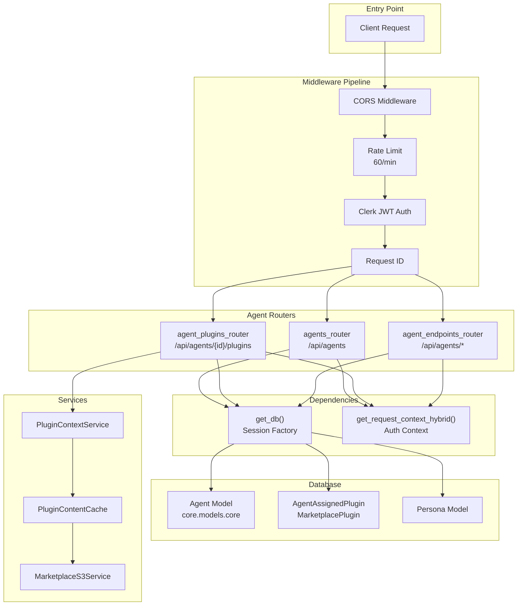
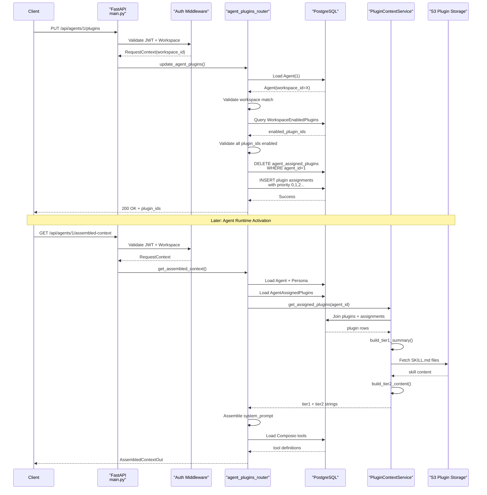

# Agent API Reference

<details>
<summary>Relevant source files</summary>

The following files were used as context for generating this wiki page:

- [frontend/app/admin/plugins/page.tsx](frontend/app/admin/plugins/page.tsx)
- [frontend/lib/api-client.ts](frontend/lib/api-client.ts)
- [orchestrator/.env.example](orchestrator/.env.example)
- [orchestrator/api/agent_plugins.py](orchestrator/api/agent_plugins.py)
- [orchestrator/config.py](orchestrator/config.py)
- [orchestrator/core/database/load_seed_data.py](orchestrator/core/database/load_seed_data.py)
- [orchestrator/core/seeds/seed_personas.py](orchestrator/core/seeds/seed_personas.py)
- [orchestrator/core/seeds/seed_plugin_categories.py](orchestrator/core/seeds/seed_plugin_categories.py)
- [orchestrator/core/services/plugin_cache.py](orchestrator/core/services/plugin_cache.py)
- [orchestrator/main.py](orchestrator/main.py)
- [scripts/ralph/prd.json](scripts/ralph/prd.json)

</details>


This page provides a complete API reference for agent management endpoints. It covers CRUD operations for agents, plugin assignment, persona configuration, and agent context assembly. For conceptual information about agents and their architecture, see [Agents](#3). For details on the agent runtime lifecycle, see [Agent Factory & Runtime](#3.5).

---

## Overview

The Agent API provides REST endpoints for managing AI agents in the Automatos AI platform. All endpoints require authentication via Clerk JWT and workspace isolation via `X-Workspace-ID` header. The API is organized into three primary routers:

| Router | Prefix | Purpose |
|--------|--------|---------|
| `agents_router` | `/api/agents` | Core CRUD operations (create, read, update, delete agents) |
| `agent_plugins_router` | `/api/agents/{agent_id}/plugins` | Plugin assignment and context assembly |
| `agent_endpoints_router` | `/api/agents` | Additional agent operations (start, stop, logs, stats) |

**Sources:** [orchestrator/main.py:691-692](), [orchestrator/api/agent_plugins.py:1-338]()

---

## Authentication & Headers

All agent endpoints require two headers:

```http
Authorization: Bearer <clerk_jwt_token>
X-Workspace-ID: <workspace_uuid>
```

The API uses hybrid authentication via `get_request_context_hybrid` dependency, which validates both the JWT and workspace context. Rate limiting is enforced at 60 requests/minute per IP.

**Sources:** [orchestrator/main.py:583-596](), [orchestrator/api/agent_plugins.py:22-23]()

---

## Endpoint Architecture



**Sources:** [orchestrator/main.py:555-596](), [orchestrator/api/agent_plugins.py:27-86]()

---

## Core Agent CRUD Endpoints

### List Agents

```http
GET /api/agents
```

Returns all agents for the authenticated workspace.

**Query Parameters:**
- `status` (optional): Filter by status (`active`, `idle`, `failed`)
- `type` (optional): Filter by agent type

**Response:**
```json
{
  "items": [
    {
      "id": 1,
      "name": "Data Analyst",
      "type": "analysis",
      "status": "active",
      "description": "Specialized in data analysis",
      "workspace_id": "uuid",
      "created_at": "2024-01-15T10:30:00Z",
      "model_config": {
        "model_id": "gpt-4",
        "temperature": 0.7
      },
      "persona_id": 1,
      "use_custom_persona": false
    }
  ],
  "total": 1
}
```

**Sources:** [orchestrator/main.py:691]()

### Get Agent by ID

```http
GET /api/agents/{agent_id}
```

Returns a single agent with full configuration details.

**Path Parameters:**
- `agent_id` (integer): Agent ID

**Validation:**
- Agent must exist
- Agent's `workspace_id` must match authenticated workspace

**Response:** Same structure as list item, with additional fields:
- `custom_persona_prompt` (if `use_custom_persona` is true)
- `skills` (array of assigned skills)
- `patterns` (array of assigned patterns)

**Sources:** [orchestrator/api/agent_plugins.py:84-89]()

### Create Agent

```http
POST /api/agents
```

Creates a new agent in the authenticated workspace.

**Request Body:**
```json
{
  "name": "Code Reviewer",
  "type": "development",
  "description": "Automated code review agent",
  "model_config": {
    "model_id": "gpt-4-turbo-preview",
    "temperature": 0.3,
    "max_tokens": 4000
  },
  "persona_id": 2,
  "use_custom_persona": false,
  "custom_persona_prompt": null
}
```

**Required Fields:**
- `name` (string, max 255)
- `type` (string)

**Optional Fields:**
- `description` (string)
- `model_config` (object)
- `persona_id` (integer)
- `use_custom_persona` (boolean)
- `custom_persona_prompt` (string)

**Response:**
```json
{
  "id": 2,
  "name": "Code Reviewer",
  "workspace_id": "uuid",
  "created_at": "2024-01-15T11:00:00Z",
  ...
}
```

**Sources:** [orchestrator/main.py:691]()

### Update Agent

```http
PUT /api/agents/{agent_id}
```

Updates an existing agent. Only the agent owner (workspace match) can update.

**Request Body:** Same as create, all fields optional

**Response:** Updated agent object

**Sources:** [orchestrator/main.py:691]()

### Delete Agent

```http
DELETE /api/agents/{agent_id}
```

Soft-deletes an agent by setting `status` to `deleted`.

**Response:**
```json
{
  "success": true,
  "message": "Agent deleted successfully",
  "agent_id": 2
}
```

**Sources:** [orchestrator/main.py:691]()

---

## Plugin Assignment Endpoints

### List Agent Plugins

```http
GET /api/agents/{agent_id}/plugins
```

Returns all plugins assigned to an agent, with marketplace plugin details joined.

**Response:**
```json
{
  "items": [
    {
      "plugin_id": "uuid",
      "slug": "code-review-pro",
      "name": "Code Review Pro",
      "version": "1.2.0",
      "description": "Advanced code review with security scanning",
      "skills_count": 5,
      "commands_count": 8,
      "token_estimate": 1200,
      "priority": 0,
      "assigned_at": "2024-01-10T14:20:00Z"
    }
  ]
}
```

**Sources:** [orchestrator/api/agent_plugins.py:69-125]()

### Update Agent Plugins

```http
PUT /api/agents/{agent_id}/plugins
```

Replaces all plugin assignments for an agent. Validates that all plugins are enabled for the workspace.

**Request Body:**
```json
{
  "plugin_ids": [
    "uuid-1",
    "uuid-2",
    "uuid-3"
  ]
}
```

**Validation:**
1. All `plugin_ids` must exist in `marketplace_plugins`
2. All `plugin_ids` must be enabled in `workspace_enabled_plugins` for the agent's workspace
3. Duplicates are automatically removed while preserving order

**Response:**
```json
{
  "success": true,
  "message": "Agent plugins updated (3 assigned)",
  "agent_id": 1,
  "plugin_ids": ["uuid-1", "uuid-2", "uuid-3"]
}
```

**Database Operations:**
1. Deletes existing `agent_assigned_plugins` records for the agent
2. Inserts new records with `priority` based on array order (0, 1, 2, ...)

**Sources:** [orchestrator/api/agent_plugins.py:127-209]()

---

## Assembled Context Endpoint

### Get Assembled Context

```http
GET /api/agents/{agent_id}/assembled-context
```

Returns the fully assembled agent context including persona prompt, plugin skills, and tool definitions. This endpoint is called by `AgentFactory` at runtime to build the agent's system prompt.

**Response:**
```json
{
  "agent_id": 1,
  "model": "gpt-4-turbo-preview",
  "temperature": 0.5,
  "system_prompt": "You are a senior software engineer...\n\n## Available Skills\n- Code Review...",
  "persona": {
    "name": "Senior Engineer",
    "slug": "senior-engineer",
    "source": "global",
    "category": "Engineering",
    "voice_description": "Technical, precise, patient"
  },
  "plugins_loaded": ["code-review-pro", "security-scan"],
  "tools": [
    {
      "id": 123,
      "name": "GITHUB",
      "description": "GitHub integration for code reviews",
      "provider": "Composio",
      "category": "Developer Tools",
      "configuration": {}
    }
  ],
  "token_estimate": 3400
}
```

**Assembly Process:**

```mermaid
graph TB
    subgraph "Context Assembly Pipeline"
        LoadAgent["1. Load Agent<br/>Validate Workspace"]
        ResolveModel["2. Resolve Model Config<br/>model_id, temperature"]
        LoadPersona["3. Load Persona<br/>Custom or Global"]
        LoadPlugins["4. Load Assigned Plugins<br/>PluginContextService"]
        BuildTier1["5. Build Tier1 Summary<br/>Plugin List + Quick Ref"]
        BuildTier2["6. Build Tier2 Content<br/>Full Skills + Commands"]
        LoadTools["7. Load Composio Tools<br/>AgentAppAssignment"]
        Assemble["8. Assemble System Prompt<br/>Persona + Tier1 + Tier2"]
        Estimate["9. Estimate Tokens<br/>len(prompt) // 4"]
    end
    
    LoadAgent --> ResolveModel
    ResolveModel --> LoadPersona
    LoadPersona --> LoadPlugins
    LoadPlugins --> BuildTier1
    BuildTier1 --> BuildTier2
    BuildTier2 --> LoadTools
    LoadTools --> Assemble
    Assemble --> Estimate
```



**Tier Structure:**

| Tier | Purpose | Source | Token Budget |
|------|---------|--------|--------------|
| **Persona** | Behavioral instructions | `Persona.system_prompt` or `Agent.custom_persona_prompt` | Variable (500-2000) |
| **Tier 1** | Plugin quick reference | `PluginContextService.build_tier1_summary()` | ~50-200 per plugin |
| **Tier 2** | Full skill/command docs | `PluginContextService.build_tier2_content()` | ~500-1500 per plugin |

**Sources:** [orchestrator/api/agent_plugins.py:211-338](), [orchestrator/core/services/plugin_context_service.py]()

---

## Data Models

### Agent Model

Located in `core.models.core.Agent`:

```python
class Agent(Base):
    __tablename__ = "agents"
    
    id: int (PK)
    workspace_id: UUID (FK)
    name: str (max 255)
    type: str
    status: str  # active, idle, failed, deleted
    description: str
    model_config: dict (JSONB)
    persona_id: int (FK, nullable)
    use_custom_persona: bool
    custom_persona_prompt: str (nullable)
    created_at: datetime
    updated_at: datetime
```

**Sources:** [orchestrator/api/agent_plugins.py:84]()

### Plugin Assignment Models

Located in `core.models.marketplace_plugins`:

```python
class AgentAssignedPlugin(Base):
    __tablename__ = "agent_assigned_plugins"
    
    id: UUID (PK)
    agent_id: int (FK agents)
    plugin_id: UUID (FK marketplace_plugins)
    priority: int (default 0)
    assigned_at: datetime
    
    # Unique constraint: (agent_id, plugin_id)

class MarketplacePlugin(Base):
    __tablename__ = "marketplace_plugins"
    
    id: UUID (PK)
    slug: str (unique)
    name: str
    version: str
    description: str
    skills_count: int
    commands_count: int
    token_estimate: int
```

**Sources:** [orchestrator/api/agent_plugins.py:78-101]()

---

## Request Flow Example



**Sources:** [orchestrator/api/agent_plugins.py:127-338]()

---

## Error Handling

All endpoints follow consistent error response format:

```json
{
  "detail": "Error message",
  "status_code": 400
}
```

### Common Error Codes

| Code | Scenario | Example |
|------|----------|---------|
| `400` | Validation failure | Plugin not enabled for workspace |
| `403` | Permission denied | Workspace ID mismatch |
| `404` | Resource not found | Agent does not exist |
| `422` | Invalid request body | Missing required fields |
| `500` | Internal server error | Database connection failure |

### Validation Rules

**Agent Updates:**
- Only agent owner (matching `workspace_id`) can update or delete
- `status` transitions must be valid: `active` ↔ `idle` ↔ `failed`, `deleted` is terminal

**Plugin Assignment:**
- All `plugin_ids` must exist in `marketplace_plugins` table
- All `plugin_ids` must be enabled in `workspace_enabled_plugins` for the agent's workspace
- Circular dependencies in plugin requirements are checked at enable time (not at assignment time)

**Sources:** [orchestrator/api/agent_plugins.py:120-124](), [orchestrator/api/agent_plugins.py:145-178]()

---

## Frontend Integration

The frontend uses `ApiClient` with automatic JWT injection:

```typescript
// List plugins for agent
const response = await apiClient.request<{items: Plugin[]}>(
  `/api/agents/${agentId}/plugins`
)

// Update plugins
await apiClient.request(`/api/agents/${agentId}/plugins`, {
  method: 'PUT',
  body: { plugin_ids: selectedPluginIds }
})
```

**Auto-Injected Headers:**
- `Authorization: Bearer <token>` from Clerk `useAuth()`
- `X-Workspace-ID` from `localStorage.getItem('last_active_workspace')`

**Admin Override:** When viewing agents in admin mode, `setAdminWorkspaceOverride()` allows viewing agents from any workspace without authentication.

**Sources:** [frontend/lib/api-client.ts:818-880]()

---

## Configuration

### Environment Variables

| Variable | Default | Purpose |
|----------|---------|---------|
| `REQUIRE_AUTH` | `true` | Enable Clerk JWT validation |
| `CLERK_SECRET_KEY` | - | Clerk API secret for JWT verification |
| `PLUGIN_CACHE_TTL_SECONDS` | `3600` | Redis cache TTL for plugin content |
| `S3_DOCUMENTS_BUCKET` | `automatos-ai` | S3 bucket for plugin storage |

**Sources:** [orchestrator/config.py:87-88](), [orchestrator/config.py:283]()

---

## Rate Limiting

Agent endpoints are rate-limited using SlowAPI:

```python
limiter = Limiter(
    key_func=_get_real_client_ip,
    default_limits=["60/minute"]
)
```

Rate limit headers are returned in responses:
```http
X-RateLimit-Limit: 60
X-RateLimit-Remaining: 45
X-RateLimit-Reset: 1642345678
```

**Sources:** [orchestrator/main.py:583-596]()

---

## Database Relationships

```mermaid
erDiagram
    Agent ||--o{ AgentAssignedPlugin : "has"
    Agent }o--|| Workspace : "belongs to"
    Agent }o--o| Persona : "uses"
    AgentAssignedPlugin }o--|| MarketplacePlugin : "references"
    MarketplacePlugin ||--o{ WorkspaceEnabledPlugin : "enabled in"
    WorkspaceEnabledPlugin }o--|| Workspace : "belongs to"
    Agent ||--o{ AgentAppAssignment : "uses"
    AgentAppAssignment }o--|| ComposioAppCache : "references"
    
    Agent {
        int id PK
        uuid workspace_id FK
        string name
        string type
        string status
        jsonb model_config
        int persona_id FK
        bool use_custom_persona
        text custom_persona_prompt
    }
    
    AgentAssignedPlugin {
        uuid id PK
        int agent_id FK
        uuid plugin_id FK
        int priority
        datetime assigned_at
    }
    
    MarketplacePlugin {
        uuid id PK
        string slug UK
        string name
        string version
        int skills_count
        int commands_count
        int token_estimate
    }
    
    WorkspaceEnabledPlugin {
        uuid id PK
        uuid workspace_id FK
        uuid plugin_id FK
    }
    
    Persona {
        int id PK
        string slug UK
        string name
        text system_prompt
        string scope
    }
```



**Sources:** [orchestrator/api/agent_plugins.py:78-101](), [orchestrator/api/agent_plugins.py:249-252]()

---

## Plugin Context Service

The `PluginContextService` builds tiered plugin context for agent prompts:

**Tier 1 Summary** (compact reference):
```markdown
## Available Plugins

1. **code-review-pro** (v1.2.0) — Advanced code review with security scanning
   - Skills: 5 | Commands: 8 | Est. tokens: 1200

2. **test-generator** (v2.0.1) — Automated test case generation
   - Skills: 3 | Commands: 4 | Est. tokens: 800
```

**Tier 2 Content** (full documentation):
```markdown
## Plugin: code-review-pro

### Skills

#### Static Analysis
Performs static code analysis to identify potential bugs, security vulnerabilities, and code smells.

**Usage:** Provide code snippet and language. Returns list of findings with severity levels.

### Commands

#### /review-pr
Reviews an entire pull request with detailed feedback.
- **Parameters:** pr_url (string, required)
- **Returns:** markdown report
```

**Sources:** [orchestrator/api/agent_plugins.py:266-286]()

---

## Testing Endpoints

Use the interactive API docs at `http://localhost:8000/docs` (disabled in production):

1. Click "Authorize" and enter your Clerk JWT token
2. Add `X-Workspace-ID` header in request
3. Test endpoints with live validation

**Alternative:** Use `curl` with explicit headers:

```bash
curl -X GET "http://localhost:8000/api/agents/1/plugins" \
  -H "Authorization: Bearer $CLERK_TOKEN" \
  -H "X-Workspace-ID: $WORKSPACE_ID"
```

**Sources:** [orchestrator/main.py:533-534]()

---