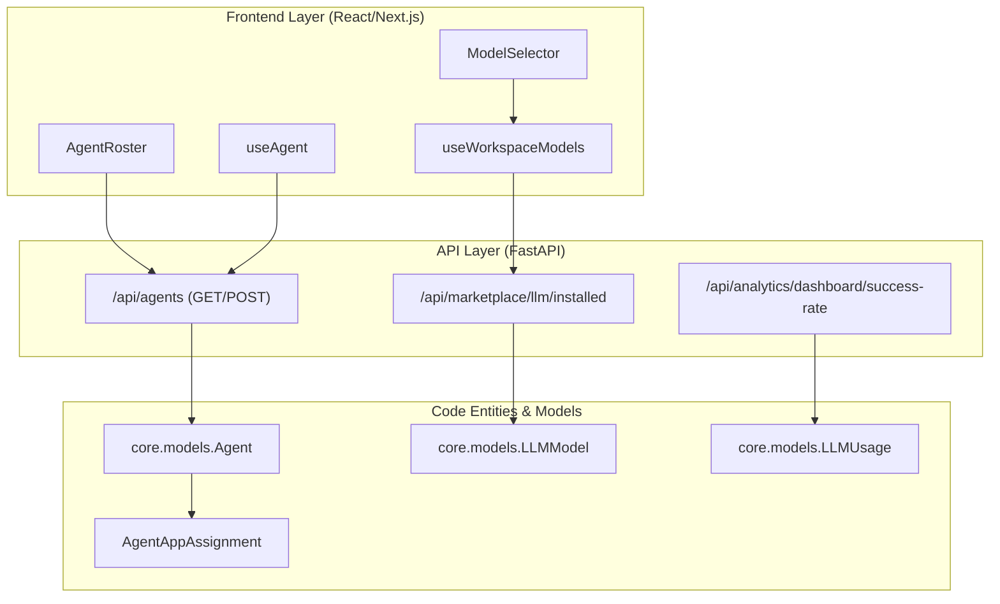

# Agent API Reference

<details>
<summary>Relevant source files</summary>

The following files were used as context for generating this wiki page:

- [.env.example](.env.example)
- [frontend/components/agents/agent-configuration-modal.tsx](frontend/components/agents/agent-configuration-modal.tsx)
- [frontend/components/agents/agent-configuration.tsx](frontend/components/agents/agent-configuration.tsx)
- [frontend/components/agents/agent-details-modal.tsx](frontend/components/agents/agent-details-modal.tsx)
- [frontend/components/agents/agent-roster.tsx](frontend/components/agents/agent-roster.tsx)
- [frontend/components/agents/create-agent-modal.tsx](frontend/components/agents/create-agent-modal.tsx)
- [frontend/components/agents/model-selector.tsx](frontend/components/agents/model-selector.tsx)
- [frontend/components/documents/analytics-tab.tsx](frontend/components/documents/analytics-tab.tsx)
- [frontend/components/documents/processing-tab.tsx](frontend/components/documents/processing-tab.tsx)
- [frontend/hooks/use-model-api.ts](frontend/hooks/use-model-api.ts)
- [frontend/lib/agent-constants.ts](frontend/lib/agent-constants.ts)
- [orchestrator/alembic/versions/add_job_title_to_agents.py](orchestrator/alembic/versions/add_job_title_to_agents.py)
- [orchestrator/alembic/versions/agent_public_id_and_slug_fix.py](orchestrator/alembic/versions/agent_public_id_and_slug_fix.py)
- [orchestrator/alembic/versions/seed_auto_agents_existing_workspaces.py](orchestrator/alembic/versions/seed_auto_agents_existing_workspaces.py)
- [orchestrator/api/agent_endpoints.py](orchestrator/api/agent_endpoints.py)
- [orchestrator/api/agents.py](orchestrator/api/agents.py)
- [orchestrator/api/analytics.py](orchestrator/api/analytics.py)
- [orchestrator/api/analytics_real.py](orchestrator/api/analytics_real.py)
- [orchestrator/api/execution_history.py](orchestrator/api/execution_history.py)
- [orchestrator/api/workflow_history.py](orchestrator/api/workflow_history.py)
- [orchestrator/core/models/core.py](orchestrator/core/models/core.py)
- [orchestrator/core/utils/agent_resolver.py](orchestrator/core/utils/agent_resolver.py)

</details>


This page provides a complete technical reference for agent management endpoints in the Automatos AI platform. It covers CRUD operations, plugin/skill assignment, persona configuration, and the runtime context assembly process.

## Overview

The Agent API provides REST endpoints for managing AI agents. All endpoints require authentication via Clerk JWT or API Key, and enforce workspace isolation via the `X-Workspace-ID` header or JWT claims. The backend implementation is distributed across several key routers in the orchestrator.

| Router | Prefix | Purpose | Key File |
|--------|--------|---------|----------|
| `agents_router` | `/api/agents` | Core CRUD and relationship management | [orchestrator/api/agents.py:31]() |
| `agent_plugins_router` | `/api/agents/{id}/plugins` | Plugin assignment and context assembly | [orchestrator/api/agents.py:31]() |
| `agent_endpoints_router` | `/api/agents` | Specialized creation and performance metrics | [orchestrator/api/agent_endpoints.py:26]() |
| `analytics_router` | `/api/analytics` | Success rates and task completion times | [orchestrator/api/analytics_real.py:32]() |

**Sources:** [orchestrator/api/agents.py:31](), [orchestrator/api/agent_endpoints.py:26](), [orchestrator/api/analytics_real.py:32]()

---

## Authentication & Workspace Resolution

The API uses a hybrid authentication strategy to support both frontend users (Clerk) and programmatic access.

```http
Authorization: Bearer <clerk_jwt_token>
X-Workspace-ID: <workspace_uuid>
```

The `get_request_context_hybrid` dependency validates the token and injects a `RequestContext` containing the `user_id` and `workspace_id` [orchestrator/api/agents.py:26-27](). For external identification, the system uses a `public_id` (UUID) to avoid ID guessing in public widgets [orchestrator/core/models/core.py:202-205]().

**Agent ID Resolution:**
The utility `resolve_agent_id` is used to handle both legacy integer IDs and new UUID `public_id` strings while strictly enforcing workspace ownership [orchestrator/core/utils/agent_resolver.py:17-34]().

**Sources:** [orchestrator/api/agents.py:26-27](), [orchestrator/core/utils/agent_resolver.py:17-34](), [orchestrator/core/models/core.py:202-205]()

---

## System Architecture: Agent Management

The following diagram bridges the frontend UI components to the backend API entities and database models.

Title: Frontend-to-Backend Entity Mapping


**Sources:** [frontend/hooks/use-model-api.ts:93-104](), [frontend/components/agents/model-selector.tsx:38](), [orchestrator/api/agents.py:31](), [orchestrator/core/models/core.py:138-140]()

---

## Core Agent CRUD Endpoints

### List Agents
`GET /api/agents`

Returns a list of agents for the current workspace. The response is enriched with tool assignments and plugin counts.

**Implementation Details:**
- Uses `_build_agent_response` to join `AgentAppAssignment` and `ComposioAppCache` [orchestrator/api/agents.py:174-205]().
- Includes `model_config` details (provider, model_id, temperature) [orchestrator/api/agents.py:177-178]().
- Normalizes tags from CSV strings or JSON arrays [orchestrator/api/agents.py:146-171]().
- Integrates `getAgentRoleLine` to compose card subtitles as `{Category} · {Job Title}` [frontend/lib/agent-constants.ts:137-141]().

**Sources:** [orchestrator/api/agents.py:174-205](), [orchestrator/api/agents.py:146-171](), [frontend/lib/agent-constants.ts:137-141]()

### Create Specialized Agent
`POST /api/agents/create-specialized`

A high-level endpoint used by the `AgentFactory` to create agents with verified LLM connections [orchestrator/api/agent_endpoints.py:81-87]().

**Workflow:**
1. Extracts `name`, `type`, and `model_config` [orchestrator/api/agent_endpoints.py:68-72]().
2. Calls `factory.create_agent` to initialize runtime [orchestrator/api/agent_endpoints.py:81-87]().
3. **Knowledge Graph:** Schedules an incremental update to the workspace knowledge graph to include the new agent in the "roster" [orchestrator/api/agent_endpoints.py:93-98]().

**Sources:** [orchestrator/api/agent_endpoints.py:40-106]()

---

## Model Configuration & Analytics

### LLM Model Selection
Agents are configured with specific models from the `llm_models` registry [orchestrator/core/models/core.py:43-48](). The `ModelSelector` component groups these by tier: `direct`, `aggregator`, or `byok` [orchestrator/core/models/core.py:81-83]().

**Usage Tracking:**
Every LLM request is logged in the `llm_usage` table, capturing `input_tokens`, `output_tokens`, and `total_cost` [orchestrator/core/models/core.py:138-161]().

### Performance Analytics
`GET /api/analytics/dashboard/success-rate`

Calculates the success rate by performing a `UNION` query across legacy `WorkflowExecution` and new `OrchestrationRun` (Missions) [orchestrator/api/analytics_real.py:53-75]().

**Metrics Provided:**
- `agent_success_rate`: Combined completion percentage.
- `avg_task_completion_time`: Weighted average of workflow and mission durations [orchestrator/api/analytics_real.py:112-159]().
- `total_cost`: Aggregated from `llm_usage` records [orchestrator/core/models/core.py:161]().

**Sources:** [orchestrator/api/analytics_real.py:53-159](), [orchestrator/core/models/core.py:138-161]()

---

## Tool & Plugin Assignment

### Tool Assignment
The system uses "Stable IDs" (negative integers) to map frontend tool selections to backend `app_name` strings [orchestrator/api/agents.py:68-78]().

- **Logic:** `_resolve_tool_ids_to_app_names` validates that the requested tools are actually connected in the current workspace using the `EntityManager` [orchestrator/api/agents.py:97-143]().
- **Persistence:** Assignments are stored in the `agent_app_assignments` table [orchestrator/api/agents.py:182-186]().

**Sources:** [orchestrator/api/agents.py:68-78](), [orchestrator/api/agents.py:97-143](), [orchestrator/api/agents.py:182-186]()

---

## Agent Learning & Feedback

`POST /api/agents/{agent_id}/learn`

Allows users to provide feedback on agent performance.

**Execution Flow:**
1. Validates the agent is active in the `AgentFactory` [orchestrator/api/agent_endpoints.py:139-144]().
2. Appends a `learning_entry` to the agent's runtime memory containing `quality_score` and `improvements` [orchestrator/api/agent_endpoints.py:150-158]().
3. Transitions `lifecycle_state` to `LEARNING` during processing [orchestrator/api/agent_endpoints.py:161-169]().

**Sources:** [orchestrator/api/agent_endpoints.py:116-186]()

---

## Data Models

### Agent Model
The `Agent` model [orchestrator/core/models/core.py:188-251]() includes:
- `public_id`: UUID for public-facing identification [orchestrator/core/models/core.py:202]().
- `is_system_agent`: Boolean flag for orchestrators like the "Auto" agent [orchestrator/core/models/core.py:223]().
- `model_config`: JSONB configuration for the LLM [orchestrator/core/models/core.py:229]().
- `job_title`: User-defined role description used in UI roster cards [orchestrator/core/models/core.py:207]().

### LLMUsage Model
Tracks granular execution data for billing and analytics [orchestrator/core/models/core.py:138-169]().

| Field | Type | Description |
|-------|------|-------------|
| `workspace_id` | UUID | Isolation boundary |
| `model_id` | String | Model identifier (e.g., gpt-4) |
| `input_tokens` | Integer | Prompt token count |
| `total_cost` | Float | Calculated cost in USD |

**Sources:** [orchestrator/core/models/core.py:138-169](), [orchestrator/core/models/core.py:188-251]()

---