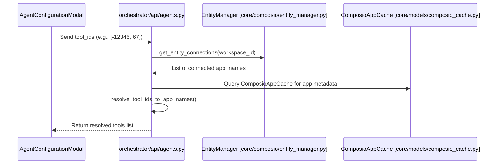

# Agent Configuration

<details>
<summary>Relevant source files</summary>

The following files were used as context for generating this wiki page:

- [frontend/components/agents/agent-configuration-modal.tsx](frontend/components/agents/agent-configuration-modal.tsx)
- [frontend/components/agents/agent-configuration.tsx](frontend/components/agents/agent-configuration.tsx)
- [frontend/components/agents/agent-details-modal.tsx](frontend/components/agents/agent-details-modal.tsx)
- [frontend/components/agents/agent-management.tsx](frontend/components/agents/agent-management.tsx)
- [frontend/components/agents/agent-performance.tsx](frontend/components/agents/agent-performance.tsx)
- [frontend/components/agents/agent-roster.tsx](frontend/components/agents/agent-roster.tsx)
- [frontend/components/agents/agent-skills.tsx](frontend/components/agents/agent-skills.tsx)
- [frontend/components/agents/agent-status-control-modal.tsx](frontend/components/agents/agent-status-control-modal.tsx)
- [frontend/components/agents/create-agent-modal.tsx](frontend/components/agents/create-agent-modal.tsx)
- [frontend/components/agents/create-skill-modal.tsx](frontend/components/agents/create-skill-modal.tsx)
- [frontend/components/agents/skill-configuration-modal.tsx](frontend/components/agents/skill-configuration-modal.tsx)
- [frontend/components/documents/analytics-tab.tsx](frontend/components/documents/analytics-tab.tsx)
- [frontend/components/documents/processing-tab.tsx](frontend/components/documents/processing-tab.tsx)
- [frontend/hooks/use-agent-api.ts](frontend/hooks/use-agent-api.ts)
- [frontend/hooks/use-document-api.ts](frontend/hooks/use-document-api.ts)
- [orchestrator/api/agents.py](orchestrator/api/agents.py)
- [orchestrator/core/models/__init__.py](orchestrator/core/models/__init__.py)
- [orchestrator/core/models/core.py](orchestrator/core/models/core.py)
- [orchestrator/services/heartbeat_service.py](orchestrator/services/heartbeat_service.py)

</details>


## Purpose and Scope

Agent configuration in Automatos AI encompasses the operational settings, resource allocations, and behavioral parameters that define how an AI agent functions within a workspace. This includes model selection via the **Model Configuration** system, capability management through **Skills** and **Plugins**, and autonomous behavior settings like **Heartbeat** intervals. Configuration is primarily managed via the `AgentConfigurationModal` [frontend/components/agents/agent-configuration-modal.tsx:95-100]() in the frontend and persisted in the `agents` table's `configuration` JSONB column in the backend [orchestrator/core/models/core.py:205-210]().

---

## Configuration Architecture

Agent configuration is a multi-layered system that bridges high-level user intent with low-level LLM parameters and system resource limits.

### Data Flow and Entity Mapping

The following diagram illustrates the flow of configuration data from the UI components to the database entities.

Title: Agent Configuration Data Flow
```mermaid
graph TD
    subgraph "Frontend (Code Entity Space)"
        ACM["AgentConfigurationModal [agent-configuration-modal.tsx]"]
        MS["ModelSelector [model-selector.tsx]"]
        AS["AgentSkills [agent-skills.tsx]"]
        Hook["useUpdateAgentConfig [use-agent-api.ts]"]
    end

    subgraph "Backend (Code Entity Space)"
        Router["Agent Router [/api/agents] [orchestrator/api/agents.py]"]
        Model["Agent SQLAlchemy Model [core/models/core.py]"]
        Assign["AgentAppAssignment [core/models/composio_cache.py]"]
        Embed["_reindex_agent_embedding [orchestrator/api/agents.py]"]
    end

    ACM --> Hook
    Hook -->|PATCH /api/agents/{id}| Router
    Router -->|Update configuration JSONB| Model
    Router -->|Trigger| Embed
    ACM -->|POST /api/agents/{id}/tools| Assign
    MS -->|Update model_config| Router
    AS -->|Add/Remove Skill| Router
```
**Sources:** [frontend/components/agents/agent-configuration-modal.tsx:95-135](), [orchestrator/api/agents.py:38-67](), [orchestrator/api/agents.py:174-210](), [frontend/hooks/use-agent-api.ts:21-59](), [orchestrator/core/models/core.py:198-215]()

---

## Configuration Modal Tabs

The `AgentConfigurationModal` [frontend/components/agents/agent-configuration-modal.tsx:95-100]() is the central hub for modifying an existing agent. It organizes settings into several logical tabs:

### 1. General Settings
This tab handles basic identity and lifecycle metadata.
- **Name & Description**: Basic identification strings [frontend/components/agents/agent-configuration-modal.tsx:70-73]().
- **Agent Type/Category**: Mapped via `CATEGORY_TO_DB_MAP` to internal types like `code_architect` or `data_analyst` [frontend/components/agents/create-agent-modal.tsx:207-208]().
- **Status**: Controls whether the agent is `active`, `idle`, or in `maintenance` [frontend/components/agents/agent-configuration-modal.tsx:75]().
- **Tags**: Comma-separated strings normalized into a list of unique, lower-trimmed strings by the backend `_normalize_tags` function [orchestrator/api/agents.py:146-171]().

### 2. Model Configuration (PRD-15)
Managed via the `ModelSelector` [frontend/components/agents/model-selector.tsx]() component, this section defines the LLM "brain" of the agent.
- **Provider**: Selection of LLM service (OpenAI, Anthropic, etc.) [frontend/components/agents/create-agent-modal.tsx:82]().
- **Model ID**: Specific model version (e.g., `gpt-4`, `claude-3-opus-20240229`) [frontend/components/agents/agent-roster.tsx:169-183]().
- **Hyperparameters**:
    - **Temperature**: Controls randomness (0.0 to 2.0) [frontend/components/agents/create-agent-modal.tsx:84]().
    - **Max Tokens**: Limits the length of the generated response [frontend/components/agents/create-agent-modal.tsx:85]().
    - **Top P, Frequency Penalty, Presence Penalty**: Advanced sampling controls [frontend/components/agents/create-agent-modal.tsx:86-88]().

### 3. Resources & Priority
Defines the execution constraints for the agent within the orchestrator.
- **Priority Level**: Options include `low`, `medium`, `high`, and `critical` [frontend/components/agents/agent-configuration-modal.tsx:77]().
- **Max Concurrent Tasks**: Limits how many simultaneous operations the agent can handle [frontend/components/agents/agent-configuration-modal.tsx:78]().
- **Resource Limits**: Configures `memory_mb`, `cpu_percent`, and `network_bandwidth` constraints [frontend/components/agents/agent-configuration-modal.tsx:82-86]().

### 4. Skills & Plugins (PRD-42/PRD-71)
Agents gain capabilities through two primary mechanisms:
- **Skills**: Granular, often code-based abilities (e.g., "Development", "Security"). Managed via the `AgentSkills` component and `useAgentSkills` hook [frontend/hooks/use-agent-api.ts:173-180]().
- **Plugins**: Larger integrations or toolsets enabled at the workspace level and assigned to specific agents via the `AgentAssignedPlugin` model [orchestrator/api/agents.py:15](), [frontend/components/agents/agent-configuration-modal.tsx:124-129]().

**Sources:** [frontend/components/agents/agent-configuration-modal.tsx:70-90](), [frontend/components/agents/agent-configuration-modal.tsx:117-135](), [orchestrator/api/agents.py:146-171]()

---

## Tools and Integrations

Tools are assigned to agents by linking them to connected applications (Composio). The backend manages this via the `agent_app_assignments` table [orchestrator/api/agents.py:182-183]().

### Tool Resolution Logic
When a user selects tools in the UI, the backend performs the following resolution in `_resolve_tool_ids_to_app_names` [orchestrator/api/agents.py:97-143]():
1. **Stable ID Matching**: Matches frontend negative integer hashes (generated from app names via `_stable_tool_id`) to actual apps [orchestrator/api/agents.py:68-79]().
2. **Connection Validation**: Only tools that are "active", "added", or "pending" in the current workspace's `EntityManager` can be assigned [orchestrator/api/agents.py:107-117]().
3. **Assignment Persistence**: Creates or updates entries in `AgentAppAssignment` [orchestrator/api/agents.py:182-187]().

Title: Tool Resolution Sequence

**Sources:** [orchestrator/api/agents.py:97-143](), [orchestrator/api/agents.py:180-205](), [core/models/composio_cache.py:13-30]()

---

## Heartbeat Configuration (PRD-55)

The Heartbeat system allows agents to perform proactive checks or autonomous actions without direct user prompts. This is configured within the `AgentConfigurationModal` state [frontend/components/agents/agent-configuration-modal.tsx:156-167]().

| Setting | Type | Description |
|---------|------|-------------|
| `enabled` | boolean | Activates the proactive background loop. |
| `interval_minutes` | integer | Frequency of heartbeat execution. |
| `inherit_active_hours` | boolean | Uses workspace-wide active hours if true. |
| `active_hours_start/end` | string | Defines a window (e.g., 08:00-20:00) where heartbeats are allowed. |
| `auto_act` | boolean | If true, the agent can execute tools autonomously during a heartbeat. |
| `report_to` | string | Destination for heartbeat logs (`orchestrator`, `webhook`, or `channel`). |

The `HeartbeatService` [orchestrator/services/heartbeat_service.py:24]() manages the scheduling of these ticks using `APScheduler` [orchestrator/services/heartbeat_service.py:17](). It converts intervals into `CronTrigger` objects [orchestrator/services/heartbeat_service.py:130-161]() to ensure execution at fixed times.

**Sources:** [frontend/components/agents/agent-configuration-modal.tsx:156-167](), [orchestrator/services/heartbeat_service.py:24-31](), [orchestrator/services/heartbeat_service.py:130-161]()

---

## Persona and Voice (US-023 / PRD-74)

Agents can be assigned a "Persona" which overrides or augments their base system prompt.
- **Predefined Personas**: Templates fetched from `/api/personas` providing specialized prompts and suggested temperatures [frontend/components/agents/create-agent-modal.tsx:44-54]().
- **Custom Personas**: User-defined system prompts that define the agent's unique character or domain expertise [frontend/components/agents/agent-configuration-modal.tsx:141]().
- **Voice Profiles**: Assignments for text-to-speech capabilities, allowing agents to have distinct vocal identities [frontend/components/agents/agent-configuration-modal.tsx:150-153]().

**Sources:** [frontend/components/agents/agent-configuration-modal.tsx:136-153](), [frontend/components/agents/create-agent-modal.tsx:92-100]()

---

## Persistence and React Query Integration

The frontend uses specialized hooks to ensure configuration changes are synchronized and cached efficiently.

- **`useAgentConfig(agentId)`**: Fetches the configuration data from the backend [frontend/hooks/use-agent-api.ts:183-189]().
- **`useUpdateAgentConfig()`**: A mutation hook that triggers a `PATCH` request to `/api/agents/{agentId}` and invalidates the `agentConfig` query key to force a UI refresh [frontend/hooks/use-agent-api.ts:211-218]().
- **`formInitializedRef`**: A `useRef` pattern used in the modal to prevent background polling from overwriting a user's unsaved edits while the modal is open [frontend/components/agents/agent-configuration-modal.tsx:178-191]().

**Sources:** [frontend/hooks/use-agent-api.ts:183-189](), [frontend/hooks/use-agent-api.ts:211-218](), [frontend/components/agents/agent-configuration-modal.tsx:178-191]()

---