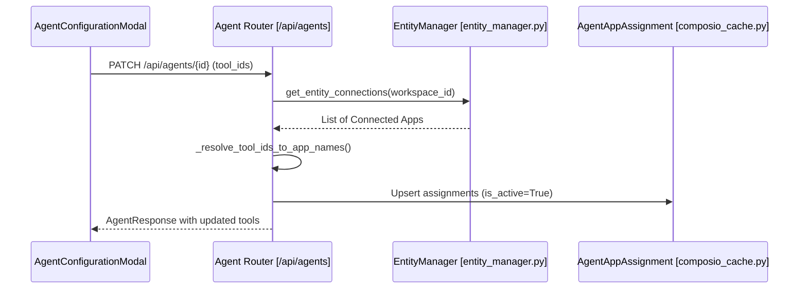

# Agent Configuration

<details>
<summary>Relevant source files</summary>

The following files were used as context for generating this wiki page:

- [frontend/components/agents/agent-configuration-modal.tsx](frontend/components/agents/agent-configuration-modal.tsx)
- [frontend/components/agents/agent-configuration.tsx](frontend/components/agents/agent-configuration.tsx)
- [frontend/components/agents/agent-details-modal.tsx](frontend/components/agents/agent-details-modal.tsx)
- [frontend/components/agents/agent-roster.tsx](frontend/components/agents/agent-roster.tsx)
- [frontend/components/agents/create-agent-modal.tsx](frontend/components/agents/create-agent-modal.tsx)
- [frontend/components/documents/analytics-tab.tsx](frontend/components/documents/analytics-tab.tsx)
- [frontend/components/documents/processing-tab.tsx](frontend/components/documents/processing-tab.tsx)
- [frontend/lib/agent-constants.ts](frontend/lib/agent-constants.ts)
- [orchestrator/alembic/versions/add_job_title_to_agents.py](orchestrator/alembic/versions/add_job_title_to_agents.py)
- [orchestrator/alembic/versions/agent_public_id_and_slug_fix.py](orchestrator/alembic/versions/agent_public_id_and_slug_fix.py)
- [orchestrator/alembic/versions/seed_auto_agents_existing_workspaces.py](orchestrator/alembic/versions/seed_auto_agents_existing_workspaces.py)
- [orchestrator/api/agents.py](orchestrator/api/agents.py)
- [orchestrator/core/models/core.py](orchestrator/core/models/core.py)
- [orchestrator/core/utils/agent_resolver.py](orchestrator/core/utils/agent_resolver.py)

</details>


## Purpose and Scope

Agent configuration in Automatos AI encompasses the operational settings, resource allocations, and behavioral parameters that define how an AI agent functions within a workspace. This includes model selection via the **Model Configuration** system, capability management through **Skills** and **Plugins**, and autonomous behavior settings like **Heartbeat** intervals. Configuration is primarily managed via the `AgentConfigurationModal` in the frontend and persisted in the `agents` table's `configuration` and `model_config` columns in the backend [orchestrator/core/models/core.py:199-231]().

---

## Configuration Architecture

Agent configuration is a multi-layered system that bridges high-level user intent with low-level LLM parameters and system resource limits. The system supports semantic re-indexing upon configuration changes to ensure the **Universal Router** remains accurate [orchestrator/api/agents.py:38-43]().

### Data Flow and Entity Mapping

The following diagram illustrates the flow of configuration data from the UI components to the database entities.

Title: Agent Configuration Data Flow
```mermaid
graph TD
    subgraph "Frontend (Code Entity Space)"
        ACM["AgentConfigurationModal [agent-configuration-modal.tsx]"]
        MS["ModelSelector [model-selector.tsx]"]
        AS["AgentSkills [agent-configuration.tsx]"]
        Hook["useUpdateAgentConfig [use-agent-api.ts]"]
    end

    subgraph "Backend (Code Entity Space)"
        Router["Agent Router [/api/agents] [orchestrator/api/agents.py]"]
        Model["Agent SQLAlchemy Model [core/models/core.py]"]
        SkillsTable["agent_skills [core/models/core.py]"]
        Indexer["Semantic Indexer [semantic_indexer.py]"]
    end

    ACM --> Hook
    Hook -->|PATCH /api/agents/{id}| Router
    Router -->|Update configuration/model_config| Model
    Router -->|Background Task| Indexer
    AS -->|Insert agent_id/skill_id| SkillsTable
    MS -->|Update model_config| Router
```
Sources: [frontend/components/agents/agent-configuration-modal.tsx:111-120](), [orchestrator/api/agents.py:38-65](), [orchestrator/core/models/core.py:28-32](), [orchestrator/core/models/core.py:199-231]()

---

## Configuration Modal Tabs

The `AgentConfigurationModal` is the central hub for modifying an existing agent. It organizes settings into several logical tabs [frontend/components/agents/agent-configuration-modal.tsx:46-53]():

### 1. General Settings
This tab handles basic identity and lifecycle metadata.
- **Name & Description**: Basic identification strings [frontend/components/agents/agent-configuration-modal.tsx:71-74]().
- **Agent Type/Category**: Mapped via `CATEGORY_TO_DB_MAP` to internal types like `code_architect` or `data_analyst` [frontend/lib/agent-constants.ts:48-65]().
- **Job Title**: A short role label (e.g., "Lead Intelligence") shown on roster cards [orchestrator/alembic/versions/add_job_title_to_agents.py:1-7]().
- **Tags**: Normalized into a unique, lower-trimmed list [orchestrator/api/agents.py:146-171]().

### 2. Model Configuration (PRD-15)
Managed via the `ModelSelector` component, this section defines the LLM "brain" of the agent.
- **Provider**: Selection of LLM service (OpenRouter, OpenAI, Anthropic) [orchestrator/core/models/core.py:51]().
- **Model ID**: Specific model version (e.g., `gpt-4-turbo`) [orchestrator/core/models/core.py:52]().
- **Hyperparameters**: Includes `temperature`, `max_tokens`, `top_p`, and `presence_penalty` [orchestrator/alembic/versions/seed_auto_agents_existing_workspaces.py:73]().

### 3. Resources & Priority
Defines the execution constraints for the agent within the orchestrator.
- **Priority Level**: Options include `low`, `medium`, `high`, and `critical` [orchestrator/core/models/core.py:22-26]().
- **Max Concurrent Tasks**: Limits simultaneous operations [frontend/components/agents/agent-configuration-modal.tsx:80]().
- **Resource Limits**: Configures `memory_mb`, `cpu_percent`, and `network_bandwidth` [frontend/components/agents/agent-configuration-modal.tsx:84-88]().

### 4. Skills & Plugins (PRD-42/PRD-71)
Agents gain capabilities through two primary mechanisms:
- **Skills**: Technical abilities (e.g., "Data Analysis") assigned via the `agent_skills` join table [orchestrator/core/models/core.py:29-32]().
- **Plugins**: Workspace-enabled integrations assigned to specific agents via the `AgentAssignedPlugin` model [orchestrator/api/agents.py:14-15]().

Sources: [frontend/components/agents/agent-configuration-modal.tsx:71-91](), [orchestrator/core/models/core.py:22-119](), [frontend/lib/agent-constants.ts:48-65]()

---

## Tools and Integrations

Tools are assigned to agents by linking them to connected applications. The backend resolves incoming tool IDs (either DB IDs or frontend stable hashes) into `app_name` strings [orchestrator/api/agents.py:97-102]().

### Tool Resolution Logic
1. **Connection Check**: Only tools connected to the current workspace (status: `active`, `added`, or `pending`) are allowed [orchestrator/api/agents.py:106-117]().
2. **Stable Hashing**: Frontend uses a stable hashing algorithm to generate negative integer IDs for tool names [orchestrator/api/agents.py:68-78]().
3. **Assignment Persistence**: Relationships are stored in the `agent_app_assignments` table, which tracks `is_active` status and the user who performed the assignment [orchestrator/api/agents.py:182-186]().

Title: Tool Assignment Sequence

Sources: [orchestrator/api/agents.py:97-143](), [orchestrator/api/agents.py:182-192]()

---

## Heartbeat Configuration (PRD-55)

The Heartbeat system allows agents to perform proactive checks or autonomous actions. This is configured within the `AgentConfigurationModal` and stored in the agent's configuration JSON [frontend/components/agents/agent-configuration-modal.tsx:158-170]().

| Setting | Type | Description |
|---------|------|-------------|
| `enabled` | boolean | Activates the proactive background loop. |
| `interval_minutes` | integer | Frequency of heartbeat execution. |
| `inherit_active_hours` | boolean | Respects workspace-wide active hours if true. |
| `prompt` | string | The specific instruction given to the agent during the tick. |
| `auto_act` | boolean | If true, the agent can execute tools autonomously. |
| `report_to` | string | Destination for heartbeat results (e.g., 'orchestrator'). |

Sources: [frontend/components/agents/agent-configuration-modal.tsx:158-170](), [orchestrator/alembic/versions/seed_auto_agents_existing_workspaces.py:74]()

---

## Persona and Voice (US-023 / PRD-74)

Agents can be assigned a "Persona" which defines their base system prompt and behavioral characteristics.
- **Predefined Personas**: Templates providing specialized prompts, categories, and suggested temperatures [frontend/components/agents/create-agent-modal.tsx:44-54]().
- **Custom Personas**: User-defined system prompts that define unique domain expertise [frontend/components/agents/agent-configuration-modal.tsx:143-144]().
- **Voice Profiles**: Assignments for text-to-speech capabilities, allowing agents to have distinct vocal identities [frontend/components/agents/agent-configuration-modal.tsx:153-156]().

Sources: [frontend/components/agents/agent-configuration-modal.tsx:139-156](), [frontend/components/agents/create-agent-modal.tsx:44-54]()

---

## Persistence and React Query Integration

The frontend uses specialized hooks to ensure configuration changes are synchronized and cached efficiently.

- **`useAgentConfig(agentId)`**: Fetches the configuration data for the specific agent [frontend/components/agents/agent-configuration-modal.tsx:114]().
- **`useUpdateAgentConfig()`**: A mutation hook that triggers an update to the backend [frontend/components/agents/agent-configuration-modal.tsx:115]().
- **`formInitializedRef`**: A `useRef` pattern used to prevent background polling from overwriting a user's unsaved edits while the modal is open [frontend/components/agents/agent-configuration-modal.tsx:179-191]().

Sources: [frontend/components/agents/agent-configuration-modal.tsx:112-116](), [frontend/components/agents/agent-configuration-modal.tsx:179-191]()

---