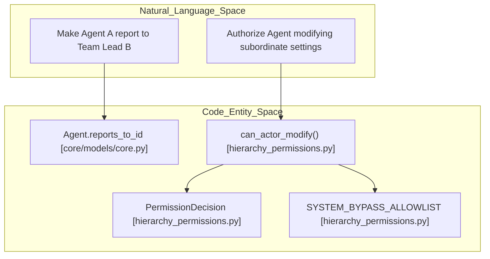
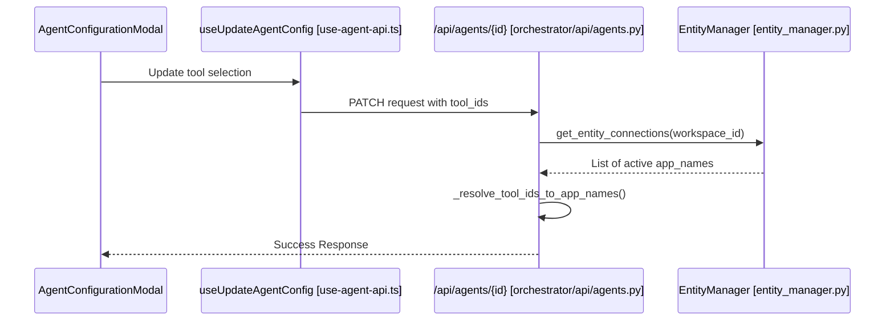

# Agent Configuration

<details>
<summary>Relevant source files</summary>

The following files were used as context for generating this wiki page:

- [frontend/components/agents/agent-configuration-modal.tsx](frontend/components/agents/agent-configuration-modal.tsx)
- [frontend/components/agents/agent-configuration.tsx](frontend/components/agents/agent-configuration.tsx)
- [frontend/components/agents/agent-details-modal.tsx](frontend/components/agents/agent-details-modal.tsx)
- [frontend/components/agents/agent-performance.tsx](frontend/components/agents/agent-performance.tsx)
- [frontend/components/agents/agent-roster.tsx](frontend/components/agents/agent-roster.tsx)
- [frontend/components/agents/agent-skills.tsx](frontend/components/agents/agent-skills.tsx)
- [frontend/components/agents/agent-status-control-modal.tsx](frontend/components/agents/agent-status-control-modal.tsx)
- [frontend/components/agents/create-agent-modal.tsx](frontend/components/agents/create-agent-modal.tsx)
- [frontend/components/agents/create-skill-modal.tsx](frontend/components/agents/create-skill-modal.tsx)
- [frontend/components/agents/model-selector.tsx](frontend/components/agents/model-selector.tsx)
- [frontend/components/agents/skill-configuration-modal.tsx](frontend/components/agents/skill-configuration-modal.tsx)
- [frontend/hooks/use-agent-api.ts](frontend/hooks/use-agent-api.ts)
- [frontend/hooks/use-model-api.ts](frontend/hooks/use-model-api.ts)
- [frontend/lib/agent-constants.ts](frontend/lib/agent-constants.ts)
- [orchestrator/alembic/versions/add_job_title_to_agents.py](orchestrator/alembic/versions/add_job_title_to_agents.py)
- [orchestrator/alembic/versions/prd140_permission_bypass_log.py](orchestrator/alembic/versions/prd140_permission_bypass_log.py)
- [orchestrator/alembic/versions/prd140_team_lead_enabled.py](orchestrator/alembic/versions/prd140_team_lead_enabled.py)
- [orchestrator/api/agent_endpoints.py](orchestrator/api/agent_endpoints.py)
- [orchestrator/api/agents.py](orchestrator/api/agents.py)
- [orchestrator/core/models/__init__.py](orchestrator/core/models/__init__.py)
- [orchestrator/core/models/core.py](orchestrator/core/models/core.py)
- [orchestrator/core/security/__init__.py](orchestrator/core/security/__init__.py)
- [orchestrator/core/security/bypass_audit.py](orchestrator/core/security/bypass_audit.py)
- [orchestrator/core/security/hierarchy_permissions.py](orchestrator/core/security/hierarchy_permissions.py)
- [orchestrator/core/security/url_validator.py](orchestrator/core/security/url_validator.py)
- [orchestrator/core/services/auto_cadence.py](orchestrator/core/services/auto_cadence.py)
- [orchestrator/modules/tools/execution/exec_platform.py](orchestrator/modules/tools/execution/exec_platform.py)
- [orchestrator/scripts/check_hierarchy_gate.py](orchestrator/scripts/check_hierarchy_gate.py)
- [orchestrator/tests/security/test_hierarchy_permissions.py](orchestrator/tests/security/test_hierarchy_permissions.py)

</details>


## Purpose and Scope

Agent configuration in Automatos AI encompasses operational settings, resource allocations, behavioral parameters, and organizational hierarchy (`reports_to` relationships and team lead roles) that define how an AI agent functions within a workspace [orchestrator/core/models/core.py:175-220](). This includes model selection via the **Model Configuration** system, capability management through **Skills** and **Plugins**, and hierarchical permissions governed by `core/security/hierarchy_permissions.py` [orchestrator/core/security/hierarchy_permissions.py:1-36](). Configuration is managed via the `AgentConfigurationModal` in the frontend and persisted in the `agents` table columns in the backend [frontend/components/agents/agent-configuration-modal.tsx:73-94]().

Sources: `[orchestrator/core/models/core.py:175-220]`, `[orchestrator/core/security/hierarchy_permissions.py:1-36]`, `[frontend/components/agents/agent-configuration-modal.tsx:73-94]()`

---

## Configuration Architecture

Agent configuration bridges high-level user intent with low-level LLM parameters, capability assignments, and security boundaries.

### Data Flow and Entity Mapping

The following diagram illustrates the flow of configuration data from the UI components to the database entities.

Title: "Agent Configuration Data Flow"
```mermaid
graph TD
    subgraph "Frontend_Components"
        ACM["AgentConfigurationModal [agent-configuration-modal.tsx]"]
        MS["ModelSelector [model-selector.tsx]"]
        Hook["useUpdateAgentConfig [use-agent-api.ts]"]
    end

    subgraph "Backend_Services"
        Router["AgentRouter [/api/agents] [orchestrator/api/agents.py]"]
        Model["AgentModel [core/models/core.py]"]
        SkillsTable["agent_skills [core/models/core.py]"]
    end

    ACM --> Hook
    Hook -->|PATCH /api/agents/{id}| Router
    Router -->|Update configuration/model_config| Model
    ACM -->|Skill Assignment| SkillsTable
    MS -->|Update model_config| Router
```
Sources: `[frontend/components/agents/agent-configuration-modal.tsx:111-120]()`, `[frontend/hooks/use-agent-api.ts:42-43]()`, `[orchestrator/core/models/core.py:175-220]()`, `[orchestrator/api/agents.py:33-35]()`

---

## Hierarchy, Reporting Lines & Team Lead Controls (PRD-140)

Automatos AI organizes agents into structural reporting lines using `reports_to_id` and team lead privileges. The security and hierarchy system dictates which actor may modify subordinate agents or tasks.

### Hierarchy & Authorization Guard (`can_actor_modify`)

The permission engine in `core/security/hierarchy_permissions.py` validates whether an executing actor agent has authority over a target agent or resource [orchestrator/core/security/hierarchy_permissions.py:112-127]().

- **Actor Gate**: Anonymous, cross-workspace, or inactive actors are immediately denied [orchestrator/core/security/hierarchy_permissions.py:131-150]().
- **System Bypass**: Narrowed system bypass checks `is_system_agent` and verifies the name against `SYSTEM_BYPASS_ALLOWLIST` (e.g., `"Auto"`, `"Auto CTO"`, `"HARNESS"`) [orchestrator/core/security/hierarchy_permissions.py:151-157]().
- **Subtree Scoping**: Non-system actors are restricted to modifying agents within their reporting subtree (`reports_to_id` traversal up to `MAX_SUBTREE_DEPTH`) [orchestrator/core/security/hierarchy_permissions.py:76-79]().

### Natural Language to Code Entity Space: Hierarchy Enforcement

Title: "Hierarchy Enforcement Mapping"

Sources: `[orchestrator/core/security/hierarchy_permissions.py:68-157]`, `[orchestrator/core/models/core.py:175-220]()`

---

## Configuration Modal Tabs

The `AgentConfigurationModal` organizes agent settings into structured operational tabs [frontend/components/agents/agent-configuration-modal.tsx:105-175]().

### 1. General Settings
- **Name & Description**: Basic identification strings [orchestrator/core/models/core.py:180-182]().
- **Agent Type/Category**: Mapped via `CATEGORY_TO_DB_MAP` to internal types [frontend/lib/agent-constants.ts:48-65]().
- **Status**: Controls lifecycle state (`active`, `idle`, `maintenance`) [frontend/components/agents/agent-roster.tsx:164-168]().
- **Tags & Runtime**: Comma-separated tag normalization and runtime configuration validation via `_reject_invalid_runtime` [orchestrator/api/agents.py:36-52]().

### 2. Model Configuration (PRD-15)
Managed via `ModelSelector`, defining the LLM provider, model ID, temperature, and context window limits [orchestrator/core/models/core.py:55-83]().

### 3. Resources & Priority
- **Priority Level**: Options include `low`, `medium`, `high`, and `critical` [orchestrator/core/models/core.py:22-26]().
- **Max Concurrent Tasks & Resource Limits**: Enforces execution caps (`memory_mb`, `cpu_percent`) [frontend/components/agents/agent-configuration-modal.tsx:81-89]().

### 4. Skills, Plugins & Tools
- **Skills**: Granular abilities mapped via `agent_skills` with individual priority weights [orchestrator/core/models/core.py:31-36]().
- **Plugins**: Workspace-enabled integrations assigned through `AgentAssignedPlugin` [orchestrator/api/agents.py:15-16]().
- **Tools**: Resolved via `_resolve_tool_ids_to_app_names` using `EntityManager` validation [orchestrator/api/agents.py:139-167]().

Title: "Tool Assignment Sequence"

Sources: `[frontend/components/agents/agent-configuration-modal.tsx:73-175]`, `[orchestrator/api/agents.py:36-167]`, `[orchestrator/core/models/core.py:22-83]()`

---

## Semantic Re-indexing & Persistence

When agent metadata changes, backend hooks trigger fire-and-forget background embedding updates via `_reindex_agent_embedding` [orchestrator/api/agents.py:58-86](). Frontend mutations utilize React Query (`useAgentConfig`, `useUpdateAgentConfig`) with `formInitializedRef` safeguards to prevent background polling synchronization overwrites [frontend/hooks/use-agent-api.ts:77-218](), `[frontend/components/agents/agent-configuration-modal.tsx:180-192]()`.

Sources: `[orchestrator/api/agents.py:58-86]`, `[frontend/hooks/use-agent-api.ts:77-218]`, `[frontend/components/agents/agent-configuration-modal.tsx:180-192]()`

---