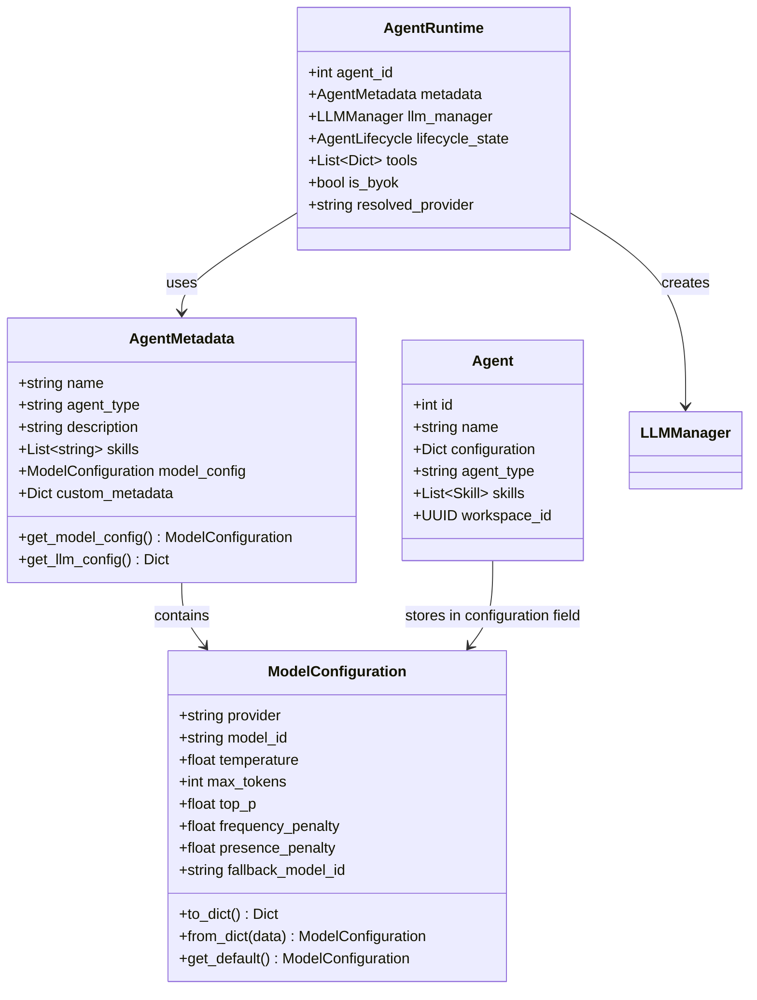
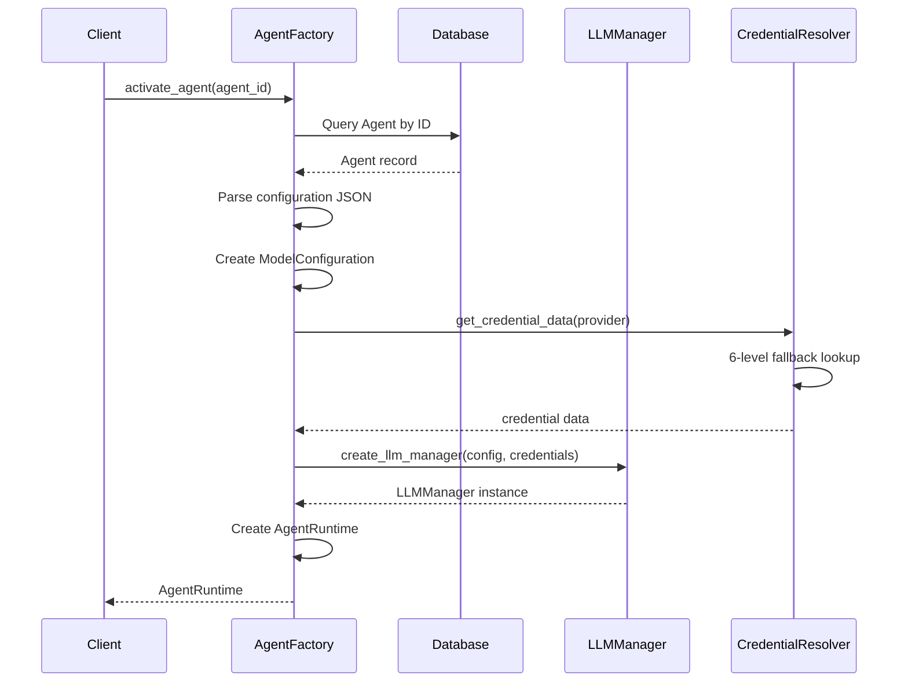
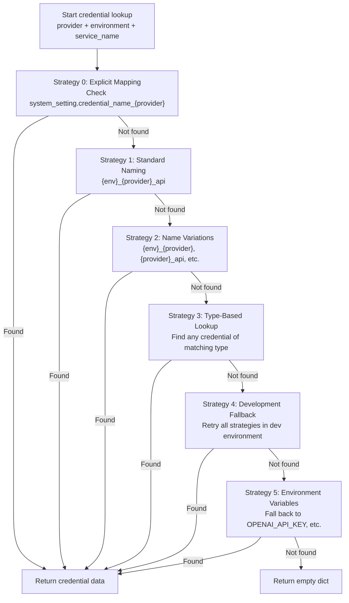
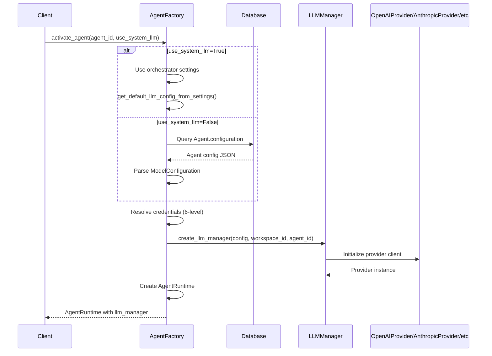

# Agent Configuration

<details>
<summary>Relevant source files</summary>

The following files were used as context for generating this wiki page:

- [frontend/tsconfig.tsbuildinfo](frontend/tsconfig.tsbuildinfo)
- [orchestrator/api/workflows.py](orchestrator/api/workflows.py)
- [orchestrator/consumers/chatbot/service.py](orchestrator/consumers/chatbot/service.py)
- [orchestrator/core/llm/manager.py](orchestrator/core/llm/manager.py)
- [orchestrator/modules/agents/factory/agent_factory.py](orchestrator/modules/agents/factory/agent_factory.py)
- [orchestrator/modules/orchestrator/pipeline.py](orchestrator/modules/orchestrator/pipeline.py)
- [orchestrator/modules/orchestrator/service.py](orchestrator/modules/orchestrator/service.py)

</details>


## Purpose and Scope

This page documents the configuration options available for agents in Automatos AI, including model settings, generation parameters, credential resolution, and advanced options. Agent configuration determines which LLM provider and model an agent uses, how it generates responses, and how credentials are resolved at runtime.

For information about creating agents, see [Creating Agents](#3.1). For persona and communication style configuration, see [Agent Personas](#3.3). For plugin and skill assignment, see [Agent Plugins & Skills](#3.4). For internal factory implementation details, see [Agent Factory & Runtime](#3.5).

---

## Configuration Architecture

Agent configuration is represented by two primary data structures: `ModelConfiguration` for LLM-specific settings and `AgentMetadata` for agent identity and behavior.

### Configuration Data Model



**Sources:** [orchestrator/modules/agents/factory/agent_factory.py:322-448]()

---

## Model Configuration

The `ModelConfiguration` class encapsulates all LLM-specific settings for an agent. This was introduced in PRD-15 to support multi-model configurations and replace deprecated single-field settings.

### Configuration Fields

| Field | Type | Default | Description |
|-------|------|---------|-------------|
| `provider` | string | required | LLM provider (`openai`, `anthropic`, `google`, `azure`, `huggingface`, `aws_bedrock`, `grok`, `openrouter`) |
| `model_id` | string | required | Model identifier (e.g., `gpt-4o`, `claude-3-5-sonnet-20241022`) |
| `temperature` | float | 0.7 | Sampling temperature (0.0 = deterministic, 2.0 = very random) |
| `max_tokens` | int | 2000 | Maximum tokens to generate in response |
| `top_p` | float | 1.0 | Nucleus sampling threshold |
| `frequency_penalty` | float | 0.0 | Penalty for token frequency (reduces repetition) |
| `presence_penalty` | float | 0.0 | Penalty for token presence (encourages diversity) |
| `fallback_model_id` | string | None | Optional fallback model if primary fails |

### Provider-Specific Considerations

**OpenAI:**
- Supports `organization_id` for multi-org accounts
- Base URL can be customized for proxies or alternative endpoints

**Anthropic:**
- Supports custom `base_url` for enterprise deployments
- Model IDs follow format `claude-{version}-{size}-{date}`

**Azure OpenAI:**
- Requires `endpoint_url` in credential (e.g., `https://your-resource.openai.azure.com`)
- Model deployments must match configured names

**AWS Bedrock:**
- Region stored in `base_url` field for compatibility
- Supports new API Key method (single key) or legacy IAM (access key + secret)

**HuggingFace:**
- Uses `api_token` instead of `api_key` in credentials
- Model IDs follow format `{org}/{model-name}`

**Grok (xAI):**
- Provider value is `grok`
- Credential type is `xai_api`

**OpenRouter:**
- Supports any model available on OpenRouter
- Model IDs use slash format (e.g., `meta-llama/llama-3.1-70b-instruct`)

**Sources:** [orchestrator/modules/agents/factory/agent_factory.py:322-374](), [orchestrator/core/llm/manager.py:355-564]()

---

## Agent Metadata

`AgentMetadata` defines the agent's identity, behavior, and capabilities. It wraps `ModelConfiguration` and adds agent-specific fields.

### Metadata Fields

| Field | Type | Description |
|-------|------|-------------|
| `name` | string | Agent display name |
| `agent_type` | string | User-defined type (e.g., `financial_analyst`, `code_reviewer`) |
| `description` | string | Agent description and purpose |
| `skills` | List[string] | Semantic skill tags for routing |
| `model_config` | ModelConfiguration | LLM configuration object |
| `custom_metadata` | Dict | Arbitrary user-defined metadata |

### Backward Compatibility

The following deprecated fields are maintained for backward compatibility but should not be used in new code:

- `preferred_model` → use `model_config.model_id`
- `temperature` → use `model_config.temperature`
- `max_tokens` → use `model_config.max_tokens`
- `context_window` → calculated from LLM models registry

The `get_model_config()` method provides automatic fallback handling:

1. Use `model_config` if present (new format)
2. Fall back to deprecated fields if present (backward compat)
3. Use default configuration as last resort

**Sources:** [orchestrator/modules/agents/factory/agent_factory.py:376-448]()

---

## Configuration Storage and Retrieval

### Database Storage

Agent configuration is stored in the `Agent` model's `configuration` JSONB field. The field contains the serialized `ModelConfiguration`:

```json
{
  "provider": "openai",
  "model_id": "gpt-4o",
  "temperature": 0.7,
  "max_tokens": 2000,
  "top_p": 1.0,
  "frequency_penalty": 0.0,
  "presence_penalty": 0.0,
  "fallback_model_id": null
}
```

### Configuration Loading Flow



### Configuration Priority

When creating an agent runtime, configuration sources are prioritized as follows:

1. **Agent-specific configuration** (from `Agent.configuration` field)
2. **System settings** (from `SystemSetting` table if agent config missing)
3. **Environment variables** (fallback if system settings unavailable)
4. **Default values** (hardcoded defaults as last resort)

**Sources:** [orchestrator/modules/agents/factory/agent_factory.py:676-850](), [orchestrator/core/llm/manager.py:426-564]()

---

## Credential Resolution

Credential resolution uses a sophisticated 6-level fallback strategy to find API keys for LLM providers. This ensures maximum flexibility while maintaining security.

### Resolution Strategy



### Strategy Details

**Strategy 0: Explicit Mapping (MVP)**
- Checks system setting: `{category}.credential_name_{provider}`
- Example: `orchestrator_llm.credential_name_openai = "production_openai_api"`
- Highest priority for user control

**Strategy 1: Standard Naming Pattern**
- Tries: `{environment}_{provider}_api`
- Example: `production_openai_api`

**Strategy 2: Name Variations**
- Tries multiple naming conventions:
  - `{environment}_{provider}` (without `_api` suffix)
  - `{provider}_api` (environment-agnostic)
  - `{provider}` (provider name only)
  - Case variations (lowercase, capitalized, title case)
- Special handling for HuggingFace case variations

**Strategy 3: Type-Based Lookup**
- Finds any active credential of matching type in environment
- Maps provider names to credential types:
  - `openai` → `openai_api`
  - `anthropic` → `anthropic_api`
  - `grok` → `xai_api`
  - `bedrock` → `aws_bedrock_api`

**Strategy 4: Development Fallback**
- If current environment is not `development`, retries all strategies in `development` environment
- Useful for local development with dev-only credentials

**Strategy 5: Environment Variable Fallback**
- Reads from environment variables:
  - `OPENAI_API_KEY`
  - `ANTHROPIC_API_KEY`
  - `XAI_API_KEY`
  - `AWS_ACCESS_KEY_ID` (for Bedrock)
- Note: HuggingFace does NOT fall back to env vars (requires credential store)

### BYOK vs Platform Keys

Agents can use either Bring Your Own Key (BYOK) or platform-provided keys:

| Aspect | BYOK | Platform Keys |
|--------|------|---------------|
| Storage | User's credential store | Platform credential store |
| Resolution | Per-workspace credentials | Shared platform credentials |
| Cost | User's API bills | Platform's API bills |
| Usage tracking | Tagged with `is_byok=true` | Tagged with `is_byok=false` |
| Credential name | User-defined | Follows naming conventions |

The `AgentRuntime` tracks which key type was used via the `is_byok` field.

**Sources:** [orchestrator/core/llm/manager.py:123-353](), [orchestrator/modules/agents/factory/agent_factory.py:755-850]()

---

## Generation Parameters

### Temperature

Controls randomness in token selection:

- **0.0**: Deterministic (always picks highest probability token)
- **0.3-0.5**: Low randomness (good for factual tasks)
- **0.7**: Balanced (default, good for most tasks)
- **1.0**: High randomness (creative tasks)
- **1.5-2.0**: Very random (experimental, brainstorming)

### Max Tokens

Maximum length of generated response:

- **Context window limits**: Different models have different limits
  - `gpt-4o`: 128,000 tokens context, 16,384 output
  - `claude-3-5-sonnet`: 200,000 tokens context, 8,192 output
  - `gemini-pro`: 32,768 tokens context, 8,192 output
- **Cost considerations**: More tokens = higher cost
- **Response quality**: Too low may truncate responses

### Top-P (Nucleus Sampling)

Alternative to temperature for controlling randomness:

- **1.0**: Consider all tokens (no filtering)
- **0.9**: Consider top 90% probability mass
- **0.5**: Consider top 50% probability mass
- Recommended to use either temperature OR top_p, not both

### Frequency and Presence Penalties

Reduce repetition in responses:

- **Frequency penalty**: Penalizes tokens based on frequency in text so far
  - Range: 0.0 to 2.0
  - Higher values = less repetition
- **Presence penalty**: Penalizes tokens based on presence in text so far
  - Range: 0.0 to 2.0
  - Higher values = more topic diversity

**Sources:** [orchestrator/modules/agents/factory/agent_factory.py:322-374]()

---

## Configuration at Runtime

### Agent Activation Flow



### System LLM Override

The `use_system_llm` parameter allows bypassing agent-specific configuration:

- **`use_system_llm=False`** (default): Uses agent's configured model
- **`use_system_llm=True`**: Uses orchestrator system settings
  - Reads from `system_settings` table category `orchestrator_llm`
  - Keys: `llm_provider`, `llm_model`, `temperature`, `max_tokens`
  - Falls back to environment variables if settings missing

This is useful for:
- Testing all agents with same model
- Cost control (use cheaper model temporarily)
- Provider outages (switch all agents to backup provider)

**Sources:** [orchestrator/modules/agents/factory/agent_factory.py:493-850](), [orchestrator/consumers/chatbot/service.py:493-554]()

---

## Advanced Configuration Options

### Custom Metadata

The `custom_metadata` field allows storing arbitrary agent-specific data:

```python
metadata = AgentMetadata(
    name="Financial Analyst",
    agent_type="finance",
    custom_metadata={
        "specialization": "portfolio_management",
        "risk_tolerance": "moderate",
        "reporting_format": "markdown_tables",
        "data_sources": ["yahoo_finance", "alphavantage"],
        "update_frequency": "daily"
    }
)
```

Custom metadata is:
- Stored in agent's `configuration` field
- Not validated by the system
- Available to agent execution logic
- Useful for domain-specific extensions

### Fallback Model Configuration

The `fallback_model_id` field enables automatic model failover:

```python
model_config = ModelConfiguration(
    provider="openrouter",
    model_id="anthropic/claude-3.5-sonnet",
    fallback_model_id="meta-llama/llama-3.1-70b-instruct"
)
```

When the primary model fails with a "dead model" error (404, "no endpoints found", "model not found"), the LLM Manager automatically retries with the fallback model. The response is tagged with `_used_fallback=True` to alert callers.

If no fallback is configured, the system uses provider-specific defaults:

| Provider | Default Fallback |
|----------|------------------|
| OpenRouter | `meta-llama/llama-3.1-70b-instruct` |
| OpenAI | `gpt-4o-mini` |
| Anthropic | `claude-3-5-haiku-20241022` |
| Google | `gemini-2.0-flash` |
| Azure | `gpt-4o-mini` |
| Grok | `grok-2-latest` |

**Sources:** [orchestrator/core/llm/manager.py:566-691](), [orchestrator/modules/agents/factory/agent_factory.py:322-374]()

---

## Configuration Examples

### Example 1: OpenAI GPT-4o Agent

```python
from modules.agents.factory.agent_factory import ModelConfiguration, AgentMetadata

model_config = ModelConfiguration(
    provider="openai",
    model_id="gpt-4o",
    temperature=0.7,
    max_tokens=4000,
    top_p=1.0,
    frequency_penalty=0.0,
    presence_penalty=0.0
)

metadata = AgentMetadata(
    name="Code Review Assistant",
    agent_type="code_reviewer",
    description="Reviews pull requests for code quality and best practices",
    skills=["code_analysis", "best_practices", "security_review"],
    model_config=model_config
)
```

### Example 2: Anthropic Claude with Fallback

```python
model_config = ModelConfiguration(
    provider="anthropic",
    model_id="claude-3-5-sonnet-20241022",
    temperature=0.5,
    max_tokens=8000,
    fallback_model_id="claude-3-5-haiku-20241022"  # Fallback to cheaper model
)

metadata = AgentMetadata(
    name="Research Assistant",
    agent_type="researcher",
    description="Conducts comprehensive research on technical topics",
    skills=["research", "synthesis", "citation"],
    model_config=model_config
)
```

### Example 3: Multi-Provider Setup with OpenRouter

```python
model_config = ModelConfiguration(
    provider="openrouter",
    model_id="anthropic/claude-3.5-sonnet",  # Route through OpenRouter
    temperature=0.8,
    max_tokens=2000
)

metadata = AgentMetadata(
    name="Creative Writer",
    agent_type="content_creator",
    description="Generates creative marketing content",
    skills=["copywriting", "storytelling", "persuasion"],
    model_config=model_config,
    custom_metadata={
        "brand_voice": "friendly_professional",
        "target_audience": "developers",
        "content_types": ["blog_posts", "social_media", "email"]
    }
)
```

### Example 4: Legacy Format (Backward Compatible)

```python
# Old format still supported
metadata = AgentMetadata(
    name="Legacy Agent",
    agent_type="generic",
    preferred_model="gpt-4",  # Deprecated but still works
    temperature=0.7,          # Deprecated but still works
    max_tokens=2000           # Deprecated but still works
)

# Automatically converted via get_model_config()
config = metadata.get_model_config()
# Returns ModelConfiguration with provider="openai", model_id="gpt-4"
```

**Sources:** [orchestrator/modules/agents/factory/agent_factory.py:322-448]()

---

## Configuration Best Practices

### Model Selection

- **Start with mid-tier models**: GPT-4o, Claude 3.5 Sonnet, Gemini 1.5 Pro
- **Use mini/haiku variants for simple tasks**: Cost optimization
- **Set fallback models**: Prevent complete failures
- **Test with multiple providers**: Avoid vendor lock-in

### Temperature Tuning

- **Factual tasks**: 0.3-0.5 (low randomness)
- **Balanced tasks**: 0.7 (default)
- **Creative tasks**: 0.9-1.2 (high randomness)
- **Never use**: 0.0 in production (too deterministic, boring responses)

### Token Limits

- **Set conservative limits**: Prevents runaway costs
- **Account for context**: max_tokens is OUTPUT only, not total
- **Monitor usage**: Track token consumption per agent
- **Use compaction**: Enable context window guard for long conversations

### Credential Management

- **Use explicit mappings**: Set `orchestrator_llm.credential_name_openai` in system settings
- **Avoid environment variables**: Use credential store instead
- **Separate environments**: Different credentials for dev/staging/prod
- **Rotate keys regularly**: Update credentials without code changes

### Configuration Updates

- **Version configurations**: Store old configs before updates
- **Test changes**: Verify in development before production
- **Monitor metrics**: Track success rate after config changes
- **Rollback plan**: Keep previous working configuration available

**Sources:** [orchestrator/modules/agents/factory/agent_factory.py:500-850](), [orchestrator/core/llm/manager.py:355-728]()

---