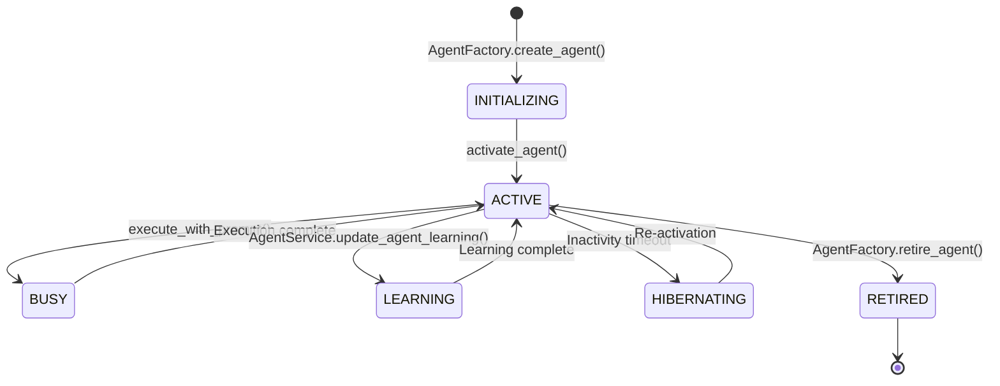
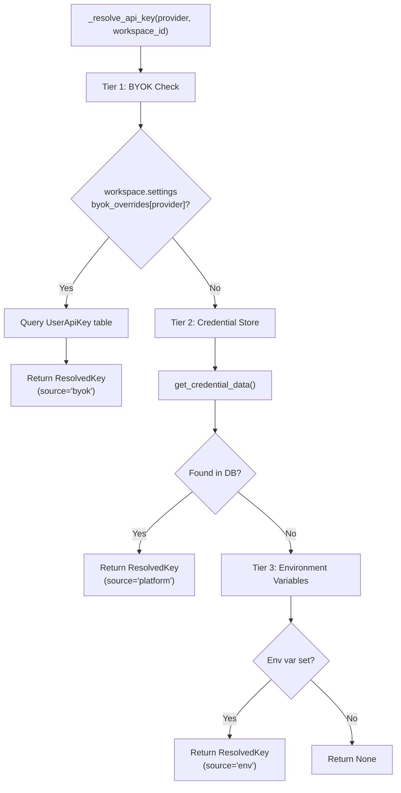
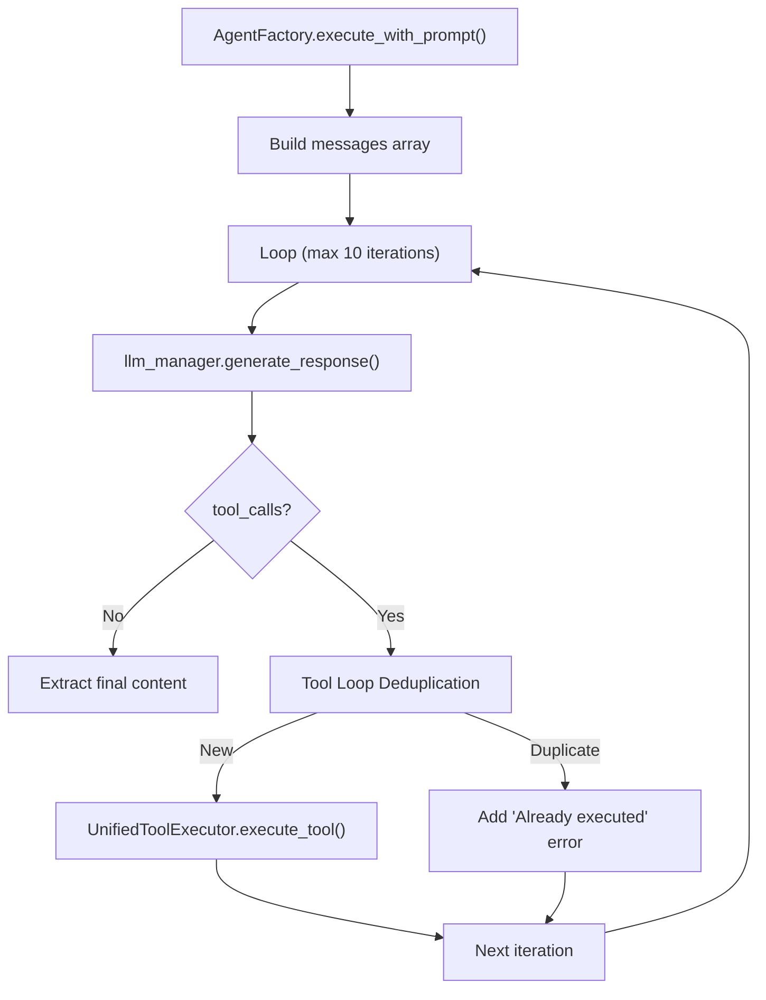
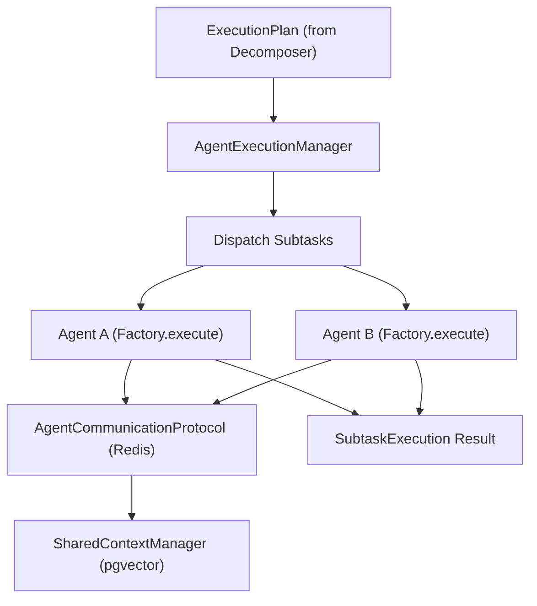

# Agent Factory & Runtime

<details>
<summary>Relevant source files</summary>

The following files were used as context for generating this wiki page:

- [frontend/app/api/chat/route.ts](frontend/app/api/chat/route.ts)
- [frontend/components/chatbot/chat.tsx](frontend/components/chatbot/chat.tsx)
- [frontend/components/chatbot/mission-suggestion-card.tsx](frontend/components/chatbot/mission-suggestion-card.tsx)
- [frontend/lib/chat/hooks.ts](frontend/lib/chat/hooks.ts)
- [frontend/stores/mission-store.ts](frontend/stores/mission-store.ts)
- [orchestrator/api/chat.py](orchestrator/api/chat.py)
- [orchestrator/api/recipe_executor.py](orchestrator/api/recipe_executor.py)
- [orchestrator/consumers/chatbot/service.py](orchestrator/consumers/chatbot/service.py)
- [orchestrator/modules/agents/factory/agent_factory.py](orchestrator/modules/agents/factory/agent_factory.py)

</details>


This document covers the **AgentFactory** system, which manages the complete lifecycle of agent instances from creation to execution. It handles LLM provider configuration, tool loading, and the execution loop that processes user prompts with tool calling support.

**Related pages:**
- For agent creation UI flows, see [Creating Agents](5.1)
- For agent configuration options, see [Agent Configuration](5.2)
- For LLM provider and credential management details, see [LLM Provider Management](5.6)
- For tool discovery and routing, see [Tools API Reference](8.7)

---

## Overview

**AgentFactory** is the core runtime execution engine for agents. It provides a pure execution layer where users define their own agent types while the orchestrator handles prompt engineering using Context Engineering [orchestrator/modules/agents/factory/agent_factory.py:1-11]().

| Capability | Description |
|------------|-------------|
| **Lifecycle Management** | Create, activate, hibernate, and retire agent instances via the `AgentLifecycle` enum [orchestrator/modules/agents/factory/agent_factory.py:51-58]() |
| **LLM Configuration** | 3-tier API key resolution (BYOK → credential store → env vars) [orchestrator/modules/agents/factory/agent_factory.py:146-153]() |
| **Tool Integration** | Unified tool execution via `UnifiedToolExecutor` with single-source tool schemas [orchestrator/modules/agents/factory/agent_factory.py:42-45]() |
| **Prompt Assembly** | System prompt building from persona + plugins + skills [orchestrator/modules/agents/factory/agent_factory.py:117-142]() |
| **Execution Loop** | Multi-iteration tool loop (max 10) with deduplication and loop prevention [orchestrator/modules/agents/factory/agent_factory.py:284-305]() |
| **Metrics Tracking** | Token usage, execution counts, success rates, and avg execution time [orchestrator/modules/agents/factory/agent_factory.py:173-190]() |

The factory maintains a registry of **active agents** (`Dict[int, AgentRuntime]`) in memory for fast execution without repeated database queries [orchestrator/modules/agents/factory/agent_factory.py:202-205]().

**Sources:** [orchestrator/modules/agents/factory/agent_factory.py:1-50](), [orchestrator/modules/agents/factory/agent_factory.py:155-192]()

---

## Agent Lifecycle States

Agents transition through well-defined lifecycle states managed by the `AgentLifecycle` enum [orchestrator/modules/agents/factory/agent_factory.py:51-58]():

Title: Agent Lifecycle State Machine


### Lifecycle State Definitions

| State | Description | Triggers |
|-------|-------------|----------|
| `INITIALIZING` | Agent being created, LLM verification in progress | `create_agent()` called [orchestrator/modules/agents/factory/agent_factory.py:52]() |
| `ACTIVE` | Ready to accept tasks | `activate_agent()` completed [orchestrator/modules/agents/factory/agent_factory.py:53]() |
| `BUSY` | Currently executing a task | `execute_with_prompt()` running [orchestrator/modules/agents/factory/agent_factory.py:54]() |
| `LEARNING` | Undergoing training or optimization | Feedback loop or optimization job [orchestrator/modules/agents/factory/agent_factory.py:55]() |
| `HIBERNATING` | Inactive but preserved in memory | Configurable inactivity timeout [orchestrator/modules/agents/factory/agent_factory.py:56]() |
| `RETIRED` | Permanently deactivated | Manual retirement [orchestrator/modules/agents/factory/agent_factory.py:57]() |

**Sources:** [orchestrator/modules/agents/factory/agent_factory.py:51-59]()

---

## Core Data Structures

### ModelConfiguration

Complete LLM configuration for an agent, supporting per-agent model overrides (PRD-15) [orchestrator/modules/agents/factory/agent_factory.py:61-62]():

```python
@dataclass
class ModelConfiguration:
    provider: str              # "openai", "anthropic", "google", etc.
    model_id: str             # e.g., "gpt-4", "claude-3-opus-20240229"
    temperature: float = 0.7
    max_tokens: int = 2000
    top_p: float = 1.0
    frequency_penalty: float = 0.0
    presence_penalty: float = 0.0
    fallback_model_id: Optional[str] = None  # Automatic fallback on failure
```

**Sources:** [orchestrator/modules/agents/factory/agent_factory.py:61-101]()

---

### AgentRuntime

Runtime representation of an active agent, cached in memory [orchestrator/modules/agents/factory/agent_factory.py:158-159]():

```python
@dataclass
class AgentRuntime:
    agent_id: int
    metadata: AgentMetadata
    llm_manager: LLMManager                    # Pre-configured LLM client
    lifecycle_state: AgentLifecycle
    execution_count: int = 0
    total_tokens_used: int = 0
    last_execution: Optional[datetime] = None
    performance_metrics: Dict[str, Any] = {}   # avg_execution_time, success_rate
    tools: List[Dict[str, Any]] = []           # Composio app assignments
    tool_executor: Any = None                  # UnifiedToolExecutor instance
    is_byok: bool = False                      # Using workspace's own API key
    resolved_provider: str = ""
    workspace_id: Optional[Any] = None
```

**Sources:** [orchestrator/modules/agents/factory/agent_factory.py:158-175]()

---

## Agent Creation & Activation

### create_agent() flow

Title: Agent Creation Process


### LLM Configuration Resolution

The factory follows this priority order for LLM configuration:
1. **Agent's `model_config`**: If the agent has an explicit model defined in its metadata [orchestrator/modules/agents/factory/agent_factory.py:119-134]().
2. **System settings**: Fetched via `SystemSetting` table for categories like `orchestrator_llm` [orchestrator/core/seeds/seed_system_settings.py:230-245]().
3. **Config defaults**: Fallback to `DEFAULT_LLM_PROVIDER` and `DEFAULT_LLM_MODEL` [orchestrator/modules/agents/factory/agent_factory.py:100-101]().

When no credential is found for the selected provider, the factory **automatically falls back to OpenRouter** as a marketplace aggregator if configured [orchestrator/modules/agents/factory/agent_factory.py:125-131]().

**Sources:** [orchestrator/modules/agents/factory/agent_factory.py:61-135](), [orchestrator/core/seeds/seed_system_settings.py:1-50]()

---

## API Key Resolution

### 3-Tier Resolution Strategy

Title: 3-Tier API Key Resolution


The `_resolve_api_key` method ensures that workspaces can provide their own keys (BYOK) or use platform-provided credentials [orchestrator/modules/agents/factory/agent_factory.py:149-155]().

**Sources:** [orchestrator/modules/agents/factory/agent_factory.py:149-156](), [orchestrator/api/workspaces.py:169-180]()

---

## Agent Execution & Tool Loop

### execute_with_prompt()

Executes a task with a multi-iteration tool loop. It utilizes `get_tools_for_agent` as the single source of truth for tool schemas [orchestrator/modules/agents/factory/agent_factory.py:9-11]().

Title: Execution Loop with Tool Deduplication


### Tool Loop Prevention & Deduplication

The execution loop prevents infinite cycles and redundant calls using the `ToolExecutionTracker` [orchestrator/consumers/chatbot/service.py:83-90]().

| Feature | Implementation Detail |
|---------|-----------------------|
| **Iteration Limit** | Hard-capped at 10 iterations to prevent runaway costs [orchestrator/modules/agents/factory/agent_factory.py:284](). |
| **Exact Deduplication** | Hashes `tool_name` + `tool_args` to skip identical executions in the same turn [orchestrator/consumers/chatbot/service.py:163-166](). |
| **Semantic Deduplication** | Uses `SequenceMatcher` to detect similar search queries (threshold 0.75) for search-based tools [orchestrator/consumers/chatbot/service.py:62-71](). |
| **Per-Tool Limits** | Specific limits for tools (e.g., `read_file`: 8, `write_file`: 5) via `TOOL_RETRY_LIMITS` [orchestrator/consumers/chatbot/service.py:98-111](). |

**Sources:** [orchestrator/modules/agents/factory/agent_factory.py:270-320](), [orchestrator/consumers/chatbot/service.py:53-176]()

---

## Multi-Agent Execution Manager

The `AgentExecutionManager` coordinates the execution of subtasks across multiple agents, often resulting from a `RealTaskDecomposer` plan [orchestrator/modules/agents/execution/execution_manager.py:85-95]().

### Subtask Coordination
- **Parallel Execution**: Subtasks with no dependencies are executed in parallel up to `max_parallel_executions` [orchestrator/modules/agents/execution/execution_manager.py:134]().
- **Inter-Agent Communication**: Agents can pass messages and share context using the `AgentCommunicationProtocol` via Redis [orchestrator/modules/agents/communication/inter_agent.py:94-98]().

Title: Multi-Agent Subtask Execution Flow


**Sources:** [orchestrator/modules/agents/execution/execution_manager.py:130-160](), [orchestrator/modules/agents/communication/inter_agent.py:1-50](), [orchestrator/modules/orchestrator/stages/task_decomposer.py:27-50]()

---

## Tool Integration Architecture

### UnifiedToolExecutor

The `UnifiedToolExecutor` routes calls based on tool name patterns [orchestrator/modules/agents/factory/agent_factory.py:42-45]():
- **Platform Actions**: Prefixed with `platform_*`, allowing agents to manage the Automatos system itself (e.g., `platform_create_agent`) [orchestrator/modules/agents/factory/agent_factory.py:10-11]().
- **Composio Actions**: External application integrations managed via `ComposioAppCache` and `AgentAppAssignment` [orchestrator/core/models/composio_cache.py:27-28]().
- **Skill-Based Tools**: Logic defined in `Skill` models assigned to agents [orchestrator/core/models/core.py:24-26]().

**Sources:** [orchestrator/modules/agents/factory/agent_factory.py:1-45](), [orchestrator/core/models/composio_cache.py:1-30]()

---