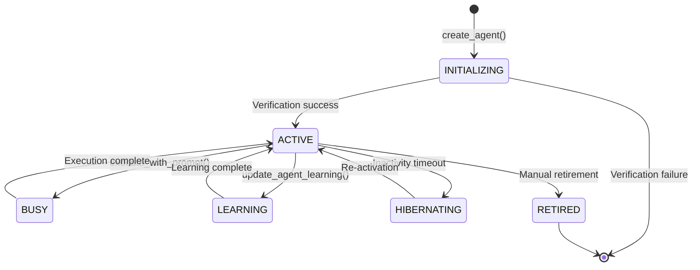
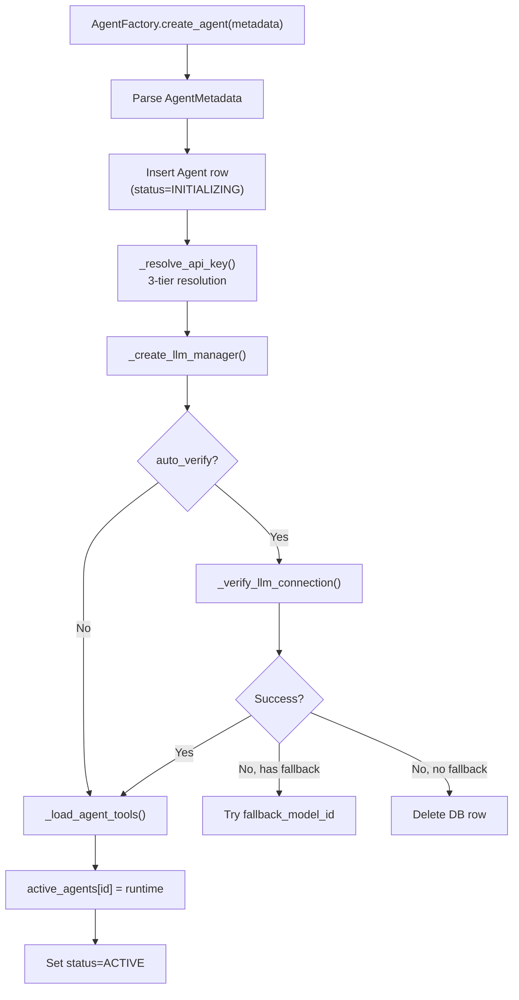
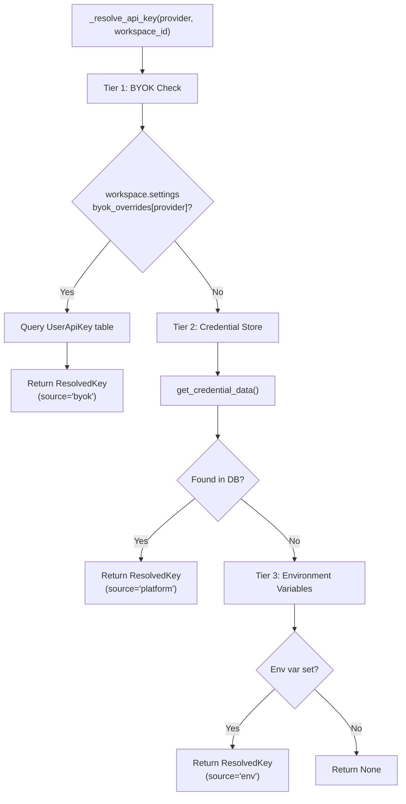
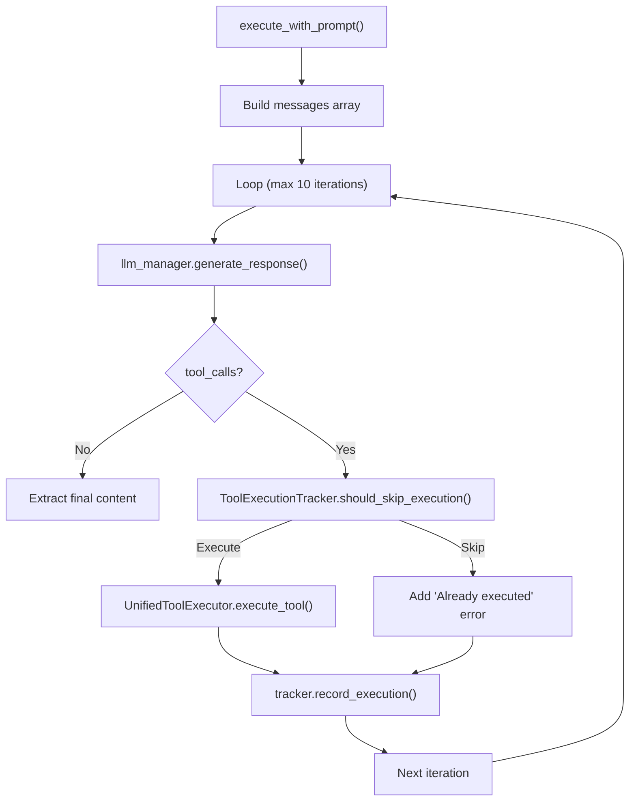
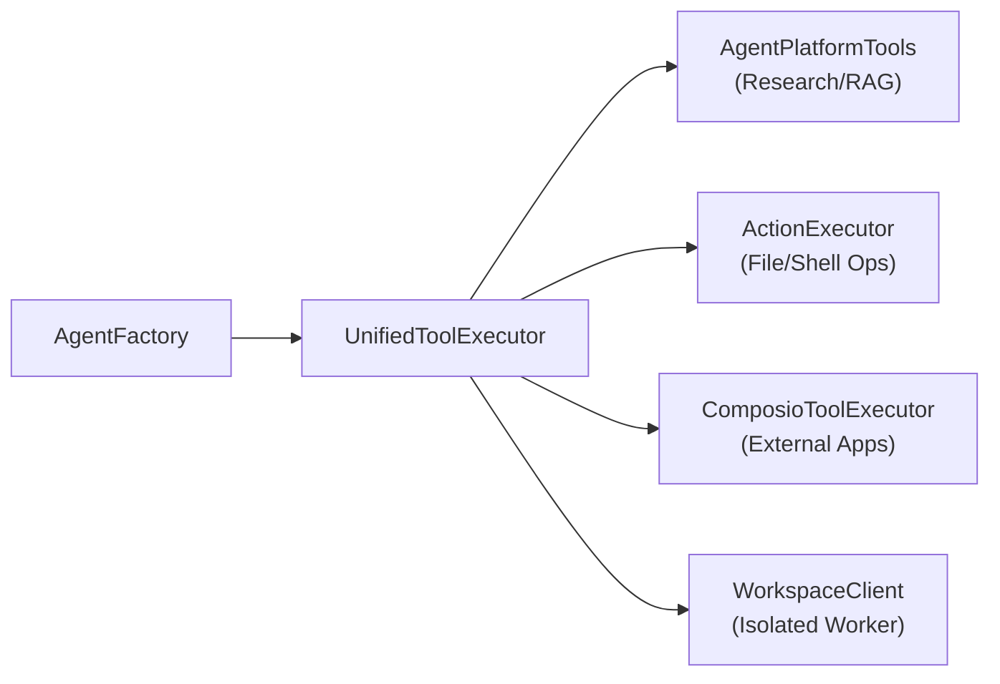

# Agent Factory & Runtime

<details>
<summary>Relevant source files</summary>

The following files were used as context for generating this wiki page:

- [frontend/components/workflows/execution-theater/orchestrator-control.tsx](frontend/components/workflows/execution-theater/orchestrator-control.tsx)
- [frontend/hooks/use-workflow-websocket.ts](frontend/hooks/use-workflow-websocket.ts)
- [orchestrator/api/agent_endpoints.py](orchestrator/api/agent_endpoints.py)
- [orchestrator/api/tools.py](orchestrator/api/tools.py)
- [orchestrator/core/composio/client.py](orchestrator/core/composio/client.py)
- [orchestrator/core/composio/tool_executor.py](orchestrator/core/composio/tool_executor.py)
- [orchestrator/modules/agents/factory/agent_factory.py](orchestrator/modules/agents/factory/agent_factory.py)
- [orchestrator/modules/tools/services/composio_hint_service.py](orchestrator/modules/tools/services/composio_hint_service.py)
- [orchestrator/modules/tools/services/composio_tool_service.py](orchestrator/modules/tools/services/composio_tool_service.py)
- [orchestrator/services/metadata_sync_service.py](orchestrator/services/metadata_sync_service.py)

</details>


This document covers the **AgentFactory** system, which manages the complete lifecycle of agent instances from creation to execution. It handles LLM provider configuration, tool loading, and the execution loop that processes user prompts with tool calling support.

**Related pages:**
- For agent creation UI flows, see [Creating Agents](5.1)
- For agent configuration options, see [Agent Configuration](5.2)
- For LLM provider and credential management details, see [LLM Provider Management](5.6)
- For tool discovery and routing, see [Tools API Reference](8.7)

---

## Overview

**AgentFactory** is the core runtime execution engine for agents. It provides a pure execution layer where users define their own agent types while the orchestrator handles prompt engineering using Context Engineering [orchestrator/modules/agents/factory/agent_factory.py:1-11]().

| Capability | Description |
|------------|-------------|
| **Lifecycle Management** | Create, activate, hibernate, and retire agent instances [orchestrator/modules/agents/factory/agent_factory.py:51-58]() |
| **LLM Configuration** | 3-tier API key resolution (BYOK → credential store → env vars) [orchestrator/modules/agents/factory/agent_factory.py:317-392]() |
| **Tool Integration** | Unified tool execution via `UnifiedToolExecutor` with single-source tool schemas [orchestrator/modules/agents/factory/agent_factory.py:42-45]() |
| **Prompt Assembly** | System prompt building from persona + plugins + skills [orchestrator/modules/agents/factory/agent_factory.py:103-115]() |
| **Execution Loop** | Multi-iteration tool loop (max 10) with deduplication and loop prevention [orchestrator/modules/agents/factory/agent_factory.py:714-720]() |
| **Metrics Tracking** | Token usage, execution counts, success rates, and avg execution time [orchestrator/modules/agents/factory/agent_factory.py:173-190]() |

The factory maintains a registry of **active agents** (`Dict[int, AgentRuntime]`) in memory for fast execution without repeated database queries [orchestrator/modules/agents/factory/agent_factory.py:155-171]().

**Sources:** [orchestrator/modules/agents/factory/agent_factory.py:1-50](), [orchestrator/modules/agents/factory/agent_factory.py:155-192]()

---

## Agent Lifecycle States

Agents transition through well-defined lifecycle states managed by the `AgentLifecycle` enum:

Title: Agent Lifecycle State Machine


### Lifecycle State Definitions

| State | Description | Triggers |
|-------|-------------|----------|
| `INITIALIZING` | Agent being created, LLM verification in progress | `create_agent()` called [orchestrator/modules/agents/factory/agent_factory.py:52]() |
| `ACTIVE` | Ready to accept tasks | Verification passed, `activate_agent()` completed [orchestrator/modules/agents/factory/agent_factory.py:53]() |
| `BUSY` | Currently executing a task | `execute_with_prompt()` running [orchestrator/modules/agents/factory/agent_factory.py:54]() |
| `LEARNING` | Undergoing training or optimization | `update_agent_learning()` feedback loop [orchestrator/api/agent_endpoints.py:161]() |
| `HIBERNATING` | Inactive but preserved in memory | Configurable inactivity timeout [orchestrator/modules/agents/factory/agent_factory.py:56]() |
| `RETIRED` | Permanently deactivated | User action or system cleanup [orchestrator/modules/agents/factory/agent_factory.py:57]() |

**Sources:** [orchestrator/modules/agents/factory/agent_factory.py:51-59](), [orchestrator/api/agent_endpoints.py:40-113](), [orchestrator/api/agent_endpoints.py:116-186]()

---

## Core Data Structures

### ModelConfiguration

Complete LLM configuration for an agent, supporting per-agent model overrides (PRD-15) [orchestrator/modules/agents/factory/agent_factory.py:61-62]():

```python
@dataclass
class ModelConfiguration:
    provider: str              # "openai", "anthropic", "google", etc.
    model_id: str             # e.g., "gpt-4", "claude-3-opus-20240229"
    temperature: float = 0.7
    max_tokens: int = 2000
    top_p: float = 1.0
    frequency_penalty: float = 0.0
    presence_penalty: float = 0.0
    fallback_model_id: Optional[str] = None  # Automatic fallback on failure
```

**Sources:** [orchestrator/modules/agents/factory/agent_factory.py:61-101]()

---

### AgentRuntime

Runtime representation of an active agent, cached in memory [orchestrator/modules/agents/factory/agent_factory.py:155-156]():

```python
@dataclass
class AgentRuntime:
    agent_id: int
    metadata: AgentMetadata
    llm_manager: LLMManager                    # Pre-configured LLM client
    lifecycle_state: AgentLifecycle
    execution_count: int = 0
    total_tokens_used: int = 0
    last_execution: Optional[datetime] = None
    performance_metrics: Dict[str, Any] = {}   # avg_execution_time, success_rate
    tools: List[Dict[str, Any]] = []           # Composio app assignments
    tool_executor: Any = None                  # UnifiedToolExecutor instance
    is_byok: bool = False                      # Using workspace's own API key
    resolved_provider: str = ""
    workspace_id: Optional[Any] = None
```

**Sources:** [orchestrator/modules/agents/factory/agent_factory.py:155-192]()

---

## Agent Creation & Activation

### create_agent() flow

Title: Agent Creation Process


### LLM Configuration Resolution

The factory follows this priority order for LLM configuration:
1. **Agent's `model_config`**: If the agent has an explicit model defined [orchestrator/modules/agents/factory/agent_factory.py:118-132]().
2. **System settings**: Fetched via `get_provider_and_model_from_settings` from the `SystemSetting` table.
3. **Config defaults**: Fallback to `config.py`.

When no credential is found for the selected provider, the factory **automatically falls back to OpenRouter** as a marketplace aggregator [orchestrator/modules/agents/factory/agent_factory.py:610-615]().

**Sources:** [orchestrator/modules/agents/factory/agent_factory.py:467-568]()

---

## API Key Resolution

### 3-Tier Resolution Strategy

Title: 3-Tier API Key Resolution


**Sources:** [orchestrator/modules/agents/factory/agent_factory.py:317-392]()

---

## Agent Execution & Tool Loop

### execute_with_prompt()

Executes a task with a multi-iteration tool loop. It utilizes `get_tools_for_agent` as the single source of truth for tool schemas [orchestrator/modules/agents/factory/agent_factory.py:9-11]().

Title: Execution Loop with Tool Deduplication


### Tool Loop Prevention

The `ToolExecutionTracker` prevents infinite loops by implementing:
1. **Exact deduplication**: Checks if the same tool was called with identical arguments using MD5 hashing [orchestrator/modules/agents/factory/agent_factory.py:780-795]().
2. **Semantic deduplication**: Uses `SequenceMatcher` (75% threshold) to detect similar queries for search tools [orchestrator/core/composio/tool_executor.py:20-21]().
3. **Per-tool iteration limits**: The factory enforces a hard limit of 10 iterations per request [orchestrator/modules/agents/factory/agent_factory.py:714-720]().

**Sources:** [orchestrator/modules/agents/factory/agent_factory.py:714-844](), [orchestrator/core/composio/tool_executor.py:20-21]()

---

## Tool Integration Architecture

### UnifiedToolExecutor

Title: Unified Tool Execution Routing


The `UnifiedToolExecutor` routes calls based on tool name patterns:
- **Composio**: `composio_execute` or dynamic prefixes like `GITHUB_*` [orchestrator/core/composio/tool_executor.py:176-202]().
- **Access Validation**: The `ComposioToolExecutor` validates feature access before execution, checking if an agent has permission for a specific app action [orchestrator/core/composio/tool_executor.py:66-125]().
- **Entity Resolution**: Resolves the workspace ID to a Composio entity for authenticated tool usage [orchestrator/core/composio/tool_executor.py:126-140]().

### Tool Hinting Service
To assist the LLM in selecting the correct tools, the `ComposioHintService` generates system message hints based on the prompt intent [orchestrator/modules/tools/services/composio_hint_service.py:5-21](). It uses a 3-tier strategy:
1. **Capability-based**: Matches taxonomy overlap [orchestrator/modules/tools/services/composio_hint_service.py:162-166]().
2. **Token-filtered**: Uses `ILIKE` matching with a mandatory capability gate [orchestrator/modules/tools/services/composio_hint_service.py:17-18]().
3. **Top-N fallback**: Provides safe default actions per app [orchestrator/modules/tools/services/composio_hint_service.py:15]().

**Sources:** [orchestrator/core/composio/tool_executor.py:30-162](), [orchestrator/core/composio/client.py:54-126](), [orchestrator/modules/tools/services/composio_hint_service.py:89-124]()

---

## Metadata & Cache Sync

The `MetadataSyncService` ensures that the local cache stays in sync with external tool providers (like Composio). It populates:
- `composio_apps_cache`
- `composio_actions_cache`
- `composio_stats_cache` [orchestrator/services/metadata_sync_service.py:1-7]().

This service performs bulk fetches to avoid the N+1 API call problem, grouping actions by app for efficient upserts [orchestrator/services/metadata_sync_service.py:42-47]().

**Sources:** [orchestrator/services/metadata_sync_service.py:37-150](), [orchestrator/api/tools.py:79-173]()

---