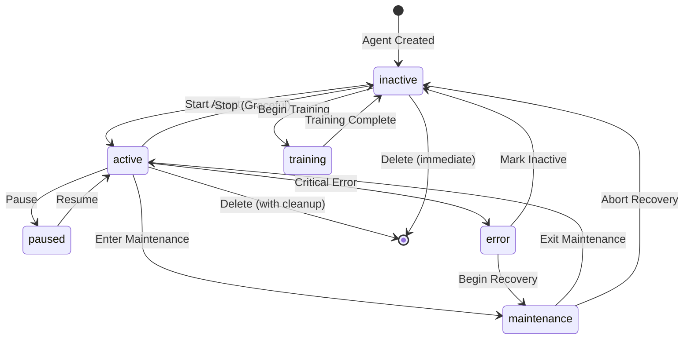
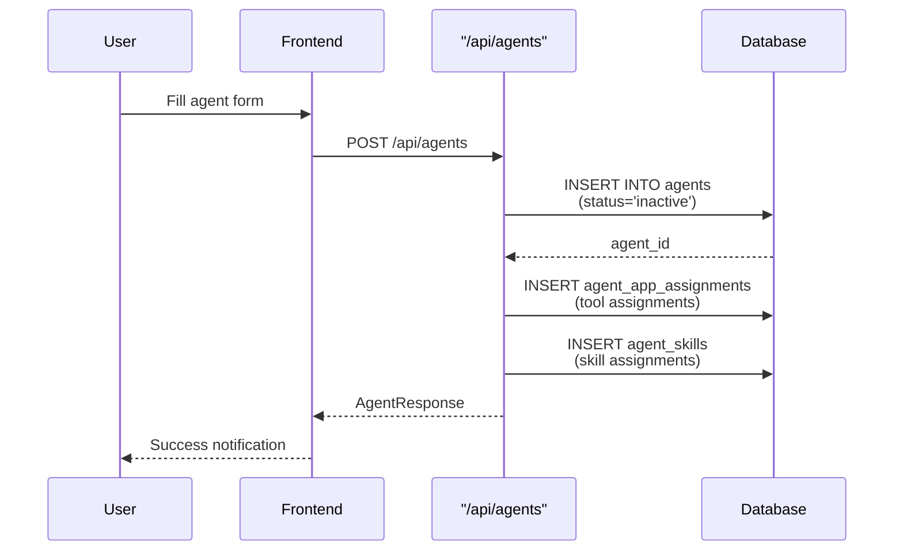
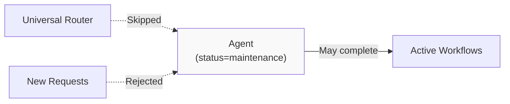
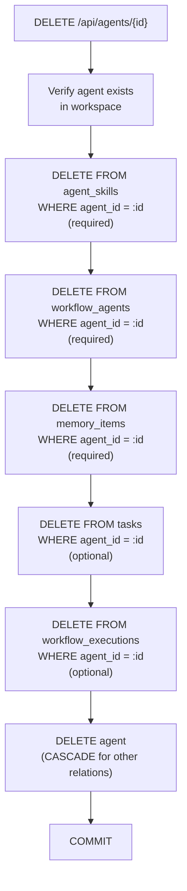
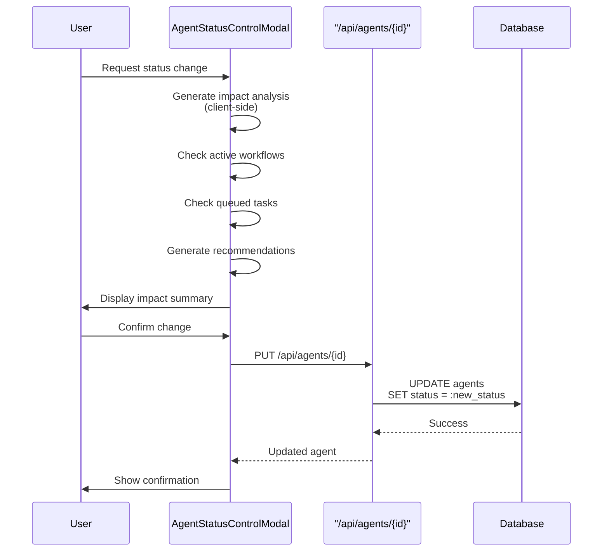

# Agent Lifecycle & Status

<details>
<summary>Relevant source files</summary>

The following files were used as context for generating this wiki page:

- [frontend/tsconfig.tsbuildinfo](frontend/tsconfig.tsbuildinfo)
- [orchestrator/api/workflows.py](orchestrator/api/workflows.py)
- [orchestrator/consumers/chatbot/service.py](orchestrator/consumers/chatbot/service.py)
- [orchestrator/core/llm/manager.py](orchestrator/core/llm/manager.py)
- [orchestrator/modules/agents/factory/agent_factory.py](orchestrator/modules/agents/factory/agent_factory.py)
- [orchestrator/modules/orchestrator/pipeline.py](orchestrator/modules/orchestrator/pipeline.py)
- [orchestrator/modules/orchestrator/service.py](orchestrator/modules/orchestrator/service.py)

</details>


This document describes the lifecycle stages of agents in Automatos AI, the possible status states, status transitions, and the impact analysis system for status changes. For information about agent configuration and capabilities, see [Agent Configuration](#3.2). For agent creation and templates, see [Creating Agents](#3.1).

---

## Purpose and Scope

Agents in Automatos AI follow a defined lifecycle from creation through execution to eventual deletion. Each agent has a `status` field that controls its availability and behavior. This document covers:

- Status state definitions and valid transitions
- Lifecycle stages (creation → execution → deletion)
- Status control mechanisms (immediate, graceful, scheduled shutdown)
- Impact analysis for status changes
- Database cleanup procedures during deletion
- API endpoints for status management

---

## Status States

Agents can exist in the following status states:

| Status | Description | Icon | Behavior |
|--------|-------------|------|----------|
| `active` | Agent is operational and can accept tasks | `CheckCircle` | Can execute workflows, process chat messages, run in recipes |
| `inactive` | Agent is stopped and unavailable | `Clock` | Cannot be used in new workflows or executions |
| `idle` | Agent is running but not currently processing | `Clock` | Available but not actively working on tasks |
| `maintenance` | Agent is undergoing maintenance | `Settings` | Unavailable for new work; existing tasks may complete |
| `paused` | Agent is temporarily suspended | `Pause` | Existing tasks frozen; can be resumed |
| `training` | Agent is being trained or updated | `Brain` | Not available for execution |
| `error` | Agent encountered a critical error | `AlertTriangle` | Unavailable until error is resolved |

**Status Field Location**: The status is stored in `Agent.status` (VARCHAR) in the `agents` table.

**Default Status**: New agents are created with `status='inactive'` by default and must be explicitly activated.

Sources: [orchestrator/api/agents.py:213-241](), [frontend/components/agents/agent-roster.tsx:156-160](), [frontend/components/agents/agent-status-control-modal.tsx:79-84]()

---

## Status State Diagram



Sources: [frontend/components/agents/agent-status-control-modal.tsx:79-84](), [orchestrator/api/agents.py:608-698]()

---

## Lifecycle Stages

### Stage 1: Creation

Agents are created via `POST /api/agents` with required fields:
- `name` (string, unique per workspace)
- `agent_type` (enum: code_architect, security_expert, performance_optimizer, data_analyst, infrastructure_manager, custom, system, specialized)
- `description` (optional)
- `configuration` (JSONB, optional)

**Initial State**: All agents start with `status='inactive'`.

**Creation Flow**:


Sources: [orchestrator/api/agents.py:362-438](), [frontend/components/agents/create-agent-modal.tsx:184-338]()

---

### Stage 2: Configuration

After creation, agents can be configured through multiple endpoints:

**Configuration Endpoints**:
- `PUT /api/agents/{agent_id}` - Update basic settings, status, tags
- `PUT /api/agents/{agent_id}/model-config` - Set model configuration (PRD-15)
- `PUT /api/agents/{agent_id}/persona` - Set persona (US-021)
- `PUT /api/agents/{agent_id}/plugins` - Assign plugins (PRD-42)
- `PUT /api/agents/{agent_id}/config` - Update heartbeat and resource limits (PRD-55)

**Configuration State**: Agents remain `inactive` during configuration unless explicitly activated.

Sources: [orchestrator/api/agents.py:608-698](), [frontend/components/agents/agent-configuration-modal.tsx:482-568]()

---

### Stage 3: Activation

Agents must be explicitly activated to become operational.

**Activation Methods**:

1. **Direct Status Update**:
   ```
   PUT /api/agents/{agent_id}
   {
     "status": "active"
   }
   ```

2. **Start Agent Action**:
   ```
   POST /api/agents/{agent_id}/execute
   ```
   
   Note: The execute endpoint checks `agent.status != "active"` and returns HTTP 400 if not active.

**Activation Requirements**:
- Agent must have valid configuration
- Agent must not be in `error` state
- Agent must pass pre-activation validation

Sources: [orchestrator/api/agents.py:507-536](), [frontend/hooks/use-agent-api.ts:342-358]()

---

### Stage 4: Execution

Active agents can participate in:
- **Chat Sessions**: Real-time conversational interactions
- **Workflow Recipes**: Multi-step orchestrated executions
- **Universal Router**: Automatic agent selection for requests
- **Agent Coordination**: Collaborative multi-agent tasks

**Execution Constraints**:
- Only agents with `status='active'` are eligible for execution
- Agents in maintenance can complete existing tasks but accept no new ones
- Paused agents freeze mid-execution

**Execution Filtering**: The Universal Router queries agents with:
```sql
SELECT * FROM agents 
WHERE workspace_id = :workspace_id 
  AND status = 'active' 
  AND is_active = true
```

Sources: [orchestrator/api/agents.py:507-536](), [modules/agents/services/agent_factory.py:220-280]()

---

### Stage 5: Maintenance Mode

Agents can enter maintenance mode for updates, debugging, or reconfiguration.

**Entering Maintenance**:
```
PUT /api/agents/{agent_id}
{
  "status": "maintenance"
}
```

**Maintenance Behavior**:
- Agent removed from Universal Router selection pool
- Existing tasks may complete (graceful mode)
- New task assignments rejected
- Agent visible in UI with maintenance badge

**Impact During Maintenance**:


Sources: [frontend/components/agents/agent-status-control-modal.tsx:79-84](), [orchestrator/api/agents.py:608-698]()

---

### Stage 6: Deactivation

Agents can be stopped using three strategies:

#### Immediate Shutdown
- Status changes to `inactive` immediately
- Active tasks are interrupted
- No graceful completion

#### Graceful Shutdown
- Completes current tasks before transitioning to `inactive`
- Rejects new task assignments during wind-down
- Default recommended approach

#### Scheduled Shutdown
- Waits for all workflows to complete
- Monitors `workflow_executions` table for completion
- Changes to `inactive` when workflow count reaches zero

**Shutdown Type Selection**: Configured in `AgentStatusControlModal`:

Sources: [frontend/components/agents/agent-status-control-modal.tsx:86-90](), [frontend/hooks/use-agent-api.ts:360-376]()

---

### Stage 7: Deletion

Agent deletion involves a multi-step cleanup process with savepoints to handle foreign key constraints.

**Deletion Endpoint**: `DELETE /api/agents/{agent_id}`

**Cleanup Sequence**:



**Savepoint Pattern**: Each deletion step uses a nested savepoint to handle failures gracefully:

```python
savepoint = db.begin_nested()
try:
    db.execute(text(sql_stmt), {"agent_id": agent_id})
    savepoint.commit()
except Exception as e:
    savepoint.rollback()
    if required:
        raise HTTPException(status_code=500, ...)
    else:
        logger.warning(f"Optional deletion failed: {e}")
```

**CASCADE Relationships**: The following relationships are automatically cleaned up by database CASCADE rules:
- `agent_app_assignments` (tool assignments)
- `agent_assigned_plugins` (plugin assignments)
- `llm_usage` records (via `on_delete='SET NULL'` on agent_id)
- `system_prompt_eval_run` records

**Required vs. Optional Deletions**:
- **Required** (raise error on failure): agent_skills, workflow_agents, memory_items
- **Optional** (log warning on failure): tasks, workflow_executions

Sources: [orchestrator/api/agents.py:700-744]()

---

## Status Management API

### Get Agent Status

```
GET /api/agents/{agent_id}/status
```

**Response**:
```json
{
  "agent_id": 123,
  "name": "Code Architect",
  "status": "active",
  "agent_type": "code_architect",
  "priority_level": "high",
  "max_concurrent_tasks": 5,
  "auto_start": false,
  "created_at": "2025-01-01T00:00:00Z",
  "updated_at": "2025-01-01T12:00:00Z",
  "configuration": {}
}
```

Sources: [orchestrator/api/agents.py:481-506]()

---

### Update Agent Status

```
PUT /api/agents/{agent_id}
```

**Request Body**:
```json
{
  "status": "inactive"
}
```

**Response**: Full `AgentResponse` object with updated status.

**Status Validation**: The backend accepts any string value for status (VARCHAR field), but the frontend enforces the enum values through UI constraints.

Sources: [orchestrator/api/agents.py:608-698]()

---

### Start Agent (Hook)

Frontend provides a dedicated hook for starting agents:

```typescript
const startAgentMutation = useStartAgent()
await startAgentMutation.mutateAsync(agentId.toString())
```

This calls `apiClient.startAgent(agentId)` which internally updates status to `'active'`.

Sources: [frontend/hooks/use-agent-api.ts:342-358]()

---

### Stop Agent (Hook)

```typescript
const stopAgentMutation = useStopAgent()
await stopAgentMutation.mutateAsync(agentId.toString())
```

This calls `apiClient.stopAgent(agentId)` which internally updates status to `'inactive'`.

Sources: [frontend/hooks/use-agent-api.ts:360-376]()

---

## Impact Analysis System

Before changing agent status, the system can perform impact analysis to assess the consequences.

### Impact Analysis Components

**AgentStatusControlModal**: Provides a UI for impact-aware status changes.

**Analyzed Factors**:
1. **Active Workflows**: Workflows currently using the agent
2. **Queued Tasks**: Tasks waiting for the agent
3. **Dependent Agents**: Other agents that depend on this agent
4. **System Impact**: Performance degradation, availability impact
5. **Recovery Time**: Estimated time to restore service

### Impact Analysis Structure

```typescript
interface AgentImpactAnalysis {
  agent_id: number
  agent_name: string
  current_status: string
  proposed_status: string
  impact_analysis: {
    active_workflows: Array<{
      id: number
      name: string
      priority: string
      estimated_completion: string
      status: string
    }>
    queued_tasks: number
    dependent_agents: Array<{
      id: number
      name: string
      dependency_type: string
    }>
    system_impact: {
      performance_degradation: number
      availability_impact: string
      recovery_time_estimate: string
    }
    recommendations: Array<{
      type: 'warning' | 'info' | 'critical'
      message: string
    }>
  }
}
```

### Impact Analysis Flow



**Note**: The current implementation generates impact analysis on the client side. The `generateRecommendations` function analyzes status transitions and produces warnings/info messages.

Sources: [frontend/components/agents/agent-status-control-modal.tsx:41-268]()

---

## Status Change Confirmations

### Required Confirmations

When changing status to `inactive` or `maintenance`, the UI requires users to confirm understanding of:

1. **Active Workflows Will Stop**: Current executions will be interrupted
2. **Queued Tasks Will Be Cancelled**: Pending work will not execute
3. **Dependent Agents May Fail**: Agents depending on this one may encounter errors

**Confirmation Checkboxes**: Implemented using `Checkbox` components with state tracking in `confirmations` array.

```typescript
const [confirmations, setConfirmations] = useState<string[]>([])
const allConfirmed = confirmations.length === 3
```

**Submit Disabled**: The status change button is disabled until all confirmations are checked.

Sources: [frontend/components/agents/agent-status-control-modal.tsx:100-102]()

---

## Status Filtering in UI

### Agent Roster Filtering

The `AgentRoster` component supports filtering by status:

```typescript
const matchesStatus = statusFilter === 'all' || agent.status === statusFilter
```

**Available Filters**:
- All
- Active
- Idle

**Filter UI**: Button group in the search/filter bar.

Sources: [frontend/components/agents/agent-roster.tsx:251-259](), [frontend/components/agents/agent-management.tsx:71-76]()

---

### List API Filtering

The list agents endpoint supports status filtering:

```
GET /api/agents?status=active&skip=0&limit=100
```

**Query Parameter**: `status` (optional, type: `AgentStatus` enum)

**Implementation**:
```python
if status:
    query = query.filter(Agent.status == status.value)
```

Sources: [orchestrator/api/agents.py:440-479]()

---

## Agent Polling and Real-Time Updates

### Auto-Refresh with React Query

Agents are automatically polled for status updates using React Query:

```typescript
export function useAgent(agentId: string | null) {
  return useQuery({
    queryKey: agentQueryKeys.agent(agentId!),
    queryFn: () => agentApiClient.getAgent(agentId!),
    enabled: !!agentId,
    refetchInterval: 10000,  // Poll every 10 seconds
  })
}
```

**Polling Intervals**:
- Individual agent: 10 seconds
- Agent list: Disabled (manual refresh only)
- Agent stats: 30 seconds

**Cache Invalidation**: Status changes trigger immediate cache invalidation via `queryClient.invalidateQueries()`.

Sources: [frontend/hooks/use-agent-api.ts:98-105](), [frontend/hooks/use-agent-api.ts:87-95]()

---

## Status Display Components

### Status Badges

Status is displayed using `StatusBadge` components with icons and colors:

```tsx
<StatusBadge size="sm" status={
  agent.status === 'idle' ? 'warning' :
  agent.status === 'maintenance' ? 'error' : 'success'
}>
  <StatusIcon className="w-2.5 h-2.5 mr-0.5" />
  {agent.status}
</StatusBadge>
```

**Status Icon Mapping**:
- `active` → CheckCircle (green)
- `idle` → Clock (yellow)
- `maintenance` → AlertCircle (orange)
- `error` → AlertTriangle (red)

Sources: [frontend/components/agents/agent-roster.tsx:156-160](), [frontend/components/agents/agent-roster.tsx:304-310]()

---

## Agent Auto-Start Configuration

Agents can be configured to automatically start when the system boots.

**Configuration Field**: `Agent.auto_start` (boolean, default: false)

**Auto-Start Behavior**: When `auto_start=true`:
- Agent status transitions to `active` on system startup
- Agent participates in Universal Router immediately
- Agent begins processing heartbeat checks (if configured)

**Configuration UI**: Toggle switch in `AgentConfiguration` component.

Sources: [orchestrator/api/agents.py:232](), [frontend/components/agents/agent-configuration.tsx:29]()

---

## Related Documentation

- [Agent Configuration](#3.2) - Detailed configuration options for agents
- [Creating Agents](#3.1) - Agent creation wizard and templates
- [Agent Context Assembly](#3.5) - How agent capabilities are assembled at runtime
- [Universal Router](#9) - How active agents are selected for requests
- [Workflow Recipes](#4) - Using agents in multi-step workflows

---

## Summary

The agent lifecycle in Automatos AI follows a well-defined path from creation through execution to deletion. Key points:

- **Status States**: 7 distinct status values control agent behavior and availability
- **Lifecycle Stages**: Creation → Configuration → Activation → Execution → Maintenance → Deactivation → Deletion
- **Status Transitions**: Controlled through PUT /api/agents/{id} with impact analysis
- **Graceful Shutdown**: Three shutdown strategies (immediate, graceful, scheduled)
- **Impact Analysis**: Client-side analysis of status change consequences
- **Database Cleanup**: Savepoint-based deletion with CASCADE handling
- **Real-Time Updates**: 10-second polling interval for status changes
- **Workspace Isolation**: All status operations scoped to workspace_id

Sources: [orchestrator/api/agents.py:1-744](), [frontend/components/agents/agent-status-control-modal.tsx:1-268](), [frontend/hooks/use-agent-api.ts:1-400]()

---