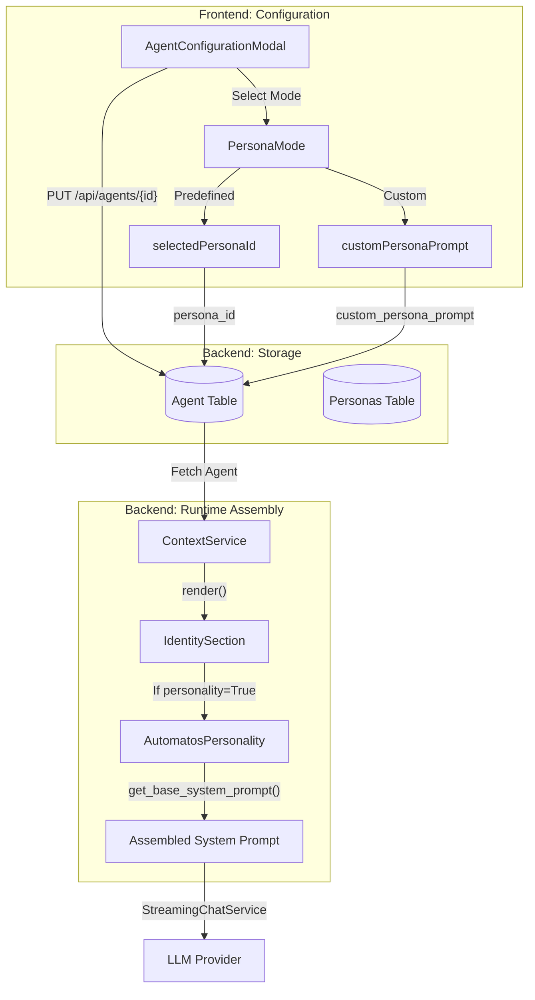
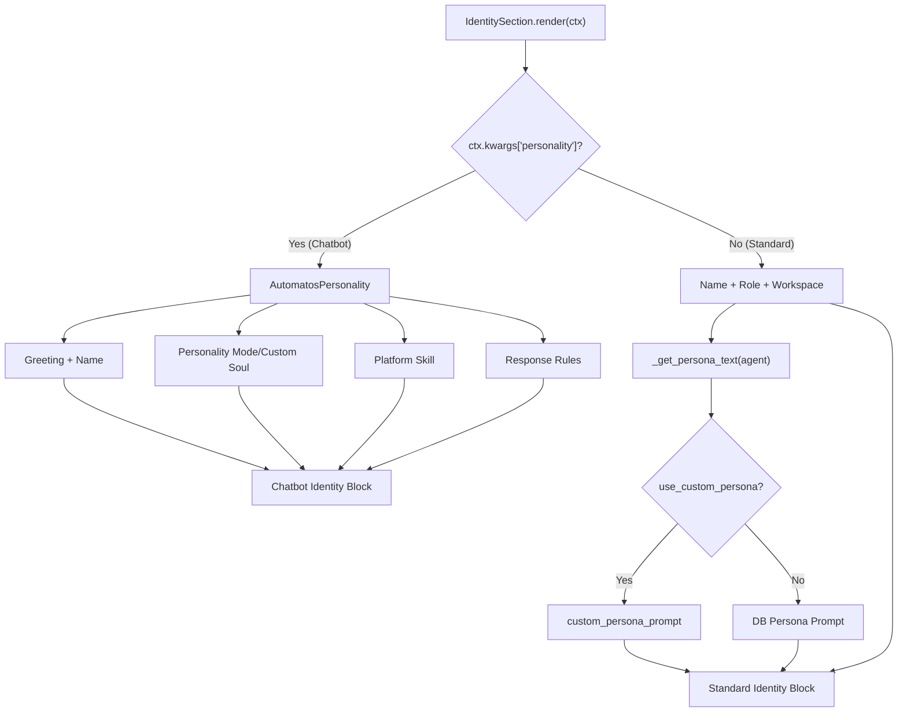

# Agent Personas

<details>
<summary>Relevant source files</summary>

The following files were used as context for generating this wiki page:

- [docs/reviews/COMPOSIO-TOOL-REGRESSION-REVIEW.md](docs/reviews/COMPOSIO-TOOL-REGRESSION-REVIEW.md)
- [frontend/components/agents/agent-configuration-modal.tsx](frontend/components/agents/agent-configuration-modal.tsx)
- [frontend/components/agents/agent-configuration.tsx](frontend/components/agents/agent-configuration.tsx)
- [frontend/components/agents/agent-details-modal.tsx](frontend/components/agents/agent-details-modal.tsx)
- [frontend/components/agents/agent-management.tsx](frontend/components/agents/agent-management.tsx)
- [frontend/components/agents/agent-performance.tsx](frontend/components/agents/agent-performance.tsx)
- [frontend/components/agents/agent-roster.tsx](frontend/components/agents/agent-roster.tsx)
- [frontend/components/agents/agent-skills.tsx](frontend/components/agents/agent-skills.tsx)
- [frontend/components/agents/agent-status-control-modal.tsx](frontend/components/agents/agent-status-control-modal.tsx)
- [frontend/components/agents/create-agent-modal.tsx](frontend/components/agents/create-agent-modal.tsx)
- [frontend/components/agents/create-skill-modal.tsx](frontend/components/agents/create-skill-modal.tsx)
- [frontend/components/agents/skill-configuration-modal.tsx](frontend/components/agents/skill-configuration-modal.tsx)
- [frontend/components/documents/analytics-tab.tsx](frontend/components/documents/analytics-tab.tsx)
- [frontend/components/documents/processing-tab.tsx](frontend/components/documents/processing-tab.tsx)
- [frontend/hooks/use-agent-api.ts](frontend/hooks/use-agent-api.ts)
- [frontend/hooks/use-document-api.ts](frontend/hooks/use-document-api.ts)
- [orchestrator/api/agents.py](orchestrator/api/agents.py)
- [orchestrator/api/chat.py](orchestrator/api/chat.py)
- [orchestrator/api/chat_voice.py](orchestrator/api/chat_voice.py)
- [orchestrator/consumers/chatbot/auto.py](orchestrator/consumers/chatbot/auto.py)
- [orchestrator/consumers/chatbot/intent_classifier.py](orchestrator/consumers/chatbot/intent_classifier.py)
- [orchestrator/consumers/chatbot/personality.py](orchestrator/consumers/chatbot/personality.py)
- [orchestrator/consumers/chatbot/service.py](orchestrator/consumers/chatbot/service.py)
- [orchestrator/consumers/chatbot/smart_tool_router.py](orchestrator/consumers/chatbot/smart_tool_router.py)
- [orchestrator/core/llm/manager.py](orchestrator/core/llm/manager.py)
- [orchestrator/core/models/__init__.py](orchestrator/core/models/__init__.py)
- [orchestrator/core/models/core.py](orchestrator/core/models/core.py)
- [orchestrator/core/routing/engine.py](orchestrator/core/routing/engine.py)
- [orchestrator/modules/orchestrator/service.py](orchestrator/modules/orchestrator/service.py)
- [orchestrator/modules/tools/discovery/actions_analytics_enhanced.py](orchestrator/modules/tools/discovery/actions_analytics_enhanced.py)
- [orchestrator/modules/tools/discovery/handlers_analytics_enhanced.py](orchestrator/modules/tools/discovery/handlers_analytics_enhanced.py)
- [orchestrator/modules/tools/discovery/handlers_search.py](orchestrator/modules/tools/discovery/handlers_search.py)
- [orchestrator/modules/tools/discovery/platform_actions.py](orchestrator/modules/tools/discovery/platform_actions.py)
- [orchestrator/modules/tools/discovery/platform_executor.py](orchestrator/modules/tools/discovery/platform_executor.py)
- [orchestrator/modules/tools/tool_router.py](orchestrator/modules/tools/tool_router.py)
- [orchestrator/services/heartbeat_service.py](orchestrator/services/heartbeat_service.py)

</details>


## Purpose and Scope

Agent Personas define the personality, behavior, and voice of AI agents in the Automatos AI platform. A persona consists of a system prompt, voice profile, and behavioral metadata that shapes how an agent communicates and approaches tasks. The system supports a multi-tier approach: predefined global personas, custom workspace-level personas, and agent-specific custom prompts.

This document covers:
- The `Persona` data structure and its role in the agent lifecycle.
- The three-mode persona system (None, Predefined, Custom).
- Implementation of persona selection in the `CreateAgentModal` and `AgentConfigurationModal`.
- Integration with the `ContextService` and `IdentitySection` for runtime prompt assembly.
- Voice profile management for multimodal agent interactions.

**Sources:** [orchestrator/api/agents.py:174-210](), [frontend/components/agents/create-agent-modal.tsx:43-56](), [orchestrator/modules/context/sections/identity.py:1-6]()

---

## Persona System Architecture

The persona system is designed to provide agents with a consistent "soul" while allowing for granular customization. It bridges the gap between raw LLM capabilities and specific professional roles.

### Three Persona Modes

The platform supports three distinct persona modes, implemented in the frontend state and persisted in the backend `Agent` configuration.

| Mode | State (`PersonaMode`) | Backend Logic | Use Case |
| :--- | :--- | :--- | :--- |
| **None** | `'none'` | No specific persona prompt is injected; uses default platform identity. | Purely functional utility agents. |
| **Predefined** | `'predefined'` | Uses a `system_prompt` from a shared library or `PromptRegistry`. | Standard roles (e.g., "Senior Engineer"). |
| **Custom** | `'custom'` | Uses a unique `customPersonaPrompt` for that agent. | Highly specialized or unique behaviors. |

**Sources:** [frontend/components/agents/create-agent-modal.tsx:56-57](), [frontend/components/agents/agent-configuration-modal.tsx:137-149](), [orchestrator/modules/context/sections/identity.py:168-185]()

### Data Flow: Persona Selection to Execution

The following diagram illustrates how a persona moves from the UI selection phase to the final execution context via the `ContextService`.

**Title: Persona Context Assembly Flow**

**Sources:** [frontend/components/agents/agent-configuration-modal.tsx:431-447](), [orchestrator/api/agents.py:174-210](), [orchestrator/modules/context/sections/identity.py:72-81]()

---

## Implementation Details

### 1. Persona Management in UI
The `AgentConfigurationModal` and `CreateAgentModal` share a similar implementation for managing persona state.

- **Category Filtering**: Personas are filtered by the agent's category (e.g., "Engineering", "Sales") to suggest relevant roles [frontend/components/agents/create-agent-modal.tsx:140-154]().
- **Pre-filling Custom Prompts**: When a user switches from `predefined` to `custom` mode, the system automatically copies the predefined persona's `system_prompt` into the custom text area to provide a starting point [frontend/components/agents/create-agent-modal.tsx:156-164]().
- **Persona Previews**: The UI includes an expandable preview for persona prompts using `expandedPersonaId` to allow users to inspect the instructions before assignment [frontend/components/agents/agent-configuration-modal.tsx:146-148]().

### 2. Personality & Communication Style
For the primary chatbot (Orchestrator), the system uses `AutomatosPersonality` to generate personality-aware prompts based on workspace settings.

- **Modes**: Friendly, Professional, Technical, or Custom [orchestrator/consumers/chatbot/personality.py:7-11]().
- **Communication Style**: Concise, Balanced, or Detailed [orchestrator/consumers/chatbot/personality.py:112-116]().
- **Identity Injection**: The `get_base_system_prompt` function builds a multi-section prompt including time-aware greetings and personality blocks [orchestrator/consumers/chatbot/personality.py:126-147]().
- **Prompt Registry Integration**: The system attempts to load personality blocks from the `PromptRegistry` using slugs like `chatbot-friendly` before falling back to hardcoded presets [orchestrator/consumers/chatbot/personality.py:163-176]().

### 3. Voice Profiles (PRD-74)
Agents can be assigned voice profiles for multimodal agent interactions.
- **State Management**: `selectedVoiceProfileId` tracks the chosen voice in the configuration modal [frontend/components/agents/agent-configuration-modal.tsx:150-154]().
- **Data Loading**: The `voiceProfiles` state is populated from the backend to provide a list of available synthesis options during agent setup [frontend/components/agents/agent-configuration-modal.tsx:150-154]().

**Sources:** [orchestrator/consumers/chatbot/personality.py:119-180](), [frontend/components/agents/agent-configuration-modal.tsx:150-154](), [orchestrator/modules/context/sections/identity.py:122-134]()

---

## Technical Data Structures

### Agent Configuration Schema
The agent's persona and behavioral settings are stored within the `configuration` JSONB field and related columns in the `Agent` model.

| Field | Type | Description |
| :--- | :--- | :--- |
| `persona_id` | UUID | Reference to a predefined persona template. |
| `use_custom_persona`| Boolean | Toggle indicating if `custom_persona_prompt` should be used. |
| `custom_persona_prompt` | Text | The raw system prompt text used in `custom` mode. |
| `voice_profile_id` | String | Identifier for the assigned voice synthesis profile. |
| `communication_style` | Enum | Concise, Balanced, or Detailed. |

**Sources:** [frontend/components/agents/agent-configuration-modal.tsx:70-91](), [orchestrator/api/agents.py:174-180](), [orchestrator/modules/context/sections/identity.py:168-185]()

### Persona Item Interface
The frontend defines the `PersonaItem` interface to handle incoming data from `/api/personas`.

```typescript
interface PersonaItem {
  id: string
  slug: string
  name: string
  description?: string
  system_prompt?: string
  voice_description?: string
  category?: string
  suggested_temperature: number
  scope: string
}
```
**Sources:** [frontend/components/agents/create-agent-modal.tsx:44-54]()

---

## Context Assembly Integration

The `IdentitySection` (Priority 1) is responsible for rendering the persona into the system prompt. It handles two primary paths:

1.  **Chatbot Mode**: Calls `AutomatosPersonality.get_base_system_prompt()` along with platform skills, tool guidance, and self-learning instructions [orchestrator/modules/context/sections/identity.py:122-165]().
2.  **Standard Mode**: Renders the agent name, role, and workspace, followed by the `_get_persona_text()` result which extracts either the custom prompt or the linked persona template [orchestrator/modules/context/sections/identity.py:87-120]().

**Title: Identity Section Logic**

**Sources:** [orchestrator/modules/context/sections/identity.py:72-165](), [orchestrator/consumers/chatbot/personality.py:126-152]()

### Response Formatting
The persona system also enforces strict response formatting rules within the `IdentitySection`. It instructs agents to synthesize tool results into clear, human-friendly prose rather than dumping raw JSON [orchestrator/modules/context/sections/identity.py:109-115]().

**Sources:** [orchestrator/modules/context/sections/identity.py:1-20](), [orchestrator/consumers/chatbot/personality.py:178-185]()

---