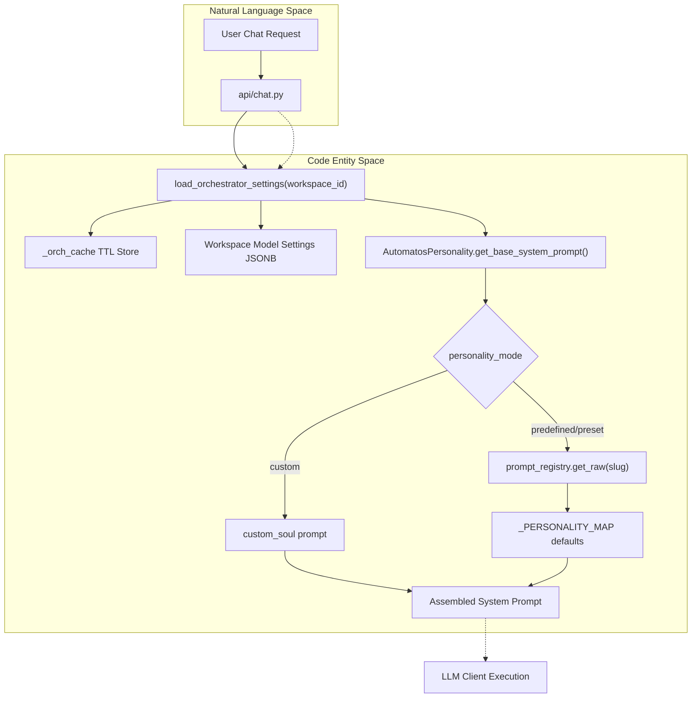
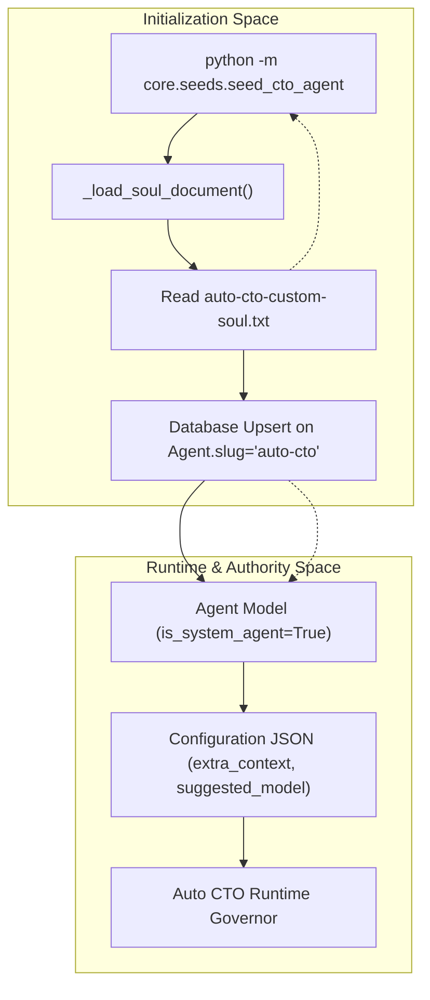

# Agent Personas

Relevant source files

The following files were used as context for generating this wiki page:

- [docs/PRDS/67-CTO-AGENT-PLATFORM-BUILDER.md](docs/PRDS/67-CTO-AGENT-PLATFORM-BUILDER.md)
- [docs/PRDS/PRD-226-AUTO-MANAGER-DOCTRINE.md](docs/PRDS/PRD-226-AUTO-MANAGER-DOCTRINE.md)
- [docs/auto-cto-custom-soul.txt](docs/auto-cto-custom-soul.txt)
- [docs/auto-cto-soul.md](docs/auto-cto-soul.md)
- [orchestrator/alembic/versions/20260226_add_cto_agent_columns.py](orchestrator/alembic/versions/20260226_add_cto_agent_columns.py)
- [orchestrator/alembic/versions/20260226_merge_heads_for_cto_agent.py](orchestrator/alembic/versions/20260226_merge_heads_for_cto_agent.py)
- [orchestrator/consumers/chatbot/cto_prompt_builder.py](orchestrator/consumers/chatbot/cto_prompt_builder.py)
- [orchestrator/consumers/chatbot/intent_classifier.py](orchestrator/consumers/chatbot/intent_classifier.py)
- [orchestrator/consumers/chatbot/personality.py](orchestrator/consumers/chatbot/personality.py)
- [orchestrator/consumers/chatbot/smart_tool_router.py](orchestrator/consumers/chatbot/smart_tool_router.py)
- [orchestrator/core/seeds/auto-cto-custom-soul.txt](orchestrator/core/seeds/auto-cto-custom-soul.txt)
- [orchestrator/core/seeds/seed_cto_agent.py](orchestrator/core/seeds/seed_cto_agent.py)
- [orchestrator/core/services/auto_autonomy.py](orchestrator/core/services/auto_autonomy.py)
- [orchestrator/modules/coordination/dispatch_contract.py](orchestrator/modules/coordination/dispatch_contract.py)
- [orchestrator/modules/tools/discovery/actions_autonomy.py](orchestrator/modules/tools/discovery/actions_autonomy.py)
- [orchestrator/modules/tools/discovery/handlers_autonomy.py](orchestrator/modules/tools/discovery/handlers_autonomy.py)
- [orchestrator/modules/tools/execution/exec_research.py](orchestrator/modules/tools/execution/exec_research.py)
- [orchestrator/tests/security/test_nl2sql_tenancy.py](orchestrator/tests/security/test_nl2sql_tenancy.py)
- [orchestrator/tests/security/test_w3_full_autonomy_gate.py](orchestrator/tests/security/test_w3_full_autonomy_gate.py)
- [orchestrator/tests/test_harness_governance_gate.py](orchestrator/tests/test_harness_governance_gate.py)
- [orchestrator/tests/test_nl2sql_agent_path.py](orchestrator/tests/test_nl2sql_agent_path.py)
- [orchestrator/tests/test_nl2sql_semantic_audit_templates.py](orchestrator/tests/test_nl2sql_semantic_audit_templates.py)
- [orchestrator/tests/test_prd143_manifest_parity.py](orchestrator/tests/test_prd143_manifest_parity.py)
- [orchestrator/tests/test_prd232_us001_dispatcher_survives_route.py](orchestrator/tests/test_prd232_us001_dispatcher_survives_route.py)
- [orchestrator/tests/test_prd232_us002_flag_split.py](orchestrator/tests/test_prd232_us002_flag_split.py)
- [orchestrator/tests/test_us014_graph_router_delegation.py](orchestrator/tests/test_us014_graph_router_delegation.py)
- [orchestrator/tests/test_us015_registry_intent_filter.py](orchestrator/tests/test_us015_registry_intent_filter.py)
- [orchestrator/tests/test_w3_auto_autonomy_service.py](orchestrator/tests/test_w3_auto_autonomy_service.py)

## Purpose and Scope

Agent Personas define the personality, behavior, and voice of AI agents in the Automatos AI platform. A persona consists of a system prompt, voice profile, and behavioral metadata that shapes how an agent communicates and approaches tasks. The system supports a multi-tier approach: predefined global personas, custom workspace-level personas, and specialized **System Agents** (like the Auto CTO) that possess platform-wide awareness and code-level consciousness.

This document covers:
- The `Agent` data structure and its role in the persona lifecycle [orchestrator/core/models/core.py:183-261]().
- The three-mode persona system (None, Predefined, Custom) and the personality module [orchestrator/consumers/chatbot/personality.py:1-124]().
- **System Agents**: Implementation of the Auto CTO seed agent, role-based persona injection, and custom soul loading [orchestrator/core/seeds/seed_cto_agent.py:1-115]().
- **Voice Profiles**: Management of audio profiles and integration with agent settings.
- Implementation of persona selection and category mapping [frontend/lib/agent-constants.ts:25-65]().

**Sources:** [orchestrator/core/models/core.py:183-261](), [orchestrator/consumers/chatbot/personality.py:1-124](), [orchestrator/core/seeds/seed_cto_agent.py:1-115]()

---

## Persona System Architecture

The persona system bridges the gap between raw LLM capabilities and specific professional roles. While standard agents are workspace-scoped, System Agents are global entities with specialized privileges.

### Persona Modes and System Types

| Mode / Type | Backend Logic | Visibility | Use Case |
| :--- | :--- | :--- | :--- |
| **None** | Default platform identity based on `agent_type`. | Workspace | Purely functional utility agents. |
| **Predefined** | Uses `system_prompt` from a shared persona library (e.g., `chatbot-friendly`, `chatbot-technical`) [orchestrator/consumers/chatbot/personality.py:105-110](). | Workspace | Standard roles (e.g., customer support, data analyst). |
| **Custom** | Uses a unique `custom_soul` or prompt provided by the user [orchestrator/consumers/chatbot/personality.py:8-10](). | Workspace | Highly specialized behaviors or domain-specific tasks. |
| **System Agent** | `is_system_agent=True` with specialized `agent_type='system'` [orchestrator/core/seeds/seed_cto_agent.py:78-80](). | Global | Platform CTO, admin tools, infrastructure monitoring. |

**Sources:** [orchestrator/consumers/chatbot/personality.py:8-110](), [orchestrator/core/models/core.py:202-215](), [orchestrator/core/seeds/seed_cto_agent.py:78-80]()

### Data Flow: Persona Initialization and Resolution

When an agent processes a prompt or chat message, the `AutomatosPersonality` module resolves its persona based on workspace orchestrator settings and agent configuration.

**Title: Persona Resolution and Injection Flow**

**Sources:** [orchestrator/consumers/chatbot/personality.py:36-172](), [orchestrator/core/models/workspaces.py:1-50]()

---

## Personality Module & Presets

The `AutomatosPersonality` class manages workspace-level personality configuration and builds base system prompts dynamically [orchestrator/consumers/chatbot/personality.py:119-147]().

### Workspace Settings & Cache
Workspace orchestrator configurations are loaded with a Time-To-Live (TTL) cache to avoid hitting the database on every message exchange:
- Defaults include `personality_mode: friendly`, `communication_style: balanced`, `proactive_level: notify`, and `thinking_level: medium` [orchestrator/consumers/chatbot/personality.py:27-33]().
- `load_orchestrator_settings(workspace_id: str)` checks `_orch_cache` before querying the `Workspace` model's JSONB `settings` field [orchestrator/consumers/chatbot/personality.py:36-68]().

### Personality Presets
The system defines built-in persona blocks mapping to behavioral archetypes:
- **Friendly**: Warm, approachable, memory-oriented, action-biased (`_FRIENDLY_PERSONALITY`) [orchestrator/consumers/chatbot/personality.py:75-81]().
- **Professional**: Polished, enterprise-appropriate, structured, risk-proactive (`_PROFESSIONAL_PERSONALITY`) [orchestrator/consumers/chatbot/personality.py:83-89]().
- **Technical**: Developer-focused, precise, code-first, step-by-step reasoning (`_TECHNICAL_PERSONALITY`) [orchestrator/consumers/chatbot/personality.py:91-97]().
- **Communication Suffixes**: Modifies verbosity via `_COMMUNICATION_SUFFIX` for `concise`, `balanced`, or `detailed` styles [orchestrator/consumers/chatbot/personality.py:112-116]().

**Sources:** [orchestrator/consumers/chatbot/personality.py:27-116]()

---

## System Agents: The Auto CTO Seed Agent

System agents represent deeply embedded platform personas. The primary example is the **Auto CTO** (`auto-cto`), seeded into the platform via `seed_cto_agent.py` [orchestrator/core/seeds/seed_cto_agent.py:1-115]().

### Auto CTO Architecture and Persona
The Auto CTO is initialized as an administrative system agent with direct access to platform architecture knowledge, database schemas, and multi-agent coordination frameworks [orchestrator/core/seeds/seed_cto_agent.py:68-115]().
- **Soul Document**: Loaded from `auto-cto-custom-soul.txt`, defining its persona as an Irish technical lead made of code, direct dry wit, and strict engineering opinions [orchestrator/core/seeds/seed_cto_agent.py:25-40]().
- **Configuration**: Stored with `is_system_agent=True`, `required_role='admin'`, and a customized configuration containing architectural living summaries (FastAPI, Redis, PostgreSQL, S3 Vectors, Universal Router) [orchestrator/core/seeds/seed_cto_agent.py:78-90]().

**Title: Auto CTO Seed and Execution Lifecycle**

**Sources:** [orchestrator/core/seeds/seed_cto_agent.py:25-115](), [orchestrator/core/seeds/auto-cto-custom-soul.txt:1-87]()

**Sources:** [orchestrator/core/seeds/seed_cto_agent.py:1-115](), [orchestrator/core/seeds/auto-cto-custom-soul.txt:1-87]()

---

## Implementation Details

### 1. Persona Management in UI
The `AgentConfigurationModal` and `CreateAgentModal` manage user-facing persona configurations:
- **Category Mapping**: UI categories map to backend `agent_type` values via `CATEGORY_TO_DB_MAP` [frontend/lib/agent-constants.ts:48-65]().
- **Persona Library**: Fetches predefined templates providing `system_prompt` and `suggested_temperature` [frontend/components/agents/create-agent-modal.tsx:129-142]().
- **Custom Prompts**: Allows switching to custom mode, persisting prompts into the agent's database entity [frontend/components/agents/agent-configuration-modal.tsx:142-147]().

### 2. Voice Profiles
Voice profiles link agents to audio synthesis engines (such as Retell transport integrations):
- **State Tracking**: `AgentConfigurationModal` manages `selectedVoiceProfileId` and loading states [frontend/components/agents/agent-configuration-modal.tsx:154-157]().
- **Persistence**: Voice configurations are stored inside the agent's JSONB `configuration` field [orchestrator/core/models/core.py:217-235]().

**Sources:** [frontend/lib/agent-constants.ts:48-65](), [frontend/components/agents/create-agent-modal.tsx:129-142](), [orchestrator/core/models/core.py:217-235]()

---

## Technical Data Structures

### Agent Model Persona Fields
The `Agent` SQLAlchemy model defines persona storage and attributes:

| Field | Type | Description |
| :--- | :--- | :--- |
| `name` | String | Display name of the agent [orchestrator/core/models/core.py:185](). |
| `agent_type` | String | Functional role type (e.g., `support`, `data_analyst`, `system`) [orchestrator/core/models/core.py:188](). |
| `is_system_agent` | Boolean | Identifies global system-seeded agents like Auto CTO [orchestrator/core/models/core.py:195](). |
| `use_custom_persona` | Boolean | Toggles between predefined presets and custom prompts [orchestrator/core/models/core.py:202](). |
| `custom_persona_prompt`| Text | Raw custom system prompt text [orchestrator/core/models/core.py:205](). |
| `configuration` | JSONB | Extended metadata including voice settings, temperature, and extra context [orchestrator/core/models/core.py:217-235](). |

**Sources:** [orchestrator/core/models/core.py:183-235]()

---