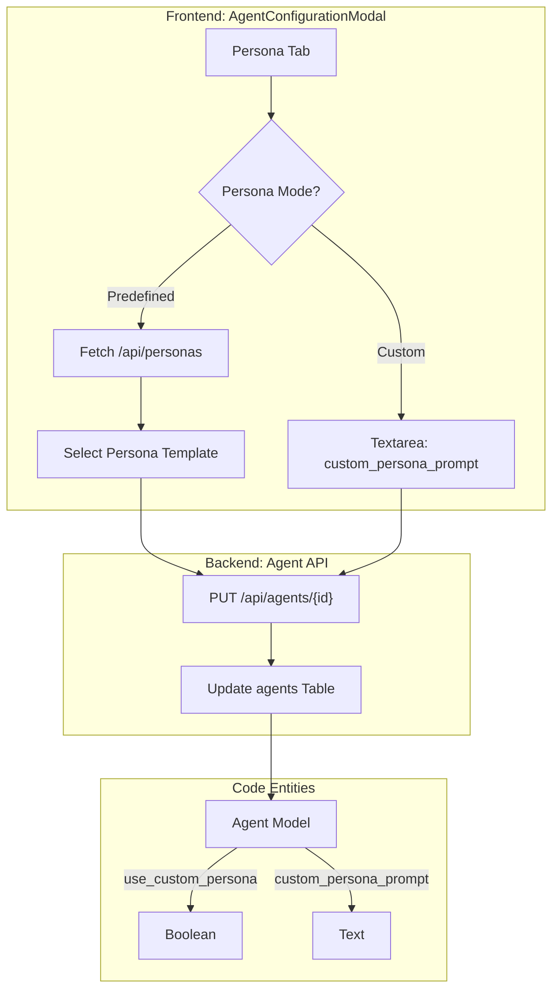

# Agent Personas

<details>
<summary>Relevant source files</summary>

The following files were used as context for generating this wiki page:

- [docs/PRDS/67-CTO-AGENT-PLATFORM-BUILDER.md](docs/PRDS/67-CTO-AGENT-PLATFORM-BUILDER.md)
- [docs/auto-cto-custom-soul.txt](docs/auto-cto-custom-soul.txt)
- [docs/auto-cto-soul.md](docs/auto-cto-soul.md)
- [frontend/components/agents/agent-configuration-modal.tsx](frontend/components/agents/agent-configuration-modal.tsx)
- [frontend/components/agents/agent-configuration.tsx](frontend/components/agents/agent-configuration.tsx)
- [frontend/components/agents/agent-details-modal.tsx](frontend/components/agents/agent-details-modal.tsx)
- [frontend/components/agents/agent-roster.tsx](frontend/components/agents/agent-roster.tsx)
- [frontend/components/agents/create-agent-modal.tsx](frontend/components/agents/create-agent-modal.tsx)
- [frontend/components/chatbot/agent-selector.tsx](frontend/components/chatbot/agent-selector.tsx)
- [frontend/components/documents/analytics-tab.tsx](frontend/components/documents/analytics-tab.tsx)
- [frontend/components/documents/processing-tab.tsx](frontend/components/documents/processing-tab.tsx)
- [frontend/lib/agent-constants.ts](frontend/lib/agent-constants.ts)
- [orchestrator/alembic/versions/20260226_add_cto_agent_columns.py](orchestrator/alembic/versions/20260226_add_cto_agent_columns.py)
- [orchestrator/alembic/versions/20260226_merge_heads_for_cto_agent.py](orchestrator/alembic/versions/20260226_merge_heads_for_cto_agent.py)
- [orchestrator/alembic/versions/add_job_title_to_agents.py](orchestrator/alembic/versions/add_job_title_to_agents.py)
- [orchestrator/alembic/versions/agent_public_id_and_slug_fix.py](orchestrator/alembic/versions/agent_public_id_and_slug_fix.py)
- [orchestrator/alembic/versions/seed_auto_agents_existing_workspaces.py](orchestrator/alembic/versions/seed_auto_agents_existing_workspaces.py)
- [orchestrator/api/agents.py](orchestrator/api/agents.py)
- [orchestrator/consumers/chatbot/cto_prompt_builder.py](orchestrator/consumers/chatbot/cto_prompt_builder.py)
- [orchestrator/core/models/core.py](orchestrator/core/models/core.py)
- [orchestrator/core/seeds/auto-cto-custom-soul.txt](orchestrator/core/seeds/auto-cto-custom-soul.txt)
- [orchestrator/core/seeds/seed_cto_agent.py](orchestrator/core/seeds/seed_cto_agent.py)
- [orchestrator/core/utils/agent_resolver.py](orchestrator/core/utils/agent_resolver.py)

</details>


## Purpose and Scope

Agent Personas define the personality, behavior, and voice of AI agents in the Automatos AI platform. A persona consists of a system prompt, voice profile, and behavioral metadata that shapes how an agent communicates and approaches tasks. The system supports a multi-tier approach: predefined global personas, custom workspace-level personas, and specialized **System Agents** (like the Auto CTO) that possess platform-wide awareness and technical depth.

This document covers:
- The `Agent` and `Persona` data structures.
- The three-mode persona selection system (None, Predefined, Custom).
- **System Agents**: Implementation of the "Auto" workspace orchestrator and the CTO persona.
- **Voice Profiles**: Integration of auditory identities and selection logic.
- Implementation of persona selection via the `AgentConfigurationModal`.

**Sources:** [orchestrator/core/models/core.py:228-255](), [frontend/components/agents/agent-configuration-modal.tsx:139-156](), [orchestrator/alembic/versions/seed_auto_agents_existing_workspaces.py:42-76]()

---

## Persona System Architecture

The persona system bridges the gap between raw LLM capabilities and specific professional roles. While standard agents are workspace-scoped, System Agents are global entities or platform-seeded defaults with specific `slug` patterns.

### Persona Modes and Agent Types

| Mode / Type | Backend Logic | Visibility | Use Case |
| :--- | :--- | :--- | :--- |
| **None** | Default platform identity. | Workspace | Purely functional utility agents. |
| **Predefined** | Uses `system_prompt` from `/api/personas`. | Workspace | Standard roles (e.g., "Researcher", "Support"). |
| **Custom** | Uses unique `custom_persona_prompt`. | Workspace | Highly specialized behaviors. |
| **System Agent** | `is_system_agent=True` + unique `slug`. | Global/System | Workspace Orchestrator (Auto), CTO, Infrastructure. |

**Sources:** [frontend/components/agents/agent-configuration-modal.tsx:140-142](), [orchestrator/core/models/core.py:246-248](), [frontend/lib/agent-constants.ts:48-65]()

### Data Flow: Persona Selection & Assignment

When an agent is created or configured, the persona is assigned either by selecting a template from the global persona registry or by providing a custom prompt string.

**Title: Agent Persona Configuration Flow**

**Sources:** [frontend/components/agents/agent-configuration-modal.tsx:139-156](), [orchestrator/api/agents.py:174-210](), [orchestrator/core/models/core.py:246-247]()

---

## Implementation Details

### 1. System Agents (Auto & CTO)
The platform seeds a specialized "Auto" agent for every workspace to act as the primary orchestrator.
- **The Auto CTO Persona**: Defined by a "Soul Document" that establishes a technical Irish tech-lead personality [docs/auto-cto-custom-soul.txt:1-28]().
- **Personality Traits**: Sharp, direct, dry wit, and "Dublin tech meetup energy" [orchestrator/core/seeds/auto-cto-custom-soul.txt:21-28]().
- **Operational Logic**: Separates product intent from platform behavior and observability [docs/auto-cto-custom-soul.txt:29-39]().
- **Seeding Mechanism**: The `seed_auto_agents_existing_workspaces` migration backfills the Auto agent for all workspaces using a standardized prompt and the `auto-{workspace_id}` slug [orchestrator/alembic/versions/seed_auto_agents_existing_workspaces.py:40-76]().

### 2. Voice Profiles
The voice system allows agents to have distinct auditory identities.
- **Selection**: Managed within the `AgentConfigurationModal` under the `PersonaMode` logic [frontend/components/agents/agent-configuration-modal.tsx:153-156]().
- **Data Binding**: The `selectedVoiceProfileId` state is mapped to the agent's configuration during the save operation [frontend/components/agents/agent-configuration-modal.tsx:155]().

### 3. Category & Role Mapping
Personas are categorized to help users find relevant templates.
- **Category Resolution**: The `getAgentCategoryDisplay` function resolves categories based on `marketplace_category`, `configuration.category`, or the underlying `agent_type` [frontend/lib/agent-constants.ts:118-130]().
- **Role Lines**: The UI displays a "Role Line" combining the category and a custom `job_title` (e.g., "Research · Senior Market Analyst") [frontend/lib/agent-constants.ts:137-141]().

**Sources:** [frontend/lib/agent-constants.ts:25-42](), [frontend/components/agents/agent-roster.tsx:58-93](), [orchestrator/core/models/core.py:236-237]()

---

## Technical Data Structures

### Agent Database Model
The `Agent` class in the core models includes fields specifically for persona management.

| Field | Type | Description |
| :--- | :--- | :--- |
| `is_system_agent` | Boolean | Identifies platform-seeded agents like 'Auto'. |
| `use_custom_persona` | Boolean | Flag to override default behavior with a custom prompt. |
| `custom_persona_prompt`| Text | The raw system prompt string for custom/system personas. |
| `job_title` | String | A human-readable title that supplements the agent's name. |
| `slug` | String | Per-workspace unique identifier (e.g., `auto-123`). |

**Sources:** [orchestrator/core/models/core.py:245-248](), [orchestrator/alembic/versions/add_job_title_to_agents.py:15-20](), [orchestrator/alembic/versions/agent_public_id_and_slug_fix.py:59-66]()

### Persona Template Interface
Templates fetched from the registry follow this structure in the frontend:
```typescript
interface PersonaItem {
  id: string
  slug: string
  name: string
  description?: string
  system_prompt?: string
  voice_description?: string
  category?: string
  suggested_temperature: number
}
```
**Sources:** [frontend/components/agents/create-agent-modal.tsx:44-54]()

---

## UI Components

### Agent Roster & Icons
The `AgentRoster` component uses a mapping function to assign icons based on the agent's persona category.
- **Mapping Logic**: Categories like "DevOps" map to the `Terminal` icon, while "Customer Support" maps to `Headphones` [frontend/components/agents/agent-roster.tsx:58-93]().
- **Visual Feedback**: Icons are colored semantically (e.g., `text-rose-500` for Analytics) to provide immediate context in the agent grid [frontend/lib/agent-constants.ts:25-42]().

### Configuration Tabs
The `AgentConfigurationModal` organizes persona settings into a dedicated tab where users can toggle between:
1. **Predefined**: A searchable list of templates [frontend/components/agents/agent-configuration-modal.tsx:142]().
2. **Custom**: A rich text area for manual prompt engineering [frontend/components/agents/agent-configuration-modal.tsx:144]().

**Sources:** [frontend/components/agents/agent-configuration-modal.tsx:139-156](), [frontend/components/agents/agent-roster.tsx:96-131]()

---