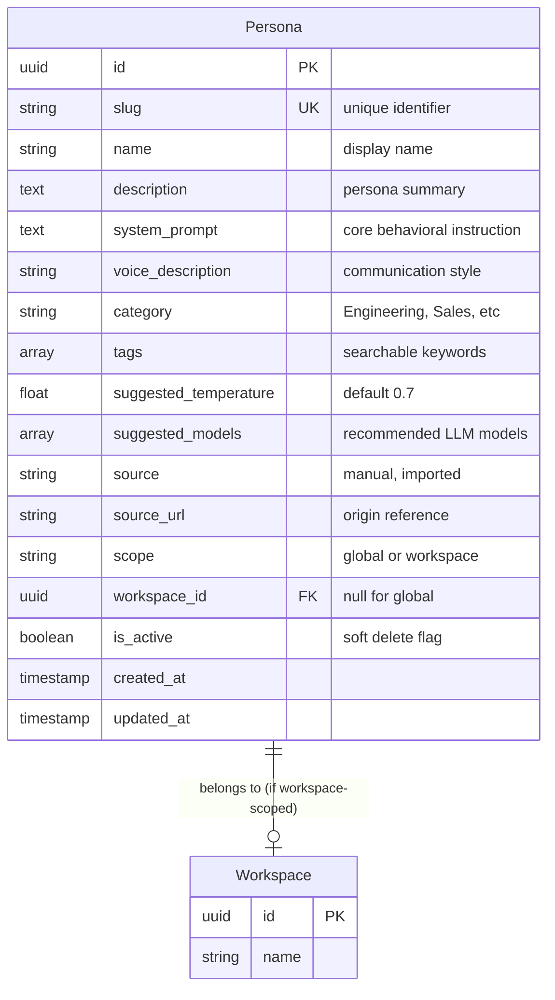
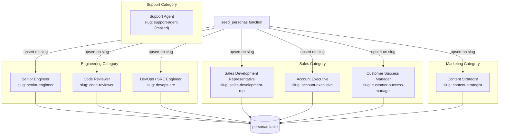
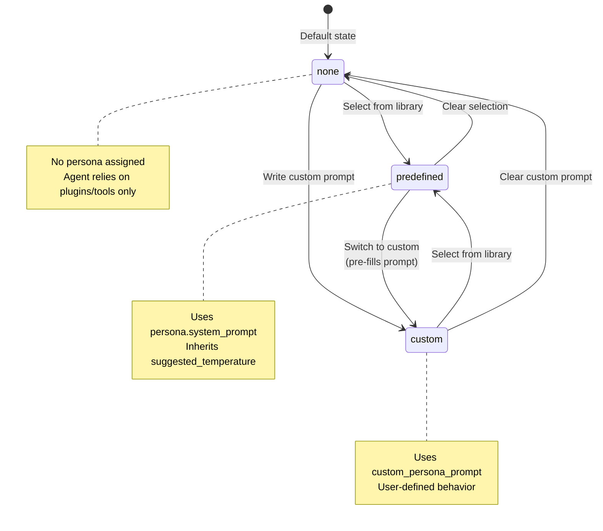
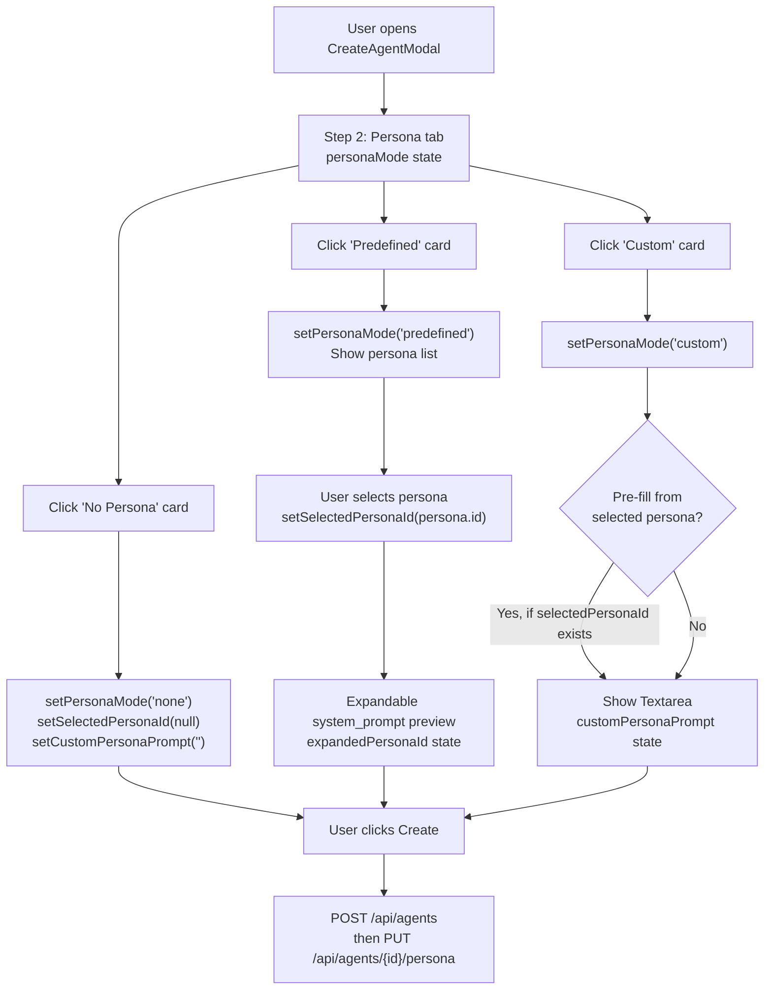
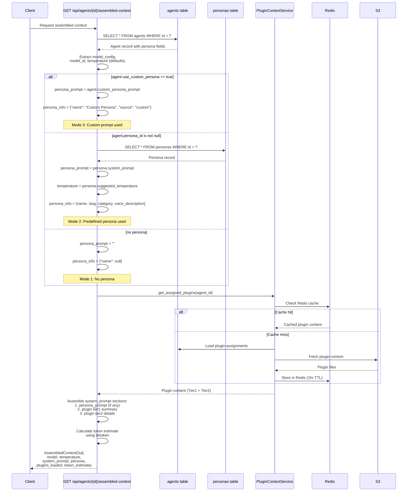
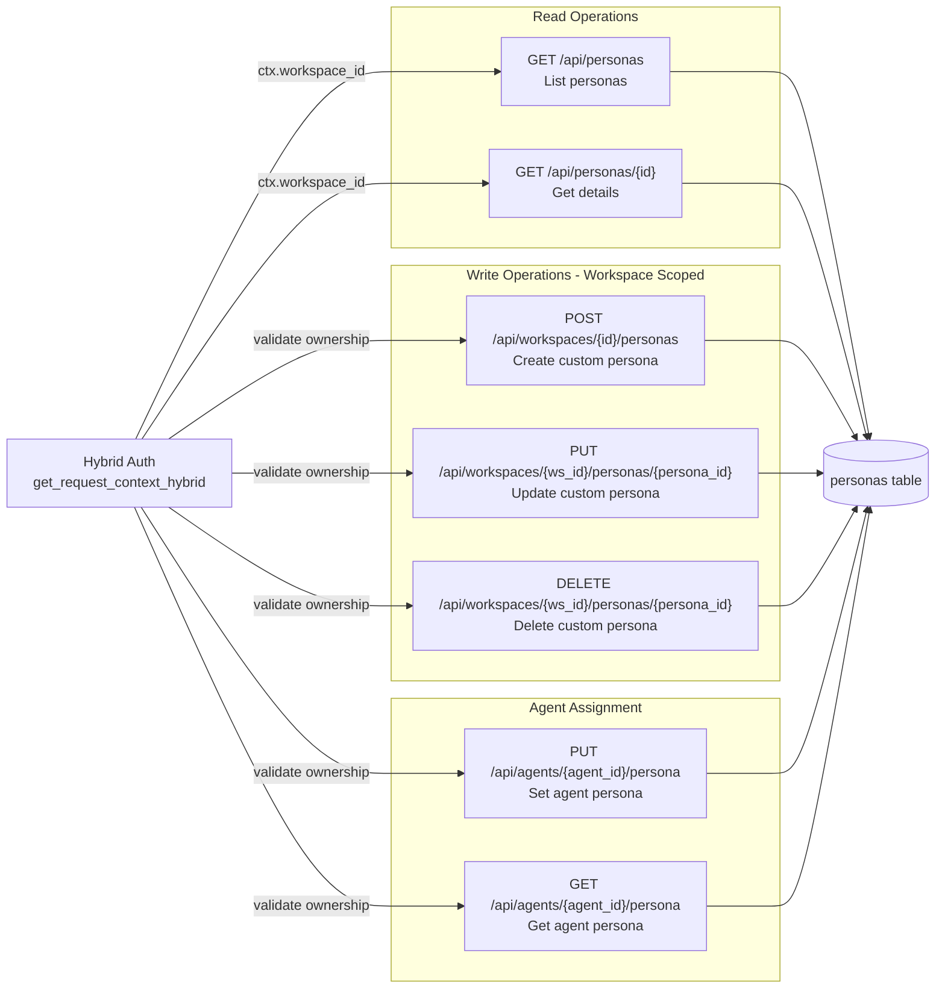
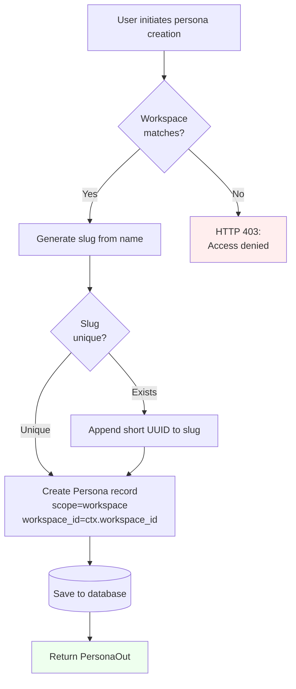
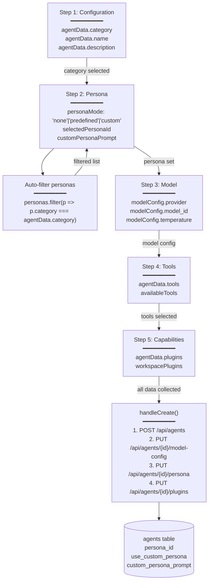

# Agent Personas

<details>
<summary>Relevant source files</summary>

The following files were used as context for generating this wiki page:

- [frontend/app/admin/plugins/page.tsx](frontend/app/admin/plugins/page.tsx)
- [frontend/lib/api-client.ts](frontend/lib/api-client.ts)
- [orchestrator/.env.example](orchestrator/.env.example)
- [orchestrator/api/agent_plugins.py](orchestrator/api/agent_plugins.py)
- [orchestrator/api/chat.py](orchestrator/api/chat.py)
- [orchestrator/api/routing.py](orchestrator/api/routing.py)
- [orchestrator/config.py](orchestrator/config.py)
- [orchestrator/consumers/chatbot/auto.py](orchestrator/consumers/chatbot/auto.py)
- [orchestrator/consumers/chatbot/intent_classifier.py](orchestrator/consumers/chatbot/intent_classifier.py)
- [orchestrator/consumers/chatbot/personality.py](orchestrator/consumers/chatbot/personality.py)
- [orchestrator/consumers/chatbot/smart_orchestrator.py](orchestrator/consumers/chatbot/smart_orchestrator.py)
- [orchestrator/consumers/chatbot/smart_tool_router.py](orchestrator/consumers/chatbot/smart_tool_router.py)
- [orchestrator/core/database/load_seed_data.py](orchestrator/core/database/load_seed_data.py)
- [orchestrator/core/models/system_settings.py](orchestrator/core/models/system_settings.py)
- [orchestrator/core/routing/engine.py](orchestrator/core/routing/engine.py)
- [orchestrator/core/seeds/seed_personas.py](orchestrator/core/seeds/seed_personas.py)
- [orchestrator/core/seeds/seed_plugin_categories.py](orchestrator/core/seeds/seed_plugin_categories.py)
- [orchestrator/core/services/plugin_cache.py](orchestrator/core/services/plugin_cache.py)
- [orchestrator/main.py](orchestrator/main.py)
- [orchestrator/modules/tools/discovery/__init__.py](orchestrator/modules/tools/discovery/__init__.py)
- [orchestrator/scripts/setup_jira_trigger.py](orchestrator/scripts/setup_jira_trigger.py)
- [scripts/ralph/prd.json](scripts/ralph/prd.json)

</details>


## Purpose and Scope

Agent Personas define the personality, behavior, and voice of AI agents in the Automatos AI platform. A persona consists of a system prompt, voice description, suggested model parameters, and categorization metadata that shapes how an agent communicates and approaches tasks.

This document covers:
- The `Persona` database model and its fields
- Global (platform-wide) vs workspace-custom persona scopes
- How agents are assigned personas during creation
- Persona resolution during runtime context assembly
- API endpoints for persona CRUD operations

For information about creating and configuring agents, see [Creating Agents](#3.1). For details on how personas integrate with plugins and tools during context assembly, see [Agent Context Assembly](#3.5).

**Sources:** [orchestrator/core/models/personas.py:1-48](), [orchestrator/api/personas.py:1-10]()

---

## Persona Data Model

The `Persona` model is defined in the `personas` table and represents both predefined (global) and workspace-specific personality profiles.



### Key Fields

| Field | Type | Purpose |
|-------|------|---------|
| `slug` | String(100) | Unique URL-safe identifier, used in API references |
| `name` | String(255) | Human-readable display name |
| `system_prompt` | Text | The core instruction text injected into agent context |
| `voice_description` | String(500) | Describes the persona's communication style |
| `category` | String(100) | Organizational grouping (e.g., "Engineering", "Sales") |
| `suggested_temperature` | Float | Recommended sampling temperature (0.0-2.0) |
| `scope` | String(20) | Either `"global"` (platform-wide) or `"workspace"` (custom) |
| `workspace_id` | UUID | Foreign key to `workspaces` table, null for global personas |

**Sources:** [orchestrator/core/models/personas.py:22-48]()

---

## Persona Scopes: Global vs Workspace

Personas exist in two scopes:

### Global Personas

- **Scope:** `"global"`
- **Workspace ID:** `null`
- **Visibility:** Available to all workspaces
- **Source:** Seeded at database initialization from predefined templates
- **Management:** Platform administrators only
- **Examples:** "Senior Engineer", "Sales Development Representative", "DevOps / SRE Engineer"

### Workspace Personas

- **Scope:** `"workspace"`
- **Workspace ID:** Set to the owning workspace UUID
- **Visibility:** Only visible to users within that workspace
- **Source:** Created by workspace members via API
- **Management:** Workspace members with appropriate permissions
- **Use Case:** Custom personalities tailored to team-specific needs

### Scope Filtering Query

When listing personas, the API filters based on the requesting user's workspace context:

```sql
-- Show global personas + user's workspace personas
SELECT * FROM personas
WHERE is_active = true
  AND (scope = 'global' OR workspace_id = :user_workspace_id)
ORDER BY category ASC, name ASC;
```

**Sources:** [orchestrator/api/personas.py:165-205](), [orchestrator/core/models/personas.py:43-44]()

---

## Predefined Personas

The platform ships with 8 predefined global personas seeded during database initialization. These are loaded by the `seed_personas` function.



### Example: Senior Engineer Persona

```python
{
    "slug": "senior-engineer",
    "name": "Senior Engineer",
    "category": "Engineering",
    "system_prompt": (
        "You are a senior software engineer with deep expertise in system design, "
        "code quality, and best practices. You write clean, maintainable code and "
        "always consider edge cases, performance implications, and security. "
        "When reviewing code or discussing architecture, you explain your reasoning "
        "clearly and suggest concrete improvements. You mentor junior developers "
        "patiently and help them grow."
    ),
    "voice_description": "Technical, precise, patient. Explains complex concepts clearly.",
    "suggested_temperature": 0.5,
    "suggested_models": ["gpt-4-turbo-preview", "claude-3-opus-20240229"],
    "tags": ["engineering", "code-quality", "architecture", "mentoring"]
}
```

### Seeding Process

The `seed_personas` function in `load_seed_data.py` performs idempotent upserts:

1. For each predefined persona definition, query by `slug`
2. If exists, update fields if changed (name, description, system_prompt, etc.)
3. If not exists, insert new record
4. Log counts: created, updated, unchanged

**Sources:** [orchestrator/core/seeds/seed_personas.py:19-140](), [orchestrator/core/database/load_seed_data.py:146-156]()

---

## Agent-Persona Assignment

Agents store persona assignment through three fields on the `agents` table:

| Field | Type | Purpose |
|-------|------|---------|
| `persona_id` | UUID (FK) | Reference to a `personas` record |
| `custom_persona_prompt` | Text | Freeform custom system prompt |
| `use_custom_persona` | Boolean | Flag to use custom prompt instead of persona_id |

### Three Persona Modes

The platform supports three distinct persona modes, implemented both in the frontend and backend:

**Title: Persona Mode State Machine**


**Mode 1: No Persona (`personaMode = 'none'`)**
- `persona_id` is `null`
- `use_custom_persona` is `false`
- `custom_persona_prompt` is empty or null
- Agent has no persona-based system prompt, relies only on plugins/tools
- Used for purely functional agents without personality

**Mode 2: Predefined Persona (`personaMode = 'predefined'`)**
- `persona_id` is set to a valid persona UUID
- `use_custom_persona` is `false`
- System uses the referenced persona's `system_prompt`
- Inherits `suggested_temperature` from the persona record
- UI shows persona name, category, and voice description

**Mode 3: Custom Prompt (`personaMode = 'custom'`)**
- `custom_persona_prompt` contains freeform text
- `use_custom_persona` is `true`
- System ignores `persona_id` and uses the custom prompt
- User has full control over the agent's personality
- Can be pre-filled by switching from predefined mode

### Frontend Persona Selection Flow

**Title: Frontend Persona Mode Selection in CreateAgentModal**


### Assignment via API

The `/api/agents/{agent_id}/persona` endpoint allows setting or updating an agent's persona:

**Predefined Persona Assignment:**
```http
PUT /api/agents/123/persona
{
  "persona_id": "550e8400-e29b-41d4-a716-446655440000",
  "use_custom": false
}
```

**Custom Prompt Assignment:**
```http
PUT /api/agents/123/persona
{
  "custom_prompt": "You are a specialized blockchain security auditor...",
  "use_custom": true
}
```

**Clear Persona (No Persona Mode):**
```http
PUT /api/agents/123/persona
{
  "persona_id": null,
  "custom_prompt": null,
  "use_custom": false
}
```

### Frontend Implementation Details

The persona selection UI is implemented in two key locations:

**1. Agent Creation Wizard** (`CreateAgentModal` component)
- Step 2 of 5-step wizard
- Three-card layout for mode selection (none/predefined/custom)
- Auto-filters personas by agent category from Step 1
- Pre-fills custom prompt when switching from predefined mode

**2. Agent Configuration Modal** (`AgentConfigurationModal` component)
- "Persona" tab in agent settings
- Shows current persona name and prompt
- Allows switching between modes
- Saves immediately via `handleSavePersona` function

**Sources:** [frontend/components/agents/create-agent-modal.tsx:89-329](), [frontend/components/agents/agent-configuration-modal.tsx:123-447](), [orchestrator/api/personas.py:316-381]()

---

## Persona Resolution in Context Assembly

During runtime, when an agent executes a task, the system assembles its full context including the persona's system prompt. This occurs in the `get_assembled_context` endpoint at `/api/agents/{agent_id}/assembled-context`.

**Title: Runtime Context Assembly with Persona Resolution**


### Context Assembly Logic

The persona resolution logic prioritizes custom prompts over predefined personas, with fallback to no-persona mode. This is implemented in the `get_assembled_context` endpoint:

```python
# From agent_plugins.py - get_assembled_context endpoint

# 1. Resolve model & temperature from agent.model_config
model_cfg = agent.model_config or {}
model_id = model_cfg.get("model_id", "gpt-4")
temperature = model_cfg.get("temperature", 0.7)

# 2. Build persona section (3-mode resolution)
persona_info = {"name": None, "source": None}
persona_prompt = ""

if agent.use_custom_persona and agent.custom_persona_prompt:
    # Mode 3: Custom prompt takes precedence
    persona_prompt = agent.custom_persona_prompt
    persona_info = {"name": "Custom Persona", "source": "custom"}
    
elif agent.persona_id:
    # Mode 2: Predefined persona lookup
    persona = db.query(Persona).filter(Persona.id == agent.persona_id).first()
    if persona:
        persona_prompt = persona.system_prompt or ""
        # Override temperature from persona if provided
        temperature = persona.suggested_temperature or temperature
        persona_info = {
            "name": persona.name,
            "slug": persona.slug,
            "category": persona.category,
            "voice_description": persona.voice_description
        }
else:
    # Mode 1: No persona (persona_prompt remains empty string)
    pass

# 3. Load plugin content (Tier1 summary + Tier2 details)
plugin_rows = plugin_svc.get_assigned_plugins(agent_id)
tier1 = plugin_svc.build_tier1_summary(plugin_rows)
tier2 = await plugin_svc.build_tier2_content(plugin_rows)

# 4. Assemble final system_prompt
sections = []
if persona_prompt:
    sections.append(persona_prompt)
if tier1:
    sections.append(tier1)
if tier2:
    sections.append(tier2)

system_prompt = "\n\n".join(sections)
```

### Temperature Override Behavior

When a predefined persona is used, the persona's `suggested_temperature` overrides the agent's model configuration:

| Source | Priority | Example Value |
|--------|----------|---------------|
| Persona `suggested_temperature` | 1 (Highest) | 0.5 (Senior Engineer persona) |
| Agent `model_config.temperature` | 2 | 0.7 (default from model selector) |
| System default | 3 (Fallback) | 0.7 (hardcoded) |

This allows persona designers to specify optimal sampling parameters for each personality type. For example:
- **Senior Engineer** persona: `suggested_temperature = 0.5` (more deterministic, code-focused)
- **Content Strategist** persona: `suggested_temperature = 0.9` (more creative, varied output)

**Sources:** [orchestrator/api/agent_plugins.py:240-288]()

### Output Structure

The `AssembledContextOut` response provides the complete runtime context for the agent, including resolved persona details:

```json
{
  "agent_id": 123,
  "model": "gpt-4-turbo-preview",
  "temperature": 0.5,
  "system_prompt": "<persona_prompt>\n\n<plugin_tier1>\n\n<plugin_tier2>",
  "persona": {
    "name": "Senior Engineer",
    "slug": "senior-engineer",
    "category": "Engineering",
    "voice_description": "Technical, precise, patient. Explains complex concepts clearly."
  },
  "plugins_loaded": ["code-review-plugin", "security-scanner"],
  "tools": [
    {
      "name": "GITHUB",
      "actions": ["CREATE_ISSUE", "GET_PR"]
    }
  ],
  "token_estimate": 2847
}
```

**Field Descriptions:**

| Field | Type | Description |
|-------|------|-------------|
| `agent_id` | Integer | Unique agent identifier |
| `model` | String | Resolved LLM model ID (from `model_config.model_id`) |
| `temperature` | Float | Final sampling temperature (persona override applied) |
| `system_prompt` | String | Complete assembled system prompt (persona + plugins) |
| `persona` | Object | Persona metadata (null if no persona assigned) |
| `persona.name` | String | Display name of the persona |
| `persona.slug` | String | URL-safe identifier for the persona |
| `persona.category` | String | Persona category (e.g., "Engineering") |
| `persona.voice_description` | String | Communication style description |
| `plugins_loaded` | Array[String] | List of plugin slugs included in context |
| `tools` | Array[Object] | Composio tools available to the agent |
| `token_estimate` | Integer | Estimated token count for the full system_prompt |

**Usage Example:**

Frontend components use this endpoint to display the agent's current configuration and preview the assembled context before execution:

```typescript
// From agent-details-modal.tsx
const { data: assembledContext } = useQuery({
  queryKey: ['agents', agentId, 'assembled-context'],
  queryFn: () => apiClient.request(`/api/agents/${agentId}/assembled-context`)
})

// Display persona info
{assembledContext?.persona?.name && (
  <div className="persona-badge">
    <User className="w-4 h-4" />
    {assembledContext.persona.name}
  </div>
)}
```

**Sources:** [orchestrator/api/agent_plugins.py:211-337]()

---

## Persona API Endpoints

The Personas API provides REST endpoints under the `/api/personas` prefix for listing, retrieving, and managing personas.



### Endpoint Reference

| Method | Endpoint | Auth | Purpose |
|--------|----------|------|---------|
| GET | `/api/personas` | Required | List global + workspace personas (filtered by user's workspace) |
| GET | `/api/personas/{persona_id}` | Required | Get full persona details including system_prompt |
| GET | `/api/personas/categories` | Required | List available persona categories |
| POST | `/api/workspaces/{workspace_id}/personas` | Required | Create custom workspace persona |
| PUT | `/api/workspaces/{workspace_id}/personas/{persona_id}` | Required | Update custom workspace persona |
| DELETE | `/api/workspaces/{workspace_id}/personas/{persona_id}` | Required | Deactivate custom workspace persona |
| GET | `/api/agents/{agent_id}/persona` | Required | Get agent's current persona assignment |
| PUT | `/api/agents/{agent_id}/persona` | Required | Set/update agent's persona |

### List Personas Query Parameters

| Parameter | Type | Description |
|-----------|------|-------------|
| `category` | String | Filter by category (e.g., "Engineering", "Sales") |
| `scope` | String | Filter by scope: `"all"`, `"global"`, `"workspace"` |

**Example Request:**

```http
GET /api/personas?category=Engineering&scope=all
Authorization: Bearer <clerk_jwt>
X-Workspace-ID: <workspace_uuid>
```

**Example Response:**

```json
{
  "items": [
    {
      "id": "550e8400-e29b-41d4-a716-446655440000",
      "slug": "senior-engineer",
      "name": "Senior Engineer",
      "description": "Experienced software engineer...",
      "voice_description": "Technical, precise, patient...",
      "category": "Engineering",
      "suggested_temperature": 0.5,
      "scope": "global",
      "is_active": true
    },
    {
      "id": "660e8400-e29b-41d4-a716-446655440001",
      "slug": "custom-backend-specialist",
      "name": "Custom Backend Specialist",
      "description": "Our team's specialized backend persona...",
      "category": "Engineering",
      "scope": "workspace",
      "workspace_id": "770e8400-e29b-41d4-a716-446655440002",
      "is_active": true
    }
  ],
  "total": 2
}
```

**Sources:** [orchestrator/api/personas.py:165-211](), [orchestrator/api/personas.py:214-242]()

---

## Creating Custom Personas

Workspace members can create custom personas tailored to their team's needs.

### Creation Flow



### Request Body Schema

```json
{
  "name": "Custom Backend Specialist",
  "description": "Specialized in Python FastAPI microservices with PostgreSQL",
  "system_prompt": "You are an expert backend engineer specialized in...",
  "voice_description": "Direct, code-focused, performance-conscious",
  "category": "Engineering",
  "suggested_temperature": 0.4
}
```

### Slug Generation

The `_slugify` helper function converts the persona name into a URL-safe slug:

1. Convert to lowercase
2. Remove non-alphanumeric characters (except spaces and hyphens)
3. Replace spaces/multiple hyphens with single hyphen
4. Truncate to 100 characters
5. If slug already exists, append 8-character UUID segment

**Example:** `"Custom Backend Specialist"` → `"custom-backend-specialist"` or `"custom-backend-specialist-a3f8c921"`

### Validation Rules

| Field | Constraint |
|-------|-----------|
| `name` | Required, 1-255 characters |
| `voice_description` | Optional, max 500 characters |
| `category` | Optional, max 100 characters |
| `suggested_temperature` | Optional, 0.0 - 2.0 range |
| `system_prompt` | Optional, no length limit (Text type) |
| `workspace_id` | Must match authenticated user's workspace |

**Sources:** [orchestrator/api/personas.py:245-307](), [orchestrator/api/personas.py:114-120]()

---

## Integration with Agent Creation Wizard

The 5-step agent creation wizard (`CreateAgentModal` component) implements persona selection at **Step 2: Persona**, with automatic category filtering and smart pre-filling.

**Title: Agent Creation Wizard Data Flow**


### Category-Based Persona Filtering

When the user selects an agent category in Step 1 (e.g., "Engineering", "Sales"), Step 2 automatically filters the persona list to show only relevant personas:

```typescript
// From CreateAgentModal.tsx
personas
  .filter(p => 
    !agentData.category || 
    agentData.category === 'custom' || 
    p.category?.toLowerCase() === agentData.category.toLowerCase()
  )
  .map(persona => ...)
```

This reduces cognitive load by showing only contextually relevant personas. For example:
- **Category: Engineering** → Shows "Senior Engineer", "Code Reviewer", "DevOps / SRE Engineer"
- **Category: Sales** → Shows "Sales Development Representative", "Account Executive", "Customer Success Manager"
- **Category: Custom** → Shows all personas

### Pre-Fill Behavior

When switching from **predefined** to **custom** mode, the UI pre-fills the custom prompt textarea with the selected persona's `system_prompt`:

```typescript
// From CreateAgentModal.tsx useEffect hook
useEffect(() => {
  if (personaMode === 'custom' && selectedPersonaId && !customPersonaPrompt) {
    const persona = personas.find(p => p.id === selectedPersonaId)
    if (persona?.system_prompt) {
      setCustomPersonaPrompt(persona.system_prompt)
    }
  }
}, [personaMode, selectedPersonaId, personas, customPersonaPrompt])
```

This allows users to start with a proven template and customize it to their needs.

### Persona Assignment in Agent Creation

The `handleCreate` function orchestrates multiple API calls to set up the agent:

```typescript
// 1. Create agent
const newAgent = await createAgentMutation.mutateAsync(agentPayload)

// 2. Set model configuration
await updateModelConfigMutation.mutateAsync({
  agentId: newAgent.id,
  modelConfig
})

// 3. Set persona (if personaMode !== 'none')
if (personaMode !== 'none') {
  const personaPayload: any = { use_custom: false }
  if (personaMode === 'predefined' && selectedPersonaId) {
    personaPayload.persona_id = selectedPersonaId
  } else if (personaMode === 'custom' && customPersonaPrompt) {
    personaPayload.custom_prompt = customPersonaPrompt
    personaPayload.use_custom = true
  }
  await apiClient.request(`/api/agents/${newAgent.id}/persona`, {
    method: 'PUT',
    body: personaPayload,
  })
}
```

### UI Components

The persona selection UI presents:

1. **Three-card mode selector**
   - No Persona card (Bot icon)
   - Predefined card (User icon)
   - Custom card (PenLine icon)

2. **Persona browser** (predefined mode)
   - Scrollable list of filtered personas
   - Expandable system prompt previews (ChevronDown/ChevronUp)
   - Badge showing persona category
   - Temperature display

3. **Custom prompt editor** (custom mode)
   - Textarea with placeholder text
   - Character count
   - Tip about pre-filling from predefined

**Sources:** [frontend/components/agents/create-agent-modal.tsx:184-338](), [frontend/components/agents/create-agent-modal.tsx:528-696]()

---

## Sources Summary

**Core Models:**
- [orchestrator/core/models/personas.py:1-48]() - Persona ORM model definition
- [orchestrator/core/models/__init__.py:21]() - Model import

**Seeding:**
- [orchestrator/core/seeds/seed_personas.py:1-214]() - Predefined persona definitions
- [orchestrator/core/database/load_seed_data.py:146-156]() - Persona seeding invocation

**API Endpoints:**
- [orchestrator/api/personas.py:1-381]() - Complete Personas API router
- [orchestrator/api/agent_plugins.py:211-337]() - Context assembly with persona resolution
- [orchestrator/api/agents.py:359-428]() - Agent creation with persona assignment

**Main Application:**
- [orchestrator/main.py:83]() - Personas router registration

---