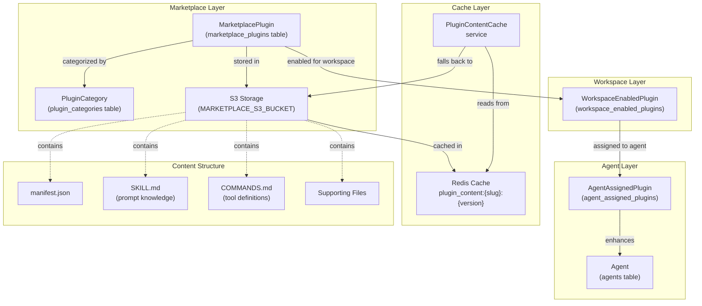
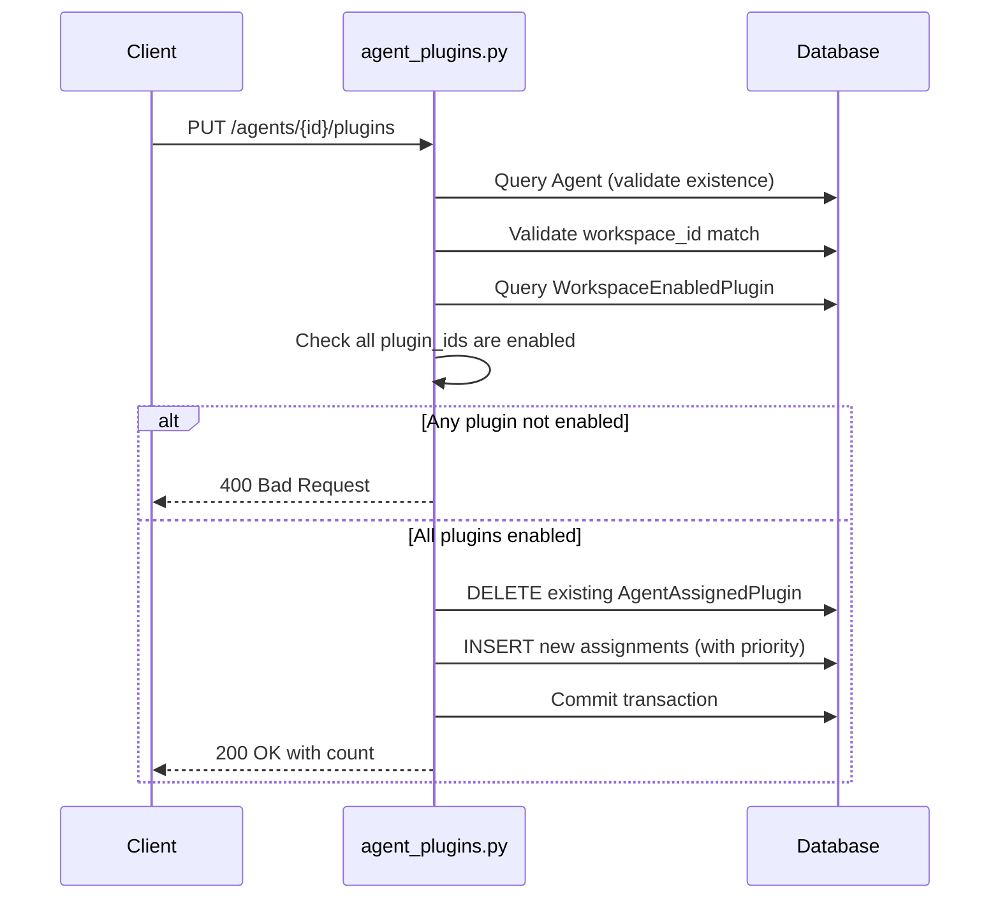
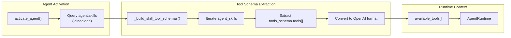
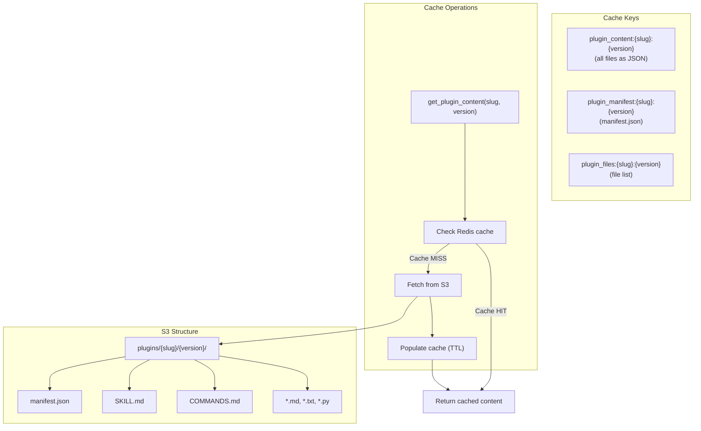
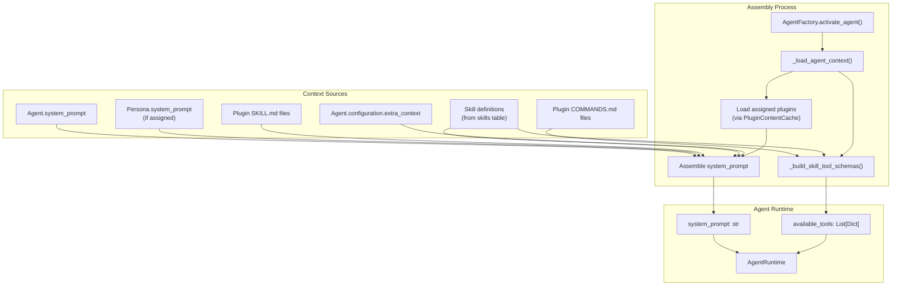
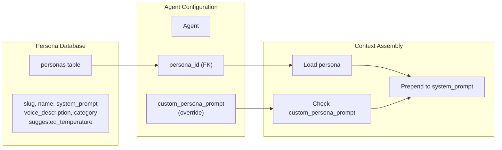

# Agent Plugins & Skills

<details>
<summary>Relevant source files</summary>

The following files were used as context for generating this wiki page:

- [frontend/app/admin/plugins/page.tsx](frontend/app/admin/plugins/page.tsx)
- [frontend/lib/api-client.ts](frontend/lib/api-client.ts)
- [frontend/tsconfig.tsbuildinfo](frontend/tsconfig.tsbuildinfo)
- [orchestrator/.env.example](orchestrator/.env.example)
- [orchestrator/api/agent_plugins.py](orchestrator/api/agent_plugins.py)
- [orchestrator/api/workflows.py](orchestrator/api/workflows.py)
- [orchestrator/config.py](orchestrator/config.py)
- [orchestrator/consumers/chatbot/service.py](orchestrator/consumers/chatbot/service.py)
- [orchestrator/core/database/load_seed_data.py](orchestrator/core/database/load_seed_data.py)
- [orchestrator/core/llm/manager.py](orchestrator/core/llm/manager.py)
- [orchestrator/core/seeds/seed_personas.py](orchestrator/core/seeds/seed_personas.py)
- [orchestrator/core/seeds/seed_plugin_categories.py](orchestrator/core/seeds/seed_plugin_categories.py)
- [orchestrator/core/services/plugin_cache.py](orchestrator/core/services/plugin_cache.py)
- [orchestrator/main.py](orchestrator/main.py)
- [orchestrator/modules/agents/factory/agent_factory.py](orchestrator/modules/agents/factory/agent_factory.py)
- [orchestrator/modules/orchestrator/pipeline.py](orchestrator/modules/orchestrator/pipeline.py)
- [orchestrator/modules/orchestrator/service.py](orchestrator/modules/orchestrator/service.py)
- [scripts/ralph/prd.json](scripts/ralph/prd.json)

</details>


This page describes how plugins and skills enhance agent capabilities in Automatos AI. Plugins are reusable packages of knowledge (prompts) and executable tools that can be assigned to agents to extend their functionality. Skills are agent-level capabilities that can define both prompt-based knowledge and OpenAI-compatible tool schemas.

For agent creation and basic configuration, see [Creating Agents](#3.1). For how agents are instantiated at runtime, see [Agent Factory & Runtime](#3.5).

---

## Overview

Agents in Automatos AI have two enhancement mechanisms:

1. **Plugins** - Marketplace packages containing `SKILL.md` (prompt knowledge), `COMMANDS.md` (tool definitions), and optional supporting files. Plugins are shared across workspaces via the community marketplace and must be explicitly enabled per workspace before assignment to agents.

2. **Skills** - Database records (from the `skills` table) that can be directly assigned to agents. Skills may define a `tools_schema` JSONB field containing OpenAI function calling schemas, giving agents executable "superpowers" beyond prompt-based knowledge.

Both mechanisms inject content into the agent's system prompt and can provide executable tools during runtime.

**Sources:** [orchestrator/api/agent_plugins.py:1-20](), [orchestrator/modules/agents/factory/agent_factory.py:233-296]()

---

## Plugin System Architecture



**Three-Tier Permission Model:**

1. **Marketplace** - Global plugin registry. Plugins have `approval_status` (`pending`, `approved`, `rejected`) and `owner_type` (`marketplace` or `workspace`).
2. **Workspace Enablement** - Workspace admins enable specific plugins via `WorkspaceEnabledPlugin` records.
3. **Agent Assignment** - Agent builders assign enabled plugins to individual agents via `AgentAssignedPlugin` records with priority ordering.

**Sources:** [orchestrator/api/agent_plugins.py:69-124](), [orchestrator/core/services/plugin_cache.py:1-28]()

---

## Database Schema

| Table | Purpose | Key Columns |
|-------|---------|-------------|
| `marketplace_plugins` | Global plugin registry | `id`, `slug`, `version`, `name`, `approval_status`, `owner_type`, `skills_count`, `commands_count` |
| `plugin_categories` | Plugin categorization | `id`, `slug`, `name`, `icon`, `sort_order` |
| `workspace_enabled_plugins` | Workspace-level enablement | `workspace_id`, `plugin_id`, `enabled_at`, `enabled_by` |
| `agent_assigned_plugins` | Agent-level assignment | `agent_id`, `plugin_id`, `priority`, `assigned_at` |
| `skills` | Skill definitions (alternative to plugins) | `id`, `name`, `category`, `description`, `tools_schema` (JSONB) |

The `tools_schema` field in the `skills` table has this structure:

```json
{
  "tools": [
    {
      "name": "tool_name",
      "description": "What this tool does",
      "parameters": {
        "type": "object",
        "properties": {
          "param1": {
            "type": "string",
            "description": "Parameter description"
          }
        },
        "required": ["param1"]
      }
    }
  ]
}
```

**Sources:** [orchestrator/api/agent_plugins.py:32-62](), [orchestrator/modules/agents/factory/agent_factory.py:233-296]()

---

## Plugin Assignment API

### List Agent Plugins

```
GET /api/agents/{agent_id}/plugins
```

Returns plugins assigned to an agent, joined with marketplace metadata:

```json
{
  "items": [
    {
      "plugin_id": "uuid",
      "slug": "code-review-expert",
      "name": "Code Review Expert",
      "version": "1.0.0",
      "description": "Advanced code review capabilities",
      "skills_count": 3,
      "commands_count": 5,
      "token_estimate": 2400,
      "priority": 0,
      "assigned_at": "2024-01-15T10:30:00Z"
    }
  ]
}
```

**Validation:**
- Agent must exist in database
- Agent's `workspace_id` must match authenticated user's workspace

**Sources:** [orchestrator/api/agent_plugins.py:69-124]()

---

### Update Agent Plugins

```
PUT /api/agents/{agent_id}/plugins
```

Replaces all plugin assignments for an agent:

```json
{
  "plugin_ids": [
    "uuid-1",
    "uuid-2",
    "uuid-3"
  ]
}
```

**Validation Logic:**



**Priority Assignment:** Plugins are assigned priorities 0, 10, 20, ... in the order provided, allowing insertion of plugins between existing ones without reordering all records.

**Sources:** [orchestrator/api/agent_plugins.py:127-194]()

---

## Skill Tool Loading in Agent Factory

When an agent is activated, the `AgentFactory` extracts executable tools from skills via `_build_skill_tool_schemas()`:



**Implementation:** [orchestrator/modules/agents/factory/agent_factory.py:233-296]()

```python
def _build_skill_tool_schemas(agent_skills: List) -> List[Dict]:
    """
    Extract executable tool schemas from agent skills.
    Skills can define tools in their tools_schema field (JSONB).
    """
    tools = []
    
    for skill in agent_skills:
        if not hasattr(skill, 'tools_schema') or not skill.tools_schema:
            continue
        
        skill_tools = skill.tools_schema.get('tools', [])
        
        for tool_def in skill_tools:
            # Convert to OpenAI function calling format
            tools.append({
                "type": "function",
                "function": {
                    "name": tool_def.get('name'),
                    "description": tool_def.get('description'),
                    "parameters": tool_def.get('parameters', {
                        "type": "object",
                        "properties": {},
                        "required": []
                    })
                }
            })
    
    return tools
```

**Key Points:**
- Skills without `tools_schema` are skipped (they only contribute prompt knowledge)
- Tools are converted to OpenAI function calling format (`{"type": "function", "function": {...}}`)
- Multiple skills can contribute tools; all are merged into a single `available_tools` array
- Tool execution happens later via `ToolRouter` when the LLM requests a tool call

**Sources:** [orchestrator/modules/agents/factory/agent_factory.py:233-296]()

---

## Plugin Content Caching

The `PluginContentCache` service wraps `MarketplaceS3Service` with Redis caching to reduce S3 API calls:



**Cache Behavior:**

1. **TTL:** Configurable via `PLUGIN_CACHE_TTL_SECONDS` env var (default: 3600 seconds)
2. **Graceful Degradation:** If Redis is unavailable, falls back to direct S3 access
3. **Content Format:** Files are returned as `{relative_path: content}` dictionary
4. **Invalidation:** Not implemented; cache entries expire naturally after TTL

**Example Usage:**

```python
cache = PluginContentCache()
files = await cache.get_plugin_content("code-review-expert", "1.0.0")
# Returns: {
#   "SKILL.md": "# Code Review Expert...",
#   "COMMANDS.md": "## scan_for_bugs...",
#   "examples/python.md": "..."
# }
```

**Sources:** [orchestrator/core/services/plugin_cache.py:22-159]()

---

## Plugin Categories

Plugins are organized into predefined categories for marketplace browsing:

| Category | Icon | Examples |
|----------|------|----------|
| Code Review | 🔍 | Static analysis, linting, security scanning |
| Testing | 🧪 | Test generation, coverage analysis |
| Documentation | 📝 | Doc generation, API documentation |
| Deployment | 🚀 | CI/CD, rollback management |
| Monitoring | 📊 | Observability, alerting |
| SEO | 🔎 | Keyword research, ranking analysis |
| Content | ✍️ | Content creation, scheduling |
| Analytics | 📈 | Marketing analytics, attribution |
| Outreach | 📧 | Email sequences, prospecting |
| CRM | 🤝 | Contact management, deal tracking |
| Ticketing | 🎫 | Support automation, triage |
| Knowledge Base | 📚 | FAQ generation, self-service |

Categories are seeded via `seed_plugin_categories()` on database initialization. Each category has:
- `slug` (unique identifier)
- `name` (display name)
- `description` (usage guidance)
- `icon` (emoji)
- `sort_order` (marketplace display order)

**Sources:** [orchestrator/core/seeds/seed_plugin_categories.py:19-167]()

---

## Assembled Agent Context

When an agent executes, its context is assembled from multiple sources:



**Context Priority Order:**

1. **Base System Prompt** - Agent's own `system_prompt` field
2. **Persona** - If `persona_id` is set, persona's `system_prompt` is prepended
3. **Plugin Skills** - `SKILL.md` from assigned plugins (ordered by priority)
4. **Skill Definitions** - Skill descriptions from `skills` table
5. **Extra Context** - Agent's `configuration.extra_context` field (appended)

**Tool Availability:**

- Tools from plugin `COMMANDS.md` (parsed and converted)
- Tools from skill `tools_schema` (OpenAI format)
- Platform tools (search_knowledge, read_file, etc.)
- Composio tools (if agent has app assignments)

**Token Estimation:** The `token_estimate` field on plugins provides guidance for context window management. Agents with many plugins may exceed model context limits.

**Sources:** [orchestrator/modules/agents/factory/agent_factory.py:590-650](), [orchestrator/api/agent_plugins.py:196-270]()

---

## Get Assembled Context API

```
GET /api/agents/{agent_id}/context
```

Returns the fully assembled context for an agent:

```json
{
  "agent_id": 42,
  "model": "gpt-4-turbo-preview",
  "temperature": 0.7,
  "system_prompt": "You are a senior software engineer...\n\n# Code Review Expert\n...",
  "persona": {
    "slug": "senior-engineer",
    "name": "Senior Engineer",
    "voice_description": "Technical, precise, patient"
  },
  "plugins_loaded": [
    "code-review-expert@1.0.0",
    "testing-automation@2.1.0"
  ],
  "tools": [
    {
      "type": "function",
      "function": {
        "name": "scan_for_bugs",
        "description": "Static analysis for common bugs",
        "parameters": {...}
      }
    }
  ],
  "token_estimate": 4500
}
```

This endpoint is useful for debugging agent configuration and understanding what context/tools will be available at runtime.

**Sources:** [orchestrator/api/agent_plugins.py:196-270]()

---

## Skills vs Plugins Comparison

| Aspect | Skills | Plugins |
|--------|--------|---------|
| **Storage** | Database (`skills` table) | S3 + Database metadata |
| **Scope** | Global or workspace-specific | Marketplace (global) + workspace enablement |
| **Content** | Name, description, `tools_schema` JSON | Multi-file packages (SKILL.md, COMMANDS.md, etc.) |
| **Tools** | Direct JSON schema in `tools_schema` | Parsed from COMMANDS.md |
| **Distribution** | Seeded by platform or created in workspace | Community marketplace with approval workflow |
| **Versioning** | No versioning | Semantic versioning (major.minor.patch) |
| **Caching** | Database query only | Redis cache layer for S3 content |
| **Assignment** | Many-to-many via `agent_skills` table | Three-tier: marketplace → workspace → agent |

**When to Use Each:**

- **Skills:** Simple, database-only capabilities. Good for platform-provided skills that all agents can access.
- **Plugins:** Complex, multi-file packages. Good for community-contributed knowledge bundles with documentation and examples.

**Sources:** [orchestrator/modules/agents/factory/agent_factory.py:233-296](), [orchestrator/api/agent_plugins.py:1-270]()

---

## Persona Integration

Personas are reusable personality templates that shape agent communication style. While not technically "plugins," they integrate closely with the plugin/skill system:



**Persona Categories:** Engineering, Sales, Marketing, Support, Management

**Example Personas:**
- `senior-engineer` - Technical, precise, patient. Explains complex concepts clearly.
- `code-reviewer` - Thorough, constructive, detail-oriented. Balances criticism with encouragement.
- `devops-sre` - Systematic, ops-minded, calm under pressure. Thinks in terms of reliability.
- `sales-development-rep` - Energetic, consultative, empathetic. Focuses on prospect needs.

**Custom Overrides:** Agents can override their assigned persona via `custom_persona_prompt`, allowing per-agent personality customization while still benefiting from persona's suggested temperature and model settings.

**Sources:** [orchestrator/core/seeds/seed_personas.py:19-210]()

---

## Redis Cache Key Patterns

The plugin system uses these Redis key patterns:

```
plugin_content:{slug}:{version}          # All files as JSON
plugin_manifest:{slug}:{version}         # manifest.json parsed
plugin_files:{slug}:{version}            # File list
```

**Cache Operations:**

- **SET:** When content is fetched from S3 (miss or corrupt cache)
- **GET:** On every agent activation that uses plugins
- **DELETE:** On cache invalidation (not implemented; relies on TTL expiry)
- **TTL:** Configured via `PLUGIN_CACHE_TTL_SECONDS` (default: 3600)

**Graceful Degradation:** All cache operations are wrapped in try-except blocks. If Redis is unavailable, the system falls back to direct S3 access without failing the agent activation.

**Sources:** [orchestrator/core/services/plugin_cache.py:23-114]()

---

## Implementation Summary

**Core Files:**

| File | Purpose |
|------|---------|
| `orchestrator/api/agent_plugins.py` | REST API for plugin assignment |
| `orchestrator/modules/agents/factory/agent_factory.py` | Agent instantiation with plugin/skill loading |
| `orchestrator/core/services/plugin_cache.py` | Redis caching for plugin content |
| `orchestrator/core/seeds/seed_plugin_categories.py` | Marketplace category definitions |
| `orchestrator/core/seeds/seed_personas.py` | Persona definitions |

**Database Tables:**

- `marketplace_plugins` - Plugin registry
- `plugin_categories` - Categories for organization
- `workspace_enabled_plugins` - Workspace-level enablement
- `agent_assigned_plugins` - Agent-level assignment
- `skills` - Alternative skill storage with `tools_schema`
- `personas` - Personality templates

**Key Functions:**

- `list_agent_plugins()` - [orchestrator/api/agent_plugins.py:69-124]()
- `update_agent_plugins()` - [orchestrator/api/agent_plugins.py:127-194]()
- `get_assembled_context()` - [orchestrator/api/agent_plugins.py:196-270]()
- `_build_skill_tool_schemas()` - [orchestrator/modules/agents/factory/agent_factory.py:233-296]()
- `get_plugin_content()` - [orchestrator/core/services/plugin_cache.py:119-159]()

**Sources:** [orchestrator/api/agent_plugins.py:1-270](), [orchestrator/modules/agents/factory/agent_factory.py:1-650](), [orchestrator/core/services/plugin_cache.py:1-200]()

---