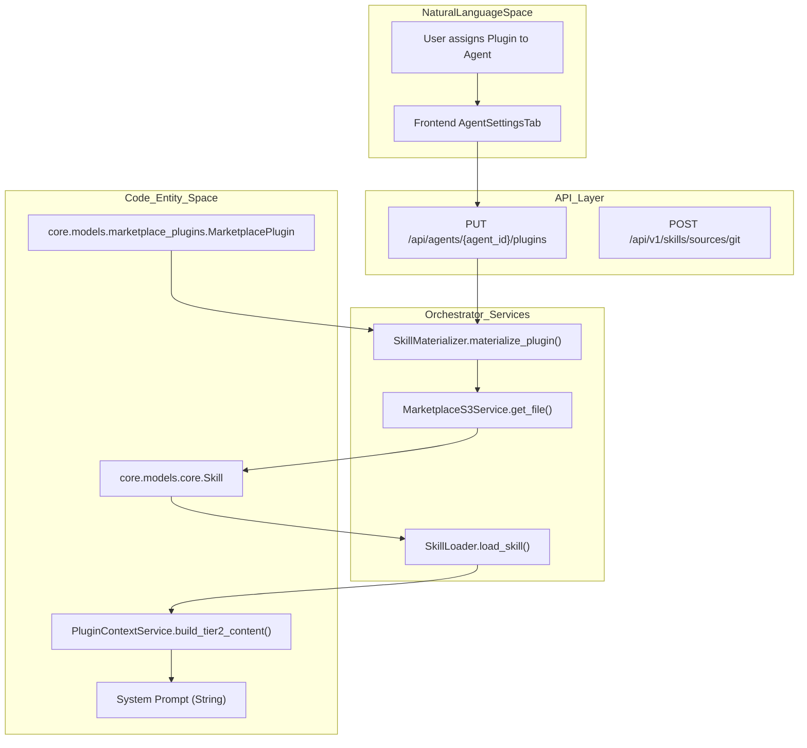
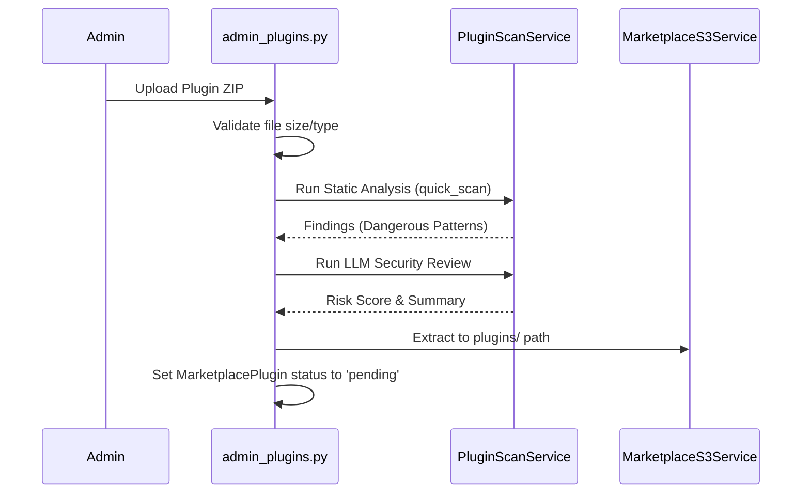

# Agent Plugins & Skills

Relevant source files

The following files were used as context for generating this wiki page:

- [frontend/components/settings/ChannelsSettingsTab.tsx](frontend/components/settings/ChannelsSettingsTab.tsx)
- [orchestrator/alembic/versions/add_content_hash_to_skills.py](orchestrator/alembic/versions/add_content_hash_to_skills.py)
- [orchestrator/alembic/versions/dedupe_skills_unique_workspace_name.py](orchestrator/alembic/versions/dedupe_skills_unique_workspace_name.py)
- [orchestrator/alembic/versions/prd71_unified_skills_architecture.py](orchestrator/alembic/versions/prd71_unified_skills_architecture.py)
- [orchestrator/api/admin_plugins.py](orchestrator/api/admin_plugins.py)
- [orchestrator/api/agent_plugins.py](orchestrator/api/agent_plugins.py)
- [orchestrator/api/skills.py](orchestrator/api/skills.py)
- [orchestrator/core/models/marketplace_plugins.py](orchestrator/core/models/marketplace_plugins.py)
- [orchestrator/core/security/git_sanitizer.py](orchestrator/core/security/git_sanitizer.py)
- [orchestrator/core/services/marketplace_s3.py](orchestrator/core/services/marketplace_s3.py)
- [orchestrator/core/services/plugin_context_service.py](orchestrator/core/services/plugin_context_service.py)
- [orchestrator/core/services/plugin_upload_service.py](orchestrator/core/services/plugin_upload_service.py)
- [orchestrator/core/services/skill_materializer.py](orchestrator/core/services/skill_materializer.py)
- [orchestrator/modules/agents/services/skill_loader.py](orchestrator/modules/agents/services/skill_loader.py)

This page describes the architecture and implementation of plugins and skills in Automatos AI. These systems allow agents to be enhanced with reusable prompt-based knowledge, specialized methodologies, and executable tool schemas.

---

## Overview

Automatos AI utilizes two primary mechanisms for extending agent capabilities:

1.  **Plugins**: Packaged bundles of knowledge and tools distributed via the Marketplace. They contain a `manifest.json`, `SKILL.md` (for prompt injection), and `COMMANDS.md` (for tool definitions) [orchestrator/core/services/plugin_upload_service.py:80-92]().
2.  **Skills**: Atomic units of capability. While originally simple database records, the system now supports a **Unified Skills Architecture** where skills can be "materialized" from plugins or loaded from Git repositories [orchestrator/modules/agents/services/skill_loader.py:1-17]().

**Sources:** [orchestrator/api/agent_plugins.py:1-9](), [orchestrator/core/services/plugin_upload_service.py:80-92](), [orchestrator/modules/agents/services/skill_loader.py:1-17]()

---

## Plugin Lifecycle & Management

The plugin system follows a strict multi-tier enablement flow to ensure security and workspace isolation.

### 1. Marketplace & Admin Flow
Plugins enter the system through the Admin API. They can be uploaded as ZIP files or imported directly from GitHub [orchestrator/api/admin_plugins.py:137-146](). 
- **Security Scanning**: Every upload triggers an automated scan for dangerous patterns (e.g., `__import__`, `eval`, `rm -rf`) and an LLM-based risk assessment [orchestrator/api/admin_plugins.py:163-180]().
- **Approval**: Admins must approve plugins before they appear in the public marketplace [orchestrator/api/admin_plugins.py:203-210]().

### 2. Workspace Enablement
Plugins are not automatically available to all agents. A workspace must first "enable" a plugin, which creates a `WorkspaceEnabledPlugin` record [orchestrator/core/models/marketplace_plugins.py:181-190](). This process is managed via the marketplace UI which filters available items based on workspace membership.

### 3. Agent Assignment
Once enabled in a workspace, plugins are assigned to specific agents via the `AgentAssignedPlugin` table. This assignment includes a `priority` field to determine the order of prompt injection [orchestrator/api/agent_plugins.py:186-192](). Updating assignments via `PUT /api/agents/{agent_id}/plugins` replaces existing assignments and triggers an auto-assignment of materialized skills [orchestrator/api/agent_plugins.py:180-200]().

**Sources:** [orchestrator/api/admin_plugins.py:137-210](), [orchestrator/core/models/marketplace_plugins.py:50-120](), [orchestrator/api/agent_plugins.py:127-194](), [orchestrator/core/models/marketplace_plugins.py:181-190]()

---

## Skill Architecture & Materialization

The system has evolved toward a **Unified Skills Architecture** (PRD-71). Skills are no longer just static text; they are dynamic assets managed by the `SkillLoader` and `SkillMaterializer`.

### Skill Materialization (PRD-71)
The `SkillMaterializer` converts approved plugin `SKILL.md` files into `Skill` database records [orchestrator/core/services/skill_materializer.py:22-28]().
- **Automatic Sync**: When a plugin is approved, the materializer finds all `SKILL.md` files in the plugin's S3 storage [orchestrator/core/services/skill_materializer.py:45-54]().
- **Security Check**: Each skill undergoes a `quick_scan` before being persisted to the database to ensure no malicious prompts are introduced [orchestrator/core/services/skill_materializer.py:91-102]().
- **Metadata Extraction**: YAML frontmatter is parsed to extract the skill name, version, and tool schemas [orchestrator/core/services/skill_materializer.py:106-128]().

### Skill Loading Levels
The `SkillLoader` implements a 3-level progressive loading strategy to optimize performance [orchestrator/modules/agents/services/skill_loader.py:54-67]():
- **Level 1 (Metadata)**: Basic info like name, version, and tags. Cached in `metadata_cache` [orchestrator/modules/agents/services/skill_loader.py:65]().
- **Level 2 (Core)**: The actual prompt template and tool schemas. Cached in `core_cache` [orchestrator/modules/agents/services/skill_loader.py:66]().
- **Level 3 (Resources)**: Heavy assets like supporting documentation or examples. Managed via an `LRUCache` [orchestrator/modules/agents/services/skill_loader.py:184-213]().

**Sources:** [orchestrator/core/services/skill_materializer.py:1-7](), [orchestrator/core/services/skill_materializer.py:22-170](), [orchestrator/modules/agents/services/skill_loader.py:54-67](), [orchestrator/modules/agents/services/skill_loader.py:184-213]()

---

## Technical Data Flow

The following diagrams illustrate the transition from the user's intent to the code execution.

### Plugin Assignment & Skill Materialization Flow
Title: Plugin to Skill Materialization Pipeline

**Sources:** [orchestrator/api/agent_plugins.py:127-133](), [orchestrator/core/services/skill_materializer.py:28-42](), [orchestrator/modules/agents/services/skill_loader.py:219-229](), [orchestrator/core/services/plugin_context_service.py:89-101]()

---

## Data Model & Storage

### Plugin Storage (S3 API)
Plugins are stored in an S3-compatible object store through the platform's single S3 client factory (`orchestrator/core/storage/s3.py`): AWS S3 in the hosted edition, the MinIO container in the local edition (`S3_ENDPOINT_URL`, bucket `MARKETPLACE_S3_BUCKET`). There is no filesystem fallback — the former local-directory path was deleted (PRD-233 S4). The `MarketplaceS3Service` handles the extraction of ZIP contents into a structured key prefix: `plugins/{slug}/{version}/` [orchestrator/core/services/marketplace_s3.py]().

### Database Schema

| Entity | Code Reference | Description |
| :--- | :--- | :--- |
| `MarketplacePlugin` | `core.models.marketplace_plugins.MarketplacePlugin` | Registry for plugin metadata, S3 paths, and `materialized_skill_ids` [orchestrator/core/models/marketplace_plugins.py:50-120](). |
| `Skill` | `core.models.core.Skill` | Database record for a capability, including prompt templates and tool schemas [orchestrator/core/services/skill_materializer.py:15-16](). |
| `AgentAssignedPlugin` | `core.models.marketplace_plugins.AgentAssignedPlugin` | Junction table for agent-plugin mapping with priority [orchestrator/api/agent_plugins.py:79](). |
| `SkillSource` | `core.models.core.SkillSource` | Tracks Git or local sources for skills [orchestrator/modules/agents/services/skill_loader.py:44](). |

**Sources:** [orchestrator/core/models/marketplace_plugins.py:50-120](), [orchestrator/core/services/marketplace_s3.py:39-60](), [orchestrator/core/services/skill_materializer.py:15-16](), [orchestrator/api/agent_plugins.py:79]()

---

## Security and Validation

Security is enforced at multiple layers to prevent prompt injection or malicious code execution via plugins.

1.  **ZIP Safety**: The `PluginUploadService` enforces limits on file counts (max 500), uncompressed sizes (max 10MB/file), and compression ratios to prevent "ZIP bomb" attacks [orchestrator/core/services/plugin_upload_service.py:139-144]().
2.  **Pattern Scanning**: Both plugins and materialized skills undergo a `quick_scan` for dangerous patterns (e.g., `eval`, `exec`, `system`) [orchestrator/modules/agents/services/skill_loader.py:107-131]().
3.  **Git Sanitization**: All Git operations use `git_sanitizer.py` to prevent command injection and SSRF via malicious URLs or branch names [orchestrator/core/security/git_sanitizer.py:1-13]().
4.  **Admin Review**: A dedicated `PluginSecurityScan` record is created for every upload, allowing admins to review `llm_risk_score` and `static_findings` before approval [orchestrator/core/models/marketplace_plugins.py:126-154]().

### Security Scan Logic
Title: Plugin Security Review Sequence

**Sources:** [orchestrator/core/services/plugin_upload_service.py:139-161](), [orchestrator/api/admin_plugins.py:145-180](), [orchestrator/modules/agents/services/skill_loader.py:107-131](), [orchestrator/core/models/marketplace_plugins.py:126-154](), [orchestrator/core/security/git_sanitizer.py:40-76]()

---

## Key Functions & Classes

- `SkillMaterializer.materialize_plugin(plugin)`: Discovers `SKILL.md` files in S3 and creates/updates `Skill` records [orchestrator/core/services/skill_materializer.py:28-42]().
- `SkillLoader.load_skill(skill_id)`: Orchestrates the 3-level loading of a skill from the database or Git [orchestrator/modules/agents/services/skill_loader.py:231-233]().
- `PluginUploadService.upload_plugin()`: Handles the atomic operation of extracting, scanning, and registering a new plugin [orchestrator/core/services/plugin_upload_service.py:105-111]().
- `PluginContextService.build_tier1_summary()`: Generates a lightweight markdown summary of assigned plugins for the system prompt [orchestrator/core/services/plugin_context_service.py:58-65]().
- `PluginContextService.build_tier2_content()`: Fetches full `SKILL.md` content and tool schemas for the most relevant plugins [orchestrator/core/services/plugin_context_service.py:89-101]().
- `recommend_skills_for_task()`: Lexical scoring approach to suggest skills based on task description [orchestrator/api/skills.py:142-151]().

**Sources:** [orchestrator/core/services/skill_materializer.py:28-42](), [orchestrator/modules/agents/services/skill_loader.py:231-233](), [orchestrator/core/services/plugin_upload_service.py:105-111](), [orchestrator/core/services/plugin_context_service.py:58-101](), [orchestrator/api/skills.py:142-151]()

---