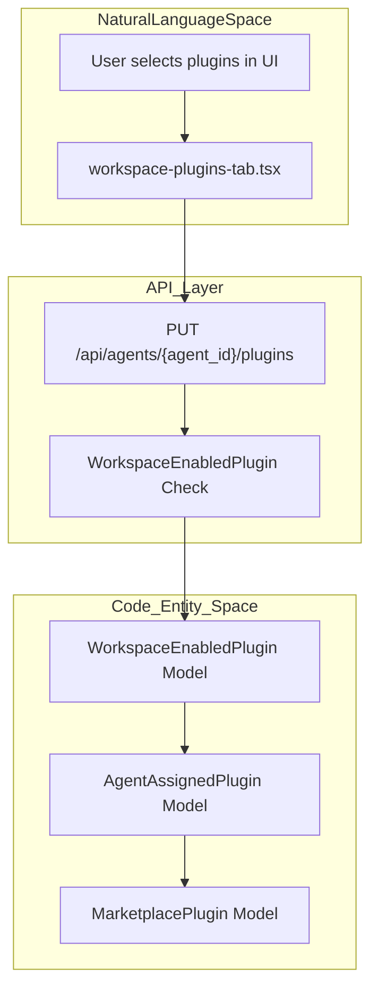
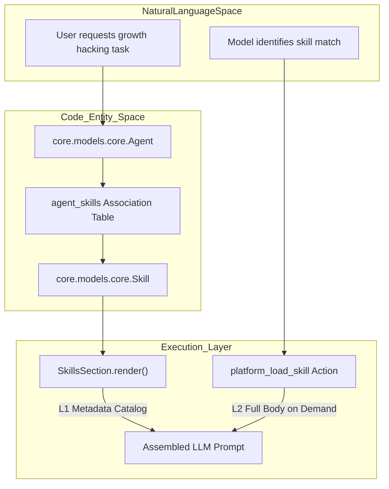

# Agent Plugins & Skills

Relevant source files

The following files were used as context for generating this wiki page:

- [frontend/components/agents/skills/skill-editor-modal.tsx](frontend/components/agents/skills/skill-editor-modal.tsx)
- [frontend/components/agents/skills/workspace-skills-tab.tsx](frontend/components/agents/skills/workspace-skills-tab.tsx)
- [frontend/components/knowledge/memory-tab.tsx](frontend/components/knowledge/memory-tab.tsx)
- [frontend/hooks/use-skills-api.ts](frontend/hooks/use-skills-api.ts)
- [orchestrator/api/admin_plugins.py](orchestrator/api/admin_plugins.py)
- [orchestrator/api/agent_plugins.py](orchestrator/api/agent_plugins.py)
- [orchestrator/api/personas.py](orchestrator/api/personas.py)
- [orchestrator/api/rag_feedback.py](orchestrator/api/rag_feedback.py)
- [orchestrator/api/workspace_plugins.py](orchestrator/api/workspace_plugins.py)
- [orchestrator/api/workspace_skills.py](orchestrator/api/workspace_skills.py)
- [orchestrator/core/services/marketplace_s3.py](orchestrator/core/services/marketplace_s3.py)
- [orchestrator/core/services/plugin_upload_service.py](orchestrator/core/services/plugin_upload_service.py)
- [orchestrator/core/services/skill_l3_execution.py](orchestrator/core/services/skill_l3_execution.py)
- [orchestrator/modules/agents/services/skill_portability.py](orchestrator/modules/agents/services/skill_portability.py)
- [orchestrator/modules/context/sections/identity.py](orchestrator/modules/context/sections/identity.py)
- [orchestrator/modules/context/sections/skills.py](orchestrator/modules/context/sections/skills.py)
- [orchestrator/modules/context/sections/task_context.py](orchestrator/modules/context/sections/task_context.py)
- [orchestrator/modules/tools/discovery/actions_skills.py](orchestrator/modules/tools/discovery/actions_skills.py)
- [orchestrator/modules/tools/discovery/handlers_skill_runtime.py](orchestrator/modules/tools/discovery/handlers_skill_runtime.py)
- [orchestrator/tests/test_identity_section.py](orchestrator/tests/test_identity_section.py)
- [orchestrator/tests/test_p2w1_agent_skills_repair.py](orchestrator/tests/test_p2w1_agent_skills_repair.py)
- [orchestrator/tests/test_prd202_s2_trigger_activation.py](orchestrator/tests/test_prd202_s2_trigger_activation.py)
- [orchestrator/tests/test_skills_section.py](orchestrator/tests/test_skills_section.py)

This page describes the architecture and implementation of plugins and skills in Automatos AI. These systems allow agents to be enhanced with reusable prompt-based knowledge, specialized methodologies, and executable tool schemas, featuring trigger-based progressive disclosure and workspace-level portability.

---

## Overview

Automatos AI utilizes two primary mechanisms for extending agent capabilities:

1.  **Plugins**: Packaged bundles of knowledge and tools distributed via the Marketplace. They contain metadata, executable commands, and security scan records that can be enabled at the workspace level and assigned to specific agents [orchestrator/core/models/marketplace_plugins.py:50-120](), [orchestrator/api/agent_plugins.py:6-9]().
2.  **Skills**: Atomic units of capability. Skills can be "materialized" from plugins, forked from the marketplace, or created directly within a workspace [frontend/components/agents/skills/workspace-skills-tab.tsx:4-7](). Under PRD-202 S2, non-core skills utilize a token-efficient L1 metadata catalog with on-demand L2 loading via tools [orchestrator/modules/context/sections/skills.py:2-20]().

**Sources:** [orchestrator/api/agent_plugins.py:1-9](), [orchestrator/core/models/marketplace_plugins.py:50-120](), [frontend/components/agents/skills/workspace-skills-tab.tsx:4-7](), [orchestrator/modules/context/sections/skills.py:2-20]()

---

## Plugin Lifecycle & Management

The plugin system follows a multi-tier enablement and security validation flow.

### 1. Admin Upload & Security Scanning
Plugins can be uploaded as multipart `.zip` archives via the admin API (`POST /api/admin/plugins/upload`) [orchestrator/api/admin_plugins.py:139-148](). The upload invokes `PluginUploadService`, `MarketplaceS3Service`, and `PluginScanService` to execute static pattern checks and LLM-based risk assessments [orchestrator/api/admin_plugins.py:166-173](). Findings are categorized by severity (e.g., `critical`, `high`, `medium`, `low`) [orchestrator/api/workspace_skills.py:38-39]().

### 2. Workspace Enablement
Workspace owners or admins enable approved marketplace plugins via `POST /api/workspaces/{workspace_id}/plugins`, creating a `WorkspaceEnabledPlugin` association record [orchestrator/api/workspace_plugins.py:136-190]().

### 3. Agent Assignment
Agents are assigned enabled plugins via `PUT /api/agents/{agent_id}/plugins` [orchestrator/api/agent_plugins.py:128-135](). This endpoint validates that all requested plugins are enabled for the agent's workspace, deduplicates plugin identifiers while preserving sequence-based priority, and writes `AgentAssignedPlugin` records [orchestrator/api/agent_plugins.py:154-193]().

**Sources:** [orchestrator/api/admin_plugins.py:139-193](), [orchestrator/api/workspace_plugins.py:136-190](), [orchestrator/api/agent_plugins.py:128-193]()

---

## Skill Architecture & Trigger-Based Activation

Skills support rich portability, fork-on-edit semantics, and token-optimized progressive disclosure.

### 1. Skill Origins & Fork-on-Edit Semantics
Workspace skills can originate from the marketplace or be workspace-owned (`origin='workspace'`, including user creations and forks) [frontend/components/agents/skills/workspace-skills-tab.tsx:56](). Editing a marketplace skill automatically forks it into a workspace-owned record, recording lineage in metadata (`forked_from_skill_id`) while preserving the immutable marketplace original [orchestrator/modules/tools/discovery/actions_skills.py:10-14]().

### 2. Progressive Disclosure (L1 vs L2 Activation)
Per PRD-202 S2, `SkillsSection` optimizes token consumption each turn:
- **L1 Metadata Only**: All attached non-core skills contribute only their name and description (~50-100 tokens) plus a trigger instruction informing the model that it can load the full body on demand [orchestrator/modules/context/sections/skills.py:6-11]().
- **Core Always-On L2**: Only the designated core set (defined by `config.SKILL_CORE_ALWAYS_ON`, defaulting to `platform-management`) renders its full L2 body every turn [orchestrator/modules/context/sections/skills.py:12-14]().
- **On-Demand Loading**: The model executes `platform_load_skill` (or `load_skill`) to pull a skill's full instructions into context during a specific turn [orchestrator/modules/tools/discovery/actions_skills.py:29-56]().

**Sources:** [frontend/components/agents/skills/workspace-skills-tab.tsx:56](), [orchestrator/modules/tools/discovery/actions_skills.py:10-56](), [orchestrator/modules/context/sections/skills.py:6-14]()

---

## Technical Data Flow

The following diagrams illustrate the transition from Natural Language interactions to Code Entity execution for plugins and skills.

### Plugin Assignment & Workspace Validation Flow
Title: Agent Plugin Assignment Logic

**Sources:** [orchestrator/api/agent_plugins.py:128-193](), [frontend/components/agents/skills/workspace-skills-tab.tsx:4-7]()

### Progressive Skill Context Assembly Flow
Title: Skill to Prompt Progressive Disclosure Pipeline

**Sources:** [orchestrator/modules/context/sections/skills.py:36-125](), [orchestrator/modules/tools/discovery/actions_skills.py:29-56](), [core/models/core.py:31-36]()

---

## Data Model Reference

### Association Tables & Models

| Model / Table | File Reference | Purpose |
| :--- | :--- | :--- |
| `agent_skills` | [orchestrator/core/models/core.py:31-36]() | Many-to-many link between agents and skills, carrying attachment `priority` and unique constraints. |
| `AgentAssignedPlugin` | [orchestrator/api/agent_plugins.py:79-102]() | Links agents to marketplace plugins with priority and timestamp tracking. |
| `WorkspaceEnabledPlugin` | [orchestrator/api/workspace_plugins.py:85-99]() | Tracks which marketplace plugins are enabled within a specific workspace. |
| `MarketplacePlugin` | [orchestrator/core/models/marketplace_plugins.py:50-120]() | Central marketplace catalog table containing slug, version, risk scores, and counts. |
| `PluginSecurityScan` | [orchestrator/api/admin_plugins.py:36]() | Stores static and LLM security scan results, findings, and verdicts for uploaded plugins. |

**Sources:** [orchestrator/core/models/core.py:31-36](), [orchestrator/api/agent_plugins.py:79-102](), [orchestrator/api/workspace_plugins.py:85-99](), [orchestrator/core/models/marketplace_plugins.py:50-120](), [orchestrator/api/admin_plugins.py:36]()

---

## Key Functions & Endpoints

- `upload_plugin(...)`: Admin endpoint handling `.zip` multipart uploads, size checks, and security scans [orchestrator/api/admin_plugins.py:139-181]().
- `update_agent_plugins(...)`: Replaces an agent's plugin assignments and validates workspace enablement [orchestrator/api/agent_plugins.py:128-193]().
- `list_workspace_skills(...)`: Aggregates forked workspace-owned skills and enabled marketplace skills with usage counts [orchestrator/api/workspace_skills.py:132-183]().
- `SkillsSection.render(...)`: Assembles prompt context using L1 metadata for non-core skills and L2 bodies for core always-on skills [orchestrator/modules/context/sections/skills.py:50-125]().
- `platform_load_skill(...)`: Action definition allowing agents to dynamically pull skill bodies on demand [orchestrator/modules/tools/discovery/actions_skills.py:29-56]().

**Sources:** [orchestrator/api/admin_plugins.py:139-181](), [orchestrator/api/agent_plugins.py:128-193](), [orchestrator/api/workspace_skills.py:132-183](), [orchestrator/modules/context/sections/skills.py:50-125](), [orchestrator/modules/tools/discovery/actions_skills.py:29-56]()

---