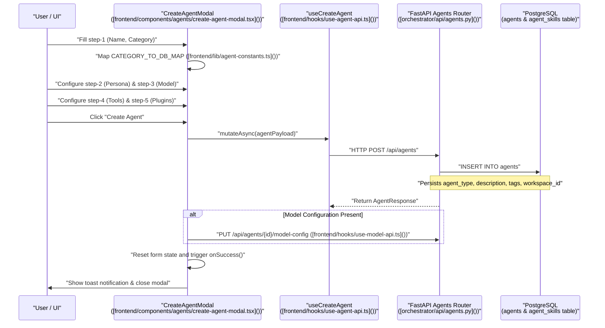
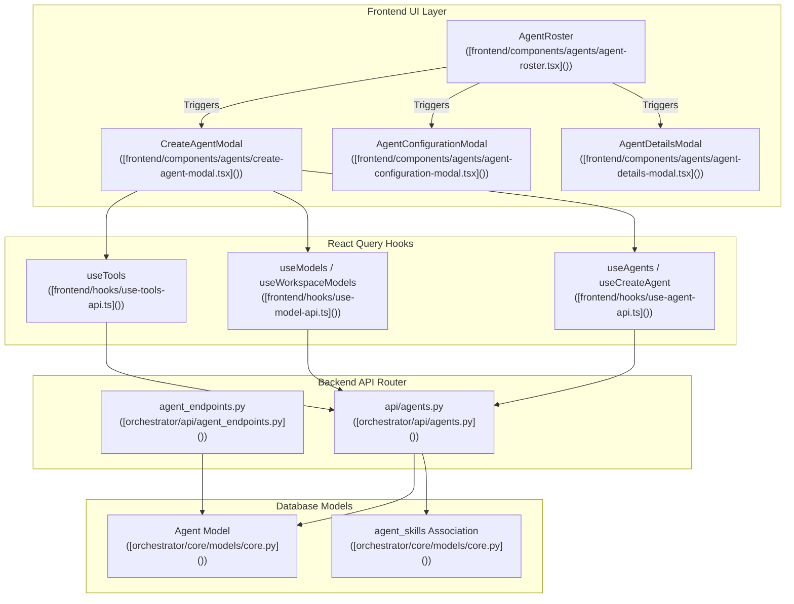

# Creating Agents

Relevant source files

The following files were used as context for generating this wiki page:

- [frontend/components/agents/agent-configuration-modal.tsx](frontend/components/agents/agent-configuration-modal.tsx)
- [frontend/components/agents/agent-configuration.tsx](frontend/components/agents/agent-configuration.tsx)
- [frontend/components/agents/agent-details-modal.tsx](frontend/components/agents/agent-details-modal.tsx)
- [frontend/components/agents/agent-performance.tsx](frontend/components/agents/agent-performance.tsx)
- [frontend/components/agents/agent-roster.tsx](frontend/components/agents/agent-roster.tsx)
- [frontend/components/agents/agent-skills.tsx](frontend/components/agents/agent-skills.tsx)
- [frontend/components/agents/agent-status-control-modal.tsx](frontend/components/agents/agent-status-control-modal.tsx)
- [frontend/components/agents/create-agent-modal.tsx](frontend/components/agents/create-agent-modal.tsx)
- [frontend/components/agents/create-skill-modal.tsx](frontend/components/agents/create-skill-modal.tsx)
- [frontend/components/agents/model-selector.tsx](frontend/components/agents/model-selector.tsx)
- [frontend/components/agents/skill-configuration-modal.tsx](frontend/components/agents/skill-configuration-modal.tsx)
- [frontend/hooks/use-agent-api.ts](frontend/hooks/use-agent-api.ts)
- [frontend/hooks/use-model-api.ts](frontend/hooks/use-model-api.ts)
- [frontend/lib/agent-constants.ts](frontend/lib/agent-constants.ts)
- [orchestrator/alembic/versions/add_job_title_to_agents.py](orchestrator/alembic/versions/add_job_title_to_agents.py)
- [orchestrator/api/agent_endpoints.py](orchestrator/api/agent_endpoints.py)
- [orchestrator/api/agents.py](orchestrator/api/agents.py)
- [orchestrator/core/models/__init__.py](orchestrator/core/models/__init__.py)
- [orchestrator/core/models/core.py](orchestrator/core/models/core.py)

Agent creation is implemented as a multi-step modal wizard in the `CreateAgentModal` component (`[frontend/components/agents/create-agent-modal.tsx]()`). The flow involves sequential API calls to persist agent configuration across multiple backend tables, including model settings, personas, tool assignments, and plugin bindings.

## Purpose and Scope

This section documents the agent creation and configuration lifecycle in Automatos AI. It details how users interact with the front-end wizard (`[frontend/components/agents/create-agent-modal.tsx]()`), how categories map to database entity types (`[frontend/lib/agent-constants.ts]()`), and how the FastAPI backend (`[orchestrator/api/agents.py]()` and `[orchestrator/api/agent_endpoints.py]()`) processes agent registration, skill attachment, tool routing, and runtime initialization.

Sources: `[frontend/components/agents/create-agent-modal.tsx:1-1071]()`, `[frontend/lib/agent-constants.ts:1-142]`, `[orchestrator/api/agents.py:1-1072]()`, `[orchestrator/api/agent_endpoints.py:1-788]()`

---

## Agent Creation Flow & Architecture

The agent creation wizard collects configuration across progressive steps managed by the `step` state variable. The diagram below bridges the user-facing wizard actions to the underlying code entities and backend route handlers.

**End-to-End Creation Sequence and Code Mapping**

Title: Agent Creation Sequence and Code Entities

Sources: `[frontend/components/agents/create-agent-modal.tsx:68-320]()`, `[frontend/lib/agent-constants.ts:48-65]()`, `[orchestrator/api/agents.py:1-1072]()`, `[frontend/hooks/use-agent-api.ts:23-31]()`

---

## Component-to-Code Architecture

The visualization below links the React UI components responsible for agent management with their corresponding hook definitions and backend service endpoints.

Title: Agent Subsystem Architecture

Sources: `[frontend/components/agents/agent-roster.tsx:1-651]()`, `[frontend/components/agents/create-agent-modal.tsx:1-1071]()`, `[frontend/components/agents/agent-configuration-modal.tsx:1-1882]()`, `[frontend/hooks/use-agent-api.ts:1-557]()`, `[orchestrator/core/models/core.py:1-1753]()`

---

## The 5-Step Creation Wizard

### Step 1: Basic Information & Templates

The initial step collects general metadata: agent name, category, description, and tags (`[frontend/components/agents/create-agent-modal.tsx:68-78]()`). 

The UI category is translated into a valid database `agent_type` using `CATEGORY_TO_DB_MAP` (`[frontend/lib/agent-constants.ts:48-65]()`). If an agent is instantiated from a marketplace template, the `marketplace_category` field is preserved to maintain round-trip fidelity.

Sources: `[frontend/components/agents/create-agent-modal.tsx:68-78]()`, `[frontend/lib/agent-constants.ts:48-65]()`

### Step 2: Persona Assignment

Persona assignment allows selecting an identity from predefined templates or providing a custom system prompt (`[frontend/components/agents/create-agent-modal.tsx:84-91]`). Personas are fetched via `GET /api/personas` (`[frontend/components/agents/create-agent-modal.tsx:132-142]()`) and support category filtering.

Sources: `[frontend/components/agents/create-agent-modal.tsx:84-91]`, `[frontend/components/agents/create-agent-modal.tsx:132-142]()`

### Step 3: LLM Configuration

The model selection step configures provider bindings, model identifiers, and generation parameters using the `ModelSelector` component (`[frontend/components/agents/create-agent-modal.tsx:39-39]()`). Defaults are resolved via `getDefaultModelConfig()` (`[frontend/components/agents/create-agent-modal.tsx:82-82]()`).

Sources: `[frontend/components/agents/create-agent-modal.tsx:39-39]`, `[frontend/components/agents/create-agent-modal.tsx:81-82]()`

### Step 4: Tools (Composio Integration)

Tool capabilities are assigned by selecting connected Composio apps (`[frontend/components/agents/create-agent-modal.tsx:75-75]()`). Available tools are queried via the `useTools` hook (`[frontend/hooks/use-agent-api.ts]()`), filtering for active integrations (`[frontend/components/agents/create-agent-modal.tsx:102-103]()`).

Sources: `[frontend/components/agents/create-agent-modal.tsx:75-75]`, `[frontend/components/agents/create-agent-modal.tsx:102-103]()`, `[frontend/hooks/use-agent-api.ts:1-557]()`

### Step 5: Capabilities & Plugins

Workspace-enabled plugins are assigned in the final step (`[frontend/components/agents/create-agent-modal.tsx:74-74]()`). Plugin inventory is retrieved via `GET /api/workspaces/{workspaceId}/plugins` (`[frontend/components/agents/create-agent-modal.tsx:119-124]()`).

Sources: `[frontend/components/agents/create-agent-modal.tsx:74-74]`, `[frontend/components/agents/create-agent-modal.tsx:119-124]()`

---

## Backend Persistence and Runtime Initialization

Once submitted, the backend processes the agent creation payload through several validation and persistence steps:

1. **Agent Record Insertion**: `POST /api/agents` (`[orchestrator/api/agents.py]()`) creates the base row in the `agents` table with workspace scoping.
2. **Skill Validation**: `_fetch_attachable_skills` (`[orchestrator/api/agents.py:101-120]`) verifies that attached skills are active and visible within the current workspace context.
3. **Model Configuration**: Model-specific parameters are stored or updated via `PUT /api/agents/{id}/model-config` (`[frontend/hooks/use-model-api.ts:214-231]()`).
4. **Semantic Indexing**: Background re-indexing helper `_reindex_agent_embedding` (`[orchestrator/api/agents.py:58-86]()`) triggers semantic vector embedding updates for routing and discovery.

Sources: `[orchestrator/api/agents.py:58-120]`, `[frontend/hooks/use-model-api.ts:214-231]()`

---