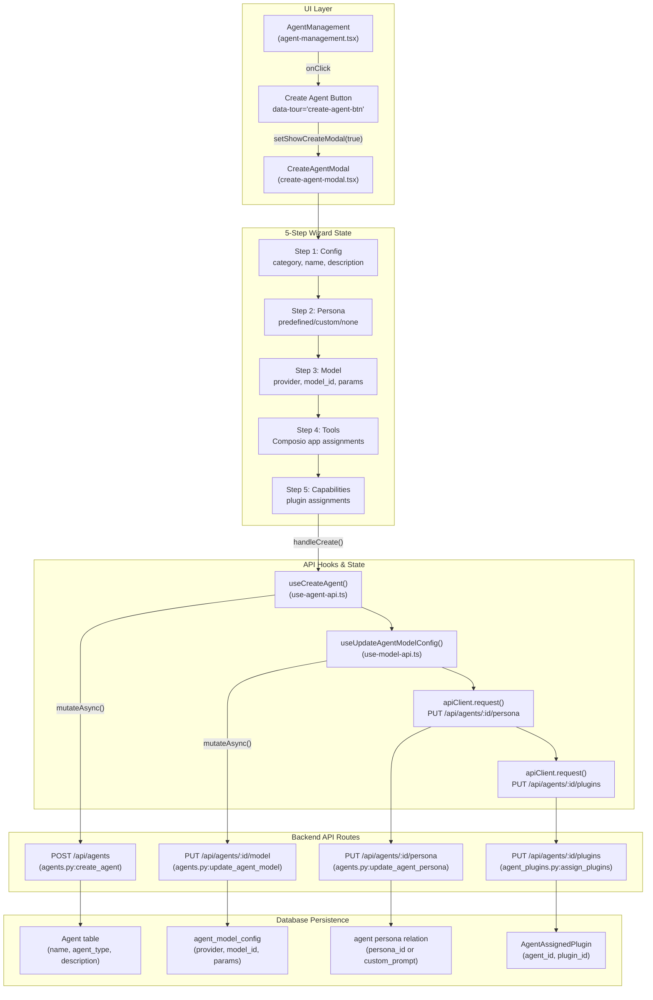
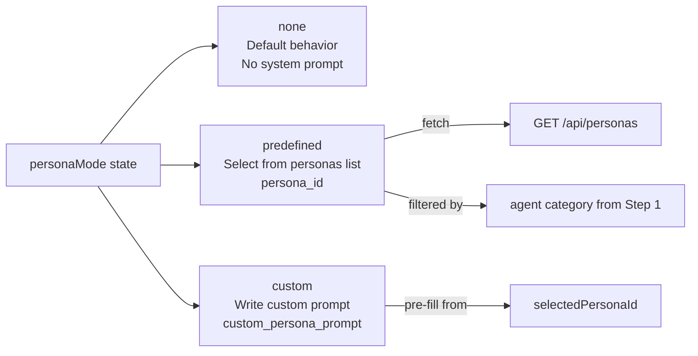
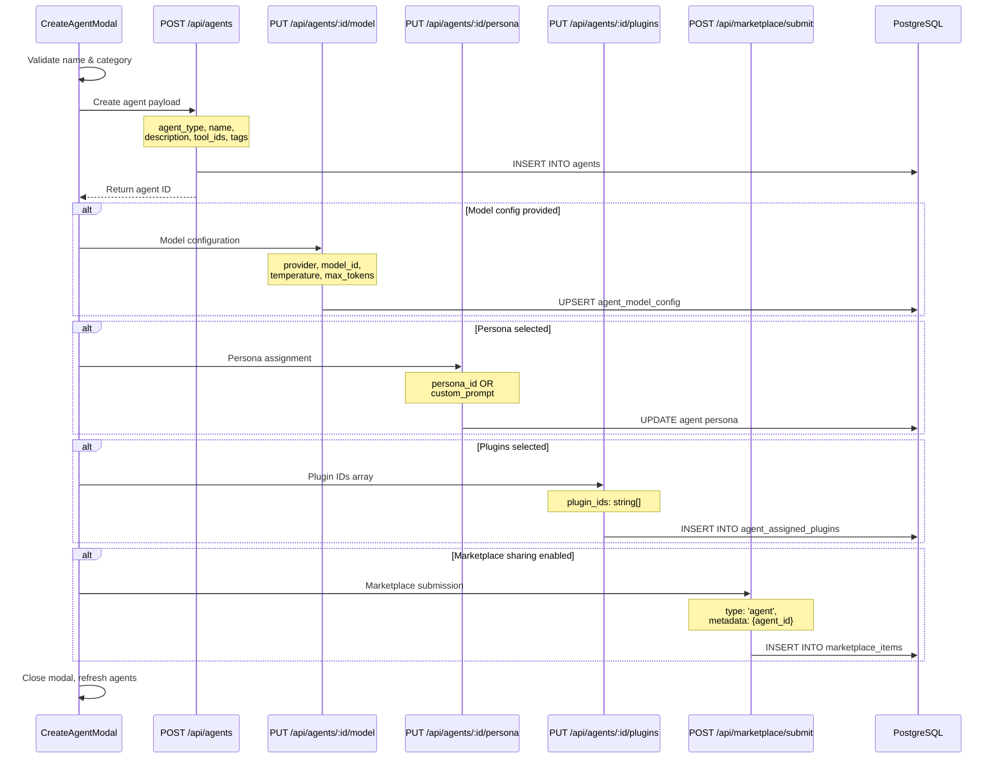

# Creating Agents

<details>
<summary>Relevant source files</summary>

The following files were used as context for generating this wiki page:

- [frontend/app/tools/page.tsx](frontend/app/tools/page.tsx)
- [frontend/components/agents/agent-management.tsx](frontend/components/agents/agent-management.tsx)
- [frontend/components/documents/document-management.tsx](frontend/components/documents/document-management.tsx)
- [frontend/components/layout/main-layout.tsx](frontend/components/layout/main-layout.tsx)
- [frontend/components/layout/sidebar.tsx](frontend/components/layout/sidebar.tsx)
- [frontend/components/settings/SettingsPanel.tsx](frontend/components/settings/SettingsPanel.tsx)
- [frontend/components/tools/my-tools-dashboard.tsx](frontend/components/tools/my-tools-dashboard.tsx)
- [frontend/components/tools/tools-dashboard.tsx](frontend/components/tools/tools-dashboard.tsx)
- [frontend/components/workflows/workflow-management.tsx](frontend/components/workflows/workflow-management.tsx)
- [frontend/tsconfig.tsbuildinfo](frontend/tsconfig.tsbuildinfo)
- [orchestrator/api/workflows.py](orchestrator/api/workflows.py)
- [orchestrator/consumers/chatbot/service.py](orchestrator/consumers/chatbot/service.py)
- [orchestrator/core/llm/manager.py](orchestrator/core/llm/manager.py)
- [orchestrator/modules/agents/factory/agent_factory.py](orchestrator/modules/agents/factory/agent_factory.py)
- [orchestrator/modules/orchestrator/pipeline.py](orchestrator/modules/orchestrator/pipeline.py)
- [orchestrator/modules/orchestrator/service.py](orchestrator/modules/orchestrator/service.py)

</details>


This page covers the agent creation workflow in Automatos AI, including the 5-step creation wizard, UI components, backend API flow, and data persistence. For configuring existing agents, see [Agent Configuration](#3.2). For details on the persona system, see [Agent Personas](#3.3). For pre-configured agent templates, see [Agent Templates](#3.4).

## Overview

Agent creation in Automatos AI uses a progressive disclosure pattern implemented as a 5-step modal wizard. Each step collects a specific category of configuration:

1. **Configuration**: Basic agent metadata (category, name, description, tags)
2. **Persona**: Personality and communication style (predefined, custom, or none)
3. **Model**: LLM selection and parameters (provider, model_id, temperature, etc.)
4. **Tools**: Composio app integrations (Gmail, Slack, etc.)
5. **Capabilities**: Marketplace plugin assignments (skills, commands, agents)

The creation flow is orchestrated by `CreateAgentModal` component, which makes multiple API calls to persist the agent configuration atomically.

**Sources:** [frontend/components/agents/create-agent-modal.tsx:1-60]()

---

## Agent Creation Flow

The following diagram shows the complete agent creation flow from UI interaction to database persistence:



**Sources:** [frontend/components/agents/create-agent-modal.tsx:184-353](), [frontend/components/agents/agent-management.tsx:38-78]()

---

## Triggering Agent Creation

The agent creation modal is triggered from the `AgentManagement` component via the "Create Agent" button in the page header.

### Entry Point

The button is located in the `PageHeader` actions section:

[frontend/components/agents/agent-management.tsx:148-156]()

```typescript
<Button
  variant="outline"
  data-tour="create-agent-btn"
  onClick={() => setShowCreateModal(true)}
>
  <Plus className="w-4 h-4 mr-2" />
  Create Agent
</Button>
```

The modal is conditionally rendered at the bottom of the component:

[frontend/components/agents/agent-management.tsx:268-275]()

**Sources:** [frontend/components/agents/agent-management.tsx:1-278]()

---

## The 5-Step Wizard

### Step 1: Configuration

The first step collects basic agent metadata. The form is defined using a `Tabs` component with `TabsContent` wrapping each step.

#### Required Fields

| Field | Type | Description | Database Column |
|-------|------|-------------|-----------------|
| `category` | Select | Agent category (e.g., "Personal Assistant", "DevOps") | `agent_type` (via `CATEGORY_TO_DB_MAP`) |
| `name` | Input | Agent display name | `name` |

#### Optional Fields

| Field | Type | Description | Database Column |
|-------|------|-------------|-----------------|
| `description` | Textarea | Agent purpose and capabilities | `description` |
| `tags` | Input | Comma-separated keywords | `tags` (JSON array) |
| `shareToMarketplace` | Switch | Submit to marketplace after creation | N/A (triggers separate API call) |

#### Category Mapping

Agent categories are mapped from UI-friendly names to database `agent_type` values via `CATEGORY_TO_DB_MAP`:

[frontend/lib/agent-constants.ts]() (imported at line 61)

```typescript
const dbAgentType = CATEGORY_TO_DB_MAP[agentData.category] || 'custom'
```

The mapping ensures round-trip compatibility between the UI and database representations.

**Step 1 Form Layout:**

[frontend/components/agents/create-agent-modal.tsx:413-539]()

**Sources:** [frontend/components/agents/create-agent-modal.tsx:61-75](), [frontend/components/agents/create-agent-modal.tsx:204-217]()

---

### Step 2: Persona

The persona step allows users to define the agent's personality and communication style. Three modes are supported:

#### Persona Modes



#### Mode Selection UI

The three modes are presented as radio-style cards:

[frontend/components/agents/create-agent-modal.tsx:554-603]()

Each mode uses `motion.div` from Framer Motion for visual feedback on selection.

#### Predefined Persona Selection

When `personaMode === 'predefined'`, the UI fetches personas from `/api/personas` and filters them by the agent category selected in Step 1:

[frontend/components/agents/create-agent-modal.tsx:136-150]()

The persona list is auto-filtered:

[frontend/components/agents/create-agent-modal.tsx:627-629]()

```typescript
.filter(p => !agentData.category || agentData.category === 'custom' || 
  p.category?.toLowerCase() === agentData.category.toLowerCase())
```

#### Custom Persona

When `personaMode === 'custom'`, users can write a custom system prompt. Pre-filling is supported: selecting a predefined persona then switching to custom mode auto-populates the prompt:

[frontend/components/agents/create-agent-modal.tsx:153-160]()

**Sources:** [frontend/components/agents/create-agent-modal.tsx:89-96](), [frontend/components/agents/create-agent-modal.tsx:543-753]()

---

### Step 3: Model Selection

The model step allows users to select an LLM provider and model, and configure generation parameters.

#### Model Configuration State

[frontend/components/agents/create-agent-modal.tsx:78-87]()

```typescript
const [modelConfig, setModelConfig] = useState({
  provider: 'openai',
  model_id: 'gpt-4',
  temperature: 0.7,
  max_tokens: 2000,
  top_p: 1.0,
  frequency_penalty: 0.0,
  presence_penalty: 0.0,
  fallback_model_id: null as string | null
})
```

#### ModelSelector Component

The model selection UI is implemented as a reusable `ModelSelector` component:

[frontend/components/agents/create-agent-modal.tsx:766-777]()

The selector fetches available models via `useModels()` hook and allows filtering by agent type.

#### Model Parameters

After selecting a model, users can adjust generation parameters:

| Parameter | Range | Default | Description |
|-----------|-------|---------|-------------|
| `temperature` | 0.0 - 2.0 | 0.7 | Randomness: 0 is focused, 2 is creative |
| `max_tokens` | 1 - 4096 | 2000 | Maximum output length |
| `top_p` | 0.0 - 1.0 | 1.0 | Nucleus sampling threshold |
| `frequency_penalty` | 0.0 - 2.0 | 0.0 | Penalty for token frequency |
| `presence_penalty` | 0.0 - 2.0 | 0.0 | Penalty for token presence |

Parameter controls are implemented using `Slider` components:

[frontend/components/agents/create-agent-modal.tsx:782-795]()

**Sources:** [frontend/components/agents/create-agent-modal.tsx:756-834](), [frontend/components/agents/model-selector.tsx]() (imported at line 36)

---

### Step 4: Tools

The tools step allows users to assign Composio app integrations (e.g., Gmail, Slack, Notion) to the agent.

#### Tools Data Fetching

Available tools are fetched via the `useTools` hook:

[frontend/components/agents/create-agent-modal.tsx:104]()

```typescript
const { data: toolsResponse, isLoading: toolsLoading } = useTools({ 
  status: 'active', 
  limit: 100 
})
const availableTools = toolsResponse?.data || []
```

#### Tool Assignment UI

Tools are displayed in a grid with checkboxes for assignment:

[frontend/components/agents/create-agent-modal.tsx:836-899]()

Each tool card displays:
- Tool logo (via `ToolLogo` component)
- Tool name
- Checkbox for assignment

Tool assignment is tracked in `agentData.tools` array:

[frontend/components/agents/create-agent-modal.tsx:171-178]()

```typescript
const handleToolToggle = (toolId: number) => {
  setAgentData(prev => ({
    ...prev,
    tools: prev.tools.includes(toolId)
      ? prev.tools.filter(t => t !== toolId)
      : [...prev.tools, toolId]
  }))
}
```

**Sources:** [frontend/components/agents/create-agent-modal.tsx:836-920]()

---

### Step 5: Capabilities

The final step allows users to assign marketplace plugins (capabilities) to the agent. Plugins are skills, commands, and agents packaged together.

#### Workspace Plugin Fetching

Only workspace-enabled plugins are available for assignment. These are fetched when the modal opens:

[frontend/components/agents/create-agent-modal.tsx:113-134]()

The API call structure:
```
GET /api/workspaces/{workspaceId}/plugins
```

Returns an array of `WorkspaceEnabledPlugin` records with plugin metadata and content summaries.

#### Plugin Assignment UI

Plugins are displayed with their content breakdown:

[frontend/components/agents/create-agent-modal.tsx:922-1044]()

Each plugin card shows:
- Plugin name and version
- Skills count (with `Terminal` icon)
- Commands count (with `Zap` icon)
- Token estimate
- Checkbox for assignment

#### Token Estimate Display

A total token estimate for all assigned plugins is displayed:

[frontend/components/agents/create-agent-modal.tsx:962-968]()

```typescript
const assignedTokenEstimate = workspacePlugins
  .filter(p => agentData.plugins.includes(p.plugin_id))
  .reduce((sum, p) => sum + (p.token_estimate || 0), 0)
```

This helps users understand the context size impact of their plugin selections.

**Sources:** [frontend/components/agents/create-agent-modal.tsx:922-1082]()

---

## Backend API Flow

The agent creation process involves multiple sequential API calls to persist different aspects of the agent configuration.

### API Call Sequence



### Primary Agent Creation

The `handleCreate` function orchestrates the entire creation flow:

[frontend/components/agents/create-agent-modal.tsx:184-353]()

#### Step 1: Validate Required Fields

```typescript
if (!agentData.name || !agentData.category) {
  toast.error('Please provide agent name and type')
  return
}
```

#### Step 2: Prepare Agent Payload

[frontend/components/agents/create-agent-modal.tsx:197-217]()

The payload transformation includes:
- Convert category name to database `agent_type` via `CATEGORY_TO_DB_MAP`
- Parse comma-separated tags into array
- Include `tool_ids` for Composio app assignments
- Store `marketplace_category` for round-trip compatibility

#### Step 3: Create Agent

```typescript
const newAgent: any = await (createAgentMutation as any).mutateAsync(agentPayload)
```

This calls `POST /api/agents` which returns the created agent with `id`.

#### Step 4: Set Model Configuration

[frontend/components/agents/create-agent-modal.tsx:227-238]()

```typescript
await (updateModelConfigMutation as any).mutateAsync({
  agentId: newAgent.id,
  modelConfig
})
```

This calls `PUT /api/agents/{id}/model`.

#### Step 5: Set Persona

[frontend/components/agents/create-agent-modal.tsx:240-260]()

The persona payload structure depends on mode:
- Predefined: `{ persona_id: string, use_custom: false }`
- Custom: `{ custom_prompt: string, use_custom: true }`
- None: No API call

#### Step 6: Assign Plugins

[frontend/components/agents/create-agent-modal.tsx:262-273]()

```typescript
await apiClient.request(`/api/agents/${newAgent.id}/plugins`, {
  method: 'PUT',
  body: { plugin_ids: agentData.plugins }
})
```

#### Step 7: Optional Marketplace Submission

If `agentData.shareToMarketplace === true`, the agent is submitted to the marketplace approval queue:

[frontend/components/agents/create-agent-modal.tsx:278-314]()

**Sources:** [frontend/components/agents/create-agent-modal.tsx:184-353]()

---

## State Management & Form Data

### Form State Structure

The wizard maintains state using React hooks:

[frontend/components/agents/create-agent-modal.tsx:64-75]()

```typescript
const [agentData, setAgentData] = useState({
  name: '',
  category: '',
  description: '',
  tags: '',
  plugins: [] as string[],
  tools: [] as number[],
  specializations: [] as string[],
  shareToMarketplace: false
})
```

### Step Navigation

Step navigation is controlled by the `step` state variable:

[frontend/components/agents/create-agent-modal.tsx:64]()

```typescript
const [step, setStep] = useState(1)
```

The `Tabs` component uses `value={`step-${step}`}` to control which step is visible. The tour system can also drive step changes via `useTourTabBridge`:

[frontend/components/agents/create-agent-modal.tsx:110]()

This hook allows the Shepherd.js onboarding tour to programmatically switch tabs.

### Form Reset

After successful creation, the form is reset to default values:

[frontend/components/agents/create-agent-modal.tsx:320-346]()

**Sources:** [frontend/components/agents/create-agent-modal.tsx:64-110](), [frontend/hooks/use-tour-tab-bridge.ts]() (imported at line 34)

---

## Onboarding Tour Integration

The agent creation wizard is integrated with a Shepherd.js guided tour for first-time users.

### Tour Steps

The tour walks users through all 5 steps of agent creation:

[frontend/lib/shepherd/first-login-tour.ts:74-289]()

Key tour steps:
- Step 5: Agent Category (`data-tour="agent-category-select"`)
- Step 6: Agent Name (`data-tour="agent-name-input"`)
- Step 7: Agent Description (`data-tour="agent-description-input"`)
- Step 8: Persona Section (`data-tour="agent-persona-section"`)
- Step 9: Model Section (`data-tour="agent-model-section"`)
- Step 10: Tools Section (`data-tour="agent-tools-section"`)
- Step 11: Plugins Section (`data-tour="agent-plugins-section"`)
- Step 12: Save Button (`data-tour="save-agent-btn"`)

### Tab Switching in Tour

The tour uses `switchTabAndWaitForElement` to programmatically change tabs:

[frontend/lib/shepherd/first-login-tour.ts:130]()

```typescript
beforeShowPromise: () => switchTabAndWaitForElement(1, '[data-tour="agent-category-select"]')
```

This function:
1. Publishes a tab change event via `window.dispatchEvent`
2. Waits for the target element to become visible
3. Returns a Promise that resolves when ready

### Auto-Advance on Creation

The tour detects when the agent is successfully created and auto-advances:

[frontend/lib/shepherd/first-login-tour.ts:311-332]()

A `MutationObserver` watches for the agent roster to appear and the modal to disappear, indicating successful creation.

**Sources:** [frontend/lib/shepherd/first-login-tour.ts:1-426](), [frontend/lib/shepherd/tour-bridge.ts]() (imported at line 4)

---

## Agent Templates

For rapid agent creation, Automatos AI provides 8 pre-configured templates:

[frontend/components/agents/create-agent-modal.tsx:80-93]()

Templates can pre-fill Step 1 configuration fields. For detailed information on template structure and usage, see [Agent Templates](#3.4).

**Sources:** [frontend/components/agents/create-agent-modal.tsx]()

---

## Error Handling

The creation flow includes comprehensive error handling at each stage:

### API Error Capture

[frontend/components/agents/create-agent-modal.tsx:347-352]()

```typescript
catch (error: any) {
  console.error('❌ CREATE AGENT ERROR:', error)
  const errorMsg = error?.response?.data?.detail || error?.message || JSON.stringify(error)
  toast.error('Failed: ' + errorMsg)
}
```

### Non-Critical Failures

Model configuration and persona assignment failures are logged but don't block the creation flow:

[frontend/components/agents/create-agent-modal.tsx:234-238]()

```typescript
catch (error) {
  console.error('Failed to set model config:', error)
  // Don't alert, just log - non-critical
}
```

This ensures the agent is created even if optional configuration steps fail.

### Marketplace Submission Errors

Marketplace submission failures don't prevent agent creation:

[frontend/components/agents/create-agent-modal.tsx:310-313]()

```typescript
catch (error) {
  console.error('Marketplace submission error:', error)
  toast.error('Agent created but marketplace submission failed')
}
```

**Sources:** [frontend/components/agents/create-agent-modal.tsx:184-353]()

---

## Data Persistence Schema

The following diagram maps the wizard state to database tables:

```mermaid
erDiagram
    Agent ||--o| agent_model_config : "has"
    Agent ||--o{ agent_skills : "has many"
    Agent ||--o{ AgentAssignedPlugin : "has many"
    Agent ||--o{ AgentAppAssignment : "has many"
    Agent ||--o| PersonaAssignment : "has"
    Agent ||--o{ MarketplaceItem : "submitted as"
    
    Agent {
        int id PK
        string name
        string agent_type "from CATEGORY_TO_DB_MAP"
        string description
        string[] tags "parsed from comma-separated"
        string status "default: active"
        string owner_type "workspace"
        uuid workspace_id FK
        timestamp created_at
        timestamp updated_at
    }
    
    agent_model_config {
        int agent_id PK_FK
        string provider "e.g., openai"
        string model_id "e.g., gpt-4"
        float temperature "0.0-2.0"
        int max_tokens "default: 2000"
        float top_p
        float frequency_penalty
        float presence_penalty
        string fallback_model_id
    }
    
    AgentAssignedPlugin {
        int id PK
        int agent_id FK
        string plugin_id FK
        timestamp assigned_at
    }
    
    AgentAppAssignment {
        int id PK
        int agent_id FK
        string app_name "Composio tool"
        timestamp assigned_at
    }
    
    PersonaAssignment {
        int agent_id PK_FK
        string persona_id FK "if predefined"
        text custom_persona_prompt "if custom"
        bool use_custom "true for custom mode"
    }
    
    MarketplaceItem {
        uuid id PK
        string type "agent"
        string name
        string category
        jsonb metadata "includes agent_id"
        string approval_status "pending"
    }
```

**Sources:** [backend/app/models/agent.py](), [backend/app/models/agent_model_config.py](), [backend/app/models/agent_assigned_plugin.py](), [backend/app/models/marketplace_plugin.py]()

---

## Common Patterns

### Optimistic UI Updates

The modal doesn't use optimistic updates. All state changes wait for API confirmation to prevent inconsistencies.

### Progressive Disclosure

The 5-step wizard uses progressive disclosure to avoid overwhelming users:
- Required fields first (Config)
- Optional customization later (Persona, Plugins)
- Most technical settings last (Model parameters)

### Workspace Isolation

All plugin and tool listings are scoped to the current workspace:

```typescript
const workspaceId = localStorage.getItem('last_active_workspace') || 
                    localStorage.getItem('last_active_org')
```

This ensures users only see resources enabled for their workspace.

### Category Filtering

Personas are automatically filtered by the agent category selected in Step 1:

[frontend/components/agents/create-agent-modal.tsx:628]()

This reduces cognitive load by showing only relevant options.

**Sources:** [frontend/components/agents/create-agent-modal.tsx:1-1082]()

---