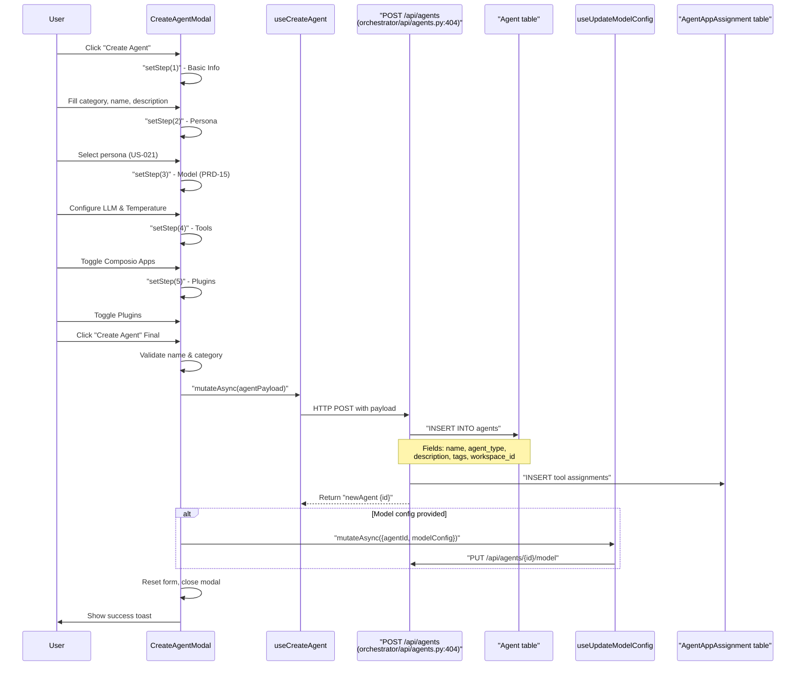
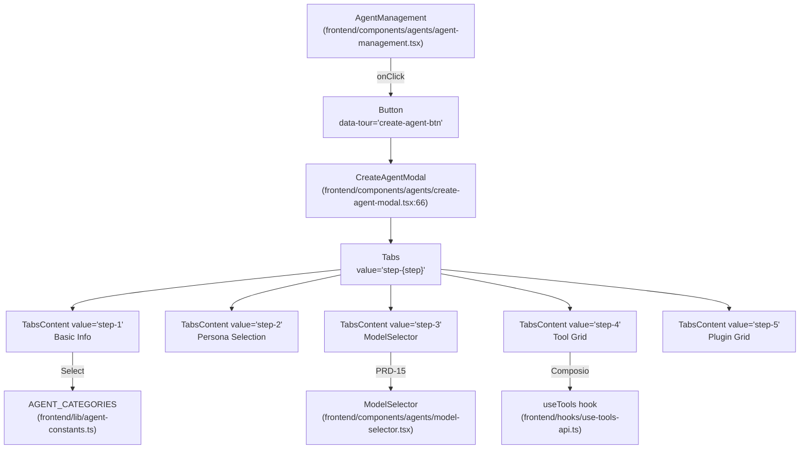

# Creating Agents

<details>
<summary>Relevant source files</summary>

The following files were used as context for generating this wiki page:

- [frontend/components/agents/agent-configuration-modal.tsx](frontend/components/agents/agent-configuration-modal.tsx)
- [frontend/components/agents/agent-configuration.tsx](frontend/components/agents/agent-configuration.tsx)
- [frontend/components/agents/agent-details-modal.tsx](frontend/components/agents/agent-details-modal.tsx)
- [frontend/components/agents/agent-management.tsx](frontend/components/agents/agent-management.tsx)
- [frontend/components/agents/agent-performance.tsx](frontend/components/agents/agent-performance.tsx)
- [frontend/components/agents/agent-roster.tsx](frontend/components/agents/agent-roster.tsx)
- [frontend/components/agents/agent-skills.tsx](frontend/components/agents/agent-skills.tsx)
- [frontend/components/agents/agent-status-control-modal.tsx](frontend/components/agents/agent-status-control-modal.tsx)
- [frontend/components/agents/create-agent-modal.tsx](frontend/components/agents/create-agent-modal.tsx)
- [frontend/components/agents/create-skill-modal.tsx](frontend/components/agents/create-skill-modal.tsx)
- [frontend/components/agents/skill-configuration-modal.tsx](frontend/components/agents/skill-configuration-modal.tsx)
- [frontend/components/documents/analytics-tab.tsx](frontend/components/documents/analytics-tab.tsx)
- [frontend/components/documents/processing-tab.tsx](frontend/components/documents/processing-tab.tsx)
- [frontend/hooks/use-agent-api.ts](frontend/hooks/use-agent-api.ts)
- [frontend/hooks/use-document-api.ts](frontend/hooks/use-document-api.ts)
- [frontend/hooks/use-marketplace-api.ts](frontend/hooks/use-marketplace-api.ts)
- [orchestrator/api/agents.py](orchestrator/api/agents.py)
- [orchestrator/api/marketplace.py](orchestrator/api/marketplace.py)
- [orchestrator/core/models/__init__.py](orchestrator/core/models/__init__.py)
- [orchestrator/core/models/core.py](orchestrator/core/models/core.py)
- [orchestrator/modules/coordination/__init__.py](orchestrator/modules/coordination/__init__.py)
- [orchestrator/modules/coordination/agent_matcher.py](orchestrator/modules/coordination/agent_matcher.py)
- [orchestrator/modules/coordination/templates.py](orchestrator/modules/coordination/templates.py)
- [orchestrator/services/heartbeat_service.py](orchestrator/services/heartbeat_service.py)

</details>


Agent creation is implemented as a multi-step modal wizard in the `CreateAgentModal` component. The flow involves sequential API calls to persist agent configuration across multiple backend tables, including model settings, personas, and tool assignments.

## Overview

The agent creation wizard collects configuration in 5 progressive steps, each rendering a `TabsContent` component controlled by the `step` state variable:

| Step | Tab ID | Purpose | Primary State |
|------|--------|---------|---------------|
| 1 | `step-1` | Basic metadata (category, name, description, tags) | `agentData.category`, `agentData.name` [frontend/components/agents/create-agent-modal.tsx:68-72]() |
| 2 | `step-2` | Persona assignment (predefined/custom/none) | `personaMode`, `selectedPersonaId` [frontend/components/agents/create-agent-modal.tsx:93-94]() |
| 3 | `step-3` | LLM configuration (provider, model_id, parameters) | `modelConfig` object [frontend/components/agents/create-agent-modal.tsx:81-90]() |
| 4 | `step-4` | Composio tool assignments (e.g., Gmail, Slack) | `agentData.tools` array [frontend/components/agents/create-agent-modal.tsx:74]() |
| 5 | `step-5` | Marketplace plugin assignments | `agentData.plugins` array [frontend/components/agents/create-agent-modal.tsx:73]() |

The `handleCreate` function at [frontend/components/agents/create-agent-modal.tsx:188-353]() orchestrates the atomic creation flow by calling:
1. `useCreateAgent().mutateAsync()` → `POST /api/agents` [orchestrator/api/agents.py:404]()
2. `useUpdateAgentModelConfig().mutateAsync()` → `PUT /api/agents/{id}/model` [frontend/components/agents/create-agent-modal.tsx:227]()
3. `apiClient.request()` → `PUT /api/agents/{id}/persona` [frontend/components/agents/create-agent-modal.tsx:240]()
4. `apiClient.request()` → `PUT /api/agents/{id}/plugins` [frontend/components/agents/create-agent-modal.tsx:262]()

**Sources:** [frontend/components/agents/create-agent-modal.tsx:66-114](), [frontend/components/agents/create-agent-modal.tsx:188-353](), [orchestrator/api/agents.py:31-483]()

---

## Agent Creation Flow

**End-to-End Creation Sequence**

Title: Agent Creation Sequence


**Component Hierarchy and Code Association**

Title: Component to Code Mapping


**Sources:** [frontend/components/agents/create-agent-modal.tsx:188-353](), [orchestrator/api/agents.py:404-483](), [frontend/components/agents/agent-management.tsx:168-175]()

---

## Triggering Agent Creation

The agent creation modal is triggered from the `AgentManagement` component via the "Create Agent" button.

### Entry Point

The button is located in the `PageHeader` actions section of the management view.

```typescript
<Button
  variant="outline"
  data-tour="create-agent-btn"
  onClick={() => setShowCreateModal(true)}
>
  <Plus className="w-4 h-4 mr-2" />
  Create Agent
</Button>
```

**Sources:** [frontend/components/agents/agent-management.tsx:168-175](), [frontend/components/agents/create-agent-modal.tsx:58-62]()

---

## The 5-Step Wizard

### Step 1: Basic Information

**Form State Structure**

[frontend/components/agents/create-agent-modal.tsx:68-78]() defines the `agentData` state:

```typescript
const [agentData, setAgentData] = useState({
  name: '',
  category: '',  // UI-facing category
  description: '',
  tags: '',
  plugins: [] as string[],
  tools: [] as number[],
  specializations: [] as string[],
  shareToMarketplace: false
})
```

**Category to agent_type Conversion**

At [frontend/components/agents/create-agent-modal.tsx:208-213](), the UI category is converted to the database `agent_type` enum using a constant map:

```typescript
const dbAgentType = CATEGORY_TO_DB_MAP[agentData.category] || 'custom'

const agentPayload = {
  name: agentData.name,
  agent_type: dbAgentType,
  marketplace_category: agentData.category,
  // ...
}
```

The backend at [orchestrator/api/agents.py:419-428]() stores both values to preserve UI context while maintaining strict database typing.

**Sources:** [frontend/components/agents/create-agent-modal.tsx:68-78](), [orchestrator/api/agents.py:419-428](), [frontend/lib/agent-constants.ts]()

---

### Step 2: Persona (US-021)

The persona step allows users to define the agent's identity. Three modes are supported:

- **None**: Default system prompt.
- **Predefined**: Select from a library of personas fetched via `GET /api/personas` [frontend/components/agents/create-agent-modal.tsx:144]().
- **Custom**: Write a custom system prompt.

#### Predefined Persona Filtering

Personas are automatically filtered by the agent category selected in Step 1 to ensure relevance:

[frontend/components/agents/create-agent-modal.tsx:627-629]()

```typescript
.filter(p => !agentData.category || agentData.category === 'custom' || 
  p.category?.toLowerCase() === agentData.category.toLowerCase())
```

**Sources:** [frontend/components/agents/create-agent-modal.tsx:93-99](), [frontend/components/agents/create-agent-modal.tsx:144-154]()

---

### Step 3: Model Selection (PRD-15)

The model step allows users to select an LLM provider and configure parameters.

#### Model Configuration State

[frontend/components/agents/create-agent-modal.tsx:81-90]()

```typescript
const [modelConfig, setModelConfig] = useState({
  provider: 'openai',
  model_id: 'gpt-4',
  temperature: 0.7,
  max_tokens: 2000,
  top_p: 1.0,
  frequency_penalty: 0.0,
  presence_penalty: 0.0,
  fallback_model_id: null as string | null
})
```

Parameter controls use the `Slider` component for values like `temperature` [frontend/components/agents/create-agent-modal.tsx:782]().

**Sources:** [frontend/components/agents/create-agent-modal.tsx:81-90](), [frontend/components/agents/create-agent-modal.tsx:782-795]()

---

### Step 4: Tools (Composio Integration)

The tools step allows users to assign Composio app integrations to the agent.

#### Tools Data Fetching

Available tools are fetched via the `useTools` hook, filtering for active connections in the current workspace:

[frontend/components/agents/create-agent-modal.tsx:107]()

```typescript
const { data: toolsResponse, isLoading: toolsLoading } = useTools({ status: 'active', limit: 100 })
const availableTools = toolsResponse?.data || []
```

Tool assignment is tracked in the `agentData.tools` array of IDs [frontend/components/agents/create-agent-modal.tsx:175-182]().

**Sources:** [frontend/components/agents/create-agent-modal.tsx:107-108](), [frontend/components/agents/create-agent-modal.tsx:175-182]()

---

### Step 5: Capabilities (Plugins)

The final step allows users to assign marketplace plugins to the agent.

#### Workspace Plugin Fetching

Only workspace-enabled plugins are available for assignment. These are fetched via `GET /api/workspaces/{workspaceId}/plugins` when the modal opens [frontend/components/agents/create-agent-modal.tsx:127]().

#### Plugin Assignment UI

Each plugin card shows metadata such as:
- **Skills count**: Number of specialized skills [frontend/components/agents/create-agent-modal.tsx:986]().
- **Commands count**: Number of executable commands [frontend/components/agents/create-agent-modal.tsx:991]().

**Sources:** [frontend/components/agents/create-agent-modal.tsx:117-138](), [frontend/components/agents/create-agent-modal.tsx:986-991]()

---

## Backend API Flow

The agent creation process involves multiple sequential API calls to ensure all configuration layers are persisted.

### Primary Agent Creation

The `handleCreate` function orchestrates the flow:

[frontend/components/agents/create-agent-modal.tsx:188-353]()

1. **POST /api/agents**: Creates the base agent record and initial tool assignments [orchestrator/api/agents.py:404]().
2. **PUT /api/agents/{id}/model**: Persists LLM settings to the `agent_model_config` table [frontend/components/agents/create-agent-modal.tsx:227]().
3. **PUT /api/agents/{id}/persona**: Updates persona identity or custom prompt [frontend/components/agents/create-agent-modal.tsx:240]().
4. **PUT /api/agents/{id}/plugins**: Bulk assigns marketplace plugins [frontend/components/agents/create-agent-modal.tsx:262]().

### Backend Persistence

The backend at [orchestrator/api/agents.py:449-463]() handles tool assignments by inserting rows into the `AgentAppAssignment` table:

```python
for app_name in resolved_app_names:
    assignment = AgentAppAssignment(
        agent_id=new_agent.id,
        app_name=app_name,
        assigned_by=_assigned_by_user_id(ctx),
        is_active=True
    )
    db.add(assignment)
```

**Sources:** [orchestrator/api/agents.py:404-483](), [frontend/components/agents/create-agent-modal.tsx:188-353](), [orchestrator/core/models/composio_cache.py]()

---

## Error Handling

The creation flow includes error handling for both critical and non-critical failures:

- **Critical**: Failure to create the base agent via `POST /api/agents` triggers a `toast.error` and halts the flow [frontend/components/agents/create-agent-modal.tsx:191-195]().
- **Non-Critical**: Failures in setting model config or persona are logged but allow the process to continue, as these can be updated later in the Configuration tab [frontend/components/agents/create-agent-modal.tsx:234-238]().

**Sources:** [frontend/components/agents/create-agent-modal.tsx:347-352]()

---