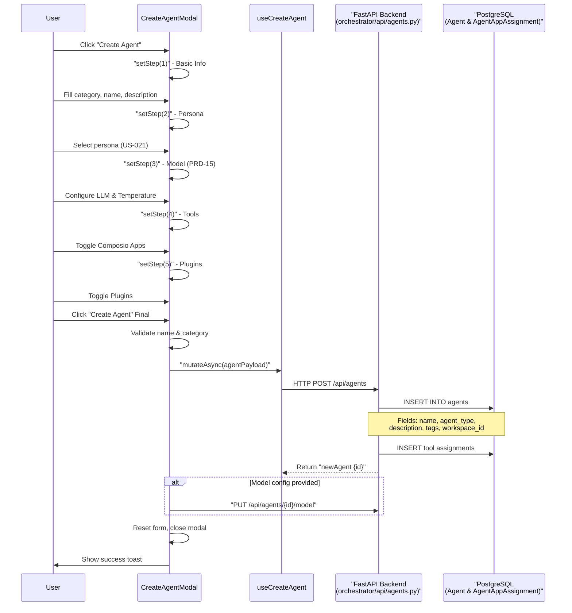
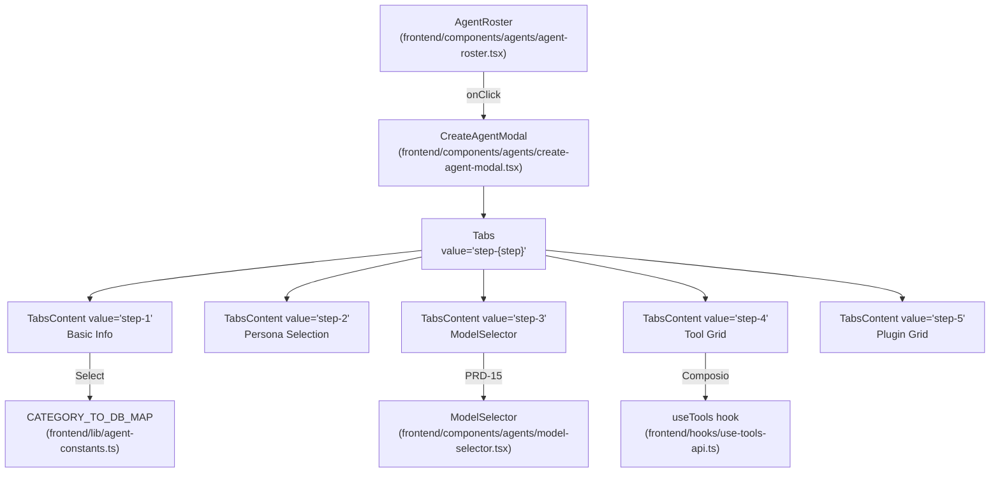

# Creating Agents

<details>
<summary>Relevant source files</summary>

The following files were used as context for generating this wiki page:

- [frontend/components/agents/agent-configuration-modal.tsx](frontend/components/agents/agent-configuration-modal.tsx)
- [frontend/components/agents/agent-configuration.tsx](frontend/components/agents/agent-configuration.tsx)
- [frontend/components/agents/agent-details-modal.tsx](frontend/components/agents/agent-details-modal.tsx)
- [frontend/components/agents/agent-roster.tsx](frontend/components/agents/agent-roster.tsx)
- [frontend/components/agents/create-agent-modal.tsx](frontend/components/agents/create-agent-modal.tsx)
- [frontend/components/documents/analytics-tab.tsx](frontend/components/documents/analytics-tab.tsx)
- [frontend/components/documents/processing-tab.tsx](frontend/components/documents/processing-tab.tsx)
- [frontend/lib/agent-constants.ts](frontend/lib/agent-constants.ts)
- [orchestrator/alembic/versions/add_job_title_to_agents.py](orchestrator/alembic/versions/add_job_title_to_agents.py)
- [orchestrator/alembic/versions/agent_public_id_and_slug_fix.py](orchestrator/alembic/versions/agent_public_id_and_slug_fix.py)
- [orchestrator/alembic/versions/seed_auto_agents_existing_workspaces.py](orchestrator/alembic/versions/seed_auto_agents_existing_workspaces.py)
- [orchestrator/api/agents.py](orchestrator/api/agents.py)
- [orchestrator/core/models/core.py](orchestrator/core/models/core.py)
- [orchestrator/core/utils/agent_resolver.py](orchestrator/core/utils/agent_resolver.py)

</details>


Agent creation is implemented as a multi-step modal wizard in the `CreateAgentModal` component. The flow involves sequential API calls to persist agent configuration across multiple backend tables, including model settings, personas, and tool assignments.

## Overview

The agent creation wizard collects configuration in 5 progressive steps, each rendering a `TabsContent` component controlled by the `step` state variable:

| Step | Tab ID | Purpose | Primary State |
|------|--------|---------|---------------|
| 1 | `step-1` | Basic metadata (category, name, description, tags) | `agentData.category`, `agentData.name` [[frontend/components/agents/create-agent-modal.tsx:68-72]]() |
| 2 | `step-2` | Persona assignment (predefined/custom/none) | `personaMode`, `selectedPersonaId` [[frontend/components/agents/create-agent-modal.tsx:84-85]]() |
| 3 | `step-3` | LLM configuration (provider, model_id, parameters) | `modelConfig` object [[frontend/components/agents/create-agent-modal.tsx:81-81]]() |
| 4 | `step-4` | Composio tool assignments (e.g., Gmail, Slack) | `agentData.tools` array [[frontend/components/agents/create-agent-modal.tsx:74-74]]() |
| 5 | `step-5` | Marketplace plugin assignments | `agentData.plugins` array [[frontend/components/agents/create-agent-modal.tsx:73-73]]() |

The `handleCreate` function at [[frontend/components/agents/create-agent-modal.tsx:176-320]]() orchestrates the atomic creation flow by calling:
1. `useCreateAgent().mutateAsync()` → `POST /api/agents` [[frontend/components/agents/create-agent-modal.tsx:215-215]]()
2. `useUpdateAgentModelConfig().mutateAsync()` → `PUT /api/agents/{id}/model` [[frontend/components/agents/create-agent-modal.tsx:227-227]]()
3. `apiClient.request()` → `PUT /api/agents/{id}/persona` [[frontend/components/agents/create-agent-modal.tsx:240-240]]()
4. `apiClient.request()` → `PUT /api/agents/{id}/plugins` [[frontend/components/agents/create-agent-modal.tsx:262-262]]()

**Sources:** [[frontend/components/agents/create-agent-modal.tsx:66-102]](), [[frontend/components/agents/create-agent-modal.tsx:176-320]]()

---

## Agent Creation Flow

**End-to-End Creation Sequence**

Title: Agent Creation Sequence


**Component Hierarchy and Code Association**

Title: Component to Code Mapping


**Sources:** [[frontend/components/agents/create-agent-modal.tsx:176-320]](), [[frontend/components/agents/agent-roster.tsx:198-230]](), [[frontend/lib/agent-constants.ts:48-65]]()

---

## Triggering Agent Creation

The agent creation modal is typically triggered from the Agent Management views (like `AgentRoster`) or specialized dashboards.

### Entry Point

In the `AgentRoster` component, the modal is managed via state:

```typescript
// Example from agent-roster.tsx context
const [showCreateModal, setShowCreateModal] = useState(false)
// ...
<CreateAgentModal 
  open={showCreateModal} 
  onClose={() => setShowCreateModal(false)} 
  onSuccess={onRefresh} 
/>
```

**Sources:** [[frontend/components/agents/agent-roster.tsx:213-230]]()

---

## The 5-Step Wizard

### Step 1: Basic Information

**Form State Structure**

[[frontend/components/agents/create-agent-modal.tsx:68-78]]() defines the `agentData` state:

```typescript
const [agentData, setAgentData] = useState({
  name: '',
  category: '',  // UI-facing category
  description: '',
  tags: '',
  plugins: [] as string[],
  tools: [] as number[],
  specializations: [] as string[],
  shareToMarketplace: false
})
```

**Category to agent_type Conversion**

At [[frontend/components/agents/create-agent-modal.tsx:196-202]](), the UI category is converted to the database `agent_type` value using a constant map defined in `agent-constants.ts` [[frontend/lib/agent-constants.ts:48-65]]():

```typescript
const dbAgentType = CATEGORY_TO_DB_MAP[agentData.category] || 'custom'

const agentPayload = {
  name: agentData.name,
  agent_type: dbAgentType,
  marketplace_category: agentData.category, // Round-trip preservation
  description: agentData.description || '',
  // ...
}
```

**Sources:** [[frontend/components/agents/create-agent-modal.tsx:68-78]](), [[frontend/components/agents/create-agent-modal.tsx:196-202]](), [[frontend/lib/agent-constants.ts:48-65]]()

---

### Step 2: Persona (US-021)

The persona step allows users to define the agent's identity. Three modes are supported:

- **None**: Default system prompt.
- **Predefined**: Select from a library of personas fetched via `GET /api/personas` [[frontend/components/agents/create-agent-modal.tsx:132-142]]().
- **Custom**: Write a custom system prompt.

#### Predefined Persona Filtering

Personas can be filtered by category to ensure relevance to the agent's intended role [[frontend/components/agents/create-agent-modal.tsx:89-89]]().

**Sources:** [[frontend/components/agents/create-agent-modal.tsx:84-91]](), [[frontend/components/agents/create-agent-modal.tsx:132-142]]()

---

### Step 3: Model Selection (PRD-15)

The model step allows users to select an LLM provider and configure parameters using the `ModelSelector` component [[frontend/components/agents/create-agent-modal.tsx:39-39]]().

#### Model Configuration State

[[frontend/components/agents/create-agent-modal.tsx:81-81]]() initializes with defaults:

```typescript
const [modelConfig, setModelConfig] = useState(getDefaultModelConfig())
```

The `LLMModel` registry in the backend stores metadata, capabilities, and costs for these selections [[orchestrator/core/models/core.py:43-94]]().

**Sources:** [[frontend/components/agents/create-agent-modal.tsx:81-81]](), [[frontend/components/agents/create-agent-modal.tsx:39-39]](), [[orchestrator/core/models/core.py:43-94]]()

---

### Step 4: Tools (Composio Integration)

The tools step allows users to assign Composio app integrations to the agent.

#### Tools Data Fetching

Available tools are fetched via the `useTools` hook, filtering for active connections:

[[frontend/components/agents/create-agent-modal.tsx:98-99]]()

```typescript
const { data: toolsResponse, isLoading: toolsLoading } = useTools({ status: 'active', limit: 100 })
const availableTools = toolsResponse?.data || []
```

Tool assignment is tracked in the `agentData.tools` array of IDs [[frontend/components/agents/create-agent-modal.tsx:163-170]](). These assignments are persisted in the `agent_app_assignments` table in the backend [[orchestrator/api/agents.py:182-186]]().

**Sources:** [[frontend/components/agents/create-agent-modal.tsx:98-99]](), [[frontend/components/agents/create-agent-modal.tsx:163-170]](), [[orchestrator/api/agents.py:182-186]]()

---

### Step 5: Capabilities (Plugins)

The final step allows users to assign marketplace plugins to the agent.

#### Workspace Plugin Fetching

Only workspace-enabled plugins are available for assignment. These are fetched via `GET /api/workspaces/{workspaceId}/plugins` when the modal opens [[frontend/components/agents/create-agent-modal.tsx:105-126]](). Assignments are stored in the `AgentAssignedPlugin` model [[orchestrator/api/agents.py:15-15]]().

**Sources:** [[frontend/components/agents/create-agent-modal.tsx:105-126]](), [[orchestrator/api/agents.py:15-15]]()

---

## Backend API Flow

The agent creation process involves multiple sequential API calls to ensure all configuration layers are persisted.

### Primary Agent Creation

The `handleCreate` function orchestrates the flow:

[[frontend/components/agents/create-agent-modal.tsx:176-320]]()

1. **POST /api/agents**: Creates the base agent record. The backend also handles semantic re-indexing of the agent for the router [[orchestrator/api/agents.py:38-65]]().
2. **PUT /api/agents/{id}/model**: Persists LLM settings to the model configuration JSONB field [[orchestrator/core/models/core.py:207-207]]().
3. **PUT /api/agents/{id}/persona**: Updates persona identity or custom prompt.
4. **PUT /api/agents/{id}/plugins**: Bulk assigns marketplace plugins.

### Heartbeat Configuration

Agents can also be configured with a "Heartbeat" (autonomous periodic check) via the `AgentConfigurationModal` [[frontend/components/agents/agent-configuration-modal.tsx:156-172]](). This schedules autonomous checks for the agent's assigned tasks.

**Sources:** [[frontend/components/agents/create-agent-modal.tsx:176-320]](), [[orchestrator/api/agents.py:38-65]](), [[frontend/components/agents/agent-configuration-modal.tsx:156-172]]()

---

## Error Handling

The creation flow includes error handling for both critical and non-critical failures:

- **Critical**: Failure to provide a name or category triggers a `toast.error` and halts the flow [[frontend/components/agents/create-agent-modal.tsx:179-183]]().
- **Async Operations**: Each subsequent configuration call (model, persona, plugins) is awaited. Errors during these steps are caught and displayed via toast notifications [[frontend/components/agents/create-agent-modal.tsx:313-317]]().

**Sources:** [[frontend/components/agents/create-agent-modal.tsx:179-183]](), [[frontend/components/agents/create-agent-modal.tsx:313-317]]()

---