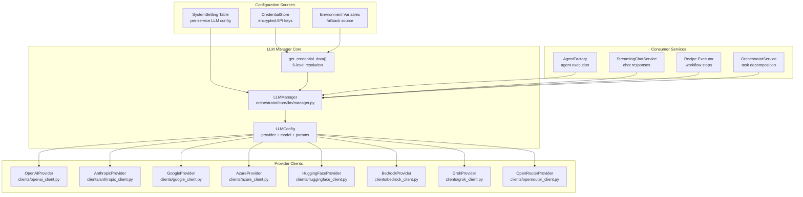
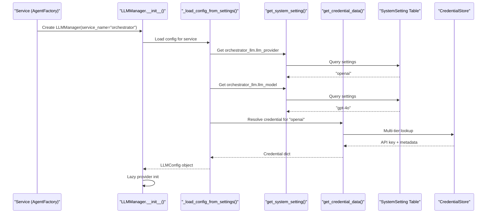
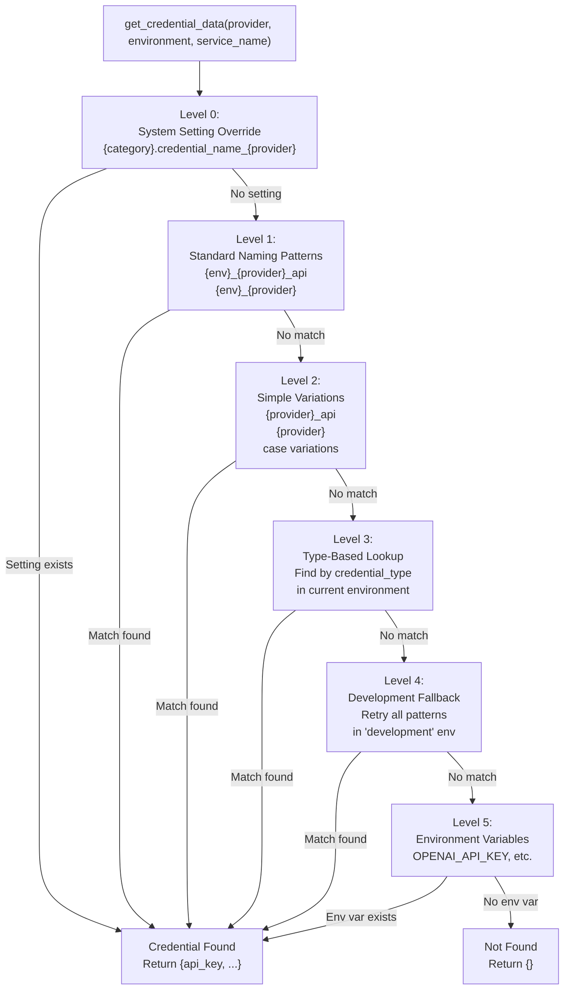
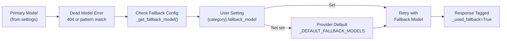
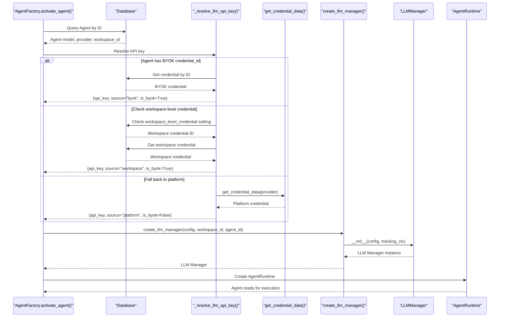
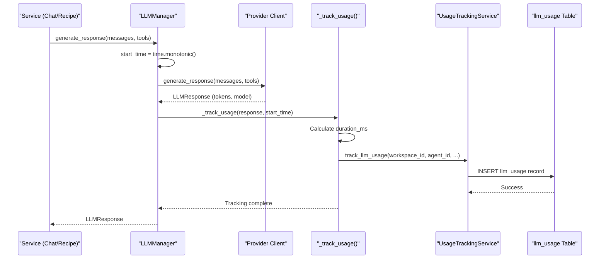
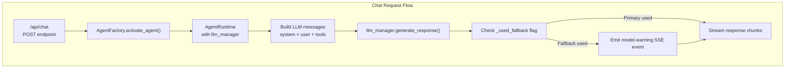

# LLM Provider Management

<details>
<summary>Relevant source files</summary>

The following files were used as context for generating this wiki page:

- [frontend/tsconfig.tsbuildinfo](frontend/tsconfig.tsbuildinfo)
- [orchestrator/api/workflows.py](orchestrator/api/workflows.py)
- [orchestrator/consumers/chatbot/service.py](orchestrator/consumers/chatbot/service.py)
- [orchestrator/core/llm/manager.py](orchestrator/core/llm/manager.py)
- [orchestrator/modules/agents/factory/agent_factory.py](orchestrator/modules/agents/factory/agent_factory.py)
- [orchestrator/modules/orchestrator/pipeline.py](orchestrator/modules/orchestrator/pipeline.py)
- [orchestrator/modules/orchestrator/service.py](orchestrator/modules/orchestrator/service.py)

</details>


## Purpose and Scope

This document describes how Automatos AI manages LLM provider connections, credentials, and failover mechanisms through the `LLMManager` system. The LLM Manager abstracts multiple AI providers (OpenAI, Anthropic, Google, etc.) behind a unified interface, handles credential resolution with 6-level fallback, and provides automatic model failover when primary models are deprecated or unavailable.

For information about how agents are created and configured with specific models, see [Agent Configuration](#3.2). For details on agent runtime lifecycle, see [Agent Factory & Runtime](#3.5). For credential storage and encryption, see [Credentials Management](#12.4).

**Sources:** [orchestrator/core/llm/manager.py:1-50]()

---

## Architecture Overview



The `LLMManager` serves as the central abstraction layer between services and AI providers. It loads configuration from system settings, resolves credentials through a multi-tier fallback strategy, and instantiates the appropriate provider client.

**Sources:** [orchestrator/core/llm/manager.py:355-424](), [orchestrator/modules/agents/factory/agent_factory.py:473-475]()

---

## Supported Providers

| Provider | Enum Value | Client Class | Primary Use Case |
|----------|-----------|--------------|------------------|
| OpenAI | `LLMProvider.OPENAI` | `OpenAIProvider` | GPT-4, GPT-4o models |
| Anthropic | `LLMProvider.ANTHROPIC` | `AnthropicProvider` | Claude 3.5 Sonnet/Opus |
| Google | `LLMProvider.GOOGLE` | `GoogleProvider` | Gemini Pro/Flash |
| Azure OpenAI | `LLMProvider.AZURE` | `AzureProvider` | Enterprise OpenAI deployment |
| HuggingFace | `LLMProvider.HUGGINGFACE` | `HuggingFaceProvider` | Open-source models |
| AWS Bedrock | `LLMProvider.AWS_BEDROCK` | `BedrockProvider` | AWS-hosted models |
| xAI Grok | `LLMProvider.GROK` | `GrokProvider` | Grok-2 models |
| OpenRouter | `LLMProvider.OPENROUTER` | `OpenRouterProvider` | Multi-provider proxy |

Each provider client implements the `LLMProvider` base interface with `generate_response()` (async) and `generate_response_sync()` methods. OpenRouter serves as a universal fallback for unknown providers with slash-formatted model names (e.g., `qwen/qwen3-coder-next`).

**Sources:** [orchestrator/core/llm/manager.py:18-26](), [orchestrator/core/llm/manager.py:591-611]()

---

## Configuration System

### Per-Service Configuration

The LLM Manager supports independent configuration for each service in the system via the `SERVICE_CATEGORY_MAP`:

```python
SERVICE_CATEGORY_MAP = {
    "orchestrator": "orchestrator_llm",
    "codegraph": "codegraph",
    "document_processing": "document_processing",
    "chatbot": "chatbot",
    "rag": "rag",
    "embeddings": "embeddings",
    "memory_integration": "memory_integration",
    "nl2sql": "nl2sql",
    "complexity_assessor": "complexity_assessor",
}
```

Each service can have different provider/model settings in the `system_settings` table with keys:
- `{category}.llm_provider` - Provider name (e.g., "openai", "anthropic")
- `{category}.llm_model` - Model identifier (e.g., "gpt-4o", "claude-3-5-sonnet-20241022")
- `{category}.temperature` - Sampling temperature (default: 0.7)
- `{category}.max_tokens` - Maximum output tokens (default: 2000)
- `{category}.credential_name_{provider}` - Explicit credential name mapping (optional)
- `{category}.fallback_model` - Secondary model when primary is unavailable (optional)

**Sources:** [orchestrator/core/llm/manager.py:30-41](), [orchestrator/core/llm/manager.py:86-117]()

### Loading Configuration



The configuration loading process:
1. Service requests `LLMManager` with `service_name` parameter
2. Manager maps service name to settings category via `SERVICE_CATEGORY_MAP`
3. Reads `llm_provider` and `llm_model` from `system_settings` table
4. Calls `get_credential_data()` for API key resolution
5. Creates `LLMConfig` object with provider enum, model string, and parameters
6. Provider client is lazy-initialized on first LLM call

**Sources:** [orchestrator/core/llm/manager.py:369-424](), [orchestrator/core/llm/manager.py:426-564]()

---

## Credential Resolution Strategy

The `get_credential_data()` function implements a **6-level fallback strategy** to maximize credential discovery flexibility while supporting explicit mappings:



### Level 0: Explicit Setting Override

Checks for user-configured credential name mapping in system settings:
- Key: `{category}.credential_name_{provider}` (e.g., `orchestrator_llm.credential_name_openai`)
- Value: Exact credential name to use (e.g., `"production_openai_primary"`)
- **Purpose**: Allows workspace admins to explicitly map which credential to use per service/provider

**Sources:** [orchestrator/core/llm/manager.py:152-178]()

### Level 1-2: Name Pattern Matching

Tries multiple naming variations in order:
1. `{environment}_{provider}_api` (e.g., `production_openai_api`) - Standard convention
2. `{environment}_{provider}` (e.g., `production_openai`) - User convention
3. `{provider}_api` (e.g., `openai_api`) - Simple form
4. `{provider}` (e.g., `openai`) - Provider name only
5. Case variations: lowercase, capitalized, title case

Special handling for AWS Bedrock: also tries `aws_bedrock`, `bedrock`, `aws` variations.

**Sources:** [orchestrator/core/llm/manager.py:199-254]()

### Level 3: Type-Based Lookup

When name-based lookup fails, searches for **any active credential** of matching type:
- Maps provider to credential type (e.g., `openai` → `openai_api`)
- Queries `credentials` table filtered by `credential_type_id` and `environment`
- Uses first active credential found
- **Purpose**: Supports flexible naming while ensuring credentials are found

**Sources:** [orchestrator/core/llm/manager.py:257-292]()

### Level 4: Development Environment Fallback

If current environment (e.g., `production`) yields no results, retries all strategies in `development` environment. This allows development credentials to serve as fallback when production keys are unavailable.

**Sources:** [orchestrator/core/llm/manager.py:294-342]()

### Level 5: Environment Variable Fallback

Final fallback to environment variables (except HuggingFace which requires credential store):
- `OPENAI_API_KEY`
- `ANTHROPIC_API_KEY`
- `GOOGLE_API_KEY`
- `AZURE_OPENAI_API_KEY`
- `AWS_ACCESS_KEY_ID`
- `XAI_API_KEY`
- `OPENROUTER_API_KEY`

**Sources:** [orchestrator/core/llm/manager.py:535-548]()

### Credential Data Structure

The returned credential dictionary contains provider-specific fields:

| Provider | Required Fields | Optional Fields |
|----------|----------------|-----------------|
| OpenAI | `api_key` | `base_url`, `organization_id` |
| Anthropic | `api_key` | `base_url` |
| Google | `api_key` | - |
| Azure | `api_key`, `endpoint_url` | - |
| HuggingFace | `api_token` | - |
| AWS Bedrock | `bedrock_api_key` OR `aws_access_key_id` + `aws_secret_access_key` | `aws_region` |
| Grok | `api_key` | - |
| OpenRouter | `api_key` | - |

**Sources:** [orchestrator/core/llm/manager.py:496-533]()

---

## Model Fallback Mechanism

### Dead Model Detection

The LLM Manager automatically detects when a configured model is permanently unavailable (not just a transient error) using regex patterns:

```python
_DEAD_MODEL_PATTERNS = [
    re.compile(r"no endpoints found", re.IGNORECASE),
    re.compile(r"model not found", re.IGNORECASE),
    re.compile(r"does not exist", re.IGNORECASE),
    re.compile(r"model .+ is not available", re.IGNORECASE),
    re.compile(r"invalid model", re.IGNORECASE),
]
```

Also checks for HTTP 404 status codes in exception messages.

**Sources:** [orchestrator/core/llm/manager.py:566-573]()

### Fallback Model Selection



Default fallback models per provider (cheap & reliable):

| Provider | Default Fallback Model |
|----------|------------------------|
| OpenRouter | `meta-llama/llama-3.1-70b-instruct` |
| OpenAI | `gpt-4o-mini` |
| Anthropic | `claude-3-5-haiku-20241022` |
| Google | `gemini-2.0-flash` |
| Azure | `gpt-4o-mini` |
| Grok | `grok-2-latest` |
| HuggingFace | `mistralai/Mistral-7B-Instruct-v0.2` |

**Sources:** [orchestrator/core/llm/manager.py:575-584](), [orchestrator/core/llm/manager.py:621-641]()

### Fallback Execution Flow

```python
async def generate_response(self, messages, tools=None):
    try:
        response = await self.provider.generate_response(messages, tools)
        return response
    except Exception as exc:
        if not self._is_retriable_model_error(exc):
            raise  # Transient error - fail fast
        
        fallback_model = self._get_fallback_model()
        if not fallback_model:
            raise  # No fallback configured
        
        # Build new config with same credentials but different model
        fb_config = self._build_fallback_config(fallback_model)
        fb_provider = self._create_provider(fb_config)
        response = await fb_provider.generate_response(messages, tools)
        
        # Tag response so callers know fallback was used
        response._used_fallback = True
        response._failed_model = self.config.model
        response._fallback_model = fallback_model
        return response
```

When fallback is used, the response object is tagged with:
- `_used_fallback = True`
- `_failed_model` - Original model that failed
- `_fallback_model` - Model that succeeded

This allows consumers to emit warnings to users about updating their settings.

**Sources:** [orchestrator/core/llm/manager.py:643-691]()

---

## Usage in Agent Factory

### Agent Initialization with LLM Manager

The `AgentFactory` uses the LLM Manager when activating agents. The process varies based on whether the agent uses BYOK (Bring Your Own Key) credentials or platform credentials:



**Sources:** [orchestrator/modules/agents/factory/agent_factory.py:808-1093]()

### Agent Model Configuration

Agents store model configuration in the `configuration` JSON field with structure:

```json
{
  "provider": "openai",
  "model": "gpt-4o",
  "temperature": 0.7,
  "max_tokens": 2000,
  "top_p": 1.0,
  "frequency_penalty": 0.0,
  "presence_penalty": 0.0,
  "fallback_model_id": "gpt-4o-mini"
}
```

The `ModelConfiguration` dataclass (defined in `agent_factory.py`) encapsulates these settings and provides helper methods for conversion to/from dictionary format.

**Sources:** [orchestrator/modules/agents/factory/agent_factory.py:322-374]()

### API Key Resolution Priority

The `_resolve_llm_api_key()` method implements a 6-level credential resolution specific to agents:

1. **Agent-specific BYOK credential** - `agent.credential_id` points to dedicated credential
2. **Workspace-level BYOK credential** - `system_settings.workspace_level_credential_{provider}` for workspace
3. **Global workspace credential** - `system_settings.workspace_llm_credential` (any provider)
4. **Platform credential (name-based)** - Standard credential lookup via `get_credential_data()`
5. **Platform credential (type-based)** - Find any credential of matching type in environment
6. **Environment variable fallback** - Last resort for platform-managed keys

Credentials from levels 1-3 are marked as `is_byok=True` for usage tracking and billing purposes.

**Sources:** [orchestrator/modules/agents/factory/agent_factory.py:925-1093]()

---

## Usage Tracking

### Tracking Context

Every `LLMManager` instance accepts tracking context parameters:

```python
LLMManager(
    config=config,
    workspace_id=workspace_id,        # For workspace attribution
    agent_id=agent_id,                # For agent-level tracking
    execution_id=execution_id,        # For workflow/recipe correlation
    request_type="chat",              # Label: chat, recipe, orchestrator
    is_byok=False,                    # BYOK vs platform credentials
)
```

This context is stored in `self._tracking_ctx` and passed to the usage tracking service on every LLM call.

**Sources:** [orchestrator/core/llm/manager.py:369-391]()

### Automatic Usage Recording



The `_track_usage()` method captures:
- **Tokens**: Prompt tokens, completion tokens, total tokens
- **Timing**: Duration in milliseconds
- **Model**: Actual model used (may be fallback)
- **Status**: "success", "error", or "fallback"
- **Cost**: Calculated based on model pricing
- **Context**: Workspace, agent, execution, request type
- **BYOK Flag**: Whether BYOK credentials were used

**Sources:** [orchestrator/core/llm/manager.py:643-691]()

---

## Integration with Chat Service

The `StreamingChatService` demonstrates typical LLM Manager usage in production:



Key code sections:
1. **Agent activation** - [consumers/chatbot/service.py:543-553]() creates agent with LLM manager
2. **Message preparation** - [consumers/chatbot/service.py:623-635]() builds prompt with system, tools
3. **LLM call** - [consumers/chatbot/service.py:844-847]() `await agent_runtime.llm_manager.generate_response()`
4. **Fallback detection** - [consumers/chatbot/service.py:850-870]() checks `_used_fallback` flag
5. **Warning emission** - Sends SSE event to frontend with model-warning type

When fallback occurs, users see a warning message:
> "Your configured model ({failed_model}) is unavailable. Using {fallback_model} as fallback. Please update your model in Settings > Orchestrator."

**Sources:** [orchestrator/consumers/chatbot/service.py:493-878]()

---

## Per-Service Model Flexibility

Different services can use different models and providers optimized for their use case:

| Service | Common Provider | Common Model | Rationale |
|---------|----------------|--------------|-----------|
| `orchestrator` | OpenAI | gpt-4o | Task decomposition requires strong reasoning |
| `codegraph` | Anthropic | claude-3-5-sonnet-20241022 | Code understanding, large context |
| `chatbot` | OpenAI | gpt-4o | Conversational quality |
| `rag` | OpenAI | gpt-4o-mini | Fast, cheap for retrieval |
| `embeddings` | OpenAI | text-embedding-3-large | Vector quality |
| `complexity_assessor` | OpenAI | gpt-4o-mini | Fast routing decisions |
| `document_processing` | Anthropic | claude-3-5-sonnet-20241022 | Long documents |
| `memory_integration` | OpenAI | gpt-4o-mini | Memory summarization |
| `nl2sql` | OpenAI | gpt-4o | SQL query generation accuracy |

Each service reads its configuration independently from `system_settings`, allowing workspace admins to optimize cost vs. performance trade-offs per use case.

**Sources:** [orchestrator/core/llm/manager.py:30-41](), [orchestrator/core/llm/manager.py:426-564]()

---