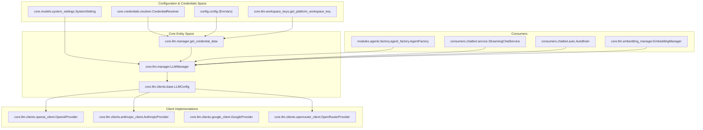
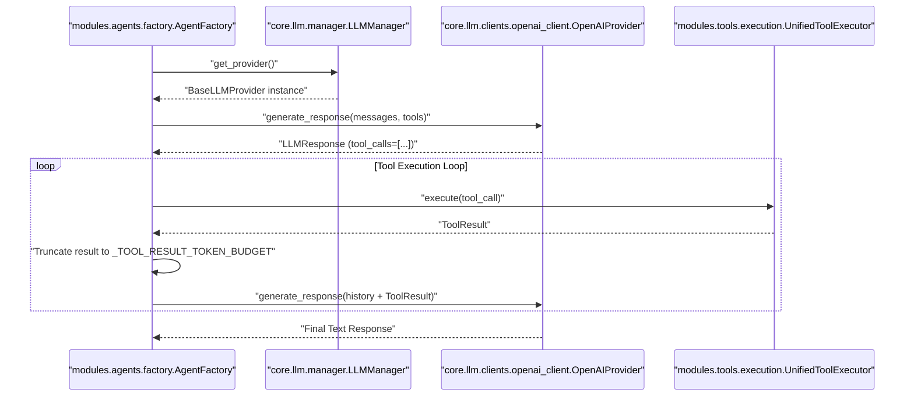

# LLM Provider Management

Relevant source files

The following files were used as context for generating this wiki page:

- [orchestrator/api/chat.py](orchestrator/api/chat.py)
- [orchestrator/api/routing.py](orchestrator/api/routing.py)
- [orchestrator/consumers/chatbot/auto.py](orchestrator/consumers/chatbot/auto.py)
- [orchestrator/consumers/chatbot/service.py](orchestrator/consumers/chatbot/service.py)
- [orchestrator/core/llm/clients/azure_client.py](orchestrator/core/llm/clients/azure_client.py)
- [orchestrator/core/llm/clients/base.py](orchestrator/core/llm/clients/base.py)
- [orchestrator/core/llm/clients/grok_client.py](orchestrator/core/llm/clients/grok_client.py)
- [orchestrator/core/llm/clients/openai_client.py](orchestrator/core/llm/clients/openai_client.py)
- [orchestrator/core/llm/embedding_manager.py](orchestrator/core/llm/embedding_manager.py)
- [orchestrator/core/llm/manager.py](orchestrator/core/llm/manager.py)
- [orchestrator/core/llm/rerank_manager.py](orchestrator/core/llm/rerank_manager.py)
- [orchestrator/core/llm/workspace_keys.py](orchestrator/core/llm/workspace_keys.py)
- [orchestrator/core/routing/engine.py](orchestrator/core/routing/engine.py)
- [orchestrator/modules/agents/factory/agent_factory.py](orchestrator/modules/agents/factory/agent_factory.py)
- [orchestrator/modules/memory/__init__.py](orchestrator/modules/memory/__init__.py)
- [orchestrator/modules/rag/config.py](orchestrator/modules/rag/config.py)
- [orchestrator/modules/search/optimization/context_optimizer.py](orchestrator/modules/search/optimization/context_optimizer.py)
- [orchestrator/modules/search/vector_store/backends/s3_vectors_mock.py](orchestrator/modules/search/vector_store/backends/s3_vectors_mock.py)
- [orchestrator/modules/tools/discovery/platform_actions.py](orchestrator/modules/tools/discovery/platform_actions.py)
- [orchestrator/modules/tools/discovery/platform_executor.py](orchestrator/modules/tools/discovery/platform_executor.py)
- [orchestrator/scripts/setup_jira_trigger.py](orchestrator/scripts/setup_jira_trigger.py)
- [orchestrator/services/heartbeat_service.py](orchestrator/services/heartbeat_service.py)
- [orchestrator/services/page_context.py](orchestrator/services/page_context.py)
- [orchestrator/tests/test_prd221_page_context.py](orchestrator/tests/test_prd221_page_context.py)
- [orchestrator/tests/test_prd221_page_prior_tools.py](orchestrator/tests/test_prd221_page_prior_tools.py)
- [orchestrator/tests/test_w3_freeze_fixes.py](orchestrator/tests/test_w3_freeze_fixes.py)
- [orchestrator/tests/test_workspace_keys.py](orchestrator/tests/test_workspace_keys.py)

## Purpose and Scope

This document describes how Automatos AI manages LLM provider connections, credentials, and failover mechanisms through the `LLMManager` system (`core/llm/manager.py`). The LLM Manager abstracts multiple AI providers (OpenAI, Anthropic, Google, OpenRouter, Azure, HuggingFace, AWS Bedrock, Grok, DeepSeek, Nvidia) behind a unified interface (`BaseLLMProvider`), handles credential resolution with a 3-tier resolution strategy (BYOK, Credential Store, and Environment Variables), and provides automatic provider detection based on service-specific requirements.

The system ensures that every internal service—from the orchestrator reasoning loop to the embeddings pipeline (`EmbeddingManager`)—has access to optimized LLM resources while maintaining strict workspace isolation and cost tracking.

Sources: `[orchestrator/core/llm/manager.py:1-7]`, `[orchestrator/core/llm/manager.py:29-41]`, `[orchestrator/modules/agents/factory/agent_factory.py:24-27]`

---

## Architecture Overview

The `LLMManager` serves as the central abstraction layer, instantiated via helper factories. It loads configuration from `SystemSetting` model entries, resolves credentials through a multi-tier fallback strategy, and instantiates provider-specific clients inheriting from `BaseLLMProvider`.

### LLM Management Data Flow & Code Entity Mapping

This diagram bridges natural language configuration concepts to the underlying code entities (`manager.py`, `SystemSetting`, `CredentialResolver`, `BaseLLMProvider`).

Sources: `[orchestrator/core/llm/manager.py:17-26]`, `[orchestrator/core/llm/manager.py:135-154]`, `[orchestrator/modules/agents/factory/agent_factory.py:160-176]`, `[orchestrator/core/llm/embedding_manager.py:66-78]`

---

## Supported Providers & Model Configuration

Automatos AI maps specific internal services to LLM tiers via `SERVICE_CATEGORY_MAP` (`core/llm/manager.py`). This ensures that expensive, high-reasoning models are used for planning, while cheaper models handle classification or chitchat.

### Canonical Service Tiers
Services are mapped to three primary categories in `SERVICE_CATEGORY_MAP`:
*   **Auto Tier (`orchestrator_llm`)**: Used by the `orchestrator` and `heartbeat` service for complex reasoning, planning, and chat orchestration.
*   **System Tier (`system_llm`)**: Used by `chatbot`, `codegraph`, `document_processing`, `rag`, `memory_integration`, `nl2sql`, `complexity_assessor` (AutoBrain), `planner`, `verifier`, and `graph_extraction` for high-volume internal tasks.
*   **Embeddings Tier (`embeddings`)**: Used strictly for vectorization via `EmbeddingManager`.

### Provider Capabilities

| Provider | Enum / Identifier | Client Class | Implementation Notes |
|----------|-------------------|--------------|----------------------|
| **OpenAI** | `LLMProvider.OPENAI` | `OpenAIProvider` | Supports native tool calling and strict schema sanitization `[orchestrator/core/llm/clients/openai_client.py:21-22]`. |
| **Anthropic** | `LLMProvider.ANTHROPIC` | `AnthropicProvider` | Handles Claude prompt caching and multi-block formatting. |
| **Google** | `LLMProvider.GOOGLE` | `GoogleProvider` | Integrates Gemini models and multimodal payload blocks. |
| **OpenRouter** | `LLMProvider.OPENROUTER` | `OpenRouterProvider` | Aggregator for 200+ models. Includes logic to extract Gemini-style images from `images` fields `[orchestrator/core/llm/clients/openrouter_client.py:26-27]`. |
| **Grok** | `LLMProvider.GROK` | `GrokProvider` | xAI Grok models via OpenAI-compatible wrapper `[orchestrator/core/llm/clients/grok_client.py:22-26]`. |
| **HuggingFace** | `LLMProvider.HUGGINGFACE` | `HuggingFaceProvider` | Used for TGI or local inference endpoints. |

Sources: `[orchestrator/core/llm/manager.py:33-53]`, `[orchestrator/core/llm/clients/base.py:40-55]`, `[orchestrator/core/llm/clients/openai_client.py:21-22]`

---

## 3-Tier API Key Resolution

The `get_credential_data` function in `core/llm/manager.py` implements a prioritized resolution strategy to find API keys securely without hardcoding secrets `[orchestrator/core/llm/manager.py:135-154]`.

### 1. BYOK & Explicit Mapping (Tier 1)
The system checks `SystemSetting` for an explicit credential name mapping (e.g., `orchestrator_llm.credential_name_openai`) `[orchestrator/core/llm/manager.py:163-170]`. It also attempts to retrieve workspace-specific keys via `get_platform_workspace_key` `[orchestrator/core/llm/embedding_manager.py:104-105]`.

### 2. Credential Store (Tier 2)
If no explicit mapping exists, the `CredentialResolver` attempts flexible pattern matching against the encrypted credential database:
*   `{environment}_{provider}_api` (e.g., `development_openai_api`) `[orchestrator/core/llm/manager.py:140-145]`.
*   `{environment}_{provider}` `[orchestrator/core/llm/manager.py:186-187]`.
*   Fallback to searching by credential type (e.g., `openai_api`) `[orchestrator/core/llm/manager.py:143-144]`.

### 3. Environment Variables (Tier 3)
If the credential store lookup fails, the system falls back to standard environment variables defined in `config` (e.g., `OPENAI_API_KEY`, `ANTHROPIC_API_KEY`, `OPENROUTER_API_KEY`) `[orchestrator/core/llm/manager.py:199-254]`.

Sources: `[orchestrator/core/llm/manager.py:135-187]`, `[orchestrator/core/llm/embedding_manager.py:99-110]`

---

## Embedding & Rerank Managers

The `EmbeddingManager` (`core/llm/embedding_manager.py`) and `RerankManager` (`core/llm/rerank_manager.py`) govern vector generation and cross-encoder reranking.

### EmbeddingManager Lifecycle
1.  Reads configuration keys (`provider`, `model`, `cache_dir`, `dimensions`) from `SystemSetting` under the `embeddings` category `[orchestrator/core/llm/embedding_manager.py:66-78]`.
2.  Resolves API keys via workspace keys and credential store fallbacks `[orchestrator/core/llm/embedding_manager.py:102-120]`.
3.  Falls back to `DeterministicEmbeddingProvider` if embeddings are disabled or credentials are missing `[orchestrator/core/llm/embedding_manager.py:94-96]`.

Sources: `[orchestrator/core/llm/embedding_manager.py:54-149]`, `[orchestrator/core/llm/rerank_manager.py:1-40]`

---

## Tool Execution Loop & LLM Interaction

When an agent or chat service executes, it interacts with the LLM via a structured tool loop managed by `ToolLoopExecutor` (`modules/tools/execution/tool_loop.py`) and provider clients.

### Tool Choice Logic & Code Entity Mapping
Provider clients like `OpenAIProvider` dynamically adjust `tool_choice` based on conversation history and explicit system instructions `[orchestrator/core/llm/clients/openai_client.py:81-99]`.

Sources: `[orchestrator/core/llm/clients/openai_client.py:81-99]`, `[orchestrator/consumers/chatbot/service.py:31-35]`, `[orchestrator/consumers/chatbot/service.py:64-66]`

---