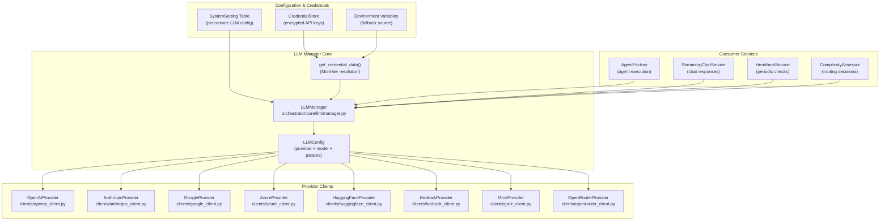
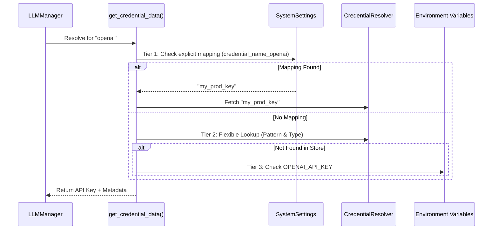

# LLM Provider Management

<details>
<summary>Relevant source files</summary>

The following files were used as context for generating this wiki page:

- [docs/PRDS/78-AUTONOMOUS-TEST-COVERAGE-QUALITY-MESH.md](docs/PRDS/78-AUTONOMOUS-TEST-COVERAGE-QUALITY-MESH.md)
- [orchestrator/api/tools.py](orchestrator/api/tools.py)
- [orchestrator/core/composio/client.py](orchestrator/core/composio/client.py)
- [orchestrator/core/composio/tool_executor.py](orchestrator/core/composio/tool_executor.py)
- [orchestrator/core/llm/clients/azure_client.py](orchestrator/core/llm/clients/azure_client.py)
- [orchestrator/core/llm/clients/grok_client.py](orchestrator/core/llm/clients/grok_client.py)
- [orchestrator/core/llm/clients/openai_client.py](orchestrator/core/llm/clients/openai_client.py)
- [orchestrator/core/llm/clients/openrouter_client.py](orchestrator/core/llm/clients/openrouter_client.py)
- [orchestrator/modules/agents/factory/agent_factory.py](orchestrator/modules/agents/factory/agent_factory.py)
- [orchestrator/modules/tools/services/composio_hint_service.py](orchestrator/modules/tools/services/composio_hint_service.py)
- [orchestrator/modules/tools/services/composio_tool_service.py](orchestrator/modules/tools/services/composio_tool_service.py)
- [orchestrator/services/metadata_sync_service.py](orchestrator/services/metadata_sync_service.py)
- [tests/RECIPE_RUNNERS.md](tests/RECIPE_RUNNERS.md)
- [tests/run_gap_finder.py](tests/run_gap_finder.py)
- [tests/run_health_regression.py](tests/run_health_regression.py)

</details>


## Purpose and Scope

This document describes how Automatos AI manages LLM provider connections, credentials, and failover mechanisms through the `LLMManager` system. The LLM Manager abstracts multiple AI providers (OpenAI, Anthropic, Google, etc.) behind a unified interface, handles credential resolution with a 3-tier resolution strategy (BYOK, Credential Store, and Environment Variables), and provides automatic provider detection.

The system ensures that every internal service—from the orchestrator to the complexity assessor—has access to optimized LLM resources while maintaining strict workspace isolation and cost tracking.

**Sources:** [orchestrator/core/llm/manager.py:1-7](), [orchestrator/core/llm/manager.py:29-41]()

---

## Architecture Overview

The `LLMManager` serves as the central abstraction layer between services and AI providers. It loads configuration from system settings, resolves credentials through a multi-tier fallback strategy, and instantiates the appropriate provider client.

### LLM Management Data Flow



**Sources:** [orchestrator/core/llm/manager.py:17-26](), [orchestrator/modules/agents/factory/agent_factory.py:25-25](), [orchestrator/services/heartbeat_service.py:113-121]()

---

## Supported Providers

Automatos AI supports a wide array of providers, each mapped to a specific client class that inherits from `BaseLLMProvider`.

| Provider | Enum Value | Client Class | Features |
|----------|-----------|--------------|----------|
| **OpenAI** | `LLMProvider.OPENAI` | `OpenAIProvider` | Native tool calling, context window protection [orchestrator/core/llm/clients/openai_client.py:21-22]() |
| **Anthropic** | `LLMProvider.ANTHROPIC` | `AnthropicProvider` | Claude 3.5 Sonnet/Haiku |
| **Google** | `LLMProvider.GOOGLE` | `GoogleProvider` | Gemini models |
| **Azure OpenAI** | `LLMProvider.AZURE` | `AzureProvider` | Enterprise deployment support |
| **HuggingFace** | `LLMProvider.HUGGINGFACE` | `HuggingFaceProvider` | TGI/Inference Endpoints |
| **AWS Bedrock** | `LLMProvider.BEDROCK` | `BedrockProvider` | AWS hosted models |
| **xAI Grok** | `LLMProvider.GROK` | `GrokProvider` | Grok-2 models via OpenAI-compatible API [orchestrator/core/llm/clients/grok_client.py:22-26]() |
| **OpenRouter** | `LLMProvider.OPENROUTER` | `OpenRouterProvider` | Aggregator for 200+ models, image extraction [orchestrator/core/llm/clients/openrouter_client.py:26-27]() |

**Sources:** [orchestrator/core/llm/manager.py:18-26](), [orchestrator/core/llm/clients/openrouter_client.py:26-27](), [orchestrator/core/llm/clients/grok_client.py:22-26]()

---

## Configuration System

### Per-Service Configuration

The system uses a canonical mapping from service names to settings categories, allowing granular control over which model performs which task.

```python
SERVICE_CATEGORY_MAP = {
    "orchestrator": "orchestrator_llm",
    "codegraph": "codegraph",
    "document_processing": "document_processing",
    "chatbot": "chatbot",
    "rag": "rag",
    "embeddings": "embeddings",
    "memory_integration": "memory_integration",
    "nl2sql": "nl2sql",
    "heartbeat": "orchestrator_llm",
    "complexity_assessor": "orchestrator_llm",
}
```

**Sources:** [orchestrator/core/llm/manager.py:30-41]()

### Configuration Resolution Logic

When a service requests an LLM, the `LLMManager` performs the following lookups via `get_provider_and_model_from_settings`:
1. **Provider/Model**: Fetches `llm_provider` and `llm_model` from the `SystemSetting` table for the specific service category [orchestrator/core/llm/manager.py:86-100]().
2. **Settings Keys**: It checks both `llm_provider`/`llm_model` and legacy `provider`/`model` keys [orchestrator/core/llm/manager.py:102-110]().
3. **No Defaults**: The system requires explicit configuration in settings; it will raise a `ValueError` if the provider or model is missing for a requested service [orchestrator/core/llm/manager.py:112-117]().

**Sources:** [orchestrator/core/llm/manager.py:86-117]()

---

## 3-Tier API Key Resolution

The `get_credential_data()` function implements a prioritized strategy to find API keys, ensuring that system-wide keys, workspace-specific keys, and environment variables are all resolved correctly.

### Resolution Hierarchy

1.  **BYOK / Explicit Mapping**: Checks `SystemSetting` for an explicit credential name mapping (e.g., `orchestrator_llm.credential_name_openai`) [orchestrator/core/llm/manager.py:214-230]().
2.  **Credential Store Lookup**: 
    *   Tries pattern: `{environment}_{provider}_api` [orchestrator/core/llm/manager.py:232-237]().
    *   Tries pattern: `{environment}_{provider}` [orchestrator/core/llm/manager.py:239-244]().
    *   Tries lookup by `credential_type` (e.g., `openai_api`) [orchestrator/core/llm/manager.py:246-254]().
3.  **Environment Variables**: Fallback to direct environment variables like `OPENAI_API_KEY` or `ANTHROPIC_API_KEY` [orchestrator/core/llm/manager.py:257-292]().



**Sources:** [orchestrator/core/llm/manager.py:124-180](), [orchestrator/core/llm/manager.py:199-254](), [orchestrator/core/llm/manager.py:257-292]()

---

## Provider Auto-Detection

The system supports automatic provider detection based on model IDs. The `AgentMetadata` class contains logic to infer the provider if only a `preferred_model` is provided:
- **Anthropic**: Detected if "claude" is in the model name [orchestrator/modules/agents/factory/agent_factory.py:122-123]().
- **HuggingFace**: Detected if "llama" or "mistral" is in the model name [orchestrator/modules/agents/factory/agent_factory.py:124-125]().
- **OpenAI**: Default fallback for other model names [orchestrator/modules/agents/factory/agent_factory.py:121-121]().

**Sources:** [orchestrator/modules/agents/factory/agent_factory.py:120-131]()

---

## Implementation in Agent Runtime

The `AgentFactory` utilizes the `LLMManager` to create the execution environment for agents.

### Model Configuration
Agents use a `ModelConfiguration` object that defines the provider, model ID, and sampling parameters (temperature, max_tokens, etc.) [orchestrator/modules/agents/factory/agent_factory.py:61-70]().

```python
@dataclass
class ModelConfiguration:
    provider: str
    model_id: str
    temperature: float = 0.7
    max_tokens: int = 2000
    fallback_model_id: Optional[str] = None
```

**Sources:** [orchestrator/modules/agents/factory/agent_factory.py:60-70]()

### Agent Runtime State
The `AgentRuntime` stores the initialized `llm_manager` and model metadata, ensuring that every tool execution or chat response is attributed to the correct model and workspace [orchestrator/modules/agents/factory/agent_factory.py:155-171]().

```python
@dataclass
class AgentRuntime:
    agent_id: int
    metadata: AgentMetadata
    llm_manager: LLMManager
    lifecycle_state: AgentLifecycle
    is_byok: bool = False
    resolved_provider: str = ""
    workspace_id: Optional[Any] = None
```

**Sources:** [orchestrator/modules/agents/factory/agent_factory.py:155-171]()

---

## Tool Integration and Sanitization

Each provider implementation handles tool calling specifically for its API. 

### OpenAI and Grok Tool Handling
The `OpenAIProvider` and `GrokProvider` use `_sanitize_tools` to format tool definitions [orchestrator/core/llm/clients/openai_client.py:70-71](). They also implement logic to force tool usage (`tool_choice="required"`) if the system prompt contains the string "You MUST call" [orchestrator/core/llm/clients/openai_client.py:87-91]().

**Sources:** [orchestrator/core/llm/clients/openai_client.py:69-91](), [orchestrator/core/llm/clients/grok_client.py:69-72]()

### OpenRouter Multi-modal Extraction
The `OpenRouterProvider` includes specific logic to extract images from response payloads, supporting models like Gemini that return images via a separate `images` field or inline `image_url` parts [orchestrator/core/llm/clients/openrouter_client.py:143-164]().

**Sources:** [orchestrator/core/llm/clients/openrouter_client.py:143-164]()

---