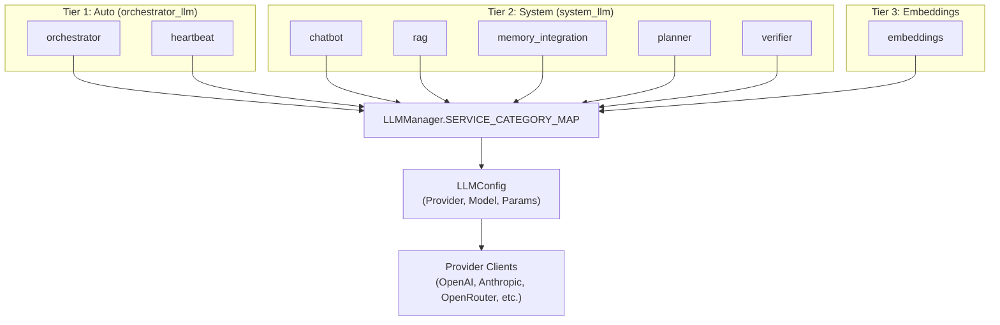
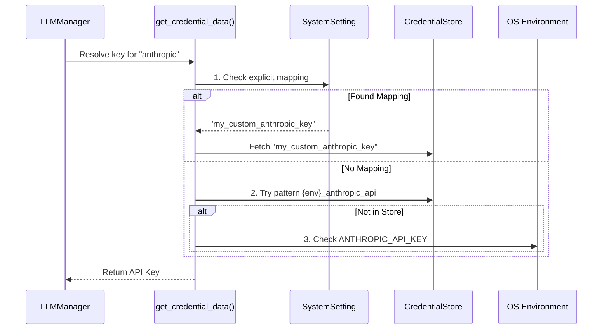

# LLM Provider Management

Relevant source files

The following files were used as context for generating this wiki page:

- [frontend/components/settings/GeneralSettingsTab.tsx](frontend/components/settings/GeneralSettingsTab.tsx)
- [frontend/components/settings/OnboardingAgentsTab.tsx](frontend/components/settings/OnboardingAgentsTab.tsx)
- [frontend/components/settings/SettingsPanel.tsx](frontend/components/settings/SettingsPanel.tsx)
- [frontend/components/settings/SystemSettingsTab.tsx](frontend/components/settings/SystemSettingsTab.tsx)
- [orchestrator/api/chatbot_llm.py](orchestrator/api/chatbot_llm.py)
- [orchestrator/api/onboarding_agents.py](orchestrator/api/onboarding_agents.py)
- [orchestrator/core/llm/clients/azure_client.py](orchestrator/core/llm/clients/azure_client.py)
- [orchestrator/core/llm/clients/base.py](orchestrator/core/llm/clients/base.py)
- [orchestrator/core/llm/clients/grok_client.py](orchestrator/core/llm/clients/grok_client.py)
- [orchestrator/core/llm/clients/openai_client.py](orchestrator/core/llm/clients/openai_client.py)
- [orchestrator/core/llm/clients/openrouter_client.py](orchestrator/core/llm/clients/openrouter_client.py)
- [orchestrator/core/llm/manager.py](orchestrator/core/llm/manager.py)
- [orchestrator/core/models/system_settings.py](orchestrator/core/models/system_settings.py)
- [orchestrator/core/seeds/seed_system_settings.py](orchestrator/core/seeds/seed_system_settings.py)
- [orchestrator/scripts/create_test_workspace.py](orchestrator/scripts/create_test_workspace.py)

## Purpose and Scope

This document describes how Automatos AI manages LLM provider connections, credentials, and configuration through the `LLMManager` system. Following the **PRD-136** consolidation, the system manages 12 legacy LLM silos into 3 primary tiers: **Auto** (reasoning/orchestration), **System** (high-volume internal tasks), and **Embeddings** (vectorization).

The `LLMManager` abstracts multiple AI providers behind a unified interface, handles 3-tier API key resolution (BYOK, Credential Store, and Env), and provides automatic provider detection based on service identity.

**Sources:** [orchestrator/core/llm/manager.py:1-7](), [orchestrator/core/llm/manager.py:29-32](), [orchestrator/core/seeds/seed_system_settings.py:7-8]()

---

## Architecture Overview

The `LLMManager` serves as the central abstraction layer. It maps internal services to one of the three LLM tiers, loads configuration from the `SystemSetting` table, and instantiates provider-specific clients.

### LLM Tier Mapping and Flow

**Sources:** [orchestrator/core/llm/manager.py:33-53](), [orchestrator/core/llm/clients/base.py:61-76](), [orchestrator/core/seeds/seed_system_settings.py:35-41]()

---

## LLM Tier Schema (PRD-136)

Every LLM tier (Auto, System, Embeddings) exposes a canonical set of parameters defined in `_llm_tier_settings`. This ensures consistent behavior across all internal services.

| Parameter | Default (Auto) | Default (System) | Description |
|-----------|----------------|------------------|-------------|
| `provider` | `openrouter` | `openrouter` | Which LLM provider serves this tier [orchestrator/core/seeds/seed_system_settings.py:44-50](). |
| `model` | `anthropic/claude-3.5-sonnet` | `google/gemini-2.0-flash-001` | Tier-specific model identifier [orchestrator/core/seeds/seed_system_settings.py:58-66](). |
| `temperature` | `0.7` | `0.3` | Determinism vs. Creativity [orchestrator/core/seeds/seed_system_settings.py:71-77](). |
| `timeout_seconds`| `120` | `60` | Request timeout before failover [orchestrator/core/seeds/seed_system_settings.py:135-141](). |
| `max_retries` | `3` | `3` | Number of retries for transient failures [orchestrator/core/seeds/seed_system_settings.py:148-153](). |

**Sources:** [orchestrator/core/seeds/seed_system_settings.py:41-158](), [orchestrator/core/llm/manager.py:33-53]()

---

## 3-Tier API Key Resolution

The `get_credential_data()` function implements a prioritized strategy to find API keys. This allows for global defaults while permitting workspace-specific overrides (BYOK).

### Resolution Hierarchy

1.  **BYOK / Explicit Mapping**: Checks `SystemSetting` for an explicit credential name mapping for that provider (e.g., `orchestrator_llm.credential_name_openai`) [orchestrator/core/llm/manager.py:163-170]().
2.  **Credential Store Pattern**: 
    *   Tries `{environment}_{provider}_api` [orchestrator/core/llm/manager.py:188-192]().
    *   Tries lookup by matching `credential_type` in the store [orchestrator/core/llm/manager.py:209-216]().
3.  **Environment Variables**: Fallback to direct environment variables (e.g., `OPENAI_API_KEY`, `OPENROUTER_API_KEY`) if no store entry exists [orchestrator/core/llm/manager.py:243-264]().

**Sources:** [orchestrator/core/llm/manager.py:135-220](), [orchestrator/core/llm/manager.py:243-264]()

---

## Provider Implementations

Providers inherit from `BaseLLMProvider` and implement `generate_response` and `_initialize_client`.

### OpenRouter Aggregator
The `OpenRouterProvider` is the recommended default. It provides access to 200+ models via an OpenAI-compatible API. It includes custom logic for:
*   **Image Extraction**: Extracts images from the `images` field used by Gemini models via OpenRouter [orchestrator/core/llm/clients/openrouter_client.py:151-163]().
*   **Tool Sanitization**: Removes the `strict` field from tool definitions which many OpenRouter endpoints reject [orchestrator/core/llm/clients/openrouter_client.py:95-106]().

### OpenAI Native
The `OpenAIProvider` supports native tool calling and implements context window protection. It forces `tool_choice="required"` if the system prompt contains the string "You MUST call" [orchestrator/core/llm/clients/openai_client.py:95-99]().

### Grok (xAI)
The `GrokProvider` uses an OpenAI-compatible client but targets the `https://api.x.ai/v1` endpoint [orchestrator/core/llm/clients/grok_client.py:22-26]().

**Sources:** [orchestrator/core/llm/clients/base.py:101-112](), [orchestrator/core/llm/clients/openrouter_client.py:26-51](), [orchestrator/core/llm/clients/openai_client.py:21-48](), [orchestrator/core/llm/clients/grok_client.py:22-48]()

---

## Management UI

Administrators manage these settings through the **System Settings** tab in the frontend.

*   **SystemSettingsTab**: The main container for managing database-backed settings [frontend/components/settings/SystemSettingsTab.tsx:42-49]().
*   **LLMModelsSettingsTab**: Specifically handles the configuration for the three LLM tiers (Auto, System, Embeddings) [frontend/components/settings/SystemSettingsTab.tsx:29-29]().
*   **OnboardingAgentsTab**: Provides granular control over the system agents (VOYAGER, BLUEPRINT, etc.) used during the Mission Zero onboarding flow, including their specific model assignments and temperatures [frontend/components/settings/OnboardingAgentsTab.tsx:51-60]().

**Sources:** [frontend/components/settings/SystemSettingsTab.tsx:1-16](), [frontend/components/settings/SettingsPanel.tsx:17-31](), [frontend/components/settings/OnboardingAgentsTab.tsx:20-42]()

---