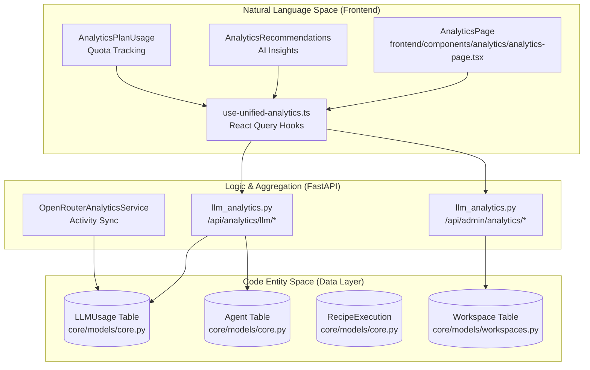
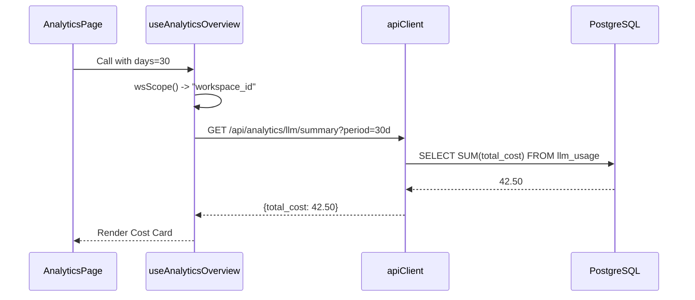

# Analytics & Monitoring

Relevant source files

The following files were used as context for generating this wiki page:

- [docs/PRDS/52-UNIFIED-ANALYTICS.md](docs/PRDS/52-UNIFIED-ANALYTICS.md)
- [frontend/app/analytics/page.tsx](frontend/app/analytics/page.tsx)
- [frontend/components/analytics/analytics-admin.tsx](frontend/components/analytics/analytics-admin.tsx)
- [frontend/components/analytics/analytics-agents.tsx](frontend/components/analytics/analytics-agents.tsx)
- [frontend/components/analytics/analytics-costs.tsx](frontend/components/analytics/analytics-costs.tsx)
- [frontend/components/analytics/analytics-documents.tsx](frontend/components/analytics/analytics-documents.tsx)
- [frontend/components/analytics/analytics-memory.tsx](frontend/components/analytics/analytics-memory.tsx)
- [frontend/components/analytics/analytics-openrouter-credits.tsx](frontend/components/analytics/analytics-openrouter-credits.tsx)
- [frontend/components/analytics/analytics-overview.tsx](frontend/components/analytics/analytics-overview.tsx)
- [frontend/components/analytics/analytics-page.tsx](frontend/components/analytics/analytics-page.tsx)
- [frontend/components/analytics/analytics-pandas-chart.tsx](frontend/components/analytics/analytics-pandas-chart.tsx)
- [frontend/components/analytics/analytics-plan-usage.tsx](frontend/components/analytics/analytics-plan-usage.tsx)
- [frontend/components/analytics/analytics-recommendations.tsx](frontend/components/analytics/analytics-recommendations.tsx)
- [frontend/components/analytics/analytics-workflows.tsx](frontend/components/analytics/analytics-workflows.tsx)
- [frontend/components/dashboard/widgets/system-health-widget.tsx](frontend/components/dashboard/widgets/system-health-widget.tsx)
- [frontend/components/knowledge/QueryTemplatesGrid.tsx](frontend/components/knowledge/QueryTemplatesGrid.tsx)
- [frontend/components/system/rag-configuration.tsx](frontend/components/system/rag-configuration.tsx)
- [frontend/hooks/use-unified-analytics.ts](frontend/hooks/use-unified-analytics.ts)
- [orchestrator/api/llm_analytics.py](orchestrator/api/llm_analytics.py)
- [orchestrator/core/llm/openrouter_analytics.py](orchestrator/core/llm/openrouter_analytics.py)

## Purpose and Scope

This page documents the unified analytics and monitoring systems in Automatos AI, which provide comprehensive visibility into LLM consumption, costs, agent performance, and system health. The architecture follows a three-tier pattern: real-time data collection during execution, multi-dimensional aggregation via FastAPI routers, and a tabbed React Query-powered frontend dashboard.

Key capabilities include:
- **LLM Usage & Cost Tracking**: Token counts, provider costs, and BYOK (Bring Your Own Key) vs. Platform spend split [orchestrator/api/llm_analytics.py:87-138]().
- **Agent & Workflow Performance**: Success rates, execution times, and memory utilization statistics [frontend/components/analytics/analytics-agents.tsx:47-101]().
- **Plan & Quota Monitoring**: Visual tracking of workspace limits for agents, storage, and API calls [frontend/components/analytics/analytics-plan-usage.tsx:59-114]().
- **Knowledge Base Analytics**: RAG retrieval effectiveness, popular search terms, and unused document alerts [frontend/components/analytics/analytics-documents.tsx:85-153]().
- **Admin Governance**: Cross-workspace visibility and platform-wide financial monitoring for super-admins [frontend/components/analytics/analytics-admin.tsx:164-210]().
- **AI-Powered Insights**: Optimization recommendations for cost savings and model switching [frontend/components/analytics/analytics-recommendations.tsx:73-123]().
- **System Health & Activity**: Real-time heartbeat monitoring and channel integration message volume tracking [frontend/components/analytics/analytics-overview.tsx:28-65]().

For technical deep-dives, see the following child pages:
- [Analytics Architecture](#16.1) — React Query hooks, `wsScope` multi-tenancy, and polling [frontend/hooks/use-unified-analytics.ts:1-43]().
- [LLM Usage Tracking](#16.2) — `LLMUsage` table schema and OpenRouter activity sync [orchestrator/core/llm/openrouter_analytics.py:1-12]().
- [Cost Analytics](#16.3) — Model comparison, projections, and daily trends [frontend/components/analytics/analytics-costs.tsx:143-203]().
- [Agent & Workflow Analytics](#16.4) — Success rates and quality scores [frontend/components/analytics/analytics-workflows.tsx:142-180]().
- [Admin Analytics](#16.5) — Platform-wide dashboards and workspace switching [frontend/components/analytics/analytics-admin.tsx:1-41]().
- [System Health Monitoring](#16.6) — Component status and metrics tracking.
- [Analytics API Reference](#16.7) — Detailed endpoint specifications [orchestrator/api/llm_analytics.py:28-30]().

---

## System Architecture

The analytics system bridges the gap between raw execution logs and high-level business insights. Every agent interaction is intercepted to record token counts and costs, while background services sync external provider data.

### Analytics Data Flow

**Sources:** [frontend/app/analytics/page.tsx:7-15](), [orchestrator/api/llm_analytics.py:28-30](), [orchestrator/core/llm/openrouter_analytics.py:27-29](), [frontend/hooks/use-unified-analytics.ts:18-43]().

---

## LLM Usage & Cost Analytics

The platform tracks every LLM call across chat, workflows, and recipes. Data is stored in the `LLMUsage` table and aggregated for fast retrieval.

### Key Tracking Dimensions
- **Usage Grouping**: Data can be grouped by `model`, `provider`, `agent`, `tier`, `is_byok`, or `request_type` [orchestrator/api/llm_analytics.py:100-107]().
- **Cost Breakdown**: Supports daily trends, input vs. output cost analysis, and per-request averages [orchestrator/api/llm_analytics.py:141-191]().
- **OpenRouter Sync**: `OpenRouterAnalyticsService` fetches daily usage from OpenRouter's `/activity` endpoint and upserts it into the local `llm_usage` table to ensure historical accuracy for BYOK users [orchestrator/core/llm/openrouter_analytics.py:44-75]().

### Model Comparison & Projections
The system provides a `useModelComparison` hook to evaluate performance and pricing across different LLM providers [frontend/hooks/use-unified-analytics.ts:39](). Monthly projections are calculated using daily averages extrapolated to a 30-day window [orchestrator/api/llm_analytics.py:71-82]().

**Sources:** [orchestrator/api/llm_analytics.py:87-138](), [frontend/hooks/use-unified-analytics.ts:40-41](), [orchestrator/core/llm/openrouter_analytics.py:1-12](), [frontend/components/analytics/analytics-costs.tsx:143-188]().

---

## Agent & Workflow Analytics

Beyond costs, the system monitors how agents perform and how workflows execute.

### Agent Performance
The `useAgentAnalytics` hook combines data from agent execution logs and memory statistics [frontend/hooks/use-unified-analytics.ts:120-134]().
- **Memory Utilization**: Tracks total memories, average importance, and access frequency per agent using the `/api/v1/memory/stats/agents` endpoint [frontend/hooks/use-unified-analytics.ts:133-134]().
- **Execution Details**: Monitors total requests, tokens per request, and last-used timestamps [frontend/components/analytics/analytics-agents.tsx:104-134]().

### Workflow & Mission Stats
Tracks the health and volume of automated processes via the `AnalyticsWorkflows` component [frontend/components/analytics/analytics-workflows.tsx:142-180]().
- **Execution Trends**: Visualizes success vs. failure rates over time using `BarChart` [frontend/components/analytics/analytics-workflows.tsx:153-179]().
- **Mission Analytics**: Includes success rates and average durations for multi-agent missions [frontend/hooks/use-unified-analytics.ts:86-92]().

**Sources:** [frontend/components/analytics/analytics-agents.tsx:47-101](), [frontend/components/analytics/analytics-workflows.tsx:145-150](), [frontend/hooks/use-unified-analytics.ts:76-102]().

---

## Admin & Plan Monitoring

For platform administrators and workspace owners, the system provides governance and quota tracking.

### Admin Dashboard
Admins can access a platform-wide view that aggregates costs and usage across all workspaces [orchestrator/api/llm_analytics.py:29]().
- **Workspace Analytics**: Merges data from all workspaces to monitor platform growth and spender trends [frontend/components/analytics/analytics-admin.tsx:183-194]().
- **Plan Distribution**: Monitors workspace counts across tiers: Starter, Pilot, Pro, and Enterprise [frontend/components/analytics/analytics-admin.tsx:199-210]().

### Plan Usage & Quotas
The `AnalyticsPlanUsage` component provides visual feedback on resource consumption [frontend/components/analytics/analytics-plan-usage.tsx:59-114]().
- **Color-Coded Gauges**: Progress bars turn from green to red as users approach limits (70% warning, 90% critical) [frontend/components/analytics/analytics-plan-usage.tsx:20-30]().
- **Resource Tracking**: Monitors limits for agents, storage, and API calls [frontend/components/analytics/analytics-plan-usage.tsx:74-110]().

**Sources:** [frontend/components/analytics/analytics-admin.tsx:164-210](), [frontend/components/analytics/analytics-plan-usage.tsx:38-57]().

---

## System Health & Real-time Monitoring

The `AnalyticsOverview` component integrates system-level health signals alongside business metrics [frontend/components/analytics/analytics-overview.tsx:23-26]().

### Heartbeat Activity
Tracks autonomous agent actions and periodic system checks [frontend/components/analytics/analytics-overview.tsx:139-160]().
- **Metrics**: Total heartbeats today, success vs. error counts, and token consumption for proactive tasks [frontend/components/analytics/analytics-overview.tsx:147-152]().
- **Event Log**: Displays a grouped feed of recent heartbeat events to identify "chatty" or failing agents [frontend/components/analytics/analytics-overview.tsx:162-166]().

### Channel Analytics
Monitors incoming message volume across integrated platforms like Telegram, Slack, and Discord [frontend/components/analytics/analytics-overview.tsx:46-63]().
- **Aggregation**: Merges `routing_decisions` (Tier 2/3 routing) with total message counts from `channel_connections` [frontend/components/analytics/analytics-overview.tsx:50-60]().

**Sources:** [frontend/components/analytics/analytics-overview.tsx:28-65](), [frontend/components/analytics/analytics-overview.tsx:139-166]().

---

## AI Recommendations & Custom Visuals

Automatos AI leverages LLMs and Python-based data processing to surface actionable insights and custom visualizations.

### Recommendations Engine
The `AnalyticsRecommendations` component displays suggestions for cost optimization, model switching, and quota warnings [frontend/components/analytics/analytics-recommendations.tsx:18-30]().
- **Impact Assessment**: Highlights the potential savings or performance gains for each suggestion [frontend/components/analytics/analytics-recommendations.tsx:136-140]().

### Pandas AI Charts
The `AnalyticsPandasChart` component allows for dynamic, NL-queried data visualization [frontend/components/analytics/analytics-pandas-chart.tsx:15-18]().
- **Chart Generation**: Uses a Python worker to execute queries against analytics data, returning base64-encoded images and NL summaries [frontend/components/analytics/analytics-pandas-chart.tsx:121-139]().
- **Presets**: Supports pre-configured chart types (Bar, Line, etc.) for common analytics queries [frontend/components/analytics/analytics-pandas-chart.tsx:20-24]().

**Sources:** [frontend/components/analytics/analytics-recommendations.tsx:73-123](), [frontend/components/analytics/analytics-pandas-chart.tsx:1-152]().

---

## Frontend State Management

The analytics UI relies on a robust React Query implementation in `use-unified-analytics.ts`.

### Multi-Tenancy Scoping
To prevent data leakage between workspaces, all cache keys are scoped using the `wsScope()` helper, which respects admin overrides [frontend/hooks/use-unified-analytics.ts:12-14]().

**Sources:** [frontend/hooks/use-unified-analytics.ts:1-43](), [frontend/components/analytics/analytics-page.tsx:35-46]().

---