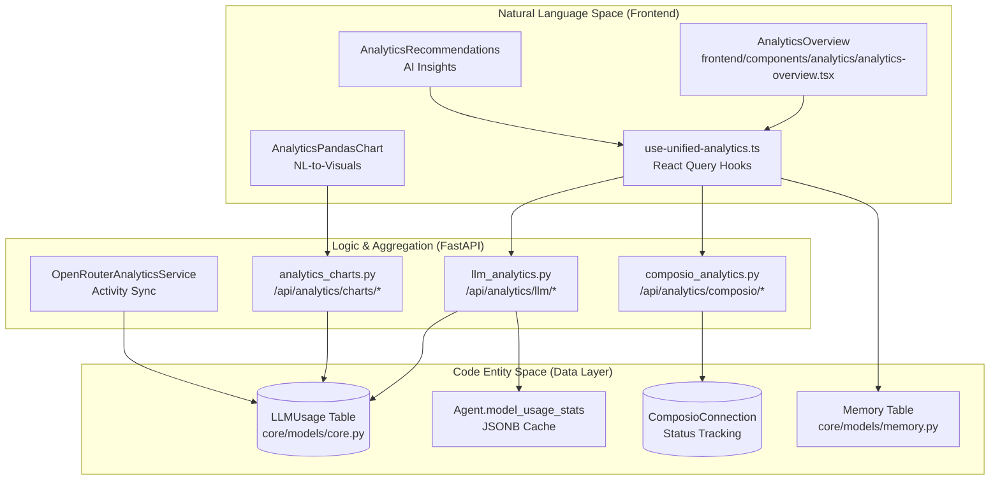

# Analytics & Monitoring

<details>
<summary>Relevant source files</summary>

The following files were used as context for generating this wiki page:

- [docs/PRDS/52-UNIFIED-ANALYTICS.md](docs/PRDS/52-UNIFIED-ANALYTICS.md)
- [frontend/app/analytics/page.tsx](frontend/app/analytics/page.tsx)
- [frontend/components/analytics/analytics-admin.tsx](frontend/components/analytics/analytics-admin.tsx)
- [frontend/components/analytics/analytics-agents.tsx](frontend/components/analytics/analytics-agents.tsx)
- [frontend/components/analytics/analytics-composio.tsx](frontend/components/analytics/analytics-composio.tsx)
- [frontend/components/analytics/analytics-documents.tsx](frontend/components/analytics/analytics-documents.tsx)
- [frontend/components/analytics/analytics-memory.tsx](frontend/components/analytics/analytics-memory.tsx)
- [frontend/components/analytics/analytics-openrouter-credits.tsx](frontend/components/analytics/analytics-openrouter-credits.tsx)
- [frontend/components/analytics/analytics-overview.tsx](frontend/components/analytics/analytics-overview.tsx)
- [frontend/components/analytics/analytics-pandas-chart.tsx](frontend/components/analytics/analytics-pandas-chart.tsx)
- [frontend/components/analytics/analytics-plan-usage.tsx](frontend/components/analytics/analytics-plan-usage.tsx)
- [frontend/components/analytics/analytics-recommendations.tsx](frontend/components/analytics/analytics-recommendations.tsx)
- [frontend/components/analytics/analytics-workflows.tsx](frontend/components/analytics/analytics-workflows.tsx)
- [frontend/components/context/context-engineering.tsx](frontend/components/context/context-engineering.tsx)
- [frontend/components/dashboard/widgets/system-health-widget.tsx](frontend/components/dashboard/widgets/system-health-widget.tsx)
- [frontend/components/knowledge/QueryTemplatesGrid.tsx](frontend/components/knowledge/QueryTemplatesGrid.tsx)
- [frontend/components/team/team-management.tsx](frontend/components/team/team-management.tsx)
- [frontend/hooks/use-unified-analytics.ts](frontend/hooks/use-unified-analytics.ts)
- [frontend/tsconfig.tsbuildinfo](frontend/tsconfig.tsbuildinfo)
- [orchestrator/api/llm_analytics.py](orchestrator/api/llm_analytics.py)
- [orchestrator/core/llm/openrouter_analytics.py](orchestrator/core/llm/openrouter_analytics.py)

</details>


## Purpose and Scope

This page documents the unified analytics and monitoring systems in Automatos AI, which provide comprehensive visibility into LLM consumption, agent performance, and system health. The architecture follows a three-tier pattern: real-time data collection during execution, multi-dimensional aggregation via FastAPI routers, and a tabbed React Query-powered frontend dashboard.

Key capabilities include:
- **LLM Usage & Cost Tracking**: Token counts, provider costs, and BYOK (Bring Your Own Key) vs. Platform spend split.
- **Agent & Workflow Performance**: Success rates, execution times, and memory utilization statistics.
- **Tool Integration Metrics**: Composio app connectivity and action execution leaderboards.
- **AI-Powered Insights**: Natural language chart generation via PandasAI and cost optimization recommendations.
- **Admin Governance**: Cross-workspace visibility and platform-wide financial monitoring.
- **System Activity**: Monitoring of Heartbeat autonomous actions and multi-channel message volume.

For technical deep-dives, see the following child pages:
- [Analytics Architecture](#16.1) — React Query hooks, `wsScope` multi-tenancy, and polling.
- [LLM Usage Tracking](#16.2) — `LLMUsage` table schema and OpenRouter activity sync.
- [Cost Analytics](#16.3) — Model comparison, projections, and daily trends.
- [Agent & Workflow Analytics](#16.4) — Success rates and quality scores.
- [Admin Analytics](#16.5) — Platform-wide dashboards and workspace switching.
- [System Health Monitoring](#16.6) — Component status and metrics tracking.
- [Analytics API Reference](#16.7) — Detailed endpoint specifications.

---

## System Architecture

The analytics system bridges the gap between raw execution logs and high-level business insights. Every agent interaction is intercepted to record token counts and costs, while background services sync external provider data.

### Analytics Data Flow


**Sources:** [frontend/components/analytics/analytics-overview.tsx:32-61](), [orchestrator/api/llm_analytics.py:28-30](), [orchestrator/core/llm/openrouter_analytics.py:27-29](), [frontend/hooks/use-unified-analytics.ts:18-43](), [frontend/components/analytics/analytics-pandas-chart.tsx:15-39]()

---

## LLM Usage & Cost Analytics

The platform tracks every LLM call across chat, workflows, and recipes. Data is stored in the `LLMUsage` table and aggregated into `Agent.model_usage_stats` for fast retrieval.

### Key Tracking Dimensions
- **Usage Grouping**: Data can be grouped by `model`, `provider`, `agent`, `tier`, `is_byok`, or `request_type` [orchestrator/api/llm_analytics.py:100-107]().
- **Cost Breakdown**: Supports daily trends, input vs. output cost analysis, and per-request averages [orchestrator/api/llm_analytics.py:141-191]().
- **OpenRouter Sync**: `OpenRouterAnalyticsService` fetches daily usage from OpenRouter's `/activity` endpoint and upserts it into the local `llm_usage` table to ensure historical accuracy for BYOK users [orchestrator/core/llm/openrouter_analytics.py:44-75]().

### Model Comparison & Projections
The system provides a `useModelComparison` hook to evaluate performance and pricing across different LLM providers [frontend/hooks/use-unified-analytics.ts:39](). Monthly projections are calculated using daily averages extrapolated to a 30-day window [orchestrator/api/llm_analytics.py:71-77]().

**Sources:** [orchestrator/api/llm_analytics.py:87-138](), [orchestrator/core/llm/openrouter_analytics.py:1-12](), [frontend/hooks/use-unified-analytics.ts:40-41]()

---

## Agent & Workflow Analytics

Beyond costs, the system monitors how agents utilize their memory and the performance of multi-agent workflows (Missions).

### Agent Performance & Memory
The `useAgentAnalytics` hook combines data from agent execution logs and memory statistics [frontend/hooks/use-unified-analytics.ts:120-134]().
- **Memory Stats**: Tracks total memories, average importance, and access frequency per agent [frontend/components/analytics/analytics-agents.tsx:47-101](). It breaks down memory by `memory_types` and `memory_levels` [frontend/hooks/use-unified-analytics.ts:110-118]().
- **Activity Tracking**: Monitors `last_used` and `last_memory_at` timestamps to identify dormant vs. active agents [frontend/components/analytics/analytics-agents.tsx:136-158]().

### Workflow & Mission Metrics
The `AnalyticsWorkflows` component visualizes execution trends and success rates [frontend/components/analytics/analytics-workflows.tsx:143-150]().
- **Execution Trend**: A `BarChart` displays successful vs. failed executions over time [frontend/components/analytics/analytics-workflows.tsx:153-179]().
- **Mission Stats**: Tracks total missions, completion rates, average duration, and token consumption per mission [frontend/hooks/use-unified-analytics.ts:86-92]().

**Sources:** [frontend/hooks/use-unified-analytics.ts:59-66](), [frontend/components/analytics/analytics-agents.tsx:162-168](), [frontend/components/analytics/analytics-workflows.tsx:1-27]()

---

## Tool & Document Analytics

### Composio Integration Metrics
Tracks the health and volume of tool executions via the `AnalyticsComposio` component [frontend/components/analytics/analytics-composio.tsx:92-105]().
- **Action Leaderboard**: Ranks the most frequently used Composio actions [frontend/components/analytics/analytics-composio.tsx:125-134]().
- **API Execution Monitor**: Real-time tracking of tool execution success, failure rates, and average latency [frontend/components/analytics/analytics-composio.tsx:170-195]().

### Knowledge Base & RAG
The `AnalyticsDocuments` component provides visibility into how the knowledge base is utilized [frontend/components/analytics/analytics-documents.tsx:36-40]().
- **RAG Performance**: Monitors total RAG queries and document search events [frontend/components/analytics/analytics-documents.tsx:114-136]().
- **Unused Documents**: Identifies documents that have never been retrieved by RAG, suggesting optimization of tags or descriptions [frontend/components/analytics/analytics-documents.tsx:94-111]().

**Sources:** [frontend/components/analytics/analytics-composio.tsx:162-167](), [frontend/hooks/use-unified-analytics.ts:30-37](), [frontend/components/analytics/analytics-documents.tsx:86-91]()

---

## Admin & System Monitoring

### Admin Dashboard
Admins access a platform-wide view that aggregates costs and usage across all workspaces [orchestrator/api/llm_analytics.py:29]().
- **Workspace Analytics**: Merges data from the dashboard and legacy systems to track per-workspace agent counts, costs, and API calls [frontend/components/analytics/analytics-admin.tsx:183-194]().
- **Plan Distribution**: Monitors workspace counts across tiers (Starter, Pilot, Pro, Enterprise) using a donut chart [frontend/components/analytics/analytics-admin.tsx:199-210]().

### System Activity
The `AnalyticsOverview` includes real-time monitoring of automated system components [frontend/components/analytics/analytics-overview.tsx:39-42]().
- **Heartbeat Activity**: Tracks autonomous checks performed by the `HeartbeatService`, including successes, errors, and token spend [frontend/components/analytics/analytics-overview.tsx:145-168]().
- **Channel Analytics**: Monitors message volume coming from external adapters like Slack, Telegram, or Discord [frontend/components/analytics/analytics-overview.tsx:57-59]().

**Sources:** [frontend/components/analytics/analytics-admin.tsx:164-181](), [frontend/hooks/use-unified-analytics.ts:42](), [frontend/components/analytics/analytics-overview.tsx:104-115]()

---

## AI-Powered Insights

### NL-to-Chart Generation
Users can query analytics data using natural language. The `AnalyticsPandasChart` component resolves queries via `chartMutation` to generate base64-encoded PNG charts and natural language summaries from the backend [frontend/components/analytics/analytics-pandas-chart.tsx:15-39]().

### AI Recommendations
The `AnalyticsRecommendations` component displays proactive insights generated by the system [frontend/components/analytics/analytics-recommendations.tsx:18-30]().
- **Insight Types**: Categorizes findings into `cost`, `performance`, `document`, or `quota` alerts [frontend/components/analytics/analytics-recommendations.tsx:32-37]().
- **Impact Assessment**: Each recommendation includes a title, description, and an impact badge (e.g., potential savings) [frontend/components/analytics/analytics-recommendations.tsx:99-106]().

**Sources:** [frontend/components/analytics/analytics-pandas-chart.tsx:108-140](), [frontend/hooks/use-unified-analytics.ts:24]()

---

## Frontend State Management

The analytics UI relies on a robust React Query implementation in `use-unified-analytics.ts`.

### Multi-Tenancy Scoping
To prevent data leakage between workspaces, all cache keys are scoped using the `wsScope()` helper, which respects admin overrides [frontend/hooks/use-unified-analytics.ts:12-14]().

```typescript
// Example Key Definition with Workspace Scoping
export const unifiedAnalyticsKeys = {
  overview: (days: number) => ['unified-analytics', wsScope(), 'overview', days] as const,
  costs: (days: number) => ['unified-analytics', wsScope(), 'costs', days] as const,
  adminWorkspaces: (days: number) => ['unified-analytics', wsScope(), 'admin', 'workspaces', days] as const,
}
```

This ensures that when an admin switches the viewed workspace via `getAdminWorkspaceOverride()`, React Query treats it as a separate dataset and triggers fresh fetches [frontend/hooks/use-unified-analytics.ts:18-43]().

**Sources:** [frontend/hooks/use-unified-analytics.ts:1-15](), [frontend/hooks/use-unified-analytics.ts:46-50]()

---