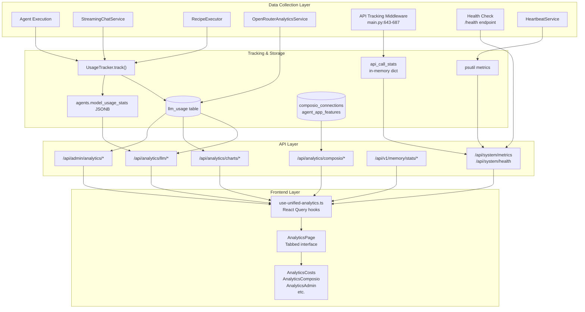
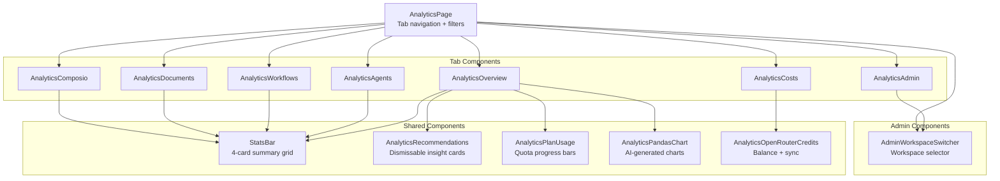
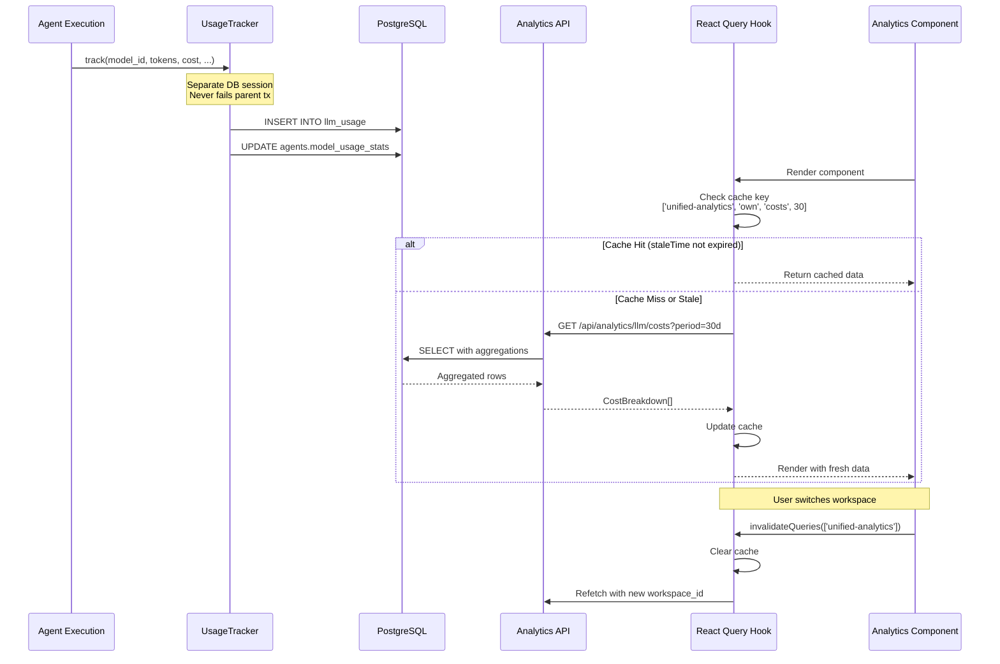

# Analytics & Monitoring

<details>
<summary>Relevant source files</summary>

The following files were used as context for generating this wiki page:

- [docker-compose.yml](docker-compose.yml)
- [frontend/.dockerignore](frontend/.dockerignore)
- [frontend/Dockerfile](frontend/Dockerfile)
- [frontend/app/admin/plugins/page.tsx](frontend/app/admin/plugins/page.tsx)
- [frontend/lib/api-client.ts](frontend/lib/api-client.ts)
- [orchestrator/.env.example](orchestrator/.env.example)
- [orchestrator/Dockerfile](orchestrator/Dockerfile)
- [orchestrator/api/agent_plugins.py](orchestrator/api/agent_plugins.py)
- [orchestrator/config.py](orchestrator/config.py)
- [orchestrator/core/database/load_seed_data.py](orchestrator/core/database/load_seed_data.py)
- [orchestrator/core/redis/client.py](orchestrator/core/redis/client.py)
- [orchestrator/core/seeds/seed_personas.py](orchestrator/core/seeds/seed_personas.py)
- [orchestrator/core/seeds/seed_plugin_categories.py](orchestrator/core/seeds/seed_plugin_categories.py)
- [orchestrator/core/services/plugin_cache.py](orchestrator/core/services/plugin_cache.py)
- [orchestrator/main.py](orchestrator/main.py)
- [orchestrator/requirements.txt](orchestrator/requirements.txt)
- [scripts/ralph/prd.json](scripts/ralph/prd.json)

</details>


## Purpose and Scope

This page documents the analytics and monitoring systems in Automatos AI, which provide comprehensive visibility into:

- **LLM Usage Analytics** - Token consumption, costs, and model performance tracking
- **System Health Monitoring** - API performance, service status, and worker heartbeats
- **Tool Integration Metrics** - Composio app usage and action tracking
- **Cost Optimization** - Projections, BYOK tracking, and AI-generated recommendations

The analytics infrastructure tracks every LLM call, calculates costs, aggregates metrics, and presents insights through a multi-tab dashboard. The monitoring layer tracks API performance, system resources, and service health in real-time.

For information about the Universal Router's intelligence layer, see [Universal Router](#8). For authentication and workspace isolation patterns, see [Authentication & Multi-Tenancy](#12). For the frontend state management powering the analytics UI, see [State Management](#14.2).

---

## System Health Monitoring

### Health Check Endpoint

The platform provides a comprehensive health check endpoint at `/health` that returns the operational status of all core services.

**Endpoint:** `GET /health`

**Response Structure:**
```json
{
  "status": "healthy",
  "version": "1.0.0",
  "timestamp": "2024-02-01T12:00:00Z",
  "services": {
    "database": "connected",
    "redis": "connected",
    "llm": "connected",
    "workers": "active"
  }
}
```

The health check is used by:
- Docker Compose healthcheck configurations (30s interval)
- Kubernetes liveness/readiness probes
- Load balancers for routing decisions
- Monitoring dashboards for uptime tracking

**Sources:** [orchestrator/main.py:828-864](), [docker-compose.yml:130-136]()

### API Performance Tracking Middleware

Every API request flows through a performance tracking middleware that collects detailed metrics without blocking the response.

**Tracked Metrics (Per Endpoint):**
- `call_count` - Total number of requests
- `total_time` - Cumulative response time (ms)
- `avg_time` - Average response time (ms)
- `min_time` - Fastest response (ms)
- `max_time` - Slowest response (ms)
- `recent_times` - Last 100 response times (ring buffer)
- `error_count` - Number of failed requests
- `status_codes` - Histogram of HTTP status codes
- `last_called` - ISO timestamp of most recent request

**Implementation Details:**

The middleware uses route templates (e.g., `/api/agents/{agent_id}`) rather than raw paths to prevent unbounded memory growth from path parameters. Stats are stored in an in-memory `defaultdict` with a cap of 500 unique endpoints.

```python
# From orchestrator/main.py:643-687
api_call_stats = defaultdict(lambda: {
    "call_count": 0,
    "total_time": 0,
    "avg_time": 0,
    "min_time": float('inf'),
    "max_time": 0,
    "recent_times": deque(maxlen=100),
    "error_count": 0,
    "last_called": None,
    "status_codes": defaultdict(int)
})
```

**Exclusions:**
- WebSocket connections (`/ws/`)
- Static files (`/static/`)
- API documentation (`/docs`, `/openapi.json`)
- CORS preflight requests (`OPTIONS`)

The middleware calculates response time after the request completes and updates metrics in a try/except block to ensure tracking failures never break responses.

**Sources:** [orchestrator/main.py:206-217, 643-687]()

### Worker Heartbeats

The platform includes a heartbeat service for monitoring long-running workers and background services.

**Configuration:**
- `HEARTBEAT_ENABLED` - Feature flag (default: `true`)
- Workers register heartbeats at regular intervals
- Stale heartbeats (no update >5min) trigger alerts

**Service Architecture:**

The `HeartbeatService` starts on application lifespan startup and gracefully stops on shutdown:

```python
# From orchestrator/main.py:337-345
if config.HEARTBEAT_ENABLED:
    from services.heartbeat_service import get_heartbeat_service
    heartbeat_svc = get_heartbeat_service()
    await heartbeat_svc.start()
```

Workers include:
- **RecipeSchedulerService** - Cron-based recipe execution
- **WorkspaceWorker** - Sandboxed code execution tasks
- **ChannelManager** - External event listeners (optional)

**Sources:** [orchestrator/main.py:337-401](), [orchestrator/config.py:238-241]()

### System Metrics Collection

System resource monitoring is implemented using `psutil` for cross-platform resource tracking.

**Monitored Resources:**
- CPU usage percentage
- Memory usage (percent and absolute)
- Disk usage (percent and I/O stats)
- Network I/O counters
- Process-level metrics (per worker)

**Metrics Endpoint:** `GET /api/system/metrics`

**Response Schema:**
```json
{
  "cpu": {"usage": 45.2},
  "memory": {"percent": 67.8, "used_gb": 5.4},
  "disk": {"percent": 38.5},
  "api_calls_count": 12456,
  "average_response_time": 145.3,
  "error_rate": 0.012
}
```

The metrics combine system resources (via `psutil`) with API performance data (from tracking middleware).

**Sources:** [orchestrator/requirements.txt:34](), [frontend/lib/api-client.ts:319-326]()

---

## System Architecture Overview

The analytics system follows a three-tier architecture: **data collection** → **aggregation & storage** → **presentation**. Every LLM call is tracked in real-time, costs are calculated using the model registry, and data is aggregated through specialized API endpoints that serve the frontend dashboard.

### Analytics & Monitoring Architecture



**Sources:** [orchestrator/api/llm_analytics.py:1-850](), [orchestrator/main.py:206-217, 643-687, 828-864](), [frontend/hooks/use-unified-analytics.ts:1-1610](), [frontend/components/analytics/analytics-page.tsx:1-124]()

---

## LLM Usage Analytics

The platform tracks every LLM call across all execution contexts (chat, workflows, recipes) to provide comprehensive usage analytics and cost insights.


### UsageTracker System

Every LLM call in the platform is tracked through `UsageTracker.track()`, which stores detailed metrics in the `LLMUsage` table. The tracker runs in a separate database session to ensure tracking failures never break agent executions.

**Key Fields in LLMUsage:**
- `workspace_id` - Multi-tenant isolation
- `model_id`, `provider`, `tier` - Model identification
- `input_tokens`, `output_tokens`, `total_tokens` - Token counts
- `input_cost`, `output_cost`, `total_cost` - Calculated costs
- `is_byok` - Whether user provided their own API key
- `latency_ms` - Response time
- `status` - `success` or `error`
- `agent_id`, `execution_id` - Context linkage
- `request_type` - `chat`, `workflow`, `activity_sync`, etc.

**Dual Aggregation Strategy:**
1. **Real-time tracking** - Every call written to `LLMUsage` table
2. **Cached aggregates** - `Agent.model_usage_stats` JSONB field updated with totals, averages, and last-used timestamp

This dual approach enables fast dashboard queries (read from agent stats) while preserving full historical data for detailed analysis.

**Sources:** [orchestrator/api/llm_analytics.py:87-138](), [orchestrator/core/models/core.py]() (LLMUsage model)

### API Endpoints for Usage Data

| Endpoint | Purpose | Response Schema |
|----------|---------|----------------|
| `GET /api/analytics/llm/usage` | Token usage grouped by dimension | `UsageGroup[]` |
| `GET /api/analytics/llm/costs` | Cost breakdown by dimension | `CostBreakdown[]` |
| `GET /api/analytics/llm/summary` | Dashboard summary with trends | `UsageSummary` |
| `GET /api/analytics/llm/recommendations` | AI-generated optimization suggestions | `Recommendation[]` |

**Query Parameters:**
- `period` - Time range: `1h`, `24h`, `7d`, `30d`, `90d`
- `group_by` - Dimension: `model`, `provider`, `agent`, `tier`, `is_byok`, `request_type`
- `breakdown` - For costs: `model`, `provider`, `agent`, `daily`

**Sources:** [orchestrator/api/llm_analytics.py:87-261]()

---

## Cost Analytics

### Model Comparison

The `/api/analytics/llm/comparison` endpoint allows side-by-side comparison of up to 4 models, combining registry metadata (pricing, context window, capabilities) with usage statistics.

**Response Structure (`ModelComparisonItem`):**
```python
{
  "model_id": "gpt-4o",
  "display_name": "GPT-4 Omni",
  "provider": "openai",
  "input_cost_per_1k": 0.005,
  "output_cost_per_1k": 0.015,
  "context_window": 128000,
  "capabilities": {"vision": true, "function_calling": true},
  "total_requests": 1523,
  "total_tokens": 2456789,
  "total_cost": 12.34,
  "avg_latency_ms": 1850,
  "error_rate": 0.0012,
  "success_rate": 0.9988
}
```

**Frontend Integration:**
The `AnalyticsCosts` component renders a multi-select dropdown (max 4 models), comparison table, and `RadarChart` for capability visualization. Model selection triggers `useModelComparison(modelIds, period)` hook.

**Sources:** [orchestrator/api/llm_analytics.py:394-469](), [frontend/components/analytics/analytics-costs.tsx:141-851]()

### Cost Projections

Projected monthly costs are calculated using `days-with-data` rather than raw period length, providing accurate averages even with sparse usage.

**Calculation Algorithm:**
1. Count distinct days with LLM usage: `func.count(func.distinct(func.date(LLMUsage.created_at)))`
2. Calculate daily average: `current_period_cost / days_with_data`
3. Project to 30-day month: `daily_avg * 30`
4. Compare to previous period for change percentage

**Response Structure (`CostProjectionResponse`):**
```python
{
  "current_period_cost": 45.67,
  "daily_average": 1.52,
  "projected_monthly": 45.60,
  "change_percent": 12.5,  # vs previous period
  "projected_by_model": [
    {"key": "gpt-4o", "projected_monthly_cost": 28.80, "current_period_cost": 28.80}
  ],
  "projected_by_provider": [...]
}
```

**Sources:** [orchestrator/api/llm_analytics.py:490-601](), [frontend/hooks/use-unified-analytics.ts:804-813]()

### Daily Cost by Model (Multi-Line Chart)

The `/api/analytics/llm/costs/daily-by-model` endpoint returns pivoted time-series data suitable for multi-line charts.

**Response Format:**
```json
{
  "models": ["gpt-4o", "claude-3-5-sonnet", "gpt-4o-mini"],
  "series": [
    {"date": "2026-02-01", "gpt-4o": 1.23, "claude-3-5-sonnet": 0.45, "gpt-4o-mini": 0.08},
    {"date": "2026-02-02", "gpt-4o": 1.45, "claude-3-5-sonnet": 0.52, "gpt-4o-mini": 0.09}
  ]
}
```

The frontend `AnalyticsCosts` component renders this as a stacked `AreaChart` with distinct colors per model and a custom `ModelCostTooltip`.

**Sources:** [orchestrator/api/llm_analytics.py:324-372](), [frontend/components/analytics/analytics-costs.tsx:246-327]()

---

## Composio Analytics

### Connected Apps Overview

Composio integrations are tracked through `ComposioConnection` (app-level status) and `AgentAppFeature` (per-agent action usage). The analytics API aggregates these for dashboard display.

**Endpoint:** `GET /api/analytics/composio/apps?days=30`

**Query Logic:**
```python
# Workspace scoping via ComposioEntity
connections = db.query(ComposioConnection).join(
    ComposioEntity, 
    ComposioConnection.entity_id == ComposioEntity.id
).filter(ComposioEntity.workspace_id == workspace_id)

# Agent count via AgentAppFeature join
agent_count = db.query(func.count(func.distinct(AgentAppFeature.agent_id)))
    .join(Agent, AgentAppFeature.agent_id == Agent.id)
    .filter(Agent.workspace_id == workspace_id)
```

**Response Schema (`ConnectedAppStats`):**
- `app_name` - Uppercase app identifier (e.g., `GOOGLEDRIVE`)
- `status` - Connection status: `active`, `disconnected`, `error`
- `total_actions_used` - Aggregated usage count from `AgentAppFeature`
- `agent_count` - Number of agents using this app
- `documents_synced` - From `ComposioConnection.total_documents_synced`
- `last_used_at` - Most recent action execution

**Sources:** [orchestrator/api/composio_analytics.py:47-102]()

### Action Leaderboard

The action leaderboard endpoint returns a sorted list of Composio actions by usage count, showing which integrations are most heavily utilized.

**Endpoint:** `GET /api/analytics/composio/actions?days=30`

**Query Pattern:**
```python
db.query(
    AgentAppFeature.action_name,
    AgentAppFeature.app_name,
    func.sum(AgentAppFeature.usage_count).label("total_usage_count"),
    func.count(func.distinct(AgentAppFeature.agent_id)).label("agent_count"),
    func.max(AgentAppFeature.last_used_at).label("last_used_at")
).join(Agent).filter(
    Agent.workspace_id == workspace_id,
    # Optional date filter on last_used_at
).group_by(action_name, app_name).order_by(desc("total_usage_count"))
```

**Frontend Rendering:**
The `AnalyticsComposio` component displays this in a sortable table with columns: Action Name, App, Usage Count, Agents Using, Last Used. Sorting is client-side via `useState` and `useMemo`.

**Sources:** [orchestrator/api/composio_analytics.py:104-138](), [frontend/components/analytics/analytics-composio.tsx:78-265]()

### Agent-Tool Mapping

Shows which Composio tools each agent has assigned, with usage counts and enabled status.

**Endpoint:** `GET /api/analytics/composio/agent-tools?days=30`

**Response Schema (`AgentToolMapping`):**
```python
{
  "agent_id": 42,
  "agent_name": "Sales Prospector",
  "tools": [
    {
      "tool_name": "GMAIL_SEND_EMAIL",
      "app_name": "GMAIL",
      "usage_count": 156,
      "enabled": true
    }
  ]
}
```

**Frontend Implementation:**
Expandable table rows in `AnalyticsComposio` component. Clicking an agent row toggles expansion to show its tool list with usage badges.

**Sources:** [orchestrator/api/composio_analytics.py:140-169](), [frontend/components/analytics/analytics-composio.tsx:268-312]()

---

## OpenRouter Integration

### Activity Sync Service

`OpenRouterAnalyticsService` fetches historical usage data from OpenRouter's management API and syncs it into the local `LLMUsage` table. This enables unified cost tracking for users with OpenRouter BYOK keys.

**Sync Process:**
1. Fetch from `https://openrouter.ai/api/v1/activity` with Bearer auth
2. Parse response: `{"data": [{"date", "model", "usage", "requests", "prompt_tokens", "completion_tokens", ...}]}`
3. Deduplicate by `(workspace_id, model_id, date)` to avoid duplicates on re-sync
4. Insert with `request_type="activity_sync"` to distinguish from live tracking

**API Endpoints:**

| Endpoint | Purpose | Auth Pattern |
|----------|---------|--------------|
| `POST /api/analytics/llm/openrouter/sync` | Trigger activity sync | BYOK key only (no env fallback) |
| `GET /api/analytics/llm/openrouter/credits` | Fetch credits balance | BYOK → env fallback → 404 |
| `GET /api/analytics/llm/openrouter/key-info` | Fetch key usage stats | BYOK → env fallback → 404 |

**Key Resolution Logic (`_resolve_openrouter_key`):**
```python
# 1. Check BYOK keys (workspace-scoped)
row = db.query(UserApiKey).filter(
    workspace_id == workspace_id,
    provider == "openrouter",
    is_active == True
).order_by(created_at.desc()).first()
if row:
    return decrypt(row.encrypted_key)

# 2. Fallback to env var (if byok_only=False)
if not byok_only and env OPENROUTER_API_KEY:
    return env OPENROUTER_API_KEY

# 3. Raise 404 with helpful message
raise HTTPException(404, "No OpenRouter API key configured...")
```

**Sources:** [orchestrator/core/llm/openrouter_analytics.py:1-221](), [orchestrator/api/llm_analytics.py:606-753]()

### Credits & Key Info Display

The `AnalyticsOpenRouterCredits` component displays real-time credits balance with a color-coded progress bar and sync button.

**Data Flow:**
1. `useOpenRouterCredits()` → `GET /api/analytics/llm/openrouter/credits` → `{total_credits, total_usage}`
2. `useOpenRouterKeyInfo()` → `GET /api/analytics/llm/openrouter/key-info` → `{limit, usage_daily, usage_weekly, usage_monthly, rate_limit}`
3. `useTriggerOpenRouterSync()` mutation → `POST /api/analytics/llm/openrouter/sync` → invalidates credits/key-info cache

**UI Features:**
- Progress bar: green <70%, yellow 70-90%, red >90%
- Usage breakdown cards: daily, weekly, monthly
- "Sync Activity" button with loading spinner and result toast
- "Not configured" fallback with link to settings when 404

**Sources:** [frontend/components/analytics/analytics-openrouter-credits.tsx:1-179](), [frontend/hooks/use-unified-analytics.ts:591-640]()

---

## Admin Analytics

### Cross-Workspace Aggregation

Admin users can view platform-wide analytics without workspace filtering. This is controlled via the `admin_all_workspaces` flag in `RequestContext` and special handling in queries.

**Admin Endpoints:**

| Endpoint | Purpose | Access Control |
|----------|---------|----------------|
| `GET /api/admin/analytics/costs` | Platform-wide cost breakdown | `_assert_admin(ctx)` |
| `GET /api/admin/analytics/dashboard` | Comprehensive admin overview | `_assert_admin(ctx)` |

**Query Pattern (No Workspace Filter):**
```python
# Regular endpoint (workspace-scoped)
db.query(LLMUsage).filter(LLMUsage.workspace_id == ctx.workspace_id)

# Admin endpoint (all workspaces)
db.query(LLMUsage)  # No workspace filter!
```

**Admin Check Implementation:**
```python
def _is_admin(ctx: RequestContext) -> bool:
    return getattr(ctx.user, "system_role", "user") == "admin"

def _assert_admin(ctx: RequestContext):
    if not _is_admin(ctx):
        raise HTTPException(403, "Admin access required")
```

**Sources:** [orchestrator/api/llm_analytics.py:755-927](), [orchestrator/core/auth/dependencies.py:1-43]()

### Admin Dashboard Endpoint

`GET /api/admin/analytics/dashboard` returns a comprehensive dataset for the admin analytics UI.

**Response Structure (`AdminDashboardData`):**
```python
{
  "overview": {
    "total_cost": 1234.56,
    "total_tokens": 50000000,
    "total_requests": 125000,
    "total_workspaces": 45,
    "daily_average": 41.15,
    "projected_monthly": 1234.50
  },
  "byok_split": {
    "platform_cost": 800.00,    # Automatos-paid
    "platform_requests": 80000,
    "byok_cost": 434.56,         # User BYOK keys
    "byok_requests": 45000
  },
  "workspaces": [
    {
      "id": "uuid",
      "name": "Acme Corp",
      "plan": "pro",
      "is_personal": false,
      "agents": 12,
      "recipes": 5,
      "executions": 342,
      "cost": 156.78,
      "tokens": 2500000,
      "requests": 3400
    }
  ],
  "models": [...],
  "daily_by_provider": {"providers": [...], "series": [...]}
}
```

**Frontend Component (`AnalyticsAdmin`):**
- Hero stats: Total Revenue, MRR Projection, Workspaces, API Requests, Tokens, BYOK Savings
- Stacked area chart: Daily cost by provider
- BYOK vs Platform split: Donut chart
- Workspace cost table: Sortable by cost/tokens/requests
- Plan distribution: Pie chart
- Cost anomalies: Workspaces >2x average cost flagged

**Sources:** [orchestrator/api/llm_analytics.py:929-1048](), [frontend/components/analytics/analytics-admin.tsx:164-860]()

### Admin Workspace Switcher

Admins can switch between viewing their own workspace, all workspaces, or a specific workspace using the `AdminWorkspaceSwitcher` component.

**Mechanism:**
1. Component reads `getAdminWorkspaceOverride()` from localStorage
2. On change, calls `setAdminWorkspaceOverride(value)` where `value` is:
   - `null` → My workspace (default)
   - `"__all__"` → Platform-wide view
   - `<workspace_id>` → Specific workspace
3. Invalidates all React Query cache keys matching `['unified-analytics']`
4. Backend `get_request_context_hybrid` checks for `X-Workspace-ID: __all__` header and sets `admin_all_workspaces=True`

**Cache Key Scoping (`wsScope()`):**
```typescript
function wsScope() {
  return getAdminWorkspaceOverride() || 'own'
}

export const unifiedAnalyticsKeys = {
  overview: (days: number) => ['unified-analytics', wsScope(), 'overview', days],
  agents: (days: number) => ['unified-analytics', wsScope(), 'agents', days],
  // ...
}
```

This ensures cached data for workspace A never bleeds into workspace B when admin switches.

**Sources:** [frontend/components/analytics/admin-workspace-switcher.tsx:1-64](), [frontend/hooks/use-unified-analytics.ts:10-38]()

---

## AI-Generated Insights

### PandasAI Chart Generation

The platform uses PandasAI to generate charts from natural language queries, enabling dynamic data visualization without pre-defined report structures.

**Endpoints:**

| Endpoint | Method | Purpose |
|----------|--------|---------|
| `/api/analytics/charts/generate` | POST | Generate chart from NL query |
| `/api/analytics/charts/presets` | GET | Fetch pre-defined chart configs |

**Request Body (`ChartGenerateRequest`):**
```json
{
  "query": "Show me cost by model for the last 30 days as a bar chart",
  "chart_type": "bar"  // bar|line|pie|area|scatter|auto
}
```

**Response Schema (`ChartGenerateResponse`):**
```json
{
  "summary": "Here's the cost breakdown by model...",
  "charts": [
    "iVBORw0KGgoAAAANSUhEUgAA..."  // base64-encoded PNG
  ],
  "data": [
    {"model": "gpt-4o", "cost": 45.67},
    {"model": "claude-3-5-sonnet", "cost": 32.10}
  ]
}
```

**Query Processing Pipeline:**
1. Parse NL query for time range and grouping intent (regex patterns)
2. Query `LLMUsage` table with extracted filters
3. Pass rows to `PandasAIService.generate_insight(question, rows, columns)`
4. Return base64-encoded chart images + summary text

**Preset Configurations:**
The system includes 6 pre-built presets: `cost-by-model`, `tokens-over-time`, `cost-trend-daily`, `requests-by-provider`, `latency-by-model`, `cost-by-request-type`. Each preset has a title, description, query template, and chart type.

**Sources:** [orchestrator/api/analytics_charts.py:1-180](), [frontend/components/analytics/analytics-pandas-chart.tsx:1-91]()

### Frontend Chart Widget

`AnalyticsPandasChart` component accepts either a `presetId` or a custom `query` prop.

**Auto-Generation Pattern:**
```typescript
useEffect(() => {
  if (!resolvedQuery) return
  const current = { query: resolvedQuery, chartType: resolvedChartType }
  if (lastRequested.current matches current) return  // Skip re-fetch
  
  lastRequested.current = current
  chartMutation.mutate({ query, chartType })
}, [resolvedQuery, resolvedChartType])
```

**Rendering:**
- Loading: Skeleton with "Generating chart..." message + spinner
- Success: `` + summary text
- Error: Error icon + error message
- Empty: "No chart data available"

**Integration in Overview Tab:**
The `AnalyticsOverview` component renders 2 preset charts (`cost-by-model`, `tokens-over-time`) in a responsive grid, wrapped in an "AI-Generated Insights" section with Sparkles icon.

**Sources:** [frontend/components/analytics/analytics-pandas-chart.tsx:1-91](), [frontend/components/analytics/analytics-overview.tsx]() (AI Insights section)

---

## Memory Statistics

### Mem0 Integration

Memory stats are fetched from the Mem0 service (OpenMemory) when available, with fallback to the local `memory_items` table.

**Endpoints:**

| Endpoint | Purpose | Data Source |
|----------|---------|-------------|
| `GET /api/v1/memory/stats/real` | Workspace memory overview | Mem0 → local DB fallback |
| `GET /api/v1/memory/stats/agents` | Per-agent memory breakdown | Local `memory_items` table |
| `GET /api/v1/memory/stats/recent` | Most recent memories | Mem0 → local DB fallback |

**Real Stats Response (`/stats/real`):**
```json
{
  "system_stats": {
    "total_memories": 1523,
    "memory_levels": {"short_term": 45, "long_term": 1478},
    "memory_types": {"fact": 892, "preference": 341, "interaction": 290},
    "agents_with_memories": 12,
    "source": "mem0"  // or "local_db"
  },
  "access_metrics": {
    "total_accesses": 4567,
    "hit_rate": 0.75,
    "cache_utilization": 15.23
  }
}
```

**Frontend Integration:**
The `useWorkspaceMemory()` hook fetches stats and recent memories, displaying them in the Overview tab's "Workspace Memory" card. Recent memories are shown with truncated content, memory type badges, and importance scores.

**Sources:** [orchestrator/api/memory_stats.py:1-221](), [frontend/hooks/use-unified-analytics.ts:536-565]()

---

## Frontend Architecture

### React Query Hooks Organization

All analytics data fetching is centralized in `use-unified-analytics.ts`, using React Query for caching, deduplication, and automatic refetching.

**Hook Naming Convention:**
- `use<Entity>Analytics()` - Fetches entity-specific analytics
- `use<Feature>()` - Fetches specific feature data
- `useTrigger<Action>()` - Mutation hooks for actions

**Cache Key Strategy (`unifiedAnalyticsKeys`):**
```typescript
export const unifiedAnalyticsKeys = {
  overview: (days: number) => ['unified-analytics', wsScope(), 'overview', days],
  agents: (days: number) => ['unified-analytics', wsScope(), 'agents', days],
  costs: (days: number) => ['unified-analytics', wsScope(), 'costs', days],
  composioApps: (days: number) => ['unified-analytics', wsScope(), 'composio', 'apps', days],
  openrouterCredits: () => ['unified-analytics', wsScope(), 'openrouter', 'credits'],
  adminDashboard: (period: string) => ['unified-analytics', wsScope(), 'admin', 'dashboard', period],
  // ...
}
```

**Key Design Principles:**
1. `wsScope()` prefix ensures cache isolation per workspace
2. Hierarchical keys enable partial invalidation
3. Query parameters included in key for proper caching
4. All keys are functions (thunks) so `wsScope()` is evaluated at query time

**Sources:** [frontend/hooks/use-unified-analytics.ts:10-38]()

### Component Architecture



**Sources:** [frontend/components/analytics/analytics-page.tsx:1-124](), [frontend/components/analytics/]() (all component files)

### Period Selection Pattern

All analytics components accept a `days` prop (7, 30, or 90) which controls the time range for queries. This is managed at the page level via a `Select` component.

**Mapping to Backend Periods:**
```typescript
const period = days <= 1 ? '24h' : days <= 7 ? '7d' : days <= 30 ? '30d' : '90d'
```

**Per-Chart Period Overrides:**
Some charts (cost trend, projections, comparison) have their own period selectors independent of the page-level filter. This is implemented via local `useState`:

```typescript
const [chartPeriod, setChartPeriod] = useState('30d')
const { data } = useDailyCostByModel(chartPeriod)

return (
  <PeriodToggle value={chartPeriod} onChange={setChartPeriod} />
  // ... chart rendering
)
```

**Sources:** [frontend/components/analytics/analytics-page.tsx:29-51](), [frontend/components/analytics/analytics-costs.tsx:91-115]()

---

## Data Flow Diagram

This diagram shows the complete data flow from an LLM call through tracking, storage, and presentation in the UI.



**Sources:** [orchestrator/api/llm_analytics.py:141-191](), [frontend/hooks/use-unified-analytics.ts:288-396](), [frontend/components/analytics/analytics-costs.tsx:1-851]()

---

## Key Database Tables

| Table | Purpose | Key Fields | Indexing |
|-------|---------|------------|----------|
| `llm_usage` | Tracks every LLM call with tokens, costs, latency | `workspace_id`, `model_id`, `agent_id`, `execution_id`, `created_at`, `total_cost`, `is_byok`, `status`, `latency_ms` | Composite index on `(workspace_id, created_at)` for time-range queries |
| `agents` | Stores `model_usage_stats` JSONB with cached aggregates | `id`, `workspace_id`, `model_usage_stats` | Updated inline after tracking for fast dashboard queries |
| `composio_connections` | Tracks Composio app connections per workspace | `entity_id`, `app_name`, `status`, `total_documents_synced`, `last_used_at` | FK to `composio_entities` for workspace scoping |
| `agent_app_features` | Tracks Composio action usage per agent | `agent_id`, `app_name`, `action_name`, `usage_count`, `last_used_at` | Join through `agents` table for workspace filter |
| `user_api_keys` | Stores encrypted BYOK keys | `workspace_id`, `provider`, `encrypted_key`, `is_active` | Used by OpenRouter key resolution and BYOK tracking |
| `memory_items` | Stores agent memories (fallback for Mem0) | `workspace_id`, `agent_id`, `memory_type`, `memory_level`, `importance`, `access_count` | Aggregated for memory stats API |
| `system_settings` | Stores platform configuration | `category`, `key`, `value`, `is_secret` | Used for LLM provider defaults and RAG settings |

**Sources:** [orchestrator/core/models/core.py](), [orchestrator/config.py:115-133]()

---

## Monitoring Data Structures

### API Call Stats (In-Memory)

The `api_call_stats` dictionary tracks per-endpoint performance metrics:

```python
# From orchestrator/main.py:206-217
api_call_stats = defaultdict(lambda: {
    "call_count": 0,
    "total_time": 0,
    "avg_time": 0,
    "min_time": float('inf'),
    "max_time": 0,
    "recent_times": deque(maxlen=100),  # Ring buffer for recent response times
    "error_count": 0,
    "last_called": None,
    "status_codes": defaultdict(int)
})
```

**Key Format:** `{method} {route_template}` (e.g., `GET /api/agents/{agent_id}`)

**Memory Management:**
- Capped at 500 unique endpoints to prevent unbounded growth
- Uses route templates instead of raw paths to deduplicate path parameters
- Recent times stored in a fixed-size deque (last 100 requests)

**Sources:** [orchestrator/main.py:206-217, 643-687]()

---

## API Endpoints Reference

### LLM Analytics (`/api/analytics/llm`)

| Endpoint | Method | Query Params | Response Schema | Purpose |
|----------|--------|--------------|-----------------|---------|
| `/usage` | GET | `period`, `group_by` | `UsageGroup[]` | Token usage grouped by dimension |
| `/costs` | GET | `period`, `breakdown` | `CostBreakdown[]` | Cost breakdown by dimension |
| `/summary` | GET | `period` | `UsageSummary` | Dashboard summary with trends |
| `/recommendations` | GET | - | `Recommendation[]` | AI-generated optimization suggestions |
| `/comparison` | GET | `model_ids`, `period` | `ModelComparisonItem[]` | Side-by-side model comparison |
| `/projections` | GET | `period` | `CostProjectionResponse` | Monthly cost projections |
| `/costs/daily-by-model` | GET | `period` | `{models, series}` | Multi-line chart data |

**Sources:** [orchestrator/api/llm_analytics.py:87-601]()

### OpenRouter (`/api/analytics/llm/openrouter`)

| Endpoint | Method | Purpose | Auth Requirement |
|----------|--------|---------|------------------|
| `/sync` | POST | Trigger activity sync | BYOK key only |
| `/credits` | GET | Fetch credits balance | BYOK → env fallback |
| `/key-info` | GET | Fetch key usage stats | BYOK → env fallback |

**Sources:** [orchestrator/api/llm_analytics.py:666-753]()

### Composio Analytics (`/api/analytics/composio`)

| Endpoint | Method | Query Params | Response Schema |
|----------|--------|--------------|-----------------|
| `/apps` | GET | `days` | `ConnectedAppStats[]` |
| `/actions` | GET | `days` | `ActionLeaderboardEntry[]` |
| `/agent-tools` | GET | `days` | `AgentToolMapping[]` |

**Sources:** [orchestrator/api/composio_analytics.py:1-169]()

### PandasAI Charts (`/api/analytics/charts`)

| Endpoint | Method | Request Body | Response Schema |
|----------|--------|--------------|-----------------|
| `/generate` | POST | `{query, chart_type}` | `ChartGenerateResponse` |
| `/presets` | GET | - | `ChartPreset[]` |

**Sources:** [orchestrator/api/analytics_charts.py:1-180]()

### Admin Analytics (`/api/admin/analytics`)

| Endpoint | Method | Query Params | Response Schema | Access |
|----------|--------|--------------|-----------------|--------|
| `/costs` | GET | `period` | `AdminCostAnalyticsData` | Admin only |
| `/dashboard` | GET | `period` | `AdminDashboardData` | Admin only |

**Sources:** [orchestrator/api/llm_analytics.py:755-1048]()

### Memory Stats (`/api/v1/memory/stats`)

| Endpoint | Method | Query Params | Response Schema |
|----------|--------|--------------|-----------------|
| `/real` | GET | - | Workspace memory overview |
| `/agents` | GET | - | `AgentMemoryStats[]` |
| `/recent` | GET | `limit` | Recent memories array |

**Sources:** [orchestrator/api/memory_stats.py:1-221]()

---

## Frontend Hook Reference

### Core Analytics Hooks

| Hook | Endpoint | Cache Key | Stale Time | Purpose |
|------|----------|-----------|------------|---------|
| `useAnalyticsOverview(days)` | Multiple endpoints | `unifiedAnalyticsKeys.overview(days)` | 60s | Overview tab summary |
| `useAgentAnalytics(days)` | `/api/agents`, `/api/system/agent-statistics`, `/api/v1/memory/stats/agents` | `unifiedAnalyticsKeys.agents(days)` | 60s | Agent analytics with memory stats |
| `useWorkflowAnalytics(days)` | `/api/workflows`, `/api/workflow-stats`, `/api/workflow-recipes`, `/api/workflow-recipes/stats/dashboard` | `unifiedAnalyticsKeys.workflows(days)` | 60s | Workflow + recipe analytics |
| `useCostAnalyticsUnified(days)` | `/api/analytics/llm/summary`, `/api/analytics/llm/usage`, `/api/agents` | `unifiedAnalyticsKeys.costs(days)` | 60s | LLM cost analytics with fallbacks |

**Sources:** [frontend/hooks/use-unified-analytics.ts:41-396]()

### Composio Hooks

| Hook | Endpoint | Cache Key | Stale Time |
|------|----------|-----------|------------|
| `useComposioApps(days)` | `/api/analytics/composio/apps?days=X` | `unifiedAnalyticsKeys.composioApps(days)` | 60s |
| `useComposioActions(days)` | `/api/analytics/composio/actions?days=X` | `unifiedAnalyticsKeys.composioActions(days)` | 60s |
| `useComposioAgentTools(days)` | `/api/analytics/composio/agent-tools?days=X` | `unifiedAnalyticsKeys.composioAgentTools(days)` | 60s |

**Sources:** [frontend/hooks/use-unified-analytics.ts:674-708]()

### Cost Analysis Hooks

| Hook | Endpoint | Cache Key | Stale Time | Purpose |
|------|----------|-----------|------------|---------|
| `useModelComparison(modelIds, period)` | `/api/analytics/llm/comparison?model_ids=...&period=...` | `unifiedAnalyticsKeys.modelComparison(modelIds, period)` | 60s | Side-by-side model comparison |
| `useCostProjections(period)` | `/api/analytics/llm/projections?period=...` | `unifiedAnalyticsKeys.costProjections(period)` | 60s | Monthly cost projections |
| `useDailyCostByModel(period)` | `/api/analytics/llm/costs/daily-by-model?period=...` | `unifiedAnalyticsKeys.dailyCostByModel(period)` | 60s | Multi-line chart data |

**Sources:** [frontend/hooks/use-unified-analytics.ts:774-833]()

### Admin Hooks

| Hook | Endpoint | Cache Key | Stale Time | Notes |
|------|----------|-----------|------------|-------|
| `useAdminCostAnalytics(period)` | `/api/admin/analytics/costs?period=...` | `['unified-analytics', wsScope(), 'admin', 'costs', period]` | 120s | Fallback to agent data if backend returns null |
| `useAdminDashboard(period)` | `/api/admin/analytics/dashboard?period=...` | `unifiedAnalyticsKeys.adminDashboard(period)` | 60s | Comprehensive admin dashboard |
| `useAdminWorkspaceAnalytics(days)` | `/api/workspaces/admin/analytics?days=...` | `unifiedAnalyticsKeys.adminWorkspaces(days)` | 300s | Legacy workspace list for switcher |

**Sources:** [frontend/hooks/use-unified-analytics.ts:870-986]()

### Mutation Hooks

| Hook | Endpoint | Method | On Success Action |
|------|----------|--------|-------------------|
| `useTriggerOpenRouterSync()` | `/api/analytics/llm/openrouter/sync` | POST | Invalidate credits, key-info, costs queries |
| `useAnalyticsChart()` | `/api/analytics/charts/generate` | POST | None (used for display only) |

**Sources:** [frontend/hooks/use-unified-analytics.ts:624-640, 726-740]()

---

## Period Mapping

Backend `PERIOD_MAP` defines time delta calculations:

```python
PERIOD_MAP = {
    "1h": timedelta(hours=1),
    "24h": timedelta(hours=24),
    "7d": timedelta(days=7),
    "30d": timedelta(days=30),
    "90d": timedelta(days=90),
}
```

Frontend components typically use days (7, 30, 90) and map to backend period strings as needed.

**Sources:** [orchestrator/api/llm_analytics.py:71-77]()

---