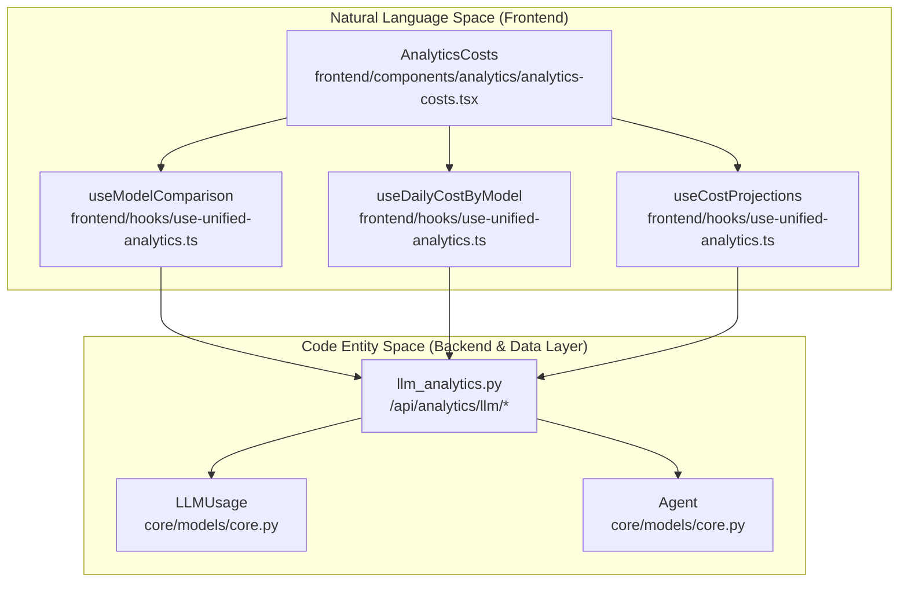

# Analytics & Monitoring

<details>
<summary>Relevant source files</summary>

The following files were used as context for generating this wiki page:

- [docs/PRDS/52-UNIFIED-ANALYTICS.md](docs/PRDS/52-UNIFIED-ANALYTICS.md)
- [frontend/app/analytics/page.tsx](frontend/app/analytics/page.tsx)
- [frontend/components/analytics/analytics-admin.tsx](frontend/components/analytics/analytics-admin.tsx)
- [frontend/components/analytics/analytics-agents.tsx](frontend/components/analytics/analytics-agents.tsx)
- [frontend/components/analytics/analytics-costs.tsx](frontend/components/analytics/analytics-costs.tsx)
- [frontend/components/analytics/analytics-documents.tsx](frontend/components/analytics/analytics-documents.tsx)
- [frontend/components/analytics/analytics-memory.tsx](frontend/components/analytics/analytics-memory.tsx)
- [frontend/components/analytics/analytics-openrouter-credits.tsx](frontend/components/analytics/analytics-openrouter-credits.tsx)
- [frontend/components/analytics/analytics-overview.tsx](frontend/components/analytics/analytics-overview.tsx)
- [frontend/components/analytics/analytics-page.tsx](frontend/components/analytics/analytics-page.tsx)
- [frontend/components/analytics/analytics-pandas-chart.tsx](frontend/components/analytics/analytics-pandas-chart.tsx)
- [frontend/components/analytics/analytics-plan-usage.tsx](frontend/components/analytics/analytics-plan-usage.tsx)
- [frontend/components/analytics/analytics-recommendations.tsx](frontend/components/analytics/analytics-recommendations.tsx)
- [frontend/components/analytics/analytics-workflows.tsx](frontend/components/analytics/analytics-workflows.tsx)
- [frontend/components/system/rag-configuration.tsx](frontend/components/system/rag-configuration.tsx)
- [frontend/hooks/use-unified-analytics.ts](frontend/hooks/use-unified-analytics.ts)
- [orchestrator/api/analytics.py](orchestrator/api/analytics.py)
- [orchestrator/api/analytics_api.py](orchestrator/api/analytics_api.py)
- [orchestrator/api/analytics_charts.py](orchestrator/api/analytics_charts.py)
- [orchestrator/api/analytics_real.py](orchestrator/api/analytics_real.py)
- [orchestrator/api/execution_history.py](orchestrator/api/execution_history.py)
- [orchestrator/api/workflow_history.py](orchestrator/api/workflow_history.py)
- [orchestrator/core/auth/workspace_admin.py](orchestrator/core/auth/workspace_admin.py)
- [orchestrator/tests/test_activation_endpoint.py](orchestrator/tests/test_activation_endpoint.py)
- [orchestrator/tests/test_errors_by_subsystem_endpoint.py](orchestrator/tests/test_errors_by_subsystem_endpoint.py)
- [orchestrator/tests/test_p2w0_cockpit_reach.py](orchestrator/tests/test_p2w0_cockpit_reach.py)
- [orchestrator/tests/test_prd143_obs_routers_batch1.py](orchestrator/tests/test_prd143_obs_routers_batch1.py)
- [orchestrator/tests/test_primitive_health_endpoint.py](orchestrator/tests/test_primitive_health_endpoint.py)
- [orchestrator/tests/test_widget_engagement_endpoint.py](orchestrator/tests/test_widget_engagement_endpoint.py)

</details>


## Purpose and Scope

This page documents the unified analytics and monitoring systems in Automatos AI, which provide comprehensive visibility into LLM consumption, costs, agent performance, and system health. The architecture follows a three-tier pattern: real-time data collection during execution, multi-dimensional aggregation via FastAPI routers, and a tabbed React Query-powered frontend dashboard.

Key capabilities include:
- **LLM Usage & Cost Tracking**: Token counts, provider costs, and BYOK (Bring Your Own Key) vs. Platform spend split [orchestrator/api/analytics_real.py:20-20]().
- **Agent & Workflow Performance**: Success rates, execution times, and memory utilization statistics [frontend/components/analytics/analytics-agents.tsx:47-101]().
- **Plan & Quota Monitoring**: Visual tracking of workspace limits for agents, storage, and API calls [frontend/components/analytics/analytics-plan-usage.tsx:17-17]().
- **Knowledge Base Analytics**: RAG retrieval effectiveness and substrate health monitoring [orchestrator/api/analytics_real.py:160-171]().
- **Admin Governance**: Cross-workspace visibility and platform-wide financial monitoring for super-admins [orchestrator/api/analytics_real.py:38-45]().
- **AI-Powered Insights**: Optimization recommendations for cost savings and model switching [frontend/components/analytics/analytics-recommendations.tsx:19-26]().

For technical deep-dives, see the following child pages:
- [Analytics Architecture](#16.1) — React Query hooks, `wsScope` multi-tenancy, and polling [frontend/hooks/use-unified-analytics.ts:1-43]().
- [LLM Usage Tracking](#16.2) — `LLMUsage` table schema and provider activity sync [orchestrator/api/analytics_real.py:20-20]().
- [Cost Analytics](#16.3) — Model comparison, projections, and daily trends [frontend/components/analytics/analytics-costs.tsx:143-203]().
- [Agent & Workflow Analytics](#16.4) — Success rates and quality scores [orchestrator/api/analytics_real.py:76-98]().
- [Admin Analytics](#16.5) — Platform-wide dashboards and workspace switching [frontend/components/analytics/analytics-admin.tsx:164-210]().
- [System Health & Telemetry](#16.6) — Component status and SLO metrics tracking [orchestrator/api/analytics_real.py:135-158]().
- [Analytics API Reference](#16.7) — Detailed endpoint specifications [orchestrator/api/analytics_real.py:41-55]().

---

## System Architecture

The analytics system bridges the gap between raw execution logs and high-level business insights. Every agent interaction is intercepted to record token counts and costs, while background services sync external provider data.

### Analytics Data Flow

```mermaid
graph TB
    subgraph "Natural Language Space (Frontend)"
        UI["AnalyticsPage<br/>frontend/components/analytics/analytics-page.tsx"]
        Hooks["use-unified-analytics.ts<br/>React Query Hooks"]
        Recs["AnalyticsRecommendations<br/>AI Insights"]
        PlanUI["AnalyticsPlanUsage<br/>Quota Tracking"]
        AdminUI["AnalyticsAdmin<br/>Admin Dashboard"]
        CostUI["AnalyticsCosts<br/>Cost Dashboard"]
        AgentUI["AnalyticsAgents<br/>Agent Performance"]
        WorkflowUI["AnalyticsWorkflows<br/>Workflow Performance"]
    end

    subgraph "Code Entity Space (Backend & Data Layer)"
        subgraph "FastAPI Routers"
            WSRouter["ws_router<br/>/api/analytics (Workspace Admin)"]
            AdminRouter["router<br/>/api/analytics (Super Admin)"]
            AnalyticsAPI["analytics_api.py<br/>/api/v1/analytics/*"]
            LLMAnalyticsAPI["llm_analytics.py<br/>/api/v1/llm-analytics/*"]
            ExecutionHistoryAPI["execution_history.py<br/>/api/v1/execution-history/*"]
            WorkflowHistoryAPI["workflow_history.py<br/>/api/v1/workflow-history/*"]
        end

        subgraph "Core Services & Models"
            SLOService["services/slo_metrics.py<br/>compute_slos"]
            LLMUsageModel["LLMUsage<br/>core/models/core.py"]
            WorkflowExecutionModel["WorkflowExecution<br/>core/models/core.py"]
            OrchestrationRunModel["OrchestrationRun<br/>core/models/orchestration.py"]
            AgentModel["Agent<br/>core/models/core.py"]
            ErrorEventModel["ErrorEvent<br/>core/models/error_event.py"]
            WidgetEventLogModel["WidgetEventLog<br/>core/models/widget_event_log.py"]
            PrimitiveHealthModel["PrimitiveHealth<br/>core/models/primitive_health.py"]
        end
    end

    UI --> Hooks
    Hooks --> WSRouter
    Hooks --> AdminRouter
    Hooks --> AnalyticsAPI
    Hooks --> LLMAnalyticsAPI
    Hooks --> ExecutionHistoryAPI
    Hooks --> WorkflowHistoryAPI

    WSRouter --> LLMUsageModel
    WSRouter --> WorkflowExecutionModel
    WSRouter --> OrchestrationRunModel
    WSRouter --> AgentModel
    WSRouter --> ErrorEventModel
    WSRouter --> WidgetEventLogModel
    WSRouter --> PrimitiveHealthModel
    WSRouter --> SLOService

    AdminRouter --> LLMUsageModel
    AdminRouter --> WorkflowExecutionModel
    AdminRouter --> OrchestrationRunModel
    AdminRouter --> AgentModel
    AdminRouter --> ErrorEventModel
    AdminRouter --> WidgetEventLogModel
    AdminRouter --> PrimitiveHealthModel

    AnalyticsAPI --> LLMUsageModel
    LLMAnalyticsAPI --> LLMUsageModel
    ExecutionHistoryAPI --> WorkflowExecutionModel
    WorkflowHistoryAPI --> OrchestrationRunModel

    Recs --> Hooks
    PlanUI --> Hooks
    AdminUI --> Hooks
    CostUI --> Hooks
    AgentUI --> Hooks
    WorkflowUI --> Hooks
```


**Sources:** [frontend/components/analytics/analytics-page.tsx:35-60](), [orchestrator/api/analytics_real.py:41-55](), [orchestrator/api/analytics_real.py:76-98](), [frontend/hooks/use-unified-analytics.ts:18-43](), [orchestrator/api/analytics_api.py](), [orchestrator/api/execution_history.py](), [orchestrator/api/workflow_history.py]()

---

## LLM Usage & Cost Analytics

The platform tracks every LLM call across chat, workflows, and recipes. Data is stored in the `LLMUsage` table and aggregated for fast retrieval.

### Key Tracking Dimensions
- **Usage Aggregation**: Data is synthesized from `LLMUsage` and agent-level `model_usage_stats` to provide a unified cost view [frontend/hooks/use-unified-analytics.ts:70-73]().
- **Model Comparison**: The `useModelComparison` hook allows evaluating pricing across different providers for the same model classes [frontend/hooks/use-unified-analytics.ts:39]().
- **Daily Trends**: Costs are visualized by model over configurable periods (24h, 7d, 30d, 90d) [frontend/components/analytics/analytics-costs.tsx:93-117]().

### Cost Analytics Data Flow


**Sources:** [frontend/hooks/use-unified-analytics.ts:70-73](), [frontend/components/analytics/analytics-costs.tsx:143-188](), [orchestrator/api/analytics_real.py:66-72](), [orchestrator/api/analytics_charts.py](), [orchestrator/api/analytics_api.py]()

---

## Agent & Workflow Analytics

Beyond costs, the system monitors how agents perform and how workflows execute.

### Agent Performance
The `useAgentAnalytics` hook combines data from agent execution logs and memory statistics [frontend/hooks/use-unified-analytics.ts:120-134]().
- **Memory Utilization**: Tracks total memories, average importance, and access frequency per agent using the `/api/v1/memory/stats/agents` endpoint [frontend/hooks/use-unified-analytics.ts:133-134]().
- **Execution Details**: Monitors total requests, tokens per request, and last-used timestamps [frontend/components/analytics/analytics-agents.tsx:104-134]().

### Workflow & Mission Stats
The system unified legacy workflows and PRD-125 missions into a single success rate metric [orchestrator/api/analytics_real.py:76-98]().
- **Execution Trends**: Visualizes success vs. failure rates over time using `BarChart` [frontend/components/analytics/analytics-workflows.tsx:153-179]().
- **Mission Analytics**: Tracks mission-specific KPIs including average tokens used and duration [frontend/hooks/use-unified-analytics.ts:86-92]().

**Sources:** [orchestrator/api/analytics_real.py:76-98](), [frontend/components/analytics/analytics-workflows.tsx:145-150](), [frontend/hooks/use-unified-analytics.ts:76-102](), [frontend/components/analytics/analytics-agents.tsx:162-163]()

---

## Admin & System Health Monitoring

For platform administrators and workspace owners, the system provides governance and health tracking.

### Admin Dashboard
Super-admins access a platform-wide view that aggregates costs and usage across all workspaces, gated by `require_super_admin` [orchestrator/api/analytics_real.py:38-45]().
- **Workspace Analytics**: Merges data from all workspaces to monitor platform growth and spender trends [frontend/components/analytics/analytics-admin.tsx:183-194]().
- **Plan Distribution**: Monitors workspace counts across tiers: Starter, Pilot, Pro, and Enterprise [frontend/components/analytics/analytics-admin.tsx:199-210]().

### System Health & SLOs
The Command Center "is-it-working" strip is powered by dedicated health endpoints [orchestrator/api/analytics_real.py:47-50]().
- **SLO Metrics**: Tracks tool-call success rate, board-dispatch latency, and event freshness via `compute_slos` [orchestrator/api/analytics_real.py:135-158]().
- **Primitive Health**: Returns the status of the 8 core primitives (chat, memory, rag, etc.) based on the latest heartbeat findings [orchestrator/tests/test_primitive_health_endpoint.py:56-59]().
- **Substrate Health**: Monitors RAG retrieval health, including search error rates and p95 latency [orchestrator/api/analytics_real.py:160-171]().

**Sources:** [orchestrator/api/analytics_real.py:38-55](), [orchestrator/api/analytics_real.py:135-171](), [orchestrator/tests/test_primitive_health_endpoint.py:1-21](), [frontend/components/analytics/analytics-admin.tsx:164-171]()

---

## AI Recommendations

Automatos AI leverages LLMs to analyze usage data and surface actionable insights.

### Recommendations Engine
The `AnalyticsRecommendations` component displays suggestions for cost optimization, model switching, and quota warnings [frontend/components/analytics/analytics-recommendations.tsx:18-30]().
- **Types**: cost, performance, document, and quota [frontend/components/analytics/analytics-recommendations.tsx:46-71]().
- **Impact Assessment**: Highlights potential gains for each suggestion, such as "High Impact" or "Cost Saving" [frontend/components/analytics/analytics-recommendations.tsx:136-140]().

**Sources:** [frontend/components/analytics/analytics-recommendations.tsx:73-123](), [frontend/hooks/use-unified-analytics.ts:24]()

---

## Frontend State Management

The analytics UI relies on a robust React Query implementation in `use-unified-analytics.ts`.

### Multi-Tenancy Scoping
To prevent data leakage between workspaces, all cache keys are scoped using the `wsScope()` helper, which respects admin overrides [frontend/hooks/use-unified-analytics.ts:12-14]().

```typescript
// Example Key Definition with Workspace Scoping
export const unifiedAnalyticsKeys = {
  overview: (days: number) => ['unified-analytics', wsScope(), 'overview', days] as const,
  costs: (days: number) => ['unified-analytics', wsScope(), 'costs', days] as const,
  adminDashboard: (period: string) => ['unified-analytics', wsScope(), 'admin', 'dashboard', period] as const,
}
```

This ensures that when an admin switches the viewed workspace via `getAdminWorkspaceOverride()`, React Query treats it as a separate dataset and triggers fresh fetches [frontend/hooks/use-unified-analytics.ts:18-43]().

**Sources:** [frontend/hooks/use-unified-analytics.ts:1-43](), [frontend/components/analytics/analytics-page.tsx:43-46]()

---