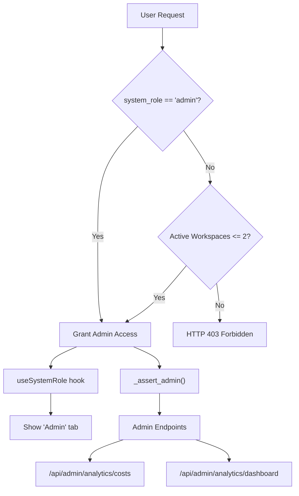
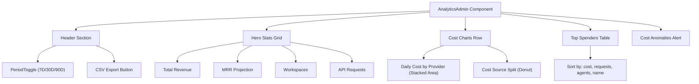
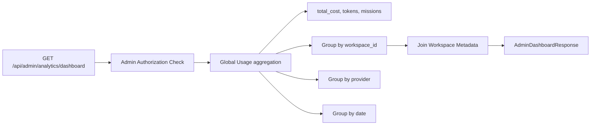
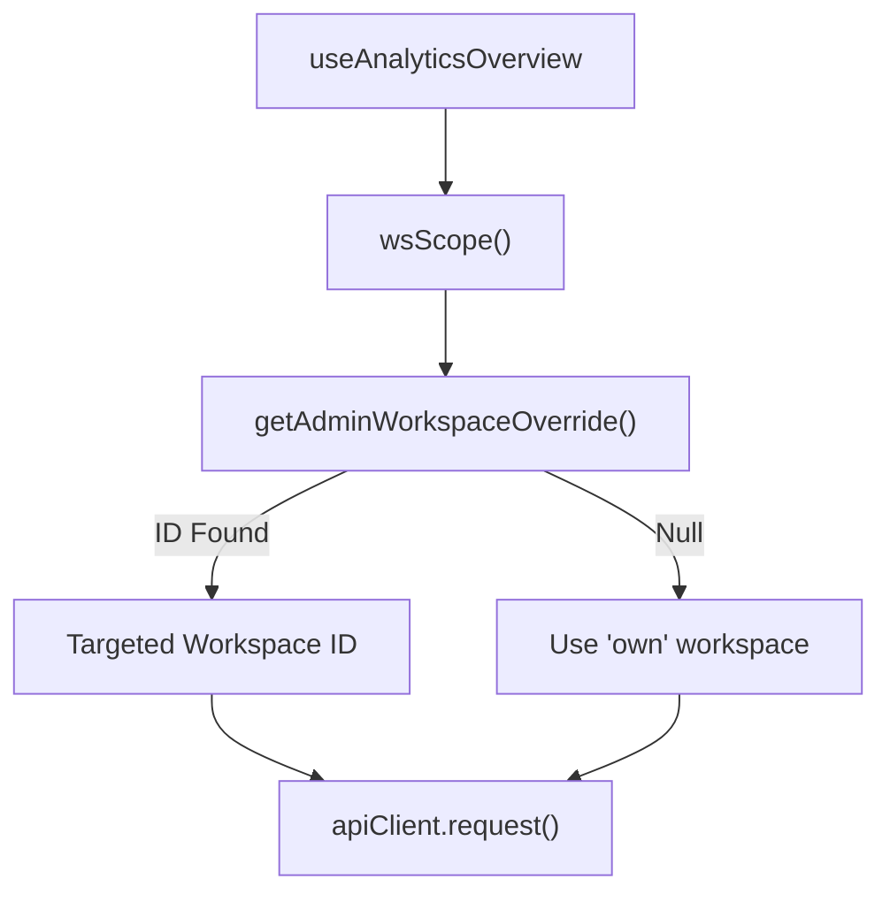

# Admin Analytics

Relevant source files

The following files were used as context for generating this wiki page:

- [docs/PRDS/52-UNIFIED-ANALYTICS.md](docs/PRDS/52-UNIFIED-ANALYTICS.md)
- [frontend/app/analytics/page.tsx](frontend/app/analytics/page.tsx)
- [frontend/components/analytics/analytics-admin.tsx](frontend/components/analytics/analytics-admin.tsx)
- [frontend/components/analytics/analytics-agents.tsx](frontend/components/analytics/analytics-agents.tsx)
- [frontend/components/analytics/analytics-documents.tsx](frontend/components/analytics/analytics-documents.tsx)
- [frontend/components/analytics/analytics-memory.tsx](frontend/components/analytics/analytics-memory.tsx)
- [frontend/components/analytics/analytics-overview.tsx](frontend/components/analytics/analytics-overview.tsx)
- [frontend/components/analytics/analytics-plan-usage.tsx](frontend/components/analytics/analytics-plan-usage.tsx)
- [frontend/components/analytics/analytics-recommendations.tsx](frontend/components/analytics/analytics-recommendations.tsx)
- [frontend/components/analytics/analytics-workflows.tsx](frontend/components/analytics/analytics-workflows.tsx)
- [frontend/hooks/use-unified-analytics.ts](frontend/hooks/use-unified-analytics.ts)
- [frontend/tsconfig.tsbuildinfo](frontend/tsconfig.tsbuildinfo)

This document describes the admin-only analytics dashboard that provides platform-wide visibility across all workspaces. Admin Analytics aggregates cost, usage, and revenue metrics for operational monitoring and billing insights. For workspace-scoped analytics (agents, workflows, documents, costs), see [Analytics & Monitoring](#16).

---

## Purpose and Scope

Admin Analytics is a specialized view within the unified analytics system that serves platform administrators and operators. It provides:

- **Platform-wide aggregation**: Total costs, tokens, and missions across all workspaces [frontend/hooks/use-unified-analytics.ts:59-66]().
- **Revenue tracking**: MRR projections, BYOK vs platform cost split, and workspace billing distribution [frontend/components/analytics/analytics-admin.tsx:196-206]().
- **Operational monitoring**: Top spenders, cost anomalies, and plan distribution (Starter, Pilot, Pro, Enterprise) [frontend/components/analytics/analytics-admin.tsx:54-66]().
- **Multi-tenant visibility**: Per-workspace breakdown with drill-down capability using admin overrides [frontend/hooks/use-unified-analytics.ts:12-14]().

This view is accessible only to users with administrative privileges or in bootstrap mode. Regular workspace users see workspace-scoped analytics tabs instead [docs/PRDS/52-UNIFIED-ANALYTICS.md:50-56]().

Sources: [frontend/components/analytics/analytics-admin.tsx:1-206](), [frontend/hooks/use-unified-analytics.ts:12-100](), [docs/PRDS/52-UNIFIED-ANALYTICS.md:48-76]()

---

## Access Control Architecture

Admin access is enforced through a combination of frontend role checks and backend assertions.

Title: Admin Access Flow

### Admin Access Logic

1.  **Backend Authorization**: Validates administrative roles from the request context. A bootstrap bypass exists for single-tenant or new deployments where limited active workspaces exist in the database [docs/PRDS/52-UNIFIED-ANALYTICS.md:41-45]().
2.  **Frontend Visibility**: The `AnalyticsPage` component conditionally renders the "Admin" tab. Role detection is typically handled by identity providers or system role hooks [docs/PRDS/52-UNIFIED-ANALYTICS.md:91-101]().

**Bootstrap Mode**: This mode allows the initial setup of a deployment before administrative roles are formally assigned. Once the workspace threshold is exceeded, strict role enforcement applies to protect multi-tenant data [docs/PRDS/52-UNIFIED-ANALYTICS.md:41-45]().

Sources: [docs/PRDS/52-UNIFIED-ANALYTICS.md:41-101](), [frontend/components/analytics/analytics-admin.tsx:1-25]()

---

## Dashboard Component Structure

The `AnalyticsAdmin` component serves as the primary container for platform-wide metrics.

Title: Admin Analytics UI Structure

### State Management
The component tracks the selected `period` ('7d', '30d', '90d') to drive API requests [frontend/components/analytics/analytics-admin.tsx:165](). It also manages sorting state for the spenders table (`spenderSort`, `spenderDir`) [frontend/components/analytics/analytics-admin.tsx:173-174]().

### Data Hooks
Admin data is fetched using React Query hooks defined in `use-unified-analytics.ts`:
- `useAdminDashboard(period)`: Fetches high-level platform overview [frontend/hooks/use-unified-analytics.ts:42]().
- `useAdminWorkspaceAnalytics(days)`: Fetches per-workspace usage metrics [frontend/hooks/use-unified-analytics.ts:39]().
- `useAdminCostAnalytics(period)`: Fetches platform-wide cost breakdowns [frontend/hooks/use-unified-analytics.ts:40]().

Sources: [frontend/components/analytics/analytics-admin.tsx:164-180](), [frontend/hooks/use-unified-analytics.ts:18-43]()

---

## Key Metrics and Calculations

### Revenue and Cost Metrics

**Total Platform Cost**
The system aggregates usage across all workspaces for the selected period. This includes `llm_usage` summaries and agent-specific costs [frontend/hooks/use-unified-analytics.ts:70-73]().

**MRR Projection**
Calculated by extrapolating the daily average spend or subscription revenue over the current period to a monthly window [frontend/components/analytics/analytics-admin.tsx:196-206]().

**Plan Distribution**
The system tracks workspaces across four tiers: `starter`, `pilot`, `pro`, and `enterprise`. These are visualized using specific color mappings [frontend/components/analytics/analytics-admin.tsx:54-66]().

### Plan Usage Monitoring
The `AnalyticsPlanUsage` component tracks current consumption against defined quotas for agents, storage, and API calls [frontend/components/analytics/analytics-plan-usage.tsx:74-90]().

Sources: [frontend/hooks/use-unified-analytics.ts:59-75](), [frontend/components/analytics/analytics-admin.tsx:54-206](), [frontend/components/analytics/analytics-plan-usage.tsx:9-113]()

---

## Data Aggregation Flow

The data flow bridges high-level UI requests to complex backend aggregations.

Title: Admin Analytics Data Pipeline

**Unified Hooks Layer**
The `use-unified-analytics.ts` file consolidates multiple API calls (Agents, LLM Summary, Workflows, Documents, Missions) into a single logical overview for the frontend [frontend/hooks/use-unified-analytics.ts:59-66]().

Sources: [frontend/hooks/use-unified-analytics.ts:46-106](), [docs/PRDS/52-UNIFIED-ANALYTICS.md:40-45]()

---

## Visualizations

### Daily Cost by Provider
A stacked area chart displaying daily spend per LLM provider (e.g., OpenAI, Anthropic, OpenRouter). The chart uses `PROVIDER_COLORS` to differentiate series [frontend/components/analytics/analytics-admin.tsx:49-52]().

### Plan Distribution
A donut chart visualizing the breakdown of workspaces by their subscription tier. Colors are mapped via `PLAN_DONUT_COLORS` [frontend/components/analytics/analytics-admin.tsx:61-66]().

### Top Spenders Table
A sortable table displaying workspace names, agent counts, request volumes, and total costs. It allows administrators to identify high-volume tenants quickly [frontend/components/analytics/analytics-admin.tsx:173-178]().

Sources: [frontend/components/analytics/analytics-admin.tsx:49-66](), [frontend/components/analytics/analytics-admin.tsx:173-178]()

---

## Admin Workspace Switching

Admins have the unique ability to "impersonate" a specific workspace to view its detailed analytics.

1.  **Override Mechanism**: The `getAdminWorkspaceOverride()` utility retrieves the targeted workspace ID from the application state [frontend/hooks/use-unified-analytics.ts:8]().
2.  **Query Scoping**: The `wsScope()` function in the hooks layer checks for this override. If present, it ensures the cache key is scoped to the overridden workspace, preventing data leakage between admin views [frontend/hooks/use-unified-analytics.ts:12-14]().

Title: Workspace Override Logic

Sources: [frontend/hooks/use-unified-analytics.ts:12-14](), [frontend/hooks/use-unified-analytics.ts:18-43]()

---

## API Reference (Admin Only)

### Admin Dashboard Summary
**Hook**: `useAdminDashboard(period)`
**Endpoint**: `/api/admin/analytics/dashboard`
**Purpose**: Returns high-level platform metrics and top spender list [frontend/hooks/use-unified-analytics.ts:42]().

### Admin Cost Analytics
**Hook**: `useAdminCostAnalytics(period)`
**Endpoint**: `/api/admin/analytics/costs`
**Purpose**: Returns detailed cost breakdown by provider and workspace [frontend/hooks/use-unified-analytics.ts:40]().

### Admin Workspace List
**Hook**: `useAdminWorkspaceAnalytics(days)`
**Endpoint**: `/api/admin/analytics/workspaces`
**Purpose**: Returns a list of all workspaces with basic usage stats for the switcher [frontend/hooks/use-unified-analytics.ts:39]().

Sources: [frontend/hooks/use-unified-analytics.ts:18-43](), [docs/PRDS/52-UNIFIED-ANALYTICS.md:40-45]()

---