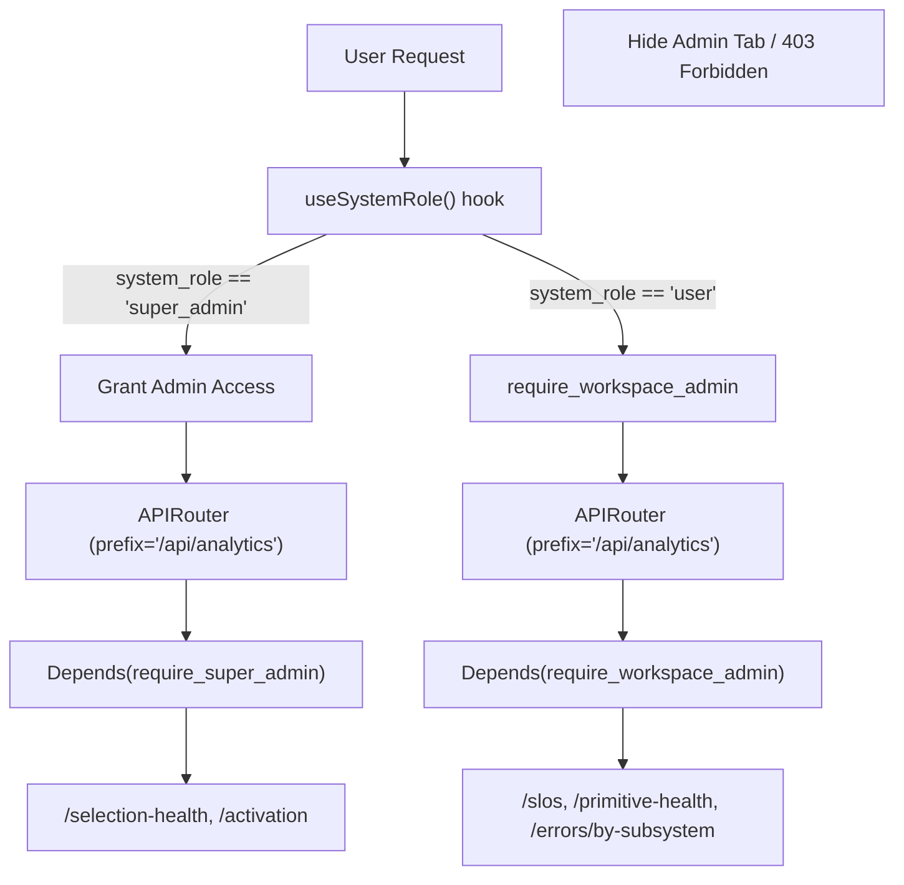
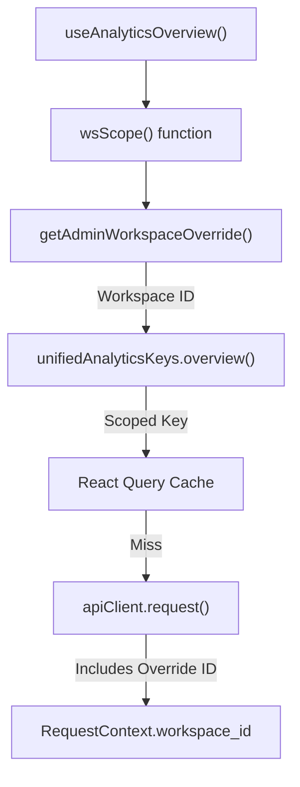

# Admin Analytics

<details>
<summary>Relevant source files</summary>

The following files were used as context for generating this wiki page:

- [docs/notes/andy-fuck-it-mode.md](docs/notes/andy-fuck-it-mode.md)
- [frontend/app/admin/workspaces/page.tsx](frontend/app/admin/workspaces/page.tsx)
- [frontend/contexts/role-context.tsx](frontend/contexts/role-context.tsx)
- [orchestrator/api/admin_workspaces.py](orchestrator/api/admin_workspaces.py)
- [orchestrator/api/analytics.py](orchestrator/api/analytics.py)
- [orchestrator/api/analytics_api.py](orchestrator/api/analytics_api.py)
- [orchestrator/api/analytics_charts.py](orchestrator/api/analytics_charts.py)
- [orchestrator/api/analytics_real.py](orchestrator/api/analytics_real.py)
- [orchestrator/api/execution_history.py](orchestrator/api/execution_history.py)
- [orchestrator/api/workflow_history.py](orchestrator/api/workflow_history.py)
- [orchestrator/core/auth/clerk.py](orchestrator/core/auth/clerk.py)
- [orchestrator/core/auth/dependencies.py](orchestrator/core/auth/dependencies.py)
- [orchestrator/core/auth/workspace_admin.py](orchestrator/core/auth/workspace_admin.py)
- [orchestrator/core/workspaces/__init__.py](orchestrator/core/workspaces/__init__.py)
- [orchestrator/services/workspace_purge.py](orchestrator/services/workspace_purge.py)
- [orchestrator/tests/test_activation_endpoint.py](orchestrator/tests/test_activation_endpoint.py)
- [orchestrator/tests/test_errors_by_subsystem_endpoint.py](orchestrator/tests/test_errors_by_subsystem_endpoint.py)
- [orchestrator/tests/test_p2w0_cockpit_reach.py](orchestrator/tests/test_p2w0_cockpit_reach.py)
- [orchestrator/tests/test_p2w2_family_gates.py](orchestrator/tests/test_p2w2_family_gates.py)
- [orchestrator/tests/test_playbook_launch_parity.py](orchestrator/tests/test_playbook_launch_parity.py)
- [orchestrator/tests/test_prd143_obs_routers_batch1.py](orchestrator/tests/test_prd143_obs_routers_batch1.py)
- [orchestrator/tests/test_primitive_health_endpoint.py](orchestrator/tests/test_primitive_health_endpoint.py)
- [orchestrator/tests/test_widget_engagement_endpoint.py](orchestrator/tests/test_widget_engagement_endpoint.py)

</details>


This document describes the admin-only analytics dashboard that provides platform-wide visibility across all workspaces. Admin Analytics aggregates cost, usage, and revenue metrics for operational monitoring and billing insights. For workspace-scoped analytics (agents, workflows, documents, costs), see [Analytics & Monitoring](#16).

---

## Purpose and Scope

Admin Analytics is a specialized view within the unified analytics system that serves platform administrators and operators. It provides:

-   **Platform-wide aggregation**: Total costs, tokens, and requests across all workspaces.
-   **Revenue tracking**: MRR projections, BYOK vs platform cost split, and workspace billing status [frontend/app/admin/workspaces/page.tsx:36-52]().
-   **Operational monitoring**: Identification of top spenders, cost anomalies, and plan distribution [frontend/app/admin/workspaces/page.tsx:36-52]().
-   **Multi-tenant visibility**: Per-workspace breakdown with drill-down capability via workspace overrides [frontend/hooks/use-unified-analytics.ts:12-14]().
-   **Primitive Health Monitoring**: Real-time status of the 8 core platform primitives (chat, memory, RAG, etc.) [orchestrator/api/analytics_real.py:160-165]().

This view is accessible only to users with elevated system roles. Regular workspace users see workspace-scoped analytics tabs instead [docs/PRDS/52-UNIFIED-ANALYTICS.md:52-55]().

Sources: [frontend/app/admin/workspaces/page.tsx:36-52](), [docs/PRDS/52-UNIFIED-ANALYTICS.md:48-56](), [frontend/hooks/use-unified-analytics.ts:1-43](), [orchestrator/api/analytics_real.py:160-165]()

---

## Access Control Architecture

Admin access is enforced through a combination of frontend role checks and backend assertions. The platform utilizes two distinct routers for analytics to separate platform-wide data from workspace-specific health data.

Title: Admin Access and Router Flow


### Admin Access Logic

1.  **Platform Admin Authorization**: Backend endpoints in `analytics_real.py` utilize the `require_super_admin` dependency for platform-wide metrics [orchestrator/api/analytics_real.py:44-45]().
2.  **Workspace Admin Authorization**: A specialized dependency `require_workspace_admin` allows workspace owners and admins to see their own health tiles (e.g., `primitive-health`) without granting access to cross-tenant data [orchestrator/core/auth/workspace_admin.py:78-88]().
3.  **Bootstrap Mode**: This mode allows initial setup of a deployment before administrative roles are formally assigned. It typically triggers when the platform detects a very low number of active workspaces (e.g., ≤2), allowing the initial user admin-level access [docs/PRDS/52-UNIFIED-ANALYTICS.md:41-44]().

Sources: [orchestrator/api/analytics_real.py:41-55](), [orchestrator/core/auth/workspace_admin.py:78-88](), [orchestrator/tests/test_prd143_obs_routers_batch1.py:1-14]()

---

## Dashboard Component Structure

The `AdminWorkspacesConsole` component serves as the primary container for platform-wide metrics related to workspaces.

Title: Admin Workspaces UI Structure
```mermaid
graph TD
    AdminWorkspacesConsole["AdminWorkspacesConsole (frontend/app/admin/workspaces/page.tsx)"]
    
    AdminWorkspacesConsole --> MainLayout["MainLayout"]
    AdminWorkspacesConsole --> SaasOnlyNotice["SaasOnlyNotice"]
    
    subgraph WorkspaceListSection["Workspace List & Filters"]
        AdminWorkspacesConsole --> SearchInput["Search Input"]
        AdminWorkspacesConsole --> IncludeDeletedToggle["Include Deleted Toggle"]
        AdminWorkspacesConsole --> SortControls["Sort Controls (created_at, name, storage_bytes, agents_count)"]
        AdminWorkspacesConsole --> RefreshButton["Refresh Button"]
        AdminWorkspacesConsole --> Pagination["Pagination"]
    end
    
    subgraph WorkspaceCard["Workspace Row (WorkspaceRow)"]
        AdminWorkspacesConsole --> WorkspaceCard
        WorkspaceCard --> NameSlug["Name & Slug"]
        WorkspaceCard --> StateBadge["State Badge (Deleted, Disabled, Enabled)"]
        WorkspaceCard --> OwnerInfo["Owner Email/Name"]
        WorkspaceCard --> Counts["Agents, Documents, Chats Counts"]
        WorkspaceCard --> Storage["Storage Bytes"]
        WorkspaceCard --> CreatedAt["Created At"]
        WorkspaceCard --> Actions["Actions (Copy ID, Pause/Resume, Delete/Restore)"]
    end
    
    subgraph Modals["Action Modals"]
        AdminWorkspacesConsole --> PauseModal["Pause Workspace Modal"]
        AdminWorkspacesConsole --> DeleteModal["Delete Workspace Confirmation"]
    end
```

### State Management
The component tracks the list of `workspaces`, `total` count, `page`, `limit`, `search` query, `includeDeleted` flag, and sorting parameters (`sort`, `order`) [frontend/app/admin/workspaces/page.tsx:116-126](). It also manages state for actions like `actionId`, `copiedId`, `pauseTarget`, `pauseReason`, `deleteTarget`, and `deleteConfirm` [frontend/app/admin/workspaces/page.tsx:128-138]().

### Data Hooks
Admin data is fetched using `apiClient.request` to the `/api/admin/workspaces` endpoint [frontend/app/admin/workspaces/page.tsx:152-154]().

Sources: [frontend/app/admin/workspaces/page.tsx:116-138](), [frontend/app/admin/workspaces/page.tsx:152-154]()

---

## Key Metrics and Performance Analytics

### Success Rate and SLOs
The system tracks a unified success rate by combining legacy `WorkflowExecution` and modern `OrchestrationRun` (Missions) data [orchestrator/api/analytics_real.py:82-97](). It also monitors three specific Service Level Objectives (SLOs) per workspace:
-   **Tool-call success rate**
-   **Board-dispatch p95 latency**
-   **Board-event freshness** [orchestrator/api/analytics_real.py:143-149]()

### Primitive Health
The "Command Center" health strip monitors 8 core primitives: `chat`, `memory`, `rag`, `nl2sql`, `graph`, `missions`, `playbooks`, and `channels` [orchestrator/tests/test_primitive_health_endpoint.py:56-59]().
-   **Latest Wins**: The system always displays the most recent `primitive_check` finding [orchestrator/tests/test_primitive_health_endpoint.py:171-174]().
-   **Honest Reporting**: If no data is available, it reports `unknown` rather than a fabricated status [orchestrator/tests/test_primitive_health_endpoint.py:136-139]().

### Widget Engagement
Admins monitor widget engagement across all sites associated with a workspace, aggregating events like `proactive_fired` and `callback_requested` [orchestrator/tests/test_widget_engagement_endpoint.py:155-168]().

Sources: [orchestrator/api/analytics_real.py:76-158](), [orchestrator/tests/test_primitive_health_endpoint.py:53-74](), [orchestrator/tests/test_widget_engagement_endpoint.py:1-18]()

---

## Admin Workspace Management

The `/api/admin/workspaces` endpoint provides comprehensive management capabilities for administrators.

Title: Admin Workspace Management Flow
```mermaid
graph TD
    AdminRequest["Admin Request (Frontend)"]
    FastAPI["FastAPI Application"]
    AdminRouter["/api/admin/workspaces APIRouter"]
    AssertAdmin["_assert_admin(ctx)"]
    DB["PostgreSQL Database"]
    S3["S3 Storage"]
    Clerk["Clerk Authentication Service"]
    BackgroundTasks["FastAPI BackgroundTasks"]
    WorkspacePurgeService["workspace_purge.py"]

    AdminRequest --> FastAPI
    FastAPI --> AdminRouter
    AdminRouter --> AssertAdmin
    AssertAdmin -- "Admin access required" --> DB

    subgraph ListWorkspaces["GET /api/admin/workspaces"]
        AdminRouter --> ListWorkspaces
        ListWorkspaces --> QueryWorkspaces["Query Workspace table"]
        QueryWorkspaces --> FilterSortPaginate["Filter, Sort, Paginate"]
        QueryWorkspaces --> BatchedCounts["Batched Count Queries (Agents, Docs, Chats)"]
        QueryWorkspaces --> OwnerLookup["Owner Lookup (User table)"]
        BatchedCounts --> WorkspaceListItem["Return List of WorkspaceListItem"]
        OwnerLookup --> WorkspaceListItem
    end

    subgraph GetWorkspaceDetail["GET /api/admin/workspaces/{workspace_id}"]
        AdminRouter --> GetWorkspaceDetail
        GetWorkspaceDetail --> FetchWorkspace["Fetch Workspace by ID"]
        FetchWorkspace --> AggregateCounts["Aggregate all related counts (Messages, etc.)"]
        AggregateCounts --> WorkspaceDetail["Return WorkspaceDetail"]
    end

    subgraph PauseWorkspace["POST /api/admin/workspaces/{workspace_id}/pause"]
        AdminRouter --> PauseWorkspace
        PauseWorkspace --> UpdateWorkspace["Set paused_at and paused_reason"]
    end

    subgraph ResumeWorkspace["POST /api/admin/workspaces/{workspace_id}/resume"]
        AdminRouter --> ResumeWorkspace
        ResumeWorkspace --> UpdateWorkspaceResume["Clear paused_at and paused_reason"]
    end

    subgraph SoftDeleteWorkspace["DELETE /api/admin/workspaces/{workspace_id}"]
        AdminRouter --> SoftDeleteWorkspace
        SoftDeleteWorkspace --> SetDeletedAt["Set deleted_at timestamp"]
    end

    subgraph RestoreWorkspace["POST /api/admin/workspaces/{workspace_id}/restore"]
        AdminRouter --> RestoreWorkspace
        RestoreWorkspace --> ClearDeletedAt["Clear deleted_at timestamp"]
    end

    subgraph HardDeleteWorkspace["POST /api/admin/workspaces/{workspace_id}/purge"]
        AdminRouter --> HardDeleteWorkspace
        HardDeleteWorkspace --> BackgroundTasks
        BackgroundTasks --> WorkspacePurgeService
        WorkspacePurgeService --> S3["Delete S3 objects"]
        WorkspacePurgeService --> Clerk["Delete Clerk user"]
        WorkspacePurgeService --> DB["Delete all DB rows by workspace_id"]
    end
```

### API Endpoints
-   `GET /api/admin/workspaces`: Lists all workspaces with aggregated counts (agents, documents, chats, storage) and owner information. Supports filtering, searching, sorting, and pagination [orchestrator/api/admin_workspaces.py:95-189]().
-   `GET /api/admin/workspaces/{workspace_id}`: Retrieves detailed information for a specific workspace [orchestrator/api/admin_workspaces.py:200-219]().
-   `POST /api/admin/workspaces/{workspace_id}/pause`: Pauses a workspace, setting `paused_at` and `paused_reason` [orchestrator/api/admin_workspaces.py:229-244]().
-   `POST /api/admin/workspaces/{workspace_id}/resume`: Resumes a paused workspace by clearing `paused_at` and `paused_reason` [orchestrator/api/admin_workspaces.py:254-266]().
-   `DELETE /api/admin/workspaces/{workspace_id}`: Soft-deletes a workspace by setting the `deleted_at` timestamp [orchestrator/api/admin_workspaces.py:276-288]().
-   `POST /api/admin/workspaces/{workspace_id}/restore`: Restores a soft-deleted workspace by clearing `deleted_at` [orchestrator/api/admin_workspaces.py:298-310]().
-   `POST /api/admin/workspaces/{workspace_id}/purge`: Initiates a hard-delete of a workspace, including S3 objects, Clerk user, and all database records. This runs as a background task [orchestrator/api/admin_workspaces.py:320-332]().

### Data Models
-   `WorkspaceListItem`: Pydantic model for summarized workspace data in list views [orchestrator/api/admin_workspaces.py:62-79]().
-   `WorkspaceDetail`: Extends `WorkspaceListItem` with additional details like `clerk_org_id` and `messages_count` [orchestrator/api/admin_workspaces.py:81-84]().

### Workspace Purge Service
The `workspace_purge.py` service handles the hard-deletion of workspaces. It performs the following steps:
1.  Validates the workspace is soft-deleted.
2.  Wipes all S3 objects under the workspace's prefix [orchestrator/services/workspace_purge.py:113-137]().
3.  Deletes the associated Clerk user [orchestrator/services/workspace_purge.py:149-157]().
4.  Deletes all database rows referencing the `workspace_id`, dynamically discovering tables with a `workspace_id` column [orchestrator/services/workspace_purge.py:50-74]().
5.  Deletes the `Workspace` row itself [orchestrator/services/workspace_purge.py:177-180]().

Sources: [orchestrator/api/admin_workspaces.py:1-453](), [orchestrator/services/workspace_purge.py:1-513](), [orchestrator/core/auth/dependencies.py:30-34]()

---

## Admin Workspace Switching

Admins can "impersonate" a specific workspace to view its detailed analytics without changing their global session.

Title: Workspace Override Logic


1.  **Override Mechanism**: The system allows selecting a workspace ID to override the current context [frontend/hooks/use-unified-analytics.ts:8]().
2.  **Query Scoping**: The `wsScope()` function ensures the cache key is scoped to the overridden workspace, preventing data leakage between admin views [frontend/hooks/use-unified-analytics.ts:12-14]().

Sources: [frontend/hooks/use-unified-analytics.ts:1-15](), [frontend/app/admin/workspaces/page.tsx:183-194]()

---

## Backend Analytics Implementation

The backend logic for admin analytics is split between legacy routers and the `analytics_real.py` enhanced observability tier.

### API Endpoints
-   `GET /api/analytics/dashboard/success-rate`: Combined success metrics [orchestrator/api/analytics_real.py:76]().
-   `GET /api/analytics/slos`: Workspace-scoped SLO tracking [orchestrator/api/analytics_real.py:135]().
-   `GET /api/analytics/errors/by-subsystem`: Error rate aggregation grouped by subsystem (e.g., `memory`, `tools`) [orchestrator/tests/test_errors_by_subsystem_endpoint.py:3-14]().

### Data Aggregation Logic
The backend queries the `LLMUsage` table for cost metrics and `ErrorEvent` for health metrics. `OrchestrationRun` and `OrchestrationTask` tables provide data for modern mission-based success rates [orchestrator/api/analytics_real.py:22-26]().

Sources: [orchestrator/api/analytics_real.py:1-45](), [orchestrator/tests/test_errors_by_subsystem_endpoint.py:1-18](), [orchestrator/api/analytics_real.py:88-94]()

---