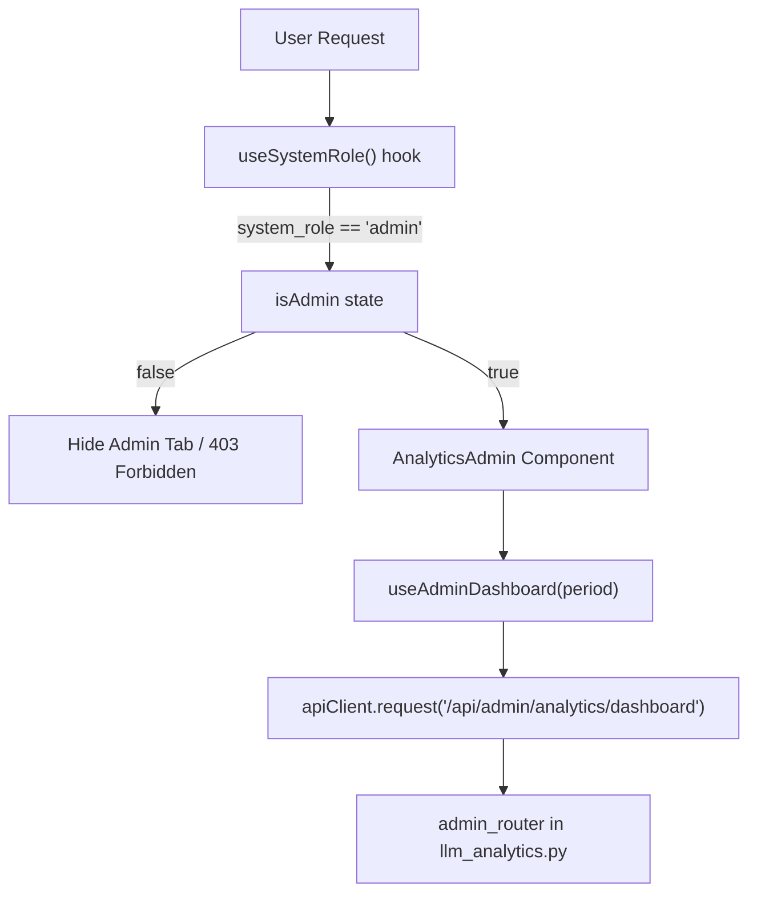
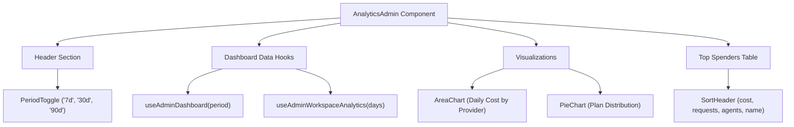
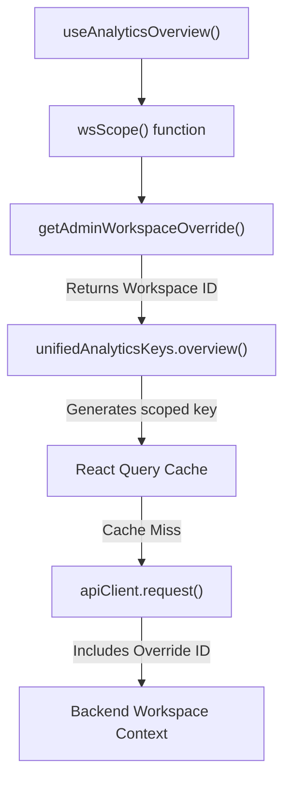

# Admin Analytics

Relevant source files

The following files were used as context for generating this wiki page:

- [docs/PRDS/52-UNIFIED-ANALYTICS.md](docs/PRDS/52-UNIFIED-ANALYTICS.md)
- [frontend/app/analytics/page.tsx](frontend/app/analytics/page.tsx)
- [frontend/components/analytics/analytics-admin.tsx](frontend/components/analytics/analytics-admin.tsx)
- [frontend/components/analytics/analytics-agents.tsx](frontend/components/analytics/analytics-agents.tsx)
- [frontend/components/analytics/analytics-costs.tsx](frontend/components/analytics/analytics-costs.tsx)
- [frontend/components/analytics/analytics-documents.tsx](frontend/components/analytics/analytics-documents.tsx)
- [frontend/components/analytics/analytics-memory.tsx](frontend/components/analytics/analytics-memory.tsx)
- [frontend/components/analytics/analytics-openrouter-credits.tsx](frontend/components/analytics/analytics-openrouter-credits.tsx)
- [frontend/components/analytics/analytics-overview.tsx](frontend/components/analytics/analytics-overview.tsx)
- [frontend/components/analytics/analytics-page.tsx](frontend/components/analytics/analytics-page.tsx)
- [frontend/components/analytics/analytics-pandas-chart.tsx](frontend/components/analytics/analytics-pandas-chart.tsx)
- [frontend/components/analytics/analytics-plan-usage.tsx](frontend/components/analytics/analytics-plan-usage.tsx)
- [frontend/components/analytics/analytics-recommendations.tsx](frontend/components/analytics/analytics-recommendations.tsx)
- [frontend/components/analytics/analytics-workflows.tsx](frontend/components/analytics/analytics-workflows.tsx)
- [frontend/components/dashboard/widgets/system-health-widget.tsx](frontend/components/dashboard/widgets/system-health-widget.tsx)
- [frontend/components/knowledge/QueryTemplatesGrid.tsx](frontend/components/knowledge/QueryTemplatesGrid.tsx)
- [frontend/components/system/rag-configuration.tsx](frontend/components/system/rag-configuration.tsx)
- [frontend/hooks/use-unified-analytics.ts](frontend/hooks/use-unified-analytics.ts)
- [orchestrator/api/llm_analytics.py](orchestrator/api/llm_analytics.py)
- [orchestrator/core/llm/openrouter_analytics.py](orchestrator/core/llm/openrouter_analytics.py)

This document describes the admin-only analytics dashboard that provides platform-wide visibility across all workspaces. Admin Analytics aggregates cost, usage, and revenue metrics for operational monitoring and billing insights. For workspace-scoped analytics (agents, workflows, documents, costs), see [Analytics & Monitoring](#16).

---

## Purpose and Scope

Admin Analytics is a specialized view within the unified analytics system that serves platform administrators and operators. It provides:

- **Platform-wide aggregation**: Total costs, tokens, and requests across all workspaces [orchestrator/api/llm_analytics.py:29]().
- **Revenue tracking**: MRR projections, plan distribution, and workspace billing status [frontend/components/analytics/analytics-admin.tsx:196-243]().
- **Operational monitoring**: Identification of top spenders, cost anomalies, and plan distribution [frontend/components/analytics/analytics-admin.tsx:224-235]().
- **Multi-tenant visibility**: Per-workspace breakdown with drill-down capability via workspace overrides [frontend/hooks/use-unified-analytics.ts:12-14]().

This view is accessible only to users with elevated system roles. Regular workspace users see workspace-scoped analytics tabs instead [frontend/components/analytics/analytics-page.tsx:39-60]().

Sources: [frontend/components/analytics/analytics-admin.tsx:1-243](), [orchestrator/api/llm_analytics.py:28-30](), [frontend/hooks/use-unified-analytics.ts:1-43]()

---

## Access Control Architecture

Admin access is enforced through a combination of frontend role checks and backend assertions.

Title: Admin Access Flow (Code Entity Mapping)

### Admin Access Logic

1.  **Backend Authorization**: Backend endpoints are registered on the `admin_router` which uses the `/api/admin/analytics` prefix [orchestrator/api/llm_analytics.py:29]().
2.  **Frontend Visibility**: The `AnalyticsPage` component conditionally includes the "Admin" tab in the `tabDefs` array only if `isAdmin` is true [frontend/components/analytics/analytics-page.tsx:59-60]().
3.  **Bootstrap Mode**: While the system role is the primary gate, the platform supports a "Bootstrap Mode" during initial setup (typically when ≤2 workspaces exist) to allow configuration before roles are finalized [docs/PRDS/52-UNIFIED-ANALYTICS.md:41-44]().

Sources: [frontend/components/analytics/analytics-page.tsx:39-60](), [orchestrator/api/llm_analytics.py:28-30](), [frontend/hooks/use-unified-analytics.ts:10-14]()

---

## Dashboard Component Structure

The `AnalyticsAdmin` component serves as the primary container for platform-wide metrics.

Title: Admin Analytics UI Structure

### State Management
The component tracks the selected `period` ('7d', '30d', '90d') to drive API requests [frontend/components/analytics/analytics-admin.tsx:165](). It also manages sorting state for the spenders table (`spenderSort`, `spenderDir`) using a `toggleSpenderSort` helper [frontend/components/analytics/analytics-admin.tsx:173-178]().

### Data Hooks
Admin data is fetched using React Query hooks defined in `use-unified-analytics.ts`:
- `useAdminDashboard(period)`: Fetches high-level platform overview [frontend/hooks/use-unified-analytics.ts:42]().
- `useAdminWorkspaceAnalytics(days)`: Fetches per-workspace usage metrics [frontend/hooks/use-unified-analytics.ts:27]().
- `useAdminCostAnalytics(period)`: Fetches platform-wide cost breakdowns [frontend/hooks/use-unified-analytics.ts:40]().

Sources: [frontend/components/analytics/analytics-admin.tsx:164-180](), [frontend/hooks/use-unified-analytics.ts:18-43]()

---

## Key Metrics and Calculations

### Revenue and Cost Metrics

| Metric | Implementation | Source |
| :--- | :--- | :--- |
| **Total Platform Cost** | Aggregated from `LLMUsage` across all workspaces. | [frontend/components/analytics/analytics-admin.tsx:196]() |
| **Plan Distribution** | Count of workspaces per plan (`starter`, `pilot`, `pro`, `enterprise`). | [frontend/components/analytics/analytics-admin.tsx:199-206]() |
| **Top Spenders** | Sortable list of workspaces by `cost`, `requests`, or `agents`. | [frontend/components/analytics/analytics-admin.tsx:173-178]() |

**Plan Visualization**
The system uses `PLAN_COLORS` and `PLAN_DONUT_COLORS` to maintain visual consistency for subscription tiers [frontend/components/analytics/analytics-admin.tsx:54-66]().

### Cost Anomaly Detection
The `AnalyticsAdmin` component identifies workspaces that represent significant cost outliers, often highlighting them in the top spenders table [frontend/components/analytics/analytics-admin.tsx:224-235]().

Sources: [frontend/components/analytics/analytics-admin.tsx:49-66](), [frontend/components/analytics/analytics-admin.tsx:196-243]()

---

## Admin Workspace Switching

Admins can "impersonate" a specific workspace to view its detailed analytics without leaving the dashboard.

1.  **Override Mechanism**: The `AdminWorkspaceSwitcher` allows selecting a workspace ID [frontend/components/analytics/analytics-page.tsx:71]().
2.  **Persistence**: The selected ID is handled via the `getAdminWorkspaceOverride()` utility [frontend/hooks/use-unified-analytics.ts:8]().
3.  **Query Scoping**: The `wsScope()` function in the hooks layer checks for this override. If present, it ensures the cache key is scoped to the overridden workspace, preventing data leakage [frontend/hooks/use-unified-analytics.ts:12-14]().

Title: Workspace Override Logic (Code Entities)

Sources: [frontend/hooks/use-unified-analytics.ts:1-15](), [frontend/components/analytics/analytics-page.tsx:48-51]()

---

## Backend Analytics Implementation

The backend logic for admin analytics is primarily located in the `llm_analytics.py` router and supporting services.

### API Endpoints
- `GET /api/admin/analytics`: Prefixed router for administrative data [orchestrator/api/llm_analytics.py:29]().
- `GET /api/analytics/llm/usage`: Token usage grouped by model, provider, or agent [orchestrator/api/llm_analytics.py:87-90]().

### Data Aggregation Logic
The backend queries the `LLMUsage` table, grouping by `workspace_id` and `provider` to calculate platform-wide burn rates [orchestrator/api/llm_analytics.py:100-126](). It also integrates with `OpenRouterAnalyticsService` to sync external usage data into the local `llm_usage` table via `sync_activity` [orchestrator/core/llm/openrouter_analytics.py:44-50]().

Sources: [orchestrator/api/llm_analytics.py:28-30](), [orchestrator/core/llm/openrouter_analytics.py:44-50](), [orchestrator/api/llm_analytics.py:87-138]()

---

## Visualizations

### Daily Cost by Provider
A stacked area chart displaying daily spend per LLM provider. The chart uses `PROVIDER_COLORS` to differentiate series [frontend/components/analytics/analytics-admin.tsx:49-52]().

### Top Spenders Table
A sortable table displaying workspace names, agent counts, request volumes, and total costs. It uses the `SortHeader` component to manage sorting state [frontend/components/analytics/analytics-admin.tsx:141-158]().

### OpenRouter Credits
Admins monitor platform-level credits through the `AnalyticsOpenRouterCredits` component, which fetches data from the OpenRouter `/credits` and `/key` endpoints [orchestrator/core/llm/openrouter_analytics.py:154-190]().

Sources: [frontend/components/analytics/analytics-admin.tsx:141-158](), [orchestrator/core/llm/openrouter_analytics.py:154-190]()

---