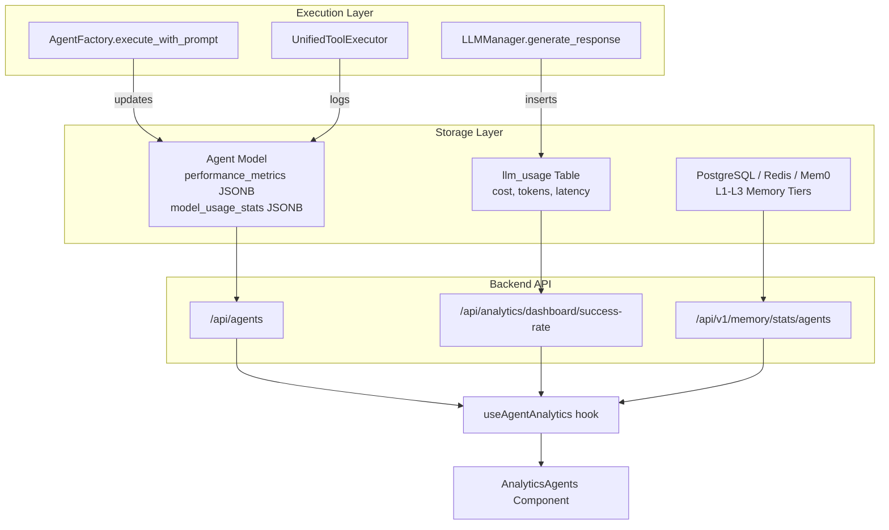
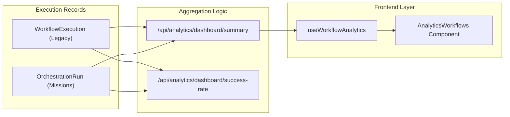

# Agent & Workflow Analytics

Relevant source files

The following files were used as context for generating this wiki page:

- [docs/PRDS/52-UNIFIED-ANALYTICS.md](docs/PRDS/52-UNIFIED-ANALYTICS.md)
- [frontend/app/analytics/page.tsx](frontend/app/analytics/page.tsx)
- [frontend/components/analytics/analytics-admin.tsx](frontend/components/analytics/analytics-admin.tsx)
- [frontend/components/analytics/analytics-agents.tsx](frontend/components/analytics/analytics-agents.tsx)
- [frontend/components/analytics/analytics-documents.tsx](frontend/components/analytics/analytics-documents.tsx)
- [frontend/components/analytics/analytics-memory.tsx](frontend/components/analytics/analytics-memory.tsx)
- [frontend/components/analytics/analytics-overview.tsx](frontend/components/analytics/analytics-overview.tsx)
- [frontend/components/analytics/analytics-plan-usage.tsx](frontend/components/analytics/analytics-plan-usage.tsx)
- [frontend/components/analytics/analytics-recommendations.tsx](frontend/components/analytics/analytics-recommendations.tsx)
- [frontend/components/analytics/analytics-workflows.tsx](frontend/components/analytics/analytics-workflows.tsx)
- [frontend/hooks/use-unified-analytics.ts](frontend/hooks/use-unified-analytics.ts)
- [frontend/lib/api-config.ts](frontend/lib/api-config.ts)
- [frontend/tsconfig.tsbuildinfo](frontend/tsconfig.tsbuildinfo)
- [orchestrator/api/analytics.py](orchestrator/api/analytics.py)
- [orchestrator/api/analytics_real.py](orchestrator/api/analytics_real.py)
- [orchestrator/api/execution_history.py](orchestrator/api/execution_history.py)
- [orchestrator/api/workflow_history.py](orchestrator/api/workflow_history.py)
- [orchestrator/consumers/workflows/__init__.py](orchestrator/consumers/workflows/__init__.py)

This page documents the analytics subsystem for tracking agent performance and workflow execution metrics. It covers how usage statistics, success rates, costs, and quality scores are collected, aggregated, and presented to users via the Unified Analytics dashboard and the Activity Command Centre.

---

## Overview

Agent and workflow analytics provide visibility into:
- **Agent Performance**: Success rates, execution times, token usage, and memory statistics.
- **Workflow Execution**: Run counts, success rates, quality scores, and duration metrics for Recipes and Missions.
- **Activity Monitoring**: Real-time tracking of chats, routines (heartbeats), and recipe executions.
- **Resource Utilization**: Per-agent memory counts, importance scores, and LLM cost attribution.

The system aggregates data from the `Agent`, `WorkflowTemplate` (Recipe), and `WorkflowExecution` models, the `LLMUsage` table, and the memory subsystem.

---

## Data Collection Architecture

### Agent & Memory Statistics Data Flow

The system merges core agent metadata with real-time usage statistics and memory tier distributions. The `useAgentAnalytics` hook orchestrates three parallel requests to build a complete profile of agent health.

Title: Agent Analytics Data Flow

**Sources:** [frontend/hooks/use-unified-analytics.ts:120-135](), [orchestrator/api/analytics_real.py:53-75](), [frontend/components/analytics/analytics-agents.tsx:162-180]()

### Workflow & Mission Data Flow

The analytics engine performs "UNION" queries across legacy `WorkflowExecution` records and the newer PRD-125 `OrchestrationRun` (Missions) to provide a unified success rate and duration metric.

Title: Unified Workflow Analytics Flow

**Sources:** [orchestrator/api/analytics.py:29-80](), [orchestrator/api/analytics_real.py:53-105](), [frontend/hooks/use-unified-analytics.ts:180-210]()

---

## Unified Analytics Dashboard

The dashboard provides high-level metrics across the entire workspace. It utilizes the `useAnalyticsOverview` hook to aggregate data from multiple services [frontend/hooks/use-unified-analytics.ts:46-66]().

### Core Metrics (StatsBar)
The `AnalyticsOverview` component displays a `StatsBar` with four primary pillars [frontend/components/analytics/analytics-overview.tsx:105-115]():
- **Agents**: Total count and number of currently active agents.
- **Missions/Workflows**: Total count and overall success rate.
- **Documents**: Total count and storage utilized (MB).
- **Monthly Cost**: Current period cost with a percentage trend vs. the previous period.

### AI Recommendations
The `AnalyticsRecommendations` component surfaces insights generated by analyzing usage patterns [frontend/components/analytics/analytics-recommendations.tsx:39-80]():
- **Cost**: Identifying expensive models or redundant agent calls.
- **Performance**: Highlighting bottlenecks or high failure rates in specific workflows.
- **Document/RAG**: Alerting when documents are uploaded but never retrieved by RAG queries [frontend/components/analytics/analytics-documents.tsx:94-111]().

**Sources:** [frontend/components/analytics/analytics-overview.tsx:63-101](), [frontend/hooks/use-unified-analytics.ts:75-102]()

---

## Agent Analytics

### Performance & Usage Details
The `AnalyticsAgents` component provides a sortable table and expanded panels for deep-diving into agent metrics [frontend/components/analytics/analytics-agents.tsx:162-180]():
- **Success Rate**: Calculated as `successful_executions / total_executions` across both workflows and missions [orchestrator/api/analytics_real.py:72-74]().
- **Token Efficiency**: Average tokens per request and total cost attribution [frontend/components/analytics/analytics-agents.tsx:113-126]().
- **Last Used**: Timestamp of the most recent interaction or memory creation [frontend/components/analytics/analytics-agents.tsx:141-148]().

### Memory Statistics
Agents track their memory footprint across the 5-layer architecture [frontend/components/analytics/analytics-agents.tsx:47-52]():
- **Memory Count**: Total number of distinct memory fragments.
- **Average Importance**: The mean `importance` score assigned to memories (0.0-1.0).
- **Tier Distribution**: Count of memories in L1 (Redis), L2 (Postgres), and L3 (Mem0) [frontend/components/analytics/analytics-agents.tsx:85-96]().

**Sources:** [frontend/hooks/use-unified-analytics.ts:110-118](), [frontend/components/analytics/analytics-agents.tsx:53-101]()

---

## Workflow & Mission Analytics

### Execution Trends
The `AnalyticsWorkflows` component visualizes performance over time using `recharts` [frontend/components/analytics/analytics-workflows.tsx:163-179]():
- **Execution Trend**: A stacked bar chart showing success vs. failure counts per day [frontend/components/analytics/analytics-workflows.tsx:176-177]().
- **Average Duration**: Mean time to complete a workflow, calculated by subtracting `started_at` from `completed_at` [orchestrator/api/analytics_real.py:112-130]().

### Recipe Performance
Recipes (Workflow Templates) are tracked for their usage and reliability [frontend/components/analytics/analytics-workflows.tsx:95-107]():
- **Use Count**: How many times a recipe has been triggered.
- **Quality Score**: A composite metric based on successful completion and accuracy.
- **Step-Level Analytics**: For legacy workflows, the 9-stage pipeline provides status and metrics (e.g., `unique_agents`, `avg_match_score`) for each stage [orchestrator/api/execution_history.py:113-160]().

**Sources:** [orchestrator/api/analytics_real.py:111-159](), [frontend/components/analytics/analytics-workflows.tsx:145-150]()

---

## Technical Implementation Details

### Multi-Tenancy (wsScope)
To ensure multi-tenant isolation, all analytics query keys are scoped by workspace ID using the `wsScope()` helper [frontend/hooks/use-unified-analytics.ts:12-14](). When an administrator switches the `adminWorkspaceOverride`, the cache is invalidated to prevent data bleeding between workspaces [frontend/hooks/use-unified-analytics.ts:10-14]().

### Admin Analytics
The `AnalyticsAdmin` component provides a platform-wide view for system administrators [frontend/components/analytics/analytics-admin.tsx:164-180]():
- **Top Spenders**: Ranking workspaces by cost, requests, or agent count [frontend/components/analytics/analytics-admin.tsx:173-178]().
- **Plan Distribution**: Breakdown of workspaces across `starter`, `pilot`, `pro`, and `enterprise` tiers [frontend/components/analytics/analytics-admin.tsx:199-206]().
- **Provider Cost**: Aggregated spend across LLM providers (OpenRouter, OpenAI, Anthropic, etc.) [frontend/components/analytics/analytics-admin.tsx:112-137]().

### Heartbeat & Channel Analytics
Proactive assistant activity is tracked separately [frontend/components/analytics/analytics-overview.tsx:39-55]():
- **Heartbeat Activity**: Total runs, successes, errors, and tokens consumed by autonomous background checks [frontend/components/analytics/analytics-overview.tsx:151-168]().
- **Channel Volume**: Message volume broken down by source (Telegram, Slack, Discord, etc.) [frontend/components/analytics/analytics-overview.tsx:57-59]().

**Sources:** [frontend/hooks/use-unified-analytics.ts:18-43](), [frontend/components/analytics/analytics-admin.tsx:49-66](), [orchestrator/api/analytics_real.py:10-32]()

---

## Analytics API Reference

| Endpoint | Method | Description |
| :--- | :--- | :--- |
| `/api/analytics/dashboard/summary` | GET | Aggregated counts for agents, workflows, and missions [orchestrator/api/analytics.py:29]() |
| `/api/analytics/dashboard/success-rate` | GET | Combined success rate and 7-day trend [orchestrator/api/analytics_real.py:53]() |
| `/api/analytics/dashboard/task-completion-time` | GET | Average execution duration across all types [orchestrator/api/analytics_real.py:111]() |
| `/api/v1/memory/stats/agents` | GET | Detailed memory tier and type stats per agent [frontend/hooks/use-unified-analytics.ts:133]() |
| `/api/execution-history/workflow/{id}/all` | GET | Paginated history of workflow executions [orchestrator/api/execution_history.py:45]() |
| `/api/heartbeat/analytics` | GET | Stats for proactive assistant runs [frontend/components/analytics/analytics-overview.tsx:45]() |

**Sources:** [orchestrator/api/analytics.py:25-34](), [orchestrator/api/analytics_real.py:32-51](), [orchestrator/api/execution_history.py:23-26]()

---