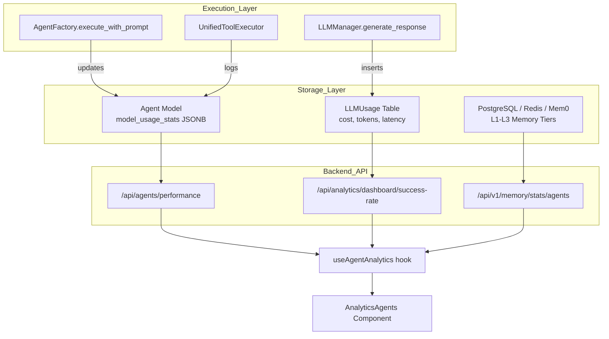
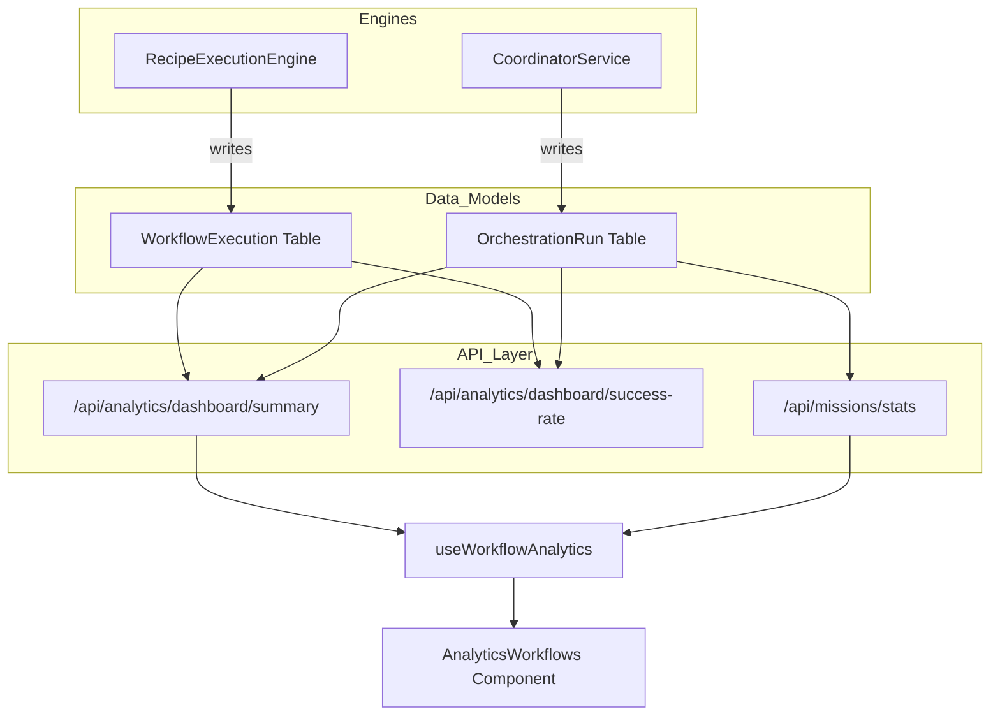

# Agent & Workflow Analytics

Relevant source files

The following files were used as context for generating this wiki page:

- [.env.example](.env.example)
- [docs/PRDS/52-UNIFIED-ANALYTICS.md](docs/PRDS/52-UNIFIED-ANALYTICS.md)
- [frontend/app/analytics/page.tsx](frontend/app/analytics/page.tsx)
- [frontend/components/agents/model-selector.tsx](frontend/components/agents/model-selector.tsx)
- [frontend/components/analytics/analytics-admin.tsx](frontend/components/analytics/analytics-admin.tsx)
- [frontend/components/analytics/analytics-agents.tsx](frontend/components/analytics/analytics-agents.tsx)
- [frontend/components/analytics/analytics-costs.tsx](frontend/components/analytics/analytics-costs.tsx)
- [frontend/components/analytics/analytics-documents.tsx](frontend/components/analytics/analytics-documents.tsx)
- [frontend/components/analytics/analytics-memory.tsx](frontend/components/analytics/analytics-memory.tsx)
- [frontend/components/analytics/analytics-openrouter-credits.tsx](frontend/components/analytics/analytics-openrouter-credits.tsx)
- [frontend/components/analytics/analytics-overview.tsx](frontend/components/analytics/analytics-overview.tsx)
- [frontend/components/analytics/analytics-page.tsx](frontend/components/analytics/analytics-page.tsx)
- [frontend/components/analytics/analytics-pandas-chart.tsx](frontend/components/analytics/analytics-pandas-chart.tsx)
- [frontend/components/analytics/analytics-plan-usage.tsx](frontend/components/analytics/analytics-plan-usage.tsx)
- [frontend/components/analytics/analytics-recommendations.tsx](frontend/components/analytics/analytics-recommendations.tsx)
- [frontend/components/analytics/analytics-workflows.tsx](frontend/components/analytics/analytics-workflows.tsx)
- [frontend/components/dashboard/widgets/system-health-widget.tsx](frontend/components/dashboard/widgets/system-health-widget.tsx)
- [frontend/components/knowledge/QueryTemplatesGrid.tsx](frontend/components/knowledge/QueryTemplatesGrid.tsx)
- [frontend/components/system/rag-configuration.tsx](frontend/components/system/rag-configuration.tsx)
- [frontend/hooks/use-model-api.ts](frontend/hooks/use-model-api.ts)
- [frontend/hooks/use-unified-analytics.ts](frontend/hooks/use-unified-analytics.ts)
- [orchestrator/api/agent_endpoints.py](orchestrator/api/agent_endpoints.py)
- [orchestrator/api/analytics.py](orchestrator/api/analytics.py)
- [orchestrator/api/analytics_real.py](orchestrator/api/analytics_real.py)
- [orchestrator/api/execution_history.py](orchestrator/api/execution_history.py)
- [orchestrator/api/llm_analytics.py](orchestrator/api/llm_analytics.py)
- [orchestrator/api/workflow_history.py](orchestrator/api/workflow_history.py)
- [orchestrator/core/llm/openrouter_analytics.py](orchestrator/core/llm/openrouter_analytics.py)

This page documents the analytics subsystem for tracking agent performance, workflow execution metrics, and mission outcomes. It covers how usage statistics, success rates, costs, and quality scores are collected, aggregated, and presented via the Unified Analytics dashboard.

---

## Overview

Agent and workflow analytics provide technical visibility into:
- **Agent Performance**: Success rates, execution times, token usage, and memory tier distribution.
- **Workflow & Mission Execution**: Run counts, success rates, and duration metrics for legacy Recipes and PRD-125 Missions.
- **Resource Utilization**: Per-agent memory counts, importance scores, and LLM cost attribution via the `llm_usage` table.
- **System Health**: Error rates by agent type, queue depth, and resource utilization efficiency.

The system aggregates data from `Agent`, `Workflow` (Recipe), `WorkflowExecution`, `OrchestrationRun` (Mission), and `LLMUsage` models.

---

## Data Collection Architecture

### Agent & Memory Statistics Data Flow

The system merges core agent metadata with real-time usage statistics and memory tier distributions. The `useAgentAnalytics` hook orchestrates three primary data streams to build a comprehensive agent profile.

**Sources:** [frontend/hooks/use-unified-analytics.ts:120-134](), [frontend/components/analytics/analytics-agents.tsx:162-165](), [orchestrator/api/analytics_real.py:16-20](), [orchestrator/api/agent_endpoints.py:188-202]()

### Workflow & Mission Data Flow

The analytics engine performs UNION queries across legacy `WorkflowExecution` and modern `OrchestrationRun` (Missions) to provide a unified success rate and performance view. This is critical for the transition from legacy recipes to the PRD-125 Mission architecture.

**Sources:** [orchestrator/api/analytics_real.py:53-75](), [frontend/hooks/use-unified-analytics.ts:59-66](), [orchestrator/api/analytics_real.py:112-144]()

---

## Agent Analytics

### Performance Metrics
Each agent tracks performance via the `useAgentAnalytics` hook, which merges data from multiple sources [frontend/hooks/use-unified-analytics.ts:120-143]():
- **`successRate`**: Percentage of successful tasks, calculated from both workflow and mission contexts [orchestrator/api/analytics_real.py:53-75]().
- **`avgRunTime`**: Mean duration of executions, weighted between legacy and mission tasks [orchestrator/api/analytics_real.py:155-158]().
- **`tokensUsed` / `cost`**: Aggregated LLM usage from the `model_usage_stats` field or the centralized `LLMUsage` table [frontend/hooks/use-unified-analytics.ts:70-73]().

### Memory Utilization
The system tracks how agents utilize the 5-layer memory architecture via `GET /api/v1/memory/stats/agents` [frontend/hooks/use-unified-analytics.ts:133]():
- **Memory Levels**: Distribution across L1 (Redis), L2 (Postgres), and L3 (Mem0) [frontend/components/analytics/analytics-agents.tsx:85-96]().
- **Memory Types**: Categorization of stored facts (e.g., `user_preference`, `task_result`) [frontend/components/analytics/analytics-agents.tsx:73-84]().
- **Importance**: Average importance score (0-1) assigned to memories, visualizing the density of "valuable" knowledge [frontend/components/analytics/analytics-agents.tsx:67-72]().

**Sources:** [frontend/hooks/use-unified-analytics.ts:110-118](), [frontend/components/analytics/analytics-agents.tsx:47-101](), [orchestrator/api/agent_endpoints.py:149-158]()

---

## Workflow & Mission Analytics

### Unified Execution Trends
The `AnalyticsWorkflows` component visualizes combined trends for legacy workflows and PRD-125 missions [frontend/components/analytics/analytics-workflows.tsx:145-150]().
- **Total Missions**: Count of `OrchestrationRun` and `Workflow` entities [frontend/hooks/use-unified-analytics.ts:86-92]().
- **Success Rate**: A weighted calculation across both execution types, including a 7-day trend analysis [orchestrator/api/analytics_real.py:72-97]().
- **Execution Trend**: A stacked bar chart showing "Success" vs "Failed" counts over time [frontend/components/analytics/analytics-workflows.tsx:153-179]().

### Recipe Quality Scoring
Recipes (Workflows) are assessed on a multi-dimensional scale within the analytics view [frontend/components/analytics/analytics-workflows.tsx:34-35]():
- **Completeness**: Ratio of finished steps in the recipe.
- **Accuracy**: Error-free execution rate.
- **Quality Score**: A normalized metric (0-100) used for ranking recipes in the workspace [frontend/components/analytics/analytics-workflows.tsx:95-107]().

**Sources:** [orchestrator/api/analytics_real.py:53-109](), [frontend/components/analytics/analytics-workflows.tsx:145-180](), [frontend/hooks/use-unified-analytics.ts:80-92]()

---

## LLM Usage & Cost Analytics

The system implements a dual-source strategy for cost tracking to ensure accuracy across internal and external provider logs.

### Usage Tracking
- **`LLMUsage` Table**: Stores granular per-request data including `input_tokens`, `output_tokens`, `latency_ms`, and `total_cost` [orchestrator/api/llm_analytics.py:21]().
- **Usage Aggregation**: Endpoints provide token usage grouped by dimension (model, provider, agent, or tier) [orchestrator/api/llm_analytics.py:87-108]().
- **OpenRouter Reconciliation**: The system reconciles local usage logs with provider-side data to ensure cost attribution is precise [frontend/hooks/use-unified-analytics.ts:70-73]().

### Cost Visualization
The `AnalyticsCosts` component provides several views for resource management:
- **Daily Cost by Model**: A multi-line chart showing spending trends per model [frontend/components/analytics/analytics-costs.tsx:146]().
- **Model Comparison**: Compares efficiency (cost/token) and latency across different LLM providers [frontend/components/analytics/analytics-costs.tsx:151]().
- **Projections**: Estimates future spend based on current period trends [frontend/components/analytics/analytics-costs.tsx:152]().

**Sources:** [orchestrator/api/llm_analytics.py:87-138](), [frontend/components/analytics/analytics-costs.tsx:144-153](), [frontend/hooks/use-unified-analytics.ts:23-25]()

---

## Technical Implementation Details

### Workspace Scoping
To ensure multi-tenant isolation, all analytics query keys are scoped by workspace ID using the `wsScope()` helper [frontend/hooks/use-unified-analytics.ts:12-14](). When an administrator switches the `adminWorkspaceOverride`, the cache is invalidated to prevent data bleeding [frontend/hooks/use-unified-analytics.ts:10-14]().

### Safe API Requests
The frontend uses a `safeRequest` wrapper to prevent a single failing analytics endpoint from crashing the dashboard [frontend/hooks/use-unified-analytics.ts:53-57](). It returns fallback values (e.g., `[]` or `null`) if an endpoint times out or returns an error [frontend/hooks/use-unified-analytics.ts:59-66]().

### Recommendations Engine
The `AnalyticsRecommendations` component surfaces actionable insights derived from usage patterns [frontend/components/analytics/analytics-recommendations.tsx:18-25]():
- **Cost Optimization**: Suggestions to switch models based on task complexity (e.g., moving simple tasks to cheaper models).
- **Performance**: Alerts for agents with high error rates or latency bottlenecks.
- **Quota Warnings**: Notifications when usage approaches workspace or provider limits.

**Sources:** [frontend/hooks/use-unified-analytics.ts:12-14](), [frontend/hooks/use-unified-analytics.ts:53-73](), [frontend/components/analytics/analytics-recommendations.tsx:32-37](), [orchestrator/api/llm_analytics.py:61-67]()

---

## Analytics API Reference

| Endpoint | Method | Description |
| :--- | :--- | :--- |
| `/api/analytics/dashboard/success-rate` | GET | Unified success rate for workflows and missions [orchestrator/api/analytics_real.py:54]() |
| `/api/analytics/dashboard/task-completion-time` | GET | Avg duration across all execution types [orchestrator/api/analytics_real.py:112]() |
| `/api/analytics/llm/usage` | GET | Token usage grouped by model, provider, or agent [orchestrator/api/llm_analytics.py:87]() |
| `/api/analytics/llm/summary` | GET | Dashboard summary including top models and cost trends [orchestrator/api/llm_analytics.py:194]() |
| `/api/v1/memory/stats/agents` | GET | Per-agent memory tier and importance stats [frontend/hooks/use-unified-analytics.ts:133]() |
| `/api/missions/stats` | GET | Mission-specific duration and token metrics [frontend/hooks/use-unified-analytics.ts:65]() |
| `/api/agents/{id}/performance` | GET | Detailed performance metrics for a specific agent [orchestrator/api/agent_endpoints.py:188]() |

**Sources:** [orchestrator/api/analytics_real.py:32-112](), [orchestrator/api/llm_analytics.py:87-200](), [frontend/hooks/use-unified-analytics.ts:18-43](), [orchestrator/api/agent_endpoints.py:188-220]()

---